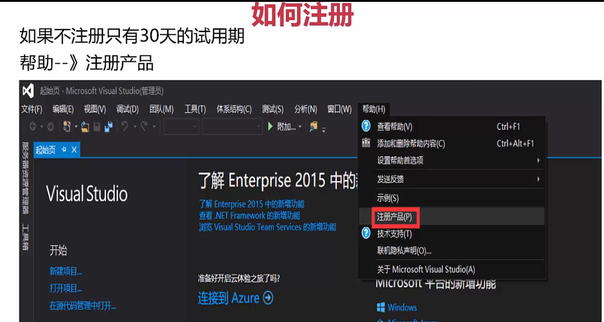

 

 ##  基础知识点

####  编译、链接的过程


####  数据类型

* 1byte = 8bits
* short类型  2byte    存储范围[-2^15, 2^15-1]  [ -32768 , 32767]
* int 类型      4byte


####  安装IDE

> 一下以vs2015为例

* 启动


* 创建项目


* 编辑选项


* 生成选项


* 项目配置选项


* 调试选项


* 如何注册




####  vs2019快捷键

[vs2019快捷键](https://blog.csdn.net/qq_41979507/article/details/106188486)

* 光标选中函数名，点`F1`可以在网页中打开函数的使用方式

##  基础容器

###  数组

* 计算数组长度

```c++
int a[] = {1,2,3,4};
int len = sizeof(a) / szieof(a[0]);   //sizeof是c++自带函数 sizeof计算的是字节（byte）数，int是4字节，所以sizeof(a)：16  szieof(a[0]：4
//数组名:a指向数组第一个元素，不可更改
```

####  动态数组vector

> vector是面向对象方式的动态数组
>
> 可以实现动态扩容插入元素

* `vec.push_back()`：在尾部添加元素
* `vec.capacity()`: 获取数组可容纳的元素个数（不是剩余可容纳的元素，是数组一共可容纳的元素）， 会随着扩容发生变化
* `vec.size()`: 获取数组当前元素个数
* `vec.end()`: 获取数组结束位置的下标（即数组长度）
* `vec.insert(插入的位置, 插入的元素)`: 在中间位置插入元素
* `vec.pop_back()`: 删除最后一个元素
* `vec.erase(vec.end()-2)`: 删除倒数第二个元素

```c++
#include <iostream>
#include <vector>

using namespace std;

int main()
{   
    vector <int> vec = { 1,2,3,4 };
    vec.push_back(5);
    cout << "capacity:" << vec.capacity() << endl;
    for (int i = 0; i < vec.size(); i++) 
    {
        cout << vec[i] << endl;
    }
    vec.insert(--vec.end(), 6)//在倒数第二个位置插入元素
    return 0;
}
```


###  字符串

> [c和c++字符串比较](https://blog.csdn.net/manonghouyiming/article/details/79827040)

####  c中的字符串

* 字符串本质是字符数组
  * `''`单引号是字符
  * `""`双引号是字符串

```c++
char c1 = 0;   //地址：Ox00
char c2 = '\0';//地址：Ox00
char c3 = '0'; //地址：0x30
char item[] = {"helloword"}
```

* [ASCII](https://baike.baidu.com/item/ASCII/309296?fr=aladdin)

#####  字符串的指针

```c++
#include <iostream>

using namespace std;

int main()
{   //这里的"hello"是变量
    char strHelloWorld1[11] = { "hello" }; 
    //这里的"world"是常量
    const char* pStrHelloWrold = "world"; 
    cout << strHelloWorld1 << endl;  // 打印结果： hello
    cout << pStrHelloWrold << endl;  // 打印结果： world
    cout << *strHelloWorld1 << endl; // 打印结果:  h
    cout << *pStrHelloWrold << endl; // 打印结果:  w
    cout << &strHelloWorld1 << endl; // 打印结果是指针本身的地址
    cout << &pStrHelloWrold << endl; // 打印结果是指针本身的地址
    //strHelloWorld这个指针不可变
    strHelloWorld1 = pStrHelloWrold//报错 strHelloWorld1这个指针是常量，不可做左值
    //strHelloWorld[index]的值可变;
    strHelloWorld1[1] = 'j';
    cout << strHelloWorld1 << endl;  // 打印结果： hjllo
    //pStrHelloWrold可变，
    pStrHelloWrold = strHelloWorld1;
    cout << pStrHelloWrold << endl;  // 打印结果： hjllo
    // pStrHelloWrold[index]的值可变不可变取决于所指区间的存储区域是否可变;
    pStrHelloWrold[1] = 'w';//不可修改， 因为指针指向的位置存储的值是常量 ？？？？？？？？
   
}
```

#####  <string.h>API

> [c标准库`<string.h>`](https://www.runoob.com/cprogramming/c-standard-library-string-h.html)
>
> * **以下函数都是由安全问题的，会出现缓存区溢出的问题**
>   * 推荐使用安全函数：strcpy_s()...等
> * stelen的效率可以提升，strlen是遍历判断'\0'的位置计算长度，但其实可以在创建字符串的时候就用一个变量存储字符串长度，用空间换时间

* `strlen()`：返回字符有效长度，不包括'\0'
* `strcmp(s1,s2)`: 以ASCII比较字符串大小，例：`"A"<"B ";"A"<"AB";"Apple" <"Banana"`
  * 如果s1和s2是相同的，则返回0
  * 如果s1<s2则返回值小于0;
  * 如果s1>s2则返回值大于0
* `strcpy(s1,s2)`: 将s2复制到s1中
* 复制指定长度字符串:`strncpy(s1, s2,n)`
  * 将字符串s2中前n个字符拷贝到s1的前n个位置中;
* 字符串拼接:`strcat(s1, s2)`
  * 将字符串s2接到s1后面;
* 查找字符: `strchr(s1, ch)`
  * 指向字符串s1中字符ch的第一次出现的位置;
* 查找字符串: `strstr(s1, s2)`
  * 指向字符串s1中字符串s2的第一次出现的位置;

```c++
#include <iostream>
#include <string.h>

using namespace std;

int main()
{
    int b[] = { 1,2,3,4 };
    char a[] = { "heloworld" };
    cout << "sizeof(b):" << sizeof(b) << endl;// 16
    cout << "strlen:" << strlen(a) << endl;   // 10 计算的是有效长度
    cout << "sizeof(a):" << sizeof(a) << endl;// 11 有效长度加尾部的'\0'

    return 0;
}
```

```c++
#include <iostream>
#include <string.h>

using namespace std;

const int MAX_LEN = 30;

int main()
{
    char a[] = { "hello" };
    char b[] = { "world" };
    char c[MAX_LEN] = { 0 };
    cout << "a:" << a << endl;//a:hello
    cout << "b:" << b << endl;//b:world
    cout << "c:" << c << endl;//c:
    strcpy(c, a);
    cout << "strcpy:c:" << c << endl;//strcpy:c:hello
    strncpy(c, b, 2);
    cout << "strncpy:c:" << c << endl;//strncpy:c:wollo
    strcat(c, b);
    cout << "strcat:c:" << c << endl;//strcat:c:wolloworld
    return 0;
}
```


**PS：**

* 在使用上面的`<string.h>`中的函数时，需要在编译器（vs2019）中做设置
* 项目根目录右击-点击属性-选择c/c++-选择预处理-选择右侧预处理器定义-点击编辑-在编辑内容的最下面添加`_CRT_SECURE_NO_WARNINGS`
* 以上配置可以避免警告提示


**安全API**

> 添加的了原字符串长度的信息： MIN_SIZE

* strcpy_s(b,MIN_SIZE, a)
* strncpy_s(b,MIN_SIZE, a)
* strcat_s(b,MIN_SIZE, a)

```c++
#include <iostream>
#include <string.h>

using namespace std;
const int MAX_SIZE = 8;
const int MIN_SIZE = 7;

int main()
{
    char a[] = { "helloworld" };
    char b[7] = { "world" };
    cout << "a:" << a << endl;
    cout << "b:" << b << endl;


    strcpy_s(b,MIN_SIZE, a);//安全方式 MIN_SIZE是b的最大容纳长度
    cout << "a:" << a << endl;
    cout << "b:" << b << endl;

    cout << "Hello World!\n";
}
```

####  c++中字符串

> `<string>`库

```c++
#include <iostream>
#include <string>//c++

using namespace std;

int main()
{
    //字符串定义
    string s;//定义空字符串
    string s1 = "helloworld";//定义并初始化
    string s2("hello");//构造函数
    string s3 = string("helloworld");
    //获取字符长度
    cout << s1.length() << endl;//10 string字符串没有'\0'
    cout << s1.size() << endl;//10
    cout << s1.capacity() << endl; //字符串可容纳的元素个数
    //比较字符串
    string c;
    string c1 = "helloworld";
    cout << (s == c) << endl;//1
    cout << (s1 == c1) << endl;//1
    cout << (s1 == s2) << endl;//0
    cout << (s3 != s2) << endl;//1
    //string字符串转换为c风格字符串
    const char* c_str1 = s1.c_str();
    cout <<"c_str:" << c_str1 << endl;
    cout << "c_str1[2]:"<< c_str1[2] << endl;
    //下标访问
    cout << "s1[2]:"<<s1[2] << endl;
    //字符串拷贝
    string t1 = "hello";
    string t2 = t1;
    cout << "t2:" << t2 << endl;
    //字符串链接
    string t3 = t1 + t2;
    t2 += t1;//t2 = t2 + t1
    cout << "t3:" << t3 << endl;
    cout << "t2:" << t2 << endl;
}
```

####  字符数组与数组

**数组**

* 数组名本身是一个指向数组第一个元素的指针
* 不能通过数组名一次输出数组全部元素

```c++
    int c[4] = { 0,1,2,3 };
	int* p;
	p = c;
	cout << c << endl; //打印结果：数组c的第一个元素的地址即c[0]的地址
	cout << *c << endl;//打印结果：0
	cout << p << endl; //打印结果：数组c的第一个元素的地址即c[0]的地址
	cout << *p << endl;//打印结果：0
```

**字符数组**

* 可以通过字符数组名直接输出字符串

```c++
    //这里的"hello"是变量
    char strHelloWorld1[11] = { "hello" }; 
    //这里的"world"是常量
    const char* pStrHelloWrold = "world"; 
    cout << strHelloWorld1 << endl;  // 打印结果： hello
    cout << pStrHelloWrold << endl;  // 打印结果： world
    cout << *strHelloWorld1 << endl; // 打印结果:  h
    cout << *pStrHelloWrold << endl; // 打印结果:  w
    cout << &strHelloWorld1 << endl; // 打印结果是指针本身的地址
    cout << &pStrHelloWrold << endl; // 打印结果是指针本身的地址
```


## 指针

###  常见指针

####  数组指针与指针数组

```c++
#include <iostream>

using namespace std;

int main()
{   
	int c[4] = { 0,1,2,3 };
	int* a[4];  //指针数组，a是一个数组，数组有4个元素，每个元素是一个int型的指针
	int(*b)[4]; //数组指针， b是一个指向数组的指针，这个数组有4个元素，每个元素是一个int型的值，
	int* p;
	p = c;
	cout << c << endl; //打印结果：数组c的第一个元素的地址即c[0]的地址
	cout << *c << endl;//打印结果：0
	cout << p << endl; //打印结果：数组c的第一个元素的地址即c[0]的地址
	cout << *p << endl;//打印结果：0
	cout << c[0] << endl;//打印结果：0
    
	b = &c;     //此时b是一个指向指针的指针，b存储的是c的地址，c存储的是c[0]的地址
	cout << (*b)[0] << endl; //打印结果：0  相当于c[0]
    
	//将数组c中元素复制到a中
	for (int i = 0; i < 4; i++) {
		a[i] = &(c[i]);
	}
	cout << *(a[0]) << endl;//0  相当于c[0]
}
```

####  cosnt与指针

```c++
#include <iostream>
#include <string.h>

using namespace std;
const int MAX_LEN = 8;

int main()
{
	char p[] = "chuckie";
	//p2存储的地址可变，p2指向的那一片地址的内容不可变，即指针的值可变，指针指向的内容的值不可变
	char const* p2 = "world";//等同于const char*   
	//p3存储的地址不可变, p3指向的那一片地址的内容可变
	char* const p3 = p;
	//p4存储的地址不可变，p4指向的那一片地址的内容也不可变
	char const* const p4 = "maxthon"; //等同于 const char* const
	p2 = p;
	//p3 = p; //p3不可变
	//p4 = p; //p4不可变

	unsigned int len = strnlen_s(p, MAX_LEN);
	for (unsigned int i = 0; i < len; i++) {
		//p2[i] += 1; p2指向的内容不可变
		p3[i] += 1;   //p3指向的内容可变 其实此时p2,p3都指向p， 但p2指向的内容是不可变的？？？？
		//p4[i] += 1; p4指向的内容不可变
	}
}
```

####  指向指针的指针

```c++
#include <iostream>

using namespace std;

int main()
{
	int a = 123;
	int* b = &a;
	int** d = &b; //指向指针的指针
	cout << a << endl;
	cout << &a << endl;
	cout << b << endl;
	cout << &b << endl;
	cout << d << endl;
	//打印结果
	/*123
		00F3FDDC
		00F3FDDC
		00F3FDD0
		00F3FDD0*/
}
```

####  易错指针

```c++
int *a ;
*a = 12; // 出错
```

* 没有给a赋值，系统会随机分配
  * 运气好的话:定位到一个非法地址，程序会出错，从而终止。
  * 最坏的情况:定位到一个可以访问的地址，无意修改了它,这样的错误难以捕捉，引发的错误
    可能与原先用于操作的代码完全不相干!

* 用指针进行间接访问之前，一定要非常小心，确保它已经初始化,并被恰当的赋值。

**NULL指针**

* NULL指针不指向任何内容
* 当一个指针不确定要指向什么位置时就赋值为NULL
* 在使用指针前先判断指针是否为NULL

```c++
	int a = 123;
	int* pa = NULL;//初始值不确定则设为NULL
	pa = &a;
	if (pa != NULL) {
		cout << *pa << endl; //123
	}
	pa = NULL;// 不使用时也设置为NULL
```

**野指针**

野指针即指向不确定的地址的指针

* 1.指针变量没有初始化;
* 2.已经释放不用的指针没有置NULL，如delete和free之后的指针;
* 3.指针操作超越了变量的作用范围; （指向的内存空间有生命周期，到期后就收回了，但是指针还指向那里，此时就有可能出错）

###  指针的基本运算

####  ++与--操作符

```c++
char* cp1 = cp++; //先将cp的值赋值给cp1   再计算cp自加1
char* cp2 = ++cp; //先计算cp自加1， 再将计算的结果赋值给cp1

*p2++ //先指向p2的值，再计算p2自加，*优先级高于+
    
	char a[] = "chuckie";
	char* p = a;
	cout << *p << endl; //c
	cout <<*p++ <<endl; //c
	cout << *p << endl; //h
	cout << *p << * p++ << *p << endl;//uhu
```

```c++
int a = 1, b = 2, c;
char t[] = "chuckie";
c = a++ + b;//相当于(a++) + b
//d = a++++b;//相当于a++ ++b  error
char* cp = t;
//++(*(++cp)) cp自加1地址变到t[1]的位置，再取t[1]的值，对取到的值自加1
cout<<++*++cp<<c<<endl; //打印结果： i
```


###  存储区划分

* c++中用关键字`new`、`delete`、`delete[]`创建和释放堆区变量

```c++
int a = 0; //(GVAR)全局初始化区
int* p1;   //(bss)全局未初始化区

int main() //(text)代码区
{
	//栈区变量（以栈的方式存储，即先定义的变量地址大，后定义的变量地址小）		
	int b = 1;       //(stack)栈区变量
	char s[] = "abc";//(stack)栈区变量
	int* p2 = NULL;  //(stack)栈区变量
	const char* p3 = "123456";// 123456\0在常量区, p3在(stack)栈区
	static int c = 0;//(GVAR)全局(静态)初始化区
	//new产生的变量都在堆区（以队列的方式存储，即先定义的先地址小，后定义的地址大） 配合delete使用
	p1 = new int(10);//10(heap)堆区变量  p1(bss)全局未初始化区
	p2 = new int(20);//20(heap)堆区变量  p4在栈区 
	char* p4 = new char[7];//字符串在(heap)堆区变量  p4在栈区 
	strcpy_s(p4, 7, "123456");//(text)代码区
    
    if (p1 != NULL) 
    {
		delete p1; //释放的是p1指向的堆区变量
		p1 = NULL;
	}
	if (p2 != NULL)
	{
		delete p2;
		p2 = NULL;
	}
	if (p4 != NULL)
	{
		delete[] p4; //释放指向数组的指针需要用关键字delete[]
		p4 = NULL;
	}
    
	return 0;// (text)代码区
}
```


###  智能指针

* 智能指针的核心功能是可以自动释放内存，不用开发者手动释放

####  auto_ptr

* 由new 创建堆区内容，auto_指向这个堆区内容，在auto_ptr指针销毁时，他所指向的堆区也会自动被delete 掉。
* 所有权转移:不小心把它传递给另外的智能指针，原来的指针就不再拥有这个对象了。在拷贝/赋值过程中，会直接剥夺指针对原对象对内存的控制权，
  转交给新对象，然后再将原对象指针置为nullptr。

```c++
#include "stdafx.h"
#include <string>
#include <iostream>
#include <memory> //智能指针库
using namespace std;
int main()
{
	{// 确定auto_ptr失效的范围，{}块内的代码执行完后，auto_ptr指向的内容就会释放
		// 对int使用
		auto_ptr<int> pI(new int(10));
		cout << *pI << endl;                // 10 

		// auto_ptr	C++ 17中移除	拥有严格对象所有权语义的智能指针
		// auto_ptr原理：在拷贝 / 赋值过程中，直接剥夺原对象对内存的控制权，转交给新对象，
		// 然后再将原对象指针置为nullptr（早期：NULL）。这种做法也叫管理权转移。
		// 他的缺点不言而喻，当我们再次去访问原对象时，程序就会报错，所以auto_ptr可以说实现的不好，
		// 很多企业在其库内也是要求不准使用auto_ptr。
		auto_ptr<string> languages[5] = {
			auto_ptr<string>(new string("C")),
			auto_ptr<string>(new string("Java")),
			auto_ptr<string>(new string("C++")),
			auto_ptr<string>(new string("Python")),
			auto_ptr<string>(new string("Rust"))
		};
		cout << "There are some computer languages here first time: \n";
		for (int i = 0; i < 5; ++i)
		{
			cout << *languages[i] << endl;
		}
		auto_ptr<string> pC;
		pC = languages[2]; // languges[2] loses ownership. 将所有权从languges[2]转让给pC，
		//此时languges[2]不再引用该字符串,而是变成空指针
		cout << "There are some computer languages here second time: \n";
		for (int i = 0; i < 2; ++i)
		{
				cout << *languages[i] << endl;
		}
		cout << "The winner is " << *pC << endl;
		//cout << "There are some computer languages here third time: \n";
		//for (int i = 0; i < 5; ++i)
		//{
		//	cout << *languages[i] << endl;  // 此处报错，因为*languages[2]时无法访问，此时所有权已经从languges[2]转让给pC了
		//}
	}
	return 0; 
}
```

####  unique_ptr

* unique_ptr是专属所有权所以unique_ptr管理的内存，只能被一个对象持有，不支持复制和赋值。
* 移动语义: unique_ptr禁止了拷贝语义，但有时我们也需要能够转移所有权于是提供了移动语义，即可以使用std.move()进行控制所有权的转移。

```c++
#include <memory>
#include <iostream> //智能指针库
using namespace std;
int main()
{
	// 在这个范围之外，unique_ptr被释放
	{
		auto i = unique_ptr<int>(new int(10));
		cout << *i << endl;
	}

	// unique_ptr
	auto w = std::make_unique<int>(10);
	cout << *(w.get()) << endl;                             // 10
	//auto w2 = w; // 编译错误如果想要把 w 复制给 w2, 是不可以的。
	//  因为复制从语义上来说，两个对象将共享同一块内存。

	// unique_ptr 只支持移动语义, 即如下
	auto w2 = std::move(w); // w2 获得内存所有权，w 此时等于 nullptr
	cout << ((w.get() != nullptr) ? (*w.get()) : -1) << endl;       // -1
	cout << ((w2.get() != nullptr) ? (*w2.get()) : -1) << endl;   // 10
    return 0;
}
```

####  shared_ptr

* 介绍
  * shared_ptr通过一个**引用计数**共享一个对象。
  * shared ptr是为了[解决auto _ptr在对象所有权上的局限性，在使用引用计数的机制上提供了可以共享所有权的智能指针，当然这需要额外的开销。
  * 当引用计数为0时，该对象没有被使用，可以进行析构。
* 问题
  * 循环引用:引用计数会带来循环引用的问题
  * 循环引用会导致堆里的内存无法正常回收，造成内存泄漏。

```c++
#include <memory>
#include <iostream>
using namespace std;
int main()
{
	// 在这个范围之外，unique_ptr被释放
	{
		auto i = unique_ptr<int>(new int(10));
		cout << *i << endl;
	}

	// unique_ptr
	auto w = std::make_unique<int>(10);
	cout << *(w.get()) << endl;                             // 10
	//auto w2 = w; // 编译错误如果想要把 w 复制给 w2, 是不可以的。
	//  因为复制从语义上来说，两个对象将共享同一块内存。

	// unique_ptr 只支持移动语义, 即如下
	auto w2 = std::move(w); // w2 获得内存所有权，w 此时等于 nullptr
	cout << ((w.get() != nullptr) ? (*w.get()) : -1) << endl;       // -1
	cout << ((w2.get() != nullptr) ? (*w2.get()) : -1) << endl;   // 10
    return 0;
}
```

####  weak_ptr

* weak ptr被设计为与shared ptr 共同工作，用一种观察者模式工作。
* 作用是协助shared_ptr工作，可获得资源的观测权，
* 像旁观者那样观测资源的使用情况。
* 观察者意味着weak ptr只对shared ptr进行引用，而不改变其引用计数,当被观察的shared_ptr失效后，相应的weak_ptr 也相应失效。

```c++
#include <iostream>
#include <memory>
using namespace std;
int main()
{
	//// shared_ptr 
	//{
	//	//shared_ptr 代表的是共享所有权，即多个 shared_ptr 可以共享同一块内存。
	//	auto wA = shared_ptr<int>(new int(20));
	//	{
	//		auto wA2 = wA;
	//		cout << ((wA2.get() != nullptr) ? (*wA2.get()) : -1) << endl;       // 20
	//		cout << ((wA.get() != nullptr) ? (*wA.get()) : -1) << endl;           // 20
	//		cout << wA2.use_count() << endl;                                              // 2
	//		cout << wA.use_count() << endl;                                                // 2
	//	}
	//	//cout << wA2.use_count() << endl;       //作用域外，已经销毁                                        
	//	cout << wA.use_count() << endl;                                                    // 1
	//	cout << ((wA.get() != nullptr) ? (*wA.get()) : -1) << endl;               // 20
	//	//shared_ptr 内部是利用引用计数来实现内存的自动管理，每当复制一个 shared_ptr，
	//	//	引用计数会 + 1。当一个 shared_ptr 离开作用域时，引用计数会 - 1。
	//	//	当引用计数为 0 的时候，则 delete 内存。
	//}

	// move 语法
	auto wAA = std::make_shared<int>(30);
	auto wAA2 = std::move(wAA); // 此时 wAA 等于 nullptr，wAA2.use_count() 等于 1
	cout << ((wAA.get() != nullptr) ? (*wAA.get()) : -1) << endl;          // -1
	cout << ((wAA2.get() != nullptr) ? (*wAA2.get()) : -1) << endl;      // 30
	cout << wAA.use_count() << endl;                                                  // 0
	cout << wAA2.use_count() << endl;                                                // 1
	//将 wAA 对象 move 给 wAA2，意味着 wAA 放弃了对内存的所有权和管理，此时 wAA对象等于 nullptr。
	//而 wAA2 获得了对象所有权，但因为此时 wAA 已不再持有对象，因此 wAA2 的引用计数为 1。

    return 0;
}
```

**weak_ptr解决循环引用的问题**

```c++
// demo5-11.cpp : 定义控制台应用程序的入口点。
//

#include "stdafx.h"

#include <string>
#include <iostream>
#include <memory>
using namespace std;

struct B;
struct A {
	shared_ptr<B> pb;
	~A()
	{
		cout << "~A()" << endl;
	}
};
struct B {
	shared_ptr<A> pa;
	~B()
	{
		cout << "~B()" << endl;
	}
};

// pa 和 pb 存在着循环引用，根据 shared_ptr 引用计数的原理，pa 和 pb 都无法被正常的释放。
// weak_ptr 是为了解决 shared_ptr 双向引用的问题。
struct BW;
struct AW
{
	shared_ptr<BW> pb;
	~AW()
	{
		cout << "~AW()" << endl;
	}
};
struct BW
{
	weak_ptr<AW> pa;
	~BW()
	{
		cout << "~BW()" << endl;
	}
};

void Test()
{
	cout << "Test shared_ptr and shared_ptr:  " << endl;
	shared_ptr<A> tA(new A());                                              
	shared_ptr<B> tB(new B());                                              
	cout << tA.use_count() << endl;										  //1
	cout << tB.use_count() << endl;                                       //1
	tA->pb = tB;
	tB->pa = tA;
	cout << tA.use_count() << endl;                                        // 2
	cout << tB.use_count() << endl;                                        // 2
}
void Test2()
{
	cout << "Test weak_ptr and shared_ptr:  " << endl;
	shared_ptr<AW> tA(new AW());
	shared_ptr<BW> tB(new BW());
	cout << tA.use_count() << endl;                                        // 1
	cout << tB.use_count() << endl;                                        // 1
	tA->pb = tB;
	tB->pa = tA;
	cout << tA.use_count() << endl;                                        // 1
	cout << tB.use_count() << endl;                                        // 2
}

int main()
{
	Test();   //执行结束后不会打印 ~A() ~B()  因为循环引用，内存没有被释放
	Test2();  //执行结束后会打印 ~AW() ~BW()
    return 0;
}


```

###  引用

>  是一种特殊的指针，不允许修改的指针

* 使用指针有哪些坑:
  * 1.空指针;
  * ⒉野指针;
  * 3.不知不觉改变了指针的值，却继续使用;
* 使用引用，则可以:
  * 1.不存在空引用;
  * ⒉必须初始化;
  * 3.一个引用永远指向它初始化的那个对象;
* 有了指针为什么还需要引用?
  * Bjarne Stroustrup的解释: 为了支持函数运算符重载;
* 有了引用为什么还需要指针?
  * Bjarne Stroustrup的解释: 为了兼容C语言;

```c++
#include <iostream>
#include <assert.h>
using namespace std;

// 编写一个函数，输入两个int型变量a,b
// 实现在函数内部将a,b的值进行交换。
void swap(int& a, int& b)
{
	int tmp = a;
	a = b;
	b = tmp;
}
void swap2(int* a, int* b)
{
	int tmp = *a;
	*a = *b;
	*b = tmp;
}

int main()
{
	//int x = 1, x2 = 3;
	//int& rx = x;
	//rx = 2;
	//cout << x << endl;
	//cout << rx << endl;
	//rx = x2;
	//cout << x << endl;
	//cout << rx << endl;

	// 交换变量的测试
	int a = 3, b = 4;
	swap(a, b);
	assert(a == 4 && b == 3);

	a = 3, b = 4;
	swap2(&a, &b);
	assert(a == 4 && b == 3);


    return 0;
}
```


##  面向对象

> C++使用struct、class来定义一个类
>
> * struct的默认成员枚限是public,
> * class的默认成员权限是private,
> * 除此之外，二者基本无差别;


##  多线程

**为什么要用多线程**

* 任务分解
  * 耗时的操作，任务分解，实时响应
* 数据分解
  * 充分利用多核CPU处理数据
* 数据流分解
  * 读写分离，解耦合设计

###  基本概念

* 并行： 多核
* 并发： 单核
* 可执行程序
  * windows: 扩展名为.exe的文件
  * Linux: ls -la  后缀为rwx（x执行权限）
* 进程： 运行起来的可执行程序
* 线程
  * 每个进程（执行起来的可执行程序），都有一个主线程，这个主线程是唯一的。
    * 当执行可执行程序，产生一个进程后，这个主线程就随着这个进程启动起来了。
    * ctrl+f5运行这个程序的时候，实际上是进程的主线程来执行（调用)这个main函数中的代码。
  * 线程:用来执行代码的;
    * 线程可以理解成一条代码的执行通路(道路）;
    * 除了主线程之外，可以通过自己写代码来创建其他线程，其他线程走的是别的道路，甚至去不同的地方
    * 每创建一个新线程，可以在同一个时刻，干多个不同的事(多走一条不同的代码执行路径）;
    * 多线程(并发),线程并不是越多越好
      * 每个线程，都需要一个独立的堆栈空间（1M)，线程之间的切换要保存很多中间状态;
      * 切换会耗费本该属于程序运行的时间;
      * 建议不要超过200-300个

**并发的实现方法**

* 多个进程实现并发
  * 进程之间通信
    * 同一个电脑上:管道，文件，消息对列，共享内存) ; 
    * 不同电脑上:socket通信技术;
* 在单个进程中，创建多个线程实现并发
  * 线程像轻量级的进程。每个线程都有自己独立的运行路径，但是一个进程中的所有线程共享地址空间(共享内存)
    * 全局变量，指针，引用都可以在线程之间传递，
    * 使用多线程开销远远小于多进程。
    * 共享内存带来新问题，数据一致性问题。

###  基本使用

####  c++11多线程API

* 线程ID

```c++
std::this_thread::get_id();
cout << "子线程id:" << std::this_thread::get_id()<<endl;
```

* thread
* join
* detach
* joinable

````c++
// demo2.cpp : 此文件包含 "main" 函数。程序执行将在此处开始并结束。
//

#include <iostream>
#include <thread>

using namespace std;

// 一、用函数作为可调用对象创建线程

void myprint()
{
    cout << "我的线程开始执行了" << endl;
    cout << "我的线程执行完毕了1" << endl;
    cout << "我的线程执行完毕了2" << endl;
    cout << "我的线程执行完毕了3" << endl;
    cout << "我的线程执行完毕了4" << endl;
    cout << "我的线程执行完毕了5" << endl;
    cout << "我的线程执行完毕了6" << endl;
    cout << "我的线程执行完毕了7" << endl;
    cout << "我的线程执行完毕了8" << endl;
    cout << "我的线程执行完毕了9" << endl;

}

int main()
{
    cout << "Hello World!\n";
    // 1 thread: 创建子线程并执行子线程
    thread myobj(myprint);
    // 2 joinable: 判断join和detach是否用过，用过则为false，没用则为true
    if (myobj.joinable())
    {
        cout << "1joinable===true" << endl;
    }
    else
    {
        cout << "1joinable===false" << endl;
    }
    // 3 join: 阻塞主线程，并等待子线程执行完成
    myobj.join();
    // 4 detach: 主线程不等子线程，主线程和子线程分开执行，子线程驻留后台运行
    //此时子线程相当于被C++时库接管，当子线程执行完成后，由运行时库负责清理该线程相关资源
    //myobj.detach();
    
    if (myobj.joinable())
    {
        cout << "2joinable===true" << endl;
    }
    else
    {
        cout << "2joinable===false" << endl;
    }
    cout << "I love China" << endl;
    cout << "I love China1" << endl;
    cout << "I love China2" << endl;
    cout << "I love China3" << endl;
    cout << "I love China4" << endl;
    cout << "I love China5" << endl;
    cout << "I love China6" << endl;
    cout << "I love China7" << endl;

    return 0;
}

// 二、其它创建线程的手法

// 2.1 用类对象创建线程

class TA
{
public:
	int& m_i;
	TA(int& i) :m_i(i)
	{
		cout << "TA()构造函数被执行" << endl;
	}
	TA(const TA& ta) :m_i(ta.m_i)
	{
		cout << "TA()拷贝构造函数被执行" << endl;
	}
	~TA()
	{
		cout << "~TA()析构函数被执行" << endl;
	}
	void operator()()
	{
		cout << "我的线程operator()开始执行" << endl;
		cout << "我的线程operator()执行结束" << endl;

	}
};

int main()
{
	int myi = 6;
	TA ta(myi);
	//注意使用detach时，ta是复制到子线程中的，所以即使主线程销毁，
	//子线程中的ta也不会销毁，不会影响子线程的执行
	thread myobj(ta);
    //thread myobj(std::ref(ta));//传入真引用时，下面就不能用detach()了
	myobj.join();
	// 注意使用detach时，传入ta的参数不能是指向主线程中变量的引用或者指针，
	// 因为主线程先执行完时，引用和指针指向的变量就销毁了
	// 所以容易造成错误
	//myobj.detach();
	cout << "I love China" << endl;
	return 0;
}

// 2.2 用lambda表达式创建线程

auto mylamthrad = [] {
	cout << "我的线程mylamthrad()开始执行" << endl;
	cout << "我的线程mylamthrad()执行结束" << endl;
};

int main()
{
	thread myobj(mylamthrad);
	//myobj.join();
	myobj.detach();
	cout << "I love China" << endl;
	return 0;
}
````

####  线程传参详解

> 参数传递容易出问题的主原因是：**detach()函数**。 因为detach()使得子线程有可能在主线程之后执行，而主线程销毁后，子线程中还有引用或指针指向主线程中的变量，此时就会出现问题

#####  引用和指针做参数

* 引用： 虽然是引用，但是其实还是值传递，主线程的销毁不影响子线程（不推荐使用）
* 指针：指向主线程的地址，主线程的销毁影响子线程 （不能使用指针做线程参数）

```c++
#include <iostream>
#include <thread>

using namespace std;


void myprint(const int &i, char *pmybuf)
{
    cout << "子线程" << endl;
    cout << i << endl;//此时的引用i并不是指向主线程的中的mvar，而是值传递过来的，即使主线程执行结束，也不影响子线程的执行
    cout << pmybuf << endl;//此时指针pmybuf指向主线程中的mybuf, 主线程销毁则会影响子线程
    return;

}

int main()
{
    int mvar = 1;
    int& mvary = mvar;
    char mybuf[] = "this is a test!";
    thread mytobj(myprint, mvar, mybuf);
    //mytobj.join();
    mytobj.detach();
    cout << "I love China!" << endl;

    return 0;
}

```

#####  临时对象做参数

* 值类型传参，直接用值传递，不用引用
* 对象作为参数传递，不要用指针，而是用对象传递，而且有隐式类型转换时，在传递时要**先构造临时对象**
  * 如果直接传入对象，可能在主线程销毁前，对象还没有传入子线程完成构造
  * 先构造临时对象再传入线程，则可以保证在主线程销毁前，对象已经传入子线程
    * 子线程通过引用接临时对象，如果不用引用则会多拷贝一次，浪费资源

```c++

#include <iostream>
#include <thread>

using namespace std;


void myprint(const int i, const string &pmybuf)
{
    cout << "子线程" << endl;
    cout << i << endl;//此时的引用i并不是指向主线程的中的mvar，而是值传递过来的，即使主线程执行结束，也不影响子线程的执行
    cout << pmybuf << endl;//此时指针pmybuf指向主线程中的mybuf, 主线程销毁则会影响子线程
    return;

}

int main()
{
    int mvar = 1;
    int& mvary = mvar;
    char mybuf[] = "this is a test!";
    //string(mybuf): 在传递参数时构造临时对象, 这样可以确保，在主函数销毁前，就完成了临时对象的构造
    thread mytobj(myprint, mvar, string(mybuf));//char转成string属于隐式类型转换
    //mytobj.join();
    mytobj.detach();
    cout << "I love China!" << endl;

    return 0;
}


```

##### 对象做参数

```c++
#include <iostream>
#include <thread>

using namespace std;


class A
{
public:
    mutable int m_i;// const A &pmybuf 因为引用是const的，所以在这里要设置为可修改
    A(int a) :m_i(a) { cout << "[A::A(int a)构造函数执行]" <<"thread id:"<<std::this_thread::get_id() << endl; }
    A(const A &a) :m_i(a.m_i) { cout << "[A::A(const A)拷贝构造函数执行]" << "thread id:" << std::this_thread::get_id() << endl; }
    ~A(){ cout << "[A::~A()析构函数执行]" << "thread id:" << std::this_thread::get_id() << endl; }

};

void myprint(const A &pmybuf)//注意接受要是引用，避免多次拷贝
{   //虽然此处pmybuf是引用，但是它并不指向主线中的对象，而是从主线程拷贝到子线程中的对象
    pmybuf.m_i = 199;//所以此处的修改，并不会影响主线的数据，不会有联动的效果
    cout << "子线程id:" << std::this_thread::get_id()<<endl;
    return;

}

int main()
{
    A myobj(10);
    //传递对象作为线程参数
    thread mytobj(myprint, myobj);
    mytobj.join();
    //mytobj.detach();
    cout << "I love China!" << endl;

    return 0;
}
```

######  std::ref()

* 不用std::ref()时，对象作为参数传入线程时，虽然是用引用接受对象，但是这个引用并不是真正的引用，通过这个引用在子线程中修改数据后，主线程并不会随之修改，所以并没有真正体现引用的作用
* 使用std::ref()后，可以使得子线程中的引用是指向主线程中的对象，是真正的引用，在子线程或主线程修改数据后可以实现联动。

```c++
#include <iostream>
#include <thread>

using namespace std;


class A
{
public:
    int m_i;// 可以去掉mutable
    A(int a) :m_i(a) { cout << "[A::A(int a)构造函数执行]" <<"thread id:"<<std::this_thread::get_id() << endl; }
    A(const A &a) :m_i(a.m_i) { cout << "[A::A(const A)拷贝构造函数执行]" << "thread id:" << std::this_thread::get_id() << endl; }
    ~A(){ cout << "[A::~A()析构函数执行]" << "thread id:" << std::this_thread::get_id() << endl; }

};

void myprint( A &pmybuf)//可以去掉const
{    pmybuf.m_i = 199;
    cout << "子线程id:" << std::this_thread::get_id()<<endl;
    return;

}

int main()
{
    A myobj(10);//子线程修改为199后，这里也会修改为199
    thread mytobj(myprint, std::ref(myobj));//使用std::ref
    mytobj.join();
    //mytobj.detach();
    cout << "I love China!" << endl;

    return 0;
}
```

#####  智能指针做参数

```c++
#include <iostream>
#include <thread>

using namespace std;

void myprint(unique_ptr<int> pzn)
{   //pzn和myp指向同一片地址
    //所以主线程销毁，pzn指向的地址就回收了，就会出问题
    //所以在使用智能指针作为线程参数时，不能使用detach()

}

int main()
{   
    unique_ptr<int> myp(new int(100));//创建整型独占是指针
    thread mytobj(myprint, std::move(myp));
    mytobj.join();
    //mytobj.detach();//不能用detach
    cout << "I love China!" << endl;

    return 0;
}

```

#####  成员函数做线程函数

* 使用

```c++
//thread mytobj(&类名::成员函数名,实例对象, 成员函数参数);
thread mytobj(&A::thread_work,myobj, 15);
```

* 案例

```c++
#include <iostream>
#include <thread>

using namespace std;

class A
{
public:
    int m_i;// 可以去掉mutable
    A(int a) :m_i(a) { cout << "[A::A(int a)构造函数执行]" << this << " thread id:"<<std::this_thread::get_id() << endl; }
    A(const A &a) :m_i(a.m_i) { cout << "[A::A(const A)拷贝构造函数执行]" << this << " thread id:" << std::this_thread::get_id() << endl; }
    ~A(){ cout << "[A::~A()析构函数执行]" << this << " thread id:" << std::this_thread::get_id() << endl; }

    void thread_work(int num)
    {
        cout << "子线程thread_work执行" << this << " thread id:" << std::this_thread::get_id() << endl;
    }
};


int main()
{   
    A myobj(10);
    //thread mytobj(&类名::成员函数名,实例对象, 成员函数参数);
    thread mytobj(&A::thread_work,myobj, 15);
    mytobj.join();
    //mytobj.detach();//此时传入的myobj会调用拷贝构造函数，即子线程会构造一个属于自己的对象，所以此时可以用detach
    cout << "I love China!" << endl;

    return 0;
}


```

* 不能用detach（）的情况
  * 使用了std::ref()，则子线程不会拷贝对象，而是使用主线程的对象，所以主线程销毁则不能正常访问了

```c++
int main()
{   
    A myobj(10);
    thread mytobj(&A::thread_work, &myobj, 15);//&myobj 等价于 std::ref(myobj)
    mytobj.join();
    cout << "I love China!" << endl;

    return 0;
}
```


#  图论 Graph Theory

