---
ja


title: C++
date: 2021-07-06 10:43:17
tags:
- C++
categories:
- [C++]
---

#  C++

> [c++参考手册](https://qingcms.gitee.io/cppreference/20210212/zh/)

 ##  基础知识点

####  编译、链接的过程


#####  \#pragma once

\#pragma once是一个比较常用的C/C++杂注，只要在头文件的最开始加入这条杂注，就能够保证头文件只被编译一次。

\#pragma once是[编译器](https://baike.baidu.com/item/编译器)相关的，有的编译器支持，有的编译器不支持，具体情况请查看编译器API文档，不过现在大部分编译器都有这个杂注了。

\#ifndef，#define，#endif是C/C++语言中的宏定义，通过宏定义避免文件多次编译。所以在所有支持C++语言的编译器上都是有效的，如果写的程序要跨平台，最好使用这种方式。

 

具体写法：

方式一：

\#ifndef _SOMEFILE_H_

\#define _SOMEFILE_H_

.......... // 一些声明语句

\#endif

方式二：

\#pragma once

... ... // 一些声明语句

#####  宏定义

> [C/C++ 宏定义的常见使用](https://blog.csdn.net/u010977122/article/details/89416520)


####  数据类型

> 菜鸟教程c++数据类型：https://www.runoob.com/cplusplus/cpp-data-types.html
>
> 数据类型最大可以表示范围：https://www.acwing.com/blog/content/475/

* 1byte = 8bits
* short类型  2byte    存储范围[-2^15, 2^15-1]  [ -32768 , 32767]
* int 类型      4byte


* 单位换算

```
1Byte＝8bit
位：位(bit，缩写为b）是存储器的最小单位，可以表示一位二进制数．
字节：1字节（Byte，缩写为B）由8个位组成，即1Byte＝8bit，是存储器的基本单位，通常被作为一个存储单元．
　另外，还使用千字节（KB）、兆字节（MB）、吉字节（GB）甚至太字节（TB），他们之间的换算关系为：
1KB＝1024B
1MB＝1024KB
1GB＝1024MB
1TB＝1024GB
有些人为了方便，就取第一个英文字。比如MB取M，KB取K，GB取G其实不太正确，你在电脑上就不会见到有M、K、G的只有MB、KB、GB
```


####  安装IDE

> 一下以vs2015为例

* 启动


* 创建项目


* 编辑选项


* 生成选项


* 项目配置选项


* 调试选项


* 如何注册


####  vs2019快捷键

[vs2019快捷键](https://blog.csdn.net/qq_41979507/article/details/106188486)

* 光标选中函数名，点`F1`可以在网页中打开函数的使用方式

* 代码整体往右移动：

  选中需要移动的代码：按tab键

* 代码整体往左移动：

  选中需要移动的代码：按 shift + tab键 

####  gcc与g++区别

> [gcc与g++的区别](https://blog.csdn.net/wuzheyan2008/article/details/119715526)

####  void*

> [void*的意义](https://blog.csdn.net/qingzhuyuxian/article/details/81562713)

##  库函数

###  std

####  [swap](https://qingcms.gitee.io/cppreference/20210212/zh/cpp/algorithm/swap.html)

* 可交换数组中的元素： `swap(arr[i],arr[j])`

####  [copy]()

```c++
//拷贝一个int型的数组
	int* copyIntArray(int a[], int n) {
		int* arr = new int[n]; //在堆区开辟新的数组存储空间
		copy(a, a + n, arr);//（拷贝起始指针，拷贝结束指针，拷贝到的起始指针）
		return arr;
	}
```

####  srand()  rand()

* srand()  需要随机种子 srand(time(NULL))  需要`#include <ctime>`
* rand()  返回值: 返回0至RAND_MAX之间的随机整数值，RAND_MAX的范围最小在32767之间。若用unsigned int 双字节是65535，四字节是4294967295的整数范围。且0-RAND_MAX每个数字被选中的机率是相同的。

##  基础容器

###  数组

* 计算数组长度

```c++
int a[] = {1,2,3,4};
int len = sizeof(a) / szieof(a[0]);   //sizeof是c++自带函数 sizeof计算的是字节（byte）数，int是4字节，所以sizeof(a)：16  szieof(a[0]：4
//数组名:a指向数组第一个元素，不可更改
```

####  动态数组vector

> vector是面向对象方式的动态数组
>
> 可以实现动态扩容插入元素

* `vec.push_back()`：在尾部添加元素
* `vec.capacity()`: 获取数组可容纳的元素个数（不是剩余可容纳的元素，是数组一共可容纳的元素）， 会随着扩容发生变化
* `vec.size()`: 获取数组当前元素个数
* `vec.end()`: 获取数组结束位置的下标（即数组长度）
* `vec.insert(插入的位置, 插入的元素)`: 在中间位置插入元素
* `vec.pop_back()`: 删除最后一个元素
* `vec.erase(vec.end()-2)`: 删除倒数第二个元素

```c++
#include <iostream>
#include <vector>

using namespace std;

int main()
{   
    vector <int> vec = { 1,2,3,4 };
    vec.push_back(5);
    cout << "capacity:" << vec.capacity() << endl;
    for (int i = 0; i < vec.size(); i++) 
    {
        cout << vec[i] << endl;
    }
    vec.insert(--vec.end(), 6)//在倒数第二个位置插入元素
    return 0;
}
```


###  字符串

> [c和c++字符串比较](https://blog.csdn.net/manonghouyiming/article/details/79827040)

####  c中的字符串

* 字符串本质是字符数组
  * `''`单引号是字符
  * `""`双引号是字符串

```c++
char c1 = 0;   //地址：Ox00
char c2 = '\0';//地址：Ox00
char c3 = '0'; //地址：0x30
char item[] = {"helloword"}
```

* [ASCII](https://baike.baidu.com/item/ASCII/309296?fr=aladdin)

#####  字符串的指针

```c++
#include <iostream>

using namespace std;

int main()
{   //这里的"hello"是变量
    char strHelloWorld1[11] = { "hello" }; 
    //这里的"world"是常量
    const char* pStrHelloWrold = "world"; 
    cout << strHelloWorld1 << endl;  // 打印结果： hello
    cout << pStrHelloWrold << endl;  // 打印结果： world
    cout << *strHelloWorld1 << endl; // 打印结果:  h
    cout << *pStrHelloWrold << endl; // 打印结果:  w
    cout << &strHelloWorld1 << endl; // 打印结果是指针本身的地址
    cout << &pStrHelloWrold << endl; // 打印结果是指针本身的地址
    //strHelloWorld这个指针不可变
    strHelloWorld1 = pStrHelloWrold//报错 strHelloWorld1这个指针是常量，不可做左值
    //strHelloWorld[index]的值可变;
    strHelloWorld1[1] = 'j';
    cout << strHelloWorld1 << endl;  // 打印结果： hjllo
    //pStrHelloWrold可变，
    pStrHelloWrold = strHelloWorld1;
    cout << pStrHelloWrold << endl;  // 打印结果： hjllo
    // pStrHelloWrold[index]的值可变不可变取决于所指区间的存储区域是否可变;
    pStrHelloWrold[1] = 'w';//不可修改， 因为指针指向的位置存储的值是常量 ？？？？？？？？
   
}
```

#####  <string.h>API

> [c标准库`<string.h>`](https://www.runoob.com/cprogramming/c-standard-library-string-h.html)
>
> * **以下函数都是有安全问题的，会出现缓存区溢出的问题**
>   * 推荐使用安全函数：strcpy_s()...等
> * stelen的效率可以提升，strlen是遍历判断'\0'的位置计算长度，但其实可以在创建字符串的时候就用一个变量存储字符串长度，用空间换时间

* `strlen()`：返回字符有效长度，不包括'\0'
* `strcmp(s1,s2)`: 以ASCII比较字符串大小，例：`"A"<"B ";"A"<"AB";"Apple" <"Banana"`
  * 如果s1和s2是相同的，则返回0
  * 如果s1<s2则返回值小于0;
  * 如果s1>s2则返回值大于0
* `strcpy(s1,s2)`: 将s2复制到s1中
* 复制指定长度字符串:`strncpy(s1, s2,n)`
  * 将字符串s2中前n个字符拷贝到s1的前n个位置中;
* 字符串拼接:`strcat(s1, s2)`
  * 将字符串s2接到s1后面;
* 查找字符: `strchr(s1, ch)`
  * 指向字符串s1中字符ch的第一次出现的位置;
* 查找字符串: `strstr(s1, s2)`
  * 指向字符串s1中字符串s2的第一次出现的位置;

```c++
#include <iostream>
#include <string.h>

using namespace std;

int main()
{
    int b[] = { 1,2,3,4 };
    char a[] = { "heloworld" };
    cout << "sizeof(b):" << sizeof(b) << endl;// 16
    cout << "strlen:" << strlen(a) << endl;   // 10 计算的是有效长度
    cout << "sizeof(a):" << sizeof(a) << endl;// 11 有效长度加尾部的'\0'

    return 0;
}
```

```c++
#include <iostream>
#include <string.h>

using namespace std;

const int MAX_LEN = 30;

int main()
{
    char a[] = { "hello" };
    char b[] = { "world" };
    char c[MAX_LEN] = { 0 };
    cout << "a:" << a << endl;//a:hello
    cout << "b:" << b << endl;//b:world
    cout << "c:" << c << endl;//c:
    strcpy(c, a);
    cout << "strcpy:c:" << c << endl;//strcpy:c:hello
    strncpy(c, b, 2);
    cout << "strncpy:c:" << c << endl;//strncpy:c:wollo
    strcat(c, b);
    cout << "strcat:c:" << c << endl;//strcat:c:wolloworld
    return 0;
}
```


**PS：**

* 在使用上面的`<string.h>`中的函数时，需要在编译器（vs2019）中做设置
* 项目根目录右击-点击属性-选择c/c++-选择预处理-选择右侧预处理器定义-点击编辑-在编辑内容的最下面添加`_CRT_SECURE_NO_WARNINGS`
* 以上配置可以避免警告提示


**安全API**

> 添加的了原字符串长度的信息： MIN_SIZE

* strcpy_s(b,MIN_SIZE, a)
* strncpy_s(b,MIN_SIZE, a)
* strcat_s(b,MIN_SIZE, a)

```c++
#include <iostream>
#include <string.h>

using namespace std;
const int MAX_SIZE = 8;
const int MIN_SIZE = 7;

int main()
{
    char a[] = { "helloworld" };
    char b[7] = { "world" };
    cout << "a:" << a << endl;
    cout << "b:" << b << endl;


    strcpy_s(b,MIN_SIZE, a);//安全方式 MIN_SIZE是b的最大容纳长度
    cout << "a:" << a << endl;
    cout << "b:" << b << endl;

    cout << "Hello World!\n";
}
```

####  c++中字符串

> `<string>`库

```c++
#include <iostream>
#include <string>//c++

using namespace std;

int main()
{
    //字符串定义
    string s;//定义空字符串
    string s1 = "helloworld";//定义并初始化
    string s2("hello");//构造函数
    string s3 = string("helloworld");
    //获取字符长度
    cout << s1.length() << endl;//10 string字符串没有'\0'
    cout << s1.size() << endl;//10
    cout << s1.capacity() << endl; //字符串可容纳的元素个数
    //比较字符串
    string c;
    string c1 = "helloworld";
    cout << (s == c) << endl;//1
    cout << (s1 == c1) << endl;//1
    cout << (s1 == s2) << endl;//0
    cout << (s3 != s2) << endl;//1
    //string字符串转换为c风格字符串
    const char* c_str1 = s1.c_str();
    cout <<"c_str:" << c_str1 << endl;
    cout << "c_str1[2]:"<< c_str1[2] << endl;
    //下标访问
    cout << "s1[2]:"<<s1[2] << endl;
    //字符串拷贝
    string t1 = "hello";
    string t2 = t1;
    cout << "t2:" << t2 << endl;
    //字符串链接
    string t3 = t1 + t2;
    t2 += t1;//t2 = t2 + t1
    cout << "t3:" << t3 << endl;
    cout << "t2:" << t2 << endl;
}
```

####  字符数组与数组

**数组**

* 数组名本身是一个指向数组第一个元素的指针
* 不能通过数组名一次输出数组全部元素

```c++
    int c[4] = { 0,1,2,3 };
	int* p;
	p = c;
	cout << c << endl; //打印结果：数组c的第一个元素的地址即c[0]的地址
	cout << *c << endl;//打印结果：0
	cout << p << endl; //打印结果：数组c的第一个元素的地址即c[0]的地址
	cout << *p << endl;//打印结果：0
```

**字符数组**

* 可以通过字符数组名直接输出字符串

```c++
    //这里的"hello"是变量
    char strHelloWorld1[11] = { "hello" }; 
    //这里的"world"是常量
    const char* pStrHelloWrold = "world"; 
    cout << strHelloWorld1 << endl;  // 打印结果： hello
    cout << pStrHelloWrold << endl;  // 打印结果： world
    cout << *strHelloWorld1 << endl; // 打印结果:  h
    cout << *pStrHelloWrold << endl; // 打印结果:  w
    cout << &strHelloWorld1 << endl; // 打印结果是指针本身的地址
    cout << &pStrHelloWrold << endl; // 打印结果是指针本身的地址
```


## 指针

###  嵌入式指针

> 使用场景：内存分配，内存管理

> https://blog.csdn.net/qq_42604176/article/details/113871565

###  常见指针

####  数组指针与指针数组

```c++
#include <iostream>

using namespace std;

int main()
{   
	int c[4] = { 0,1,2,3 };
	int* a[4];  //指针数组，a是一个数组，数组有4个元素，每个元素是一个int型的指针
	int(*b)[4]; //数组指针， b是一个指向数组的指针，这个数组有4个元素，每个元素是一个int型的值，
	int* p;
	p = c;
	cout << c << endl; //打印结果：数组c的第一个元素的地址即c[0]的地址
	cout << *c << endl;//打印结果：0
	cout << p << endl; //打印结果：数组c的第一个元素的地址即c[0]的地址
	cout << *p << endl;//打印结果：0
	cout << c[0] << endl;//打印结果：0
    
	b = &c;     //此时b是一个指向指针的指针，b存储的是c的地址，c存储的是c[0]的地址
	cout << (*b)[0] << endl; //打印结果：0  相当于c[0]
    
	//将数组c中元素复制到a中
	for (int i = 0; i < 4; i++) {
		a[i] = &(c[i]);
	}
	cout << *(a[0]) << endl;//0  相当于c[0]
}
```

####  cosnt与指针

```c++
#include <iostream>
#include <string.h>

using namespace std;
const int MAX_LEN = 8;

int main()
{
	char p[] = "chuckie";
	//p2存储的地址可变，p2指向的那一片地址的内容不可变，即指针的值可变，指针指向的内容的值不可变
	char const* p2 = "world";//等同于const char*   
	//p3存储的地址不可变, p3指向的那一片地址的内容可变
	char* const p3 = p;
	//p4存储的地址不可变，p4指向的那一片地址的内容也不可变
	char const* const p4 = "maxthon"; //等同于 const char* const
	p2 = p;
	//p3 = p; //p3不可变
	//p4 = p; //p4不可变

	unsigned int len = strnlen_s(p, MAX_LEN);
	for (unsigned int i = 0; i < len; i++) {
		//p2[i] += 1; p2指向的内容不可变
		p3[i] += 1;   //p3指向的内容可变 其实此时p2,p3都指向p， 但p2指向的内容是不可变的？？？？
		//p4[i] += 1; p4指向的内容不可变
	}
}
```

####  指向指针的指针

```c++
#include <iostream>

using namespace std;

int main()
{
	int a = 123;
	int* b = &a;
	int** d = &b; //指向指针的指针
	cout << a << endl;
	cout << &a << endl;
	cout << b << endl;
	cout << &b << endl;
	cout << d << endl;
	//打印结果
	/*123
		00F3FDDC
		00F3FDDC
		00F3FDD0
		00F3FDD0*/
}
```

####  易错指针

```c++
int *a ;
*a = 12; // 出错
```

* 没有给a赋值，系统会随机分配
  * 运气好的话:定位到一个非法地址，程序会出错，从而终止。
  * 最坏的情况:定位到一个可以访问的地址，无意修改了它,这样的错误难以捕捉，引发的错误
    可能与原先用于操作的代码完全不相干!

* 用指针进行间接访问之前，一定要非常小心，确保它已经初始化,并被恰当的赋值。

**NULL指针**

* NULL指针不指向任何内容
* 当一个指针不确定要指向什么位置时就赋值为NULL
* 在使用指针前先判断指针是否为NULL

```c++
	int a = 123;
	int* pa = NULL;//初始值不确定则设为NULL
	pa = &a;
	if (pa != NULL) {
		cout << *pa << endl; //123
	}
	pa = NULL;// 不使用时也设置为NULL
```

**野指针**

野指针即指向不确定的地址的指针

* 1.指针变量没有初始化;
* 2.已经释放不用的指针没有置NULL，如delete和free之后的指针;
* 3.指针操作超越了变量的作用范围; （指向的内存空间有生命周期，到期后就收回了，但是指针还指向那里，此时就有可能出错）

###  指针的基本运算

####  ++与--操作符

```c++
char* cp1 = cp++; //先将cp的值赋值给cp1   再计算cp自加1
char* cp2 = ++cp; //先计算cp自加1， 再将计算的结果赋值给cp1

*p2++ //先指向p2的值，再计算p2自加，*优先级高于+
    
	char a[] = "chuckie";
	char* p = a;
	cout << *p << endl; //c
	cout <<*p++ <<endl; //c
	cout << *p << endl; //h
	cout << *p << * p++ << *p << endl;//uhu
```

```c++
int a = 1, b = 2, c;
char t[] = "chuckie";
c = a++ + b;//相当于(a++) + b
//d = a++++b;//相当于a++ ++b  error
char* cp = t;
//++(*(++cp)) cp自加1地址变到t[1]的位置，再取t[1]的值，对取到的值自加1
cout<<++*++cp<<c<<endl; //打印结果： i
```


###  存储区划分

* c++中用关键字`new`、`delete`、`delete[]`创建和释放堆区变量

```c++
int a = 0; //(GVAR)全局初始化区
int* p1;   //(bss)全局未初始化区

int main() //(text)代码区
{
	//栈区变量（以栈的方式存储，即先定义的变量地址大，后定义的变量地址小）		
	int b = 1;       //(stack)栈区变量
	char s[] = "abc";//(stack)栈区变量
	int* p2 = NULL;  //(stack)栈区变量
	const char* p3 = "123456";// 123456\0在常量区, p3在(stack)栈区
	static int c = 0;//(GVAR)全局(静态)初始化区
	//new产生的变量都在堆区（以队列的方式存储，即先定义的先地址小，后定义的地址大） 配合delete使用
	p1 = new int(10);//10(heap)堆区变量  p1(bss)全局未初始化区
	p2 = new int(20);//20(heap)堆区变量  p4在栈区 
	char* p4 = new char[7];//字符串在(heap)堆区变量  p4在栈区 
	strcpy_s(p4, 7, "123456");//(text)代码区
    
    if (p1 != NULL) 
    {
		delete p1; //释放的是p1指向的堆区变量
		p1 = NULL;
	}
	if (p2 != NULL)
	{
		delete p2;
		p2 = NULL;
	}
	if (p4 != NULL)
	{
		delete[] p4; //释放指向数组的指针需要用关键字delete[]
		p4 = NULL;
	}
    
	return 0;// (text)代码区
}
```


###  智能指针

* 智能指针的核心功能是可以自动释放内存，不用开发者手动释放

####  auto_ptr

* 由new 创建堆区内容，auto_ptr指向这个堆区内容，在auto_ptr指针销毁时，他所指向的堆区也会自动被delete 掉。
* 所有权转移:不小心把它传递给另外的智能指针，原来的指针就不再拥有这个对象了。在拷贝/赋值过程中，会直接剥夺指针对原对象对内存的控制权，
  转交给新对象，然后再将原对象指针置为nullptr。

```c++
#include "stdafx.h"
#include <string>
#include <iostream>
#include <memory> //智能指针库
using namespace std;
int main()
{
	{// 确定auto_ptr失效的范围，{}块内的代码执行完后，auto_ptr指向的内容就会释放
		// 对int使用
		auto_ptr<int> pI(new int(10));
		cout << *pI << endl;                // 10 

		// auto_ptr	C++ 17中移除	拥有严格对象所有权语义的智能指针
		// auto_ptr原理：在拷贝 / 赋值过程中，直接剥夺原对象对内存的控制权，转交给新对象，
		// 然后再将原对象指针置为nullptr（早期：NULL）。这种做法也叫管理权转移。
		// 他的缺点不言而喻，当我们再次去访问原对象时，程序就会报错，所以auto_ptr可以说实现的不好，
		// 很多企业在其库内也是要求不准使用auto_ptr。
		auto_ptr<string> languages[5] = {
			auto_ptr<string>(new string("C")),
			auto_ptr<string>(new string("Java")),
			auto_ptr<string>(new string("C++")),
			auto_ptr<string>(new string("Python")),
			auto_ptr<string>(new string("Rust"))
		};
		cout << "There are some computer languages here first time: \n";
		for (int i = 0; i < 5; ++i)
		{
			cout << *languages[i] << endl;
		}
		auto_ptr<string> pC;
		pC = languages[2]; // languges[2] loses ownership. 将所有权从languges[2]转让给pC，
		//此时languges[2]不再引用该字符串,而是变成空指针
		cout << "There are some computer languages here second time: \n";
		for (int i = 0; i < 2; ++i)
		{
				cout << *languages[i] << endl;
		}
		cout << "The winner is " << *pC << endl;
		//cout << "There are some computer languages here third time: \n";
		//for (int i = 0; i < 5; ++i)
		//{
		//	cout << *languages[i] << endl;  // 此处报错，因为*languages[2]时无法访问，此时所有权已经从languges[2]转让给pC了
		//}
	}
	return 0; 
}
```

####  unique_ptr

* unique_ptr是专属所有权所以unique_ptr管理的内存，只能被一个对象持有，不支持复制和赋值。
* 移动语义: unique_ptr禁止了拷贝语义，但有时我们也需要能够转移所有权于是提供了移动语义，即可以使用std.move()进行控制所有权的转移。

```c++
#include <memory>
#include <iostream> //智能指针库
using namespace std;
int main()
{
	// 在这个范围之外，unique_ptr被释放
	{
		auto i = unique_ptr<int>(new int(10));
		cout << *i << endl;
	}

	// unique_ptr
	auto w = std::make_unique<int>(10);
	cout << *(w.get()) << endl;                             // 10
	//auto w2 = w; // 编译错误如果想要把 w 复制给 w2, 是不可以的。
	//  因为复制从语义上来说，两个对象将共享同一块内存。

	// unique_ptr 只支持移动语义, 即如下
	auto w2 = std::move(w); // w2 获得内存所有权，w 此时等于 nullptr
	cout << ((w.get() != nullptr) ? (*w.get()) : -1) << endl;       // -1
	cout << ((w2.get() != nullptr) ? (*w2.get()) : -1) << endl;   // 10
    return 0;
}
```

* 使用已有指针创建
  * 原始指针赋值给unique_ptr后应该置空，不能让原始指针还能修改对象

```c++
Cat* p1 = new Cat("ok");
unique_ptr up1(p1);

p1->setCont("okk");  // 此时p1还能使用，且可以修改对象，修改后up1访问也会改变， 这明显是不符合独占的
up1->print(); // okk

// 赋值给up1后应该置空
p1 = nullptr;
```

* 作为函数参数
  * 一般使用const &

```c++
#include<iostream>
#include<bits/stdc++.h>

using namespace std;

class Cat{
private:
  string name;
public:
  Cat(){
    cout<<"Cat()"<<endl;
  }
  Cat(const string& name):name(name){
    cout<<"Cat(const string& name):name(name)"<<endl;
  }
  string getName(){
    return name;
  }
  void setName(const string& name){
    this->name = name;
  }
  ~Cat(){
    cout<<"~Cat()"<<endl;
  }
};

void func(unique_ptr<Cat> cat){
  cout<<cat->getName()<<endl;
}

void func2(const unique_ptr<Cat>& cat){
  cout<<cat->getName()<<endl;
}


int main(){
  unique_ptr<Cat> cat(new Cat("Tom"));
  // func(move(cat));
  // cout<<cat->getName()<<endl; // 报错，因为所有权已经转给func了
  func2(cat);
  cout<<cat->getName()<<endl; // 成功，因为func2是const引用，不会改变cat的所有权
  return 0;
}
```


####  shared_ptr

* 介绍
  * shared_ptr通过一个**引用计数**共享一个对象。
  * shared ptr是为了[解决auto _ptr在对象所有权上的局限性，在使用引用计数的机制上提供了可以共享所有权的智能指针，当然这需要额外的开销。
  * 当引用计数为0时，该对象没有被使用，可以进行析构。
* 问题
  * 循环引用:引用计数会带来循环引用的问题
  * 循环引用会导致堆里的内存无法正常回收，造成内存泄漏。

```c++
#include <memory>
#include <iostream>
using namespace std;
int main()
{
	// 在这个范围之外，unique_ptr被释放
	{
		auto i = unique_ptr<int>(new int(10));
		cout << *i << endl;
	}

	// unique_ptr
	auto w = std::make_unique<int>(10);
	cout << *(w.get()) << endl;                             // 10
	//auto w2 = w; // 编译错误如果想要把 w 复制给 w2, 是不可以的。
	//  因为复制从语义上来说，两个对象将共享同一块内存。

	// unique_ptr 只支持移动语义, 即如下
	auto w2 = std::move(w); // w2 获得内存所有权，w 此时等于 nullptr
	cout << ((w.get() != nullptr) ? (*w.get()) : -1) << endl;       // -1
	cout << ((w2.get() != nullptr) ? (*w2.get()) : -1) << endl;   // 10
    return 0;
}
```

* 原始指针构造
  * 原始指针构造完应该置nullptr， 避免原始指针对数据的修改

```c++
class Cat{
private:
  string name;
public:
  Cat(){
    cout<<"Cat()"<<endl;
  }
  Cat(const string& name):name(name){
    cout<<"Cat(const string& name):name(name)"<<endl;
  }
  string getName(){
    return name;
  }
  void setName(const string& name){
    this->name = name;
  }
  ~Cat(){
    cout<<"~Cat()"<<endl;
  }
};

int main(){
  Cat* p1 = new Cat("okk");
  shared_ptr<Cat> p2{p1};
  cout<<"p2.use_count()="<<p2.use_count()<<endl;  // 1
  // delete p1;
  cout<<p1->getName()<<endl;
  cout<<p2->getName()<<endl;
  p1->setName("okkkkk");
  p1 = nullptr;
  cout<<"p2.use_count()="<<p2.use_count()<<endl; // 2

  cout<<p2->getName()<<endl;
  return 0;
}

// 打印
Cat(const string& name):name(name)
p2.use_count()=1
okk
okk
p2.use_count()=1
okkkkk
~Cat()
```


####  weak_ptr

* weak ptr被设计为与shared ptr 共同工作，用一种观察者模式工作。
* 作用是协助shared_ptr工作，可获得资源的观测权，
* 像旁观者那样观测资源的使用情况。
* 观察者意味着weak ptr只对shared ptr进行引用，而不改变其引用计数,当被观察的shared_ptr失效后，相应的weak_ptr 也相应失效。

```c++
#include <iostream>
#include <memory>
using namespace std;
int main()
{
	//// shared_ptr 
	//{
	//	//shared_ptr 代表的是共享所有权，即多个 shared_ptr 可以共享同一块内存。
	//	auto wA = shared_ptr<int>(new int(20));
	//	{
	//		auto wA2 = wA;
	//		cout << ((wA2.get() != nullptr) ? (*wA2.get()) : -1) << endl;       // 20
	//		cout << ((wA.get() != nullptr) ? (*wA.get()) : -1) << endl;           // 20
	//		cout << wA2.use_count() << endl;                                              // 2
	//		cout << wA.use_count() << endl;                                                // 2
	//	}
	//	//cout << wA2.use_count() << endl;       //作用域外，已经销毁                                        
	//	cout << wA.use_count() << endl;                                                    // 1
	//	cout << ((wA.get() != nullptr) ? (*wA.get()) : -1) << endl;               // 20
	//	//shared_ptr 内部是利用引用计数来实现内存的自动管理，每当复制一个 shared_ptr，
	//	//	引用计数会 + 1。当一个 shared_ptr 离开作用域时，引用计数会 - 1。
	//	//	当引用计数为 0 的时候，则 delete 内存。
	//}

	// move 语法
	auto wAA = std::make_shared<int>(30);
	auto wAA2 = std::move(wAA); // 此时 wAA 等于 nullptr，wAA2.use_count() 等于 1
	cout << ((wAA.get() != nullptr) ? (*wAA.get()) : -1) << endl;          // -1
	cout << ((wAA2.get() != nullptr) ? (*wAA2.get()) : -1) << endl;      // 30
	cout << wAA.use_count() << endl;                                                  // 0
	cout << wAA2.use_count() << endl;                                                // 1
	//将 wAA 对象 move 给 wAA2，意味着 wAA 放弃了对内存的所有权和管理，此时 wAA对象等于 nullptr。
	//而 wAA2 获得了对象所有权，但因为此时 wAA 已不再持有对象，因此 wAA2 的引用计数为 1。

    return 0;
}
```

**weak_ptr解决循环引用的问题**

```c++
// demo5-11.cpp : 定义控制台应用程序的入口点。
//

#include "stdafx.h"

#include <string>
#include <iostream>
#include <memory>
using namespace std;

struct B;
struct A {
	shared_ptr<B> pb;
	~A()
	{
		cout << "~A()" << endl;
	}
};
struct B {
	shared_ptr<A> pa;
	~B()
	{
		cout << "~B()" << endl;
	}
};

// pa 和 pb 存在着循环引用，根据 shared_ptr 引用计数的原理，pa 和 pb 都无法被正常的释放。
// weak_ptr 是为了解决 shared_ptr 双向引用的问题。
struct BW;
struct AW
{
	shared_ptr<BW> pb;
	~AW()
	{
		cout << "~AW()" << endl;
	}
};
struct BW
{
	weak_ptr<AW> pa;
	~BW()
	{
		cout << "~BW()" << endl;
	}
};

void Test()
{
	cout << "Test shared_ptr and shared_ptr:  " << endl;
	shared_ptr<A> tA(new A());                                              
	shared_ptr<B> tB(new B());                                              
	cout << tA.use_count() << endl;										  //1
	cout << tB.use_count() << endl;                                       //1
	tA->pb = tB;
	tB->pa = tA;
	cout << tA.use_count() << endl;                                        // 2
	cout << tB.use_count() << endl;                                        // 2
}
void Test2()
{
	cout << "Test weak_ptr and shared_ptr:  " << endl;
	shared_ptr<AW> tA(new AW());
	shared_ptr<BW> tB(new BW());
	cout << tA.use_count() << endl;                                        // 1
	cout << tB.use_count() << endl;                                        // 1
	tA->pb = tB;
	tB->pa = tA;
	cout << tA.use_count() << endl;                                        // 1
	cout << tB.use_count() << endl;                                        // 2
}

int main()
{
	Test();   //执行结束后不会打印 ~A() ~B()  因为循环引用，内存没有被释放
	Test2();  //执行结束后会打印 ~AW() ~BW()
    return 0;
}


```

###  引用

>  是一种特殊的指针，不允许修改的指针

* 使用指针有哪些坑:
  * 1.空指针;
  * ⒉野指针;
  * 3.不知不觉改变了指针的值，却继续使用;
* 使用引用，则可以:
  * 1.不存在空引用;
  * ⒉必须初始化;
  * 3.一个引用永远指向它初始化的那个对象;
* 有了指针为什么还需要引用?
  * Bjarne Stroustrup的解释: 为了支持函数运算符重载;
* 有了引用为什么还需要指针?
  * Bjarne Stroustrup的解释: 为了兼容C语言;

```c++
#include <iostream>
#include <assert.h>
using namespace std;

// 编写一个函数，输入两个int型变量a,b
// 实现在函数内部将a,b的值进行交换。
void swap(int& a, int& b)
{
	int tmp = a;
	a = b;
	b = tmp;
}
void swap2(int* a, int* b)
{
	int tmp = *a;
	*a = *b;
	*b = tmp;
}

int main()
{
	//int x = 1, x2 = 3;
	//int& rx = x;
	//rx = 2;
	//cout << x << endl;
	//cout << rx << endl;
	//rx = x2;
	//cout << x << endl;
	//cout << rx << endl;

	// 交换变量的测试
	int a = 3, b = 4;
	swap(a, b);
	assert(a == 4 && b == 3);

	a = 3, b = 4;
	swap2(&a, &b);
	assert(a == 4 && b == 3);


    return 0;
}
```


##  面向对象

> C++使用struct、class来定义一个类
>
> * struct的默认成员枚限是public,
> * class的默认成员权限是private,
> * 除此之外，二者基本无差别;


##  多线程

> [课程笔记](https://blog.csdn.net/qq_38231713/category_10001159.html)
>
> 视频链接： https://www.bilibili.com/video/BV1Yb411L7ak?p=1&vd_source=7230a052308bbb41976f248d2c778e3a

**为什么要用多线程**

* 任务分解
  * 耗时的操作，任务分解，实时响应
* 数据分解
  * 充分利用多核CPU处理数据
* 数据流分解
  * 读写分离，解耦合设计

###  基本概念

* 并行： 多核
* 并发： 单核
* 可执行程序
  * windows: 扩展名为.exe的文件
  * Linux: ls -la  后缀为rwx（x执行权限）
* 进程： 运行起来的可执行程序  资源分配的基本单元
* 线程  程序执行的基本单元
  * 每个进程（执行起来的可执行程序），都有一个主线程，这个主线程是唯一的。
    * 当执行可执行程序，产生一个进程后，这个主线程就随着这个进程启动起来了。
    * ctrl+f5运行这个程序的时候，实际上是进程的主线程来执行（调用)这个main函数中的代码。
  * 线程:用来执行代码的;
    * 线程可以理解成一条代码的执行通路(道路）;
    * 除了主线程之外，可以通过自己写代码来创建其他线程，其他线程走的是别的道路，甚至去不同的地方
    * 每创建一个新线程，可以在同一个时刻，干多个不同的事(多走一条不同的代码执行路径）;
    * 多线程(并发),线程并不是越多越好
      * 每个线程，都需要一个独立的堆栈空间（1M)，线程之间的切换要保存很多中间状态;
      * 切换会耗费本该属于程序运行的时间;
      * 建议不要超过200-300个

**并发的实现方法**

* 多个进程实现并发
  * 进程之间通信
    * 同一个电脑上:管道，文件，消息对列，共享内存) ; 
    * 不同电脑上:socket通信技术;
* 在单个进程中，创建多个线程实现并发
  * 线程像轻量级的进程。每个线程都有自己独立的运行路径，但是一个进程中的所有线程共享地址空间(共享内存)
    * 全局变量，指针，引用都可以在线程之间传递，
    * 使用多线程开销远远小于多进程。
    * 共享内存带来新问题，数据一致性问题。

###  基本使用

####  c++11多线程API

* 线程ID

```c++
std::this_thread::get_id();
cout << "子线程id:" << std::this_thread::get_id()<<endl;
```

* thread
* join
* detach
* joinable

````c++
#include <iostream>
#include <thread>//引入进程库

using namespace std;

// 一、用函数作为可调用对象创建线程

void myprint()
{
    cout << "我的线程开始执行了" << endl;
    cout << "我的线程执行完毕了1" << endl;
    cout << "我的线程执行完毕了2" << endl;
    cout << "我的线程执行完毕了3" << endl;
    cout << "我的线程执行完毕了4" << endl;
    cout << "我的线程执行完毕了5" << endl;
    cout << "我的线程执行完毕了6" << endl;
    cout << "我的线程执行完毕了7" << endl;
    cout << "我的线程执行完毕了8" << endl;
    cout << "我的线程执行完毕了9" << endl;

}

int main()
{
    cout << "Hello World!\n";
    // 1 thread: 创建子线程并执行子线程
    thread myobj(myprint);
    // 2 joinable: 判断join和detach是否用过，用过则为false，没用则为true
    if (myobj.joinable())
    {
        cout << "1joinable===true" << endl;
    }
    else
    {
        cout << "1joinable===false" << endl;
    }
    // 3 join: 阻塞主线程，并等待子线程执行完成
    myobj.join();
    // 4 detach: 主线程不等子线程，主线程和子线程分开执行，子线程驻留后台运行
    //此时子线程相当于被C++时库接管，当子线程执行完成后，由运行时库负责清理该线程相关资源
    //myobj.detach();
    
    if (myobj.joinable())
    {
        cout << "2joinable===true" << endl;
    }
    else
    {
        cout << "2joinable===false" << endl;
    }
    cout << "I love China" << endl;
    cout << "I love China1" << endl;
    cout << "I love China2" << endl;
    cout << "I love China3" << endl;
    cout << "I love China4" << endl;
    cout << "I love China5" << endl;
    cout << "I love China6" << endl;
    cout << "I love China7" << endl;

    return 0;
}

// 二、其它创建线程的手法

// 2.1 用类对象创建线程

class TA
{
public:
	int& m_i;
	TA(int& i) :m_i(i)
	{
		cout << "TA()构造函数被执行" << endl;
	}
	TA(const TA& ta) :m_i(ta.m_i)
	{
		cout << "TA()拷贝构造函数被执行" << endl;
	}
	~TA()
	{
		cout << "~TA()析构函数被执行" << endl;
	}
	void operator()()
	{
		cout << "我的线程operator()开始执行" << endl;
		cout << "我的线程operator()执行结束" << endl;

	}
};

int main()
{
	int myi = 6;
	TA ta(myi);
	//注意使用detach时，ta是复制到子线程中的，所以即使主线程销毁，
	//子线程中的ta也不会销毁，不会影响子线程的执行
	thread myobj(ta);
    //thread myobj(std::ref(ta));//传入真引用时，下面就不能用detach()了
	myobj.join();
	// 注意使用detach时，传入ta的参数不能是指向主线程中变量的引用或者指针，
	// 因为主线程先执行完时，引用和指针指向的变量就销毁了
	// 所以容易造成错误
	//myobj.detach();
	cout << "I love China" << endl;
	return 0;
}

// 2.2 用lambda表达式创建线程

auto mylamthrad = [] {
	cout << "我的线程mylamthrad()开始执行" << endl;
	cout << "我的线程mylamthrad()执行结束" << endl;
};

int main()
{
	thread myobj(mylamthrad);
	//myobj.join();
	myobj.detach();
	cout << "I love China" << endl;
	return 0;
}
````

####  线程传参详解

> 参数传递容易出问题的主原因是：**detach()函数**。 因为detach()使得子线程有可能在主线程之后执行，而主线程销毁后，子线程中还有引用或指针指向主线程中的变量，此时就会出现问题

#####  引用和指针做参数

* 引用： 虽然是引用，但是其实还是值传递（子线程会拷贝引用指向的内容），主线程的销毁不影响子线程（不推荐使用）
* 指针：指向主线程的地址，主线程的销毁影响子线程 （不能使用指针做线程参数）

```c++
#include <iostream>
#include <thread>

using namespace std;


void myprint(const int &i, char *pmybuf)
{
    cout << "子线程" << endl;
    cout << i << endl;//此时的引用i并不是指向主线程的中的mvar，而是值传递过来的，即使主线程执行结束，也不影响子线程的执行
    cout << pmybuf << endl;//此时指针pmybuf指向主线程中的mybuf, 主线程销毁则会影响子线程
    return;

}

int main()
{
    int mvar = 1;
    int& mvary = mvar;
    char mybuf[] = "this is a test!";
    thread mytobj(myprint, mvar, mybuf);
    //mytobj.join();
    mytobj.detach();
    cout << "I love China!" << endl;

    return 0;
}

```

#####  临时对象做参数

* 值类型传参，直接用值传递，不用引用
* 对象作为参数传递，不要用指针，而是用对象传递，而且有隐式类型转换时，在传递时要**先构造临时对象**
  * 如果直接传入对象，可能在主线程销毁前，对象还没有传入子线程完成构造
  * 先构造临时对象再传入线程，则可以保证在主线程销毁前，对象已经传入子线程
    * 子线程通过引用接临时对象，如果不用引用则会多拷贝一次，浪费资源

```c++

#include <iostream>
#include <thread>

using namespace std;


void myprint(const int i, const string &pmybuf)
{
    cout << "子线程" << endl;
    cout << i << endl;//此时的引用i并不是指向主线程的中的mvar，而是值传递过来的，即使主线程执行结束，也不影响子线程的执行
    cout << pmybuf << endl;//此时指针pmybuf指向主线程中的mybuf, 主线程销毁则会影响子线程
    return;

}

int main()
{
    int mvar = 1;
    int& mvary = mvar;
    char mybuf[] = "this is a test!";
    //string(mybuf): 在传递参数时构造临时对象, 这样可以确保，在主函数销毁前，就完成了临时对象的构造
    thread mytobj(myprint, mvar, string(mybuf));//char转成string属于隐式类型转换
    //mytobj.join();
    mytobj.detach();
    cout << "I love China!" << endl;

    return 0;
}


```

##### 对象做参数

```c++
#include <iostream>
#include <thread>

using namespace std;


class A
{
public:
    mutable int m_i;// const A &pmybuf 因为引用是const的，所以在这里要设置为可修改
    A(int a) :m_i(a) { cout << "[A::A(int a)构造函数执行]" <<"thread id:"<<std::this_thread::get_id() << endl; }
    A(const A &a) :m_i(a.m_i) { cout << "[A::A(const A)拷贝构造函数执行]" << "thread id:" << std::this_thread::get_id() << endl; }
    ~A(){ cout << "[A::~A()析构函数执行]" << "thread id:" << std::this_thread::get_id() << endl; }

};

void myprint(const A &pmybuf)//注意接受要是引用，避免多次拷贝
{   //虽然此处pmybuf是引用，但是它并不指向主线中的对象，而是从主线程拷贝到子线程中的对象
    pmybuf.m_i = 199;//所以此处的修改，并不会影响主线的数据，不会有联动的效果
    cout << "子线程id:" << std::this_thread::get_id()<<endl;
    return;

}

int main()
{
    A myobj(10);
    //传递对象作为线程参数
    thread mytobj(myprint, myobj);
    mytobj.join();
    //mytobj.detach();
    cout << "I love China!" << endl;

    return 0;
}
```

######  std::ref()

* 不用std::ref()时，对象作为参数传入线程时，虽然是用引用接受对象，但是这个引用并不是真正的引用，通过这个引用在子线程中修改数据后，主线程并不会随之修改，所以并没有真正体现引用的作用
* 使用std::ref()后，可以使得子线程中的引用是指向主线程中的对象，是真正的引用，在子线程或主线程修改数据后可以实现联动。

```c++
#include <iostream>
#include <thread>

using namespace std;


class A
{
public:
    int m_i;// 可以去掉mutable
    A(int a) :m_i(a) { cout << "[A::A(int a)构造函数执行]" <<"thread id:"<<std::this_thread::get_id() << endl; }
    A(const A &a) :m_i(a.m_i) { cout << "[A::A(const A)拷贝构造函数执行]" << "thread id:" << std::this_thread::get_id() << endl; }
    ~A(){ cout << "[A::~A()析构函数执行]" << "thread id:" << std::this_thread::get_id() << endl; }

};

void myprint( A &pmybuf)//可以去掉const
{    pmybuf.m_i = 199;
    cout << "子线程id:" << std::this_thread::get_id()<<endl;
    return;

}

int main()
{
    A myobj(10);//子线程修改为199后，这里也会修改为199
    thread mytobj(myprint, std::ref(myobj));//使用std::ref
    mytobj.join();
    //mytobj.detach();
    cout << "I love China!" << endl;

    return 0;
}
```

#####  智能指针做参数

```c++
#include <iostream>
#include <thread>

using namespace std;

void myprint(unique_ptr<int> pzn)
{   //pzn和myp指向同一片地址
    //所以主线程销毁，pzn指向的地址就回收了，就会出问题
    //所以在使用智能指针作为线程参数时，不能使用detach()

}

int main()
{   
    unique_ptr<int> myp(new int(100));//创建整型独占是指针
    thread mytobj(myprint, std::move(myp));
    mytobj.join();
    //mytobj.detach();//不能用detach
    cout << "I love China!" << endl;

    return 0;
}

```

#####  成员函数做线程函数

* 使用

```c++
//thread mytobj(&类名::成员函数名,实例对象, 成员函数参数);
thread mytobj(&A::thread_work,myobj, 15);
```

* 案例

```c++
#include <iostream>
#include <thread>

using namespace std;

class A
{
public:
    int m_i;// 可以去掉mutable
    A(int a) :m_i(a) { cout << "[A::A(int a)构造函数执行]" << this << " thread id:"<<std::this_thread::get_id() << endl; }
    A(const A &a) :m_i(a.m_i) { cout << "[A::A(const A)拷贝构造函数执行]" << this << " thread id:" << std::this_thread::get_id() << endl; }
    ~A(){ cout << "[A::~A()析构函数执行]" << this << " thread id:" << std::this_thread::get_id() << endl; }

    void thread_work(int num)
    {
        cout << "子线程thread_work执行" << this << " thread id:" << std::this_thread::get_id() << endl;
    }
};


int main()
{   
    A myobj(10);
    //thread mytobj(&类名::成员函数名,实例对象, 成员函数参数);
    thread mytobj(&A::thread_work,myobj, 15);
    mytobj.join();
    //mytobj.detach();//此时传入的myobj会调用拷贝构造函数，即子线程会构造一个属于自己的对象，所以此时可以用detach
    cout << "I love China!" << endl;

    return 0;
}


```

* 不能用detach（）的情况
  * 使用了std::ref()，则子线程不会拷贝对象，而是使用主线程的对象，所以主线程销毁则不能正常访问了

```c++
int main()
{   
    A myobj(10);
    thread mytobj(&A::thread_work, &myobj, 15);//&myobj 等价于 std::ref(myobj)
    mytobj.join();
    cout << "I love China!" << endl;

    return 0;
}
```

###   实际使用

####  创建多个线程

```c++
#include <iostream>
using namespace std;
#include <thread>
#include <vector>

//线程入口函数
void myprint(int inum) {
	cout << "myprint线程开始执行了，线程编号=" << inum << endl;
	//线程执行的具体任务

	cout << "myprint线程执行结束了，线程编号=" << inum << endl;
}


int main() {
	// 1 创建并等待多个线程
	vector<thread> ts;
	// 创建10个线程
	for (int i = 0; i < 10; i++) {
		ts.push_back(thread(myprint, i));//创建10个线程，并开始执行
	}
	// 等待10个线程都执行完
	for (auto it = ts.begin(); it != ts.end(); it++) {  //it是一个指向数组元素的指针
		it->join();
	}
	cout << "主线程结束" << endl;


	system("pause");

	return 0;
}

```

####  数据共享问题

#####  只读数据

> 安全稳定，直接读取即可

```c++
#include <iostream>
using namespace std;
#include <thread>
#include <vector>

vector<int> g_v = { 1,2,3 };//全局共享数据  只读

//线程入口函数
void myprint(int inum) {
	//cout << "myprint线程开始执行了，线程编号=" << inum << endl;
	//线程执行的具体任务
	cout << "线程id:" << std::this_thread::get_id() << "打印g_v的值：" << g_v[0] << g_v[1] << g_v[2] << endl;
	//cout << "myprint线程执行结束了，线程编号=" << inum << endl;
	return;
}


int main() {
	// 1 创建并等待多个线程
	vector<thread> ts;
	// 创建10个线程
	for (int i = 0; i < 10; i++) {
		ts.push_back(thread(myprint, i));//创建10个线程，并开始执行
	}
	// 等待10个线程都执行完
	for (auto it = ts.begin(); it != ts.end(); it++) {  //it是一个指向数组元素的指针
		it->join();
	}
	cout << "主线程结束" << endl;


	system("pause");

	return 0;
}
```

#####  有读有写的数据

####  共享代码的保护

> 一下代码不能正常执行，因为涉及到同时读写队列q

```c++
#include <iostream>
using namespace std;
#include <thread>
#include <list>
#include <windows.h>

//成员函数做线程入口
class A
{
public:
	//队列加入数据的线程
	void inQ() {
		for (int i = 0; i < 100; i++) {
			cout << "inQ执行，并在队列中加入一个元素：" << i << endl;
			q.push_back(i);
		}
	}
	//取出数据的线程
	void outQ() {
		for (int i = 0; i < 100; i++) {
			if (!q.empty()) {
				//取元素
				int item = q.front();//获取队列第一个元素
				q.pop_front();//移除队列第一个元素
			}
			else
			{
				cout << "outQ执行，队列为空" << i << endl;

			}
		}
	}
private:
	std::list<int> q;
};


int main() {
	
	A myA;
	
	//myA.inQ();
	myA.outQ();
	//创建向队列添加数据的线程
	//thread tIn(&A::inQ, &myA);
	//创建从队列读取数据的线程
	//thread tOut(&A::outQ, &myA);//创建线程并执行 

	//tOut.join();
	//tIn.join();//等待子线程完成
	cout << "主线程结束" << endl;


	system("pause");

	return 0;
}
```


####  互斥量、锁

#####  互斥量的使用

> #include <mutex> //互斥量的引入
>
> mutex my_mutex;//创建一个互斥量
>
> lock() //加锁
>
> unlock()//解锁
>
> std: : lock guard类模板 //取代lock()和unlock()， 

###### lock() 和unlock()使用


```c++
#include <iostream>
using namespace std;
#include <thread>
#include <list>
#include <windows.h>
#include <mutex> //互斥量的引入

//成员函数做线程入口
class A
{
public:
	//队列加入数据的线程
	void inQ() {
		for (int i = 0; i < 100; i++) {
			cout << "inQ执行，并在队列中加入一个元素：" << i << endl;
			my_mutex.lock();
			q.push_back(i);
			my_mutex.unlock();
		}
	}
	//取出数据线程的加锁代码
	bool isEmpty(int& item) {
		my_mutex.lock();
		if (!q.empty()) {
			//取元素
			item = q.front();//获取队列第一个元素
			q.pop_front();//移除队列第一个元素
			my_mutex.unlock();
			return true;

		}
		my_mutex.unlock();
		return false;
	}
	//取出数据的线程
	void outQ() {
		int item = 0;
		for (int i = 0; i < 100; i++) {
			bool res = isEmpty(item);
			if (res == true) {
				cout << "outQ执行，取出一个数据" << item << endl;
			}
			else
			{
				cout << "outQ执行，队列为空" << i << endl;

			}
		}
	}
private:
	std::list<int> q;
	mutex my_mutex;//创建一个互斥量
};


int main() {
	
	A myA;
	//创建向队列添加数据的线程
	thread tIn(&A::inQ, &myA);
	//创建从队列读取数据的线程
	thread tOut(&A::outQ, &myA);//创建线程并执行 

	tOut.join();
	tIn.join();//等待子线程完成
	cout << "主线程结束" << endl;


	system("pause");

	return 0;
}
```

######  std: : lock guard类模板使用

> lock_guard原理：
>
> * lock_guard构造函数里执行了mutex::lock()
> * lock _guard析构函数里执行了mutext::unlock();

* 用`{}`控制lock_guard的退出（执行析构函数）,以保证最小单元的上锁

```c++
#include <iostream>
using namespace std;
#include <thread>
#include <list>
#include <windows.h>
#include <mutex> //互斥量的引入

//成员函数做线程入口
class A
{
public:
	//队列加入数据的线程
	void inQ() {
		for (int i = 0; i < 100; i++) {
			cout << "inQ执行，并在队列中加入一个元素：" << i << endl;
			{
				lock_guard<mutex> sbguard(my_mutex); //lock_guard类模板的使用
				//my_mutex.lock();
				q.push_back(i);
				//my_mutex.unlock();
			}
		
		}
	}
	//取出数据线程的加锁代码
	bool isEmpty(int& item) {
		lock_guard<mutex> sbguard(my_mutex); //lock_guard类模板的使用
		//lock_guard构造函数里执行了mutex::lock()
		//lock _guard析构函数里执行了mutext::unlock();  本函数退出是则会调用

		//my_mutex.lock();
		if (!q.empty()) {
			//取元素
			item = q.front();//获取队列第一个元素
			q.pop_front();//移除队列第一个元素
			//my_mutex.unlock();
			return true;

		}
		//my_mutex.unlock();
		return false;
	}
	//取出数据的线程
	void outQ() {
		int item = 0;
		for (int i = 0; i < 100; i++) {
			bool res = isEmpty(item);
			if (res == true) {
				cout << "outQ执行，取出一个数据" << item << endl;
			}
			else
			{
				cout << "outQ执行，队列为空" << i << endl;

			}
		}
	}
private:
	std::list<int> q;
	mutex my_mutex;//创建一个互斥量
};


int main() {
	
	A myA;
	//创建向队列添加数据的线程
	thread tIn(&A::inQ, &myA);
	//创建从队列读取数据的线程
	thread tOut(&A::outQ, &myA);//创建线程并执行 

	tOut.join();
	tIn.join();//等待子线程完成
	cout << "主线程结束" << endl;


	system("pause");

	return 0;
}
```

#####  死锁

######  死锁 产生

* 两把锁在不同的线程中加锁的顺序相反则会触发死锁问题

```c++
#include <iostream>
using namespace std;
#include <thread>
#include <list>
#include <windows.h>
#include <mutex> //互斥量的引入

//成员函数做线程入口
class A
{
public:
	//队列加入数据的线程
	void inQ() {
		for (int i = 0; i < 10000; i++) {
			cout << "inQ执行，并在队列中加入一个元素：" << i << endl;
			{
				my_mutex1.lock();//--------------------------------------加锁顺序正好与另一个线程顺序相反------------------------------
				my_mutex2.lock();

				q.push_back(i);
				my_mutex1.unlock();
				my_mutex2.unlock();

			}
		
		}
	}
	//取出数据线程的加锁代码
	bool isEmpty(int& item) {
		//lock_guard<mutex> sbguard(my_mutex); //lock_guard类模板的使用
		//lock_guard构造函数里执行了mutex::lock()
		//lock _guard析构函数里执行了mutext::unlock();  本函数退出是则会调用

		my_mutex2.lock(); //--------------------------------------加锁顺序正好与另一个线程顺序相反---------------------------------
		my_mutex1.lock();

		if (!q.empty()) {
			//取元素
			item = q.front();//获取队列第一个元素
			q.pop_front();//移除队列第一个元素
			my_mutex2.unlock();
			my_mutex1.unlock();

			return true;

		}
		my_mutex1.unlock();
		my_mutex2.unlock();

		return false;
	}
	//取出数据的线程
	void outQ() {
		int item = 0;
		for (int i = 0; i < 10000; i++) {
			bool res = isEmpty(item);
			if (res == true) {
				cout << "outQ执行，取出一个数据" << item << endl;
			}
			else
			{
				cout << "outQ执行，队列为空" << i << endl;

			}
		}
	}
private:
	std::list<int> q;
	mutex my_mutex1;//创建一个互斥量 锁1
	mutex my_mutex2;//创建一个互斥量 锁2

};


int main() {
	
	A myA;
	//创建向队列添加数据的线程
	thread tIn(&A::inQ, &myA);
	//创建从队列读取数据的线程
	thread tOut(&A::outQ, &myA);//创建线程并执行 

	tOut.join();
	tIn.join();//等待子线程完成
	cout << "主线程结束" << endl;


	system("pause");

	return 0;
}
```

######  死锁解决方案

* 两把锁在不同的线程中加锁顺序相同，则可以避免死锁

```c++
#include <iostream>
using namespace std;
#include <thread>
#include <list>
#include <windows.h>
#include <mutex> //互斥量的引入

//成员函数做线程入口
class A
{
public:
	//队列加入数据的线程
	void inQ() {
		for (int i = 0; i < 10000; i++) {
			cout << "inQ执行，并在队列中加入一个元素：" << i << endl;
			{
				my_mutex1.lock();//--------------------------------------加锁顺序正好与另一个线程顺序相同------------------------------
				my_mutex2.lock();

				q.push_back(i);
				my_mutex1.unlock();
				my_mutex2.unlock();

			}
		
		}
	}
	//取出数据线程的加锁代码
	bool isEmpty(int& item) {
		//lock_guard<mutex> sbguard(my_mutex); //lock_guard类模板的使用
		//lock_guard构造函数里执行了mutex::lock()
		//lock _guard析构函数里执行了mutext::unlock();  本函数退出是则会调用

		my_mutex1.lock(); //--------------------------------------加锁顺序正好与另一个线程顺序相同---------------------------------
		my_mutex2.lock();

		if (!q.empty()) {
			//取元素
			item = q.front();//获取队列第一个元素
			q.pop_front();//移除队列第一个元素
			my_mutex2.unlock();
			my_mutex1.unlock();

			return true;

		}
		my_mutex1.unlock();
		my_mutex2.unlock();

		return false;
	}
	//取出数据的线程
	void outQ() {
		int item = 0;
		for (int i = 0; i < 10000; i++) {
			bool res = isEmpty(item);
			if (res == true) {
				cout << "outQ执行，取出一个数据" << item << endl;
			}
			else
			{
				cout << "outQ执行，队列为空" << i << endl;

			}
		}
	}
private:
	std::list<int> q;
	mutex my_mutex1;//创建一个互斥量 锁1
	mutex my_mutex2;//创建一个互斥量 锁2

};


int main() {
	
	A myA;
	//创建向队列添加数据的线程
	thread tIn(&A::inQ, &myA);
	//创建从队列读取数据的线程
	thread tOut(&A::outQ, &myA);//创建线程并执行 

	tOut.join();
	tIn.join();//等待子线程完成
	cout << "主线程结束" << endl;


	system("pause");

	return 0;
}
```

* lock_guard加多把锁的方式

```c++
#include <iostream>
using namespace std;
#include <thread>
#include <list>
#include <windows.h>
#include <mutex> //互斥量的引入

//成员函数做线程入口
class A
{
public:
	//队列加入数据的线程
	void inQ() {
		for (int i = 0; i < 10000; i++) {
			cout << "inQ执行，并在队列中加入一个元素：" << i << endl;
			{
				lock_guard<mutex> sbguard1(my_mutex1); //lock_guard加锁1
				lock_guard<mutex> sbguard2(my_mutex2); //lock_guard加锁2
				//my_mutex1.lock();//加锁顺序正好与另一个线程顺序相反
				//my_mutex2.lock();

				q.push_back(i);
				//my_mutex1.unlock();
				//my_mutex2.unlock();

			}
		
		}
	}
	//取出数据线程的加锁代码
	bool isEmpty(int& item) {
		lock_guard<mutex> sbguard1(my_mutex1); //lock_guard加锁1
		lock_guard<mutex> sbguard2(my_mutex2); //lock_guard加锁2

		//lock_guard构造函数里执行了mutex::lock()
		//lock _guard析构函数里执行了mutext::unlock();  本函数退出是则会调用

		//my_mutex2.lock(); //加锁顺序正好与另一个线程顺序相反
		//my_mutex1.lock();

		if (!q.empty()) {
			//取元素
			item = q.front();//获取队列第一个元素
			q.pop_front();//移除队列第一个元素
			//my_mutex2.unlock();
			//my_mutex1.unlock();
			return true;
		}
		//my_mutex1.unlock();
		//my_mutex2.unlock();
		return false;
	}
	//取出数据的线程
	void outQ() {
		int item = 0;
		for (int i = 0; i < 10000; i++) {
			bool res = isEmpty(item);
			if (res == true) {
				cout << "outQ执行，取出一个数据" << item << endl;
			}
			else
			{
				cout << "outQ执行，队列为空" << i << endl;

			}
		}
	}
private:
	std::list<int> q;
	mutex my_mutex1;//创建一个互斥量 锁1
	mutex my_mutex2;//创建一个互斥量 锁2

};


int main() {
	
	A myA;
	//创建向队列添加数据的线程
	thread tIn(&A::inQ, &myA);
	//创建从队列读取数据的线程
	thread tOut(&A::outQ, &myA);//创建线程并执行 

	tOut.join();
	tIn.join();//等待子线程完成
	cout << "主线程结束" << endl;


	system("pause");

	return 0;
}
```

######  std::lock()模板

> 能力:一次锁住两个或者两个以上的互斥量（至少两个）
>
> 如果互斥量中有一个没锁柱，它就在那里等着，等所有互斥量都锁住，它才能往下走（返回)
>
> 要么两个互斥量都锁住，要么两个互斥量都没锁住
>
> 如果有一个锁住了，但另一个没有锁住，则会先释放已经锁住的那个，再寻求一次性锁住两个，这样就可以避免死锁

```c++
#include <iostream>
using namespace std;
#include <thread>
#include <list>
#include <mutex> //互斥量的引入

//成员函数做线程入口
class A
{
public:
	//队列加入数据的线程
	void inQ() {
		for (int i = 0; i < 10000; i++) {
			cout << "inQ执行，并在队列中加入一个元素：" << i << endl;
            lock(my_mutex1, my_mutex2);  //-----------相当于给每一个互斥量都加了.lock()--------注意还是要配合.unlock()使用-----
            q.push_back(i);
            my_mutex1.unlock();
            my_mutex2.unlock();
		}
	}
	//取出数据线程的加锁代码
	bool isEmpty(int& item) {
		lock(my_mutex1, my_mutex2);//-----------相当于给每一个互斥量都加了.lock()--------注意还是要配合.unlock()使用-----
		if (!q.empty()) {
			//取元素
			item = q.front();//获取队列第一个元素
			q.pop_front();//移除队列第一个元素
			my_mutex2.unlock();
			my_mutex1.unlock();
			return true;
		}
		my_mutex1.unlock();
		my_mutex2.unlock();
		return false;
	}
	//取出数据的线程
	void outQ() {
		int item = 0;
		for (int i = 0; i < 10000; i++) {
			bool res = isEmpty(item);
			if (res == true) {
				cout << "outQ执行，取出一个数据" << item << endl;
			}
			else
			{
				cout << "outQ执行，队列为空" << i << endl;

			}
		}
	}
private:
	std::list<int> q;
	mutex my_mutex1;//创建一个互斥量 锁1
	mutex my_mutex2;//创建一个互斥量 锁2

};


int main() {
	
	A myA;
	//创建向队列添加数据的线程
	thread tIn(&A::inQ, &myA);
	//创建从队列读取数据的线程
	thread tOut(&A::outQ, &myA);//创建线程并执行 

	tOut.join();
	tIn.join();//等待子线程完成
	cout << "主线程结束" << endl;


	system("pause");

	return 0;
}
```

######  lock()和lock_guard配合使用

> std::lock()使用有一个缺点是：还是必须配合unlock()使用
>
> 如果配合lock_guard就可以不用考虑unlock()了
>
> adopt_lock相当于一个标识，告诉lock_guard在构造函数里不要执行lock(), 因为std::lock()里已经执行了一次lock()了

```c++
// test.cpp : 此文件包含 "main" 函数。程序执行将在此处开始并结束。
//

#include <iostream>
using namespace std;
#include <thread>
#include <list>
#include <windows.h>
#include <mutex> //互斥量的引入

//成员函数做线程入口
class A
{
public:
	//队列加入数据的线程
	void inQ() {
		for (int i = 0; i < 10000; i++) {
			cout << "inQ执行，并在队列中加入一个元素：" << i << endl;
            lock(my_mutex1, my_mutex2);
            lock_guard<mutex> sbguard1(my_mutex1, adopt_lock); //lock_guard加锁1
            lock_guard<mutex> sbguard2(my_mutex2, adopt_lock); //lock_guard加锁2
            q.push_back(i);
            //my_mutex1.unlock();
            //my_mutex2.unlock();
		}
	}
	//取出数据线程的加锁代码
	bool isEmpty(int& item) {
		lock(my_mutex1, my_mutex2);
		lock_guard<mutex> sbguard1(my_mutex1,adopt_lock); //lock_guard加锁1
		lock_guard<mutex> sbguard2(my_mutex2,adopt_lock); //lock_guard加锁2
		if (!q.empty()) {
			//取元素
			item = q.front();//获取队列第一个元素
			q.pop_front();//移除队列第一个元素
			//my_mutex2.unlock();
			//my_mutex1.unlock();
			return true;
		}
		//my_mutex1.unlock();
		//my_mutex2.unlock();
		return false;
	}
	//取出数据的线程
	void outQ() {
		int item = 0;
		for (int i = 0; i < 10000; i++) {
			bool res = isEmpty(item);
			if (res == true) {
				cout << "outQ执行，取出一个数据" << item << endl;
			}
			else
			{
				cout << "outQ执行，队列为空" << i << endl;

			}
		}
	}
private:
	std::list<int> q;
	mutex my_mutex1;//创建一个互斥量 锁1
	mutex my_mutex2;//创建一个互斥量 锁2

};


int main() {
	
	A myA;
	//创建向队列添加数据的线程
	thread tIn(&A::inQ, &myA);
	//创建从队列读取数据的线程
	thread tOut(&A::outQ, &myA);//创建线程并执行 

	tOut.join();
	tIn.join();//等待子线程完成
	cout << "主线程结束" << endl;


	system("pause");

	return 0;
}
```


###  unique_lock()

```c++
(1) unique_ock取代lock_guard
(2) unique_ock的第二个参数
	(2.1) std::adopt_lock
    (2.2) std::tyr_to_lock
    (2.3) std::defer_lock
(3) unique_lock的成员函数
	(3.1) lock()
	(3.2) unlock()
    (3.3) try_lock)
    (3.4) release()
(4) unique_lock所有权的传递

```

```c++
// 一: unique_lock取代lock_guard
//unique_lock是个类模板，工作中，一般lock_guard(推荐使用)﹔ lock_guard取代了mutex的lock 和unlock ();
//unique_lock比lock_guard灵活很多;效率上差一点，内存占用多一点。
//二:unique_lock的第二个参数
//lock_guard可以带第二个参数:
//std::lock_guard<std::mutex〉 sbguard1(my_mutex1, std::adopt_lock):
//adopt_lock标记作用;
//(2.1) std::adopt_lock:表示这个互斥量已经被lock了(你必须要把互斥量提前lock了,否则会报异常)
//std::adopt_lock标记的效果就是“假设调用防线程已经拥有了互斥的所有权(已经lock()成功了）;
//通知lock_guard不需要在构造函数中lock这个互斥量了;
//unique_lock也可以带std; .adopt_lock标记，含义相同, 就是不希望再unique_lock()的构造函数中lock
//用这个adopt_lock的前提是，你需要自己先把mutex先lock上3

//(2.2）std::try_to_lock
//我们会尝试用mutex的lock()去锁定这个mutex，但如果没有锁定成动，也会立即返回，并不会阻塞在那里;
//用这个try_to_lock的前提是自己不能先去lock。

//(2.3）std::defer_lock
//用这个defer_lock的前提是你不能自己先lock，否则会报异常。
//defer_lock的意思就是并没有给mutext加锁:初始化了一个没有加锁的mutexo
//我们借着defer_lock的话题，来介绍一些unique_lock的重要成员函数

// 三:unique_lock的成员函数
// 以下成员函数都是配合std::defer_lock使用
//(3.1) lock()，加锁
//(3.2) unlock()，解锁
//(3.3) try lock()，尝试给互斥量加锁，如果拿不到锁，则返回false, 如果拿到了锁，返回true，这个函数不阻塞的; 
//(3.4） release()，返回它所管理的mutex对象指针，并释放所有权;unique_lock和mutext不再有关系。
// 严格区分unlock()和release()的区别，不要混淆。
// 如果原来mutex对象处于加锁状态，你有责任接管过来并负责解锁。

//四、所有权转移
//实现转移的方式
//1 返回临时对象，调用unique_lock 移动构造函数
//2 使用move函数


#include <iostream>
using namespace std;
#include <thread>
#include <list>
#include <windows.h>
#include <mutex> //互斥量的引入

//成员函数做线程入口
class A
{
public:
	unique_lock<mutex> rtn_unique_lock() {
		unique_lock<mutex> tmpGuard(my_mutex1);
		return tmpGuard; // 返回临时对象，调用unique_lock 移动构造函数
	}
	//队列加入数据的线程
	void inQ() {
		for (int i = 0; i < 10000; i++) {
			cout << "inQ执行，并在队列中加入一个元素：" << i << endl;

			// 1 unique_lock第二个参数使用adopt_lock
			//my_mutex1.lock();
			//unique_lock<mutex> sbguard1(my_mutex1,adopt_lock); 
			
			// 2 unique_lock第二个参数使用try_to_lock
			//unique_lock<mutex> sbguard1(my_mutex1, try_to_lock);
			//if (sbguard1.owns_lock()) {
				//拿到了锁
			//	q.push_back(i);
			//}
			//else {
				//没有拿到锁
			//	cout << "outQ延时20秒，所以在inQ中没有拿到锁，但是使用了try_to_lock，所以inQ的线程不会卡在这里"<<endl;
			//}

			// 3 unique_lock第三个参数使用defer_lock
			//unique_lock<mutex> sbguard1(my_mutex1, defer_lock); //没有加锁的my_mutex1
			// 3.1 unique_lock成员函数lock()和unlock()配合defer_lock使用
			//sbguard1.lock(); //给my_mutex1加锁
			//处理共享代码
			//sbguard1.unlock(); //意义就是能够便捷的控制解锁，使共享代码和非共享代码可以便捷的交替执行
			//处理非共享代码
			//sbguard1.lock();
			//处理共享代码
			//3.2 unique_lock成员函数try_lock配合defer_lock使用
			//if (sbguard1.try_lock() == true) { //try_lock尝试上锁
			//	q.push_back(i);
			//}
			//else {
			//	cout << "outQ延时20秒，所以在inQ中没有拿到锁，但是使用了try_to_lock，所以inQ的线程不会卡在这里" << endl;
			//}

			//4 unique_lock成员函数release()的使用
			//unique_lock<mutex> sbguard1(my_mutex1); //my_mutex1已经加锁
			//mutex *ptx = sbguard1.release(); //指针指向my_mutex1， 此时unique_lock已经和my_mutex1没有关系
			//q.push_back(i);
			//ptx->unlock();//注意一定要在这里unlock 否则会报错 因为上面已经lock()了

			//5 所有权移动
			 // 移动语义 这个时候就直接把所有权转移到了sbGuard2了
			//方式1
			//unique_lock<mutex> sbguard1(my_mutex1);
	        //unique_lock<mutex> sbGuard2(move(sbguard1));
			//方式2
			//也可以通过返回
			unique_lock<mutex> sbGuard2 = rtn_unique_lock();
			q.push_back(i);
		}
	}
	//取出数据线程的加锁代码
	bool isEmpty(int& item) {
		unique_lock<mutex> sbguard1(my_mutex1); //unique_lock的使用

		//使线程在这里延时20秒
		//std::chrono::milliseconds dura(20000);//1秒= 1000毫秒，所以20000毫秒=20秒
		//std::this_thread::sleep_for(dura) ; //休息一定的时长

		if (!q.empty()) {
			//取元素
			item = q.front();//获取队列第一个元素
			q.pop_front();//移除队列第一个元素
			return true;
		}
		return false;
	}
	//取出数据的线程
	void outQ() {
		int item = 0;
		for (int i = 0; i < 10000; i++) {
			bool res = isEmpty(item);
			if (res == true) {
				cout << "outQ执行，取出一个数据" << item << endl;
			}
			else
			{
				cout << "outQ执行，队列为空" << i << endl;

			}
		}
	}
private:
	std::list<int> q;
	mutex my_mutex1;//创建一个互斥量 锁1
	mutex my_mutex2;//创建一个互斥量 锁2

};


int main() {
	
	A myA;
	//创建向队列添加数据的线程
	thread tIn(&A::inQ, &myA);
	//创建从队列读取数据的线程
	thread tOut(&A::outQ, &myA);//创建线程并执行 

	tOut.join();
	tIn.join();//等待子线程完成
	cout << "主线程结束" << endl;


	system("pause");

	return 0;
}
```


##  特性

###  Lambda

> c++11新特性  匿名函数
>
> [Lambda视频教程](https://www.bilibili.com/video/BV1CC4y187Km?from=search&seid=3858185157690700367&spm_id_from=333.337.0.0)


###  calloc() 与 [malloc()](http://c.biancheng.net/cpp/html/137.html) 

> http://c.biancheng.net/cpp/html/134.html

###  assert()

> http://c.biancheng.net/ref/assert.html

## STL

> [STL六大组件之一——适配器（adapters）](https://blog.csdn.net/C0631xjn_/article/details/128616275)

###  六大部件

容器

算法

分配器

迭代器 iterator

仿函数

* 本质是类，只是使用形式类似函数，在类内部重载了函数执行运算符

适配器

* 容器适配器
  * stack、queue 、priority_queue 都不是容器，而是deque容器的适配器

* 迭代器适配器
* 仿函数适配器
  * bind2nd  绑定第二个参数
  * not1 取反


迭代器begin和cbegin的区别

https://blog.csdn.net/u010987458/article/details/70949112

`greater<int>()和less<int>()的使用`

https://blog.csdn.net/qq_21997625/article/details/76662113

bind2nd

https://www.jianshu.com/p/12860aea987b

```c++
  vector<int> vec = {12,34,5,632,5,689,34,67,89};
  cout<<count_if(vec.begin(), vec.end(), not1(bind2nd(less<int>(), 40)))<<endl; // 4
```


* 用下面的方式替代迭代器的使用

```c++
for(atuo a : res)
for(atuo& a : res)
```


* 容器自带的算法就只能用自带的
  * list自带sort就只能用自带的，不能用全局算法中的sort
  * 全局算法中的sort依赖于数组形式的结构，但list是链表形式的结构，所以list不能用，只能用自带的sort
* 使用分配器

```c++
vector<string,_gnu_cxx::__pool_alloc<string>> vec;
```

* 容器sizeof
  * queue 和 stack内置的是一个deque， 所以大小和deque一样
  * set和map内置红黑树，大小即红黑树的大小


```c++
array<int, 10> a; // 40  元素个数*元素大小
cout<<sizeof(a)<<endl; // 40
array<int, 8> a; // 32
cout<<sizeof(a)<<endl; // 32

vector<int> vec;  // 24  头指针  尾指针  容量尾指针  3*8 = 24
cout<<sizeof(vec)<<endl;

list<int> lis;  // 24
cout<<sizeof(lis)<<endl;

forward_list<double> flist;  // 8
cout<<sizeof(flist)<<endl; // 8

deque<int> deq; // 80 两个迭代器，每个迭代器有3个标志位和一个指针 2*4  本身有一个控制指针和控制容量 （2*4+2）*8 = 80
cout<<sizeof(deq)<<endl; // 80

queue<int> q; // 80
cout<<sizeof(q)<<endl; // 80

stack<int> s; // 80
cout<<sizeof(s)<<endl; // 80


set<double> set; // 48  红黑树 左指针 右指针 父指针 节点颜色
cout<<sizeof(set)<<endl; // 48

map<int, int> map; // 48
cout<<sizeof(map)<<endl; // 48

map<int, vector<R_ID>>  mp; // 48

unordered_map<int, vector<R_ID>>  mp; //56
unordered_map<int, int> umap; // 56
cout<<sizeof(umap)<<endl; // 56
```

###  array

> array不同于其它容器，其它容器是类，有构造函数，array是结构体

```c++
  array<int, 100> arr;
  cout<<sizeof(arr)<<endl; // 100
```

**元素访问**

| [at](https://zh.cppreference.com/w/cpp/container/array/at)(C++11) | 访问指定的元素，同时进行越界检查 (公开成员函数) |
| ------------------------------------------------------------ | ----------------------------------------------- |
| [operator[\]](https://zh.cppreference.com/w/cpp/container/array/operator_at)(C++11) | 访问指定的元素 (公开成员函数)                   |
| [front](https://zh.cppreference.com/w/cpp/container/array/front)(C++11) | 访问第一个元素 (公开成员函数)                   |
| [back](https://zh.cppreference.com/w/cpp/container/array/back)(C++11) | 访问最后一个元素 (公开成员函数)                 |
| [data](https://zh.cppreference.com/w/cpp/container/array/data)(C++11) | 直接访问底层数组 (公开成员函数)                 |

data

* 返回底层数组首地址，不是begin，begin是迭代器，是对首地址封装，概念不同
* 但实质上是data和begin是一样的，在vector和array中迭代器的性质和直接返回的底层数组首地址一样
* https://www.bbsmax.com/A/KE5QybbZ5L/
* https://www.5axxw.com/questions/content/zaxg8g

**迭代器**

| [begincbegin](https://zh.cppreference.com/w/cpp/container/array/begin)(C++11) | 返回指向起始的迭代器 (公开成员函数)     |
| ------------------------------------------------------------ | --------------------------------------- |
| [endcend](https://zh.cppreference.com/w/cpp/container/array/end)(C++11) | 返回指向末尾的迭代器 (公开成员函数)     |
| [rbegincrbegin](https://zh.cppreference.com/w/cpp/container/array/rbegin)(C++11) | 返回指向起始的逆向迭代器 (公开成员函数) |
| [rendcrend](https://zh.cppreference.com/w/cpp/container/array/rend)(C++11) | 返回指向末尾的逆向迭代器 (公开成员函数) |

**容量**

| [empty](https://zh.cppreference.com/w/cpp/container/array/empty)(C++11) | 检查容器是否为空 (公开成员函数)       |
| ------------------------------------------------------------ | ------------------------------------- |
| [size](https://zh.cppreference.com/w/cpp/container/array/size)(C++11) | 返回容纳的元素数 (公开成员函数)       |
| [max_size](https://zh.cppreference.com/w/cpp/container/array/max_size)(C++11) | 返回可容纳的最大元素数 (公开成员函数) |

size=max_size

* max_size官网有解释：因为每个 `std::array<T, N>` 都是固定大小容器，故 `max_size` 返回的值等于 `N` （亦为 [size](https://zh.cppreference.com/w/cpp/container/array/size) 所返回的值）

**操作**

| [fill](https://zh.cppreference.com/w/cpp/container/array/fill)(C++11) | 以指定值填充容器 (公开成员函数) |
| ------------------------------------------------------------ | ------------------------------- |
| [swap](https://zh.cppreference.com/w/cpp/container/array/swap)(C++11) | 交换内容 (公开成员函数)         |

fill

* 填充数组中的每个元素为指定的值： `arr.fill(10)  数组中每个元素都变为10`
* http://www.manongjc.com/detail/31-ektcxzoezjrjuag.html

### vector

size、max_size、capacity

* size: 当前容器中的元素个数
* capacity： 当前已经分配的空间大小，因为vector是动态扩容的
* max_size： 理论上可以容纳的元素个数，即内存分配有关
* size<=capacity<=max_size

> [解决vector.capacity() > vector.size()导致内存空间浪费的问题](https://blog.csdn.net/ganfanren00001/article/details/122024121)
>
> * 存在这个问题的原因：vector的动态增长是倍数增长，压入1时开辟2，压入2时开辟4，压入3不开辟，压入4开辟8，，，
>   * vector相对array存储相同的元素**内存空间会更大**，因为vector.capacity() > vector.size(), vector会开辟更多空间，用于动态添加元素
>   * vector每次动态扩容，都会拷贝构造和析构，**开销也会很大**

* 解决vector.capacity() > vector.size()导致内存空间浪费的问题
  * 这里使用vector(vec1)构造了一个临时对象，前面讲过，构造函数可以时新构造的容器的capacity缩小为size值
  * 然后调用这个临时容器的swap，将其与vec1互换内存地址，临时容器就变成了有冗余容量的容器，vec1经过变换后变成了容量capacity和size相等的容器
  * 没有分配标识符的临时vector在下一句立刻被析构释放。
  * vec1的容量被成功缩小

```c++
    vector<int> vec;
    for(int i = 0; i < 100; ++i){
      vec.push_back(i);
    }

    cout<<vec.size()<<endl;     // 100
    cout<<vec.capacity()<<endl; // 128
    cout<<vec.max_size()<<endl; // 4611686018427387903

    vector<int>(vec).swap(vec);  // vector<int>(vec)表示用vec构造一个临时对象
    
    cout<<vec.size()<<endl;     // 100
    cout<<vec.capacity()<<endl; // 100
    cout<<vec.max_size()<<endl; // 4611686018427387903
```

* [shrink_to_fit](https://zh.cppreference.com/w/cpp/container/vector/shrink_to_fit)
  * c++11开始支持的的自带解决vector.capacity() > vector.size()问题的函数
  * 时间复杂度：至多与容器大小成线性。

* 两种方式对比性能
  * shrink_to_fit更快, 基本是另一种方法的1.2--1.6倍
  * 原因可能是：构造函数需要开辟空间，然后移动，然后删除临时空间，开销更大

```c++
void testCreate(){
    vector<int> vec;
    int n = 100000000;
    for(int i = 0; i < n; ++i){
      vec.push_back(i);
    }

    cout<<vec.size()<<endl;
    cout<<vec.capacity()<<endl;

    clock_t startTime = clock();
    vector<int>(vec).swap(vec);
    clock_t endTime = clock();
    cout << "runtime: " << double(endTime - startTime) / CLOCKS_PER_SEC << " s"<<endl;

    cout<<vec.size()<<endl;
    cout<<vec.capacity()<<endl;
}

void testShrinkTF(){
    vector<int> vec;
    int n = 100000000;
    for(int i = 0; i < n; ++i){
      vec.push_back(i);
    }

    cout<<vec.size()<<endl;
    cout<<vec.capacity()<<endl;

    clock_t startTime = clock();
    vec.shrink_to_fit();
    clock_t endTime = clock();
    cout << "runtime: " << double(endTime - startTime) / CLOCKS_PER_SEC << " s"<<endl;

    cout<<vec.size()<<endl;
    cout<<vec.capacity()<<endl;
}

int main(){
  testCreate();
  testShrinkTF();
}

// 打印结果
// testCreate
100000000
134217728
runtime: 0.590234 s
100000000
100000000
// testShrinkTF   
100000000
134217728
runtime: 0.370269 s
100000000
```


**resize、assign、reserve、clear区别**

>  resize 和 assign: https://www.dianjilingqu.com/629188.html
>
>  assign resize reserve: https://blog.51cto.com/u_4135183/2822759
>
>  关键点： capacity只能扩大不能缩小
>
>  总结：
>
>  * assign： size、capacity都修改  必须填充   直接重置
>  * resize:  修改size ，扩展部分可填充 
>  * reserve:  修改capacity  
>  * clear:  修改size为0

* resize
  * 修改size大小
    * size变大，则修改部分由第二个参数填充，若没有传第二个参数则填充为：类型()  int型就填充为0
    * size变小，则丢第缩小的范围内的值
  * 对capacity不影响，capacity仍然按动态扩容的策略更新

```c++
  vector<int> v = {1,2,3};

  cout<<v.size()<<endl; // 3
  cout<<v.capacity()<<endl; // 3
  v.resize(5);
  for (const auto& el: v) cout << el << ' '; // 1 2 3 0 0 
  cout<<endl;
  cout<<v.size()<<endl; // 5
  cout<<v.capacity()<<endl; // 6  动态扩容

  v.resize(2);
  for (const auto& el: v) cout << el << ' '; // 1 2
  cout<<endl;
  cout<<v.size()<<endl; // 2
  cout<<v.capacity()<<endl; // 6

  v.resize(6, 4);
  for (const auto& el: v) cout << el << ' '; // 1 2 4 4 4 4 
  cout<<endl;
  cout<<v.size()<<endl; // 6
  cout<<v.capacity()<<endl; // 6
```

* assign： 用于初始化
  * 修改时，第二个填充的参数必填，否则报错
  * 同时修改size和capacity,  就是初始化，一开始给定的 多少开辟的capacity就是多大
  * 如果缩小则capacity不变

```c++
  vector<int> v = {1,2,3};

  cout<<v.size()<<endl; // 3
  cout<<v.capacity()<<endl; // 3
  v.assign(5, 3); // 第二个参数必填
  for (const auto& el: v) cout << el << ' '; // 3 3 3 3 3 
  cout<<endl;
  cout<<v.size()<<endl; // 5
  cout<<v.capacity()<<endl; // 5

  v.assign(2, 4);
  for (const auto& el: v) cout << el << ' '; // 4 4
  cout<<endl;
  cout<<v.size()<<endl; // 2
  cout<<v.capacity()<<endl; // 5

  v.assign(11, 5);
  for (const auto& el: v) cout << el << ' '; // 5 5 5 5 5 5 5 5 5 5 5 
  cout<<endl;
  cout<<v.size()<<endl; // 11
  cout<<v.capacity()<<endl; // 11
```

* reserve
  * 修改capacity大小，且只能扩大不能缩小capacity
  * 对size不影响

```c++
  vector<int> v = {1,2,3};

  cout<<v.size()<<endl; // 3
  cout<<v.capacity()<<endl; // 3
  v.reserve(5); 
  for (const auto& el: v) cout << el << ' '; // 1 2 3 
  cout<<endl;
  cout<<v.size()<<endl; // 3
  cout<<v.capacity()<<endl; // 5

  v.reserve(2);
  for (const auto& el: v) cout << el << ' '; // 1 2 3 
  cout<<endl;
  cout<<v.size()<<endl; // 3
  cout<<v.capacity()<<endl; // 5

  v.reserve(11);
  for (const auto& el: v) cout << el << ' '; // 1 2 3  
  cout<<endl;
  cout<<v.size()<<endl; // 3
  cout<<v.capacity()<<endl; // 11

```

* clear
  * 改变size为0
  * 对capacity无影响

```c++
  vector<int> v = {1,2,3};

  cout<<v.size()<<endl; // 3
  cout<<v.capacity()<<endl; // 3
  v.clear(); 
  for (const auto& el: v) cout << el << ' '; // 
  cout<<endl;
  cout<<v.size()<<endl; // 0
  cout<<v.capacity()<<endl; // 3
```

> [emplace_back/emplace 与 push_back/insert 效率的详细比较](https://blog.csdn.net/nirendao/article/details/114859295)
>
> emplace_back/emplace传入的参数不是容器的数据类型，而是构造容器数据类型的参数，原地构造，相对push_back/insert少了一次移动构造或拷贝构造
>
> * push_back/insert是右值参数时，少一次移动构造
> * push_back/insert是左值参数时，少一次拷贝构造

```c++
struct President
{
    std::string name;
    std::string country;
    int year;
 
    President(std::string p_name, std::string p_country, int p_year)
        : name(std::move(p_name)), country(std::move(p_country)), year(p_year)
    {
        std::cout << "I am being constructed.\n";
    }
    President(President&& other) // 右值应用，移动构造
        : name(std::move(other.name)), country(std::move(other.country)), year(other.year)
    {
        std::cout << "I am being moved.\n";
    }
    President& operator=(const President& other) = default;  // 左值引用 ， 拷贝构造
};

int main()
{
    std::vector<President> elections;
    std::cout << "emplace_back:\n";
    elections.emplace_back("Nelson Mandela", "South Africa", 1994);
 
    std::vector<President> reElections;
    std::cout << "\npush_back:\n";
    reElections.push_back(President("Franklin Delano Roosevelt", "the USA", 1936));
}

// 打印
emplace_back:
I am being constructed.
 
push_back:
I am being constructed.
I am being moved.
```

###  stack

注意在访问，top，pop等方法时需要先判断栈是否为空

### map

* multimap和unordered_multimap不可用[]作insert,  map和unordered_map可以用[]作insert  
* mp[i] 操作值时，初始值是什么？
  * mp[i]时，若i在map中不存在，则会先创造这个mp[i]这个数据对,再返回mp[i]
* 只要使用mp[i], 就会构造mp[i], 初始值应该为容器数据类型的默认值（即 int(), string(), char()）
  * 作判断、作左值、作右值都会构造mp[i]、打印
* 默认按键的升序排列
  * 修改为键的降序：`multimap<int, char,greater<int>> count;`


```c++
multimap<int, int> temp;
temp.insert({1,1}); // 正确
temp[1] = 1; //错误

map<int, int> temp;
temp.insert({1,1}); // 正确
temp[1] = 1; // 正确
unordered_map<int, vector<int>> temp1;
temp1.insert({1, {1,2,2}});
temp1[1].push_back(1); // 正确


  int n = 10;
  // unordered_map<int, vector<R_ID>>  mp;
  map<int, vector<R_ID>>  mp;

  for(int i = 0; i < n; ++i ){
    mp[i].push_back(i);
  }
  for(auto& a : mp){
    cout<<a.first<<endl;
  }
  if(mp[1].size()){
    cout<<"1 has...."<<endl;
  }
  if(mp[11].size()){  // 可以正常判断
    cout<<"11 has...."<<endl;
  }
  cout<<sizeof(mp)<<endl;


// map[]的使用
  map<int,int> mp1;
  map<int, string> mp2;
  map<int, char> mp3;
  map<int, vector<int>> mp4;

  // 作判断
  if(mp1[1] == 0){}
  if(mp2[1] == "123"){} //mp2[1]初始化为string()
  if(mp3[1] == 'c'){} //mp3[1]初始化为char()
  if(mp1[2]){} // 未报错
  //if(mp2[1]){} // 报错，本质应该是值的数据类型是否可以转换为bool类型  string不能强制转换为bool
  //if(mp4[1]){} // 报错，vector不能强制转换为bool

  // 作左值
  mp1[3] = 3;
  mp2[2] = "test";
  mp3[2] = 't';

  // 作右值
  int x = mp1[4];

  // 打印
  cout<<mp1[5]<<endl; // 0

  cout<<"------mp1-------"<<endl;
  for(auto& a : mp1){
    cout<<a.first<<": "<<a.second<<endl;
  }
  cout<<"------mp2-------"<<endl;
  for(auto& a : mp2){
    cout<<a.first<<": "<<a.second<<endl;
  }
  cout<<"------mp3-------"<<endl;
  for(auto& a : mp3){
    cout<<a.first<<": "<<a.second<<endl;
  }

    cout<<int()<<endl; // 0
    cout<<string()<<endl; // ""
    cout<<char()<<endl; // ''

  // 打印结果
  // ------mp1-------
  // 1: 0
  // 2: 0
  // 3: 3
  // 4: 0
  // 5: 0
  // ------mp2-------
  // 1: 
  // 2: test
  // ------mp3-------
  // 1: 
  // 2: t
```

### unordered_map

* 系统分配的篮子大小为53(质数，gcc2.9编译器处理的情况是53)
* 篮子是用vector实现的，只是扩容策略不是两倍扩容，而是写死的质数扩容
  * 压入元素个数大于篮子大小时篮子扩容，扩容一般是当前大小2倍左右的一个质数大小

### priority_queue

* 默认是最大堆
* 改为最小堆

```C++
priority_queue<int, vector<int>, greater<int>>
```

* 自定义比较函数

```c++
// 个位数大的在前
bool myCom(int a, int b){
  return a%10 < b%10;
}

priority_queue<int, vector<int>, decltype(myCom)> pq(myCom);

// 转为最小堆
auto cmp = [](ListNode* l1, ListNode* l2){
  return l1->val > l2->val;
};

priority_queue<ListNode*, vector<ListNode*>, decltype(cmp)> pq(cmp); // decltype 用于数据类型的推导
```

###  相关知识点

####  move 左值 右值

> http://www.manongjc.com/detail/23-dciaudkgcqpkulj.html

**左值 右值**

* 左值是表达式结束后依然存在的持久对象(代表一个在内存中占有确定位置的对象)

* 右值是表达式结束时不再存在的临时对象(不在内存中占有确定位置的表达式）

**move**

待完成

####  迭代器移动

> [C++ STL prev()和next()函数用法详解](http://c.biancheng.net/view/7384.html)

迭代的++是对++运算符重载了的

it += 2 不一定等于两次it++  

* 线性容器可以这样用，但是非线性容器则会报错

next(it, 2)表示往后移动2个单位, 并将移动后的迭代器返回，原迭代器不变

```c++
  vector<int> v = {11,12,13,14,15,16,17,18};

  auto it = v.begin();
  cout<<*it<<endl; // 11
  ++it;
  cout<<*it<<endl;// 12
  it += 2; // 线性容器可以这样用，但是非线性容器则会报错,例如set, unordered_set
  cout<<*it<<endl;// 14
  next(it, 3);
  cout<<*it<<endl;// 14
  cout<<*(next(it, 3))<<endl; // 17
  auto it1 = next(it, 3);
  cout<<*it1<<endl;// 17
```


#  lambda

> Lambda[表达式](https://so.csdn.net/so/search?q=表达式&spm=1001.2101.3001.7020)是现代C++在C ++ 11和更高版本中的一个新的语法糖 ，在C++11、C++14、C++17和C++20中Lambda表达的内容还在不断更新。 lambda表达式（也称为lambda函数）是在调用或作为函数参数传递的位置处定义匿名函数对象的便捷方法。通常，lambda用于封装传递给算法或异步方法的几行代码 
>
> C++ Lambda表达式详解: https://blog.csdn.net/qq_37085158/article/details/124626913

#  文件读写

> https://cloud.tencent.com/developer/article/2078816
>
> https://blog.csdn.net/qq_41906863/article/details/103876416

#  TBB

> https://www.cnblogs.com/ybqjymy/p/13679446.html
>
> https://www.ngui.cc/el/1408858.html?action=onClick
>
> C++高性能编程笔记: https://www.zhihu.com/column/c_1477236044101353472
>
> C++高性能编程视频： https://www.bilibili.com/video/BV1Ya411q7y4/?spm_id_from=333.788&vd_source=7230a052308bbb41976f248d2c778e3a
>
> 官网：https://link.springer.com/chapter/10.1007/978-1-4842-4398-5_2
>
> 超线程对内存密集型的计数效果更好（内存密集型就是计算少的）

**安装TBB**

* Ubuntu:

  ``` 
   sudo apt-get install libtbb-dev
  ```

* Arch Linux:

```
sudo pacman -S tbb
```

* windows

```
.\vcpkg install tbb:x64-windows
```

* Mac Os

```
.\vcpkg install tbb:x64-macos
```

* other: https://blog.csdn.netlweixin_42973508/article/details/111681426

##  基本使用

###  TBB API


####  任务组

> tbb默认创建与核心一样的线程数

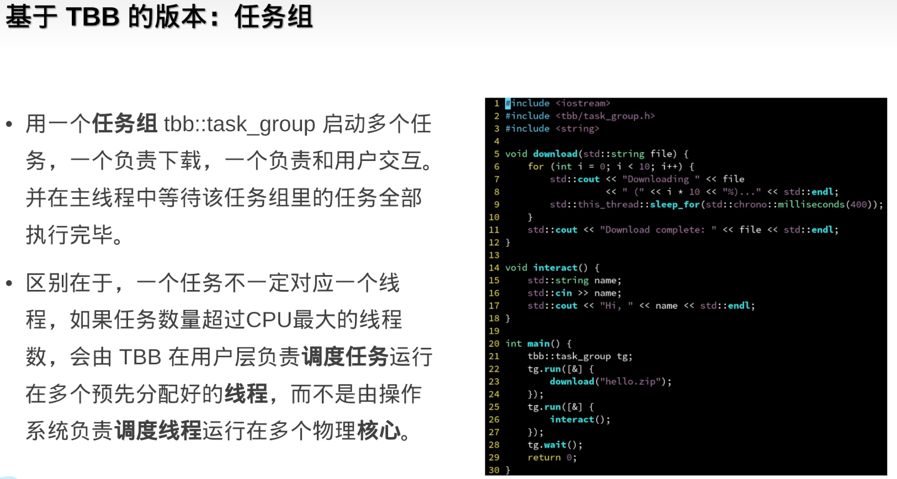

####  parallel_invoke


* parallel_invoke允许传入多个任务，同时执行，自动等待所有任务执行完成  （使用任务组需要手动设置等待任务完成）
  * 将查找拆分为两部分，并行查找


* 串行改并行


####  parallel_for


* 低级接口，不分块，但是效率可能低一点，因为内部不会优化


####  parallel_for_each

* 支持迭代器区间
* 参数是迭代器的引用 ， 上面parallel_for中参数是索引，需要通过a[i]修改值，而这里直接通过f这个引用就可以修改
* 下面的案例是直接给数组的每个元素赋值为32


####  二维区间上的for循环：blocked_range2d


####  三维区间上的for循环：blocked_range3d

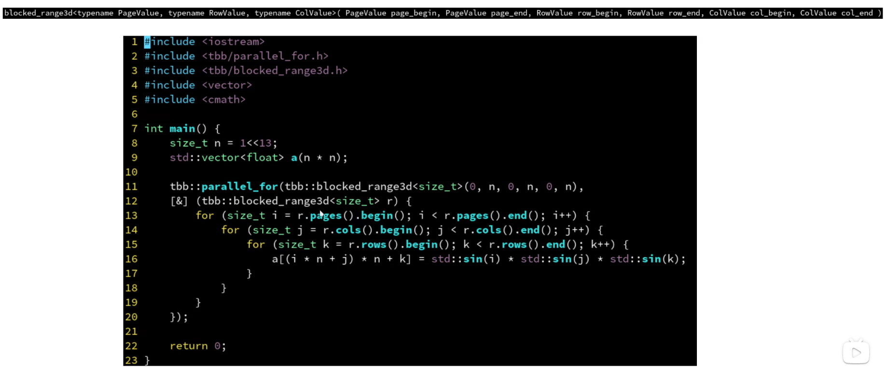

####  parallel_reduce

>  缩并  有数据依赖

* 原始数据依赖案例


* 任务组
  * 时间复杂度：`O(n/c+c)    n是任务数，c是线程数`

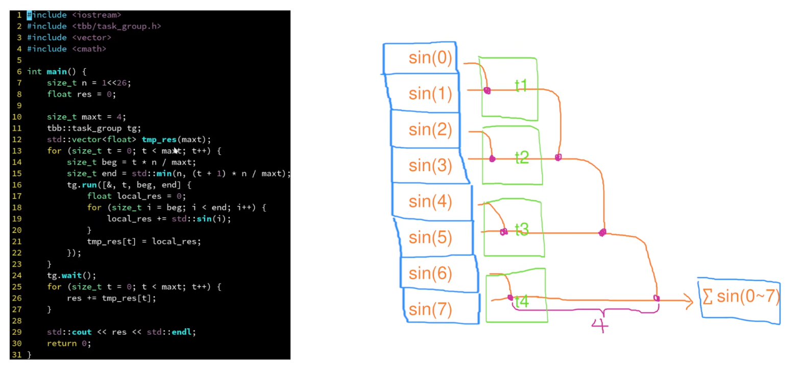

* parallel_reduce
  * 时间复杂度：`O(logn)   n是任务数`  因为会一直缩并下去


####  parallel_deterministic_reduce

* 保证每次每个块分配的任务一样，不再是动态分配


####  parallel_scan

* 扫描
* 需要记录前i个计算结果
* 不是很懂，待学习

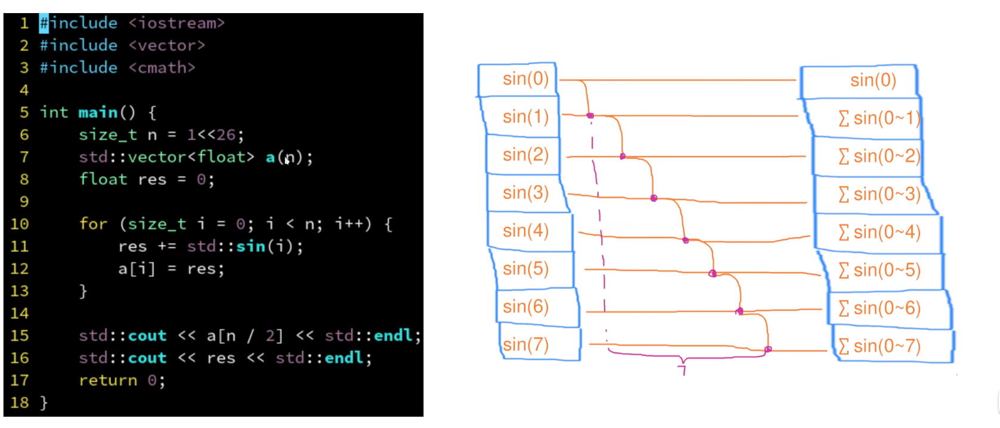

####  任务域

* 可以指定多少个线程执行

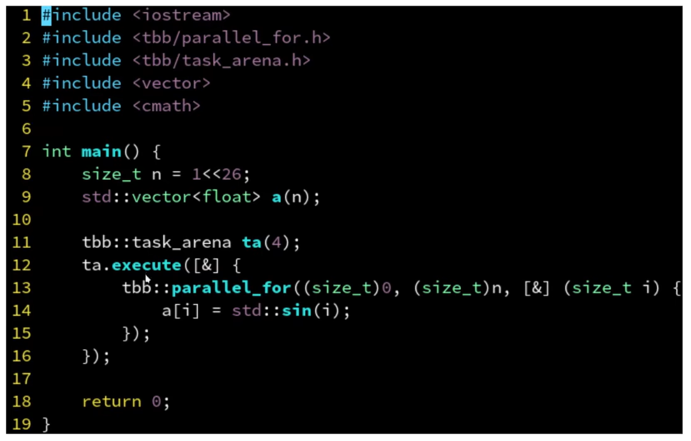

####  嵌套for循环

* n比较小，没有核心数量多

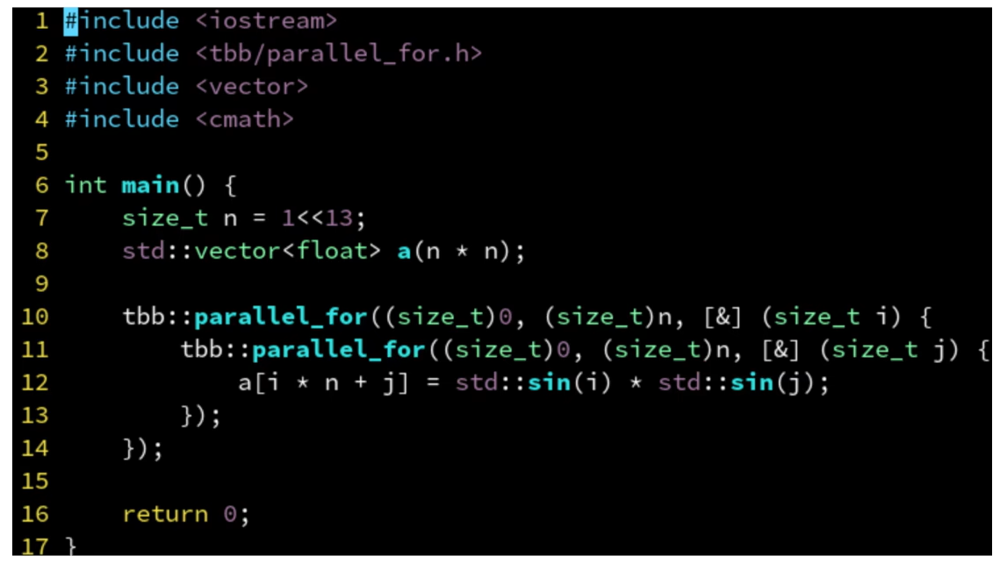

####  筛选

* 满足条件则记录
* concurrent_vector是tbb提供的vector
* a.grow_by()是对数组进行指定大小的扩容
* 因为concurrent_vector中有锁，所以计算结果先压入局部数组，最后再压入concurrent_vector中
  * 这里应该要求块中有多个任务，否则一个任务一个局部数组没有意义


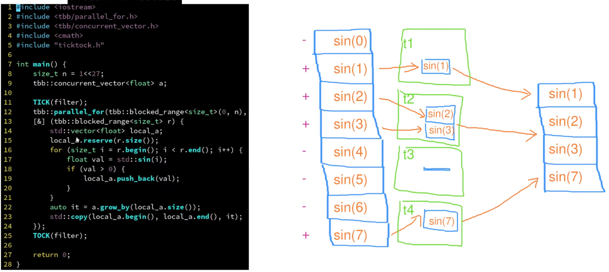


###  递归并行

```c++

```


###  使用笔记

* 设置线程数
* 获取线程数

* parallel_reduce使用
  * type是贯穿始终的计算结果的数据类型 可以是int则计算结果是累加  也可以是vector则计算结果压入数组
  * vec是整个任务数组
  * vectype是任务数组中元素的数据类型
  * init 是块的初始值  int则设置为0  vector则设置为空数组(`vector<int>()`)
  * 块中的for循环表示：一个块中可能分配多个任务，每个任务计算的结果给temp 
  * temp用于收集单个块中所有任务计算的结果，temp将返回给下面的串行合并
  * 串行函数用于合并每个并行块计算的结果 合并后返回即是最终结果

```c++
#include <iostream>
#include <vector>
#include <tbb/tbb.h>
#include <tbb/blocked_range.h>
#include <tbb/parallel_reduce.h>

using namespace std;
using namespace tbb;
//设置线程数
int ThreadNum = 56;
tbb::task_scheduler_init init(ThreadNum);
//获取线程数
auto numprocs = this_task_arena::max_concurrency();
cout<<"thread: "<<numprocs<<endl;

type result = parallel_reduce(blocked_range<vectype>(vec.begin(), vec.end()),
  // 下面是并行部分 一个块交给一个核心
  init ,[](const blocked_range<vectype>& r, type temp)->type{
    for(auto a = r.begin(); a!=r.end(); a++){
      //使用a计算 结果给temp
    }
    return temp;
  },

  // 下面是串行的 合并每个块的结果                   
  [](type x, type y)->type{ // 这里的x,y就是每个块返回的结果，在这里将这些块的数组合并就是最终的结果
    // 将x y合并并返回  
    return x;  // 假设合并到x  x就是最终返回结果
  }
  // ,
  // simple_partitioner{}  // 使得每个块都只分配一个任务

  );
```

**任务分配策略**

* 拿到vec后tbb会将任务分配给块，一个块交给一个核心处理  `blocked_range<vectype>(vec.begin(), vec.end())`
  * 假设vec中有32个任务，机器有4个核心，则每个块分配8个任务，这8个任务在一个核心上是轮询执行的（这是tbb的优化）
  * 这个任务分配是动态的，根据任务和核心设置
* tbb采用工作窃取法，保证核心不空闲
  * 一个块分配多个任务，这些任务就是一个局部的任务队列
  * 当某个核心的任务都执行完后，就会去其它核心查看任务队列中是否还有任务，有则窃取过来执行
  * 但是这种方式还是存在不均衡的情况


* 手动设置每个块分配的任务
  * 每个块负责一个任务似乎比上面的工作窃取法性能更好可能时粒度分的更细了
  * simple_partitioner{}  和 static_partitioner{} 都可以指定块的任务数

```c++
simple_partitioner{}  // 使得每个块都只分配一个任务  如果线程是4 总任务数是32则会分为32个块 这些块排队给线程执行 这种粒度更小 性能似乎更好
static_partitioner{}  // 默认情况：固定每个块的任务数=总任务数/线程数 

// 指定区间粒度 指定每个负责16个任务 假设总任务数是32则会创建2个线程
type result = parallel_reduce(blocked_range<vectype>(vec.begin(), vec.end(), 16),
      // 下面是并行部分 一个块交给一个核心
      init ,[](const blocked_range<vectype>& r, type temp)->type{
        // ....
      },
      ,static_partitioner{}
      // , simple_partitioner{} 

      );
```


**注意初始值**

```c++
tbb::task_scheduler_init init(ThreadNum);  // 设置线程数

// 第二个参数：(unsigned long long)0  表示每个块的累加起始值，注意数据类型，在累加数据类型很大的情况下要设置可容纳的数据类型，否则会累加越界
unsigned long long finalAns = parallel_reduce(blocked_range<size_t>(0, minMatchID_PMR_num), (unsigned long long)0, [&](blocked_range<size_t> r, unsigned long long ans)
                                        {        
                                            for(int i=r.begin();i!=r.end();++i){
                                                // unsigned long long count = ;
                                                // cout<<"count: "<<count<<endl;
                                                // if(count > 0){
                                                //   cout<<"before: "<<ans<<endl;
                                                  ans+=Multithreaded_search(i);
                                                //   cout<<"count: "<<count<<endl;
                                                //   cout<<"after: "<<ans<<endl;
                                                // }
                                            }
                                            // cout<<"sum: "<<ans<<endl;
                                            return ans;  // 这里计算的是块的累加结果，每个块从0开始累加
                                        },
                                        // plus<long long>()

                                          [](unsigned long long x, unsigned long long y)->unsigned long long{
                                            return x+y;  
                                          } // 这里是对每个块的结果进行求和，这里是串行执行
                                        );
```

####  计算结果压入vector

```c++
#include <iostream>
#include <vector>
#include <tbb/tbb.h>
#include <tbb/blocked_range.h>
#include <tbb/parallel_reduce.h>

using namespace std;
using namespace tbb;

// g++ tbb.cpp -ltbb -o tbbb
int main()
{
    vector<int> vec;
    for(int i=0; i<10000; i++)
        vec.push_back(i);
    int ThreadNum = 56;
    tbb::task_scheduler_init init(ThreadNum);

    vector<int> result = parallel_reduce(blocked_range<vector<int>::iterator>(vec.begin(), vec.end()),
      // 下面每个块是并行的  
      // vector<int>() 是块的起始值 设置为空vector
      vector<int>(),[](const blocked_range<vector<int>::iterator>& r, vector<int> init)->vector<int>{
		// init是每个块的存储位置，计算的结果都压入init  块执行完成后返回
        for(auto a = r.begin(); a!=r.end(); a++){
          // cout<<*a<<endl;
          // 方式1
          // init.push_back(*a);
          // 方式2
          // for(int i = 0; i < 10; ++i){
          //  init.push_back(*a * i);
          //}
          // 方式3
          vector<int> temp;
          for(int i = 0; i < 10; ++i){
            temp.push_back(*a * i);
          }
          init.insert(init.end(), temp.begin(), temp.end());
        }
        // cout<<"block: "<<init<<endl;
        return init;
      },
      // plus<long long>()
                                         
      // 下面是串行的 合并每个块的结果                   
      [](vector<int> x, vector<int> y)->vector<int>{ // 这里的x,y就是每个块返回的结果，在这里将这些块的数组合并就是最终的结果
        x.insert(x.end(), y.begin(), y.end());
        return x;
      }
      // ,
      // simple_partitioner{}  // 使得每个块都只分配一个任务

      );
      // cout<<"result:"<<result<<endl;
      for(auto& a: result){
        cout<<a<<endl;
      }
    return 0;
}
```


#  Linux

##  安装g++

> [Ubuntu18.04中安装gcc、g++编译器 /运行c文件、c++文件【超详细图文教程】] : https://blog.csdn.net/weixin_43290551/article/details/125970965
>
> [快速升级到g++11和gcc11] : https://blog.csdn.net/weixin_37726222/article/details/124002454
>
> 查看版本：https://www.cnblogs.com/liujiaxin2018/p/16695558.html
>
> 


##  Screen

> 用于将linux上的任务在后台执行，即使ssh断开也可以在后台继续执行
>
> https://www.elecfans.com/emb/202212051948505.html

#  常用

##  常用函数

* reverse  
* 复杂度:恰好交换 `(last - first)/2` 次

```c++
int a[] = {4, 5, 6, 7};
std::reverse(std::begin(a), std::end(a));
```

* find

```c++
    std::vector<int> v{0, 1, 2, 3, 4};
 
    auto result1 = std::find(std::begin(v), std::end(v), n1);
```

* sort

```c++
#include <algorithm>
std::sort(s.begin(), s.end(), std::greater<int>());// 按降序，  默认是升序

// 自定义比较函数
bool compare(vector<int>& a, vector<int>& b){
  if(a[0] != b[0]){
    return a[0] < b[0]; // 起始点小的在前
  }else{
    return a[1] < b[1]; // 起始点相同的情况下，终止点小的在前
  }
}
vector<vector<int>>& intervals;// 存储的是顶点对  [[1,2],[2,3],[3,4],[1,3]]
sort(intervals.begin(), intervals.end(), compare);

// lambda写法
sort(intervals.begin(), intervals.end(), [](vector<int>& a, vector<int>& b){
  if(a[0] != b[0]){
    return a[0] < b[0]; // 起始点小的在前
  }else{
    return a[1] < b[1]; // 起始点相同的情况下，终止点小的在前
  }
});
```

* C++中的__builtin_popcount()

> https://blog.csdn.net/weixin_44915226/article/details/105367005

```c++
该函数是C++自带的库函数，内部实现是用查表实现的。
作用：统计数字在二进制下“1”的个数。
int a = 2   
int num = __builtin_popcount(a)  // num = 1   2的二进制是10
```

* tie()
  * 解包，类似js中的解构

> https://blog.csdn.net/lllzzzhhh2589/article/details/121584299

```c++
struct S {
    int n;
    std::string s;
    float d;
    bool operator<(const S& rhs) const {
        // 比较 n 与 rhs.n,
        // 而后为 s 与 rhs.s,
        // 而后为 d 与 rhs.d
        return std::tie(n, s, d) < std::tie(rhs.n, rhs.s, rhs.d);
    }
};

S value{42, "Test", 3.14};

int i;
double d;
string s;

tie(i, d, s) = t3;

cout << i << " " << d << " " << s << endl;
//打印： 42 3.14 Test
```


##  位运算

> https://blog.csdn.net/m0_64183293/article/details/122519405
>
> GCC自带的一些builtin内建函数 ：https://blog.csdn.net/tjcwt2011/article/details/118154919

* C++中的__builtin_popcount()

> https://blog.csdn.net/weixin_44915226/article/details/105367005

```c++
该函数是C++自带的库函数，内部实现是用查表实现的。
作用：统计数字在二进制下“1”的个数。
```

* __builtin_ctz
  * 这个函数作用是返回输入数二进制表示从最低位开始(右起)的连续的0的个数；如果传入0则行为未定义

##  查看Linux内存消耗

```
sudo du -sh /home/wangyj
du -sh /home/wangyj
```

##  时间相关

> 

#  算法

> 最大公因数：辗转相除法：https://blog.csdn.net/qq_36834256/article/details/79381912

* 686 
  * 哈希解法待学习
* 17 
  * 回溯法解题待学习（官方）
  * 进位表法
  * 队列法（阿秀）

**哈希表**

* 204 计算质数
  * 埃氏筛
  * 线性筛：目标是用每一个合数的最小质因数来删除这个合数
    * [线性筛生成质数的超详细理解](https://blog.csdn.net/fly_view/article/details/123806701)

```c++
int countPrimes(int n) {
    vector<int> primes;
    vector<int> isPrime(n, 1);
    for (int i = 2; i < n; ++i) {
        if (isPrime[i]) {
            primes.push_back(i);
        }
        for (int j = 0; j < primes.size() && i * primes[j] < n; ++j) {
            isPrime[i * primes[j]] = 0;
            if (i % primes[j] == 0) {  // 确保是最小质因数来删除这个合数
                break;
            }
        }
    }
    return primes.size();
}
```


* #### [205. 同构字符串](https://leetcode.cn/problems/isomorphic-strings/)

  * 记录映射关系
  * 比较第一次出现的位置

* 645

  * 数学方法求解
    * sum(nums) - sum(set(nums)) = 重复的数字    set表示去重
    * (1 + len(nums)) * len(nums) /2 - sum(set(nums)) = 丢失的数字        (1 + len(nums)) * len(nums) / 2表示等差数列求和

* 720 
  
  * 字典树解法(待学习)

##  字符串

> [ASCII码一览表](http://c.biancheng.net/c/ascii/)

```c++
INT_MAX = 2^31-1;
INT_MIN = -2^31
```

**字符串转int**

atoi()和stoi()

>[atoi()和stoi()的区别](https://www.jianshu.com/p/e700ac920249)

* atoi()和stoi()函数都是只转换字符串的数字部分，如果遇到其它字符的话则停止转换
* 只返回有效数字 0123返回123

```c++
#include <cstdio>
#include <iostream>
#include <string>
using namespace std;
int main(){
    char str[] = {'1','2','a','3'};
    string str1 = "12aa3";
    //遇到了'a'字符，停止数字转换
    cout << atoi(str) << endl;   // 打印 12
    //遇到了'a'字符，停止数字转换
    cout << stoi(str1) << endl;  // 打印 12
    
  string s = "0123";
  int n = stoi(s);
  cout<<s<<endl; // 0123
  cout<<n<<endl; // 123
    
  string s = "0";
  int n = stoi(s);
  cout<<s<<endl;//0
  cout<<n<<endl;//0
}


class Solution {
public:
  vector<string> res;
  bool isTrue(string s){
    if(s.length() > 1 && s[0] == '0') return false;//
    int it = stoi(s);
    if(it >=0 && it <= 255){
      return true;
    }
    return false;
  }
  void dfs(string& s, int index, int need, vector<string>&  pre){
    if(need == 0){ // 最后一层长度一定满足条件
      string last = s.substr(index);
      if(!isTrue(last)) return;
      string temp = "";
      for(auto& s : pre){
        temp = temp + s + ".";
      }
      temp += last;
      res.push_back(temp);
      return;
    }
    for(int i = index; i<index+3 && i <s.length(); ++i){
      int len = s.length() - i-1;
      // cout<<"len: "<<len<<endl;
      // cout<<"need: "<<need<<"   need*3: "<<need*3<<endl;
      if(len>= need && len <= need*3){
        string cur = s.substr(index, i-index+1);
        if(!isTrue(cur)) return;
        pre.push_back(cur);
        dfs(s, i+1, need-1, pre);
        pre.pop_back();
      }
    }
  }
  vector<string> restoreIpAddresses(string s) {
    int len = s.length();
    if(len < 4 || len > 12) return {};
    vector<string> pre;
    dfs(s, 0, 3, pre);
    return res;
  }
};

```

**string转char**

c_str()

>[C++中的 c_str() 函数](https://blog.csdn.net/YXXXYX/article/details/119957061)

```c++
#include<iostream>
#include<cstring>
using namespace std;

int main() {
	const char *ptr;
	string s = "12345";
    ptr = s.c_str();
    cout << "s改变前ptr为：" << ptr << endl;
    s = "66666";
    cout << "s改变后ptr为：" << ptr << endl;
    return 0;
}
```

**int转string**

to_string()

**大小写字符转换**

[tolower/toupper](https://blog.csdn.net/laozhuxinlu/article/details/51539737?spm=1001.2101.3001.6661.1&utm_medium=distribute.pc_relevant_t0.none-task-blog-2%7Edefault%7ECTRLIST%7ERate-1-51539737-blog-105710187.pc_relevant_3mothn_strategy_recovery&depth_1-utm_source=distribute.pc_relevant_t0.none-task-blog-2%7Edefault%7ECTRLIST%7ERate-1-51539737-blog-105710187.pc_relevant_3mothn_strategy_recovery&utm_relevant_index=1) 

```c++
#include<ctype.h>   // c++中使用不用引入头文件
```

**判断字符数字**

* isalnum函数用于判断字符是否为字母（a-z和A-Z）或数字（0-9）

isalnum

```c++
#include<ctype.h> // c++中使用不用引入头文件
```

**string移除最后一个元素**

```c++
string s = "string!";
s.pop_back(); // c++11 新语法
```

**string追加char**

```c++
string s = "abc";
char c = 'd';
// 方式1
s += c;
cout<<s<<endl;
// 方式2
s.push_back(c);
```


##  数值

```c++
1e9+7 // 10^9+7  一个比较大的质数
```

**取绝对值**

abs()

**使用最大最小值**

```c++
<limits.h>
LONG_MIN
L
```

**二进制1个数**

> [三种求二进制1个数的办法](https://leetcode.cn/problems/hamming-distance/)

```
1 __builtin_popcount
2 x >> 1  x & 1   右移，末尾和1与
3 x = x & (x-1)
```

**位与位异或位或**

> https://blog.csdn.net/m0_37782602/article/details/122863949

```
位与 &  0&0=0; 0&1=0; 1&0=0; 1&1=1;
位异或 ^ 0^0=0； 0^1=1； 1^0=1； 1^1=0；
位或 |  0|0=0； 0|1=1； 1|0=1； 1|1=1；
```

```c++
Brian Kernighan 算法的原理是：对于任意整数x, 令 x = x & (x-1) 该运算将 x 的二进制表示的最后一个 1 变成 0
```


## vector

**空vector**

```c++
vector<int> res = {};
vector<int> func(){
    return {}; // 返回空字符串
}
```

数组反转

```c++
reverse(vector.begin(), vector.end());
```


#  性能

* lambda写法比调用函数性能好
* 

#  待

* 构造参数列表
* 红黑树
* 哈希表
* 计算，数字类型的默认转换

#  Q&A

###  对象开辟堆区注意事项

> 对象内使用需要开辟堆区空间的对象时最好的解决方案是不要调用默认构造函数，**直接用初始化列表初始化**，不要在构造函数中初始化

**构造函数和析构函数注意事项**

* 由于对象需要开辟堆区，在析构时需要释放堆区，但是如果是通过默认构造函数初始化对象，就没有开辟堆区，所以在析构时就会对没有开辟空间的地址执行释放空间的操作，这就会导致程序奔溃
* 解决方案是在析构时判断是否开辟过堆区空间，若没有开辟过堆区空间(默认构造)则不执行释放堆区空间的操作
  * 需要在默认构造函数中设置堆区指针为NULL，便于析构时判断是否开辟过堆区空间，默认情况下指针并不是NULL

**拷贝构造函数注意事项**

* 对于堆指针的初始化一定要谨慎，要判断原对象是否开辟过堆空间，若开辟过才进行深拷贝，否则也要将指针初始化为NULL

**对象开辟堆区的情况，最好重载运算符，避免浅拷贝导致的内存访问出错**

* 默认构造一个对象，将有参构造的一个临时对象通过等号运算符赋值给默认构造的对象时，由于是浅拷贝，就会导致默认构造函数在析构时析构的时临时对象的堆地址，但临时对象已经释放过堆区了，这就会导致堆区的多次释放，产生错误

**待解决问题：”=“号运算符重载后不适用于临时对象的赋值**

```c++
template<typename item>
class MinHeap
{
private:
  item* id;
  int size;
public:
  MinHeap(int n){
    cout<<"MinHeap: 有参构造函数..."<<endl;
    this->size = n;
    id = new item[n];
  }
    
  MinHeap(){
    cout<<"MinHeap: 默认构造函数..."<<endl;
  }
    
  MinHeap(const MinHeap& mp){
    cout<<"MinHeap: 拷贝构造函数..."<<endl;

    size = mp.size;
    count = mp.count;
    if(mp.id != NULL){ // mp的id有开辟堆空间才需要执行下面操作，否则直接执行下面操作会报错，因为取地址时会报错
      id = new item[mp.size];
      for(int i = 0; i< mp.size; ++i){
        id[i] = mp.id[i];
      }
    }else{
      id = NULL;  // 若mp的id为NULL,则也要初始化为NULL
    }
  }
  MinHeap& operator=(MinHeap& mp){
    cout<<"MinHeap: = 运算符重载..."<<endl;
    size = mp.size;
    count = mp.count;
    if(id != NULL){ // 本对象已经开辟过堆区
      delete[] id;  // 先释放本对象开辟的堆区
      if(mp.id != NULL){ // mp的id有开辟堆空间才需要执行下面操作，否则直接执行下面操作会报错，因为取地址时会报错
        id = new item[mp.size];
        for(int i = 0; i< mp.size; ++i){
          id[i] = mp.id[i];
        }
      }else{
        id = NULL;  // 若mp的id为NULL,则也要初始化为NULL
      }
    }else{
      if(mp.id != NULL){ // mp的id有开辟堆空间才需要执行下面操作，否则直接执行下面操作会报错，因为取地址时会报错
        id = new item[mp.size];
        for(int i = 0; i< mp.size; ++i){
          id[i] = mp.id[i];
        }
      }
    }
    
    return *this;
  }
  ~MinHeap(){
    cout<<"~MinHeap: 析构函数..."<<endl;

    delete[] id;
  }
};

// 直接赋值初始化对象
class Test1
{
private:
  MinHeap<int> mp;
  int size;

public:
  Test1(int n){
    size = n;
    // mp(MinHeap<int>(n)
    mp = MinHeap<int>(n); // 有参构造并赋值给mp,然后就地销毁     MinHeap<int>(n)匿名对象
    
  }
};

// 初始化列表初始化对象
class Test2
{
private:
  MinHeap<int> mp;
  int size;

public:
  Test2(int n): mp(MinHeap<int>(n){
    size = n;
    // mp = MinHeap<int>(n);
    
  }
};

int main(){
  // 注意事项1： 构造和析构注意事项，结合初始化列表和赋值初始化对比理解
  int n = 10
  Test1 t1(n);
  // 打印结果
    // MinHeap: 默认构造函数...
    // MinHeap: 有参构造函数...
    // ~MinHeap: 析构函数...
    // ~MinHeap: 析构函数...

  Test2 t2(n);
  // 打印结果
    // MinHeap: 有参构造函数...
    // ~MinHeap: 析构函数...
  
  // 注意事项2： 拷贝构造函数注意事项
  MinHeap<int> mp(n);
  MinHeap<int> mp1(mp);  // 调用拷贝构造函数初始化
  MinHeap<int> mp2 = mp; // 调用拷贝构造函数初始化
  // 打印结果
  // MinHeap: 有参构造函数...
  // MinHeap: 拷贝构造函数...
  // MinHeap: 拷贝构造函数...
  // ~MinHeap: 析构函数...
  // ~MinHeap: 析构函数...
  // ~MinHeap: 析构函数...

  // 注意事项3： 操作符的重载，下面的情况是操作符没重载的情况
  MinHeap<int> m3;  // 默认构造
  mp3 = MinHeap<int>(n);  // 不会调用拷贝构成初始化，而是”=“的赋值操作， 区别于上面的等号拷贝构造的初始化
  // 打印结果
    // MinHeap: 默认构造函数...
    // MinHeap: 有参构造函数...
    // ~MinHeap: 析构函数...
    // ~MinHeap: 析构函数...id开辟了空间
    // ~MinHeap: 析构函数...
    // ~MinHeap: 析构函数...id开辟了空间
    // free(): double free detected in tcache 2
    // Aborted (core dumped)
    
    
  // 注意事项4：运算符重载
  MinHeap<int> mp4;
  // MinHeap<int> mp5(n);  

  mp4 = MinHeap<int>(n); // 编译报错
  // mp4 = mp5;  // 编译成功，调用的自己重载的=
}
```


###  返回值const引用  待解决

```c++
  class NestedInteger {
    public:
      // Return true if this NestedInteger holds a single integer, rather than a nested list.
      bool isInteger() const;
 
      // Return the single integer that this NestedInteger holds, if it holds a single integer
      // The result is undefined if this NestedInteger holds a nested list
      int getInteger() const;
 
      // Return the nested list that this NestedInteger holds, if it holds a nested list
      // The result is undefined if this NestedInteger holds a single integer
      const vector<NestedInteger> &getList() const;
  };


// 栈
class NestedIterator {
private:
  stack<pair<vector<NestedInteger>::iterator, vector<NestedInteger>::iterator>> st; 
public:
    NestedIterator(vector<NestedInteger> &nestedList) {
      // st.push({nestedList.begin(), nestedList.end()});
        st.emplace(nestedList.begin(), nestedList.end());
    }
    
    int next() {
        return st.top().first++->getInteger();
    }
    
    bool hasNext() {
      while (!st.empty())
      {
        auto& p = st.top();
        if(p.first == p.second){
          st.pop();
          continue;
        }
        if(p.first->isInteger()){
          return true;
        }
        auto& ft = p.first++->getList();
        // st.push({ft.begin(), ft.end()});  返回的vector引用是const   // 不可行--------------------------
        st.emplace(ft.begin(), ft.end());    //  可行
      }
      return false;
    }
};
```


#  八股文

说说内联函数和宏函数的区别

简述C+＋从代码到可执行二进制文件的过程

简述一下atomic (原子操作)内存顺序

> https://blog.csdn.net/WilliamCode/article/details/126139289

内存对齐

> 案例1：https://blog.csdn.net/weixin_40775703/article/details/104941508
>
> 案例2：https://blog.csdn.net/qq_39397165/article/details/119745975

* 编译器默认对齐数
  * 64位  对齐数：8
  * 32位  对齐数：4
* 内存对齐规则
  * 结构体成员对齐规则，对齐数= min(编译器默认对齐数，结构体当前成员变量大小)
  * 结构体本身对齐规则，对齐数= min(编译器默认对齐数,   结构体成员中最长类型变量大小)的整数倍
  * 嵌套结构体对齐规则，把嵌套结构体视为成员变量即可，大小即为结构体大小

说说C 如何 实现C+ 语言中的重载

 简述下向上转 和向下转型 对象

移动构造函数

> https://blog.csdn.net/weixin_44788542/article/details/126284429

虚析构函数

> https://blog.csdn.net/qq_15821883/article/details/105540175

* 使得基类指针可以调用派生类的析构函数
* 如果基类析构函数不是虚析构函数，在基类指针delete的时候只会调用基类的析构函数，不会调用派生类的析构函数，就会导致派生类的内存泄露

1.3.33仿函数

> C++ 仿函数为何而生:https://zhuanlan.zhihu.com/p/362323211 

> C++中的explicit详解: https://blog.csdn.net/k6604125/article/details/126524992

友元函数

>  C++友元函数: https://blog.csdn.net/weixin_59179454/article/details/127574320

1.3.36 虚函数表里存放的内容是什么时候写进去的？

> https://www.bilibili.com/read/cv12864050/

1.4.10 STL 容器动态链接可能产生的问题

右值引用和move

> https://blog.csdn.net/qq_40637903/article/details/1080519586

1.5.11 C+＋中四种类型转换分别为const_cast static_cast dynamic_cast reinterpret_cast,

> https://blog.csdn.net/Awesomewan/article/details/117112781

1.5.13  简述一下 C++ll 中的可变参数模板新特性

> https://blog.csdn.net/unity3d_xyz/article/details/108450820


2.2文件权限修改

> http://m.biancheng.net/view/752.html
>
> https://blog.csdn.net/qq_36501591/article/details/87273384
>
> https://www.cnblogs.com/devgis/p/16382356.html

2.5 说软链接和硬链接的区别

> https://www.cnblogs.com/oceanftd/p/13475643.html

2.6 说说静态库和动态库怎么制作及如何使用，区别是什么

> https://blog.csdn.net/fightingtingting/article/details/125437706
>
> c++: https://blog.csdn.net/mzc_love/article/details/128158943

2.7 简述GDB常见的调试命令，什么是条件断点，多进程下如何调试

> 概要：https://blog.csdn.net/challenglistic/article/details/128109026
>
> 具体使用： https://blog.csdn.net/xubaocai0379/article/details/125876595
>
> https://blog.csdn.net/brahmsjiang/article/details/79318149
>
> 查看变量值：https://blog.csdn.net/wohu1104/article/details/125069987

```c
// test.c
#include <stdio.h>
#define N 100
int func(int num){
    num += 10;
    return num;
}
int main(){
    for(int i = 0; i < N; i++){
        printf("current number is : %d\n", func(i));
    }
    return 0;
}
```

```c
gcc test.c -g -o test
gdb test
b 31 // 31行打断点
run // 开始调试
next //执行下一条语句
kill //结束调试
list 8//显示第八行 
list add //显示add函数
quit //推出gdb
    

g++ test.cpp -g -o test
gdb test
```

2.8 说说什么是大端小端，如何判断大端小端

> https://blog.csdn.net/m0_58250087/article/details/126453463
>
> union: https://blog.csdn.net/std7879/article/details/125001689

2.26 请你说说什么是孤儿进程，什么是僵尸进程，如何解决僵尸进程

> 危害： https://blog.csdn.net/a745233700/article/details/120715371

2.27 说说什么是守护进程，如何实现

> 待学习

2.44 说说什 是信号量， 有什 作用

> https://blog.csdn.net/weixin_43914272/article/details/108317212

2.52  简述Linux零拷贝的原理

> 深度原理：https://www.cnblogs.com/yrxing/p/16684064.html
>
> 简单原理：https://www.elecfans.com/consume/1171431.html
>
> * 传统I/O方式与零拷贝方式对比即图示

* DMA技术
  * 不需要CPU
  * 从磁盘拷贝到内核缓存区
  * 从内核缓存区拷贝到协议引擎中（传输到网络中）

2.53 简述epoll select 的区别， epoll为什么高效

> 简单解释：https://www.jianshu.com/p/c9190109c7d8
>
> 系统解释：https://blog.csdn.net/www_dong/article/details/113532077
>
> 视频教程：https://www.bilibili.com/video/BV1qJ411w7du/?spm_id_from=333.337.search-card.all.click&vd_source=7230a052308bbb41976f248d2c778e3a
>
> seclect、poll 阻塞函数
>
> redis、nginx、java(N2O)都是使用epoll

select

* 优点(相较于自己实现)：
  * 所有任务一次传给内核态，如果是自己实现，需要一个个判断，每个判断是否有数据传来都要切换到内核态
* 缺点：
  * 1 由于bitmap数据结构的特性，最多只能支持1024个请求
  * 2 rset不能重用，没有都要遍历重置
  * 3 仍然有用户态内核态的切换
  * 4 内核态返回，需要O(n)时间复杂度找到有数据的请求是哪个

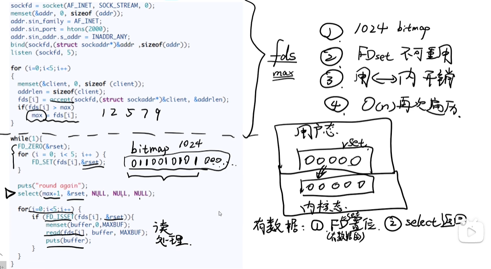

poll

* 优点(相较于select):
  * 支持更多请求，因为pollfds数组是没有上限的
  * 不用重置pollfds，只用每次修改revent即可
* 缺点：
  * 仍然没有解决select中提到的3，4缺点

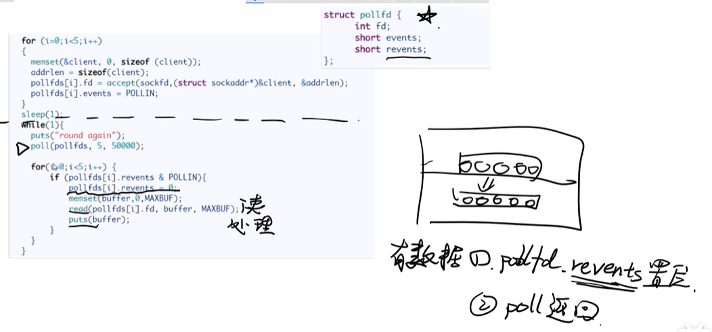

epoll

* 优点：
  * epfd是用户态和内核态共享的，所以解决了用户态和内核态切换的开销
  * 内核态在轮询的时候，会对有数据的请求进行重排，即有数据的请求放到epfd前面，并且有返回值，返回值为有数据的请求个数，这样就可以只用遍历有数据的请求了，解决了O(N)复杂度的遍历


2.54 说说多路IO复用技术有哪些，区别是什么

> * IO多路复用：I/O是指网络I/O,多路指多个TCP连接(即socket或者channel）,复用指复用一个或几个线程。意思说一个或一组线程处理多个TCP连接。最大优势是减少系统开销小，不必创建过多的进程/线程，也不必维护这些进程/线程。
> * IO多路复用使用两个系统调用(select/poll/epoll和recvfrom)，blocking IO只调用了recvfrom；select/poll/epoll 核心是可以同时处理多个connection，而不是更快，所以连接数不高的话，性能不一定比多线程+阻塞IO好,多路复用模型中，每一个socket，设置为non-blocking,阻塞是被select这个函数block，而不是被socket阻塞的
>
> https://www.shuzhiduo.com/A/MyJx7qXXzn/
>
> https://blog.csdn.net/liyaomeng/article/details/107891133

2.57 简述同步与异步的区别，阻塞与非阻塞的区别

> https://blog.csdn.net/liyaomeng/article/details/107891133

* 阻塞与非阻塞指的是用户态的程序执行是否阻塞
* 同步与异步指的是同时是否能处理多个任务，同步只能处理一个，异步可以处理多个
  * 多路IO复用技术(select、poll、epoll)就是异步阻塞的，阻塞是因为select、poll、epoll调用的时候代码是阻塞的，得等待系统态返回，异步是指可以同时处理多个任务

2.58 BIO NIO有什么区别

> https://blog.csdn.net/lzb348110175/article/details/98941378

3.3 简述域名解析过程，本机如何干预域名解析

> 有图：https://baijiahao.baidu.com/s?id=1754073275573332761&wfr=spider&for=pc

3.5 简述网关的作用是什么，同一网段的主机如何通信

> 子网掩码的使用：https://blog.csdn.net/m0_51292856/article/details/128557189
>
> https://blog.csdn.net/AutumnGingkgo/article/details/122392220
>
> https://blog.csdn.net/xuhao0258/article/details/118051122?utm_medium=distribute.pc_relevant.none-task-blog-2~default~baidujs_baidulandingword~default-0-118051122-blog-122392220.pc_relevant_landingrelevant&spm=1001.2101.3001.4242.1&utm_relevant_index=3

3.6 简述CSRF攻击的思想以及解决方法

> https://blog.csdn.net/weixin_44052462/article/details/122988438
>
> 为什么token可以防止CSRF，但cookie不行：https://blog.csdn.net/JinYJ2014/article/details/122931481
>
> * cookie是自动携带的，但是token是需要手动设置每次访问都携带的
>
> Cookie、session和token的区别：https://blog.csdn.net/inthat/article/details/103967592

3.28 简述 TCP 协议的延迟 ACK 和累计应答

> **累计应答：** 对应发送的包都要进行应答，但不是一个个应答，而是会**应答某个之前的ID**,这个ID前边的已经接收完毕。
>
> https://blog.csdn.net/q473203506/article/details/122908332

3.31 说说端到端，点到点的区别

> https://blog.csdn.net/weixin_46437478/article/details/107089472

3.40 简述 HTTPS 的加密与认证过程

> 流程：https://blog.csdn.net/m0_52256357/article/details/126910921
>
> 解释：https://blog.csdn.net/lamperouge_conan/article/details/109575631

#  操作系统

> [局部性原理](https://www.zhihu.com/question/25142664)
>
> L1d cache:           32K
> L1i cache:           32K
> L2 cache:            1024K
> L3 cache:            19712K
>
> adj_index
>
> adj: 入度个数，出度个数，入度id1，入度id1属性，入度id2，入度id2属性，出度id1，出度id1属性，出度id2，出度id2属性
>
> 一次cache切换
>
> 原始：正逆向索引2次，出入度查询2次，邻接点每次属性查询都要cache查询

**进程与线程**

进程是系统进行资源分配和调度的基本单位

线程是操作系统进行运行调度的最小单位
包含在进程之中，是进程中实际运行工作的单位
一个进程可以并发多个线程，每个线程执行不同的任务

**计算密集型和内存密集型**

计算密集型就是CPU密集型

内存密集型就是IO密集型，例如读写网络和磁盘，适用于超线程

**局部性原理**

局部性原理是指CPU访问存储器时，无论是存取指令还是存取数据，所访问的存储单元都趋于聚集在一个较小的连续区域中。

**页式存储管理和段式存储管理**

页式存储管理

* 将进程逻辑空间等分成若干大小的页面

* 相应的把物理内存空间分成与页面大小的物理块

* 以页面为单位把进程空间装进物理内存中分散的物理块

* *有一段连续的逻辑分布在多个页面中，将大犬降低执行效率*

段式存储管理

* 将进程逻辑空间划分成若干段（非等分)
* 段的长度由连续逻辑的长度决定
* *段式存储管理相比页式存储管理更加灵活*

段页式存储管理

* 先将逻辑空间按段式管理分成若干段
* 再把段内空间按页式管理等分成若干页

**页面置换算法LRU、LFU**

缓存置换算法

* 先进先出算法(FIFO)
* 最近最少使用算法(LRU)
* 最不经常使用算法(LFU)

**磁盘冗余阵列详解**

* RAID是什么?
  * RAID(Redundant Array of Independent Disks):磁盘冗余阵列
  * 磁盘冗余阵列:利用虚拟化存储技术把多个硬盘组合起来，成为一个或多个硬盘阵列组，目的为提升性能或减少冗余,或是两者同时提升。

* RAID 0
  * 性能:单块磁盘的N倍
  * 不提供数据校验和数据冗余
  * 某块磁盘损坏，数据直接丢失且无法恢复

* RAID 1
  * 数据无差别双写工作磁盘和镜像磁盘
  * 性能:单块磁盘的N/2倍
  * 数据可靠性强，只要不是同时损坏，都可以恢复

* RAID 5
  * 数据中心最常见的RAID等级
  * 提供纠错海明码实现数据冗余校验
  * 分散校验盘，提高写性能，降低校验盘出错概率


* RAID 10
  * RAID0+RAID1
  * 既保证了数据冗余又保证了读写效率
  * 磁盘空间存储冗余，浪费严重


**同步问题三大经典案例**

* 生产者-消费者问题
  * 一组生产者进程、一组消费者进程、一个缓冲区
  * 生产者在缓冲区溢出前，不断往缓冲区生产数据
  * 消费者在缓冲区为空前，不断从缓冲区消费数据
  * 生产者-消费者通过缓冲区存在同步关系
    * 当缓冲区满时，生产者必须等待消费者消费数据
    * 当缓冲区空时，消费者必须等待生产者生产数据
  * 生产者-消费者、生产者之间、消费者之间存在互斥关系
    * 对缓冲区数据进行存取操作时，必须互斥进行

* 读者-写者问题
  * 读-写操作之间存在同步关系
  * 多个写操作应该串行完成

* 哲学家进餐问题
  * 有五个哲学家，他们的生活方式是交替地进行思考和进餐，哲学家们共同使用一张圆桌，分别坐在周围的五张椅子上，在圆桌上有五个碗和五支筷子。平时哲学家们只进行思考，饥饿时则试图取靠近他们的左、右两支筷子，只有两支筷子都被他拿到的时候就能进餐，进餐完毕之后，放下左右筷子继续思考。

**锁的种类详解**

* 乐观锁/悲观锁
  * 悲观锁每次操作都加锁、乐观锁默认不添加锁
  * 悲观锁适合写操作的场景
  * 乐观锁适合读操作的场景（获得资源后直接操作，再写回时判断原数据是否修改过）

* 无锁/偏向锁/轻量级锁/重量级锁
  * 无锁:不锁资源，多个线程只一个线程修改成功，其他线程会重试
  * 偏向锁:同一个线程执行临界资源会自动获取资源
  * 轻量级锁:多个线程竞争同步资源时，没有获得资源的线程自旋等待锁释放
    * 自旋是指一直占用CPU，不会发生上下文切换
  * 重量级锁:多个线程竞争同步资源时，没有获得资源的线程阻塞等待唤醒
    * 阻塞是指会让出CPU，发生上下文切换

* 公平锁/非公平锁
  * 公平锁：所有等待资源的线程都按先后顺序加入等待队列，当资源释放时，这些线程都被唤醒，开始竞争资源
  * 非公平锁：后来的线程可以直接插队获取资源，如果获取成功就不用调出CPU可以直接继续执行，如果没有获取成功则需要加入队列尾部，等资源释放后公平竞争资源
  * 公平锁的优点:等待锁的线程不会饥饿等待（都是公平竞争的）
  * 公平锁的缺点:整体吞吐效率相对非公平锁要低（资源释放时需要唤醒所有等待的线程进行资源竞争）
  * 非公平锁的优缺点:整体的吞吐效率高，CPU不必唤醒所有线程
    * 如果插队成功，对于插队的线程不用调出CPU可以直接继续执行，且不用唤醒队列中的等待的线程

* 可重入锁/非可重入锁
  * 可重入锁又名递归锁， 是指在同一个线程在外层方法获取锁的时候，再进入该线程的内层方
    法会自动获取锁，不会因为之前已经获取过还没释放而阻塞。
  * 不可重入锁， 当前线程再次获取当前线程已经获得的锁时，如果该锁仍被当前线程所持有,
    未被释放，那么将会出现死锁。

* 共享锁/排他锁
  * 排他锁(互斥锁)是指该锁一次只能被一个线程所持有
  * 共享锁是指该锁可被多个线程所持有
  * 获得共享锁的线程只能读数据，不能修改数据

**线程间通信**

* 互斥锁(mutex)
  * 互斥量是 最简单的线程同步的方法
  * 互斥量(互斥锁)，处于两态之-的变量:解锁和加锁
  * 两个状态可以保证资源访问的串行

* 自旋锁(spin_ lock)
  * 自旋锁也是一种多线程同步的变量
  * 使用自旋锁的线程会反复检查锁变量是否可用
  * 自旋锁不会让出CPU，是一种忙等待状态（忙等待就是等待时一直占用CPU）
  * 自旋锁避免了进程或线程.上下文切换的开销
  * 操作系统内部很多地方使用的是自旋锁
  * 自旋锁不适合在单核CPU使用

* 读写锁(rwlock)
  * 读写锁是一种特殊的自旋锁
  * 允许多个读者同时访问资源以提高读性能，但写的时候还是互斥的

* 条件变量
  * 条件变量是一种相对复杂的线程同步方法
  * 条件变量允许线程睡眠，直到满足某种条件
  * 当满足条件时，可以向该线程信号,通知唤醒

**进程间通信**

* 进程VS线程
  * 线程是系统进行运行调度的最小单位
    * 线程是共享进程资源的
  * 进程是系统进行资源分配和调度的基本单位
    * 进程之间的资源是独立的

* 管道(pipe)
  * 不可跨机器
  * 这里的"I” 实际上就是管道的意思，"I” 前面部分作为"I” 后面的输入。

```
netstat -anlp | grep 8080
cat server.log | grep ERROR | grep Thread
man netstat | more
```

* 消息队列
  * 可跨机器进行进程间通信
  * 相对管道，传输的数据可以序列化（封装）


* 共享内存
  * 不可跨机器


* 信号
  * 不可跨机器
  * 传输的信息是有限的，且是固定的，就是固定数字代表固定指令

* 套接字
  * 网络套接字（跨机进程间通信）
    * 网络层:提供主机之间的通信
    * 传输层:提供主机不同进程之间的通信
    * 应用层:提供不同应用之间的通信
  * 域套接字（本机进程间通信）
    * 套接字(socket)原是网络通信中使用的术语
    * 域套接字是一种高级的进程间通信的方法
    * Unix域套接字可以用于同一机器进程间通信
    * Unix系统提供的域套接字提供了网络套接字类似的功能
    * Unix域套接字通信无需经过完整的网络协议栈

**CAS原理与无锁技术详解**

* 大量使用锁的弊端
  * 开发难度:并行系统访问临界资源必须考虑加锁
  * 墨菲定律:只要存在的一定会发生，死锁
  * 调度问题:低优先级线程持有锁导致高优先级线程无法执行
  * 性能问题:满足一致性要求的前提下需要串行访问
  * 锁粒度:锁粒度过小/过大，设计不当

* 基石: CAS技术
  * 原子性:原子性是指一系列操作不可被中断的特性;这一系列操作要么全部执行完成，要么全部没有执行，不存在部分执行，部分未执行的情况。
  * CAS一Compare & Set,或是Compare & Swap,现在几乎所有的CPU指令都支持CAS的原子操作，X86下对应的是CMPXCHG汇编指令。

* CAS与ABA问题
  * ABA问题是指CAS交换数据在多次操作后恢复原值而线程无法感知的问题。例如：线程1对原值8修改为9，然后又修改回8，线程2在原值为8时同步线程1开始执行，线程2计算结束后，发现原值开始8，但其实已经被线程修改2次了
  * 解决以上问题的方法：对数据加本版号，就可以确保唯一性

**分布式锁**

* 分布式锁使用场景
  * 订单系统、秒杀系统
  * 积分系统、消费系统
  * 消息中间件、服务中间件、数据发布-订阅
  * 分布式部署:集群、微服务
  * 服务节点之间需要通信
  * 数据强一致性要求、性能要求、并发量要求

* 方案
  * Redis
    * Redis单节点
      * Redis:性能优异的k-v数据库
      * `setnx <key> <value>`  键值对获取资源
      * `del <key>`   释放资源
      * 单点问题、雪崩效应
    * Redis集群
      * 避免单点问题
      * 节点一致性由集群保证
      * 集群如何保证一致性的?  Redis集群原理
  * Zookeeper
    * ZooKeeper是一个分布式的， 开放源码的分布式应用程序协调服务,是Google的Chubby-个开源的实现，是Hadoop和Hbase的重要组件。它是一个为分布式应用提供一致性服务的软件,提供的功能包括:配置维护、域名服务、分布式同步、组服务等
    * 原理
      * Zookeeper数据节点: znode
      * 服务1在Zookeeper创建znode1.
      * 服务2在Zookeeper创建znode1失败
      * 服务1释放znode,服务2创建成功
      * 临时节点:临时节点由某个客户端创建，当客户端与ZK集群断开连接，则该节点自动被删除
  * 基于传统数据库: MySQL
    * MySQL提供一致性服务:事务、表级锁、行级锁
    * UNIQUE KEY:表级唯一, 不能重复插入
    * 通过MySQL保证同一-个KEY只有一个节点能插入成功
    * 通过删除记录释放锁
    * 把锁竞争的压力交给了MySQL,且MySQL同样存在单点问题，需要集群解决

* 分布式锁框架
  * 京东: SharkLock
  * Netflix: Curator
  * Google: Chubby
  * ETCD
  * Redisson
  * consul

**字节码、程序编译与程序解释**

* 编译是将高级语言整体翻译为底层语言在机器上执行，编译是将高级语言翻译成和高级语言逻辑完全一致的低级语言
* 解释是将高级语言作为输入，一句一转换的转换为底层指令在机器上执行


* 编译型语言: C/C+＋、Object-C、Golang
* 解释型语言：Python、Php、Javascript

* java虚拟机
  * Java是一种编译+解释的语言
    * java程序  编译成  JVM字节码 
    * JVM字节码 解释成  机器码
    * 字节码(英语:Bytecode)通常指的是已经经过编译，但与特定机器代码无关，需要解释器转译后才能成为机器代码的中间代码。字节码通常不像源码一样可以让人阅读，而是编码后的数值常量、引用、指令等构成的序列。
  * Java程序 --> Java字节码 --> Java虚拟机 --> 操作系统
  * 没有虚拟机的问题
    * 不同平台不同的编译器
    * 不同平台部署需要重新编译
    * 编译结果不复用
  * 有了Java虚拟机，一次编译，随处运行


**编译器工作原理**

词法分析、语法分析、语义分析、中间代码生成、优化分析、代码生成

* 词法分析


* 语法分析


* 语义分析
  * 构建语义树
  * 检查类型

* 中间代码生成
  * 临时变量的生成
* 优化分析
  * 合并可合并的代码
* 代码生成
  * 生成机器码

**程序运行流程**

预编译、编译、汇编、链接、装载、运行

* 预编译
  * 预编译主要是做一些代码文本的替换工作
  * #define、#include、 条件编译
  * 代码注释

* 编译
  * `g++ -c test.cpp -o test.o`  生成`.o`的文件   `test.cpp ---->  test.o`
* 汇编
  * 将代码转换为机器码
* 链接
  * 目标文件仅仅是当前的源码文件编译成的二进制文件
  * 并没有经过链接过程，是不能够执行的


* 装载
  * 可执行文件加载到内存运行

**JIT技术**

* JIT技术(Just In Time):通常对于存在中间代码的运行系统(Java、Python等), 解释执行过程的效率不如传统本地代码的执行效率，在实现JIT的系统中JIT可以在运行过程动态将中间字节码编译成本地代码，从而加快运行速度。
* 就是将部分源码直接编译成机器码，跳过编译成字节码再解释成机器码的过程
* 使用前提：性能优化收益大于编译消耗（JIT编译的过程是动态的，不是先编译成可执行文件再执行）

**分层存储体系**

* 1cycle是纳秒级别（10的负九次方）
* cycle是CPU的执行周期
* HD: 是硬盘，读写速度要10-50百万（m）个cycle, SSD比以前的HD快一些
* L1，L2, L3是缓存，一般常量会存在这里，频繁访问的数据也存在这里，这样就可以提升访问效率，但是进程切换就会改变缓存中存储的内容，所以要减少进程的切换


**文件系统**

#  分布式

Hadoop

> https://blog.csdn.net/m0_46914845/article/details/125762491

Spark

> https://blog.csdn.net/qinlingheshang/article/details/123232539

Hadoop和Spark的对比

> https://blog.csdn.net/Swofford/article/details/125305625

#  c++

####  GDB调试

> 查看变量值（结构体、数组，对象等）：https://blog.csdn.net/wohu1104/article/details/125069987

####  const的使用

> https://blog.csdn.net/qq_41902325/article/details/124274072
>
> https://blog.csdn.net/limengshi138392/article/details/122078477

const修饰成员函数:  对于类的成员函数，若指定其为const类型，则表明其是一个常函数，不能修改类的成员变量，类的常对象只能访问类的常成员函数；

####  智能指针

> https://blog.csdn.net/solstice/article/details/8547547

内部实现

线程安全

####  vector存储对象

> https://blog.csdn.net/Think88666/article/details/89408890
>
> https://blog.csdn.net/weixin_42322256/article/details/125068306

vector存储对象扩容时，也是完全拷贝对象，push_back和emplace_back对比

####  虚函数表和虚函数指针

> https://blog.csdn.net/qq_43142509/article/details/126365313
>
> https://www.nowcoder.com/discuss/415213368640909312?sourceSSR=users

虚函数表创建时刻

虚函数指针创建时刻

虚函数表属于类还是实例

####  placement new

> [侯捷内存管理1-12]()
>
> placement: 安置
>
> 只要是带小括号的用法都是placement new ： new(ptr)
>
> 系统自带的是传入指针的用法，即已经开辟了空间，并用指针ptr指向这个空间，则可以通过new(ptr) Foo(1, 2)来在已经开辟空间的地址上调用构造函数
>
> placement new本质上是对 operator new的重载，添加了第二参数或更多参数

**题目** 阿里二面

vector先开辟空间，然后再调用构造函数初始化

* new底层是默认的operator new，只有第一个默认参数
* new()底层是对operator new重载了，添加了第二参数，第一参数默认是对象的大小

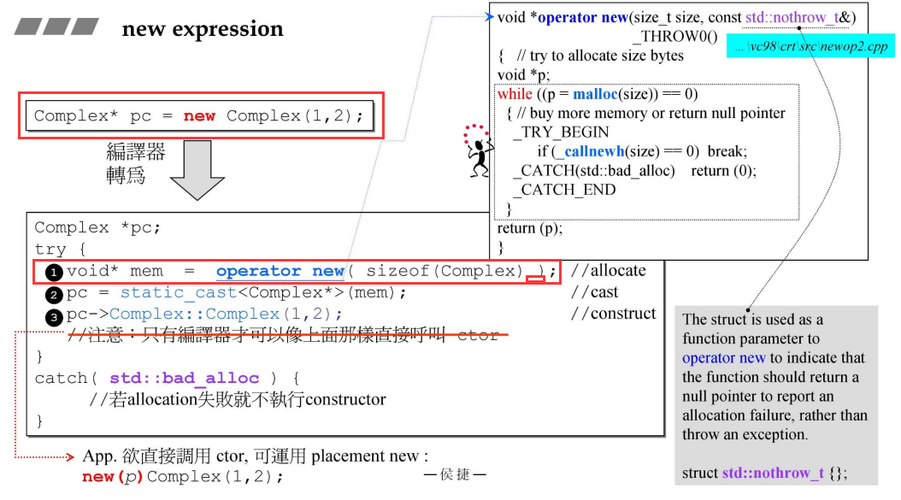


```c++
class A{
public:
  int id;
  A():id(0){
    cout<<"default ctor.this: "<<this<<" id="<<id<<endl;
  }
  A(int id):id(id){
    cout<<"ctor.this: "<<this<<" id="<<id<<endl;
  }
  A& operator=(const A& other){
    cout<<"operator=().this: "<<this<<" id="<<id<<endl;
    id = other.id;
    return *this;
  }
  ~A(){
    cout<<"dtor.this: "<<this<<" id="<<id<<endl;
  }
};
// g++ -o place placement_new.cpp 
int main()
{
  int size = 3;
  A* buf = new A[size];

  A* tmp = buf;

  cout<<"buf="<<buf<<" tmp="<<tmp<<endl;

  for(int i = 0; i <size; i++){
    new(tmp) A(i);
    tmp++;
  }

  cout<<"buf="<<buf<<" tmp="<<tmp<<endl;

  delete[] buf;
  return 0;
}

// 打印
default ctor.this: 0x55c8c80f5e78 id=0
default ctor.this: 0x55c8c80f5e7c id=0
default ctor.this: 0x55c8c80f5e80 id=0
buf=0x55c8c80f5e78 tmp=0x55c8c80f5e78
ctor.this: 0x55c8c80f5e78 id=0
ctor.this: 0x55c8c80f5e7c id=1
ctor.this: 0x55c8c80f5e80 id=2
buf=0x55c8c80f5e78 tmp=0x55c8c80f5e84
dtor.this: 0x55c8c80f5e80 id=2
dtor.this: 0x55c8c80f5e7c id=1
dtor.this: 0x55c8c80f5e78 id=0
    
// new()  结合vector用法
int main(){
  int size = 3;
  vector<A> vec(size); // 调用3次默认构造函数    vector会自动调用每个对象的析构函数
  for(int i = 0; i < size; i++){
    new(&vec[i]) A(i); // 调用有参构造函数
  }
  return 0;
}

// 打印
default ctor.this: 0x55f6ac63ee70 id=0
default ctor.this: 0x55f6ac63ee74 id=0
default ctor.this: 0x55f6ac63ee78 id=0
ctor.this: 0x55f6ac63ee70 id=0
ctor.this: 0x55f6ac63ee74 id=1
ctor.this: 0x55f6ac63ee78 id=2
dtor.this: 0x55f6ac63ee70 id=0
dtor.this: 0x55f6ac63ee74 id=1
dtor.this: 0x55f6ac63ee78 id=2
 
// 相对与new()的方式，会多一次临时对象的创建和销毁，还会多一次等值拷贝构造，但是会少一次有参构造
// 相对来说性能是更差的
int main(){
  int size = 3;
  vector<A> vec(size);
  for(int i = 0; i < size; i++){
    vec[i] = A(i);
  }
  return 0;
}

// 打印
default ctor.this: 0x5563d7c09e70 id=0
default ctor.this: 0x5563d7c09e74 id=0
default ctor.this: 0x5563d7c09e78 id=0
ctor.this: 0x7ffebb7eb044 id=0
operator=().this: 0x5563d7c09e70 id=0
dtor.this: 0x7ffebb7eb044 id=0
ctor.this: 0x7ffebb7eb044 id=1
operator=().this: 0x5563d7c09e74 id=0
dtor.this: 0x7ffebb7eb044 id=1
ctor.this: 0x7ffebb7eb044 id=2
operator=().this: 0x5563d7c09e78 id=0
dtor.this: 0x7ffebb7eb044 id=2
dtor.this: 0x5563d7c09e70 id=0
dtor.this: 0x5563d7c09e74 id=1
dtor.this: 0x5563d7c09e78 id=2
```

####  delete[] 与 delete

* delete会干两件事
  * 调用一次析构函数
  * 释放开辟的空间
* delete[] 会干两件事
  * 调用多次析构函数，即调用数组中每个对象的析构函数
  * 释放开辟的空间
* new T[]   但调用delete可能出错
  * 如果T是基本数据类型，即开辟的空间没有指针指向其它地方，直接delete可以正常释放开辟的空间
  * 如果T是对象，因为对象中可能也开辟了堆数据，用指针指向，需要在析构函数中释放指针指向的空间，如果调用的是delete则只会调用一次析构函数，则有些对象的析构函数没有调用，对象中开辟的堆数据就没有在析构函数中释放，则会导致内存泄漏
    * 如果对象中没有开辟对数据指向其它地方，只调用delete，理论上也是可以释放空间，不会导致内存泄漏的，但是如果对象有析构函数，这种写法仍然会执行报错，
      * 对象中没有开辟堆数据，且没有写析构函数，则使用delete是可以成功执行的，且不会有内存泄漏
      * 对象中没有开辟堆数据，但有写析构函数，则使用delete，执行会报错
        * 写了析构函数，在开辟的空间中会标注需要析构的次数，如果使用delete只调用一次析构，和之前标注的次数不一致，则会导致报错
    * 对象中有开辟堆数据
      * 对象中有开辟堆数据，且没有写析构函数，则使用delete是可以成功执行的，但会导致内存泄漏
      * 对象中有开辟堆数据，且有写析构函数，则使用delete，执行会报错

```c++
// 有析构函数
class A{ // 没有指针，没有开辟新的内存，只是一个简单的类
public:
  int a;
  A():a(0){
    cout<<"A create"<<endl;
  }
  ~A(){
    cout<<"A delete"<<endl;
  }
};

class B{
public:
  int* pi;
  B(){
    pi = new int(10);
    cout<<"B create"<<endl;
  }
  ~B(){
    cout<<"B delete"<<endl;
    delete pi;
  }
};

int main(){
  A* p = new A[3];
  // delete p; // 执行报错
  delete[] p;

  B* p2 = new B[3];
  // delete p2; // 执行报错
  delete[] p2;

  int* p3 = new int[3];
  // delete p3; // 执行成功
  delete[] p3; // 执行成功

  return 0;
}


// 没有析构函数
class A{ // 没有指针，没有开辟新的内存，只是一个简单的类
public:
  int a;
  A():a(0){
    cout<<"A create"<<endl;
  }
  // ~A(){
  //   cout<<"A delete"<<endl;
  // }
};

class B{
public:
  int* pi;
  B(){
    pi = new int(10);
    cout<<"B create"<<endl;
  }
  // ~B(){
  //   cout<<"B delete"<<endl;
  //   delete pi;
  // }
};

int main(){
  A* p = new A[3];
  delete p; // 执行通过，不会导致内存泄漏
  // delete[] p;

  B* p2 = new B[3];
  delete p2; // 执行通过，但是会导致内存泄漏   因为b中开辟了堆数据
  // delete[] p2;

  int* p3 = new int[3];
  // delete p3; // 执行成功
  delete[] p3; // 执行成功

  return 0;
}
```


####  阿里二面

operator new的第二参数，传入指针，结合vector，先开辟空间再用new()构造

父类析构函数没有定义为析构函数，如何保证子类可以正常析构，使用share_ptr、template解决   share_ptr的delete参数

如何解决share_ptr的高频访问，在多线程的情况下，实现原子性，，，，

编程规范，传入(const &)传出参数

> https://cloud.tencent.com/developer/article/2240964
>
> https://www.jianshu.com/p/d625150cdffc
>
> https://blog.csdn.net/weixin_43862847/article/details/126493820
>
> https://blog.csdn.net/weixin_41504987/article/details/124396989
>
> https://blog.csdn.net/u012477435/article/details/106875121/
>
> https://blog.csdn.net/jiangfuqiang/article/details/8292906
>
> https://blog.csdn.net/GreatTang/article/details/125814259?spm=1001.2101.3001.6650.2&utm_medium=distribute.pc_relevant.none-task-blog-2%7Edefault%7ECTRLIST%7ERate-2-125814259-blog-8292906.235%5Ev30%5Epc_relevant_default_base&depth_1-utm_source=distribute.pc_relevant.none-task-blog-2%7Edefault%7ECTRLIST%7ERate-2-125814259-blog-8292906.235%5Ev30%5Epc_relevant_default_base&utm_relevant_index=3	
>
> https://blog.csdn.net/weixin_43606861/article/details/116121511?spm=1001.2101.3001.6650.5&utm_medium=distribute.pc_relevant.none-task-blog-2%7Edefault%7EBlogCommendFromBaidu%7ERate-5-116121511-blog-125814259.235%5Ev30%5Epc_relevant_default_base&depth_1-utm_source=distribute.pc_relevant.none-task-blog-2%7Edefault%7EBlogCommendFromBaidu%7ERate-5-116121511-blog-125814259.235%5Ev30%5Epc_relevant_default_base&utm_relevant_index=8


#  数据库

1 索引优化

> 索引失效：https://mp.weixin.qq.com/s/orHhcaxjrRcJl9GJoVV3Zg
>
> 索引优化：https://mp.weixin.qq.com/s/hc4Nmk8L3FVRUTG3IQcreQ

2 为什么使用b+树

b站 IT老哥
数据库索引
索引需求: 
查找要快
要有顺序性
要可以快速范围查找

哈希索引
可能存着索引后链式查找的问题，查找不一定快
哈希是无序的，不满足顺序性
无序则也不支持范围查找

平衡二叉树
查找快，但是树的深度相对b树更深
满足有序性
但是范围查找要回旋查找，效率不高

b树
查找快，一个节点可以存多个值，比平衡二叉树深度浅
满足有序性
仍然需要回旋查找，范围查找太慢

b+树
查找快，深度浅
满足有序性
因为叶子节点是链式存储的方便范围查找
且MySQL将叶子节点改成了双向链表，范围查找更方便

索引失效是指在使用组合索引的情况下不使用最左前缀法则导致的索引失效


平衡二叉树和红黑树区别
平衡二叉树是严格平衡的，每次插入和删除都有可能需要旋转以达到平衡，所以适用于插入，删除少的情况，但查询相对红黑树快，因为高度浅
使用场景:Windows NT内核中广泛存在
红黑树是弱平衡二叉树，对于搜索，插入，删除操作较多的情况下，我们就用红黑树，但搜索性能低于平衡二叉树
使用场景: stl库map，set

红黑树定义

性质1. 结点是红色或黑色。 [3] 

性质2. 根结点是黑色。 [3] 

性质3. 所有叶子都是黑色。（叶子是NIL结点） [3] 

性质4. 每个红色结点的两个子结点都是黑色。（从每个叶子到根的所有路径上不能有两个连续的红色结点）

性质5. 从任一结点到其每个叶子的所有路径都包含相同数目的黑色结点。

b树b+树定义


3 redis的两个集群，和优势

**redis数据类型**

string、list、hash、set、zset

**缓存问题**

* 缓存击穿：
  * 查询的数据不存在，redis不能缓存，所以每次不存在的查询都需要MYSQL处理
  * 热点数据过期清除后，突然来了大量的对热点数据的请求，直接由MySQL处理
* 缓存雪崩：
  * 相对缓存击穿，同时过期失效的热点数据特别多，导致大量热点数据的访问都需要MySQL来处理
* 解决方案：
  * 热点数据永不过期
  * 数据过期时间随机化，避免同时大量过期

**数据持久化**

* 问题：进程死掉，挂机导致内存数据丢失
* 解决方案：将内存缓存的数据持久化到硬盘
  * RDB
    * 每隔一段时间就将内存缓存的数据写入到磁盘持久化
  * AOF
    * 记录内存的缓存数据到硬盘
    * 每次更新只记录写入的操作命令，并将写入命令合并，然后去修改磁盘中的数据

**高可用，主从节点集群**

* 读写分离
* 主节点负责数据的写入和数据同步
  * 先生成RDB文件发给从节点，后续有写入修改则记录操作命令，并将命令发给从节点进行数据同步
  * 操作命令发给从节点的同时写入一个命令缓冲区并用游标记录写入的位置（主记录写入游标，从记录各自的读游标，即读到哪儿了）
    * 从节点挂掉后重启，只需要在缓存区读命令更新即可，不要重新从主节点获取RDB文件，从缓存区读命令的标志是之前读命令的游标位置
* 从节点负责数据的读
* 如果主节点挂掉了就由从节点顶替
  * 但是需要程序员手动选择从节点进行顶替

**主从复制+哨兵监控管理**

> 这种模式只能解决高可用的问题，不能解决数据量大的问题

* 多个哨兵监控主从节点，每各一段时间则看主从节点是否还在线，来实现自动的主节点顶替
  * 如果一个哨兵发现一个节点掉线判定为主观下线，如果多个哨兵发现一个节点掉线则判断为客观下线则开始执行故障转移
* 选择主节点的策略
  * 优先级高的，即硬件设配好的从节点
  * 断开主节点时间最短的
  * 复制偏移量最大的，即丢失的数据最少的从节点

**集群+主从复制**

* 划分了16384个哈希桶，槽位slot ,每个节点负责一部分槽位
  * 如果有新节点加入则重新划分并分配每个节点负责的槽位
  * 当请求来时先判断这个槽位是否是自己节点负责，如果是则响应，如果不是则返回负责这个槽位的ip
* 每个节点都有一个从节点，当当前节点挂掉后则由从节点顶替

4 acid

* 原子性
* 一致性
* 隔离性
* 持久性

5 三范式

	第一范式：要求任何一张表必须有主键，每一个字段原子性不可再分。
	
	第二范式：建立在第一范式的基础之上，要求所有非主键字段完全依赖主键，不要产生部分依赖。
	
	第三范式：建立在第二范式的基础之上，要求所有非主键字段直接依赖主键，不要产生传递依赖。

**举例说明不符合第二范式的情况**

假设有一个学生课程表的数据库，其中包含以下表格：

1. 学生表格（Students），包含以下列：

- StudentID (主键)
- StudentName
- Address

1. 课程表格（Courses），包含以下列：

- CourseID (主键)
- CourseName
- CourseDescription

1. 成绩表格（Grades），包含以下列：

- StudentID (主键，外键到学生表格)
- CourseID (主键，外键到课程表格)
- Grade

在这个设计中，Grades 表符合第二范式的要求，因为每个非主键列都完全依赖于主键（即 StudentID 和 CourseID）。但是，如果我们向 Grades 表中添加一列 CourseName，用于存储课程的名称，那么该表就不符合第二范式的要求了，因为 CourseName 列只依赖于 CourseID 列，而不是主键（即它间接依赖于主键）。这种情况称为部分依赖。为了符合第二范式的要求，我们应该将 CourseName 列移动到课程表格中，并创建一个新的关系来连接成绩表格和课程表格。这样，每个非主键列都只依赖于主键，数据库也就更加规范化了。

6 隔离级别和产生的问题

* 脏读：读取到了未提交的数据
* 不可重复读：前一次读取的数据和后一次读取的数据不一致
  * 注意是读，且是读同一个数据，两次读的数据不同，表示有**别的事务对数据发生了修改**
* 幻读：前一次读取的数据和后一次读取的数据不一致
  * 注意是读，但不是指同一个数据，比如查询一张表，查询结果为一条，将这条数据删除，再次查询结果查询结果应该是0，但是由于在删除后其它事务插入了数据导致表中还是有数据，这就是幻读，读到了预取之外的数据，即**其它事务的插入和删除**导致的

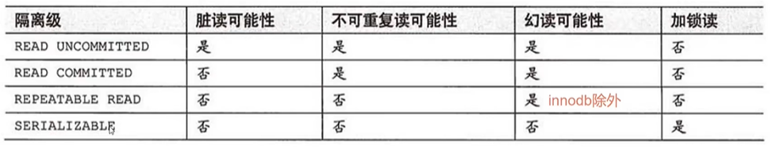

		读未提交：read uncommitted（最低的隔离级别）《没有提交就读到了》
				什么是读未提交？
					事务A可以读取到事务B未提交的数据。
				这种隔离级别存在的问题就是：
					脏读现象！(Dirty Read)
					我们称读到了脏数据。
				这种隔离级别一般都是理论上的，大多数的数据库隔离级别都是二档起步！
		读已提交：read committed《提交之后才能读到》
			什么是读已提交？
				事务A只能读取到事务B提交之后的数据。
			这种隔离级别解决了什么问题？
				解决了脏读的现象。
			这种隔离级别存在什么问题？
				不可重复读取数据。
				什么是不可重复读取数据呢？
					在事务开启之后，第一次读到的数据是3条，当前事务还没有
					结束，可能第二次再读取的时候，读到的数据是4条，3不等于4
					称为不可重复读取。
	
			这种隔离级别是比较真实的数据，每一次读到的数据是绝对的真实。
			oracle数据库默认的隔离级别是：read committed
	
		可重复读：repeatable read《提交之后也读不到，永远读取的都是刚开启事务时的数据》
			什么是可重复读取？
				事务A开启之后，不管是多久，每一次在事务A中读取到的数据
				都是一致的。即使事务B将数据已经修改，并且提交了，事务A
				读取到的数据还是没有发生改变，这就是可重复读。
			可重复读解决了什么问题？
				解决了不可重复读取数据。
			可重复读存在的问题是什么？
				可以会出现幻影读。
				每一次读取到的数据都是幻象。不够真实！
			
			早晨9点开始开启了事务，只要事务不结束，到晚上9点，读到的数据还是那样！
			读到的是假象。不够绝对的真实。
	
			mysql中默认的事务隔离级别就是这个！！！！！！！！！！！
	
		序列化/串行化：serializable（最高的隔离级别）
			这是最高隔离级别，效率最低。解决了所有的问题。
			这种隔离级别表示事务排队，不能并发！
			synchronized，线程同步（事务同步）
			每一次读取到的数据都是最真实的，并且效率是最低的。

**非关系型数据库的优势是什么**

非关系型数据库相对于传统的关系型数据库有以下优势：

1. 高可扩展性：非关系型数据库采用分布式的数据存储方式，支持数据的水平扩展，可方便地扩展系统性能和存储容量。
2. 高性能：非关系型数据库通常采用内存计算和缓存技术等，能够快速地处理海量数据，支持高并发的读写操作。
3. 高灵活性：非关系型数据库通常采用动态模式，可以根据需求随时更改数据库结构，无需像关系型数据库那样需要预先定义好表结构。
4. 适合大数据：非关系型数据库适合处理大数据、半结构化数据和非结构化数据，能够更好地满足互联网时代数据存储和处理的需求。
5. 低成本：非关系型数据库通常使用开源软件实现，而且可以运行在廉价的硬件上，因此成本相对较低。

总之，非关系型数据库在高可扩展性、高性能、高灵活性、适合大数据和低成本等方面具有优势，逐渐成为处理大数据和高并发场景的首选数据库。


**可以具体解释一下高可扩展性吗，传统关系型数据库也可以建立集群实现扩展啊**

是的，传统关系型数据库也可以建立集群实现扩展，但是相比非关系型数据库，它们的扩展性相对较低，主要表现在以下几个方面：

1. 数据模型的限制：关系型数据库需要提前设计好表结构，一旦数据结构发生变化，就需要修改表结构，这样就会涉及到大量的迁移和更新操作，而非关系型数据库不需要提前设计好表结构，可以动态添加和删除字段，具有更好的灵活性。
2. 存储和查询效率的提升：非关系型数据库采用的是键值对的存储方式，相比于传统的表格存储方式，能够更快地存储和查询数据，尤其是在分布式系统中，可以通过分片技术将数据存储在不同的节点上，提高了读写性能和可扩展性。
3. 数据分布的自动化：非关系型数据库在数据分布上更加自动化，不需要像关系型数据库一样手动将数据分布到不同的节点上，而是采用分片技术，自动将数据分布到不同的节点上，大大减少了管理和维护的工作量。

综上所述，相比传统的关系型数据库，非关系型数据库具有更好的高可扩展性，更加适合大规模分布式系统。


**关系型数据在搭建集群的情况下，在连表查询时会需要跨机器连表吗**

在搭建集群的情况下，关系型数据库通常会进行数据分片，将不同的数据分配到不同的机器上存储，以达到横向扩展的目的。在这种情况下，如果一个查询需要跨多个数据分片才能完成，就需要在多个机器上执行这个查询，也就需要进行跨机器连接，这会给查询的效率带来很大的影响。

为了解决这个问题，一些关系型数据库会提供一些优化策略，比如将跨分片的查询拆分成多个子查询，在每个数据分片上执行子查询并将结果返回，然后在客户端将这些结果进行合并。这样虽然可以避免跨机器连接的问题，但是会带来更多的网络通信和计算开销。

总之，关系型数据库在搭建集群的情况下，连表查询可能会需要跨机器连接，但是一些优化策略可以帮助减轻这个问题带来的影响。


**非关系型数据库搭建集群的情况下存在跨分片的查询吗**

非关系型数据库搭建集群的情况下，存在跨分片查询的情况。因为非关系型数据库一般是将数据分散存储在多个节点上，每个节点存储不同的数据分片，当查询请求涉及到多个分片的数据时，就需要跨分片查询。

举个例子，如果将一个包含用户信息和订单信息的数据库分成两个分片分别存储，当要查询某个用户的订单信息时，就需要跨两个分片进行查询，即进行跨分片查询。这种情况下，非关系型数据库一般会将跨分片查询的操作交给协调节点来处理，协调节点负责将查询请求发送到涉及的多个分片节点，然后将查询结果汇总返回给客户端。


**非关系型数据库跨分片查询的效率相比关系型数据库哪个高**

通常情况下，非关系型数据库跨分片查询的效率要低于关系型数据库的跨机器查询。这是因为，在非关系型数据库中，数据通常是根据某种规则分散在不同的节点上的，而这些节点之间可能没有进行数据复制或同步，因此在进行跨分片查询时，需要将查询请求发送到多个节点上，将结果进行合并，再返回给客户端，这会增加查询的网络开销和延迟。

相比之下，关系型数据库在搭建集群时，通常会采用分布式数据库或共享存储等技术，将数据复制或同步到多个节点上，从而实现数据的高可用和分布式查询。虽然在进行跨机器查询时也会有一定的网络开销和延迟，但是相对于非关系型数据库而言，跨机器查询的效率会更高一些。


**Redis，Mongdb和MySQL的区别**

Redis、MongoDB和MySQL都是常见的数据库系统，它们有以下的区别：

1. 数据库类型：

- Redis是一个基于内存的键值对数据库，主要用于缓存和高速数据读写操作。
- MongoDB是一种文档数据库，支持面向文档的查询和数据存储。
- MySQL是一个关系型数据库，支持使用SQL进行数据查询和存储。

1. 数据模型：

- Redis使用键值对模型存储数据，数据结构简单，适用于高速数据存储和访问。
- MongoDB使用文档模型存储数据，文档是一种类似于JSON的格式，可以支持嵌套和复杂的数据结构。
- MySQL使用表格模型存储数据，表格包含多个字段，可以通过SQL语句进行数据的操作和查询。

1. 数据一致性：

- Redis是一个支持主从复制和哨兵模式的高可用系统，但是不支持ACID事务。
- MongoDB支持复制集和分片集群，可以提供高可用和容错性，支持ACID事务。
- MySQL支持主从复制、主主复制和集群部署，也支持ACID事务。

1. 查询语言：

- Redis没有查询语言，主要通过键值对进行数据访问和操作。
- MongoDB使用基于文档结构的查询语言，可以使用类似于SQL的查询语言，也支持Aggregation Pipeline进行复杂查询。
- MySQL使用SQL语言进行查询和操作数据。

1. 数据存储：

- Redis将数据存储在内存中，可以支持高速读写和低延迟的访问。
- MongoDB可以将数据存储在内存中或者磁盘中，可以根据需求进行配置。
- MySQL将数据存储在磁盘中，需要进行磁盘I/O操作，相比Redis和MongoDB速度较慢。

1. 应用场景：

- Redis适用于高速缓存、队列、实时计数器、发布/订阅等场景。
- MongoDB适用于需要灵活的文档数据模型，复杂查询和高性能读写的场景。
- MySQL适用于需要高可用、安全、可扩展和支持ACID事务的关系型数据库场景。

**mongodb也支持acid吗**

MongoDB不完全支持ACID，而是提供了一种称为“原子性写入”的操作。它保证单个文档在写入时是原子性的，即要么成功写入，要么没有写入。但是，MongoDB不支持跨文档或跨集合的事务，因此不完全符合ACID标准。相反，MongoDB更适合于大量的读写操作，对数据的一致性要求不是非常高的应用场景，如社交媒体、博客、物联网等应用。

#  设计模式

####  单例模式

**定义**

单例模式，属于创建类型的一种常用的软件设计模式。通过单例模式的方法创建的类在当前进程中只有一个实例。

**应用场景**

对资源的统一的访问

配置管理

日志记录

线程池

连接池

内存池

对象池

消息队列

**实现步骤**

将类的构造方法定义为私有方法

定义一个私有的类的静态实例

提供一个公有的获取实例的静态方法

#  多线程

> [detach使用注意事项](https://segmentfault.com/a/1190000039147687?sort=votes)
>
> [detach使用注意事项](https://blog.csdn.net/KingOfMyHeart/article/details/96492417)

**多线程使用join回收方案**

* 在主线程中join回收子线程的返回值，会导致阻塞
* 另外开一个单独的线程负责回收其它子线程的返回值

**多线程和多进程的选择**

* nginx采用多进程
* redis采用多线程
* 互相之际通信小则可用采用多进程，互相之间通信大则采用多线程

####  线程池

**池技术解决的问题**

* 减少资源频繁的创建和销毁的开销
* 异步解耦
  * 任务的构建是快速的，构建完就直接加入任务队列，不用阻塞等待任务完成，这样主线程就可以处理更多的任务
  * 具体的任务可能需要进行I/O等耗时操作，则交给专门的任务线程处理
  * 这样就实现了异步解耦


**使用场景**

* 日志
  * nlog("日志内容")  这个函数的本质是将这个任务发布，因为日志是要写到磁盘的，内存和磁盘读写速度不一样，这个函数如果直接写入磁盘就会阻塞，所以只是将这个任务加入任务队列，由专门的消费者线程将日志内容再一一写入磁盘
* 业务解析
  * 面对大量的网络请求先将数据获取并加入任务队列，由专门的消费者线程再对数据进行解析
  * 如果发送过来的数据只用http解析则不用线程池，如果需要操作数据库，需要缓存等则需要线程池进行异步解耦

**线程数量设置**

* I/O密集型： cpu*2  (I/O等待时间+cpu执行时间)x核心数/cpu执行时间

* 计算密集型： cpu+1

**线程池组成**

* 任务队列
*  执行队列（消费者线程）
* 管理者（控制线程的增加和缩减）

```c
struct JOB{
    void (*function) (void *args);
    void *args;
    struct JOB *prev;
    struct JOB *next;
}

struct WORKER{
    pthread_t thread; // 线程id
    struct WORKER *prev;
    struct WORKER *next;
}

struct MANAGER{
    struct JOB *jobs;
    struct WORKER *workers;
    
    pthread_mutex_t mutex; // 互斥锁
    pthread_cond_t con;// 条件变量
}
```


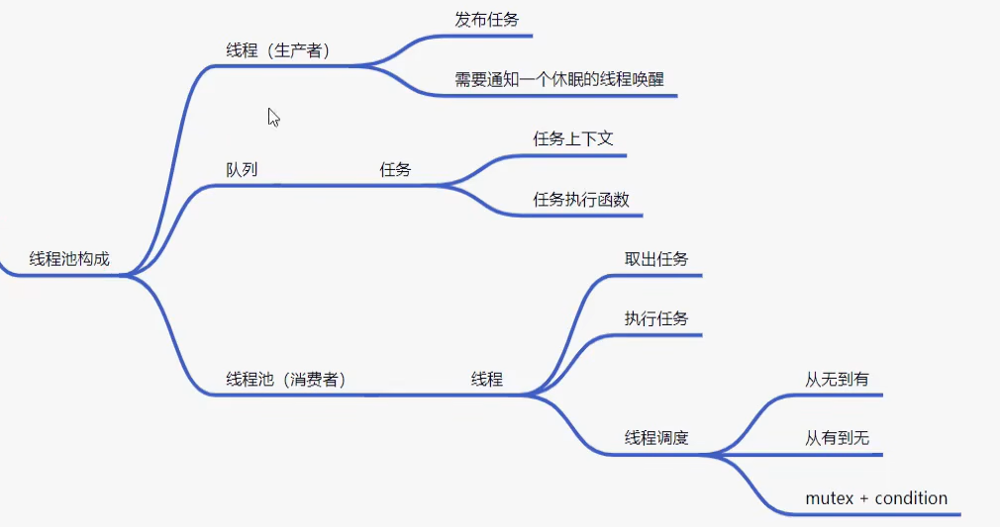


#  网络编程

[select中的fd_set](https://blog.csdn.net/Fuel_Ming/article/details/122931926)

####  TCP通信流程

```
	server:
		1. socket()	创建socket

		2. bind()	绑定服务器地址结构

		3. listen()	设置监听上限

		4. accept()	阻塞监听客户端连接

		5. read(fd)	读socket获取客户端数据

		6. 小--大写	toupper()

		7. write(fd)

		8. close();

	client:

		1. socket()	创建socket

		2. connect();	与服务器建立连接

		3. write()	写数据到 socket

		4. read()	读转换后的数据。

		5. 显示读取结果

		6. close()

```

####  UDP通信流程

```
	recv()/send() 只能用于 TCP 通信。 替代 read、write

	accpet(); ---- Connect(); ---被舍弃

	server：

		lfd = socket(AF_INET, STREAM, 0);	SOCK_DGRAM --- 报式协议。

		bind();

		listen();  --- 可有可无

		while（1）{

			read(cfd, buf, sizeof) --- 被替换 --- recvfrom（） --- 涵盖accept传出地址结构。
            小-- 大
				
			write();--- 被替换 --- sendto（）---- connect
		}
		close();

client：

		connfd = socket(AF_INET, SOCK_DGRAM, 0);

		sendto（‘服务器的地址结构’， 地址结构大小）

		recvfrom（）

		写到屏幕

		close();


ssize_t recvfrom(int sockfd, void *buf, size_t len, int flags,struct sockaddr *src_addr, socklen_t *addrlen);

					sockfd： 套接字

					buf：缓冲区地址

					len：缓冲区大小

					flags： 0

					src_addr：（struct sockaddr *）&addr 传出。 对端地址结构

					addrlen：传入传出。

				返回值： 成功接收数据字节数。 失败：-1 errn。 0： 对端关闭。


ssize_t sendto(int sockfd, const void *buf, size_t len, int flags,const struct sockaddr *dest_addr, socklen_t addrlen);

					sockfd： 套接字

					buf：存储数据的缓冲区

					len：数据长度

					flags： 0

					src_addr：（struct sockaddr *）&addr 传入。 目标地址结构

					addrlen：地址结构长度。

				返回值：成功写出数据字节数。 失败 -1， errno		

```


####  tcp第三次握手失败

> [详细解释](https://www.zhihu.com/question/36495943?sort=created)
>
> 在建立 TCP 连接时，如果第三次握手的 ACK，服务端无法收到，则服务端就会短暂处于 `SYN_RECV` 状态，而客户端会处于 `ESTABLISHED` 状态。
>
> 由于服务端一直收不到 TCP 第三次握手的 ACK，则会一直重传 SYN、ACK 包，直到重传次数超过 `tcp_synack_retries` 值（默认值 5 次）后，服务端就会断开 TCP 连接。
>
> 而客户端则会有两种情况：
>
> - 如果客户端没发送数据包，一直处于 `ESTABLISHED` 状态，然后经过 2 小时 11 分 15 秒才可以发现一个「死亡」连接，于是客户端连接就会断开连接。
> - 如果客户端发送了数据包，一直没有收到服务端对该数据包的确认报文，则会一直重传该数据包，直到重传次数超过 `tcp_retries2` 值（默认值 15 次）后，客户端就会断开 TCP 连接。
>
> [解释1](https://blog.csdn.net/ActionTech/article/details/124858827)

**服务端**

* 没有收到ACK, 处于 `SYN_RECV` 状态
* 超时重传了 SYN、ACK 包，重传5 次，也就是**超过 tcp_synack_retries 的值（默认值是 5），然后就没有继续重传了，此时服务端的 TCP 连接主动中止了，所以刚才处于 SYN_RECV 状态的 TCP 连接断开了**

**客户端**

* 收到第二次握手的SYN和ACK后就进入了`ESTABLISHED` 状态
* 建立连接后就发送数据
  * 客户端向服务端发送数据包时，由于服务端的 TCP 连接已经退出了，所以数据包一直在超时重传，共重传了 15 次， telnet 就断开了连接
    * TCP 建立连接后的数据包传输，最大超时重传次数是由 `tcp_retries2` 指定，默认值是 15 次
* 建立连接后不发送数据
  *  TCP 的 **保活机制**进行处理
    * 定义一个时间段，在这个时间段内，如果没有任何连接相关的活动，TCP 保活机制会开始作用，每隔一个时间间隔，发送一个「探测报文」，该探测报文包含的数据非常少，如果连续几个探测报文都没有得到响应，则认为当前的 TCP 连接已经死亡，系统内核将错误信息通知给上层应用程序

####  拥塞控制/流量控制

> https://xiaolincoding.com/network/3_tcp/tcp_feature.html

* 流量控制是避免「发送方」的数据填满「接收方」的缓存
* **拥塞控制**，控制的目的就是**避免「发送方」的数据填满整个网络**


####  **select**

* 优点
  * 跨平台
* 缺点
  * 监听上限1024
  * 每次需要遍历fd_set，找到有读事件的文件并处理
    * 需要自己构建一个监听的文件描述符的集合数组来优化这个问题
  * 每次select都是系统调用，都要切换用户态和内核态，fd_set要不在用户态和内核态直接反复拷贝
* 参数

```c++
int select(int nfds, fd_set *readfds, fd_set *writefds,fd_set *exceptfds, struct timeval *timeout);

		nfds：监听的所有文件描述符中，最大文件描述符+1

		readfds： 读 文件描述符监听集合。	传入、传出参数

		writefds：写 文件描述符监听集合。	传入、传出参数		NULL

		exceptfds：异常 文件描述符监听集合	传入、传出参数		NULL

		timeout： 	> 0: 	设置监听超时时长。

				   NULL:	阻塞监听 （timeout）

				      0：	非阻塞监听，轮询 （timeout）
		返回值：

			> 0:	所有监听集合（3个）中， 满足对应事件的总数。

			  0：	没有满足监听条件的文件描述符

			 -1： 	errno

```


####  **poll**

* 优点：
  * 自带数组结构。 可以将 监听事件集合 和 返回事件集合 分离。
  * 拓展 监听上限。 超出 1024限制。

* 缺点：
  * 不能跨平台。 Linux
  * 无法直接定位满足监听事件的文件描述符， 编码难度较大。
* 参数

```c++
int poll(struct pollfd *fds, nfds_t nfds, int timeout);

		fds：监听的文件描述符【数组】

			struct pollfd {
				
				int fd：	待监听的文件描述符
				
				short events：	待监听的文件描述符对应的监听事件

						取值：POLLIN、POLLOUT、POLLERR

				short revnets：	传入时， 给0。如果满足对应事件的话， 返回 非0 --> POLLIN、POLLOUT、POLLERR
			}

		nfds: 监听数组的，实际有效监听个数。

		timeout:  > 0:  超时时长。单位：毫秒。

			      -1:	阻塞等待

			       0：  不阻塞

		返回值：返回满足对应监听事件的文件描述符 总个数。

```


####  **epoll**

> epoll是Linux下多路复用IO接口select/poll的增强版本，它能显著提高程序在**大量并发连接中只有少量活跃**的情况下的系统CPU利用率

* 优点：
  *  高效。突破1024文件描述符。

* 缺点：
  * 不能跨平台。 Linux。

```c++
	int epoll_create(int size);						//创建一棵监听红黑树

		size：创建的红黑树的监听节点数量。（仅供内核参考。）

		返回值：指向新创建的红黑树的根节点的 fd。 

			   失败： -1 errno
            

	int epoll_ctl(int epfd, int op, int fd, struct epoll_event *event);	//操作监听红黑树

		epfd：epoll_create 函数的返回值。 epfd

		op：对该监听红黑数所做的操作。

			EPOLL_CTL_ADD 添加fd到 监听红黑树

			EPOLL_CTL_MOD 修改fd在 监听红黑树上的监听事件。

			EPOLL_CTL_DEL 将一个fd 从监听红黑树上摘下（取消监听）

		fd：
			待监听的fd

		event：	本质 struct epoll_event 结构体 地址

			成员 events：
	
				EPOLLIN / EPOLLOUT / EPOLLERR

			成员 data： 联合体（共用体）：

				int fd;	  对应监听事件的 fd

				void *ptr； 

				uint32_t u32;

				uint64_t u64;		

		返回值：成功 0； 失败： -1 errno
            
            
     int epoll_wait(int epfd, struct epoll_event *events, int maxevents, int timeout); 	 //阻塞监听。

		epfd：epoll_create 函数的返回值。 epfd

		events：传出参数，【数组】， 满足监听条件的 那些 fd 结构体。

		maxevents：数组 元素的总个数。 1024
				
			struct epoll_event evnets[1024]
		timeout：

			-1: 阻塞

			0： 不阻塞

			>0: 超时时间 （毫秒）

		返回值：

			> 0: 满足监听的 总个数。 可以用作循环上限。

			0： 没有fd满足监听事件

			-1：失败。 errno
```

####  **ET/LT**

* Edge Triggered (ET) 边缘触发只有数据到来才触发，不管缓存区中是否还有数据。
  * 缓冲区剩余未读尽的数据不会导致epo11_wait返回
  * 使用场景：读取文件的头信息（文件元信息，文件全部信息暂时不用读取）

* Level Triggered (LT) 水平触发只要有数据都会触发。
  * 缓冲区剩余未读尽的数据会导致epo11_wait返回

```c++
 event.events = EPOLLIN | EPOLLET;     // ET 边沿触发  
 // event.events = EPOLLIN;                 // LT 水平触发 (默认)  


epoll 的 ET模式， 高效模式，但是只支持 非阻塞模式。 --- 忙轮询。   ？？？？为什么只支持非阻塞？？？？

		struct epoll_event event;

		event.events = EPOLLIN | EPOLLET;

		epoll_ctl(epfd, EPOLL_CTL_ADD, cfd， &event);	
		
        // 下面三句设置非阻塞
		int flg = fcntl(cfd, F_GETFL);	

		flg |= O_NONBLOCK;

		fcntl(cfd, F_SETFL, flg);


```

#### **epoll反应堆**

> day4-4-源代码-epoll_ET_LT
>
> /learn/network/tcp_epoll/libevent.c
>
> epoll ET模式 + 非阻塞、轮询 + void *ptr

#  PS

###  后端

美团

* mysql
* redis
* 偏java