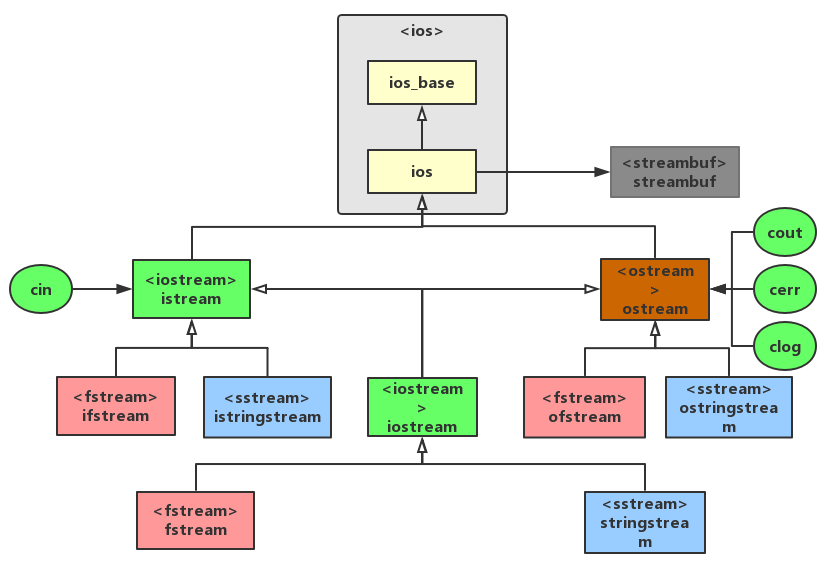

# 文件读写

> [I/O汇总](https://blog.csdn.net/FightFightFight/article/details/85397776)

###  继承关系



- ios_base:表示流的基本特征;
- ios:继承于ios_base,提供了一个指向`streambuf`的指针;
- streambuf:为缓冲区提供了内存，并提供了用于操作缓冲区的方法;
- istream:继承于ios类，提供了输入方法;
- ostream:继承于ios类，提供了输出方法;
- iostream:继承于`istream`和`ostream`,提供了输入输出方法;
- ifstream:继承于`istream`，提供了对文件进行输入的方法;
- ofstream:继承于`ostream`,提供了对文件进行输出的方法;
- fstream:继承于`iostream`，提供了对文件进行输入输出的方法;
- istringstream:继承于`istream`，对字符串进行操作的输入流类;
- ostringstream:继承于`ostream`,对字符串进行操作的输出流类;
- stringstream:继承于`iostream`,对字符串进行操作的输入输出流类;


###  文件打开方式

| 常量             | 含义                                     |
| ---------------- | ---------------------------------------- |
| ios_base::app    | 追加到文件尾(append)                     |
| ios_base::ate    | 打开文件，并流位置标记移到文件尾(at end) |
| ios_base::binary | 二进制文件，非文本文件                   |
| ios_base::in     | 打开文件，允许流进行输入操作，即只读     |
| ios_base::out    | 打开文件，允许流进行输出操作，即只写     |
| ios_base::trunc  | 如果文件存在，则打开文件时进行清零       |

###  读写文本文件

写出文本文件

```c++
#include<iostream>
#include<fstream> // ifstream, ofstream
#include<cassert> // assert

using namespace std;

int main(){
  // 写出文件
  // 1 打开文件
  ofstream out("test.txt");
  // 也可以先定义再打开
  // ofstream out1;      
  // out1.open("test.txt");

  // 2 判断是否打开成功
  assert(out.is_open()); // assert是断言，如果不满足条件，就会报错
  // if(!out.is_open()){
  //   cout<<"open file failed"<<endl;
  //   return 0;
  // }
  // 3 写出文件
  out<<"hello world"<<endl; // 换行也可以写入
  out<<"hello world\n"; // 效果同上面一行

  // 4 关闭文件
  out.close();

  return 0;
}
```

读入文本文件

```c++
#include<iostream>
#include<fstream> // ifstream, ofstream
#include<cassert> // assert


using namespace std;

int main(){
  // 读入文件
  // 1 打开文件
  ifstream in("test.txt");
  // 2 判断是否打开成功
  assert(in.is_open()); // assert是断言，如果不满足条件，就会报错
  // if(!in.is_open()){
  //   cout<<"open file failed"<<endl;
  //   return 0;
  // }
  // 3 读入文件

  // 3.1 读入一行
  string s;
  in>>s;
  cout<<s<<endl;

  // 3.2 使用getline读入多行
  // string line;
  // while(getline(in, line)){
  //   cout<<line<<endl;
  // }

  // 3.3 以某个字符为分隔符，读入多行
  string line;
  char c = ',';
  while(getline(in, line, c)){ // 以逗号为分隔符
    cout<<line<<endl;
  }

  // 3.4 源文本文件中以空格或多个空格分隔，一个字符串一个字符串的读入, 换行也视为空格
  // string line;
  // while (in>>line)
  // {
  //   cout<<line<<endl;
  // }
  

  // 4 关闭文件
  in.close();

  return 0;
}
```

###  读写二进制文件

> [二进制文件读写](https://blog.csdn.net/m0_67168421/article/details/128294861)

写出二进制文件

```c++
#include <iostream>
#include <fstream>  // ofstream类需要包含的头文件。
using  namespace std;
 
int main()
{
      // 文件名一般用全路径，书写的方法如下：
      //  1）"D:\data\bin\test.dat"       // 错误。
      //  2）R"(D:\data\bin\test.dat)"   // 原始字面量，C++11标准。
      //  3）"D:\\data\\bin\\test.dat"   // 转义字符。
      //  4）"D:/tata/bin/test.dat"        // 把斜线反着写。
      //  5）"/data/bin/test.dat"          //  Linux系统采用的方法。
      string filename = R"(D:\data\bin\test.dat)";
      //char    filename[] = R"(D:\data\bin\test.dat)";
 
      // 创建文件输出流对象，打开文件，如果文件不存在，则创建它。
      //ofstream fout(filename, ios::binary);
      //ofstream fout(filename, ios::out | ios::binary);
      //ofstream fout(filename, ios::trunc | ios::binary);
      //ofstream fout(filename, ios::app | ios::binary);
      ofstream fout;
 
      fout.open(filename, ios::app | ios::binary);
 
      // 判断打开文件是否成功。
      // 失败的原因主要有：1）目录不存在；2）磁盘空间已满；3）没有权限，Linux平台下很常见。
      if (fout.is_open() == false)
      {
            cout << "打开文件" << filename << "失败。\n";  return 0;
      }
 
      // 向文件中写入数据。
      struct Data {               // 结构体。
            char name[31];         // 姓名。
            int    no;                    // 编号。  
      }data;
 
      data = { "zq",3};
      fout.write((const char*)&data, sizeof(Data));   // 写入第一块数据。
 
      data = { "qq",8};
      fout.write((const char*)&data, sizeof(Data));     // 写入第二块数据。
 
      fout.close();        // 关闭文件，fout对象失效前会自动调用close()。
 
      cout << "操作文件完成。\n";
}
```

读入二进制文件

```c++
#include <iostream>
#include <fstream>  // ifstream类需要包含的头文件。
using  namespace std;
 
int main()
{
      // 文件名一般用全路径，书写的方法如下：
      //  1）"D:\data\bin\test.dat"       // 错误。
      //  2）R"(D:\data\bin\test.dat)"   // 原始字面量，C++11标准。
      //  3）"D:\\data\\bin\\test.dat"   // 转义字符。
      //  4）"D:/tata/bin/test.dat"        // 把斜线反着写。
      //  5）"/data/bin/test.dat"          //  Linux系统采用的方法。
      string filename = R"(D:\data\bin\test.dat)";
      //char    filename[] = R"(D:\data\bin\test.dat)";
 
      // 创建文件输入流对象，打开文件，如果文件不存在，则打开文件失败。。
      //ifstream fin(filename , ios::binary);
      //ifstream fin(filename , ios::in | ios::binary);
      ifstream fin;
 
      fin.open(filename, ios::in | ios::binary);
 
      // 判断打开文件是否成功。
      // 失败的原因主要有：1）目录不存在；2）文件不存在；3）没有权限，Linux平台下很常见。
      if (fin.is_open() == false)
      {
            cout << "打开文件" << filename << "失败。\n";  return 0;
      }
 
      // 二进制文件以数据块（数据类型）的形式组织数据。
      struct Data {               // 结构体。
            char name[31];         // 姓名。
            int    no;                    // 编号。  
      }data;
 
      while (fin.read((char*)&data, sizeof(data)))
      {
            cout << "name=" << girl.name << "，no=" << girl.no << endl;
      }
 
      fin.close();     // 关闭文件，fin对象失效前会自动调用close()。
 
      cout << "操作文件完成。\n";
}
```

