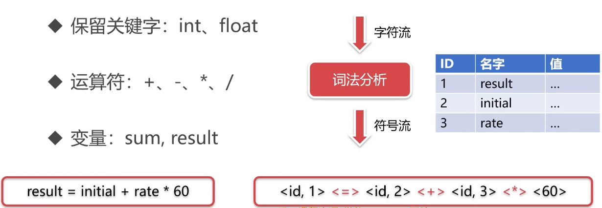

---
 
title: C++interview
date: 2022-01-26 14:43:17
tags:
- C++
categories:
- [C++]
---


#  todo


2 对象默认提供哪些方法

* 默认构造函数
* 拷贝构造函数
* 赋值运算符
* 析构函数

3 C++---全局对象、局部对象、静态对象 ???
4 进程同步方式： 信号量，管程，互斥锁

#  c++

###  对象开辟堆区注意事项

> 对象内使用需要开辟堆区空间的对象时最好的解决方案是不要调用默认构造函数，**直接用初始化列表初始化**，不要在构造函数中初始化

**构造函数和析构函数注意事项**

* 由于对象需要开辟堆区，在析构时需要释放堆区，但是如果是通过默认构造函数初始化对象，就没有开辟堆区，所以在析构时就会对没有开辟空间的地址执行释放空间的操作，这就会导致程序奔溃
  * 总结：**对象有堆区，则在默认构造和有参构造等构造函数中一定要将指针初始化(nullptr或实际的值)**


**拷贝构造函数注意事项**

* 对于堆指针的初始化一定要谨慎，要判断原对象是否开辟过堆空间，若开辟过才进行深拷贝，否则也要将指针初始化为NULL
  * 总结：**拷贝构造函数中也要保证堆指针初始化了**


**对象开辟堆区的情况，最好重载运算符，避免浅拷贝导致的内存访问出错**

* 默认构造一个对象，将有参构造的一个临时对象通过等号运算符赋值给默认构造的对象时，由于是浅拷贝，就会导致默认构造函数在析构时析构的时临时对象的堆地址，但临时对象已经释放过堆区了，这就会导致堆区的多次释放，产生错误
  * 总结：**对象有堆区，一定要自定义拷贝构造和"="构造，实现深拷贝**

**”=“号运算符重载后不适用于临时对象的赋值**

* 因为"="后面赋值的是一个临时变量(右值), 所以重载"="传入的参数应该为右值引用

**对象A作为对象B的成员变量**

* 初始化对象成员变量最好用初始化列表，这样只用只用构造一次，下面Test2的方式

```c++
# include <iostream>
using namespace std;

template<typename item>
class MinHeap
{
private:
  item* id;
  int size;
public:
  MinHeap(int n){
    cout<<"MinHeap: 有参构造函数..."<<endl;
    this->size = n;
    id = new item[n];
  }
    
  MinHeap(): id(NULL), size(0){  // 有指针的情况下，最好初始化为NULL
    cout<<"MinHeap: 默认构造函数..."<<endl;
  }
    
  MinHeap(const MinHeap& mp){
    cout<<"MinHeap: 拷贝构造函数..."<<endl;

    size = mp.size;
    if(mp.id != NULL){ // mp的id有开辟堆空间才需要执行下面操作，否则直接执行下面操作会报错，因为取地址时会报错
      id = new item[mp.size];
      for(int i = 0; i< mp.size; ++i){
        id[i] = mp.id[i];
      }
    }else{
      id = NULL;  // 若mp的id为NULL,则也要初始化为NULL
    }
  }
  // 移动构造
  MinHeap(MinHeap&& mp){
    cout<<"MinHeap: 移动构造函数..."<<endl;
    size = mp.size;
    id = mp.id;
    mp.id = NULL; // 防止析构时重复释放
  }
  MinHeap& operator=(MinHeap& mp){  //  **”=“号运算符重载后不适用于临时对象的赋值**  因为是左值引用，不能匹配右值引用(临时对象)
    cout<<"MinHeap: = 运算符重载..., 传入参数左值引用"<<endl;
    size = mp.size;
    if(id != NULL){ // 本对象已经开辟过堆区
      delete[] id;  // 先释放本对象开辟的堆区
      if(mp.id != NULL){ // mp的id有开辟堆空间才需要执行下面操作，否则直接执行下面操作会报错，因为取地址时会报错
        id = new item[mp.size];
        for(int i = 0; i< mp.size; ++i){
          id[i] = mp.id[i];
        }
      }else{
        id = NULL;  // 若mp的id为NULL,则也要初始化为NULL
      }
    }else{
      if(mp.id != NULL){ // mp的id有开辟堆空间才需要执行下面操作，否则直接执行下面操作会报错，因为取地址时会报错
        id = new item[mp.size];
        for(int i = 0; i< mp.size; ++i){
          id[i] = mp.id[i];
        }
      }
    }
    
    return *this;
  }
  MinHeap& operator=(MinHeap&& mp){  //  可以匹配右值引用(临时对象)
    cout<<"MinHeap: = 运算符重载..., 传入参数右值引用"<<endl;
    size = mp.size;
    if(id != NULL){ // 本对象已经开辟过堆区
      delete[] id;  // 先释放本对象开辟的堆区
    }
    id = mp.id;
    mp.id = NULL; // 防止析构时重复释放
    return *this;
  }
  ~MinHeap(){
    if(id != NULL){
      // cout<<"id != NULL"<<endl;
      delete[] id;
      id = NULL;
    }
    cout<<"~MinHeap: 析构函数..."<<endl;
    // delete[] id;
  }
};

// 直接赋值初始化对象
class Test1
{
private:
  MinHeap<int> mp;
  // MinHeap<int> mp = MinHeap<int>(10); // 这种写法同MinHeap<int> mp;， 只是初始化是有参构造
  int size;

public:
  Test1(int n){
    size = n;
    // mp(MinHeap<int>(n)); //  报错， 这种方式初始化，只能是在初始化列表中初始化，不能在函数体中初始化
    mp = MinHeap<int>(n); // 有参构造并赋值给mp,然后就地销毁     MinHeap<int>(n)匿名对象
    
  }
};

// 初始化列表初始化对象
class Test2
{
private:
  // MinHeap<int> mp;
  MinHeap<int> mp = MinHeap<int>(10);
  int size;

public:
  Test2(int n): mp(MinHeap<int>(n)){ // 这里的初始化列表会覆盖MinHeap<int> mp = MinHeap<int>(10);的初始化
    size = n;
    // mp = MinHeap<int>(n);
    
  }
};

int main(){
  // 注意事项1： 构造和析构注意事项，结合初始化列表和赋值初始化对比理解
  int n = 10;
  // Test1 t1(n);
  // 打印结果
  // MinHeap: 默认构造函数...   // 对象初始化时，先调用默认构造函数，初始化mp
  // MinHeap: 有参构造函数...   // 临时对象初始化
  // MinHeap: = 运算符重载..., 传入参数右值引用   // 临时对象赋值给mp,然后就地销毁
  // ~MinHeap: 析构函数...      // 临时对象销毁
  // ~MinHeap: 析构函数...      // mp销毁

  // Test2 t2(n);
  // 打印结果
  // MinHeap: 有参构造函数...
  // ~MinHeap: 析构函数...
  
  // 注意事项2： 拷贝构造函数注意事项
  // MinHeap<int> mp(n);
  // MinHeap<int> mp1(mp);  // 调用拷贝构造函数初始化
  // MinHeap<int> mp2 = mp; // 调用拷贝构造函数初始化
  // 打印结果
  // MinHeap: 有参构造函数...
  // MinHeap: 拷贝构造函数...
  // MinHeap: 拷贝构造函数...
  // ~MinHeap: 析构函数...
  // ~MinHeap: 析构函数...
  // ~MinHeap: 析构函数...

  // 注意事项3： 操作符的重载，下面的情况是操作符没重载的情况, =======而且需要没有写移动构造函数，否则默认"="不能用
  // MinHeap<int> m3;  // 默认构造
  // m3 = MinHeap<int>(n);  // 不会调用拷贝构成初始化，而是”=“的赋值操作， 区别于上面的等号拷贝构造的初始化
  // 打印结果
  // Test: 默认构造函数...
  // Test: 有参构造函数...
  // Test: 析构函数...
  // Test: 析构函数...
  // free(): double free detected in tcache 2   // 析构两次报错
  // Aborted (core dumped)
    
    
  // 注意事项4：运算符重载
  MinHeap<int> mp4;
  MinHeap<int> mp5(n);  
  mp4 = MinHeap<int>(n); // 编译报错
  mp4 = mp5;  // 编译成功，调用的自己重载的=
  // 打印结果
  // MinHeap: 默认构造函数...
  // MinHeap: 有参构造函数...
  // MinHeap: 有参构造函数...
  // MinHeap: = 运算符重载..., 传入参数右值引用
  // ~MinHeap: 析构函数...
  // MinHeap: = 运算符重载..., 传入参数左值引用
  // ~MinHeap: 析构函数...
  // ~MinHeap: 析构函数...
}
```

###  移动构造函数导致默认"="构造不能用

```c++
#include <iostream>
#include <string>
#include <memory>
using namespace std;

template<typename item>
class Test
{
private:
  item* id;
public:
  Test(): id(NULL){
    cout<<"Test: 默认构造函数..."<<endl;
  }
  Test(item n): id(new item(n)){
    cout<<"Test: 有参构造函数..."<<endl;
  }

  // 拷贝构造函数
  Test(const Test& t){
    cout<<"Test: 拷贝构造函数..."<<endl;
    if(t.id != NULL){
      id = new item(*t.id);
    }else{
      id = NULL;
    }
  }
  // 移动构造函数
  Test(Test&& t){
    cout<<"Test: 移动构造函数..."<<endl;
    id = t.id;
    t.id = NULL;
  }

  // 析构函数
  ~Test(){
    cout<<"Test: 析构函数..."<<endl;
    if(id != NULL){
      delete id;
      id = NULL;
    }
  }

};


int main()
{
  Test<int> t1;
  // 删除自定义的移动构造函数后就可以正常使用了
  t1 = Test<int>(10); // 报错 无法引用 函数 "Test<item>::operator=(const Test<int> &) [其中 item=int]" (已隐式声明) -- 它是已删除的函数
  return 0;
}


```


###  返回值const引用  待解决

```c++
  class NestedInteger {
    public:
      // Return true if this NestedInteger holds a single integer, rather than a nested list.
      bool isInteger() const;
 
      // Return the single integer that this NestedInteger holds, if it holds a single integer
      // The result is undefined if this NestedInteger holds a nested list
      int getInteger() const;
 
      // Return the nested list that this NestedInteger holds, if it holds a nested list
      // The result is undefined if this NestedInteger holds a single integer
      const vector<NestedInteger> &getList() const;
  };


// 栈
class NestedIterator {
private:
  stack<pair<vector<NestedInteger>::iterator, vector<NestedInteger>::iterator>> st; 
public:
    NestedIterator(vector<NestedInteger> &nestedList) {
      // st.push({nestedList.begin(), nestedList.end()});
        st.emplace(nestedList.begin(), nestedList.end());
    }
    
    int next() {
        return st.top().first++->getInteger();
    }
    
    bool hasNext() {
      while (!st.empty())
      {
        auto& p = st.top();
        if(p.first == p.second){
          st.pop();
          continue;
        }
        if(p.first->isInteger()){
          return true;
        }
        auto& ft = p.first++->getList();
        // st.push({ft.begin(), ft.end()});  返回的vector引用是const   // 不可行--------------------------
        st.emplace(ft.begin(), ft.end());    //  可行
      }
      return false;
    }
};
```


#  八股文


##  面试宝典

说说内联函数和宏函数的区别

简述C+＋从代码到可执行二进制文件的过程

简述一下atomic (原子操作)内存顺序

> https://blog.csdn.net/WilliamCode/article/details/126139289

内存对齐

> 案例1：https://blog.csdn.net/weixin_40775703/article/details/104941508  **重要**
>
> 案例2：https://blog.csdn.net/qq_39397165/article/details/119745975

* 编译器默认对齐数
  * 64位  对齐数：8
  * 32位  对齐数：4
* 内存对齐规则
  * 结构体成员对齐规则，对齐数= min(编译器默认对齐数，结构体当前成员变量大小)
  * 结构体本身对齐规则，对齐数= min(编译器默认对齐数,   结构体成员中最长类型变量大小)
  * 嵌套结构体对齐规则，把嵌套结构体视为成员变量即可，大小即为结构体大小
* 对于类的某个实例（对象）而言，**成员函数、静态变量**都不会占空间，只有**成员变量占空间**，而只考虑成员变量的类相当于一个结构体

```c++
// 结构体成员对齐案例
#include<iostream>
using namespace std;
struct S1
{
	char c1;
	char c2;
	int i1;
};
struct S2
{
  char c1;  // min{编译器默认对齐数，该成员变量大小} = min(8, 1) = 1   存在[0]位置
  int i1;   // min{编译器默认对齐数，该成员变量大小} = min(8, 4) = 4   存在[4,7]位置  因为int要对齐4的倍数，所以[1,3]空
  char c2;  // min{编译器默认对齐数，该成员变量大小} = min(8, 1) = 1   存在[8]位置
};
// 原数据占用空间为9， 但s2最大对齐数为4 所以[9,11]空   总大小为12   9补齐为4的倍数
struct S3
{
	char c1;  // min{编译器默认对齐数，该成员变量大小} = min(8, 1) = 1   存在[0]位置
  double d1;  // min{编译器默认对齐数，该成员变量大小} = min(8, 8) = 8   存在[8,15]位置  因为double要对齐8的倍数，所以[1,7]空
	int i1;  // min{编译器默认对齐数，该成员变量大小} = min(8, 4) = 4   存在[16,19]位置
	char c2; // min{编译器默认对齐数，该成员变量大小} = min(8, 1) = 1   存在[20]位置
};
// 原数据占用空间为21， 但s3最大对齐数为8 所以[21,23]空   总大小为24   21补齐为8的倍数

struct S4 { 
  int a[5]; // 20
  char b;  // 21
  double c; // 对齐数为8 所以[22,23]空，填充[24,31]
}; 
// 原数据占用空间为32
int main()
{
	cout <<"sizeof(S1)"<< sizeof(S1)<<endl; // 8
	cout << "sizeof(S2)"<<sizeof(S2)<<endl; // 12
	cout << "sizeof(S3)"<<sizeof(S3)<<endl; // 24
  cout << "sizeof(S4)"<<sizeof(S4)<<endl; // 32
	return 0;
}
```

```c++
// 嵌套结构体
#include<iostream>
using namespace std;
struct S0
{
  int i1;
  int i2;
};
struct S1
{
	double d1;
	double d2;
};
struct S2
{
	char c1; // min(8, 1) = 1   [0]
	S1 s1; // min(8, 8) = 8  [8,23]  结构体的对齐数为min(编译器默认对齐数,   结构体成员中最长类型变量大小)
	char c2; // min(8, 1) = 1  [24]
};
struct S4
{
  char c1; // min(8, 1) = 1   [0]
	S0 s0; // min(8, 4) = 4  [4, 11] 结构体的对齐数为min(编译器默认对齐数,   结构体成员中最长类型变量大小)
	char c2; // min(8, 1) = 1  [12]
};
// 本身大小13 最大对齐数为4  补齐[14, 15]  13 --> 16
int main()
{
  cout << "sizeof(S0):"<<sizeof(S0)<<endl; // 8
	cout <<"sizeof(S1):"<< sizeof(S1)<<endl; // 16
	cout << "sizeof(S2):"<<sizeof(S2)<<endl; // 32
  cout << "sizeof(S4):"<<sizeof(S4)<<endl; // 16
	return 0;
}

```


说说C 如何 实现C+ 语言中的重载

 简述下向上转 和向下转型 对象

移动构造函数

> https://blog.csdn.net/weixin_44788542/article/details/126284429

虚析构函数

> https://blog.csdn.net/qq_15821883/article/details/105540175

* 使得基类指针可以调用派生类的析构函数
* 如果基类析构函数不是虚析构函数，在基类指针delete的时候只会调用基类的析构函数，不会调用派生类的析构函数，就会导致派生类的内存泄露

1.3.33仿函数

> C++ 仿函数为何而生:https://zhuanlan.zhihu.com/p/362323211 

> C++中的explicit详解: https://blog.csdn.net/k6604125/article/details/126524992

友元函数

>  C++友元函数: https://blog.csdn.net/weixin_59179454/article/details/127574320

1.3.36 虚函数表里存放的内容是什么时候写进去的？

> https://www.bilibili.com/read/cv12864050/

1.4.10 STL 容器动态链接可能产生的问题

右值引用和move

> https://blog.csdn.net/qq_40637903/article/details/1080519586

1.5.11 C+＋中四种类型转换分别为const_cast static_cast dynamic_cast reinterpret_cast,

> https://blog.csdn.net/Awesomewan/article/details/117112781

1.5.13  简述一下 C++ll 中的可变参数模板新特性

> https://blog.csdn.net/unity3d_xyz/article/details/108450820


2.2文件权限修改

> http://m.biancheng.net/view/752.html
>
> https://blog.csdn.net/qq_36501591/article/details/87273384
>
> https://www.cnblogs.com/devgis/p/16382356.html

2.5 说软链接和硬链接的区别

> https://www.cnblogs.com/oceanftd/p/13475643.html

2.6 说说静态库和动态库怎么制作及如何使用，区别是什么

> https://blog.csdn.net/fightingtingting/article/details/125437706
>
> c++: https://blog.csdn.net/mzc_love/article/details/128158943

2.8 说说什么是大端小端，如何判断大端小端

> https://blog.csdn.net/m0_58250087/article/details/126453463
>
> union: https://blog.csdn.net/std7879/article/details/125001689

2.26 请你说说什么是孤儿进程，什么是僵尸进程，如何解决僵尸进程

> 危害： https://blog.csdn.net/a745233700/article/details/120715371

2.27 说说什么是守护进程，如何实现

> 待学习

2.44 说说什 是信号量， 有什 作用

> https://blog.csdn.net/weixin_43914272/article/details/108317212

2.52  简述Linux零拷贝的原理

> 深度原理：https://www.cnblogs.com/yrxing/p/16684064.html
>
> 简单原理：https://www.elecfans.com/consume/1171431.html
>
> * 传统I/O方式与零拷贝方式对比即图示

* DMA技术
  * 不需要CPU
  * 从磁盘拷贝到内核缓存区
  * 从内核缓存区拷贝到协议引擎中（传输到网络中）

2.53 简述epoll select 的区别， epoll为什么高效

> 简单解释：https://www.jianshu.com/p/c9190109c7d8
>
> 系统解释：https://blog.csdn.net/www_dong/article/details/113532077
>
> 视频教程：https://www.bilibili.com/video/BV1qJ411w7du/?spm_id_from=333.337.search-card.all.click&vd_source=7230a052308bbb41976f248d2c778e3a
>
> seclect、poll 阻塞函数
>
> redis、nginx、java(N2O)都是使用epoll

select

* 优点(相较于自己实现)：
  * 所有任务一次传给内核态，如果是自己实现，需要一个个判断，每个判断是否有数据传来都要切换到内核态
* 缺点：
  * 1 由于bitmap数据结构的特性，最多只能支持1024个请求
  * 2 rset不能重用，没有都要遍历重置
  * 3 仍然有用户态内核态的切换
  * 4 内核态返回，需要O(n)时间复杂度找到有数据的请求是哪个


poll

* 优点(相较于select):
  * 支持更多请求，因为pollfds数组是没有上限的
  * 不用重置pollfds，只用每次修改revent即可
* 缺点：
  * 仍然没有解决select中提到的3，4缺点


epoll

* 优点：
  * epfd是用户态和内核态共享的，所以解决了用户态和内核态切换的开销
  * 内核态在轮询的时候，会对有数据的请求进行重排，即有数据的请求放到epfd前面，并且有返回值，返回值为有数据的请求个数，这样就可以只用遍历有数据的请求了，解决了O(N)复杂度的遍历


2.54 说说多路IO复用技术有哪些，区别是什么

> * IO多路复用：I/O是指网络I/O,多路指多个TCP连接(即socket或者channel）,复用指复用一个或几个线程。意思说一个或一组线程处理多个TCP连接。最大优势是减少系统开销小，不必创建过多的进程/线程，也不必维护这些进程/线程。
> * IO多路复用使用两个系统调用(select/poll/epoll和recvfrom)，blocking IO只调用了recvfrom；select/poll/epoll 核心是可以同时处理多个connection，而不是更快，所以连接数不高的话，性能不一定比多线程+阻塞IO好,多路复用模型中，每一个socket，设置为non-blocking,阻塞是被select这个函数block，而不是被socket阻塞的
>
> https://www.shuzhiduo.com/A/MyJx7qXXzn/
>
> https://blog.csdn.net/liyaomeng/article/details/107891133

2.57 简述同步与异步的区别，阻塞与非阻塞的区别

> https://blog.csdn.net/liyaomeng/article/details/107891133

* 阻塞与非阻塞指的是用户态的程序执行是否阻塞
* 同步与异步指的是同时是否能处理多个任务，同步只能处理一个，异步可以处理多个
  * 多路IO复用技术(select、poll、epoll)就是异步阻塞的，阻塞是因为select、poll、epoll调用的时候代码是阻塞的，得等待系统态返回，异步是指可以同时处理多个任务

2.58 BIO NIO有什么区别

> https://blog.csdn.net/lzb348110175/article/details/98941378

3.3 简述域名解析过程，本机如何干预域名解析

> 有图：https://baijiahao.baidu.com/s?id=1754073275573332761&wfr=spider&for=pc

3.5 简述网关的作用是什么，同一网段的主机如何通信

> 子网掩码的使用：https://blog.csdn.net/m0_51292856/article/details/128557189
>
> https://blog.csdn.net/AutumnGingkgo/article/details/122392220
>
> https://blog.csdn.net/xuhao0258/article/details/118051122?utm_medium=distribute.pc_relevant.none-task-blog-2~default~baidujs_baidulandingword~default-0-118051122-blog-122392220.pc_relevant_landingrelevant&spm=1001.2101.3001.4242.1&utm_relevant_index=3

3.6 简述CSRF攻击的思想以及解决方法

> https://blog.csdn.net/weixin_44052462/article/details/122988438
>
> 为什么token可以防止CSRF，但cookie不行：https://blog.csdn.net/JinYJ2014/article/details/122931481
>
> * cookie是自动携带的，但是token是需要手动设置每次访问都携带的
>
> Cookie、session和token的区别：https://blog.csdn.net/inthat/article/details/103967592

3.28 简述 TCP 协议的延迟 ACK 和累计应答

> **累计应答：** 对应发送的包都要进行应答，但不是一个个应答，而是会**应答某个之前的ID**,这个ID前边的已经接收完毕。
>
> https://blog.csdn.net/q473203506/article/details/122908332

3.31 说说端到端，点到点的区别

> https://blog.csdn.net/weixin_46437478/article/details/107089472

3.40 简述 HTTPS 的加密与认证过程

> 流程：https://blog.csdn.net/m0_52256357/article/details/126910921
>
> 解释：https://blog.csdn.net/lamperouge_conan/article/details/109575631

#  操作系统

##  prelearn

> [局部性原理](https://www.zhihu.com/question/25142664)
>
> L1d cache:           32K
> L1i cache:           32K
> L2 cache:            1024K
> L3 cache:            19712K
>
> adj_index
>
> adj: 入度个数，出度个数，入度id1，入度id1属性，入度id2，入度id2属性，出度id1，出度id1属性，出度id2，出度id2属性
>
> 一次cache切换
>
> 原始：正逆向索引2次，出入度查询2次，邻接点每次属性查询都要cache查询

**进程与线程**

进程是系统进行资源分配和调度的基本单位

线程是操作系统进行运行调度的最小单位
包含在进程之中，是进程中实际运行工作的单位
一个进程可以并发多个线程，每个线程执行不同的任务

**计算密集型和内存密集型**

计算密集型就是CPU密集型

内存密集型就是IO密集型，例如读写网络和磁盘，适用于超线程

**局部性原理**

局部性原理是指CPU访问存储器时，无论是存取指令还是存取数据，所访问的存储单元都趋于聚集在一个较小的连续区域中。

**页式存储管理和段式存储管理**

页式存储管理

* 将进程逻辑空间等分成若干大小的页面

* 相应的把物理内存空间分成与页面大小的物理块

* 以页面为单位把进程空间装进物理内存中分散的物理块

* *有一段连续的逻辑分布在多个页面中，将大犬降低执行效率*

段式存储管理

* 将进程逻辑空间划分成若干段（非等分)
* 段的长度由连续逻辑的长度决定
* *段式存储管理相比页式存储管理更加灵活*

段页式存储管理

* 先将逻辑空间按段式管理分成若干段
* 再把段内空间按页式管理等分成若干页

**页面置换算法LRU、LFU**

缓存置换算法

* 先进先出算法(FIFO)
* 最近最少使用算法(LRU)
* 最不经常使用算法(LFU)

**磁盘冗余阵列详解**

* RAID是什么?
  * RAID(Redundant Array of Independent Disks):磁盘冗余阵列
  * 磁盘冗余阵列:利用虚拟化存储技术把多个硬盘组合起来，成为一个或多个硬盘阵列组，目的为提升性能或减少冗余,或是两者同时提升。

* RAID 0
  * 性能:单块磁盘的N倍
  * 不提供数据校验和数据冗余
  * 某块磁盘损坏，数据直接丢失且无法恢复

* RAID 1
  * 数据无差别双写工作磁盘和镜像磁盘
  * 性能:单块磁盘的N/2倍
  * 数据可靠性强，只要不是同时损坏，都可以恢复

* RAID 5
  * 数据中心最常见的RAID等级
  * 提供纠错海明码实现数据冗余校验
  * 分散校验盘，提高写性能，降低校验盘出错概率


* RAID 10
  * RAID0+RAID1
  * 既保证了数据冗余又保证了读写效率
  * 磁盘空间存储冗余，浪费严重


**同步问题三大经典案例**

* 生产者-消费者问题
  * 一组生产者进程、一组消费者进程、一个缓冲区
  * 生产者在缓冲区溢出前，不断往缓冲区生产数据
  * 消费者在缓冲区为空前，不断从缓冲区消费数据
  * 生产者-消费者通过缓冲区存在同步关系
    * 当缓冲区满时，生产者必须等待消费者消费数据
    * 当缓冲区空时，消费者必须等待生产者生产数据
  * 生产者-消费者、生产者之间、消费者之间存在互斥关系
    * 对缓冲区数据进行存取操作时，必须互斥进行

* 读者-写者问题
  * 读-写操作之间存在同步关系
  * 多个写操作应该串行完成

* 哲学家进餐问题
  * 有五个哲学家，他们的生活方式是交替地进行思考和进餐，哲学家们共同使用一张圆桌，分别坐在周围的五张椅子上，在圆桌上有五个碗和五支筷子。平时哲学家们只进行思考，饥饿时则试图取靠近他们的左、右两支筷子，只有两支筷子都被他拿到的时候就能进餐，进餐完毕之后，放下左右筷子继续思考。

**锁的种类详解**

* 乐观锁/悲观锁
  * 悲观锁每次操作都加锁、乐观锁默认不添加锁
  * 悲观锁适合写操作的场景
  * 乐观锁适合读操作的场景（获得资源后直接操作，再写回时判断原数据是否修改过）

* 无锁/偏向锁/轻量级锁/重量级锁
  * 无锁:不锁资源，多个线程只一个线程修改成功，其他线程会重试
  * 偏向锁:同一个线程执行临界资源会自动获取资源
  * 轻量级锁:多个线程竞争同步资源时，没有获得资源的线程自旋等待锁释放
    * 自旋是指一直占用CPU，不会发生上下文切换
  * 重量级锁:多个线程竞争同步资源时，没有获得资源的线程阻塞等待唤醒
    * 阻塞是指会让出CPU，发生上下文切换

* 公平锁/非公平锁
  * 公平锁：所有等待资源的线程都按先后顺序加入等待队列，当资源释放时，这些线程都被唤醒，开始竞争资源
  * 非公平锁：后来的线程可以直接插队获取资源，如果获取成功就不用调出CPU可以直接继续执行，如果没有获取成功则需要加入队列尾部，等资源释放后公平竞争资源
  * 公平锁的优点:等待锁的线程不会饥饿等待（都是公平竞争的）
  * 公平锁的缺点:整体吞吐效率相对非公平锁要低（资源释放时需要唤醒所有等待的线程进行资源竞争）
  * 非公平锁的优缺点:整体的吞吐效率高，CPU不必唤醒所有线程
    * 如果插队成功，对于插队的线程不用调出CPU可以直接继续执行，且不用唤醒队列中的等待的线程

* 可重入锁/非可重入锁
  * 可重入锁又名递归锁， 是指在同一个线程在外层方法获取锁的时候，再进入该线程的内层方
    法会自动获取锁，不会因为之前已经获取过还没释放而阻塞。
  * 不可重入锁， 当前线程再次获取当前线程已经获得的锁时，如果该锁仍被当前线程所持有,
    未被释放，那么将会出现死锁。

* 共享锁/排他锁
  * 排他锁(互斥锁)是指该锁一次只能被一个线程所持有
  * 共享锁是指该锁可被多个线程所持有
  * 获得共享锁的线程只能读数据，不能修改数据

**线程间通信**

* 互斥锁(mutex)
  * 互斥量是 最简单的线程同步的方法
  * 互斥量(互斥锁)，处于两态之-的变量:解锁和加锁
  * 两个状态可以保证资源访问的串行

* 自旋锁(spin_ lock)
  * 自旋锁也是一种多线程同步的变量
  * 使用自旋锁的线程会反复检查锁变量是否可用
  * 自旋锁不会让出CPU，是一种忙等待状态（忙等待就是等待时一直占用CPU）
  * 自旋锁避免了进程或线程.上下文切换的开销
  * 操作系统内部很多地方使用的是自旋锁
  * 自旋锁不适合在单核CPU使用

* 读写锁(rwlock)
  * 读写锁是一种特殊的自旋锁
  * 允许多个读者同时访问资源以提高读性能，但写的时候还是互斥的

* 条件变量
  * 条件变量是一种相对复杂的线程同步方法
  * 条件变量允许线程睡眠，直到满足某种条件
  * 当满足条件时，可以向该线程信号,通知唤醒

**进程间通信**

* 进程VS线程
  * 线程是系统进行运行调度的最小单位
    * 线程是共享进程资源的
  * 进程是系统进行资源分配和调度的基本单位
    * 进程之间的资源是独立的

* 管道(pipe)
  * 不可跨机器
  * 这里的"I” 实际上就是管道的意思，"I” 前面部分作为"I” 后面的输入。

```
netstat -anlp | grep 8080
cat server.log | grep ERROR | grep Thread
man netstat | more
```

* 消息队列
  * 可跨机器进行进程间通信
  * 相对管道，传输的数据可以序列化（封装）


* 共享内存
  * 不可跨机器


* 信号
  * 不可跨机器
  * 传输的信息是有限的，且是固定的，就是固定数字代表固定指令

* 套接字
  * 网络套接字（跨机进程间通信）
    * 网络层:提供主机之间的通信
    * 传输层:提供主机不同进程之间的通信
    * 应用层:提供不同应用之间的通信
  * 域套接字（本机进程间通信）
    * 套接字(socket)原是网络通信中使用的术语
    * 域套接字是一种高级的进程间通信的方法
    * Unix域套接字可以用于同一机器进程间通信
    * Unix系统提供的域套接字提供了网络套接字类似的功能
    * Unix域套接字通信无需经过完整的网络协议栈

**CAS原理与无锁技术详解**

* 大量使用锁的弊端
  * 开发难度:并行系统访问临界资源必须考虑加锁
  * 墨菲定律:只要存在的一定会发生，死锁
  * 调度问题:低优先级线程持有锁导致高优先级线程无法执行
  * 性能问题:满足一致性要求的前提下需要串行访问
  * 锁粒度:锁粒度过小/过大，设计不当

* 基石: CAS技术
  * 原子性:原子性是指一系列操作不可被中断的特性;这一系列操作要么全部执行完成，要么全部没有执行，不存在部分执行，部分未执行的情况。
  * CAS一Compare & Set,或是Compare & Swap,现在几乎所有的CPU指令都支持CAS的原子操作，X86下对应的是CMPXCHG汇编指令。

* CAS与ABA问题
  * ABA问题是指CAS交换数据在多次操作后恢复原值而线程无法感知的问题。例如：线程1对原值8修改为9，然后又修改回8，线程2在原值为8时同步线程1开始执行，线程2计算结束后，发现原值开始8，但其实已经被线程修改2次了
  * 解决以上问题的方法：对数据加本版号，就可以确保唯一性

**分布式锁**

* 分布式锁使用场景
  * 订单系统、秒杀系统
  * 积分系统、消费系统
  * 消息中间件、服务中间件、数据发布-订阅
  * 分布式部署:集群、微服务
  * 服务节点之间需要通信
  * 数据强一致性要求、性能要求、并发量要求

* 方案
  * Redis
    * Redis单节点
      * Redis:性能优异的k-v数据库
      * `setnx <key> <value>`  键值对获取资源
      * `del <key>`   释放资源
      * 单点问题、雪崩效应
    * Redis集群
      * 避免单点问题
      * 节点一致性由集群保证
      * 集群如何保证一致性的?  Redis集群原理
  * Zookeeper
    * ZooKeeper是一个分布式的， 开放源码的分布式应用程序协调服务,是Google的Chubby-个开源的实现，是Hadoop和Hbase的重要组件。它是一个为分布式应用提供一致性服务的软件,提供的功能包括:配置维护、域名服务、分布式同步、组服务等
    * 原理
      * Zookeeper数据节点: znode
      * 服务1在Zookeeper创建znode1.
      * 服务2在Zookeeper创建znode1失败
      * 服务1释放znode,服务2创建成功
      * 临时节点:临时节点由某个客户端创建，当客户端与ZK集群断开连接，则该节点自动被删除
  * 基于传统数据库: MySQL
    * MySQL提供一致性服务:事务、表级锁、行级锁
    * UNIQUE KEY:表级唯一, 不能重复插入
    * 通过MySQL保证同一-个KEY只有一个节点能插入成功
    * 通过删除记录释放锁
    * 把锁竞争的压力交给了MySQL,且MySQL同样存在单点问题，需要集群解决

* 分布式锁框架
  * 京东: SharkLock
  * Netflix: Curator
  * Google: Chubby
  * ETCD
  * Redisson
  * consul

**字节码、程序编译与程序解释**

* 编译是将高级语言整体翻译为底层语言在机器上执行，编译是将高级语言翻译成和高级语言逻辑完全一致的低级语言
* 解释是将高级语言作为输入，一句一转换的转换为底层指令在机器上执行


* 编译型语言: C/C+＋、Object-C、Golang
* 解释型语言：Python、Php、Javascript

* java虚拟机
  * Java是一种编译+解释的语言
    * java程序  编译成  JVM字节码 
    * JVM字节码 解释成  机器码
    * 字节码(英语:Bytecode)通常指的是已经经过编译，但与特定机器代码无关，需要解释器转译后才能成为机器代码的中间代码。字节码通常不像源码一样可以让人阅读，而是编码后的数值常量、引用、指令等构成的序列。
  * Java程序 --> Java字节码 --> Java虚拟机 --> 操作系统
  * 没有虚拟机的问题
    * 不同平台不同的编译器
    * 不同平台部署需要重新编译
    * 编译结果不复用
  * 有了Java虚拟机，一次编译，随处运行


**编译器工作原理**

词法分析、语法分析、语义分析、中间代码生成、优化分析、代码生成

* 词法分析



* 语法分析


* 语义分析
  * 构建语义树
  * 检查类型

* 中间代码生成
  * 临时变量的生成
* 优化分析
  * 合并可合并的代码
* 代码生成
  * 生成机器码

**程序运行流程**

预编译、编译、汇编、链接、装载、运行

* 预编译
  * 预编译主要是做一些代码文本的替换工作
  * #define、#include、 条件编译
  * 代码注释

* 编译
  * `g++ -c test.cpp -o test.o`  生成`.o`的文件   `test.cpp ---->  test.o`
* 汇编
  * 将代码转换为机器码
* 链接
  * 目标文件仅仅是当前的源码文件编译成的二进制文件
  * 并没有经过链接过程，是不能够执行的


* 装载
  * 可执行文件加载到内存运行

**JIT技术**

* JIT技术(Just In Time):通常对于存在中间代码的运行系统(Java、Python等), 解释执行过程的效率不如传统本地代码的执行效率，在实现JIT的系统中JIT可以在运行过程动态将中间字节码编译成本地代码，从而加快运行速度。
* 就是将部分源码直接编译成机器码，跳过编译成字节码再解释成机器码的过程
* 使用前提：性能优化收益大于编译消耗（JIT编译的过程是动态的，不是先编译成可执行文件再执行）

**分层存储体系**

* 1cycle是纳秒级别（10的负九次方）
* cycle是CPU的执行周期
* HD: 是硬盘，读写速度要10-50百万（m）个cycle, SSD比以前的HD快一些
* L1，L2, L3是缓存，一般常量会存在这里，频繁访问的数据也存在这里，这样就可以提升访问效率，但是进程切换就会改变缓存中存储的内容，所以要减少进程的切换


**文件系统**

##  马士兵操作系统

> 操作系统：进程管理，内存管理，文件管理，输入输出（设备管理）

###  内存管理

快慢表

* 通过慢表修改数据，需要访问内存两次
  * 访问慢表，拿到块号
  * 通过块号计算出物理地址，访问物理地址
* 快表存储在高速缓存区
  * 只用一次访问内存

二级页表


块表和二级页表解决的问题

* 块表的解决多次访问内存的问题，本质还是解决页表访问慢的问题
* 页表太大，访问速度太慢，所以需要用二级页表
* 二级页表同时解决动态装载的问题，需要时才构建相应的二级页表


段页式存储


内中断与外中断

* 内中断
  * cup产生的中断，如缺页终端，是符合时钟周期的
  * 非cpu产生的中断，如I/O中断请求，人工干预等，是不符合时钟周期的，cpu不可预测

虚拟内存

> 核心是将除CPU外的存储设备都视为内存，通过页面置换算法，页面分配策略等实现在有限的内存空间按需**动态加载**数据保证程序正常运行


#  分布式

Hadoop

> https://blog.csdn.net/m0_46914845/article/details/125762491

Spark

> https://blog.csdn.net/qinlingheshang/article/details/123232539

Hadoop和Spark的对比

> https://blog.csdn.net/Swofford/article/details/125305625

# STL

> [STL六大组件之一——适配器（adapters）](https://blog.csdn.net/C0631xjn_/article/details/128616275)

###  六大部件

容器

算法

分配器

迭代器 iterator

仿函数

* 本质是类，只是使用形式类似函数，在类内部重载了函数执行运算符

适配器

* 容器适配器
  * stack、queue 、priority_queue 都不是容器，而是deque容器的适配器

* 迭代器适配器
* 仿函数适配器
  * bind2nd  绑定第二个参数
  * not1 取反


迭代器begin和cbegin的区别

https://blog.csdn.net/u010987458/article/details/70949112

`greater<int>()和less<int>()的使用`

https://blog.csdn.net/qq_21997625/article/details/76662113

bind2nd

https://www.jianshu.com/p/12860aea987b

```c++
  vector<int> vec = {12,34,5,632,5,689,34,67,89};
  cout<<count_if(vec.begin(), vec.end(), not1(bind2nd(less<int>(), 40)))<<endl; // 4
```


* 用下面的方式替代迭代器的使用

```c++
for(atuo a : res)
for(atuo& a : res)
```


* 容器自带的算法就只能用自带的
  * list自带sort就只能用自带的，不能用全局算法中的sort
  * 全局算法中的sort依赖于数组形式的结构，但list是链表形式的结构，所以list不能用，只能用自带的sort
* 使用分配器

```c++
vector<string,_gnu_cxx::__pool_alloc<string>> vec;
```

* 容器sizeof
  * queue 和 stack内置的是一个deque， 所以大小和deque一样
  * set和map内置红黑树，大小即红黑树的大小


```c++
array<int, 10> a; // 40  元素个数*元素大小
cout<<sizeof(a)<<endl; // 40
array<int, 8> a; // 32
cout<<sizeof(a)<<endl; // 32

vector<int> vec;  // 24  头指针  尾指针  容量尾指针  3*8 = 24
cout<<sizeof(vec)<<endl;

list<int> lis;  // 24
cout<<sizeof(lis)<<endl;

forward_list<double> flist;  // 8
cout<<sizeof(flist)<<endl; // 8

deque<int> deq; // 80 两个迭代器，每个迭代器有3个标志位和一个指针 2*4  本身有一个控制指针和控制容量 （2*4+2）*8 = 80
cout<<sizeof(deq)<<endl; // 80

queue<int> q; // 80
cout<<sizeof(q)<<endl; // 80

stack<int> s; // 80
cout<<sizeof(s)<<endl; // 80


set<double> set; // 48  红黑树 左指针 右指针 父指针 节点颜色
cout<<sizeof(set)<<endl; // 48

map<int, int> map; // 48
cout<<sizeof(map)<<endl; // 48

map<int, vector<R_ID>>  mp; // 48

unordered_map<int, vector<R_ID>>  mp; //56
unordered_map<int, int> umap; // 56
cout<<sizeof(umap)<<endl; // 56
```

###  array

> array不同于其它容器，其它容器是类，有构造函数，array是结构体

```c++
  array<int, 100> arr;
  cout<<sizeof(arr)<<endl; // 100
```

**元素访问**

| [at](https://zh.cppreference.com/w/cpp/container/array/at)(C++11) | 访问指定的元素，同时进行越界检查 (公开成员函数) |
| ------------------------------------------------------------ | ----------------------------------------------- |
| [operator[\]](https://zh.cppreference.com/w/cpp/container/array/operator_at)(C++11) | 访问指定的元素 (公开成员函数)                   |
| [front](https://zh.cppreference.com/w/cpp/container/array/front)(C++11) | 访问第一个元素 (公开成员函数)                   |
| [back](https://zh.cppreference.com/w/cpp/container/array/back)(C++11) | 访问最后一个元素 (公开成员函数)                 |
| [data](https://zh.cppreference.com/w/cpp/container/array/data)(C++11) | 直接访问底层数组 (公开成员函数)                 |

data

* 返回底层数组首地址，不是begin，begin是迭代器，是对首地址封装，概念不同
* 但实质上是data和begin是一样的，在vector和array中迭代器的性质和直接返回的底层数组首地址一样
* https://www.bbsmax.com/A/KE5QybbZ5L/
* https://www.5axxw.com/questions/content/zaxg8g

**迭代器**

| [begincbegin](https://zh.cppreference.com/w/cpp/container/array/begin)(C++11) | 返回指向起始的迭代器 (公开成员函数)     |
| ------------------------------------------------------------ | --------------------------------------- |
| [endcend](https://zh.cppreference.com/w/cpp/container/array/end)(C++11) | 返回指向末尾的迭代器 (公开成员函数)     |
| [rbegincrbegin](https://zh.cppreference.com/w/cpp/container/array/rbegin)(C++11) | 返回指向起始的逆向迭代器 (公开成员函数) |
| [rendcrend](https://zh.cppreference.com/w/cpp/container/array/rend)(C++11) | 返回指向末尾的逆向迭代器 (公开成员函数) |

**容量**

| [empty](https://zh.cppreference.com/w/cpp/container/array/empty)(C++11) | 检查容器是否为空 (公开成员函数)       |
| ------------------------------------------------------------ | ------------------------------------- |
| [size](https://zh.cppreference.com/w/cpp/container/array/size)(C++11) | 返回容纳的元素数 (公开成员函数)       |
| [max_size](https://zh.cppreference.com/w/cpp/container/array/max_size)(C++11) | 返回可容纳的最大元素数 (公开成员函数) |

size=max_size

* max_size官网有解释：因为每个 `std::array<T, N>` 都是固定大小容器，故 `max_size` 返回的值等于 `N` （亦为 [size](https://zh.cppreference.com/w/cpp/container/array/size) 所返回的值）

**操作**

| [fill](https://zh.cppreference.com/w/cpp/container/array/fill)(C++11) | 以指定值填充容器 (公开成员函数) |
| ------------------------------------------------------------ | ------------------------------- |
| [swap](https://zh.cppreference.com/w/cpp/container/array/swap)(C++11) | 交换内容 (公开成员函数)         |

fill

* 填充数组中的每个元素为指定的值： `arr.fill(10)  数组中每个元素都变为10`
* http://www.manongjc.com/detail/31-ektcxzoezjrjuag.html

### vector

size、max_size、capacity

* size: 当前容器中的元素个数
* capacity： 当前已经分配的空间大小，因为vector是动态扩容的
* max_size： 理论上可以容纳的元素个数，即内存分配有关
* size<=capacity<=max_size

> [解决vector.capacity() > vector.size()导致内存空间浪费的问题](https://blog.csdn.net/ganfanren00001/article/details/122024121)
>
> * 存在这个问题的原因：vector的动态增长是倍数增长，压入1时开辟2，压入2时开辟4，压入3不开辟，压入4开辟8，，，
>   * vector相对array存储相同的元素**内存空间会更大**，因为vector.capacity() > vector.size(), vector会开辟更多空间，用于动态添加元素
>   * vector每次动态扩容，都会拷贝构造和析构，**开销也会很大**

* 解决vector.capacity() > vector.size()导致内存空间浪费的问题
  * 这里使用vector(vec1)构造了一个临时对象，前面讲过，构造函数可以时新构造的容器的capacity缩小为size值
  * 然后调用这个临时容器的swap，将其与vec1互换内存地址，临时容器就变成了有冗余容量的容器，vec1经过变换后变成了容量capacity和size相等的容器
  * 没有分配标识符的临时vector在下一句立刻被析构释放。
  * vec1的容量被成功缩小

```c++
    vector<int> vec;
    for(int i = 0; i < 100; ++i){
      vec.push_back(i);
    }

    cout<<vec.size()<<endl;     // 100
    cout<<vec.capacity()<<endl; // 128
    cout<<vec.max_size()<<endl; // 4611686018427387903

    vector<int>(vec).swap(vec);  // vector<int>(vec)表示用vec构造一个临时对象
    
    cout<<vec.size()<<endl;     // 100
    cout<<vec.capacity()<<endl; // 100
    cout<<vec.max_size()<<endl; // 4611686018427387903
```

* [shrink_to_fit](https://zh.cppreference.com/w/cpp/container/vector/shrink_to_fit)
  * c++11开始支持的的自带解决vector.capacity() > vector.size()问题的函数
  * 时间复杂度：至多与容器大小成线性。

* 两种方式对比性能
  * shrink_to_fit更快, 基本是另一种方法的1.2--1.6倍
  * 原因可能是：构造函数需要开辟空间，然后移动，然后删除临时空间，开销更大

```c++
void testCreate(){
    vector<int> vec;
    int n = 100000000;
    for(int i = 0; i < n; ++i){
      vec.push_back(i);
    }

    cout<<vec.size()<<endl;
    cout<<vec.capacity()<<endl;

    clock_t startTime = clock();
    vector<int>(vec).swap(vec);
    clock_t endTime = clock();
    cout << "runtime: " << double(endTime - startTime) / CLOCKS_PER_SEC << " s"<<endl;

    cout<<vec.size()<<endl;
    cout<<vec.capacity()<<endl;
}

void testShrinkTF(){
    vector<int> vec;
    int n = 100000000;
    for(int i = 0; i < n; ++i){
      vec.push_back(i);
    }

    cout<<vec.size()<<endl;
    cout<<vec.capacity()<<endl;

    clock_t startTime = clock();
    vec.shrink_to_fit();
    clock_t endTime = clock();
    cout << "runtime: " << double(endTime - startTime) / CLOCKS_PER_SEC << " s"<<endl;

    cout<<vec.size()<<endl;
    cout<<vec.capacity()<<endl;
}

int main(){
  testCreate();
  testShrinkTF();
}

// 打印结果
// testCreate
100000000
134217728
runtime: 0.590234 s
100000000
100000000
// testShrinkTF   
100000000
134217728
runtime: 0.370269 s
100000000
```


**resize、assign、reserve、clear区别**

>  resize 和 assign: https://www.dianjilingqu.com/629188.html
>
>  assign resize reserve: https://blog.51cto.com/u_4135183/2822759
>
>  关键点： capacity只能扩大不能缩小
>
>  总结：
>
>  * assign： size、capacity都修改  必须填充   直接重置
>  * resize:  修改size ，扩展部分可填充 
>  * reserve:  修改capacity  
>  * clear:  修改size为0

* resize
  * 修改size大小
    * size变大，则修改部分由第二个参数填充，若没有传第二个参数则填充为：类型()  int型就填充为0
    * size变小，则丢掉缩小的范围内的值
  * 对capacity不影响，capacity仍然按动态扩容的策略更新

```c++
  vector<int> v = {1,2,3};

  cout<<v.size()<<endl; // 3
  cout<<v.capacity()<<endl; // 3
  v.resize(5);
  for (const auto& el: v) cout << el << ' '; // 1 2 3 0 0 
  cout<<endl;
  cout<<v.size()<<endl; // 5
  cout<<v.capacity()<<endl; // 6  动态扩容

  v.resize(2);
  for (const auto& el: v) cout << el << ' '; // 1 2
  cout<<endl;
  cout<<v.size()<<endl; // 2
  cout<<v.capacity()<<endl; // 6

  v.resize(6, 4);
  for (const auto& el: v) cout << el << ' '; // 1 2 4 4 4 4 
  cout<<endl;
  cout<<v.size()<<endl; // 6
  cout<<v.capacity()<<endl; // 6
```

* assign： 用于初始化
  * 修改时，第二个填充的参数必填，否则报错
  * 同时修改size和capacity,  就是初始化，一开始给定的 多少开辟的capacity就是多大
  * 如果缩小则capacity不变

```c++
  vector<int> v = {1,2,3};

  cout<<v.size()<<endl; // 3
  cout<<v.capacity()<<endl; // 3
  v.assign(5, 3); // 第二个参数必填
  for (const auto& el: v) cout << el << ' '; // 3 3 3 3 3 
  cout<<endl;
  cout<<v.size()<<endl; // 5
  cout<<v.capacity()<<endl; // 5

  v.assign(2, 4);
  for (const auto& el: v) cout << el << ' '; // 4 4
  cout<<endl;
  cout<<v.size()<<endl; // 2
  cout<<v.capacity()<<endl; // 5

  v.assign(11, 5);
  for (const auto& el: v) cout << el << ' '; // 5 5 5 5 5 5 5 5 5 5 5 
  cout<<endl;
  cout<<v.size()<<endl; // 11
  cout<<v.capacity()<<endl; // 11
```

* reserve
  * 修改capacity大小，且只能扩大不能缩小capacity
  * 对size不影响

```c++
  vector<int> v = {1,2,3};

  cout<<v.size()<<endl; // 3
  cout<<v.capacity()<<endl; // 3
  v.reserve(5); 
  for (const auto& el: v) cout << el << ' '; // 1 2 3 
  cout<<endl;
  cout<<v.size()<<endl; // 3
  cout<<v.capacity()<<endl; // 5

  v.reserve(2);
  for (const auto& el: v) cout << el << ' '; // 1 2 3 
  cout<<endl;
  cout<<v.size()<<endl; // 3
  cout<<v.capacity()<<endl; // 5

  v.reserve(11);
  for (const auto& el: v) cout << el << ' '; // 1 2 3  
  cout<<endl;
  cout<<v.size()<<endl; // 3
  cout<<v.capacity()<<endl; // 11

```

* clear
  * 改变size为0
  * 对capacity无影响

```c++
  vector<int> v = {1,2,3};

  cout<<v.size()<<endl; // 3
  cout<<v.capacity()<<endl; // 3
  v.clear(); 
  for (const auto& el: v) cout << el << ' '; // 
  cout<<endl;
  cout<<v.size()<<endl; // 0
  cout<<v.capacity()<<endl; // 3
```

> [emplace_back/emplace 与 push_back/insert 效率的详细比较](https://blog.csdn.net/nirendao/article/details/114859295)
>
> emplace_back/emplace传入的参数不是容器的数据类型，而是构造容器数据类型的参数，原地构造，相对push_back/insert少了一次移动构造或拷贝构造
>
> * push_back/insert是右值参数时，少一次移动构造
> * push_back/insert是左值参数时，少一次拷贝构造

```c++
struct President
{
    std::string name;
    std::string country;
    int year;
 
    President(std::string p_name, std::string p_country, int p_year)
        : name(std::move(p_name)), country(std::move(p_country)), year(p_year)
    {
        std::cout << "I am being constructed.\n";
    }
    President(President&& other) // 右值应用，移动构造
        : name(std::move(other.name)), country(std::move(other.country)), year(other.year)
    {
        std::cout << "I am being moved.\n";
    }
    President& operator=(const President& other) = default;  // 左值引用 ， 拷贝构造
};

int main()
{
    std::vector<President> elections;
    std::cout << "emplace_back:\n";
    elections.emplace_back("Nelson Mandela", "South Africa", 1994);
    // elections.emplace_back(President("Nelson Mandela", "South Africa", 1994));   这种方式同下面的push_back
 
    std::vector<President> reElections;
    std::cout << "\npush_back:\n";
    reElections.push_back(President("Franklin Delano Roosevelt", "the USA", 1936));
}

// 打印
emplace_back:
I am being constructed.
 
push_back:
I am being constructed.
I am being moved.
```

###  stack

注意在访问，top，pop等方法时需要先判断栈是否为空

### map

* multimap和unordered_multimap不可用[]作insert,  map和unordered_map可以用[]作insert  
* mp[i] 操作值时，初始值是什么？
  * mp[i]时，若i在map中不存在，则会先创造这个mp[i]这个数据对,再返回mp[i]
* 只要使用mp[i], 就会构造mp[i], 初始值应该为容器数据类型的默认值（即 int(), string(), char()）
  * 作判断、作左值、作右值都会构造mp[i]、打印
* 默认按键的升序排列
  * 修改为键的降序：`multimap<int, char,greater<int>> count;`


```c++
multimap<int, int> temp;
temp.insert({1,1}); // 正确
temp[1] = 1; //错误

map<int, int> temp;
temp.insert({1,1}); // 正确
temp[1] = 1; // 正确
unordered_map<int, vector<int>> temp1;
temp1.insert({1, {1,2,2}});
temp1[1].push_back(1); // 正确


  int n = 10;
  // unordered_map<int, vector<R_ID>>  mp;
  map<int, vector<R_ID>>  mp;

  for(int i = 0; i < n; ++i ){
    mp[i].push_back(i);
  }
  for(auto& a : mp){
    cout<<a.first<<endl;
  }
  if(mp[1].size()){
    cout<<"1 has...."<<endl;
  }
  if(mp[11].size()){  // 可以正常判断
    cout<<"11 has...."<<endl;
  }
  cout<<sizeof(mp)<<endl;


// map[]的使用
  map<int,int> mp1;
  map<int, string> mp2;
  map<int, char> mp3;
  map<int, vector<int>> mp4;

  // 作判断
  if(mp1[1] == 0){}
  if(mp2[1] == "123"){} //mp2[1]初始化为string()
  if(mp3[1] == 'c'){} //mp3[1]初始化为char()
  if(mp1[2]){} // 未报错
  //if(mp2[1]){} // 报错，本质应该是值的数据类型是否可以转换为bool类型  string不能强制转换为bool
  //if(mp4[1]){} // 报错，vector不能强制转换为bool

  // 作左值
  mp1[3] = 3;
  mp2[2] = "test";
  mp3[2] = 't';

  // 作右值
  int x = mp1[4];

  // 打印
  cout<<mp1[5]<<endl; // 0

  cout<<"------mp1-------"<<endl;
  for(auto& a : mp1){
    cout<<a.first<<": "<<a.second<<endl;
  }
  cout<<"------mp2-------"<<endl;
  for(auto& a : mp2){
    cout<<a.first<<": "<<a.second<<endl;
  }
  cout<<"------mp3-------"<<endl;
  for(auto& a : mp3){
    cout<<a.first<<": "<<a.second<<endl;
  }

    cout<<int()<<endl; // 0
    cout<<string()<<endl; // ""
    cout<<char()<<endl; // ''

  // 打印结果
  // ------mp1-------
  // 1: 0
  // 2: 0
  // 3: 3
  // 4: 0
  // 5: 0
  // ------mp2-------
  // 1: 
  // 2: test
  // ------mp3-------
  // 1: 
  // 2: t
```

### unordered_map

* 系统分配的篮子大小为53(质数，gcc2.9编译器处理的情况是53)
* 篮子是用vector实现的，只是扩容策略不是两倍扩容，而是写死的质数扩容
  * 压入元素个数大于篮子大小时篮子扩容，扩容一般是当前大小2倍左右的一个质数大小

### priority_queue

* 默认是最大堆
* 改为最小堆

```C++
priority_queue<int, vector<int>, greater<int>>
```

* 自定义比较函数

```c++
// 个位数大的在前
bool myCom(int a, int b){
  return a%10 < b%10;
}

priority_queue<int, vector<int>, decltype(myCom)> pq(myCom);

// 转为最小堆
auto cmp = [](ListNode* l1, ListNode* l2){
  return l1->val > l2->val;
};

priority_queue<ListNode*, vector<ListNode*>, decltype(cmp)> pq(cmp); // decltype 用于数据类型的推导
```

###  set、map

* set、map在循环时，set的值和map的key是不能修改的

###  相关知识点

####  move 左值 右值

> http://www.manongjc.com/detail/23-dciaudkgcqpkulj.html

**左值 右值**

* 左值是表达式结束后依然存在的持久对象(代表一个在内存中占有确定位置的对象)

* 右值是表达式结束时不再存在的临时对象(不在内存中占有确定位置的表达式）

**move**

待完成

####  迭代器移动

> [C++ STL prev()和next()函数用法详解](http://c.biancheng.net/view/7384.html)

迭代的++是对++运算符重载了的

it += 2 不一定等于两次it++  

* 线性容器可以这样用，但是非线性容器则会报错

next(it, 2)表示往后移动2个单位, 并将移动后的迭代器返回，原迭代器不变

```c++
  vector<int> v = {11,12,13,14,15,16,17,18};

  auto it = v.begin();
  cout<<*it<<endl; // 11
  ++it;
  cout<<*it<<endl;// 12
  it += 2; // 线性容器可以这样用，但是非线性容器则会报错,例如set, unordered_set
  cout<<*it<<endl;// 14
  next(it, 3);
  cout<<*it<<endl;// 14
  cout<<*(next(it, 3))<<endl; // 17
  auto it1 = next(it, 3);
  cout<<*it1<<endl;// 17
```


#  数据库

1 索引优化

> 索引失效：https://mp.weixin.qq.com/s/orHhcaxjrRcJl9GJoVV3Zg
>
> 索引优化：https://mp.weixin.qq.com/s/hc4Nmk8L3FVRUTG3IQcreQ

2 为什么使用b+树

b站 IT老哥
数据库索引
索引需求: 
查找要快
要有顺序性
要可以快速范围查找

哈希索引
可能存在索引后链式查找的问题，查找不一定快
哈希是无序的，不满足顺序性
无序则也不支持范围查找

平衡二叉树
查找快，但是树的深度相对b树更深
满足有序性
但是范围查找要回旋查找，效率不高

b树
查找快，一个节点可以存多个值，比平衡二叉树深度浅
满足有序性
仍然需要回旋查找，范围查找太慢

b+树
查找快，深度浅
满足有序性
因为叶子节点是链式存储的方便范围查找
且MySQL将叶子节点改成了双向链表，范围查找更方便

索引失效是指在使用组合索引的情况下不使用最左前缀法则导致的索引失效


平衡二叉树和红黑树区别
平衡二叉树是严格平衡的，每次插入和删除都有可能需要旋转以达到平衡，所以适用于插入，删除少的情况，但查询相对红黑树快，因为高度浅
使用场景:Windows NT内核中广泛存在
红黑树是弱平衡二叉树，对于搜索，插入，删除操作较多的情况下，我们就用红黑树，但搜索性能低于平衡二叉树
使用场景: stl库map，set

红黑树定义

性质1. 结点是红色或黑色。 [3] 

性质2. 根结点是黑色。 [3] 

性质3. 所有叶子都是黑色。（叶子是NIL结点） [3] 

性质4. 每个红色结点的两个子结点都是黑色。（从每个叶子到根的所有路径上不能有两个连续的红色结点）

性质5. 从任一结点到其每个叶子的所有路径都包含相同数目的黑色结点。

b树b+树定义


3 redis的两个集群，和优势

**redis数据类型**

string、list、hash、set、zset

**缓存问题**

* 缓存击穿：
  * 查询的数据不存在，redis不能缓存，所以每次不存在的查询都需要MYSQL处理
  * 热点数据过期清除后，突然来了大量的对热点数据的请求，直接由MySQL处理
* 缓存雪崩：
  * 相对缓存击穿，同时过期失效的热点数据特别多，导致大量热点数据的访问都需要MySQL来处理
* 解决方案：
  * 热点数据永不过期
  * 数据过期时间随机化，避免同时大量过期

**数据持久化**

* 问题：进程死掉，挂机导致内存数据丢失
* 解决方案：将内存缓存的数据持久化到硬盘
  * RDB
    * 每隔一段时间就将内存缓存的数据写入到磁盘持久化
  * AOF
    * 记录内存的缓存数据到硬盘
    * 每次更新只记录写入的操作命令，并将写入命令合并，然后去修改磁盘中的数据

**高可用，主从节点集群**

* 读写分离
* 主节点负责数据的写入和数据同步
  * 先生成RDB文件发给从节点，后续有写入修改则记录操作命令，并将命令发给从节点进行数据同步
  * 操作命令发给从节点的同时写入一个命令缓冲区并用游标记录写入的位置（主记录写入游标，从记录各自的读游标，即读到哪儿了）
    * 从节点挂掉后重启，只需要在缓存区读命令更新即可，不要重新从主节点获取RDB文件，从缓存区读命令的标志是之前读命令的游标位置
* 从节点负责数据的读
* 如果主节点挂掉了就由从节点顶替
  * 但是需要程序员手动选择从节点进行顶替

**主从复制+哨兵监控管理**

> 这种模式只能解决高可用的问题，不能解决数据量大的问题

* 多个哨兵监控主从节点，每隔一段时间则看主从节点是否还在线，来实现自动的主节点顶替
  * 如果一个哨兵发现一个节点掉线判定为主观下线，如果多个哨兵发现一个节点掉线则判断为客观下线则开始执行故障转移
* 选择主节点的策略
  * 优先级高的，即硬件设配好的从节点
  * 断开主节点时间最短的
  * 复制偏移量最大的，即丢失的数据最少的从节点

**集群+主从复制**

* 划分了16384个哈希桶，槽位slot ,每个节点负责一部分槽位
  * 如果有新节点加入则重新划分并分配每个节点负责的槽位
  * 当请求来时先判断这个槽位是否是自己节点负责，如果是则响应，如果不是则返回负责这个槽位的ip
* 每个节点都有一个从节点，当当前节点挂掉后则由从节点顶替

4 acid

* 原子性
* 一致性
* 隔离性
* 持久性

5 三范式

	第一范式：要求任何一张表必须有主键，每一个字段原子性不可再分。
	
	第二范式：建立在第一范式的基础之上，要求所有非主键字段完全依赖主键，不要产生部分依赖。
	
	第三范式：建立在第二范式的基础之上，要求所有非主键字段直接依赖主键，不要产生传递依赖。

**举例说明不符合第二范式的情况**

假设有一个学生课程表的数据库，其中包含以下表格：

1. 学生表格（Students），包含以下列：

- StudentID (主键)
- StudentName
- Address

1. 课程表格（Courses），包含以下列：

- CourseID (主键)
- CourseName
- CourseDescription

1. 成绩表格（Grades），包含以下列：

- StudentID (主键，外键到学生表格)
- CourseID (主键，外键到课程表格)
- Grade

在这个设计中，Grades 表符合第二范式的要求，因为每个非主键列都完全依赖于主键（即 StudentID 和 CourseID）。但是，如果我们向 Grades 表中添加一列 CourseName，用于存储课程的名称，那么该表就不符合第二范式的要求了，因为 CourseName 列只依赖于 CourseID 列，而不是主键（即它间接依赖于主键）。这种情况称为部分依赖。为了符合第二范式的要求，我们应该将 CourseName 列移动到课程表格中，并创建一个新的关系来连接成绩表格和课程表格。这样，每个非主键列都只依赖于主键，数据库也就更加规范化了。

6 隔离级别和产生的问题

* 脏读：读取到了未提交的数据
* 不可重复读：前一次读取的数据和后一次读取的数据不一致
  * 注意是读，且是读同一个数据，两次读的数据不同，表示有**别的事务对数据发生了修改**
* 幻读：前一次读取的数据和后一次读取的数据不一致
  * 注意是读，但不是指同一个数据，比如查询一张表，查询结果为一条，将这条数据删除，再次查询结果查询结果应该是0，但是由于在删除后其它事务插入了数据导致表中还是有数据，这就是幻读，读到了预取之外的数据，即**其它事务的插入和删除**导致的


		读未提交：read uncommitted（最低的隔离级别）《没有提交就读到了》
				什么是读未提交？
					事务A可以读取到事务B未提交的数据。
				这种隔离级别存在的问题就是：
					脏读现象！(Dirty Read)
					我们称读到了脏数据。
				这种隔离级别一般都是理论上的，大多数的数据库隔离级别都是二档起步！
		读已提交：read committed《提交之后才能读到》
			什么是读已提交？
				事务A只能读取到事务B提交之后的数据。
			这种隔离级别解决了什么问题？
				解决了脏读的现象。
			这种隔离级别存在什么问题？
				不可重复读取数据。
				什么是不可重复读取数据呢？
					在事务开启之后，第一次读到的数据是3条，当前事务还没有
					结束，可能第二次再读取的时候，读到的数据是4条，3不等于4
					称为不可重复读取。
	
			这种隔离级别是比较真实的数据，每一次读到的数据是绝对的真实。
			oracle数据库默认的隔离级别是：read committed
	
		可重复读：repeatable read《提交之后也读不到，永远读取的都是刚开启事务时的数据》
			什么是可重复读取？
				事务A开启之后，不管是多久，每一次在事务A中读取到的数据
				都是一致的。即使事务B将数据已经修改，并且提交了，事务A
				读取到的数据还是没有发生改变，这就是可重复读。
			可重复读解决了什么问题？
				解决了不可重复读取数据。
			可重复读存在的问题是什么？
				可以会出现幻影读。
				每一次读取到的数据都是幻象。不够真实！
			
			早晨9点开始开启了事务，只要事务不结束，到晚上9点，读到的数据还是那样！
			读到的是假象。不够绝对的真实。
	
			mysql中默认的事务隔离级别就是这个！！！！！！！！！！！
	
		序列化/串行化：serializable（最高的隔离级别）
			这是最高隔离级别，效率最低。解决了所有的问题。
			这种隔离级别表示事务排队，不能并发！
			synchronized，线程同步（事务同步）
			每一次读取到的数据都是最真实的，并且效率是最低的。

**非关系型数据库的优势是什么**

非关系型数据库相对于传统的关系型数据库有以下优势：

1. 高可扩展性：非关系型数据库采用分布式的数据存储方式，支持数据的水平扩展，可方便地扩展系统性能和存储容量。
2. 高性能：非关系型数据库通常采用内存计算和缓存技术等，能够快速地处理海量数据，支持高并发的读写操作。
3. 高灵活性：非关系型数据库通常采用动态模式，可以根据需求随时更改数据库结构，无需像关系型数据库那样需要预先定义好表结构。
4. 适合大数据：非关系型数据库适合处理大数据、半结构化数据和非结构化数据，能够更好地满足互联网时代数据存储和处理的需求。
5. 低成本：非关系型数据库通常使用开源软件实现，而且可以运行在廉价的硬件上，因此成本相对较低。

总之，非关系型数据库在高可扩展性、高性能、高灵活性、适合大数据和低成本等方面具有优势，逐渐成为处理大数据和高并发场景的首选数据库。


**可以具体解释一下高可扩展性吗，传统关系型数据库也可以建立集群实现扩展啊**

是的，传统关系型数据库也可以建立集群实现扩展，但是相比非关系型数据库，它们的扩展性相对较低，主要表现在以下几个方面：

1. 数据模型的限制：关系型数据库需要提前设计好表结构，一旦数据结构发生变化，就需要修改表结构，这样就会涉及到大量的迁移和更新操作，而非关系型数据库不需要提前设计好表结构，可以动态添加和删除字段，具有更好的灵活性。
2. 存储和查询效率的提升：非关系型数据库采用的是键值对的存储方式，相比于传统的表格存储方式，能够更快地存储和查询数据，尤其是在分布式系统中，可以通过分片技术将数据存储在不同的节点上，提高了读写性能和可扩展性。
3. 数据分布的自动化：非关系型数据库在数据分布上更加自动化，不需要像关系型数据库一样手动将数据分布到不同的节点上，而是采用分片技术，自动将数据分布到不同的节点上，大大减少了管理和维护的工作量。

综上所述，相比传统的关系型数据库，非关系型数据库具有更好的高可扩展性，更加适合大规模分布式系统。


**关系型数据在搭建集群的情况下，在连表查询时会需要跨机器连表吗**

在搭建集群的情况下，关系型数据库通常会进行数据分片，将不同的数据分配到不同的机器上存储，以达到横向扩展的目的。在这种情况下，如果一个查询需要跨多个数据分片才能完成，就需要在多个机器上执行这个查询，也就需要进行跨机器连接，这会给查询的效率带来很大的影响。

为了解决这个问题，一些关系型数据库会提供一些优化策略，比如将跨分片的查询拆分成多个子查询，在每个数据分片上执行子查询并将结果返回，然后在客户端将这些结果进行合并。这样虽然可以避免跨机器连接的问题，但是会带来更多的网络通信和计算开销。

总之，关系型数据库在搭建集群的情况下，连表查询可能会需要跨机器连接，但是一些优化策略可以帮助减轻这个问题带来的影响。


**非关系型数据库搭建集群的情况下存在跨分片的查询吗**

非关系型数据库搭建集群的情况下，存在跨分片查询的情况。因为非关系型数据库一般是将数据分散存储在多个节点上，每个节点存储不同的数据分片，当查询请求涉及到多个分片的数据时，就需要跨分片查询。

举个例子，如果将一个包含用户信息和订单信息的数据库分成两个分片分别存储，当要查询某个用户的订单信息时，就需要跨两个分片进行查询，即进行跨分片查询。这种情况下，非关系型数据库一般会将跨分片查询的操作交给协调节点来处理，协调节点负责将查询请求发送到涉及的多个分片节点，然后将查询结果汇总返回给客户端。


**非关系型数据库跨分片查询的效率相比关系型数据库哪个高**

通常情况下，非关系型数据库跨分片查询的效率要低于关系型数据库的跨机器查询。这是因为，在非关系型数据库中，数据通常是根据某种规则分散在不同的节点上的，而这些节点之间可能没有进行数据复制或同步，因此在进行跨分片查询时，需要将查询请求发送到多个节点上，将结果进行合并，再返回给客户端，这会增加查询的网络开销和延迟。

相比之下，关系型数据库在搭建集群时，通常会采用分布式数据库或共享存储等技术，将数据复制或同步到多个节点上，从而实现数据的高可用和分布式查询。虽然在进行跨机器查询时也会有一定的网络开销和延迟，但是相对于非关系型数据库而言，跨机器查询的效率会更高一些。


**Redis，Mongdb和MySQL的区别**

Redis、MongoDB和MySQL都是常见的数据库系统，它们有以下的区别：

1. 数据库类型：

- Redis是一个基于内存的键值对数据库，主要用于缓存和高速数据读写操作。
- MongoDB是一种文档数据库，支持面向文档的查询和数据存储。
- MySQL是一个关系型数据库，支持使用SQL进行数据查询和存储。

1. 数据模型：

- Redis使用键值对模型存储数据，数据结构简单，适用于高速数据存储和访问。
- MongoDB使用文档模型存储数据，文档是一种类似于JSON的格式，可以支持嵌套和复杂的数据结构。
- MySQL使用表格模型存储数据，表格包含多个字段，可以通过SQL语句进行数据的操作和查询。

1. 数据一致性：

- Redis是一个支持主从复制和哨兵模式的高可用系统，但是不支持ACID事务。
- MongoDB支持复制集和分片集群，可以提供高可用和容错性，支持ACID事务。
- MySQL支持主从复制、主主复制和集群部署，也支持ACID事务。

1. 查询语言：

- Redis没有查询语言，主要通过键值对进行数据访问和操作。
- MongoDB使用基于文档结构的查询语言，可以使用类似于SQL的查询语言，也支持Aggregation Pipeline进行复杂查询。
- MySQL使用SQL语言进行查询和操作数据。

1. 数据存储：

- Redis将数据存储在内存中，可以支持高速读写和低延迟的访问。
- MongoDB可以将数据存储在内存中或者磁盘中，可以根据需求进行配置。
- MySQL将数据存储在磁盘中，需要进行磁盘I/O操作，相比Redis和MongoDB速度较慢。

1. 应用场景：

- Redis适用于高速缓存、队列、实时计数器、发布/订阅等场景。
- MongoDB适用于需要灵活的文档数据模型，复杂查询和高性能读写的场景。
- MySQL适用于需要高可用、安全、可扩展和支持ACID事务的关系型数据库场景。

**mongodb也支持acid吗**

MongoDB不完全支持ACID，而是提供了一种称为“原子性写入”的操作。它保证单个文档在写入时是原子性的，即要么成功写入，要么没有写入。但是，MongoDB不支持跨文档或跨集合的事务，因此不完全符合ACID标准。相反，MongoDB更适合于大量的读写操作，对数据的一致性要求不是非常高的应用场景，如社交媒体、博客、物联网等应用。

#  设计模式

####  单例模式

**定义**

单例模式，属于创建类型的一种常用的软件设计模式。通过单例模式的方法创建的类在当前进程中只有一个实例。

**应用场景**

对资源的统一的访问

配置管理

日志记录

线程池

连接池

内存池

对象池

消息队列

**实现步骤**

将类的构造方法定义为私有方法

定义一个私有的类的静态实例

提供一个公有的获取实例的静态方法

#  多线程

> [detach使用注意事项](https://segmentfault.com/a/1190000039147687?sort=votes)
>
> [detach使用注意事项](https://blog.csdn.net/KingOfMyHeart/article/details/96492417)

**多线程使用join回收方案**

* 在主线程中join回收子线程的返回值，会导致阻塞
* 另外开一个单独的线程负责回收其它子线程的返回值

**多线程和多进程的选择**

* nginx采用多进程
* redis采用多线程
* 互相之际通信小则可用采用多进程，互相之间通信大则采用多线程

####  线程池

**池技术解决的问题**

* 减少资源频繁的创建和销毁的开销
* 异步解耦
  * 任务的构建是快速的，构建完就直接加入任务队列，不用阻塞等待任务完成，这样主线程就可以处理更多的任务
  * 具体的任务可能需要进行I/O等耗时操作，则交给专门的任务线程处理
  * 这样就实现了异步解耦


**使用场景**

* 日志
  * nlog("日志内容")  这个函数的本质是将这个任务发布，因为日志是要写到磁盘的，内存和磁盘读写速度不一样，这个函数如果直接写入磁盘就会阻塞，所以只是将这个任务加入任务队列，由专门的消费者线程将日志内容再一一写入磁盘
* 业务解析
  * 面对大量的网络请求先将数据获取并加入任务队列，由专门的消费者线程再对数据进行解析
  * 如果发送过来的数据只用http解析则不用线程池，如果需要操作数据库，需要缓存等则需要线程池进行异步解耦

**线程数量设置**

* I/O密集型： cpu*2  (I/O等待时间+cpu执行时间)x核心数/cpu执行时间

* 计算密集型： cpu+1

**线程池组成**

* 任务队列
* 执行队列（消费者线程）
* 管理者（控制线程的增加和缩减）

```c
struct JOB{
    void (*function) (void *args);
    void *args;
    struct JOB *prev;
    struct JOB *next;
}

struct WORKER{
    pthread_t thread; // 线程id
    struct WORKER *prev;
    struct WORKER *next;
}

struct MANAGER{
    struct JOB *jobs;
    struct WORKER *workers;
    
    pthread_mutex_t mutex; // 互斥锁
    pthread_cond_t con;// 条件变量
}
```


#  面试问题

##  c++

####  GDB调试

> 查看变量值（结构体、数组，对象等）：https://blog.csdn.net/wohu1104/article/details/125069987
>
> GDB处理core dumped: https://www.freesion.com/article/20821302350/
>
> https://blog.csdn.net/jackhh1/article/details/124434307

> 概要：https://blog.csdn.net/challenglistic/article/details/128109026
>
> 具体使用： https://blog.csdn.net/xubaocai0379/article/details/125876595
>
> https://blog.csdn.net/brahmsjiang/article/details/79318149
>
> 查看变量值：https://blog.csdn.net/wohu1104/article/details/125069987

```c
// test.c
#include <stdio.h>
#define N 100
int func(int num){
    num += 10;
    return num;
}
int main(){
    for(int i = 0; i < N; i++){
        printf("current number is : %d\n", func(i));
    }
    return 0;
}
```

```c
gcc test.c -g -o test
gdb test
b 31 // 31行打断点
b fun // 在函数位置打断点
run // 开始调试
print num // 显示函数中num的值，必须在打断点，run到断点位置停住后才能查看变量值
next //单步执行 (在停止之后); 跳过函数调用
step //单步执行 (在停止之后); 进入函数调用
kill //结束调试
list 8//显示第八行 
list add //显示add函数
quit //推出gdb
    

g++ test.cpp -g -o test
gdb test
```


####  智能指针

> https://blog.csdn.net/solstice/article/details/8547547

内部实现

线程安全

####  vector存储对象

> https://blog.csdn.net/Think88666/article/details/89408890
>
> https://blog.csdn.net/weixin_42322256/article/details/125068306

vector存储对象扩容时，也是完全拷贝对象，push_back和emplace_back对比

####  虚函数表和虚函数指针

> https://blog.csdn.net/qq_43142509/article/details/126365313
>
> https://www.nowcoder.com/discuss/415213368640909312?sourceSSR=users

虚函数表创建时刻

虚函数指针创建时刻

虚函数表属于类还是实例

####  placement new

> [侯捷内存管理1-12]()
>
> placement: 安置
>
> 只要是带小括号的用法都是placement new ： new(ptr)
>
> 系统自带的是传入指针的用法，即已经开辟了空间，并用指针ptr指向这个空间，则可以通过new(ptr) Foo(1, 2)来在已经开辟空间的地址上调用构造函数
>
> placement new本质上是对 operator new的重载，添加了第二参数或更多参数

**题目** 阿里二面

vector先开辟空间，然后再调用构造函数初始化

* new底层是默认的operator new，只有第一个默认参数
* new()底层是对operator new重载了，添加了第二参数，第一参数默认是对象的大小
* placement new构造起来的对象数组，要显式的调用他们的析构函数来销毁（析构函数并不释放对象的内存），千万不要使用delete，这是因为placement new构造起来的对象或数组大小并不一定等于原来分配的内存大小，使用delete会造成内存泄漏或者之后释放内存时出现运行时错误。
  * 如果确定构造的对象就是开辟的大小，则可以直接delete


```c++
class A{
public:
  int id;
  A():id(0){
    cout<<"default ctor.this: "<<this<<" id="<<id<<endl;
  }
  A(int id):id(id){
    cout<<"ctor.this: "<<this<<" id="<<id<<endl;
  }
  A& operator=(const A& other){
    cout<<"operator=().this: "<<this<<" id="<<id<<endl;
    id = other.id;
    return *this;
  }
  ~A(){
    cout<<"dtor.this: "<<this<<" id="<<id<<endl;
  }
};
// g++ -o place placement_new.cpp 
int main()
{
  int size = 3;
  A* buf = new A[size];

  A* tmp = buf;

  cout<<"buf="<<buf<<" tmp="<<tmp<<endl;

  for(int i = 0; i <size; i++){
    new(tmp) A(i);
    tmp++;
  }

  cout<<"buf="<<buf<<" tmp="<<tmp<<endl;

  delete[] buf;
  return 0;
}

// 打印
default ctor.this: 0x55c8c80f5e78 id=0
default ctor.this: 0x55c8c80f5e7c id=0
default ctor.this: 0x55c8c80f5e80 id=0
buf=0x55c8c80f5e78 tmp=0x55c8c80f5e78
ctor.this: 0x55c8c80f5e78 id=0
ctor.this: 0x55c8c80f5e7c id=1
ctor.this: 0x55c8c80f5e80 id=2
buf=0x55c8c80f5e78 tmp=0x55c8c80f5e84
dtor.this: 0x55c8c80f5e80 id=2
dtor.this: 0x55c8c80f5e7c id=1
dtor.this: 0x55c8c80f5e78 id=0
    
// new()  结合vector用法
int main(){
  int size = 3;
  vector<A> vec(size); // 调用3次默认构造函数    vector会自动调用每个对象的析构函数
  for(int i = 0; i < size; i++){
    new(&vec[i]) A(i); // 调用有参构造函数
  }
  return 0;
}

// 打印
default ctor.this: 0x55f6ac63ee70 id=0
default ctor.this: 0x55f6ac63ee74 id=0
default ctor.this: 0x55f6ac63ee78 id=0
ctor.this: 0x55f6ac63ee70 id=0
ctor.this: 0x55f6ac63ee74 id=1
ctor.this: 0x55f6ac63ee78 id=2
dtor.this: 0x55f6ac63ee70 id=0
dtor.this: 0x55f6ac63ee74 id=1
dtor.this: 0x55f6ac63ee78 id=2
 
// 相对与new()的方式，会多一次临时对象的创建和销毁，还会多一次等值拷贝构造，但是会少一次有参构造
// 相对来说性能是更差的
int main(){
  int size = 3;
  vector<A> vec(size);
  for(int i = 0; i < size; i++){
    vec[i] = A(i);
  }
  return 0;
}

// 打印
default ctor.this: 0x5563d7c09e70 id=0
default ctor.this: 0x5563d7c09e74 id=0
default ctor.this: 0x5563d7c09e78 id=0
ctor.this: 0x7ffebb7eb044 id=0
operator=().this: 0x5563d7c09e70 id=0
dtor.this: 0x7ffebb7eb044 id=0
ctor.this: 0x7ffebb7eb044 id=1
operator=().this: 0x5563d7c09e74 id=0
dtor.this: 0x7ffebb7eb044 id=1
ctor.this: 0x7ffebb7eb044 id=2
operator=().this: 0x5563d7c09e78 id=0
dtor.this: 0x7ffebb7eb044 id=2
dtor.this: 0x5563d7c09e70 id=0
dtor.this: 0x5563d7c09e74 id=1
dtor.this: 0x5563d7c09e78 id=2
```

```c++
class ADT{
	int i;
	int j;
public:
	ADT(){
		i = 10;
		j = 100;
		cout << "ADT construct i=" << i << "j="<<j <<endl;
	}
	~ADT(){
		cout << "ADT destruct" << endl;
	}
};
int main()
{
	char *p = new(nothrow) char[sizeof(ADT) + 1];
	if (p == NULL) {
		cout << "alloc failed" << endl;
	}
	ADT *q = new(p) ADT;  //placement new:不必担心失败，只要p所指对象的的空间足够ADT创建即可
	//delete q;//错误!不能在此处调用delete q;
  q->~ADT();//显示调用析构函数
	// q->ADT::~ADT();//显示调用析构函数
	delete[] p;
	return 0;
}
```


####  delete[] 与 delete

* delete this会发生什么
  * 会释放掉这个指针(指针的内存空间)，不会释放对象
  * delete 对象才能释放对象

* delete可以delete NULL、nullptr  不会报错

* delete会干两件事
  * 调用一次析构函数
  * 释放开辟的空间
* delete[] 会干两件事
  * 调用多次析构函数，即调用数组中每个对象的析构函数
  * 释放开辟的空间
* new T[]   但调用delete可能出错
  * 如果T是基本数据类型，即开辟的空间没有指针指向其它地方，直接delete可以正常释放开辟的空间
  * 如果T是对象，因为对象中可能也开辟了堆数据，用指针指向，需要在析构函数中释放指针指向的空间，如果调用的是delete则只会调用一次析构函数，则有些对象的析构函数没有调用，对象中开辟的堆数据就没有在析构函数中释放，则会导致内存泄漏
    * 如果对象中没有开辟对数据指向其它地方，只调用delete，理论上也是可以释放空间，不会导致内存泄漏的，但是如果对象有析构函数，这种写法仍然会执行报错，
      * 对象中没有开辟堆数据，且没有写析构函数，则使用delete是可以成功执行的，且不会有内存泄漏
      * 对象中没有开辟堆数据，但有写析构函数，则使用delete，执行会报错
        * 写了析构函数，在开辟的空间中会标注需要析构的次数，如果使用delete只调用一次析构，和之前标注的次数不一致，则会导致报错
    * 对象中有开辟堆数据
      * 对象中有开辟堆数据，且没有写析构函数，则使用delete是可以成功执行的，但会导致内存泄漏
      * 对象中有开辟堆数据，且有写析构函数，则使用delete，执行会报错

```c++
// 有析构函数
class A{ // 没有指针，没有开辟新的内存，只是一个简单的类
public:
  int a;
  A():a(0){
    cout<<"A create"<<endl;
  }
  ~A(){
    cout<<"A delete"<<endl;
  }
};

class B{
public:
  int* pi;
  B(){
    pi = new int(10);
    cout<<"B create"<<endl;
  }
  ~B(){
    cout<<"B delete"<<endl;
    delete pi;
  }
};

int main(){
  A* p = new A[3];
  // delete p; // 执行报错
  delete[] p;

  B* p2 = new B[3];
  // delete p2; // 执行报错
  delete[] p2;

  int* p3 = new int[3];
  // delete p3; // 执行成功
  delete[] p3; // 执行成功

  return 0;
}


// 没有析构函数
class A{ // 没有指针，没有开辟新的内存，只是一个简单的类
public:
  int a;
  A():a(0){
    cout<<"A create"<<endl;
  }
  // ~A(){
  //   cout<<"A delete"<<endl;
  // }
};

class B{
public:
  int* pi;
  B(){
    pi = new int(10);
    cout<<"B create"<<endl;
  }
  // ~B(){
  //   cout<<"B delete"<<endl;
  //   delete pi;
  // }
};

int main(){
  Test1* t = new Test1(10);
  // t = nullptr;
  t = NULL;
  delete t; //可以正常delete
  
  A* p = new A[3];
  delete p; // 执行通过，不会导致内存泄漏
  // delete[] p;

  B* p2 = new B[3];
  delete p2; // 执行通过，但是会导致内存泄漏   因为b中开辟了堆数据
  // delete[] p2;

  int* p3 = new int[3];
  // delete p3; // 执行成功
  delete[] p3; // 执行成功

  return 0;
}
```

####  shared_ptr与析构

* 父类的析构函数没有定义为虚析构，多态情况下如何在析构的时候可以调用对应的子类的析构函数
* shared_ptr默认就可以做到
* 父类指针只能调用虚函数，子类的非虚函数不能调用

```c++
#include <iostream>
#include <string>
#include <memory>
using namespace std;

class Base
{
public:
    int* m_i;
    Base(int i) :m_i(new int(i)) {}

    virtual void print()
    {
        cout << "Base" << endl;
    }

    ~Base()
    // virtual ~Base()
    {
        cout << "~Base" << endl;
        delete m_i;
    }
};

class Child : public Base
{
public:
    int* m_j;
    Child(int i, int j) :Base(i), m_j(new int(j)) {}

    void print()
    {
        cout << "Child" << endl;
    }
    
    void fun(){
      cout << "fun" << endl;
    }

    ~Child()
    {
        cout << "~Child" << endl;
        delete m_j;
    }
};


int main()
{
    Base *p = new Child(1, 2);
    p->print();
    delete p;

    // Child
    // ~Base


    shared_ptr<Base> p0(new Child(1, 2), [](Base* p) {delete p; });
    p0->print();

    // Child
    // ~Base


    shared_ptr<Base> p1(new Child(1, 2), [](Child* p) {delete p; });
    p1->print();

    // Child
    // ~Child
    // ~Base

    shared_ptr<Base> p2(new Child(1, 2));   // 默认析构的就是p1的lambda表达式的情况
    p2->print();

    // Child
    // ~Child
    // ~Base
    
    Base* b = new Child(1, 2);
    b->print();
    b->fun(); // 报错 父类指针只能调用虚函数，子类的非虚函数不能调用
    b->~Child(); // 报错 父类指针只能调用虚函数，子类的非虚函数不能调用
    
    Child* b1 = new Child(1, 2);
    b1->print();
    b1->fun(); 
    b1->~Child(); // 析构函数是可以自己调用的，构造函数不能
    return 0;
}


```

####  多态指针转型

> [向上转型（子类指针赋值给父类指针）](https://blog.csdn.net/weixin_44997886/article/details/104610140)
>
> [dynamic_cast](https://blog.csdn.net/liranke/article/details/5145787)

指针的转型

* 转型变化的是指针指向的内存的范围变化，没有涉及到重新构建内存

dynamic_cast

* 虚继承时，向下转型必须使用dynamic_cast
* 非虚继承时，可以直接通过(子类*)强制转换
* 先用父类指针构造子类，再将父类指针向下转型为子类指针，子类指针可以正常使用，这就是shared_ptr可以解决父类析构函数没有定义为虚函数的原因
  * 但是先用父类指针构造父类，再将父类指针向下转型为子类指针
    * 若不是虚继承
      * 使用dynamic_cast转型直接报错
      * 使用(子类*)强制转换，可以正常转换，但是可能存在子类独有的内存未初始化的情况，可能执行报错

    * 若是虚继承
      * 使用dynamic_cast转型直接报错
      * (子类*)强制转换，不可用，编译提示错误


```c++
#include <iostream>
#include <string>
#include <memory>
using namespace std;

class Base
{
public:
    int* m_i;
    Base(int i) :m_i(new int(i)) {}

    virtual void print()
    {
        cout << "Base" << endl;
    }

    ~Base()
    // virtual ~Base()
    {
        cout << "~Base" << endl;
        delete m_i;
    }
};

// class Child : virtual public Base // 虚继承
class Child : public Base
{
public:
    int* m_j;
    Child(int i, int j) :Base(i), m_j(new int(j)) {}

    void print()
    {
        cout << "Child" << endl;
    }

    void fun(){
      cout<<"self: "<<this<<endl;
      cout << "fun" << endl;
    }
    ~Child()
    {
        cout << "~Child" << endl;
        delete m_j;
    }
};

int main(){
  Child* a = new Child(1, 2);
  a->print();
  a->fun();
  cout<<"a: "<<a<<endl;
  Base* b = a;
  b->print();
  // b->fun(); // error
  cout<<"b: "<<b<<endl;
  Child* c = dynamic_cast<Child*>(b);
  // Child* c = (Child*)b;  // 虚继承时这种写法不对，只能用dynamic_cast方式， 不是虚继承时可以这样转化
  c->print();
  c->fun();
  cout<<"c: "<<c<<endl;
  // delete a;  // 结果同b  但Child的析构函数会被调用
  delete b;
  // delete c; // 结果同b  但Child的析构函数会被调用
  return 0;
}

// 打印
Child
self: 0x55d576a7fe70
fun
a: 0x55d576a7fe70
Child
b: 0x55d576a7fe70
Child
self: 0x55d576a7fe70
fun
c: 0x55d576a7fe70
~Base
    
int main(){
  Base* b = new Base(1);
  b->print();
  // b->fun(); // error
  cout<<"b: "<<b<<endl;
  Child* c = dynamic_cast<Child*>(b);
  // Child* c = (Child*)b;  // 虚继承时这种写法不对，只能用dynamic_cast方式， 不是虚继承时可以这样转化
  c->print();
  c->fun();
  cout<<"c: "<<c<<endl;
  delete c; // 结果同b  但Child的析构函数会被调用
  return 0;
}
// 打印
Base
b: 0x564de3d9ee70
Segmentation fault (core dumped)
    
// dynamic_cast 向下转型比static_cast更安全，因为转成不成功返回的是nullptr, 而使用static_cast转型不成功没有返回nullptr，不便于判断，使用易错   
int main(){
  Base* b = new Base(1);
  b->print();
  cout<<"b: "<<b<<endl;
  Child* c = dynamic_cast<Child*>(b);
  if(c == nullptr){
    cout<<"c is nullptr"<<endl;
  }
  delete b;
  // delete c; // 此时c == nullptr， 构造的b得不到释放，需要通过delete b来释放
  return 0;
}
// 打印
Base
b: 0x55fe086f4e70
c is nullptr
~Base
```

####  内存共享

> shm: https://blog.csdn.net/weixin_42483745/article/details/123781769
>
> https://blog.csdn.net/m0_50662680/article/details/127734782
>
> https://blog.csdn.net/Young_Bobooo/article/details/121975632
>
> mmap与shm的区别：https://blog.csdn.net/weixin_44233369/article/details/96431640
>
> 1、mmap保存到实际硬盘，实际存储并没有反映到主存上。优点：储存量可以很大（多于主存），缺点：进程间读取和写入速度要比主存的要慢。
> 2、shm保存到物理存储器（主存），实际的储存量直接反映到主存上。优点，进程间访问速度（读写）比磁盘要快；缺点，储存量不能非常大（多于主存）

####  宏、const和static

> const的使用:https://blog.csdn.net/qq_41902325/article/details/124274072
>
> const的使用https://blog.csdn.net/limengshi138392/article/details/122078477
>
> stati初始化时机：https://blog.csdn.net/qq_52809807/article/details/129783093

* 宏要点
  * 预编译阶段
  * 直接文本替换
  * 没有类型检测
* const要点
  * 定义时必须初始化，之后无法更改
  * const成员变量
    * 只能通过构造函数初始化列表进行初始化，并且必须有构造函数
    * 不同类对其const数据成员的值可以不同，所以不能在类中声明时初始化
      * const变量是属于对象的，和static不同
  * const成员函数
    * 对于类的成员函数，若指定其为const类型，则表明其是一个常函数，不能修改类的成员变量
    * 也就是不可以改变非mutable（用该关键字声明的变量可以在const成员函数中被修改）数据的值
      * 用mutable关键字声明的变量可以在const成员函数中被修改
  * const对象
    * 类的常对象只能访问类的常成员函数
  * 隐藏性
    * const修饰变量是也与static有一样的隐藏作用。只能在该文件中使用，其他文件不可以引用声明使用。 因此在头文件中声明const变量是没问题的，因为即使被多个文件包含，链接性都是内部的，不会出现符号冲突。
* [static要点](https://blog.csdn.net/www_dong/article/details/116102066)
  * 初始化 [C++中static变量的初始化](https://blog.csdn.net/qq_34139994/article/details/105157313)
    * 静态成员的数据存放在数据(data)区，未初始化的存储在(bss)区，编译的时候进行分配空间。
    * 如果是在C语言中在编译的时候进行初始化。
    * 如果是在C++中在对象第一次使用的时候进行初始化。
      * 编译时初始化
        * 基本数据类型，且是**常量**
      * 加载时初始化
        * 发生在main函数之前
        * 懒汉模式
        * 静态变量是一个基本数据类型，但是初始值**非常量**
        * 静态变量是一个**类对象**，这种情况下即使是使用常量初始化，也是加载时初始化，而不是编译时初始化
      * 运行时初始化
        * 发生在变量第一次被引用 （**函数内部局部变量**）
        * 饿汉模式
    * static初始化注意事项和原理（看原文）
      * 只初始化一次，以后给它赋值，赋值不会成功，仍然使用之前的值，只能通过自增减，或者加减乘除等来改变，反正就是不能通过赋值再给他赋其它值
      * 原理是用变量后面的32未标记来存储是否已经初始化了
  * 局部静态变量(函数内)
    * 静态变量在函数内定义，始终存在，且只进行一次初始化，具有记忆性，其作用范围与局部变量相同，函数退出后仍然存在，但不能使用
  * 静态函数(面向过程)
    * 只能当前文件使用，和静态对象一样有隐藏性
    * 函数内部的非静态变量每次调用函数都是从新分配内存和初始化，也就是每次调用互相之间不影响
    * 函数内部的静态变量只初始化一次，每次调用沿用的都是之前的数据
  * static成员变量
    * 属于类，定义时要分配空间，不能在类声明中初始化，必须在类定义体外部初始化
  * static成员函数
    * 属于类，没有this指针，只能访问static成员变量和static成员函数
    * **不能被声明为const、虚函数和volatile**：  关键是没有this指针
      * const是属于对象的，没有this指针是访问不到const的
    * [线程安全问题](https://blog.csdn.net/Dream_Weave/article/details/119808269)
      * static函数中有使用静态变量则需要加锁
  * static对象
    * [单例模式的应用](https://blog.csdn.net/lizhichao410/article/details/124121253)
    * 静态对象在使用上和正常对象一样，可以使用静态或非静态成员函数和变量，只是这个对象自己是静态的
  * 隐藏性

```c++
// 静态对象
class test
{
private:
  int a;
  static int b;
public:
  test(int a):a(a){
    cout<<"test"<<endl;
  }
  ~test(){
    cout<<"~test"<<endl;
  }
  static void printb(){
    cout<<"printb"<<endl;
    cout<<"b = "<<b<<endl;
  }
  void print(){
    cout<<"print"<<endl;
    cout<<"a = "<<a<<endl;
    cout<<"b = "<<b<<endl;
  }
};

int test::b = 2;


static test t(1);
int main(){
  cout<<"main start"<<endl;
  test::printb();
  t.print();
  cout<<"main end"<<endl;
  return 0;
}

// 打印
test
main start
printb
b = 2
print
a = 1
b = 2
main end
~test
```

```c++
// 静态函数
#include <iostream>
#include <stdio.h>

using namespace std;
 
static void Func()
{
  static int a = 1;
  int b = 1;
  a++;
  b++;
  cout<<a<<endl;
  cout<<b<<endl;
	printf("This is a static function\n");
}
 
int main()
{
	Func(); 
	Func(); 
    return 0;
}

// 打印
2
2
This is a static function
3
2
This is a static function
```

**只初始化一次**

```c++
#include <iostream>
using namespace std;

void func(int x){
	static int y = x; // ---1--- y只被第一个x初始化，后面再不能赋值给y
    // y += x;        // ---2--- y可以通过非赋值的方式改变
	cout << "x = " << x << ", y = " << y << endl;
}

int main()
{
    for(int x = 5; x < 10; x++)
    {
		func(x);
    }
    return 0;
}

// 打印
x = 5, y = 5
x = 6, y = 5
x = 7, y = 5
x = 8, y = 5
x = 9, y = 5
```


####  STL内存分配

* STL容器都是通过二级分配器分配内存的，也就是分配在堆上，通过内存池来管理
* 在栈区定义容器变量，变量本身存储在栈区，但是变量存储的数据在堆区
* 在对空间定义的容器变量，变量本身存储在堆区，存储的数据也在堆区

#### 类如何只能静态分配和只能动态分配

> https://blog.csdn.net/weixin_42752274/article/details/126150079

* 静态分配
  * 重载new， delete运算符，并设置为私有
* 动态分配
  * 将析构函数设置为私有的（不能继承）或者是保护（可继承）
    * 编译器在为类对象分配栈空间时，会先检查类的析构函数的访问性（其实不光是析构函数，只要是非静态的函数，编译器都会进行检查）。如果类的析构函数在类外部无法访问，则编译器拒绝在栈空间上为类对象分配内存。**这样也就禁止了静态分配**
  * 由于将析构函数定义为私有，需要额外定义析构函数释放内存？？？

####  阿里二面

operator new的第二参数，传入指针，结合vector，先开辟空间再用new()构造

父类析构函数没有定义为虚析构函数，如何保证子类可以正常析构，使用share_ptr、template解决   share_ptr的删除器(default_delete)

如何解决share_ptr的高频访问，在多线程的情况下，实现原子性，，，，

编程规范，传入(const &)传出参数

> https://cloud.tencent.com/developer/article/2240964
>
> https://www.jianshu.com/p/d625150cdffc
>
> https://blog.csdn.net/weixin_43862847/article/details/126493820
>
> https://blog.csdn.net/weixin_41504987/article/details/124396989
>
> https://blog.csdn.net/u012477435/article/details/106875121/
>
> https://blog.csdn.net/jiangfuqiang/article/details/8292906
>
> https://blog.csdn.net/GreatTang/article/details/125814259?spm=1001.2101.3001.6650.2&utm_medium=distribute.pc_relevant.none-task-blog-2%7Edefault%7ECTRLIST%7ERate-2-125814259-blog-8292906.235%5Ev30%5Epc_relevant_default_base&depth_1-utm_source=distribute.pc_relevant.none-task-blog-2%7Edefault%7ECTRLIST%7ERate-2-125814259-blog-8292906.235%5Ev30%5Epc_relevant_default_base&utm_relevant_index=3	
>
> https://blog.csdn.net/weixin_43606861/article/details/116121511?spm=1001.2101.3001.6650.5&utm_medium=distribute.pc_relevant.none-task-blog-2%7Edefault%7EBlogCommendFromBaidu%7ERate-5-116121511-blog-125814259.235%5Ev30%5Epc_relevant_default_base&depth_1-utm_source=distribute.pc_relevant.none-task-blog-2%7Edefault%7EBlogCommendFromBaidu%7ERate-5-116121511-blog-125814259.235%5Ev30%5Epc_relevant_default_base&utm_relevant_index=8

####  华为

申请一个int A[10]，然后把A强制转换成char*，问sizeof(A)返回多少，我回答是40B，理由是因为最开始就申请了10*4B的空间，强转了也是这么大，不知道对不对。追问给A赋值“hello”，问strlen返回多少（5，也不知道对不对），又问sizeof(char*)的大小（1B，C++常见的指针都是1B吧

* `sizeof(char*) == 8`  只要是指针就是8
* 不能直接`char* c = "hello"`这样初始化，只能先初始化字符数组再赋值给这个指针
* `sizeof(数组) = 数组长度`
* `strcpy(b，"hello")`   b 是用字符数组初始化的字符指针，用这种方式才能给字符指针初始化
* `strlen()`只返回字符有效字符个数，不包括反斜杠
  * 传入参数可以是字符数组，也可以字符指针，返回结果一样
* int[] 转 char* 可以用(char*)强转，也可以用reinterpret_cast转换

```c++
# include <iostream>
# include <cstring>
using namespace std;

int main(){
  int a[10];
  cout<<sizeof(a)<<endl;  // 40
  // 把a强制转换成char*
  cout<<sizeof(char*)<<endl; // 8
  cout<<sizeof(int)<<endl;  // 4

  char* b = (char*)a;
  // b = "hello";  // 编译报错，不知直接用常量初始化
  strcpy(b, "hello");
  cout<<sizeof(b)<<endl;  // 8
  cout<<sizeof(*b)<<endl;  // 1
  cout<<strlen(b)<<endl;  // 5
  cout<<b<<endl;  // hello
  // 循环b
  for(int i=0;i<10;i++){
    b[i] = 'a' + i;
  }
  //  输出b
  for(int i=0;i<10;i++){
    cout<<b[i];  // abcdefghij
  }
  cout <<endl;
  cout<<"-------------------"<<endl;
  // char* c = "hello";  // 编译报错，不知直接用常量初始化
  char c[6] = "hello";
  char* d = c;
  cout<<sizeof(c)<<endl; // 6
  cout<<sizeof(d)<<endl; // 8
  // 输出 c
  cout<<c<<endl;
  cout<<d<<endl;
  return 0;
}
```

```c++
# include <iostream>
# include <cstring>
using namespace std;

int main(){
  int a[10];
  cout<<sizeof(a)<<endl;  // 40
  // 把a强制转换成char*类型，再求大小
  cout<<sizeof(char*)<<endl;  // 8
  cout<<sizeof((char*)a)<<endl;  // 8
  char * b = reinterpret_cast<char*>(a);
  // b = "hello world"; // 报错 不能这样赋值
  strcpy(b, "hello world");
  // strlen 求b 并输出
  cout<<strlen(b)<<endl;  // 11
  // 输出b
  cout<<b<<endl;  // hello world

  char c[10];
  cout<<sizeof(c)<<endl;  // 10
  strcpy(c, "abc");
  cout<<strlen(c)<<endl;  // 3
  cout<<sizeof(c)<<endl;  // 10   取决于申请的空间大小
  return 0;
}
```


##  计算机上网络

> [select中的fd_set](https://blog.csdn.net/Fuel_Ming/article/details/122931926)
>
> fd_set: 是一个 unsighed long 数组，大小16   16 * 8 * = 1024

###  网络编程

#### TCP与UDP

TCP是可靠的，面向连接的，数据流传输协议

UPD是不可靠的，是面向无连接的，报式传输协议

####  TCP通信流程

```
	server:
		1. socket()	创建socket

		2. bind()	绑定服务器地址结构

		3. listen()	设置监听上限

		4. accept()	阻塞监听客户端连接

		5. read(fd)	读socket获取客户端数据

		6. 小--大写	toupper()

		7. write(fd)

		8. close();

	client:

		1. socket()	创建socket

		2. connect();	与服务器建立连接

		3. write()	写数据到 socket

		4. read()	读转换后的数据。

		5. 显示读取结果

		6. close()

```

####  UDP通信流程

```
	recv()/send() 只能用于 TCP 通信。 替代 read、write

	accpet(); ---- Connect(); ---被舍弃

	server：

		lfd = socket(AF_INET, STREAM, 0);	SOCK_DGRAM --- 报式协议。

		bind();

		listen();  --- 可有可无

		while（1）{

			read(cfd, buf, sizeof) --- 被替换 --- recvfrom（） --- 涵盖accept传出地址结构。
            小-- 大
				
			write();--- 被替换 --- sendto（）---- connect
		}
		close();

client：

		connfd = socket(AF_INET, SOCK_DGRAM, 0);

		sendto（‘服务器的地址结构’， 地址结构大小）

		recvfrom（）

		写到屏幕

		close();


ssize_t recvfrom(int sockfd, void *buf, size_t len, int flags,struct sockaddr *src_addr, socklen_t *addrlen);

					sockfd： 套接字

					buf：缓冲区地址

					len：缓冲区大小

					flags： 0

					src_addr：（struct sockaddr *）&addr 传出。 对端地址结构

					addrlen：传入传出。

				返回值： 成功接收数据字节数。 失败：-1 errn。 0： 对端关闭。


ssize_t sendto(int sockfd, const void *buf, size_t len, int flags,const struct sockaddr *dest_addr, socklen_t addrlen);

					sockfd： 套接字

					buf：存储数据的缓冲区

					len：数据长度

					flags： 0

					src_addr：（struct sockaddr *）&addr 传入。 目标地址结构

					addrlen：地址结构长度。

				返回值：成功写出数据字节数。 失败 -1， errno		

```


####  tcp第三次握手失败

> [详细解释](https://www.zhihu.com/question/36495943?sort=created)
>
> 在建立 TCP 连接时，如果第三次握手的 ACK丢失，服务端无法收到，则服务端就会短暂处于 `SYN_RECV` 状态，而客户端会处于 `ESTABLISHED` 状态。
>
> 由于服务端一直收不到 TCP 第三次握手的 ACK，则会一直重传 SYN、ACK 包，直到重传次数超过 `tcp_synack_retries` 值（默认值 5 次）后，服务端就会断开 TCP 连接。
>
> 而客户端则会有两种情况：
>
> - 如果客户端没发送数据包，一直处于 `ESTABLISHED` 状态，然后经过 2 小时 11 分 15 秒才可以发现一个「死亡」连接，于是客户端连接就会断开连接。
> - 如果客户端发送了数据包，一直没有收到服务端对该数据包的确认报文，则会一直重传该数据包，直到重传次数超过 `tcp_retries2` 值（默认值 15 次）后，客户端就会断开 TCP 连接。
>
> [解释1](https://blog.csdn.net/ActionTech/article/details/124858827)

**服务端**

* 没有收到ACK, 处于 `SYN_RECV` 状态
* 超时重传了 SYN、ACK 包，重传5 次，也就是**超过 tcp_synack_retries 的值（默认值是 5），然后就没有继续重传了，此时服务端的 TCP 连接主动中止了，所以刚才处于 SYN_RECV 状态的 TCP 连接断开了**

**客户端**

* 收到第二次握手的SYN和ACK后就进入了`ESTABLISHED` 状态
* 建立连接后就发送数据
  * 客户端向服务端发送数据包时，由于服务端的 TCP 连接已经退出了，所以数据包一直在超时重传，共重传了 15 次， telnet 就断开了连接
    * TCP 建立连接后的数据包传输，最大超时重传次数是由 `tcp_retries2` 指定，默认值是 15 次
* 建立连接后不发送数据
  *  TCP 的 **保活机制**进行处理
     * 定义一个时间段，在这个时间段内，如果没有任何连接相关的活动，TCP 保活机制会开始作用，每隔一个时间间隔，发送一个「探测报文」，该探测报文包含的数据非常少，如果连续几个探测报文都没有得到响应，则认为当前的 TCP 连接已经死亡，系统内核将错误信息通知给上层应用程序

####  拥塞控制/流量控制

> https://xiaolincoding.com/network/3_tcp/tcp_feature.html

* 流量控制是避免「发送方」的数据填满「接收方」的缓存
* **拥塞控制**，控制的目的就是**避免「发送方」的数据填满整个网络**

####  tcp粘包和拆包

> [大丙视频](https://www.bilibili.com/video/BV1yf4y1Y7CU?p=1&vd_source=7230a052308bbb41976f248d2c778e3a)
>
> 添加包头
>
> 本质不是tcp的问题，tcp本身是流式传输，UDP是报式传输

* 发送方：在发送的数据包前添加数据包大小(注意字节序的转换)，在while发送这个数据包，每次write都会返回发送了多少，while直到整个包的数据确保都发完了
* 接收方：先接收包头即数据包的大小，在while接收这样大小的数据，每次read会返回接收了多少，while直到接收了整个数据包，除非read返回0，则表示发送方没有数据了

####  **select**

* 优点
  * 跨平台
* 缺点
  * 监听上限1024
  * 每次需要遍历fd_set，找到有读事件的文件并处理
    * 需要自己构建一个监听的文件描述符的集合数组来优化这个问题
  * 每次select都是系统调用，都要切换用户态和内核态，fd_set要不在用户态和内核态直接反复拷贝
* 参数

```c++
int select(int nfds, fd_set *readfds, fd_set *writefds,fd_set *exceptfds, struct timeval *timeout);

		nfds：监听的所有文件描述符中，最大文件描述符+1

		readfds： 读 文件描述符监听集合。	传入、传出参数

		writefds：写 文件描述符监听集合。	传入、传出参数		NULL

		exceptfds：异常 文件描述符监听集合	传入、传出参数		NULL

		timeout： 	> 0: 	设置监听超时时长。

				   NULL:	阻塞监听 （timeout）

				      0：	非阻塞监听，轮询 （timeout）
		返回值：

			> 0:	所有监听集合（3个）中， 满足对应事件的总数。

			  0：	没有满足监听条件的文件描述符

			 -1： 	errno

```


####  **poll**

* 优点：
  * 自带数组结构。 可以将 监听事件集合 和 返回事件集合 分离。
  * 拓展 监听上限。 超出 1024限制。

* 缺点：
  * 不能跨平台。 Linux
  * 无法直接定位满足监听事件的文件描述符， 编码难度较大。
* 参数

```c++
int poll(struct pollfd *fds, nfds_t nfds, int timeout);

		fds：监听的文件描述符【数组】

			struct pollfd {
				
				int fd：	待监听的文件描述符
				
				short events：	待监听的文件描述符对应的监听事件

						取值：POLLIN、POLLOUT、POLLERR

				short revnets：	传入时， 给0。如果满足对应事件的话， 返回 非0 --> POLLIN、POLLOUT、POLLERR
			}

		nfds: 监听数组的，实际有效监听个数。

		timeout:  > 0:  超时时长。单位：毫秒。

			      -1:	阻塞等待

			       0：  不阻塞

		返回值：返回满足对应监听事件的文件描述符 总个数。

```


####  **epoll**

> epoll是Linux下多路复用IO接口select/poll的增强版本，它能显著提高程序在**大量并发连接中只有少量活跃**的情况下的系统CPU利用率

* 优点：
  *  高效。突破1024文件描述符。

* 缺点：
  * 不能跨平台。 Linux。

```c++
	int epoll_create(int size);						//创建一棵监听红黑树

		size：创建的红黑树的监听节点数量。（仅供内核参考。）

		返回值：指向新创建的红黑树的根节点的 fd。 

			   失败： -1 errno
            

	int epoll_ctl(int epfd, int op, int fd, struct epoll_event *event);	//操作监听红黑树

		epfd：epoll_create 函数的返回值。 epfd

		op：对该监听红黑数所做的操作。

			EPOLL_CTL_ADD 添加fd到 监听红黑树

			EPOLL_CTL_MOD 修改fd在 监听红黑树上的监听事件。

			EPOLL_CTL_DEL 将一个fd 从监听红黑树上摘下（取消监听）

		fd：
			待监听的fd

		event：	本质 struct epoll_event 结构体 地址

			成员 events：
	
				EPOLLIN / EPOLLOUT / EPOLLERR

			成员 data： 联合体（共用体）：

				int fd;	  对应监听事件的 fd

				void *ptr； 

				uint32_t u32;

				uint64_t u64;		

		返回值：成功 0； 失败： -1 errno
            
            
     int epoll_wait(int epfd, struct epoll_event *events, int maxevents, int timeout); 	 //阻塞监听。

		epfd：epoll_create 函数的返回值。 epfd

		events：传出参数，【数组】， 满足监听条件的 那些 fd 结构体。

		maxevents：数组 元素的总个数。 1024
				
			struct epoll_event evnets[1024]
		timeout：

			-1: 阻塞

			0： 不阻塞

			>0: 超时时间 （毫秒）

		返回值：

			> 0: 满足监听的 总个数。 可以用作循环上限。

			0： 没有fd满足监听事件

			-1：失败。 errno
```

####  **ET/LT**

* Edge Triggered (ET) 边缘触发只有数据到来才触发，不管缓存区中是否还有数据。
  * 缓冲区剩余未读尽的数据不会导致epo11_wait返回
  * 使用场景：读取文件的头信息（文件元信息，文件全部信息暂时不用读取）

* Level Triggered (LT) 水平触发只要有数据都会触发。
  * 缓冲区剩余未读尽的数据会导致epo11_wait返回

```c++
 event.events = EPOLLIN | EPOLLET;     // ET 边沿触发  
 // event.events = EPOLLIN;                 // LT 水平触发 (默认)  


epoll 的 ET模式， 高效模式，但是只支持 非阻塞模式。 --- 忙轮询。   ？？？？为什么只支持非阻塞？？？？

		struct epoll_event event;

		event.events = EPOLLIN | EPOLLET;

		epoll_ctl(epfd, EPOLL_CTL_ADD, cfd， &event);	
		
        // 下面三句设置非阻塞
		int flg = fcntl(cfd, F_GETFL);	

		flg |= O_NONBLOCK;

		fcntl(cfd, F_SETFL, flg);


```

#### **epoll反应堆**

> day4-4-源代码-epoll_ET_LT
>
> /learn/network/tcp_epoll/libevent.c
>
> epoll ET模式 + 非阻塞、轮询 + void *ptr

###  基础问题

####  http1.0/1.1/2/3区别

####  https握手过程

####  浏览器输入url

**TCP**

* 消息头
  * 序列号
  * 确认序号
  * 状态位
  * 窗口大小

* 握手


##  操作系统

#### 进程间通信方式：

* 管道
* 系统IPC
  * 内存共享
  * 消息队列
  * 信号
  * 信号量
* 套接字

#### 线程间同步方式：

* 信号量
* 信号
* 条件变量
* 互斥锁
* 读写锁


#### 乐观锁和悲观锁

* 乐观锁通过CAS实现
  * 假设每次访问都没有竞争
  * 先读取数据修改，写回时判断数据有没有被修改过，如果修改过则重写读取修改，如果没有修改过则写回
* 悲观锁
  * 假设每次访问都有竞争，直接上锁然后操作


#### 死锁条件

* 互斥条件
* 请求保持
* 不可剥夺
* 环路等待

避免死锁

* 资源统一分配，避免请求保持
* 可剥夺资源
* 资源有序分配，避免环路等待


#### **程序运行流程**

预编译、编译、汇编、链接、装载、运行

* 预编译
  * 预编译主要是做一些代码文本的替换工作
  * #define、#include、 条件编译
  * 代码注释

* 编译
  * `g++ -c test.cpp -o test.o`  生成`.o`的文件   `test.cpp ---->  test.o`
* 汇编
  * 将代码转换为机器码
* 链接
  * 目标文件仅仅是当前的源码文件编译成的二进制文件
  * 并没有经过链接过程，是不能够执行的

##  数据库

## 数据结构

B树和B+树的区别

##  大数据量

有限内存对大量数据排序

* 利用桶排序的方式，先划分好桶，一个桶对应一个磁盘上的文件
* 读入数据，放到相应的文件中
* 读出每个文件，进行文件内排序
* 最终合并文件得到大文件

###  SQL

查询去重

> https://blog.csdn.net/m0_67402026/article/details/126117902
>
> https://blog.csdn.net/qq_35091353/article/details/127805844

* distinct
* group by
* row_number

```
	19.2、将之前的关键字全部组合在一起，来看一下他们的执行顺序？
		select
			...
		from
			...
		where
			...
		group by
			...
		order by
			...
		
		以上关键字的顺序不能颠倒，需要记忆。
		执行顺序是什么？
			1. from
			2. where
			3. group by
			4. select
			5. order by
		
		为什么分组函数不能直接使用在where后面？
			select ename,sal from emp where sal > min(sal);//报错。
			因为分组函数在使用的时候必须先分组之后才能使用。
			where执行的时候，还没有分组。所以where后面不能出现分组函数。

			select sum(sal) from emp; 
			这个没有分组，为啥sum()函数可以用呢？
				因为select在group by之后执行。
```


```
20、大总结（单表的查询学完了）
	select 
		...
	from
		...
	where
		...
	group by
		...
	having
		...
	order by
		...
	
	以上关键字只能按照这个顺序来，不能颠倒。

	执行顺序？
		1. from
		2. where
		3. group by
		4. having
		5. select
		6. order by
	
	从某张表中查询数据，
	先经过where条件筛选出有价值的数据。
	对这些有价值的数据进行分组。
	分组之后可以使用having继续筛选。
	select查询出来。
	最后排序输出！

	找出每个岗位的平均薪资，要求显示平均薪资大于1500的，除MANAGER岗位之外，
	要求按照平均薪资降序排。
		select 
			job, avg(sal) as avgsal
		from
			emp
		where
			job <> 'MANAGER'
		group by
			job
		having
			avg(sal) > 1500
		order by
			avgsal desc;

		+-----------+-------------+
		| job       | avgsal      |
		+-----------+-------------+
		| PRESIDENT | 5000.000000 |
		| ANALYST   | 3000.000000 |
		+-----------+-------------+

		select 
			job, avg(sal) as avgsal
		from
			emp
		where
			job not in('MANAGER')
		group by
			job
		having
			avg(sal) > 1500
		order by
			avgsal desc;
```

子查询

```c++
3.3、where子句中的子查询

	案例：找出比最低工资高的员工姓名和工资？
		select 
			ename,sal
		from
			emp 
		where
			sal > min(sal);

		ERROR 1111 (HY000): Invalid use of group function
		where子句中不能直接使用分组函数。
	
	实现思路：
		第一步：查询最低工资是多少
			select min(sal) from emp;
			+----------+
			| min(sal) |
			+----------+
			|   800.00 |
			+----------+
		第二步：找出>800的
			select ename,sal from emp where sal > 800;
		
		第三步：合并
			select ename,sal from emp where sal > (select min(sal) from emp);
			+--------+---------+
			| ename  | sal     |
			+--------+---------+
			| ALLEN  | 1600.00 |
			| WARD   | 1250.00 |
			| JONES  | 2975.00 |
			| MARTIN | 1250.00 |
			| BLAKE  | 2850.00 |
			| CLARK  | 2450.00 |
			| SCOTT  | 3000.00 |
			| KING   | 5000.00 |
			| TURNER | 1500.00 |
			| ADAMS  | 1100.00 |
			| JAMES  |  950.00 |
			| FORD   | 3000.00 |
			| MILLER | 1300.00 |
			+--------+---------+
```

```
3.4、from子句中的子查询
	注意：from后面的子查询，可以将子查询的查询结果当做一张临时表。（技巧）

	案例：找出每个岗位的平均工资的薪资等级。

	第一步：找出每个岗位的平均工资（按照岗位分组求平均值）
		select job,avg(sal) from emp group by job;
		+-----------+-------------+
		| job       | avgsal      |
		+-----------+-------------+
		| ANALYST   | 3000.000000 |
		| CLERK     | 1037.500000 |
		| MANAGER   | 2758.333333 |
		| PRESIDENT | 5000.000000 |
		| SALESMAN  | 1400.000000 |
		+-----------+-------------+t表

	第二步：克服心理障碍，把以上的查询结果就当做一张真实存在的表t。
	mysql> select * from salgrade; s表
	+-------+-------+-------+
	| GRADE | LOSAL | HISAL |
	+-------+-------+-------+
	|     1 |   700 |  1200 |
	|     2 |  1201 |  1400 |
	|     3 |  1401 |  2000 |
	|     4 |  2001 |  3000 |
	|     5 |  3001 |  9999 |
	+-------+-------+-------+
	t表和s表进行表连接，条件：t表avg(sal) between s.losal and s.hisal;
		
		select 
			t.*, s.grade
		from
			(select job,avg(sal) as avgsal from emp group by job) t
		join
			salgrade s
		on
			t.avgsal between s.losal and s.hisal;
		
		+-----------+-------------+-------+
		| job       | avgsal      | grade |
		+-----------+-------------+-------+
		| CLERK     | 1037.500000 |     1 |
		| SALESMAN  | 1400.000000 |     2 |
		| ANALYST   | 3000.000000 |     4 |
		| MANAGER   | 2758.333333 |     4 |
		| PRESIDENT | 5000.000000 |     5 |
		+-----------+-------------+-------+
```

##  linux命令

#####  查看内存使用情况

> free: https://blog.csdn.net/xp178171640/article/details/123634439

* 命令
  * -h  单位更有好的显示
  * -s  3 没间隔3秒显示一次
* 概念
  * buff/cache  将磁盘缓存到内存，占用内存大小
  * swap： 将内存不常用的数据记录在磁盘，缓解内存开销
  * available = free + buffer + cache

```shell
wangyj@node1:~/learn$ free -h -s 3
              total        used        free      shared  buff/cache   available
Mem:           251G        5.0G         52G        2.5M        194G        244G
Swap:          8.0G        3.0M        8.0G
```

/proc/meminfo

```shell
cat /proc/meminfo
```

#####  查看进程内存使用情况

> [top/ps](https://blog.csdn.net/weixin_40482816/article/details/118385737#:~:text=%E9%80%9A%E8%BF%87%EF%BC%9A%20ps%20aux%20%7C%20sort%20-k4%2C4nr%20%7C%20head,%E7%9A%84%20%E5%8D%A0%E7%94%A8%20%E7%8E%87%EF%BC%8C%E7%84%B6%E5%90%8E%E6%8C%89q%E9%94%AE%E5%9B%9E%E5%88%B0%E5%91%BD%E4%BB%A4%E8%A1%8C%E3%80%82%20%E5%8F%A6%E5%A4%96%E8%BF%98%E5%8F%AF%E4%BB%A5%E9%80%9A%E8%BF%87%20top%20%E5%91%BD%E4%BB%A4%E5%8A%A8%E6%80%81%20%E6%9F%A5%E7%9C%8B%E5%86%85%E5%AD%98%E5%8D%A0%E7%94%A8%20%E3%80%82)

* -d 1 每隔一秒显示一次
* 查看可执行程序为main的程序
* top 中的RES表示物理内存使用情况

```
top -d 1 | grep main
top -d 1 | grep 57166  // 57166进程id
top -p 57166 // 可以查看全局内存使用情况和57166这个进程的内存使用情况和cpu使用情况
```

> [ps/top](https://blog.csdn.net/yzf279533105/article/details/107041674)

* {2765180}表示内存使用情况，单位为k

```
ps aux | grep main/57166

wangyj@node1:~/learn$ ps aux | grep 57166
wangyj   50538  0.0  0.0  13140  1012 pts/306  S+   03:03   0:00 grep --color=auto 57166
wangz    57166  118  1.0 7664844 {2765180} ?     Rl   May20 8226:59 ./main inde_2_11000_rtree_5.txt query_inde_3.txt opt
```

* VmRSS表示内存使用情况

```
cat /proc/57166/status  //57166进程id
```

#####  查看设备负载情况

> https://blog.csdn.net/ylz_yg/article/details/128323631

* uptime
* w
  * 第一行
* top
  * 第一行

##  node.js

导入库的语法

```js
var test = require("./main.js")
```

Node.js可以使用ES6的导入语法，来引入模块。ES6中提供了import和export两种方式来实现模块的导入和导出

##  要求

```
熟练使用c++基础语言进行研发，多线程、多进程、内存共享、网络通信编程技术；

熟练使用脚本语言（Perl/python/php，至少一种），有丰富的Unix/Linux环境下开发经验
```

##  开放问题

主管：**当你和上级意见不一的时候怎么处理。**

我：平时会和组员同学有分歧，通过协商基本都能解决，但是我们是平级关系。现实中我没有遇到过和上级产生矛盾的情形，因为遇到的上级最多也就是老师。那我假想有这样一个情形，我认为我会分析上级态度，如果不是商量的态度就先执行，然后另找机会和上级谈自己的看法；如果上级本身是举棋不定的商量态度，我会当场和他/她分享我的不同意见。


##  RTMP

交互流程

* 三次握手
  * 协商协议版本
  * 身份验证
    * 简单：随机数
    * 复杂：加密
* 创建网络链接
  * connect (命令消息)
  * 交互控制信息 (协议控制消息)
    * 设置块大小（Set Chunk Size ，Message Type ID = 1）
    * 应答窗口大小（Window Acknowledgement Size，Message Type ID = 5）
    * 设置流带宽（Set Peer Bandwidth，Message Type ID = 6）
* 创建流
  * createStream (网络链接命令消息)
    * 对端用_result应答
  * publish (网络流命令)
    * 对端用onStatus应答
* 传输数据

* 删除流
  * deleteStream(网络流命令)
    * 对端用onStatus应答


协议控制信息

* 设置块大小（Set Chunk Size ，Message Type ID = 1）
* 中断消息（Abort Message，Message Type ID = 2）
* 应答消息（Acknowledgement，Message Type ID = 3）
* 应答窗口大小（Window Acknowledgement Size，Message Type ID = 5）
* 设置流带宽（Set Peer Bandwidth，Message Type ID = 6）

命令消息（Command Message）

* 网络连接命令（NetConnection Commands）
  * connect
  * call
  * createStream
  * 网络链接命令对端的应答一般为：`_result，_error`
*  网络流命令（NetStream）
  * 网络流命令对端的应答一般为：onStatus

| 命令         | 作用     |
| ------------ | -------- |
| play         | 播放     |
| play2        | 播放2    |
| deleteStream | 删除流   |
| closeStream  | 关闭流   |
| receiveAudio | 接收音频 |
| receiveVideo | 接收视频 |
| publish      | 推流     |
| seek         | 定位     |
| pause        | 暂停     |

用户控制信息

* Stream Begin 1


Chunk类型

* chunk type = 0
  * Length
  * Timestamp
  * Message Type Id
  * Message Stream Id
* chunk type = 1
  * Length
  *  Timestamp delta
  * Message Type Id
* chunk type = 2
  *  Timestamp delta
* chunk type = 3
  * 无
  * 一个message拆分成多个chunk时