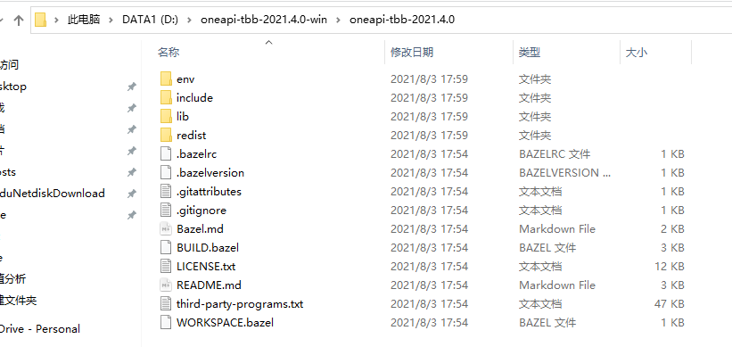
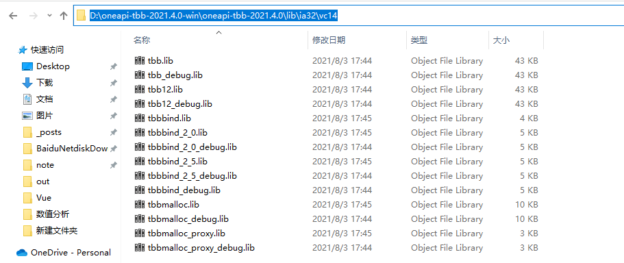
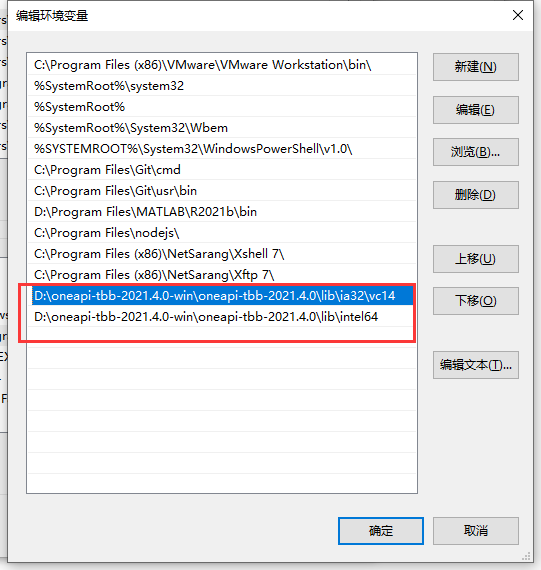
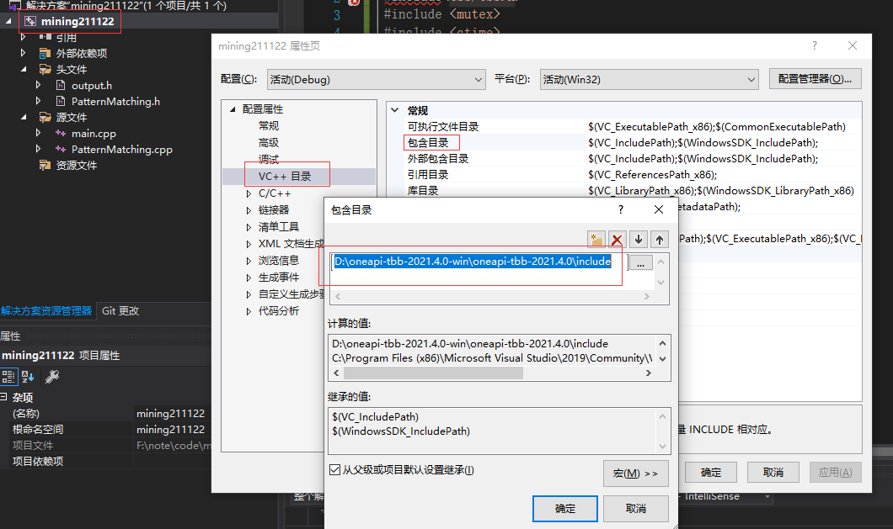
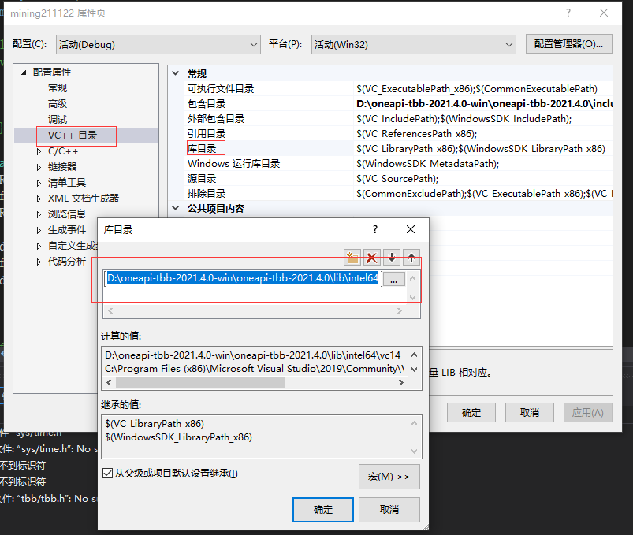

#  Intel TBB库+VS2019+WIN10配置

> 参考：[https://blog.csdn.net/weixin_42973508/article/details/109190717](https://blog.csdn.net/weixin_42973508/article/details/109190717)

##  下载TBB

> [GitHub下载TBB](https://github.com/oneapi-src/oneTBB)
>
> 下载编译好的的版本下载解压即可

##  配置环境变量

* 下载编译好的版本，解压后如下图

* 右键此电脑-->属性-->高级系统设置-->环境变量-->系统变量-->path，添加DLL动态库。如下图

  * ***请务必将32和64位的文件夹都加入环境变量**，不然你的TBB程序在VS中调试时会无法运行*

  

##  配置项目属性

* 打开需要使用TBB的项目，右击项目-->属性-->VC++目录-->包含目录-->编辑  做如下添加

* 打开需要使用TBB的项目，右击项目-->属性-->VC++目录-->库目录-->编辑  做如下添加
  * *这里注意一下VS的版本和运行平台的对应关系，X86对应ia32，X64对应intel64。*

