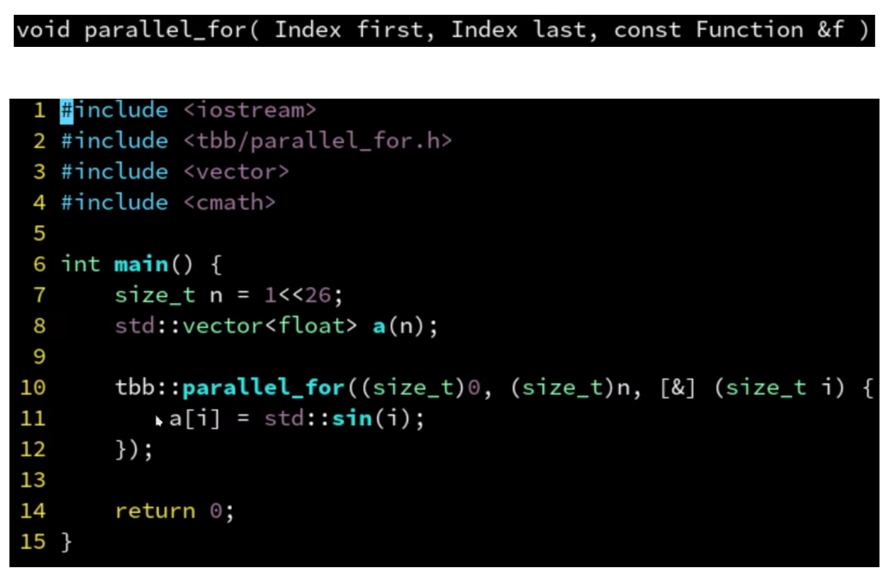
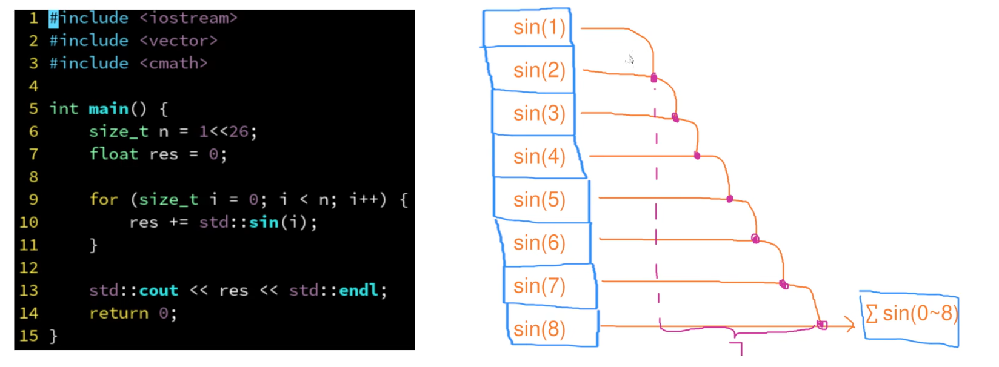
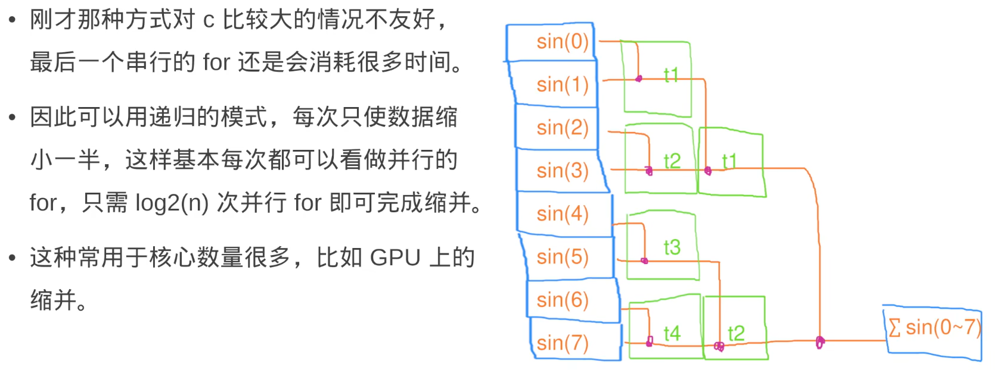
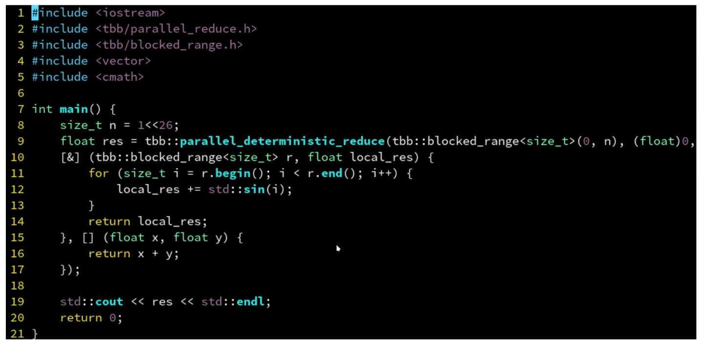

---
 
title: intel-TBB使用笔记
date: 2022-01-26 14:43:17
tags:
- TBB
categories:
- [C++]
---

#  TBB

> https://www.cnblogs.com/ybqjymy/p/13679446.html
>
> https://www.ngui.cc/el/1408858.html?action=onClick
>
> C++高性能编程笔记: https://www.zhihu.com/column/c_1477236044101353472
>
> C++高性能编程视频： https://www.bilibili.com/video/BV1Ya411q7y4/?spm_id_from=333.788&vd_source=7230a052308bbb41976f248d2c778e3a
>
> 官网：https://link.springer.com/chapter/10.1007/978-1-4842-4398-5_2
>
> tbb官网：https://spec.oneapi.io/versions/latest/elements/oneTBB/source/nested-index.html
>
> 超线程对内存密集型的计数效果更好（内存密集型就是计算少的）

**安装TBB**

* Ubuntu:

  ``` 
   sudo apt-get install libtbb-dev
  ```

* Arch Linux:

```
sudo pacman -S tbb
```

* windows

```
.\vcpkg install tbb:x64-windows
```

* Mac Os

```
.\vcpkg install tbb:x64-macos
```

* other: https://blog.csdn.netlweixin_42973508/article/details/111681426

##  基本使用

###  TBB API


####  任务组

> tbb默认创建与核心一样的线程数


####  parallel_invoke


* parallel_invoke允许传入多个任务，同时执行，自动等待所有任务执行完成  （使用任务组需要手动设置等待任务完成）
  * 将查找拆分为两部分，并行查找


* 串行改并行


####  parallel_for


* 低级接口，不分块，但是效率可能低一点，因为内部不会优化



####  parallel_for_each

* 支持迭代器区间
* 参数是迭代器的引用 ， 上面parallel_for中参数是索引，需要通过a[i]修改值，而这里直接通过f这个引用就可以修改
* 下面的案例是直接给数组的每个元素赋值为32


####  二维区间上的for循环：blocked_range2d


####  三维区间上的for循环：blocked_range3d


####  parallel_reduce

>  缩并  有数据依赖

* 原始数据依赖案例



* 任务组
  * 时间复杂度：`O(n/c+c)    n是任务数，c是线程数`


* parallel_reduce
  * 时间复杂度：`O(logn)   n是任务数`  因为会一直缩并下去




####  parallel_deterministic_reduce

* 保证每次每个块分配的任务一样，不再是动态分配



####  parallel_scan

* 扫描
* 需要记录前i个计算结果
* 不是很懂，待学习


####  任务域

* 可以指定多少个线程执行


####  嵌套for循环

* n比较小，没有核心数量多


####  筛选

* 满足条件则记录
* concurrent_vector是tbb提供的vector
* a.grow_by()是对数组进行指定大小的扩容
* 因为concurrent_vector中有锁，所以计算结果先压入局部数组，最后再压入concurrent_vector中
  * 这里应该要求块中有多个任务，否则一个任务一个局部数组没有意义


###  递归并行

```c++

```


###  使用笔记

* 设置线程数
* 获取线程数

* parallel_reduce使用
  * type是贯穿始终的计算结果的数据类型 可以是int则计算结果是累加  也可以是vector则计算结果压入数组
  * vec是整个任务数组
  * vectype是任务数组中元素的数据类型
  * init 是块的初始值  int则设置为0  vector则设置为空数组(`vector<int>()`)
  * 块中的for循环表示：一个块中可能分配多个任务，每个任务计算的结果给temp 
  * temp用于收集单个块中所有任务计算的结果，temp将返回给下面的串行合并
  * 串行函数用于合并每个并行块计算的结果 合并后返回即是最终结果

```c++
#include <iostream>
#include <vector>
#include <tbb/tbb.h>
#include <tbb/blocked_range.h>
#include <tbb/parallel_reduce.h>

using namespace std;
using namespace tbb;
//设置线程数
int ThreadNum = 56;
tbb::task_scheduler_init init(ThreadNum);
//获取线程数
auto numprocs = this_task_arena::max_concurrency();
cout<<"thread: "<<numprocs<<endl;

type result = parallel_reduce(blocked_range<vectype>(vec.begin(), vec.end()),
  // 下面是并行部分 一个块交给一个核心
  init ,[](const blocked_range<vectype>& r, type temp)->type{
    for(auto a = r.begin(); a!=r.end(); a++){
      //使用a计算 结果给temp
    }
    return temp;
  },

  // 下面是串行的 合并每个块的结果                   
  [](type x, type y)->type{ // 这里的x,y就是每个块返回的结果，在这里将这些块的数组合并就是最终的结果
    // 将x y合并并返回  
    return x;  // 假设合并到x  x就是最终返回结果
  }
  // ,
  // simple_partitioner{}  // 使得每个块都只分配一个任务

  );
```

**任务分配策略**

* 拿到vec后tbb会将任务分配给块，一个块交给一个核心处理  `blocked_range<vectype>(vec.begin(), vec.end())`
  * 假设vec中有32个任务，机器有4个核心，则每个块分配8个任务，这8个任务在一个核心上是轮询执行的（这是tbb的优化）
  * 这个任务分配是动态的，根据任务和核心设置
* tbb采用工作窃取法，保证核心不空闲
  * 一个块分配多个任务，这些任务就是一个局部的任务队列
  * 当某个核心的任务都执行完后，就会去其它核心查看任务队列中是否还有任务，有则窃取过来执行
  * 但是这种方式还是存在不均衡的情况


* 手动设置每个块分配的任务
  * 每个块负责一个任务似乎比上面的工作窃取法性能更好可能是粒度分的更细了
  * simple_partitioner{}  和 static_partitioner{} 都可以指定块的任务数

```c++
simple_partitioner{}  // 使得每个块都只分配一个任务  如果线程是4 总任务数是32则会分为32个块 这些块排队给线程执行 这种粒度更小 性能似乎更好
static_partitioner{}  // 默认情况：固定每个块的任务数=总任务数/线程数 

// 指定区间粒度 指定每个负责16个任务 假设总任务数是32则会创建2个线程
type result = parallel_reduce(blocked_range<vectype>(vec.begin(), vec.end(), 16),
      // 下面是并行部分 一个块交给一个核心
      init ,[](const blocked_range<vectype>& r, type temp)->type{
        // ....
      },
      ,static_partitioner{}
      // , simple_partitioner{} 

      );
```


**注意初始值**

```c++
tbb::task_scheduler_init init(ThreadNum);  // 设置线程数

// 第二个参数：(unsigned long long)0  表示每个块的累加起始值，注意数据类型，在累加数据类型很大的情况下要设置可容纳的数据类型，否则会累加越界
unsigned long long finalAns = parallel_reduce(blocked_range<size_t>(0, minMatchID_PMR_num), (unsigned long long)0, [&](blocked_range<size_t> r, unsigned long long ans)
                                        {        
                                            for(int i=r.begin();i!=r.end();++i){
                                                // unsigned long long count = ;
                                                // cout<<"count: "<<count<<endl;
                                                // if(count > 0){
                                                //   cout<<"before: "<<ans<<endl;
                                                  ans+=Multithreaded_search(i);
                                                //   cout<<"count: "<<count<<endl;
                                                //   cout<<"after: "<<ans<<endl;
                                                // }
                                            }
                                            // cout<<"sum: "<<ans<<endl;
                                            return ans;  // 这里计算的是块的累加结果，每个块从0开始累加
                                        },
                                        // plus<long long>()

                                          [](unsigned long long x, unsigned long long y)->unsigned long long{
                                            return x+y;  
                                          } // 这里是对每个块的结果进行求和，这里是串行执行
                                        );
```

####  计算结果压入vector

```c++
#include <iostream>
#include <vector>
#include <tbb/tbb.h>
#include <tbb/blocked_range.h>
#include <tbb/parallel_reduce.h>

using namespace std;
using namespace tbb;

// g++ tbb.cpp -ltbb -o tbbb
int main()
{
    vector<int> vec;
    for(int i=0; i<10000; i++)
        vec.push_back(i);
    int ThreadNum = 56;
    tbb::task_scheduler_init init(ThreadNum);

    vector<int> result = parallel_reduce(blocked_range<vector<int>::iterator>(vec.begin(), vec.end()),
      // 下面每个块是并行的  
      // vector<int>() 是块的起始值 设置为空vector
      vector<int>(),[](const blocked_range<vector<int>::iterator>& r, vector<int> init)->vector<int>{
		// init是每个块的存储位置，计算的结果都压入init  块执行完成后返回
        for(auto a = r.begin(); a!=r.end(); a++){
          // cout<<*a<<endl;
          // 方式1
          // init.push_back(*a);
          // 方式2
          // for(int i = 0; i < 10; ++i){
          //  init.push_back(*a * i);
          //}
          // 方式3
          vector<int> temp;
          for(int i = 0; i < 10; ++i){
            temp.push_back(*a * i);
          }
          init.insert(init.end(), temp.begin(), temp.end());
        }
        // cout<<"block: "<<init<<endl;
        return init;
      },
      // plus<long long>()
                                         
      // 下面是串行的 合并每个块的结果                   
      [](vector<int> x, vector<int> y)->vector<int>{ // 这里的x,y就是每个块返回的结果，在这里将这些块的数组合并就是最终的结果
        x.insert(x.end(), y.begin(), y.end());
        return x;
      }
      // ,
      // simple_partitioner{}  // 使得每个块都只分配一个任务

      );
      // cout<<"result:"<<result<<endl;
      for(auto& a: result){
        cout<<a<<endl;
      }
    return 0;
}
```


