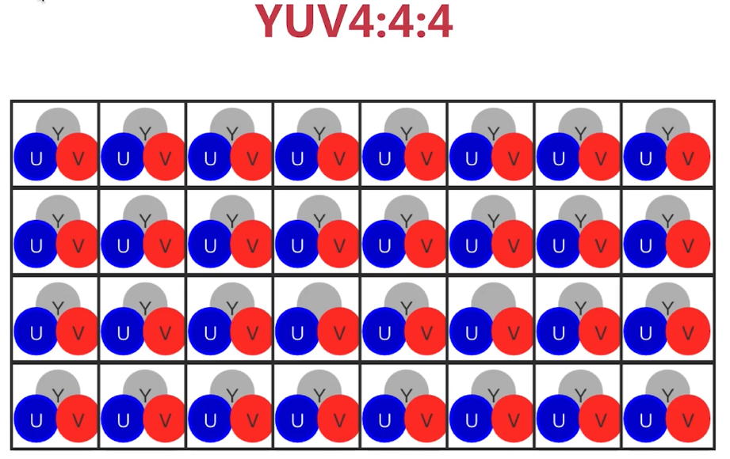
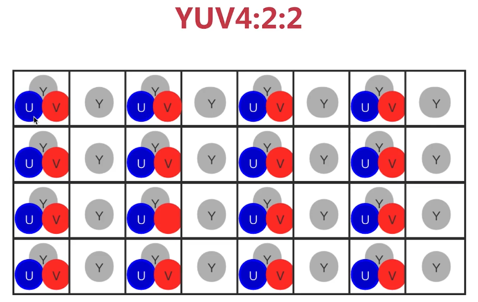
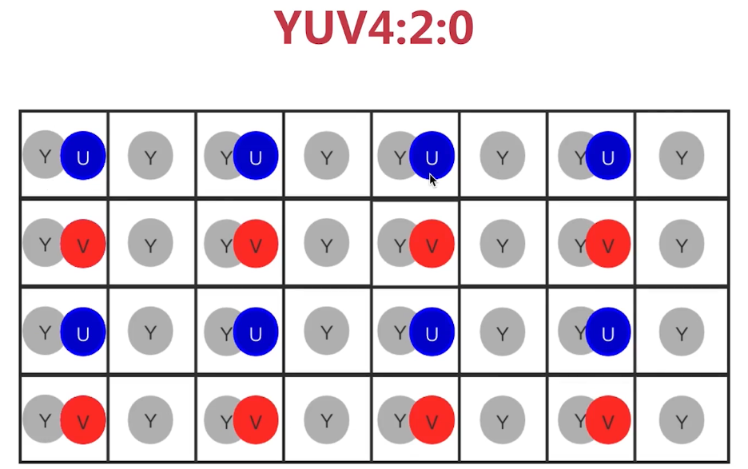
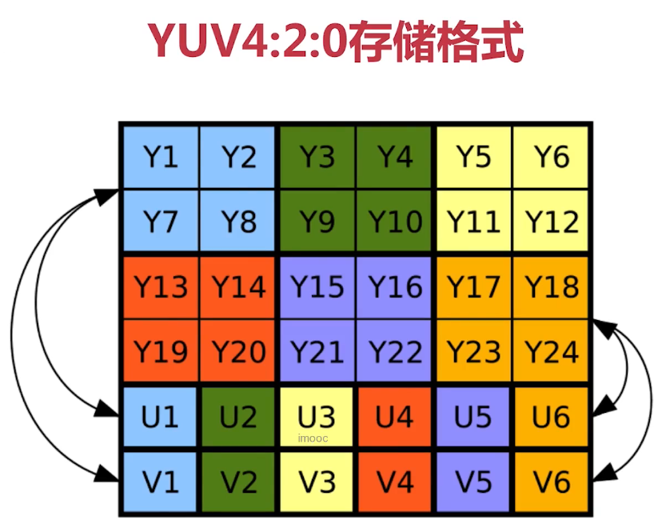
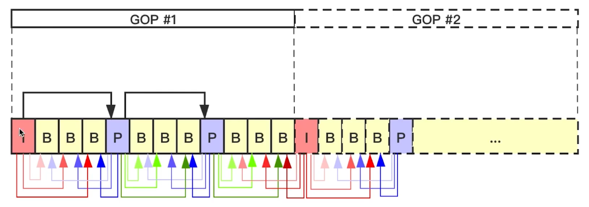
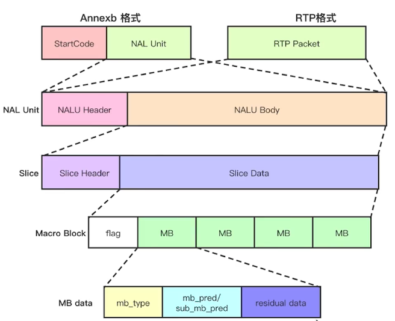

##  图形基础

像素位深

* RGB888(24位)  一个色一个字节(8bit)
* RGBA(32位)  一个色一个字节(8bit)  A: 透明度，一个字节(8bit)


RGB色彩问题

* BMP图像使用的是BGR格式，需要将BGR转换位RGB格式


屏幕指标

* PPI : 单位英寸内的像素个数，越大表明单位英寸内像素越多，屏幕越好
* DPI : 单位英寸内的点数，可能一个点包含多个像素，一般PPI == DPI
* PPI > 300 就属于视网膜级别


**码流的计算**

分辨率

* X轴的像素个数*Y轴的像素个数
* 常见的宽高比16:9/ 4:3
* 360P/720P/1K/2K
  * 360p是640x360，720p是1280x720，1k是1920x1080即1080p，2k是2560x1440即1440p

帧率

* 每秒钟采集/播放图像的个数（每秒播放的帧数）
* 动画的帧率是25帧/s
* 常见的帧率:15帧/s ，30帧/s，60帧/s


未编码视频的RGB码流

* RGB码流=分辨率（宽x高) x 3(Byte) x 帧率(25帧)
  * 例如∶1280x720x3x25 = 69120000    约69 M


YUV

* YUV（也称YCbCr ) :Y表示明亮度，UV的作用是描述影像色彩及饱和度
* 主要的采样格式有YUV4:2:0（标准，都支持）、YUV4:2:2和YUV4:4:4







YUV4:2:0

* 4:2:0并不意味着只有Y、Cb（蓝色）两个分量，而没有Cr(红色)分量。
* 它实际指得是对每行扫描线来说，只有一种色度分量，它以2:1的抽样率存储。
* 相邻的扫描行存储不同的色度分量，也就是说，如果一行是4:2:0的话，下一行就是4:0:2，再下一行是4:2:0...以此类推。
* 数据量计算(YUV4:2:0)
  * YUV = Y * 1.5
    YUV = RGB /2

YUV4:2:0存储格式

* planar (平面)
  * 1420 : YYYYYYYY UU VV =>YUV420P
  * YV12: YYYYYYYY VV UU => YUV420P
* packed(打包)
  * NV12 : YYYYYYYY UVUV =>YUV420SP
  * NV21: YYYYYYYY VUVU =>YUV420SP



未编码视频的YUV码流

* RGB码流=分辩率(宽x高)x 3 x帧率
* YUV码流=分辩率(宽x高)x1.5X帧率

RGB与YUV的关系

* RGB用于屏幕图像的展示
* YUV用于采集与编码

* RGB转YUV
  * Y= `0.299*R + 0.587*G'+ 0.114*B`
  * U=` -0.147*R-0.289*G+0.436*B = 0.492*(B-Y)`
  * V= `0.615*R-0.515*G -0.100*B = 0.877*(R-Y)`
* YUV转RGB
  * R= `Y +1.140*V`
  * G= `Y - 0.394*U - 0.581*V`
  * B =`Y + 2.032*U`


生成YUV

* -i : 输入文件
* -an ： a表示音频  n表示no   表示不处理视频中的音频
* -c:v :  视频的解码器编码器
* -pix_fmt ： 指定输出的yuv格式为yuv420p

```shell
ffmpeg -i input.mp4
-an
-C:V rawvideo
-pix_fmt yuv420p out.yuv
```

播放YUV

* -s : 指定分辨率

```shell
ffplay -pix_fmt yuv420p -S 608x368 out.yuv
```

播放Y分量

* -vf : 指定使用简单滤波器

```shell
ffplay -pix_fmt yuv420p
-S 608x368
-vf extractplanes= 'y' out.yuv
```

提取各分量

-filter_complex : 指定使用复杂滤波器

```shell
ffmpeg -i ~/Documents/new_killer.mp4
-filter_complex
'extractplanes=y+u+vly][u][v]'
-map 'ly]' y.yuv
-map '[u]' u.yuv
-map '[v]' v.yuv
```


9-8  ----  9-10  带学习

##  H264编码

> 压缩比1/100
>
> 码流建议：https://docportal.shengwang.cn/cn
>
> https://docportal.shengwang.cn/cn/video-call-4.x/video_profile_apple_ng?platform=iOS

码率

* 条件
  * 1.YUV格式为YUV420
  * 2.分辨率为640x480
  * 3.帧率为15

```
640 * 480 * 1.5 * 15 = 55M  单位是字节
```

* 建议码流：500kpbs

GOP

* group of picture
* 一组差别不大的图片

I/P/B帧

* Ⅰ帧(intraframe frame)，关键帧，采用帧内压缩技术。IDR帧属于Ⅰ帧
  * 就是GOP的第一帧
* P帧(forward Predicted frame)，向前参考帧。压缩时，只参考前面已经处理的帧，采用帧间压缩技术。它I帧的一半大小
  * 参考前面的I帧
* B帧(Bidirectionally predicted frame)，双向参考帧。压缩时，既参考前面已经处理的帧，也参考后面的帧，帧间压缩技术。它占Ⅰ帧1/4大小
  * 参考前面的I帧和后面的P帧
  * 参考前面的p帧和后面的P帧
  * 参考前面的P帧和后面的I帧



IDR帧与I帧的区别与联系

* IDR(Instantaneous Decoder Refresh)解码器立即刷新
* 每当遇到IDR帧时，解码器就会清空解码器参考buffer中的内容
* 每个GOP中的第一帧就是IDR帧
* IDR帧是一种特殊的Ⅰ帧

SPS与PPS

* SPS (Sequence Parameter Set)：  图片之间的编码信息
  * 序列参数集,作用于一串连续的视频图像。如
    * seq_ parameter_ set id、
    * 帧数及POC(picture order count)的约束、
    * 参考帧数目、
    * 解码图像尺寸
    * 帧场编码模式选择标识等
* PPS (Picture Parameter Set)： 图片内的编码信息
  * 图像参数集,作用于视频序列中的图像。如
    * pic_ parameter. set_ id、
    * 熵编码模式选择标识、
    * 片组数目、
    * 初始获量化参数
    * 去方块滤波系数调整标识等


H264压缩技术

* 有损压缩
  * 帧内压缩,解决的是空域数据冗余问题
  * 帧间压缩,解决的是时域数据冗徐问题
* 无损压缩
  * 整数离散余弦变换( DCT ) , 将空间上的相关性变为频域上无关的数据然后进行量化
  * CABAC压缩

码流基本概念

* SODB ( String Of Data Bits )
  原始数据比特流,长度不一定是8的倍数 ,故需要补齐。
  它是由VCL层产生的。
* RBSP ( Raw Byte Sequence Payload )
  SODB + trailing bits
  算法是如果SODB最后-个字节不对齐,则补1和多个0.
* NALU
  NAL Header(1B) + RBSP

