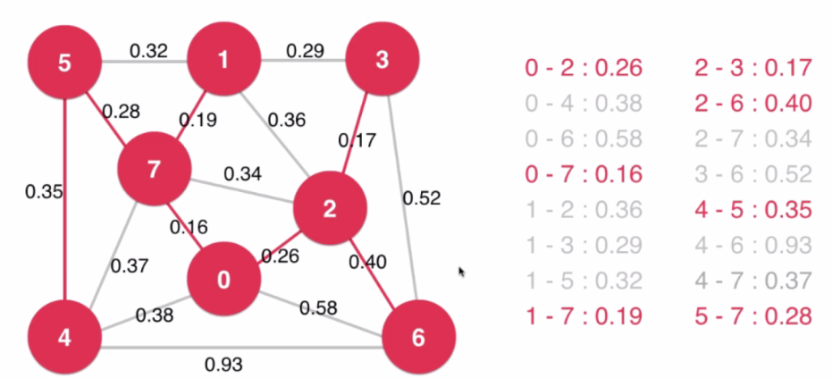
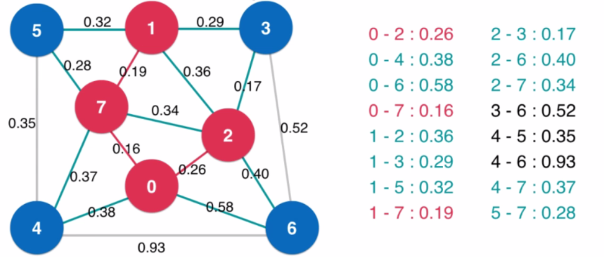

---
 
title: C++algorithm
date: 2022-01-26 14:43:17
tags:
- C++algorithm
categories:
- [C++]
---


#  一

##  排序算法

###  工具函数

```c++
#pragma once
#include <iostream>
#include <cassert>
#include <ctime>
using namespace std;

namespace SortTestHelper {
	
	//生成n个随机数，每个元素的范围：[l,r]
	int* generateRandomArray(int n, int l, int r) {
		assert(l < r);//满足条件才继续执行  要引入<cassert>

		int* arr = new int[n];//注意在堆区生成，需要delete[]

		srand(time(NULL));//生成随机数的种子， 需要引入<ctime>
		for (int i = 0; i < n; i++) {
			arr[i] = rand() % (r - l + 1) + l;//rand生成的是随机整数
		}
		return arr;
	}

	//打印数组的所有元素,n是数组长度
	template<typename T>
	void printArray(T arr[], int n) {
		for (int i = 0; i < n; i++) {
			cout << arr[i] << " ";
		}
		cout << endl;
		return;
	}

	//检查排序是否正确
	template<typename T>
	bool isSorted(T arr[], int n) {
		for (int i = 0; i < n - 1; i++) {
			if (arr[i] > arr[i + 1])
				return false;
		}
		return true;
	}

	//通用函数执行时间计算函数
	template<typename T>           //sort是函数指针
	void testSort(string sortName, void(*sort)(T[], int), T arr[], int n) {
		clock_t startTime = clock(); //需要引入<ctime>
		sort(arr, n);//调用传入的函数
		clock_t endTime = clock();


		//判断函数执行排序是否正确
		assert(isSorted(arr, n));
		                            //计算时钟周期个数            //宏定义 1秒有几个时钟周期
		cout << sortName << " : " << double(endTime - startTime) / CLOCKS_PER_SEC << " s" << endl;

		return;

	}
}
```

###  桶排序和计数排序

> https://blog.csdn.net/qq_55624813/article/details/121316256

###  选择排序

> 时间复杂度：O(n*n)

从数组第一个元素开始，在其后选择一个最小的元素与之交换，然后后移一格，再在其后选择一个最小的元素与之交换，以此类推

```c++
#include <iostream>
#include "Student.h"
#include "SortTestHelper.h"

using namespace std;
template<typename T>
void selectSort(T arr[], int n) {
	for (int i = 0; i < n; i++) {
		int minIndex = i;
		for (int j = i + 1; j < n; j++) {
			if (arr[j] < arr[minIndex]) {
				minIndex = j;
				
			}
		}
		swap(arr[i], arr[minIndex]);
	}
}

int main() {
	int a[10] = { 10,9,8,7,6,5,4,3,2,1 };
	selectSort(a, 10);
	for (int i = 0; i < 10; i++) {
		cout << a[i] ;
	}
	cout << endl;

	string c[3] = { "C","B", "A" };
	selectSort(c, 3);
	for (int i = 0; i < 3; i++) {
		cout << c[i];
	}
	cout << endl;

	Student s[4] = { {"D", 100},{"C",95},{"B", 95},{"A", 91} };
	selectSort(s, 4);
	for (int i = 0; i < 4; i++) {
		cout << s[i];
	}
	cout << endl;

	int n = 10000;
	int* arr = SortTestHelper::generateRandomArray(n, 0, n);
	selectSort(arr, n);
	SortTestHelper::printArray(arr, n);
	delete[] arr; //注意删除堆区的临时变量
	return 0;
}
```

```c++
//Student.h
#include <iostream>

using namespace std;

struct Student {
	string name;
	int score;

	bool operator<(const Student& otherStudent) {
		return score != otherStudent.score ? score < otherStudent.score : name < otherStudent.name;
	}

	friend ostream& operator<<(ostream& os, const Student& student) {
		os << "Student: " << student.name << " " << student.score << endl;
		return os;
	}

};
```

###  插入排序

> * 时间复杂度：O（n*n）
> * 相对选择排序的优势： 内层循环可以提前终止
> * 相对选择排序优势更明显的情况： 数组的有序性本身很高，这样内层循环就会更早提前终止
> * 对于近乎有序的排序情况，插入排序比O(n*logn)的排序算法还要好
> * 数组本身有序时，插入排序时间复杂度：O(N)

从第二个元素开始，依次往后移动，每次将当前元素插入到前面已经排序好的序列中正确的位置，即比自己大的就往后移动

```c++
#include <iostream>
#include "Student.h"
#include "SortTestHelper.h"

using namespace std;

//选择排序
template<typename T>
void selectSort(T arr[], int n) {
	for (int i = 0; i < n; i++) {
		int minIndex = i;
		for (int j = i + 1; j < n; j++) {
			if (arr[j] < arr[minIndex]) {
				minIndex = j;
				
			}
		}
		swap(arr[i], arr[minIndex]);
	}
}

//插入排序
template<typename T>
void insertSort(T arr[], int n) {
	for (int i = 1; i < n; i++) {
		T temp = arr[i];
		int j;//在循环之外还要使用
		for ( j = i; j > 0 && arr[j-1]>temp ; j--) {//arr[j-1]>temp确保提前终止
			arr[j] = arr[j - 1]; //这里用赋值，不用swap，因为一次swap相当于三次赋值，而且还有索引数组
		}
		arr[j] = temp;
	}
}

int main() {

	int n = 10000;
	/*int* arr = SortTestHelper::generateRandomArray(n, 0, n);
	int* arr2 = SortTestHelper::copyIntArray(arr, n);*/
	int* arr = SortTestHelper::generateNearlyOrderedArray(n, 10);//生成近乎有序的数组
	int* arr2 = SortTestHelper::copyIntArray(arr, n);
	/*selectSort(arr, n);
	SortTestHelper::printArray(arr, n);*/
	SortTestHelper::testSort("selectSort", selectSort, arr, n);
	SortTestHelper::testSort("insertSort", insertSort, arr2, n);
	delete[] arr; //注意删除堆区的临时变量
	delete[] arr2;
	return 0;
}
```

###  希尔排序

> https://blog.csdn.net/yuan2019035055/article/details/120246584
>
> **希尔排序**（Shell Sort）是[插入排序](https://so.csdn.net/so/search?q=插入排序&spm=1001.2101.3001.7020)的一种。也称缩小增量排序，是直接插入排序算法的一种更高效的改进版本。希尔排序是**非稳定**排序算法。
>
> 时间复杂度：最坏：O(n^2)   比选择和插入排序快

```c++
template<typename T>
void shellSort(T arr[], int n){
  for(int step = n/2; step >0; step /= 2){
    for(int i = 0; i < step; i++){
      for(int j = i + step; j < n; j += step){
        T temp = arr[j];
        int m;
        for(m = j-step; m >= 0 && arr[m] > temp; m -= step){
          arr[m+step] = arr[m];
        }
        arr[m+step] = temp;  // 上面循环结束时m又-step了
      }
    }
  }
}

int main (){
  int vec[] = {12,34,5,632,5,689,34,67,89};
  shellSort(vec, 9);
  for(int i = 0; i < 9; i++){
    cout<<vec[i]<<" ";
  }
  cout<<endl;
}
```


###  归并排序

> * 时间复杂度：O(n*logn)
> * 需要额外空间
> * 自顶向下 
> * 自底向上 适合链表的归并，因为对数组的索引操作比较少
> * 优化：
>   * 1： 拆分的最小单元用插入排序进行排序
>   * 2： 已经有序的数组则不需要进行合并操作

```c++
#include <iostream>
using namespace std;

//将arr[l,mid]和arr[mid+1, r]两部分进行排序
template<typename T>
void __merge(T arr[], int l, int mid, int r) {
	T* aux = new int[r - l + 1];

	for (int i = l; i <= r; i++) {
		aux[i - l] = arr[i];
	}

	int i = l;
	int j = mid + 1;
	for (int k = l; k <= r; k++) {
		if (i > mid) {  // 如果左半部分元素已经全部处理完毕
			arr[k] = aux[j - l]; j++;
		}
		else if (j > r) {  // 如果右半部分元素已经全部处理完毕
			arr[k] = aux[i - l]; i++;
		}
		else if (aux[i - l] < aux[j - l]) {  // 左半部分所指元素 < 右半部分所指元素
			arr[k] = aux[i - l]; i++;
		}
		else {  // 左半部分所指元素 >= 右半部分所指元素
			arr[k] = aux[j - l]; j++;
		}
	}

	delete[] aux;
}


//递归使用归并排序，对arr[l....r]范围进行排序
template<typename T>
void __mergeSort(T arr[], int l, int r) {

	//递归结束条件
	/*if (l >= r) {
		return;
	}*/

	// 优化2: 对于小规模数组, 使用插入排序，因为小规模数组近乎有序
	if (r - l <= 15) {
		insertSort(arr, l, r);
		return;
	}

	int mid = (l + r) / 2;
	__mergeSort(arr, l, mid);
	__mergeSort(arr, mid + 1, r);

	// 优化1: 对于arr[mid] <= arr[mid+1]的情况,不进行merge
	// 对于近乎有序的数组非常有效,但是对于一般情况,有一定的性能损失(增加了条件判断)
	if (arr[mid] > arr[mid + 1])
		__merge(arr, l, mid, r);
}


//自顶向下
template<typename T>
void mergeSort(T arr[], int n) {
	__mergeSort(arr, 0, n - 1);
}


//自底向上
template<typename T>
void mergeSortBU(T arr[], int n) {

	//for (int sz = 1; sz < n; sz += sz ) {//sz: 1 2 4 8 16
	//	for (int i = 0; i+sz < n; i += sz + sz) { //i+sz < n: 第二部分存在才需要合并
	//		__merge(arr, i, i + sz - 1, min(i+sz+sz-1,n-1));//注意越界问题
	//	}
	//}

	//对于小数组使用插入排序
	for (int i = 0; i < n; i += 16) {
		insertSort(arr, i, min(i + 15, n - 1));
	}

	
	for (int sz = 16; sz < n; sz += sz) {//sz: 1 2 4 8 16
		for (int i = 0; i + sz < n; i += sz + sz) { //i+sz < n: 第二部分存在才需要合并
			// 对于arr[mid] <= arr[mid+1]的情况,不进行merge
			if(arr[i+sz-1]>arr[i+sz])
			  __merge(arr, i, i + sz - 1, min(i + sz + sz - 1, n - 1));//注意越界问题
		}
	}
}

```

####  归并求解逆序对

> https://blog.csdn.net/qq_41550842/article/details/81215935
>
> 讲解更清晰：https://blog.csdn.net/Keep_Trying_Go/article/details/127175000
>
> 逆序对：一个数组中，后面比前面大的数字对有多少个
>
> 只需要每次比较的时候记录后面放到前面去了，则逆序对加一

```c++
#include<iostream>
using namespace std;

// 归并求解逆序对

// [l, mid] [mid+1, r]
template<typename T>
int __merge(T arr[], int l, int mid, int r){
  int* temp = new int[r-l+1];
  for(int i = 0; i < r-l+1; ++i){
    temp[i] = arr[i+l];
  }
  int i = 0;
  int j = mid-l+1;
  int k = l;
  int count = 0;
  while (i <= mid -l || j <= r-l)
  {
    if(i > mid -l){
      arr[k++] = temp[j++];
    }else if(j > r-l){
      arr[k++] = temp[i++];
    }else if(temp[i] <= temp[j]){
      arr[k++] = temp[i++];
    }else{
      // cout<<temp[i]<<"----"<<temp[j]<<endl;
      arr[k++] = temp[j++];
      count += mid-l+1  - i; // 逆序计数
    }
    
  }
  delete[] temp;
  return count;
}


template<typename T>
int repair(T arr[], int n){
  int count = 0;
  for(int sz = 1; sz < n; sz += sz){
    for(int i = 0; i + sz < n; i += sz+sz){
      count += __merge(arr, i, i+sz-1, min(i+sz+sz-1, n-1));
    }
  }
  return count;
}

// 暴力求解
template<typename T>
int repairForce(T arr[], int n){
  int count = 0;
   for(int i = 0; i < n; ++i){
    for(int j = i+1; j< n; ++j){
      if(arr[j] < arr[i]){
        count++; 
        // cout<<arr[i]<< "----"<<arr[j]<<endl;
      } 
    }
   }
   return count;
}

```


###  快速排序

> * 时间复杂度：O(n*logn)
>
> 重复元素较多的情况使用三路快排

#### 快排优化版本

* 优化1：最小单元的排序使用插入排序
* 优化2：分割位置的元素随机选择, (不随机的情况下，近乎有序数组的排序时间复杂度就会退化到O(n*n))


```c++
#include <iostream>
#include <ctime>

using namespace std;

// 对arr[l...r]部分进行partition操作
// 返回p, 使得arr[l...p-1] < arr[p] ; arr[p+1...r] > arr[p]
template<typename T>
int __partition(T arr[], int l, int r) {

	//优化2： 随机在arr[l...r]的范围中, 选择一个数值作为标定点pivot， 避免有序数组拆分时形成链式树（深度退化为n）,时间复杂度也会退化为n*n
	swap(arr[l], arr[rand() % (r - l + 1) + l]);
	T v = arr[l];
	int j = l; // arr[l+1...j] < v ; arr[j+1...i) > v
	for (int i = l + 1; i <= r; i++) {
		if (arr[i] < v) {
			swap(arr[j + 1], arr[i]);
			j++;
		}
	}
	swap(arr[l], arr[j]);
	return j;
	
}

// 对arr[l...r]部分进行快速排序
template<typename T>
void __quickSort(T arr[], int l, int r) {
	/*if (l >= r) {
		return;
	}*/

	//优化1： 最小单元用插入排序 
	if (r - l <= 15) {
		insertSort(arr, l, r);
		return;
	}

	int p = __partition(arr, l, r);
	__quickSort(arr, l, p - 1);
	__quickSort(arr, p + 1, r);
}


template<typename T>
void quickSort(T arr[], int n) {
	srand(time(NULL));
	__quickSort(arr, 0, n - 1);
}
```

####  两路快排

* 用于解决重复元素很多的情况
  * 重复元素很多的情况下，划分的结果也会很不平衡，导致树的深度接近n,时间复杂度就会退化到O(n*n))


* 二路快排示意图


* 排序完成后，两边都包含了等于v的部分，v正好放在中间，两边划分就比较平衡


```c++
//二路快排
#include <iostream>

using namespace std;

// 对arr[l...r]部分进行partition操作
// 返回p, 使得arr[l...p-1] <= arr[p] ; arr[p+1...r] >= arr[p] 与一路快排相比 等于arr[p]的元素是分布在arr[p]两边的
template<typename T>
int __partition2(T arr[], int l, int r) {

	//优化2： 随机在arr[l...r]的范围中, 选择一个数值作为标定点pivot， 避免有序数组拆分时形成链式树（深度退化为n）,时间复杂度也会退化为n*n
	swap(arr[l], arr[rand() % (r - l + 1) + l]);
	T v = arr[l];
	int i = l + 1;//移动标志位
	int j = r; // arr[l+1...j) < v ; arr(j...r] > v
	while (true) {
		while(i <= r && arr[i] < v) {
			i++;
		}
		while(j>= l+1 && arr[j] > v) {
			j--;
		}
		if (i> j)
			break;

		swap(arr[i], arr[j]);
		i++;
		j--;
	}
	swap(arr[l], arr[j]);  // 最后j是落在<=v的位置上的，i是落在>=v的位置上的，所以应该是arr[j]与arr[l]交换，才能保证arr[l,,,p-1]<=arr[p]
	return j;

}

// 对arr[l...r]部分进行快速排序
template<typename T>
void __quickSort2(T arr[], int l, int r) {
	/*if (l >= r) {
		return;
	}*/

	//优化1： 最小单元用插入排序 
	if (r - l <= 15) {
		insertSort(arr, l, r);
		return;
	}

	int p = __partition2(arr, l, r);
	__quickSort2(arr, l, p - 1);
	__quickSort2(arr, p + 1, r);
}


template<typename T>
void quickSort2(T arr[], int n) {
	srand(time(NULL));
	__quickSort2(arr, 0, n - 1);
}

```

####  三路快排

* 三路快排示意图
  * 中间等于v的部分不再参与进一步划分的排序


```c++
#pragma once
//三路快排
#include <iostream>

using namespace std;


// 对arr[l...r]部分进行快速排序
template<typename T>
void __quickSort3(T arr[], int l, int r) {
	/*if (l >= r) {
		return;
	}*/

	//优化1： 最小单元用插入排序 
	if (r - l <= 15) {
		insertSort(arr, l, r);
		return;
	}

	//优化2： 随机在arr[l...r]的范围中, 选择一个数值作为标定点pivot， 避免有序数组拆分时形成链式树（深度退化为n）,时间复杂度也会退化为n*n
	swap(arr[l], arr[rand() % (r - l + 1) + l]);
	T v = arr[l];
	int lt = l;     // arr[l+1...lt] < v
	int gt = r + 1; // arr[gt...r] > v
	int i = l + 1;    // arr[lt+1...i) == v
	while (i < gt) {
		if (arr[i] < v) {
			swap(arr[i], arr[lt + 1]);
			i++; // 此时交换来的arr[lt+1] = v 所以要++
			lt++;
		}
		else if (arr[i] > v)
		{
			swap(arr[gt - 1], arr[i]); // 此时交换来的arr[gt - 1]大小不确定，所以不能++i,需要进入下一轮判断
			gt--;
		}
		else
		{
			i++;
		}
	}
	swap(arr[l], arr[lt]);// 注意次处交换后 [l,lt) < arr[l] 而不是[l,lt] < arr[l]

	__quickSort3(arr, l, lt - 1);  //[lt....gt-1]的部分不用再参与排序，因为都等于v
	__quickSort3(arr, gt, r);
}


template<typename T>
void quickSort3(T arr[], int n) {
	srand(time(NULL));
	__quickSort3(arr, 0, n - 1);
}

```

####  快排求解第n大元素

> 正确性待检验
>
> 使用一路或二路快排，每次排完的p都正好在整个数组排好序的位置上，如果查找nmax == p 则可以提前终止排序
>
> 而且排序后` arr[l,p-1] <= arr[p]  arr[p+1, r] >= arr[p]  ` 
>
> 如果`nmax != p` 也只需要大小判断后选择左右某一部分进入递归查找即可  类似二分查找
>
> 时间复杂度： n + n/2 + n/4 + n/8 + n/16 + .... + 1  = O（2n） = O (n)

```c++
#include<iostream>
using namespace std;

// 求解第n小的元素  求第k大元素要转化为求 第（n-k）小的元素

template<typename T>
// 要求 l < r
int partion1(T arr[], int l, int r){
  swap(arr[l], arr[rand()%(r-l+1)+l]);
  T v = arr[l];
  int i = l+1;
  int j = r;
  while (i < j)
  {
    while (arr[i] < v && i<=r) ++i;
    while (arr[j] > v && j >= l+1) --j;
    swap(arr[i++], arr[j--]);
  }
  swap(arr[l], arr[j]);
  return j;
}

// [l+1, i] <= v [j,r]>=v 
template<typename T>
T __quickSort(T arr[], int l, int r, int nMax){
  // if( r > l)return;
  // if(r==l) return arr[l]; 需要在这里处理r>=l的情况  因为进入partion1需要 l<r
  int p = partion1(arr, l, r);
  if(p == nMax){
    cout<<"p: "<<p<<endl;
    return arr[p];
  }else if( p < nMax){
    __quickSort(arr, p+1, r, nMax);
  }else{
    __quickSort(arr, l, p-1, nMax);
  }
  
}


template<typename T>
T nthmax(T arr[], int n, int nMax){
  srand(time(NULL));
  __quickSort(arr, 0, n-1, nMax);
}
```


###  堆排序

> 堆必须是一颗完全二叉树
>
> * 完全二叉树： 只有最后一层是不满的，其它层都是满节点
>
> 堆排序大多用于动态数据的维护，而不用于系统级别的排序，因为比归并和快排慢

####  构建堆


* 通常用数组来表示堆，以**广度优先遍历**顺序存储到数组中
* 起点为0的情况
  * 左侧子节点的位置(数组中的索引值)：`2*index+1`
  * 右侧子节点的位置(数组中的索引值)：`2*index+2`
  * 父节点的位置： `floor((index-1)/2)` 向下取整

* 起点为1的情况
  * 左侧子节点的位置(数组中的索引值)：`2*index`
  * 右侧子节点的位置(数组中的索引值)：`2*index+1`
  * 父节点的位置： `floor((index)/2)` 向下取整


####  堆排序

> 将n个元素逐个插入到一个空堆中，时间复杂度是O(nlogn)
>
> heapify的过程，时间复杂度为O(n), 时间复杂度证明较复杂，需要数学证明，记住结论即可
>
> * heapify就是原地构造堆，在原来的数组上构造堆，从第一个非叶子节点开始shifDown，每次shifDown后以这个节点为根的子树就符合最大堆要求了
> * 为什么不是从0开始shiftDown,举例即可知道：15，17，19，13，22，16，28，30，41，62

* 构建最大堆，可以实现升序排序也可以实现逆序排序
  * 升序排序： 将依次取出的堆顶元素按数组正序写入
  * 逆序排序： 将依次取出的堆顶元素按数组逆序写入

```c++
#include <iostream>
#include <cassert>

using namespace std;


template<typename Item>
class MaxHeap {

private:
	Item* data;
	int count;
	int capacity;

	void shiftUp(int k) {
		while (k > 0 && data[k / 2] < data[k]) {
			swap(data[k / 2], data[k]);
			k /= 2;
		}
	}

	void shiftDown(int k) {
		while (2 * k <= count-1) {
			int j = 2 * k;
			if (j + 1 <= count-1 && data[j + 1] > data[j]) j++;
			if (data[k] >= data[j]) break;
			swap(data[k], data[j]);
			k = j;
		}
	}

public:

	// 构造函数, 构造一个空堆, 可容纳capacity个元素
	MaxHeap(int capacity) {
		data = new Item[capacity ];
		count = 0;
		this->capacity = capacity;
	}

	// 构造函数, 通过一个给定数组创建一个最大堆
	// 该构造堆的过程, 时间复杂度为O(n)
	MaxHeap(Item arr[], int n) {
		data = new Item[n];
		capacity = n;

		for (int i = 0; i < n; i++)
			data[i] = arr[i];
		count = n;

		for (int i = count-1 / 2; i >= 0; i--)//不是插入，而是就地构建堆，所以时间复杂度比插入小
			shiftDown(i);
	}

	~MaxHeap() {
		delete[] data;
	}

	// 返回堆中的元素个数
	int size() {
		return count;
	}

	// 返回一个布尔值, 表示堆中是否为空
	bool isEmpty() {
		return count == 0;
	}

	// 向最大堆中插入一个新的元素 item
	void insert(Item item) {
		assert(count  < capacity);
		data[count] = item;
		shiftUp(count);
		count++;
	}

	// 从最大堆中取出堆顶元素, 即堆中所存储的最大数据
	Item extractMax() {
		assert(count > 0);
		Item ret = data[0];
		swap(data[0], data[count-1]);
		count--;
		shiftDown(0);
		return ret;
	}

	// 获取最大堆中的堆顶元素
	Item getMax() {
		assert(count > 0);
		return data[0];
	}
};


// heapSort1, 将所有的元素依次添加到堆中, 在将所有元素从堆中依次取出来, 即完成了排序
// 无论是创建堆的过程, 还是从堆中依次取出元素的过程, 时间复杂度均为O(nlogn)
// 整个堆排序的整体时间复杂度为O(nlogn)
template<typename T>
void heapSort1(T arr[], int n) {
	MaxHeap<T> maxheap = MaxHeap<T>(n);
	for (int i = 0; i < n; i++) {
		maxheap.insert(arr[i]);
	}
    // 逆序排序
	for (int i = n - 1; i >= 0; i--) {
		arr[i] = maxheap.extractMax();
	}

}

// heapSort2, 借助我们的heapify过程创建堆
// 此时, 创建堆的过程时间复杂度为O(n), 将所有元素依次从堆中取出来, 时间复杂度为O(nlogn)
// 堆排序的总体时间复杂度依然是O(nlogn), 但是比上述heapSort1性能更优, 因为创建堆的性能更优
template<typename T>
void heapSort2(T arr[], int n) {
	MaxHeap<T> maxheap = MaxHeap<T>(arr, n);
	for (int i = n - 1; i >= 0; i--) { 
		arr[i] = maxheap.extractMax();
	}
}
```


####  索引堆

> 引入索引堆的原因
>
> * 不是int型的数据，交换位置很耗费性能，例如string类型
> * 堆排序后，查找元素不好索引，只能遍历数组查找，时间复杂度上升为O(n)
>
> 索引堆的实现
>
> * 堆排序的所有操作都用int型的索引（index）来实现，数据本身(data)位置不变
>
> 注意事项：
>
> * 一定注意count的值是否是预期的值，还有边界值，一定要明确，如果不清楚就用实例测试
> * **不用swap交换时，要注意用temp记录比较的值**（shiftUp shiftDown中使用时）


* reverse的引入

  * 引入reverse的意义： 当data中的数据修改后，就需要重新调整堆，那么就需要知道修改的这元素在index中是在什么位置，以便调用shiftUp()或shiftDown()来调整堆

  * 例如修改了data[4] = 26, 那么就需要知道data[4]的索引`4`在index中存储的位置，而reverse就保存了这个位置，即reverse[4]=9,

    data[index[9]] = 26,  所以拿到索引`9`后执行`shiftUp(9)或shiftDown(9)`即可完成堆的调整

    


```c++
#include <iostream>
#include <cassert>

using namespace std;


template<typename Item>
class MaxHeap {

private:
	Item* data;
	int* index;
	int count;
	int capacity;

	void shiftUp(int k) {
		while (k > 0 && data[index[k / 2]] < data[index[k]]) {
			swap(index[k / 2], index[k]);
			reverse[index[k / 2]] = k / 2;
			reverse[index[k]] = k;
			k /= 2;
		}
	}

	void shiftDown(int k) {
		while (2 * k <= count - 1) {
			int j = 2 * k;
			if (j + 1 <= count - 1 && data[index[j + 1]] > data[index[j]]) j++;
			if (data[index[k]] >= data[index[j]]) break;
			swap(index[k], index[j]);
			reverse[index[k]] = k;
			reverse[index[j]] = j;
			k = j;
		}
	}

	//查看索引i这个位置的元素是否在堆中
	bool isInHeap(int i) {
		assert(i >= 0 && i < capacity);//首先i这个元素不能超过data中存储元素的个数
		return reverse[i] != -1; // = -1表示这个元素不在堆中

	}

public:

	// 构造函数, 构造一个空堆, 可容纳capacity个元素
	MaxHeap(int capacity) {
		data = new Item[capacity];
		index = new int[capacity];
		reverse = new int[capacity];
		for (int i = 0; i < capacity; i++) {
			reverse[i] = -1;
		}
		count = 0;
		this->capacity = capacity;
	}

	// 构造函数, 通过一个给定数组创建一个最大堆
	// 该构造堆的过程, 时间复杂度为O(n)
	MaxHeap(Item arr[], int n) {
		data = new Item[n];
		index = new int[n];
		capacity = n;

		for (int i = 0; i < n; i++) {
			data[i] = arr[i];
			index[i] = i;
		}
			
		count = n;

		for (int i = count - 1 / 2; i >= 0; i--)
			shiftDown(i);
	}

	~MaxHeap() {
		delete[] data;
		delete[] index;
		delete[] reverse;
	}

	// 返回堆中的元素个数
	int size() {
		return count;
	}

	// 返回一个布尔值, 表示堆中是否为空
	bool isEmpty() {
		return count == 0;
	}

	// 向最大堆中插入一个新的元素 item
	void insert(int i, Item item) {
		assert(count < capacity);
		assert(i >= 0 && i < capacity);
		data[i] = item;
		index[count] = i;
		reverse[i] = count;
		shiftUp(count);
		count++;
	}

	// 从最大堆中取出堆顶元素, 即堆中所存储的最大数据
	Item extractMax() {
		assert(count > 0);
		Item ret = data[index[0]];
		swap(index[0], index[count - 1]);
		reverse(index[0]) = 0;
		reverse(index[count - 1]) = -1;
		count--;
		shiftDown(0);
		return ret;
	}


	// 获取最大堆中的堆顶元素
	Item getMax() {
		assert(count > 0);
		return data[index[0]];
	}

	//获取最大堆堆顶的索引
	int getMaxIndex() {
		assert(count > 0);
		return index[0];
	}

	// 获取最大索引堆中索引为i的元素
	Item getItem(int i) {
		assert( isInHeap(i));
		return data[i];
	}

	// 将最大索引堆中索引为i的元素修改为newItem
	void change(int i, Item newItem) {
		assert(isInHeap(i));
		data[i] = newItem;
		// 找到indexes[j] = i, j表示data[i]在堆中的位置
	    // 之后shiftUp(j), 再shiftDown(j)
		/*for (int j = 0; j < count; j++) {
			if (index[j] = i) {
				shiftUp(j);
				shiftDown(j);
				break;
			}
		}*/

		int j = reverse[i];
		shiftUp(j);
		shiftDown(j);
	}
};


// heapSort1, 将所有的元素依次添加到堆中, 在将所有元素从堆中依次取出来, 即完成了排序
// 无论是创建堆的过程, 还是从堆中依次取出元素的过程, 时间复杂度均为O(nlogn)
// 整个堆排序的整体时间复杂度为O(nlogn)
template<typename T>
void heapSort1(T arr[], int n) {
	MaxHeap<T> maxheap = MaxHeap<T>(n);
	for (int i = 0; i < n; i++) {
		maxheap.insert(arr[i]);
	}
	for (int i = n - 1; i >= 0; i--) {
		arr[i] = maxheap.extractMax();
	}

}

// heapSort2, 借助我们的heapify过程创建堆
// 此时, 创建堆的过程时间复杂度为O(n), 将所有元素依次从堆中取出来, 时间复杂度为O(nlogn)
// 堆排序的总体时间复杂度依然是O(nlogn), 但是比上述heapSort1性能更优, 因为创建堆的性能更优
template<typename T>
void heapSort2(T arr[], int n) {
	MaxHeap<T> maxheap = MaxHeap<T>(arr, n);
	for (int i = n - 1; i >= 0; i--) {
		arr[i] = maxheap.extractMax();
	}
}


#include<iostream>

using namespace std;

template<typename T>
class IndexMaxHeap
{
private:
  int count;
  int capacity;
  T* data;
  int* index;
  int* rev;
  void shiftUp(int k){
    T temp = data[index[k]];
    int tempIndex = index[k];
    while(k>0 && data[index[(k-1)/2]] < temp){
      index[k] = index[(k-1)/2];
      rev[index[k]] = k;
      k = (k-1)/2;
    }
    index[k] = tempIndex;
    rev[tempIndex] = k;
  }
  void shiftDown(int k){
    int tempIndex = index[k];
    T temp = data[tempIndex];
    while (2*k+1 < count)
    {
      int j = 2*k+1 ;// left node
      if(j+1 < count && data[index[j+1]] > data[index[j]]) ++j;
      if(data[index[j]] <= temp) break;
      index[k] = index[j];
      rev[index[k]] = k;
      k = j;
    }
    index[k] = tempIndex;
    rev[tempIndex] = k;
  }
  bool isInHeap(int k){
    return rev[k] != INT32_MAX;
  }
public:
  IndexMaxHeap(int capacity){
    this->capacity = capacity;
    count = 0;
    data = new T[capacity];
    index = new int[capacity];
    rev = new int[capacity];
    for(int i = 0 ; i < capacity; ++i){
      rev[i] = INT32_MAX;
    }
  }
  ~IndexMaxHeap(){
    delete[] data;
    delete[] index;
    delete[] rev;
  }
  int getSize(){
    return count;
  }
  bool isEmpty(){
    return count == 0;
  }
  void insert(T item){
    assert(count<capacity);
    data[count] = item;
    index[count] = count;
    rev[count] = count;
    shiftUp(count);
    ++count;
  }
  T extractMax(){
    // print();
    T res = data[index[0]];
    swap(index[0], index[--count]); // 注意是--count
    rev[index[0]] = 0;
    rev[index[count]] = INT32_MAX;// 等同于这个点移除出堆了
    shiftDown(0);
    return res;
  }
  void change(int i, T item){
      assert(isInHeap(i));
      data[i] = item;
      int k = rev[i];
      shiftDown(k);
      shiftUp(k);
    
  }
  void print(){
    cout<<"     : ";
    for(int i = 0; i< capacity; ++i){
      cout<<i << "\t";
    }
    cout<<endl;
    cout<<"index: ";
    for(int i = 0; i< count; ++i){
      cout<<index[i] << "\t";
    }
    cout<<endl;
    cout<<"data : ";
    for(int i = 0; i< capacity; ++i){
      cout<<data[i] << "\t";
    }
    cout<<endl;
    cout<<"rev  : ";
    for(int i = 0; i< capacity; ++i){
      if(rev[i] == INT32_MAX){
        cout << "x" <<"\t";
      }else{
      cout<<rev[i] << "\t";
      }
    }
    cout<<endl;
    cout<<"max  : ";
    for(int i = 0; i< count; ++i){
      cout<<data[index[i]] << "\t";
    }
    cout<<endl;
    cout<<"----------------------------------------------------------------"<<endl;
  }
};

template<typename T>
void IndexHeapSort(T arr[], int n){
  IndexMaxHeap<int> heap = IndexMaxHeap<int>(n);
  for(int i = 0; i< n; ++i){
    heap.insert(arr[i]);
  }
  for(int i = 0; i< n; ++i){
    arr[i] = heap.extractMax();
  }
}

```

####  堆的应用

* 在1 ,000,000个元素中选出前100名? 在N个元素中选出前M个元素
  * 用一个最小堆，维护100个元素，当插入元素个数超过100时，移除堆顶（也就是最小的元素），最后留下的100个元素就是最大的100个元素
  * 时间复杂度NlogM

* 多路归并
* 二项堆
* 斐波那契堆

###  排序算法总结


* 原地排序：就在原来的数组上操作
* 稳定性：如下图
  * 插入排序和归并排序在元素相等的情况下不会交换  所以稳定
  * 快排在选择标定点的时候是随机选择的就会存在不稳定的情况，且对于二路归并相等的元素是会对调的，所以也不稳定
  * 堆排序不稳定的情况：取出堆顶元素后会将堆顶元素与最后一个元素交换，这个过程可能导师相同元素不交换，导致不稳定


##  搜索算法

###  二分查找法 

> Binary Search
> 对于有序数列，才能使用二分查找法(排序的作用)
>
> 时间复杂度O(logn)
>
> 非递归算法在性能上有微弱优势

* 非递归版

```c++
#include <iostream>

using namespace std;

// 二分查找法 非递归
// 在有序数组arr中,查找target
// 如果找到target,返回相应的索引index
// 如果没有找到target,返回-1
template<typename T>
int binarySearch(T arr[], int n, T target ) {
	//arr已经按升序排好序
	int l = 0;
	int r = n - 1;
	while (l < r) { // 应该不能 l==r 否则l==r ---> mid = l 这种情况就会漏掉
		//int mid = (l + r) / 2;//l+r有可能溢出，所以使用下面的方式求中点
		int mid = l + (r - l) / 2;
		if (target == arr[mid]) {
			return mid;
		}
		else if (target < arr[mid]) {
			r = mid - 1;
		}
		else {
			l = mid + 1;
		}
	}
	return -1;//没有找到则返回-1
}
```

* 递归版

```c++
#include <iostream>
using namespace std;
template<typename T>
int __binarySearch(T arr[], int l, int r, T target) {
	if (l > r)
		return -1;
	//int mid = (l+r)/2;
   // 防止极端情况下的整形溢出，使用下面的逻辑求出mid
	int mid = l + (r - l) / 2;
	if (arr[mid] == target)
		return mid;
	else if (arr[mid] < target)
		return __binarySearch(arr, mid + 1, r, target);
	else
		return __binarySearch(arr, l, mid - 1, target);
}


//二分查找递归版
template<typename T>
int binarySearch2(T arr[], int n, T target) {
	return __binarySearch(arr, 0, n - 1, target);
}
```

### 二分搜索树

>  二分搜索数是一个二叉树，但不一定是完全二叉树
>
>  定义：每个节点的键值大于左孩子;每个节点的键值小于右孩子;以左右孩子为根的子树仍为二分搜索树
>
>  二分搜索树中插入、搜索、删除时间复杂度都是O(logn)


* 二分搜索树的插入和搜索 
* 二分搜索树的遍历
  * 深度优先
    * 前序遍历∶先访问当前节点，再依次递归访问左右子树
    * 中序遍历:先递归访问左子树，再访问自身，再递归访问右子树
    * 后续遍历︰先递归访问左右子树，再访问自身节点
      * 后续遍历应用：二叉搜索树的空间释放，对new出来的节点进行delete
  * 广度优先
* 二分搜索树中删除最大值和最小值
  * 删除最大值思路：一直找右节点，直到没有右节点则这个点是最大值，删除后用这个点的左节点来顶替这个点
  * 删除最小值思路：一直找左节点，直到没有左节点则这个点是最小值，删除后用这个点的右节点来顶替这个点
* 二分搜索树中删除一个节点
  * 需要两个前置函数
    * 查找最小（大）值
    * 删除最小（大）值

  * 用这个节点的右子树中的最小值（右子树中的最小值来顶替这个点才满足二分搜索树的定义）来顶替这个点
    * 找到这个节点的右子树的最小值后，用这个最小值的右节点来顶替这个最小值（原理同上面删除最小值类似），再用这个最小点来顶替这个要删除的点
  * 也可以用这个节点的左子树的最大值来顶替这个点


```c++
#include <iostream>
#include <queue>
#include <cassert>

using namespace std;

// 二分搜索树
template<typename Key, typename Value>
class BST {
private:
	// 树中的节点为私有的结构体, 外界不需要了解二分搜索树节点的具体实现
	struct Node {
		Key key;
		Value value;
		Node* left;
		Node* right;

		Node(Key key, Value value) {
			this->key = key;
			this->value = value;
			this->left = this->right = NULL;
		}

		Node(Node* node) {
			this->key = node->key;
			this->value = node->value;
			this->left = node->left;
			this->right = node->right;
		}
	};

	Node* root;//根节点
	int count;//树中的节点个数

	// 向以node为根的二分搜索树中, 插入节点(key, value), 使用递归算法，
	// 返回插入新节点后的二分搜索树的根
    // 这里的Node* node 是值传递，相当于又多了一个指针指向传进来的root, 如果new的新节点赋值给node,相当于改变此处node的指向，root指向的内容并没有改变，需要将new的新节点返回，让root接受并赋值
	Node* insert(Node* node, Key key, Value value) {
		if (node == NULL) {
			count++;
			return new Node(key, value);
		}
		if (node->key == key)
			node->value = value;
		else if (node->key < key)
			node->right = insert(node->right, key, value);
		else
			node->left = insert(node->left, key, value);

		return node;
	}

	// 查看以node为根的二分搜索树中是否包含键值为key的节点, 使用递归算法
	bool __contain(Node* node, Key key) {
		if (node == NULL)
			return false;
		if (node->key == key)
			return true;
		else if (key < node->key)
			return __contain(node->left, key);
		else
			return __contain(node->right, key);
	}

	// 在以node为根的二分搜索树中查找key所对应的value, 递归算法
    // 若value不存在, 则返回NULL， 因为要返回NULL表示没有找到，所以需要是指针
	Value* __search(Node* node, Key key) {
		if (node == NULL)
			return NULL;
		if (node->key == key)
			return &(node->value);
		else if (key < node->key)
			return __search(node->left, key);
		else
			return __search(node->right, key);
	}

	// 对以node为根的二叉搜索树进行前序遍历, 递归算法
	void __preOrder(Node* node) {
		if (node != NULL) {
			cout << node->key << endl;
			__preOrder(node->left);
			__preOrder(node -> right);
		}
	}

	// 对以node为根的二叉搜索树进行中序遍历, 递归算法
	void __inOrder(Node* node) {
		if (node != NULL) {
			__inOrder(node->left);
			cout << node->key << endl;
			__inOrder(node->right);
		}
	}

	// 对以node为根的二叉搜索树进行后序遍历, 递归算法
	void __postOrder(Node* node) {
		if (node != NULL) {
			__postOrder(node->left);
			__postOrder(node->right);
			cout << node->key << endl;
		}
	}

	// 释放以node为根的二分搜索树的所有节点
    // 采用后续遍历的递归算法
	void destroy(Node* node) {
		if (node != NULL) {
			destroy(node->left);
			destroy(node->right);
			delete node;
			count--;
		}
	}

	// 返回以node为根的二分搜索树的最小键值所在的节点
	Node* mininum(Node* node) {
		if (node->left == NULL)
			return node;

		return mininum(node->left);
	}

	// 返回以node为根的二分搜索树的最大键值所在的节点
	Node* maxinum(Node* node) {
		if (node->right == NULL)
			return node;

		return maxinum(node->right);
	}

	// 删除掉以node为根的二分搜索树中的最小节点
	// 返回删除节点后新的二分搜索树的根
	Node* removeMin(Node* node) {
		if (node->left == NULL) {
			Node* rightNode = node->right;
			delete node;
			count--;
			return rightNode;
		}
		node->left = removeMin(node->left);
		return node;
	}

	// 删除掉以node为根的二分搜索树中的最大节点
	// 返回删除节点后新的二分搜索树的根
	Node* removeMax(Node* node) {
		if (node->right == NULL) {
			Node* leftNode = node->left;
			delete node;
			count--;
			return leftNode;
		}
		node->right = removeMax(node->right);
		return node;
	}
    
    // 这种方式更简洁  对于左右都有孩子的情况
    Node* __remove(Node* root, Key key){
        if(root->key == key){
          if(root->left ==NULL && root->right ==NULL){
            delete root;
            --count;
            return NULL;
          }
          if(root->left ==NULL){
            Node* node = root->right;
            delete root;
            --count;
            return node;
          }
          if(root->right == NULL){
            Node* node = root->left;
            delete root;
            --count;
            return node;        
          }
          // 左右都有
          Node* rightMin = __mininum(root->right);
          // 先赋值  因为后面删除会删除指向的地方
          root->key = rightMin->key;
          root->value = rightMin->value;
          // 再去删除
          root->right = __removeMin(root->right);


        }else if(key < root->key){
          root->left = __remove(root->left, key);
        }else{
          root->right = __remove(root->right, key);
        }
        return root;
      }

	// 删除掉以node为根的二分搜索树中键值为key的节点, 递归算法
	// 返回删除节点后新的二分搜索树的根
	Node* remove(Node* node, Key key) {
		if (node == NULL) {
			return NULL;
		}
		if (key < node->key) {
			node->left = remove(node->left, key);
			return node;

		}else if(key > node->key){
			node->right = remove(node->right, key);
			return node;
		}else { // key == node->key
			// 待删除节点左子树为空的情况
			if (node->left == NULL) {
				Node* rightNode = node->right;
				delete node;
				count--;
				return rightNode;
			}

			// 待删除节点右子树为空的情况
			if (node->right == NULL) {
				Node* leftNode = node->left;
				delete node;
				count--;
				return leftNode;
			}

			// 待删除节点左右子树均不为空的情况

            // 找到比待删除节点大的最小节点, 即待删除节点右子树的最小节点
            // 用这个节点顶替待删除节点的位置

			Node* tempNode = new Node(mininum(node->right));//找到当前节点右子树的最小节点， 注意这里要new Node 因为后面的removeMin会删掉这个节点
			count++;//new Node相当于加一个点，后面removeMin里count--  抵消
			tempNode->left = node->left;
			tempNode->right = removeMin(node->right);//将node右子树中最小节点删除，并将右子树赋值给，，
			delete node;
			count--;
            
            
            
			return tempNode;
		}

	}


public:
	// 构造函数, 默认构造一棵空二分搜索树
	BST() {
		root = NULL;
		count = 0;
	}

	~BST() {
		destroy(root);
	}

	// 返回二分搜索树的节点个数
	int size() {
		return count;
	}

	// 返回二分搜索树是否为空
	bool isEmpty() {
		return count == 0;
	}

	// 向二分搜索树中插入一个新的(key, value)数据对
	void insert(Key key , Value value) {
		root = insert(root,key, value);
	}

	//判断键值key在二分搜索树中是否存在
	bool contain(Key key) {
		return __contain(root,key);
	}

	//在二分搜索树中查找键值为key的value值
	Value* search(Key key) {
		return __search(root, key);
	}

	//前序遍历
	void preOrder() {
		__preOrder(root);
	}

	//中序遍历
	void inOrder() {
		__inOrder(root);
	}

	//后序遍历
	void postOrder() {
		__postOrder(root);
	}

	//层序遍历 广度优先
	void levelOrder() {
		queue<Node*> q;
		q.push(root);
		while (!q.empty())
		{
			Node* node = q.front();
			q.pop();
			cout << node->key << endl;
			if(node->left)
				q.push(node->left);
			if(node->right)
				q.push(node->right);
		}
	}

	// 寻找二分搜索树的最小的键值
	Key mininum() {
		assert(count != 0);
		Node* minNode = mininum(root);
		return minNode->key;
	}

	// 寻找二分搜索树的最大的键值
	Key maxinum() {
		assert(count != 0);
		Node* maxNode = maxinum(root);
		return maxNode->key;
	}

	// 从二分搜索树中删除最小值所在节点
	void removeMin() {
		if (root)
			root = removeMin(root);
	}

	// 从二分搜索树中删除最大值所在节点
	void removeMax() {
		if (root)
			root = removeMax(root);
	}

	// 从二分搜索树中删除键值为key的节点
	void remove(Key key) {
		root = remove(root, key);
	}
};
```


**二分搜索树的顺序性**

* 二分搜索树的floor和ceil
  * 如果查找的元素存在，则这个元素的floor和ceil就是这个元素本身
  * floor是找到最接近key的且小于key的值 ，key可以在二分搜索树中不存在
  * ceil是找到最接近key的且大于key的值，key可以在二分搜索树中不存在

* 二分搜索树的rank(key)   key是排名第几的元素
  * 思路：给每个节点添加一个count，记录以该节点为根的树共有几个节点（包括当前节点）
  * 由于每个节点count的添加，需要在insert和remove方法中维护count
  * 58是排名第几的元素
    * 由根元素知有11个元素，由根元素左孩子知根元素排名至少大于等于6，由根元素右孩子知根元素排名为6，元素58大于等于7，由58元素左孩子为3知元素58排名为10

 

* 二分搜索树的select（num）  找排名第num的元素
  * 思路同上面的rank（）方法
  * 由于每个节点count的添加，需要在insert和remove方法中维护count
* 支持重复元素的二分搜索树
  * 思路1：插入时<=则插入到左子树  即左子树包括了等于的情况
  * 思路2：当重复元素特别多时，且同key一定同value时，为了节约空间，也可以给每个节点添加一个属性count用于记录这个阶段被加入了多少次
  * insert和remove等函数需要修改以维护每个节点count的正确

**二分搜索树的局限性**

* 局限性：
  * 当插入的元素是有序的时，插入的结果就不是一个二叉树，而是只有左孩子（降序）或只有右孩子（升序）的情况，树的深度就为n了，时间复杂度就退化为O(n)
  * 以上情况虽然和链表的时间复杂度都是O(n)，但实际情况比链表还要差，因为链表只维护一个指针，而二分搜索树需要维护左节点和右节点两个指针，而且还要一直判断左右节点是否为空
* 解决方案：
  * 平衡二叉树：红黑树、2-3 tree、AVL tree、Splay tree


##  并查集

> **并查集Union Find**
> 主要功能：
>
> * 判断两点是否相连
>
> 主要方法：
>
> * union( p , q ) //将p,q合并到一个组中
> * find( p )          //找到p所在的组
> * isConnected( p , q )  //判断p、 q是否相连

####  **Quick Find**

> 用一个数组存储数据, id的值存储的是组号，组号相同则是相连的
>
> 查的时间复杂度为O(1)
>
> 并的时间复杂度为O(n)


```c++
#include <iostream>
#include <cassert>

using namespace std;

//第一版并查集
namespace UF1 {
	class UnionFind {
	private:
		int *id;   //存储并查集   存储数据结构为数组
		int count; //并查集数据个数
	public:
		UnionFind(int n) {
			count = n;
			id = new int[n];
			for (int i = 0; i < n; i++) {
				id[i] = i; //初始化时每个元素自己一组
			}
		}

		~UnionFind() {
			delete[] id;
		}

		// 查找过程, 查找元素p所对应的集合编号
		//时间复杂度O(1)
		int find(int p) {
			assert(p >= 0 && p < count);
			return id[p];
		}

		// 查看元素p和元素q是否所属一个集合
		// O(1)复杂度
		bool isConnected(int p, int q) {
			return find(p) == find(q);
		}

		// 合并元素p和元素q所属的集合
		// O(n) 复杂度
		void unionElements(int p, int q) {
			int unionP = find(p);
			int unionQ = find(q);
			if (unionP == unionQ)//已经在一个组
				return;
			for (int i = 0; i < count; i++) {
				if (id[i] == unionP) {
					id[i] = unionQ;
				}
			}
		}
	};
	
}
```

####  **Quick Union**

> 用节点存储数据，节点a与节点b相连则节点a的指针指向节点b，返回过来也可以， 即每个节点有一个指针，和谁相连指针就指向谁
>
> **思想用指针但实际用数组**，因为每个节点只有指针这一个属性，则可以用数组的值存储，parent是几就表示和谁相连
>
> find(): 找到根元素
>
> uion(): 查找到各自的根，然后合并到根元素
>
> isConnected(): 判断根元素相同则相连
>
> 查时间复杂度O(h), h为树的高度
>
> 并时间复杂度O(h), h为树的高度，用到了查的过程，除开查其实时间复杂度为O(1)

* parent初始情况


* 合并操作
  * 先找到要合并的两个点的根节点
  * 再将其中一个根节点指向另一个根节点
  * 为什么不直接让合并的两个点中的一个指向另一个而是让它们的根节点中的一个指向另一个
    * 因为构造的结果是树，查找的时候树的深度越浅，查找越快，所以尽量不要构造成很长的链，所以让它们的根节点中的一个指向另一个，这样树的深度就会尽量的浅


```c++
#include <iostream>
#include <cassert>

using namespace std;

//第二版并查集
namespace UF2 {
	class UnionFind {
	private:
		int* parent;   //存储并查集   存储数据结构为数组
		int count; //并查集数据个数

		
	public:
		UnionFind(int n) {
			count = n;
			parent = new int[n];
			for (int i = 0; i < n; i++) {
				parent[i] = i; //初始化时每个元素自己一组
			}
		}

		~UnionFind() {
			delete[] parent;
		}

		// 查找过程
		// O(h)复杂度, h为树的高度
		int findRoot(int p) {//查找p的根节点
			assert(p >= 0 && p < count);
			while (p != parent[p])
				p = parent[p];
			return p;
		}

		// 查看元素p和元素q是否所属一个集合
		// O(h)复杂度, h为树的高度
		bool isConnected(int p, int q) {
			return findRoot(p) == findRoot(q);
		}

		// 合并元素p和元素q所属的集合
		// O(h)复杂度, h为树的高度
		void unionElements(int p, int q) {
			int rootP = findRoot(p);
			int rootQ = findRoot(q);
			if (rootP == rootQ)
				return;
			parent[rootP] = rootQ;
		}
	};

}
```


####  Quick Union的优化

> Quick Union存在的问题
>
> * 合并的时候是任意选择一个根节点指向另一个根节点
> * 如果是层数高的根节点指向了层数低的根节点，则整体层数增加了
> * 如果是层数低的根节点指向了层数高的根节点，则整体层数没有增加，所以每次合并应该选择这种方式，而不是任意的
> * 例如上面图中的9和4合并，如果是8指向了9则层数变为4， 如果是9指向了8则层数还是3
>
> size优化和rank优化都是使得树的高度降低，即H尽量小，时间复杂仍然都是O(H) H为数的高度

##### **基于size的优化**

* 增加一个属性sz[]  存储每个根节点所在的树包含多少个节点

* 合并时不是随机合并，而是通过size的大小判断，让深度浅的指向深度高的根
  * 合并时使用sz同时更新sz

* *本优化可以提高时间复杂度两个数量级*
  * 百万级别也可以再1s内完成百万次合并和百万次查找


```c++
#include <iostream>
#include <cassert>

using namespace std;

//第三版并查集 优化合并的过程
namespace UF3 {   
	class UnionFind {
	private:
		int* parent;   //存储并查集   存储数据结构为数组
		int* sz; // sz[i]表示以i为根的节点个数
		int count; //并查集数据个数


	public:
		UnionFind(int n) {
			count = n;
			parent = new int[n];
			sz = new int[n];
			for (int i = 0; i < n; i++) {
				parent[i] = i; //初始化时每个元素自己一组
				sz[i] = 1;
			}
		}

		~UnionFind() {
			delete[] parent;
			delete[] sz;
		}

		// 查找过程, 查找元素p所对应的集合编号
		// O(h)复杂度, h为树的高度
		int findRoot(int p) {//查找p的根节点
			assert(p >= 0 && p < count);
			while (p != parent[p])
				p = parent[p];
			return p;
		}

		// 查看元素p和元素q是否所属一个集合
		// O(h)复杂度, h为树的高度
		bool isConnected(int p, int q) {
			return findRoot(p) == findRoot(q);
		}

		// 合并元素p和元素q所属的集合
		// O(h)复杂度, h为树的高度
		void unionElements(int p, int q) {
			int rootP = findRoot(p);
			int rootQ = findRoot(q);
			if (rootP == rootQ)
				return;
			if (sz[rootP] >= sz[rootQ]) {
				parent[rootQ] = rootP;
				sz[rootP] += sz[rootQ];
			}
			else
			{
				parent[rootP] = rootQ;
				sz[rootQ] += sz[rootP];
			}
		}
	};

}
```

##### **基于rank的优化**

* 基于size的优化并没有真的比较两个根节点所在的树的深度，而是比较的根节点所在的树的节点个数，这导致结果仍然不理想
  * 如下图，按size方法，size[7] = 6  >  size[8] = 3    ,所以是8指向7，结果仍然使得层数增加了
* 基于rank则是完全按层数来选择
  * 如下图， 按rank方法，rank[7] = 1 < rank[8] =3, 所以应该是层数少的7指向层数高的8
* rank优化的时间复杂度和size优化的时间复杂度差不多，只是可以处理一些特殊情况（避免树的层数太深），应用更广


```c++
#include <iostream>
#include <cassert>

using namespace std;

//第四版并查集 优化合并的过程
namespace UF4 {
	class UnionFind {
	private:
		int* parent;   //存储并查集   存储数据结构为数组
		int* rank;      // rank[i]表示以i为根的集合所表示的树的层数
		int count; //并查集数据个数


	public:
		UnionFind(int n) {
			count = n;
			parent = new int[n];
			rank = new int[n];
			for (int i = 0; i < n; i++) {
				parent[i] = i; //初始化时每个元素自己一组
				rank[i] = 1;
			}
		}

		~UnionFind() {
			delete[] parent;
			delete[] rank;
		}

		// 查找过程, 查找元素p所对应的集合编号
		// O(h)复杂度, h为树的高度
		int findRoot(int p) {//查找p的根节点
			assert(p >= 0 && p < count);
			while (p != parent[p])
				p = parent[p];
			return p;
		}

		// 查看元素p和元素q是否所属一个集合
		// O(h)复杂度, h为树的高度
		bool isConnected(int p, int q) {
			return findRoot(p) == findRoot(q);
		}

		// 合并元素p和元素q所属的集合
		// O(h)复杂度, h为树的高度
		void unionElements(int p, int q) {
			int rootP = findRoot(p);
			int rootQ = findRoot(q);
			if (rootP == rootQ)
				return;
			if (rank[rootP] > rank[rootQ]) {
				parent[rootQ] = rootP;
			}
			else if(rank[rootP] < rank[rootQ])
			{
				parent[rootP] = rootQ;
			}
			else {//rank[rootP] = rank[rootQ] 时，只有此时层数才会加1
				parent[rootQ] = rootP;
				rank[rootP] += 1;
			}
		}
	};

}
```

#####  路径压缩

> 在find的过程中将树的高度压缩即路径压缩
>
> 下面两个路径压缩的结果都使得**时间复杂度近乎O(1)**
>
> 理论上递归的方式，树的层数更少，速度应该更快，但实际测试非递归的方式用时更短，应该是递归的过程使得时间更长了
>
> 路径压缩过程中需要更新rank，递归反方式可以更新，但是非递归则不太方便（不会）

**非递归的方式**

* 优化find函数，在查找一个元素的根元素的过程中同时降低树的层数
* 4不是根节点则让4的父节点指向父节点的父节点即4->2, 此时跳到2，2不是根节点则2的父节点指向父节点的父节点即2->0,结果如下图，此时跳到0，0为根节点，找到返回
* 此过程优化两个方面
  * 查找过程是跳着找的，中间没有访问3和1
  * 查找过程顺便压缩了树的高度，使得下一次查找路径更短


**递归的方式**

* 上面的压缩方式并不是最优结果
* 最优结果应该如下图所示
* 从4开始递归，4->find(4), 3->find(3),2->find(2),1->find(1),递归到底返回则一条链上的点都指向了根节点
  * 思路是一次递归到底，拿到根节点，再一层层返回赋值给链上的点


 

```c++
#include <iostream>
#include <cassert>

using namespace std;

//第五版并查集 路径压缩，优化find
namespace UF5 {
	class UnionFind {
	private:
		int* parent;   //存储并查集   存储数据结构为数组
		int* rank;      // rank[i]表示以i为根的集合所表示的树的层数
		int count; //并查集数据个数


	public:
		UnionFind(int n) {
			count = n;
			parent = new int[n];
			rank = new int[n];
			for (int i = 0; i < n; i++) {
				parent[i] = i; //初始化时每个元素自己一组
				rank[i] = 1;
			}
		}

		~UnionFind() {
			delete[] parent;
			delete[] rank;
		}

		// 查找过程, 查找元素p所对应的集合编号
		//非递归版  不太方便更新深度
		int findRoot(int p) {//查找p的根节点
			assert(p >= 0 && p < count);
			while (p != parent[p]) {
				parent[p] = parent[parent[p]];
				p = parent[p];
			}
			return p;
		}
        
        //递归版
        int findRoot(int p) {//查找p的根节点
			assert(p >= 0 && p < count);
			if (p != parent[p]) {
				parent[p] = findRoot(parent[p]);
                // rank[p] = 1; 更新深度  待验证
			}
			return parent[p];//注意这里是parent[p]而不是p,因为需要返回的是根节点，递归的回溯的时候每一层只有parent[p]一直是指向根节点的
		}
        int findRoot(int p) {//查找p的根节点
			assert(p >= 0 && p < count);
            int parentp;
			if (p != parent[p]) {
				parentp = findRoot(parent[p]);
			}else{
                parentp = p;
            }
            parent[p] = parentp
			return parentp;//每层记录根节点，保证返回的是根节点也行
		}

		// 查看元素p和元素q是否所属一个集合
		
		bool isConnected(int p, int q) {
			return findRoot(p) == findRoot(q);
		}

		// 合并元素p和元素q所属的集合
		
		void unionElements(int p, int q) {
			int rootP = findRoot(p);
			int rootQ = findRoot(q);
			if (rootP == rootQ)
				return;
			if (rank[rootP] > rank[rootQ]) {
				parent[rootQ] = rootP;
			}
			else if (rank[rootP] < rank[rootQ])
			{
				parent[rootP] = rootQ;
			}
			else {//rank[rootP] = rank[rootQ] 时，只有此时层数才会加1
				parent[rootQ] = rootP;
				rank[rootP] += 1;
			}
		}
	};

}
```

##  图论

###  图论基础

图的分类

* 有向图
* 无向图
* 有权图
* 无权图

图的连通性

* 各点之间是相互连通的


简单图

* 没有自环边和平行边


图的表示

* 邻接矩阵    适合表示稠密的图
* 邻接表        适合表示稀疏的图

###  邻边迭代器

> 遍历一个点的所有邻边
>
> 因为遍历一个点的所有邻边需要拿到存储图的二维数组g，但是g是对象的私有属性，用户不能直接使用
>
> 所以考虑用迭代器，通过迭代器在迭代器内部可以访问g，将访问结果返回，就可以遍历所有邻边了

* 邻接表

```c++
#include <iostream>
#include <vector>
#include <cassert>
using namespace std;


//稀疏图 邻接表 简单无向图
class SparseGraph {
private:
	int vec;//顶点数
	int edge;//边数
	bool directed;//是否是有向图  true是
	vector<vector<int>> g;//邻接表
public:
	SparseGraph(int n, bool directed) {
		assert(n >= 0);
		this->vec = n;
		this->edge = 0;
		this->directed = directed;
		g = vector<vector<int>>(n, vector<int>());
	}

	~SparseGraph() {}

	int getE() {
		return edge;
	}

	int getV() {
		return vec;
	}

	void addEdge(int v, int w) {
		assert(v >= 0 && v < vec);
		assert(w >= 0 && w < vec);
		/*if (hasEdge(v, w))   //时间复杂度太高不使用
			return;*/
		g[v].push_back(w);
		if (v!=w && !directed)
			g[w].push_back(v);
		edge++;
	}


	//时间复杂度O(n)
	bool hasEdge(int v, int w) {
		assert(v >= 0 && v < vec);
		assert(w >= 0 && w < vec);
		for (int i = 0; i < g[v].size(); i++) {
			if (g[v][i] == w)
				return true;
		}
		return false;
	}

	void show() {
		cout << "SparseGraph: " << endl;
		for (int i = 0; i <vec; i++) {
			cout << i << ": ";
			for (int j = 0; j < g[i].size(); j++) {
				cout << g[i][j] << "\t";
			}
			cout << endl;
		}
		cout << endl;
	}


	// 邻边迭代器, 传入一个图和一个顶点,
    // 迭代在这个图中和这个顶点向连的所有顶点
	class adjIterator {
	private:
		SparseGraph& G;//图G的引用
		int v;  //要遍历边的顶点
		int index; //记录遍历的位置

	public:
		adjIterator(SparseGraph& G, int v):G(G) {
			//this->G = G;
			this->v = v;
			this->index = 0;
		}
		~adjIterator() {}
		// 返回图G中与顶点v相连接的第一个顶点
		int begin() {
			index = 0;
			if (G.g[v].size()) {
				return G.g[v][index];
			}
			// 若没有顶点和v相连接, 则返回-1
			return -1;
		}

		// 返回图G中与顶点v相连接的下一个顶点
		int next() {
			index++;
			if (index < G.g[v].size())
				return G.g[v][index];
			// 若没有顶点和v相连接, 则返回-1
			return -1;
		}

		// 查看是否已经迭代完了图G中与顶点v相连接的所有顶点
		bool end() {
			return index >= G.g[v].size();
		}
	};
};
```

* 邻接矩阵

```c++
#include <iostream>
#include <vector>
#include <cassert>

using namespace std;

//稠密图  邻接矩阵   无向简单图
class DenseGraph {
private:
	int vec;//顶点数
	int edge;//边数
	int directed;//是否为有向图
	vector<vector<bool>> g;//图的具体数据
public:
	DenseGraph(int n, bool directed) {
		assert(n >= 0);
		this->vec = n;
		this->edge = 0;
		this->directed = directed;
		g = vector<vector<bool>>(n, vector<bool>(n,false));
	}

	~DenseGraph() {
	
	}

	int getE() {
		return edge;
	}

	int getV() {
		return vec;
	}

	void addEdge(int v, int w) {
		assert(v >= 0 && v < vec);
		assert(w >= 0 && w < vec);
		if (hasEdge(v,w))
			return;
		g[v][w] = true;
		if (!directed)
			g[w][v] = true;
		edge++;

	}

	bool hasEdge(int v, int w) {
		assert(v >= 0 && v < vec);
		assert(w >= 0 && w < vec);
		return g[v][w];
	}

	void show() {
		cout << "DenseGraph: " << endl;
		for (int i = 0; i < vec; i++) {
			cout << i << ": ";
			for (int j = 0; j < vec; j++) {
				cout << g[i][j] <<"\t";
			}
			cout << endl;
		}
		cout << endl;
	}

	// 邻边迭代器, 传入一个图和一个顶点,
    // 迭代在这个图中和这个顶点向连的所有顶点
	class adjIterator {
	private:
		DenseGraph& G;
		int v;
		int index;
		bool isEnd;
	public:
		adjIterator(DenseGraph& G, int v) :G(G) {
			this->v = v;
			this->index = -1; // 索引从-1开始, 因为每次遍历都需要调用一次next()
		}
		~adjIterator() {}

		// 返回图G中与顶点v相连接的第一个顶点
		int begin() {
			index = -1; // 索引从-1开始, 因为每次遍历都需要调用一次next()
			return next();
		}

		// 返回图G中与顶点v相连接的下一个顶点
		int next() {
			// 从当前index开始向后搜索, 直到找到一个g[v][index]为true
			for(index +=  1; index < G.getV(); index++){
				if (G.g[v][index]) {
					return index;
				}
			}
			// 若没有顶点和v相连接, 则返回-1
			return -1;
		}

		// 查看是否已经迭代完了图G中与顶点v相连接的所有顶点
		bool end() {
			return index >= G.getV();
		}
	};
};
```

###  读取图

> c++中文件读写部分  fstream相关

```c++
#include <iostream>
#include <string>
#include <fstream>
#include <sstream>
#include <cassert>

using namespace std;


//读取文件内容构建图  文件格式第一行 v(顶点个数) e(边的条数)   第二行开始i j  (i,j)表示一条边  
//传入图的引用，和文件地址
template<typename Graph>
class ReadGraph {
public:
	ReadGraph(Graph& g, string filename) {
		ifstream file(filename);//打开文件
		string line;//存储读取的一行的内容
		int V, E;
		assert(file.is_open());//判断是否打开成功

		assert(getline(file, line));//将第一行读取到line中
		stringstream ss(line);
		ss >> V >> E;//将ss中的内容读取到V,E中

		assert(V == g.getV());//判断读取的顶点数和初始化的顶点数相同

		//读取每一条边
		for (int i = 0; i < V; i++) {
			assert(getline(file, line));//读取下一行
			stringstream ss(line);
			int a, b;
			ss >> a >> b;//读取边的两个顶点
			assert(a >= 0 && a < V);
			assert(b >= 0 && b < V);
			g.addEdge(a, b);
		}
	}

};
```

* ReadGraph的使用

```c++
string filename = "testG1.txt";
DenseGraph dg = DenseGraph(13, false);
ReadGraph<DenseGraph> rg1(dg, filename);
```

###  深度优先遍历

> 此部分实现了深度优先遍历、计算图的连通分量个数、用并查集记录同一个连通分量
>
> 深度优先遍历时间复杂度
>
> * 邻接表：O(v+E)  访问了每个点和每个边
> * 邻接矩阵：O(v^2)  整个矩阵都访问了一遍

```c++
#include <iostream>

using namespace std;

//传入一个图，按深度优先遍历， 找出一个图中有多少个连通分量
template<typename Graph>
class Component {
private:
	Graph& G;
	bool* visited;//记录已经访问的点
	int ccount;//记录连通分量个数 
	int* id;//记录每个连通分量的标记  并查集 

	//深度优先遍历
	void dfs(int v) {
		visited[v] = true;
		id[v] = ccount;
		typename Graph::adjIterator adj(G, v); //typename声明Graph是typename,不然会报错
		for (int w = adj.begin(); !adj.end(); w = adj.next()) {
			if(!visited[w])
				dfs( w);
		}
	}
public:
	Component(Graph& G) :G(G) {
		visited = new bool[G.getV()];
		ccount = 0;
		id = new int[G.getV()];
		for (int i = 0; i < G.getV(); i++) {
			visited[i] = false;
			id[i] = -1;
		}

		for (int i = 0; i < G.getV(); i++) {
			if (!visited[i]) {
				dfs(i);
				ccount++;
			}
		}
	}

	

	~Component() {
		delete[] visited;
		delete[] id;
	}

	int count() {
		return ccount;
	}

	//判断两点是否相连  用到了并查集
	bool isConnected(int v, int w) {
		assert(v >= 0 && v < G.getV());
		assert(w >= 0 && w < G.getV());

		return id[v] == id[w];
	}
};
```

###  寻路

> 通过深度优先的方式找到两点之间的一条路径（不管是不是最近的一条）

```c++
#include <iostream>
#include <stack>
//#include <vector>

using namespace std;

//传入一个图和一个起始点s, 按深度优先遍历， 构建从s出发是所有路径
template<typename Graph>
class Path {
private:
	Graph& G;
	bool* visited;//记录已经访问的点
	int s;//起始点
	int* from;//记录每个点的前驱节点from[w] = v 表示是从v访问到w的  构建的路径存储在from中

	//深度优先遍历
	void dfs(int v) {
		visited[v] = true;
		typename Graph::adjIterator adj(G, v); //typename声明Graph是typename,不然会报错
		for (int w = adj.begin(); !adj.end(); w = adj.next()) {
			if (!visited[w]) {
				from[w] = v;
				dfs(w);
			}
		}
	}
public:
	Path(Graph& G , int s) :G(G) {
		assert(s >= 0 && s < G.getV());
		visited = new bool[G.getV()];
		from = new int[G.getV()];
		this->s = s;
		for (int i = 0; i < G.getV(); i++) {
			visited[i] = false;
			from[i] = - 1;
		}

		dfs(s);

	}


	~Path() {
		delete[] visited;
		delete[] from;
	}

	//判断s和w之间是否有路
	bool hasPath(int w) {
		assert(w >= 0 && w < G.getV());
		return visited[w];//访问到了w则一定有路径
	}

	//将s到w的路径存入vec
	void path(int w, vector<int> &vec) {
		assert(hasPath(w));

		stack<int>  s;
		int p = w;
		while (p != -1) {
			s.push(p);
			p = from[p];//最后from[s]==-1 所以找到s就会退出
		}
		vec.clear();
		while (!s.empty()) {
			vec.push_back(s.top());
			s.pop();
		}
	}

	//打印s到w的路径
	void showPath(int w) {
		assert(hasPath(w));
		vector<int> vec;
		path(w, vec);
		for (int i = 0; i < vec.size(); i++) {
			cout << vec[i] ;
			if (i == vec.size() - 1)
				cout << endl;
			else
				cout << "--->";
		}

	}
};
```


###  广度优先遍历

> 广度优先遍历时间复杂度
>
> * 邻接表：O(v+E)  访问了每个点和每个边
> * 邻接矩阵：O(v^2)  整个矩阵都访问了一遍
>
> 以下代码实现了广度优先方式的寻路，可对比上面的深度优先方式

```c++
#include <iostream>
#include <stack>
#include <queue>

using namespace std;

//传入一个图，按深度优先遍历， 找出一个图中有多少个连通分量
template<typename Graph>
class ShortestPath {
private:
	Graph& G;
	bool* visited;//记录已经访问的点
	int s;//起始点
	int* from;//记录每个点的前驱节点from[w] = v 表示是从v访问到w的
	int* ord;//记录每一个点的层数，即每个点到起点的距离


public:
	ShortestPath(Graph& G, int s) :G(G) {
		assert(s >= 0 && s < G.getV());
		visited = new bool[G.getV()];
		from = new int[G.getV()];
		ord = new int[G.getV()];
		this->s = s;
		for (int i = 0; i < G.getV(); i++) {
			visited[i] = false;
			from[i] = -1;
			ord[i] = -1;
		}

		//广度优先遍历
		queue<int> q;
		q.push(s);
		visited[s] = true;
		ord[s] = 0;
		while (!q.empty())
		{
			int w = q.front();
			q.pop();
			typename Graph::adjIterator adj(G, w);//拿到s的所有邻接点
			for (int v = adj.begin(); !adj.end(); v = adj.next()) {
				if (!visited[v]) {
					q.push(v);
					visited[v] = true;
					from[v] = w;
					ord[v] = ord[w] + 1;

				}
			}
		}

	}


	~ShortestPath() {
		delete[] visited;
		delete[] from;
		delete[] ord;
	}

	//判断s和w之间是否有路
	bool hasPath(int w) {
		assert(w >= 0 && w < G.getV());
		return visited[w];//访问到了w则一定有路径
	}

	//将s到w的路径存入vec
	void path(int w, vector<int>& vec) {
		assert(hasPath(w));

		stack<int>  s;
		int p = w;
		while (p != -1) {
			s.push(p);
			p = from[p];//最后from[s]==-1 所以找到s就会退出
		}
		vec.clear();
		while (!s.empty()) {
			vec.push_back(s.top());
			s.pop();
		}
	}

	//打印s到w的路径
	void showPath(int w) {
		assert(hasPath(w));
		vector<int> vec;
		path(w, vec);
		for (int i = 0; i < vec.size(); i++) {
			cout << vec[i];
			if (i == vec.size() - 1)
				cout << endl;
			else
				cout << "--->";
		}

	}

	//查询w到s的路径长度
	int length(int w) {
		assert(w >= 0 && w < G.getV());
		return ord[w];
	}
};
```

##  最小生成树

> 生成树：图中有n个节点，通过n-1条边将n个节点连接起来所构成的树就叫生成树
>
> 最小生成树：生成树中n-1条边的权值相加最小的那个生成树
>
> 最小生成树针对：带权无向图、连通图


###  有权图

* 邻接矩阵实现带权图： 矩阵的存储值直接存储权值，为了和下面的邻接表统一，不直接存储权值，而是也存储边的指针，若两点间没有边则存储NULL
* 邻接表实现带权图： 边作为一个单独的类，邻接表存储边的指针


####  **边的定义**

```c++
#include <iostream>

using namespace std;

template<typename Weight>
class Edge {
private:
	int a; //边的顶点
	int b;
	Weight w;//边的权值

public:
	Edge(int a, int b, Weight w) {
		this->a = a;
		this->b = b;
		this->w = w;
	}

	Edge() {}

	~Edge() {}

	int getv() {
		return a; //返回一个顶点
	}

	int getw() {
		return b;//返回另一个顶点
	}

	Weight getWt() {
		return w;//返回权值
	}

	// 给定一个顶点, 返回另一个顶点
	int other(int v) {
		assert(v == a || v == b);
		return v == a ? b : a;
	}

	// 输出边的信息
	friend ostream& operator<<(ostream& os, const Edge& e) {
		os << e.a << "-" << e.b << ": " << e.w;
		return os;
	}

	// 边的大小比较, 是对边的权值的大小比较
	bool operator<(Edge<Weight>& e) {
		return w < e.getWt();
	}
	bool operator<=(Edge<Weight>& e) {
		return w <= e.getWt();
	}
	bool operator>(Edge<Weight>& e) {
		return w > e.getWt();
	}
	bool operator>=(Edge<Weight>& e) {
		return w >= e.getWt();
	}
	bool operator==(Edge<Weight>& e) {
		return w == e.getWt();
	}
};
```


####  **邻接矩阵构建图**

```c++
#include <iostream>
#include <vector>
#include <cassert>
#include "Edge.h"

using namespace std;

//稠密图  邻接矩阵   带权无向简单图 
template<typename Weight>
class DenseGraph {
private:
	int vec;//顶点数
	int edge;//边数
	int directed;//是否为有向图
	vector<vector<Edge<Weight> *>> g;//图的具体数据
public:
	DenseGraph(int n, bool directed) {
		assert(n >= 0);
		this->vec = n;
		this->edge = 0;
		this->directed = directed;
		g = vector<vector<Edge<Weight> *>>(n, vector<Edge<Weight> *>(n, NULL));
	}

	~DenseGraph() {
		for (int i = 0; i < vec; i++) {
			for (int j = 0; j < vec; j++) {
				if (g[i][j] != NULL)
					delete g[i][j];
			}
		}
	}

	int getE() {
		return edge;
	}

	int getV() {
		return vec;
	}

	void addEdge(int v, int w ,Weight wt) {
		assert(v >= 0 && v < vec);
		assert(w >= 0 && w < vec);
		if (hasEdge(v, w)) {
			delete g[v][w];
			if (v!= w && !directed)
				delete g[w][v];
			edge--;
		}
		g[v][w] = new Edge<Weight>(v,w,wt);
		if (v!=w && !directed)
			g[w][v] = new Edge<Weight>(w,v,wt);
		edge++;

	}

	bool hasEdge(int v, int w) {
		assert(v >= 0 && v < vec);
		assert(w >= 0 && w < vec);
		return g[v][w] != NULL;
	}

	void show() {
		cout << "DenseGraph: " << endl;
		for (int i = 0; i < vec; i++) {
			cout << i << ": ";
			for (int j = 0; j < vec; j++) {
				if (g[i][j])
					cout << g[i][j]->getWt() << "\t";
				else
					cout << "NULL\t";
			}
			cout << endl;
		}
		cout << endl;
	}

	// 邻边迭代器, 传入一个图和一个顶点,
	// 迭代在这个图中和这个顶点向连的所有顶点
	class adjIterator {
	private:
		DenseGraph& G;
		int v;
		int index;
		bool isEnd;
	public:
		adjIterator(DenseGraph& G, int v) :G(G) {
			this->v = v;
			this->index = -1; // 索引从-1开始, 因为每次遍历都需要调用一次next()
		}
		~adjIterator() {}

		// 返回图G中与顶点v相连接的第一个顶点
		Edge<Weight>* begin() {
			index = -1; // 索引从-1开始, 因为每次遍历都需要调用一次next()
			return next();
		}

		// 返回图G中与顶点v相连接的下一个顶点
		Edge<Weight>* next() {
			// 从当前index开始向后搜索, 直到找到一个g[v][index]为true
			for (index += 1; index < G.getV(); index++) {
				if (G.g[v][index]) {
					return G.g[v][index];
				}
			}
			// 若没有顶点和v相连接, 则返回-1
			return NULL;
		}

		// 查看是否已经迭代完了图G中与顶点v相连接的所有顶点
		bool end() {
			return index >= G.getV();
		}
	};
};
```

####  **邻接表构建矩阵**

```c++
#include <iostream>
#include <vector>
#include <cassert>
//#include "Edge.h"

using namespace std;


//稀疏图 邻接表 带权简单无向图
template<typename Weight>
class SparseGraph {
private:
	int vec;//顶点数
	int edge;//边数
	bool directed;//是否是有向图  true是
	vector<vector<Edge<Weight> *>> g;//邻接表
public:
	SparseGraph(int n, bool directed) {
		assert(n >= 0);
		this->vec = n;
		this->edge = 0;
		this->directed = directed;
		g = vector<vector<Edge<Weight> *>>(n, vector<Edge<Weight> *>());
	}

	~SparseGraph() {
		for (int i = 0; i < vec; i++) {
			for (int j = 0; j < g[i].size(); j++) {
				delete g[i][j];
			}
		}
	}

	int getE() {
		return edge;
	}

	int getV() {
		return vec;
	}

	void addEdge(int v, int w, Weight wt) {
		assert(v >= 0 && v < vec);
		assert(w >= 0 && w < vec);
		/*if (hasEdge(v, w))   //时间复杂度太高不使用
			return;*/
		g[v].push_back(new Edge<Weight>(v,w,wt));
		if (v != w && !directed)
			g[w].push_back(new Edge<Weight>(w,v,wt));
		edge++;
	}


	//时间复杂度O(n)
	bool hasEdge(int v, int w) {
		assert(v >= 0 && v < vec);
		assert(w >= 0 && w < vec);
		for (int i = 0; i < g[v].size(); i++) {
			if (g[v][i]->other(v) == w)
				return true;
		}
		return false;
	}

	void show() {
		cout << "SparseGraph: " << endl;
		for (int i = 0; i < vec; i++) {
			cout << "vertex " << i << ":\t";
			for (int j = 0; j < g[i].size(); j++) {
				cout << "( to:" << g[i][j]->getw() << ",wt:" << g[i][j]->getWt() << ")\t";
			}
			cout << endl;
		}
		cout << endl;
	}


	// 邻边迭代器, 传入一个图和一个顶点,
	// 迭代在这个图中和这个顶点向连的所有顶点
	class adjIterator {
	private:
		SparseGraph& G;//图G的引用
		int v;  //要遍历边的顶点
		int index; //记录遍历的位置

	public:
		adjIterator(SparseGraph& G, int v) :G(G) {
			//this->G = G;
			this->v = v;
			this->index = 0;
		}
		~adjIterator() {}
		// 返回图G中与顶点v相连接的第一个顶点
		Edge<Weight>* begin() {
			index = 0;
			if (G.g[v].size()) {
				return G.g[v][index];
			}
			// 若没有顶点和v相连接, 则返回-1
			return NULL;
		}

		// 返回图G中与顶点v相连接的下一个顶点
		Edge<Weight>* next() {
			index++;
			if (index < G.g[v].size())
				return G.g[v][index];
			// 若没有顶点和v相连接, 则返回-1
			return NULL;
		}

		// 查看是否已经迭代完了图G中与顶点v相连接的所有顶点
		bool end() {
			return index >= G.g[v].size();
		}
	};
};
```

####  **读取并构建带权图**

```c++
#include <iostream>
#include <string>
#include <fstream>
#include <sstream>
#include <cassert>

using namespace std;


//读取文件内容构建图  文件格式第一行 v(顶点个数) e(边的条数)   第二行开始i j  (i,j)表示一条边  
//传入图的引用，和文件地址
template<typename Graph, typename Weight>
class ReadGraph {
public:
	ReadGraph(Graph& g, string filename) {
		ifstream file(filename);//打开文件
		string line;//存储读取的一行的内容
		int V, E;
		assert(file.is_open());//判断是否打开成功

		assert(getline(file, line));//将第一行读取到line中
		stringstream ss(line);
		ss >> V >> E;//将ss中的内容读取到V,E中

		assert(V == g.getV());//判断读取的顶点数和初始化的顶点数相同

		//读取每一条边
		for (int i = 0; i < E; i++) {
			assert(getline(file, line));//读取下一行
			stringstream ss(line);
			int a, b;
			Weight w;
			ss >> a >> b>>w;//读取边的两个顶点
			assert(a >= 0 && a < V);
			assert(b >= 0 && b < V);
			g.addEdge(a, b, w);
		}
	}

};
```

####  最小堆

```c++
#pragma once
#include <iostream>
#include <cassert>

using namespace std;

//最小堆
template<typename Item>
class MinHeap {

private:
	Item* data;
	int count;
	int capacity;

	void shiftUp(int k) {
		while (k > 0 && data[k / 2] > data[k]) {
			swap(data[k / 2], data[k]);
			k /= 2;
		}
	}

	void shiftDown(int k) {
		while (2 * k <= count - 1) {
			int j = 2 * k;
			if (j + 1 <= count - 1 && data[j + 1] < data[j]) j++;
			if (data[k] <= data[j]) break;
			swap(data[k], data[j]);
			k = j;
		}
	}

public:

	// 构造函数, 构造一个空堆, 可容纳capacity个元素
	MinHeap(int capacity) {
		data = new Item[capacity];
		count = 0;
		this->capacity = capacity;
	}

	// 构造函数, 通过一个给定数组创建一个最大堆
	// 该构造堆的过程, 时间复杂度为O(n)
	MinHeap(Item arr[], int n) {
		data = new Item[n];
		capacity = n;

		for (int i = 0; i < n; i++)
			data[i] = arr[i];
		count = n;

		for (int i = count - 1 / 2; i >= 0; i--)//不是插入，而是就地构建堆，所以时间复杂度比插入小
			shiftDown(i);
	}

	~MinHeap() {
		delete[] data;
	}

	// 返回堆中的元素个数
	int size() {
		return count;
	}

	// 返回一个布尔值, 表示堆中是否为空
	bool isEmpty() {
		return count == 0;
	}

	// 向最小堆中插入一个新的元素 item
	void insert(Item item) {
		assert(count < capacity);
		data[count] = item;
		shiftUp(count);
		count++;
	}

	// 从最小堆中取出堆顶元素, 即堆中所存储的最小数据
	Item extractMin() {
		assert(count > 0);
		Item ret = data[0];
		swap(data[0], data[count - 1]);
		count--;
		shiftDown(0);
		return ret;
	}

	// 获取最小堆中的堆顶元素
	Item getMin() {
		assert(count > 0);
		return data[0];
	}
};
```

####  最小索引堆

```c++
#pragma once
#include <iostream>
#include <cassert>

using namespace std;


template<typename Item>
class IndexMinHeap {

private:
	Item* data;
	int* index;
	int* reverse;
	int count;
	int capacity;

	void shiftUp(int k) {
		while (k > 0 && data[index[k / 2]] > data[index[k]]) {
			swap(index[k / 2], index[k]);
			reverse[index[k / 2]] = k / 2;
			reverse[index[k]] = k;
			k /= 2;
		}
	}

	void shiftDown(int k) {
		while (2 * k <= count - 1) {
			int j = 2 * k;
			if (j + 1 <= count - 1 && data[index[j + 1]] < data[index[j]]) j++;
			if (data[index[k]] <= data[index[j]]) break;
			swap(index[k], index[j]);
			reverse[index[k]] = k;
			reverse[index[j]] = j;
			k = j;
		}
	}

	//查看索引i这个位置的元素是否在堆中
	bool isInHeap(int i) {
		assert(i >= 0 && i < capacity);//首先i这个元素不能超过data中存储元素的个数
		return reverse[i] != -1; // = -1表示这个元素不在堆中

	}

public:

	// 构造函数, 构造一个空堆, 可容纳capacity个元素
	IndexMinHeap(int capacity) {
		data = new Item[capacity];
		index = new int[capacity];
		reverse = new int[capacity];
		for (int i = 0; i < capacity; i++) {
			reverse[i] = -1;
		}
		count = 0;
		this->capacity = capacity;
	}

	// 构造函数, 通过一个给定数组创建一个最小堆
	// 该构造堆的过程, 时间复杂度为O(n)
	IndexMinHeap(Item arr[], int n) {
		data = new Item[n];
		index = new int[n];
		capacity = n;

		for (int i = 0; i < n; i++) {
			data[i] = arr[i];
			index[i] = i;
		}

		count = n;

		for (int i = count - 1 / 2; i >= 0; i--)
			shiftDown(i);
	}

	~IndexMinHeap() {
		delete[] data;
		delete[] index;
		delete[] reverse;
	}

	// 返回堆中的元素个数
	int size() {
		return count;
	}

	// 返回一个布尔值, 表示堆中是否为空
	bool isEmpty() {
		return count == 0;
	}

	// 向最小堆中插入一个新的元素 item  i是用户角度data的位置
	void insert(int i, Item item) {
		assert(count < capacity);
		assert(i >= 0 && i < capacity);
		data[i] = item;
		index[count] = i;
		reverse[i] = count;
		shiftUp(count);
		count++;
	}

	// 从最小堆中取出堆顶元素, 即堆中所存储的最小数据
	Item extractMin() {
		assert(count > 0);
		Item ret = data[index[0]];
		swap(index[0], index[count - 1]);
		reverse[index[0]] = 0;
		reverse[index[count - 1]] = -1;
		count--;
		shiftDown(0);
		return ret;
	}

	//获取最小堆堆顶元素的在data中存储的索引，同时删除堆顶元素
	int extracIndexMin() {
		assert(count > 0);
		Item ret = index[0];
		swap(index[0], index[count - 1]);
		reverse[index[0]] = 0;
		reverse[index[count - 1]] = -1;
		count--;
		shiftDown(0);
		return ret;
	}


	// 获取最小堆中的堆顶元素
	Item getMax() {
		assert(count > 0);
		return data[index[0]];
	}

	//获取最小堆堆顶的索引
	int getMaxIndex() {
		assert(count > 0);
		return index[0];
	}

	// 获取最小索引堆中索引为i的元素
	Item getItem(int i) {
		assert(isInHeap(i));
		return data[i];
	}

	// 将最小索引堆中索引为i的元素修改为newItem
	void change(int i, Item newItem) {
		assert(isInHeap(i));
		data[i] = newItem;
		// 找到indexes[j] = i, j表示data[i]在堆中的位置
		// 之后shiftUp(j), 再shiftDown(j)
		/*for (int j = 0; j < count; j++) {
			if (index[j] = i) {
				shiftUp(j);
				shiftDown(j);
				break;
			}
		}*/

		int j = reverse[i];
		shiftUp(j);
		shiftDown(j);
	}
    
    // 看索引i所在的位置是否存在元素
	bool contain(int index) {

		return reverse[index ] != 0;
	}
};

```


###  Prim算法

####  切分定理

把图中的结点分为两部分,成为一个**切分(Cut)**

如果一个边的两个端点，属于切分(Cut)不同的两边，这个边称为**横切边(CrossingEdge)**

**切分定理:** 给定*任意*切分，横切边中权值最小的边必然属于最小生成树。




####  Lazy Prim

> 时间复杂度O(ElogE)  需要遍历每条边(E)，每条边都需要插入堆和取出堆(logE)

* 用一个最小堆维护权值
* 从0开始，将与0相连的所有边加入堆中，此时堆顶就是横切边中最短的边，即0-7：0.16
* 再将与7相连的所有边加入堆中（加入不重复，判断边的另一个点是否已经访问），拿到堆顶元素1-7：0.19
* 再将与1相连的所有边加入堆中，，，，，
* 当将与2相连的所有边加入堆中后，会发现1-2、2-7这两条边并不是横切边
  * 这就是Lazy的部分，不是横切边，但仍然放在堆中
  * 当堆顶元素就是这个不是横切边的边时，就判断边的两个端点是否在同一个切分中，如果是则在堆中将其删除，再拿到堆顶元素，做同样的判断，直到堆顶元素是横切边



```c++
#pragma once
#include <iostream>
#include <vector>
#include <cassert>
#include "Edge.h"
#include "MinHeap.h"

using namespace std;

//LazyPrim算法实现最小生成树
template<typename Graph , typename Weight>
class LazyPrimMST {
private:
	Graph& g; //带权图
	MinHeap<Edge<Weight>> mp;//最小堆 
	bool* marked;   //记录点是否已访问
	vector<Edge<Weight>> mst;// 记录最小生成树的权值
	Weight minWt;  //最小生成树的权值和

	//访问一个图中的一个顶点，将其边加入堆中
	void visit(int v) {
		assert(!marked[v]);//当前顶点没有访问过
		marked[v] = true; //访问该点

		typename Graph::adjIterator adj(g, v);
		for (Edge<Weight>* i = adj.begin(); !adj.end(); i = adj.next())//拿到与v相连的每一条边
			if (!marked[i->other(v)])//该边没有被加入过则加入堆中
				mp.insert(*i);  //复杂度是O(loge)

	}
public:
	LazyPrimMST(Graph& g) :g(g), mp(MinHeap<Edge<Weight>>(g.getE())) {
		marked = new bool[g.getV()];
		for (int i = 0; i < g.getV(); i++) {
			marked[i] = false;
		}
		mst.clear();

		visit(0);
		while (!mp.isEmpty()) {
			Edge<Weight> e = mp.extractMin();//取出堆顶元素  这一步的时间复杂度是O(loge) e是插入堆中的元素个数
			if (marked[e.getv()] == marked[e.getw()]) //如果边的两个端点在同一个切分中则跳过，该边不是横切边
				continue;
			mst.push_back(e);//找到了最小生成树的一条横切边，并加入最小生成树
			if (!marked[e.getv()])
				visit(e.getv());
			else
				visit(e.getw());
		}

		minWt = mst[0].getWt();
		for (int i = 1; i < mst.size(); i++) {
			minWt += mst[i].getWt();
		}
	}

	~LazyPrimMST() {
		delete[] marked;
	}

	//返回最小生成树
	vector<Edge<Weight>> getMST() {
		return mst;
	}

	//获取最小生成树的权值和
	Weight getMinWt() {
		return minWt;
	}
};
```


####  Prim

> 时间复杂度O(ElogV)  考察了每条边(E), 最小索引堆相较LazyPrim变小了，最多存储顶点个数(logV)

* 利用最小索引堆来维护权值
  * 最小索引堆中data[i]存储的是到达 i 这个点最短的边(已经访问的边中到达该点最短的边)的权值，
* 从0开始，将0的所有边加入最小索引堆，此时堆顶就是横切边中最短的边，即0-7：0.16
* 再考察与7相连的所有边，判断边的另一端的点是否已访问，若已访问则不加入，若未访问则需要判断是否已经有边到达该点，若没有则直接插入，若已经有则判断当前的边的权值是否小于已经有的到达该点的边的权值，若小于则覆盖，否则不修改
  * 对于0-7，因为0已经访问不加入
  * 对于2-7，已经有边0-2：0.26到达2， 2-7：0.34的权值大于0-2：0.26 所以data[2]的值保持不变
  * 对于4-7，已经有边0-4：0.38到达4， 4-7：0.37的权值小于0-4：0.38 所以data[4]的修改为0.37
  * 按以上规则考察与7相连的所有边后，取出堆顶元素：7-1：0.19
* 再考察与1相连的所有边，，，，，


```c++
#pragma once
#include <iostream>
#include <vector>
#include <cassert>
#include "Edge.h"
#include "IndexMinHeap.h"

using namespace std;

//Prim算法实现最小生成树
template<typename Graph, typename Weight>
class PrimMST {
private:
	Graph& g; //带权图
	IndexMinHeap<Weight> imp;//最小堆 存储的是权值
	vector<Edge<Weight>*> edgeTo;//已经加入堆中的边
	bool* marked;   //记录点是否已访问
	vector<Edge<Weight>> mst;// 记录最小生成树的权值
	Weight minWt;  //最小生成树的权值和

	//访问一个图中的一个顶点，将其边加入堆中
	void visit(int v) {
		assert(!marked[v]);//当前顶点没有访问过
		marked[v] = true; //访问该点

		typename Graph::adjIterator adj(g, v);
		for (Edge<Weight>* i = adj.begin(); !adj.end(); i = adj.next()) {//拿到与v相连的每一条边
			int w = i->other(v);
			if (!marked[w]) {//该边的另一个顶点没有被考察过
				if (!edgeTo[w]) { //不存在已经有到达w的边
					imp.insert(w, i->getWt());  //复杂度是O(loge)
					edgeTo[w] = i;
				}
				else if (i->getWt() < edgeTo[w]->getWt())
				{//已经存在达到w的边，此时i的边也到达w，若i边的权值小于原来已经存在的边的权值，则覆盖原来的边
					imp.change(w, i->getWt());
					edgeTo[w] = i;

				}
			}
		}
	}
public:
	PrimMST(Graph& g) :g(g), imp(IndexMinHeap<Weight>(g.getV())) {
		marked = new bool[g.getV()];
		for (int i = 0; i < g.getV(); i++) {
			marked[i] = false;
			edgeTo.push_back(NULL);
		}
		mst.clear();

		visit(0);
		while (!imp.isEmpty()) {
			int v = imp.extracIndexMin();//取出堆顶元素在data中存储的索引 即最小横切边中还未访问的一端的顶点  这一步的时间复杂度是O(loge) e是插入堆中的元素个数
			assert(edgeTo[v]);
			mst.push_back(*edgeTo[v]);//找到了最小生成树的一条横切边，并加入最小生成树
			
			visit(v);
		}

		minWt = mst[0].getWt();
		for (int i = 1; i < mst.size(); i++) {
			minWt += mst[i].getWt();
		}
	}

	~PrimMST() {
		delete[] marked;
	}

	//返回最小生成树
	vector<Edge<Weight>> getMST() {
		return mst;
	}

	//获取最小生成树的权值和
	Weight getMinWt() {
		return minWt;
	}
};
```


### Kruskal算法

> 效率： LazyPrim < kruskal算法 < Prim算法
>
> 时间复杂度O(ElogE)

* 先将所有的边排序  时间复杂度O(ElogE) ，用最小堆排序，便于拿到每个点 
  * 插入和获取堆顶元素时间复杂度都是O(logE), 遍历每条边时间复杂度O(E)
  * 使用基于find优化的路径压缩的并查集，非递归版
* 从最小边开始考察，若这条边加入不使得形成环，则这条边一定是最小生成树的一条边
  * 用并查集来判断边的加入是否形成环，若边的两点是可达的，则说明这条边的加入会形成环
  * 并查集的时间复杂度为O(logV), 每条边都要考察，所以总时间复杂度O(ElogV)


```c++
#pragma once
#include <iostream>
#include <vector>
#include "UF.h"
#include "Edge.h"
#include "MinHeap.h"
using namespace std;

template<typename Graph, typename Weight>
class KruskalMST {
private:
	vector<Edge<Weight>> mst;//存储最小生成树
	Weight minWt;//最小生成树的权值和
public:
	KruskalMST(Graph& g) {
		MinHeap<Edge<Weight>> mp(g.getE());
		for (int i = 0; i < g.getV(); i++) {
			typename Graph::adjIterator adj(g, i);
			for (Edge<Weight>* v = adj.begin(); !adj.end(); v = adj.next()) {
				if(v->getv() < v->getw())//因为是无向图，会重复插入，所以在这里去重
					mp.insert(*v);
			}
		}
		UnionFind uf(g.getV());
		while (!mp.isEmpty() && mst.size() < g.getV()-1) //当mst中边的条数已经等于边数-1时可提前结束循环
		{
			Edge<Weight> e = mp.extractMin();
			if (!uf.isConnected(e.getv(), e.getw())) {//该边不是环则加入最小生成树
				mst.push_back(e);
				uf.unionElements(e.getv(), e.getw());
			}
		}
		minWt = 0;
		for (int i = 0; i < mst.size(); i++) {
			minWt += mst[i].getWt();
		}
	}

	~KruskalMST() {}

	//返回最小生成树的边
	vector<Edge<Weight>> getMST() {
		return mst;
	}

	//返回最小生成树的权值和
	Weight getMinWt() {
		return minWt;
	}
};
```


##  最短路径

> 单源最短路径: 某一个点到图中任意一点的最短路径
>
> 本部分辅助类沿用最小生成树部分的辅助类

###  dijkstra算法

> dijkstra算法: 解决单源最短路径
>
> 前提: 图中不能有负权边
>
> 时间复杂度O(E log(V) )


* 使用最小索引堆选取下一个访问节点，最小索引堆存储已经访问的到达每个点的最短路径，堆顶元素的索引即是下一个要访问的点

```c++
Weight* distTo; //记录源点到每个点的最短路径值
bool* marked;   //记录每个点的访问情况
vector<Edge<Weight>*> from; //记录最短路径中每个点的前驱节点
IndexMinHeap<Weight> imh(g.getV()); // 使用索引堆记录当前找到的到达每个顶点的最短距离
```


* 从0开始，将0标记为已访问，将所有与0相连的边的权值加入堆中，并将1、2、3的前驱标记为0，并记录到达1、2、3的最短路径值分别为5、2、6，取出堆顶元素的索引2，即下一个访问的节点
* 从2开始
  * 将2标记为已访问
  * 考察(2,1)边，因为(0,2)+(2,1)边的权值小于distTo[1]， 所以有如下操作，若没有小于则不操作
    * 因为distTo[1] = 5，值不为零，说明已经插入过堆中，所以使用最小堆的change方法，修改到达1的最短路径为3
    * distTo[1]更新为3
    * 1的前驱节点更新为2
  * 考察（2，4）边，
    * 因为distTo[4] = 0，值为零，说明之前没有插入过堆中，直接插入
    * distTo[4]更新为7
    * 4的前驱节点更新为2
  * ，，，，，
* 关键步骤是**松弛操作**
  * 只有当前点未被访问才进行松弛操作
    * 当前点未被访问，且之前没有赋值，则直接插入堆中
    * 当前点未被访问，且之前有赋值，则比较当前值是否比以前小，如果小则更新堆中的数据
* 为什么松弛操作可以找到更短的路径
  * 为什么每次选堆顶元素，也就是路径最短的那个点作为下一个扩展点就是可以最终获得最短路劲
  * 因为：如上图0到1的权值为5，而可以到1的不止0，还有2，也就是说存在一种可能：从0出发到2再到1可能权值更小，同理如果还有多个点也可以到1，则可能存在从0到这些点再到1路径更短，而应该选择哪个点到1最有可能路径最短呢？**那一定是与1相连的点中路径最短的那个点也就是堆顶的那个点**，由此反推，从0出发时，每次选路径最短的那个点扩展

```c++
#pragma once
#include <iostream>
#include <cassert>
#include <vector>
#include <stack>

#include "IndexMinHeap.h"
#include "Edge.h"

using namespace std;

template<typename Graph, typename Weight>
class Dijkstra {
private:
	Graph& g;
	int s;  //源点
	Weight* distTo; //记录源点到每个点的最短路径值
	bool* marked;//记录每个点的访问情况
	vector<Edge<Weight>* > from; //记录最短路径中每个点的前驱节点

public:
	Dijkstra(Graph& g, int s) :g(g) {
		assert(s >= 0 && s < g.getV());
		this->s = s;
		distTo = new Weight[g.getV()];
		marked = new bool[g.getV()];
		for (int i = 0; i < g.getV(); i++) {
			distTo[i] = Weight();//Weight为int的化，则都初始化为0
			marked[i] = false;
			from.push_back(NULL);
		}

		// 使用索引堆记录当前找到的到达每个顶点的最短距离
		IndexMinHeap<Weight> imh(g.getV());
		imh.insert(s, distTo[s]);
		while (!imh.isEmpty()) {
			int cur_id = imh.extracIndexMin();//获取堆顶元素的索引，即下一个要访问的点
			typename Graph::adjIterator adj(g, cur_id);
			marked[cur_id] = true;
			//cout << "marked[cur_id]: "<<marked[cur_id] << endl;
			for (Edge<Weight>* e = adj.begin(); !adj.end(); e = adj.next()) {
				int v = e->other(cur_id);
				Weight wt = e->getWt();

				//松弛操作  
				if (!marked[v]) {//该点还未访问
					if (from[v] == NULL ) {
						distTo[v] = distTo[cur_id] + wt;
						from[v] = e;
						imh.insert(v, distTo[v]);
					}
					if (distTo[cur_id] + wt < distTo[v]) {
						distTo[v] = distTo[cur_id] + wt;
						from[v] = e;
						imh.change(v, distTo[v]);
					}
				}		
			}	
		}
	}

	~Dijkstra() {
		delete[] distTo;
		delete[] marked;
		//delete from[0];
		
	}

	// 返回从s点到w点的最短路径长度
	Weight shortestPathTo(int w) {
		assert(w >= 0 && w < g.getV());
		assert(hasPathTo(w));
		return distTo[w];
	}

	// 判断从s点到w点是否联通
	bool hasPathTo(int w) {
		assert(w >= 0 && w < g.getV());
		return marked[w];

	}

	// 寻找从s到w的最短路径, 将整个路径经过的边存放在vec中
	void shortestPath(int w, vector<Edge<Weight>>& vec) {
		assert(w >= 0 && w < g.getV());
		assert(hasPathTo(w));

		// 通过from数组逆向查找到从s到w的路径, 存放到栈中
		stack<Edge<Weight>*> s;
		while (from[w]) {
			s.push(from[w]);
			w = from[w]->other(w);
		}

		// 从栈中依次取出元素, 获得顺序的从s到w的路径
		while (!s.empty()) {
			vec.push_back(*s.top());
			s.pop();
		}
	}

	// 打印出从s点到w点的路径
	void showPath(int w) {
		assert(w >= 0 && w < g.getV());
		assert(hasPathTo(w));

		vector<Edge<Weight>> vec;
		shortestPath(w, vec);
		for (int i = 0; i < vec.size(); i++) {
			cout << vec[i].getv() << "-->";
			if (i == vec.size() - 1)
				cout << vec[i].getw() << endl;
		}
	}

};
```

###  Bellman-Ford算法

> Bellman-Ford算法：解决有负权边的单源最短路径
>
> 前提：图中不能有负权环
>
> 时间复杂度：O(EV)
>
> 一般用于处理有向图，因为无向图中只要存在一条负权边就一定形成了负权环

**负权环**

* 0--1--2  三点之间就构成了负权环（这三个点构成环，且环的所有边的权值之和为负值），当有负权环时，则不存在最短路径，因为只要一直走这个环，路径会越来越小，直至负无穷
* 1--2 两点之间也够成了负权环
* 0--2 两点之间也够成了负权环


**判断图中是否有负权环**

* 假设一个图没有负权环
* 从一点到另外一点的最短路径，最多经过所有的V个顶点，有V-1条边
* 否则（经过了大于v个顶点），存在顶点经过了两次，既存在负权环，与假设矛盾
* 所以只要经过的点大于v个顶点则判断图中有负权环，不可能存在最短路径，直接结束查找

**松弛操作**

* 核心思想：从一个点出发，通过另外一个点到达本来要到达的点的路径可能比直接到达更短

**前提思考**

* 对一个点的一次松弛操作，就是找到经过这个点的另外一条路径，多一条边，权值更小。
* 如果一个图没有负权环，从一点到另外一点的最短路径,最多经过所有的V个顶线，有V-1条边
* 对所有的点进行V-1次松弛操作

**Bellman-Ford算法思想**

* 对所有的点进行V-1次松弛操作，理论上就找到了从源点到其他所有点的最短路径。
* 如果还可以继续松弛(V次及V次以上)，说明原图中有负权环。
* 算法核心步骤如下:

```c++
    //进行第v次松弛操作，若此次操作仍然可以缩短路径，则一定存在负权环
    bool detectNegativeCycle() {
        for (int i = 0; i < g.getV(); i++) {
            typename Graph::adjIterator adj(g, i);
            for (Edge<Weight>* e = adj.begin(); !adj.end(); e = adj.next()) {
                if (from[e->getw()] == NULL || distTo[e->getv()] + e->getWt() < distTo[e->getw()]) {
                    return true;
                }
            }
        }
        return false;//不存在负权环
    }


    //对每个顶点进行v-1次松弛操作
    for (int pass = 1; pass < g.getV(); pass++) {
        //对每个点进行松弛操作
        for (int i = 0; i < g.getV(); i++) {
            typename Graph::adjIterator adj(g, i);
            //考察i这个点的所有出度边
            for (Edge<Weight>* e = adj.begin(); !adj.end(); e = adj.next()) {
                // 对于每一个边首先判断e->v()可达，也就是e->v()访问过，也确保只能从源点开始，因为一开始只有源点的from[s]初始化了，满足条件
                // 之后看如果e->w()以前没有到达过， 显然我们可以更新distTo[e->w()]
                //若已经记录的源点到达i点的最短距离(distTo[e->getv()])加上出度边的权值(e->getWt())
                //小于源点到这条出度边的终点的距离则松弛有效
                if (from[e->getv()] && (from[e->getw()] == NULL || distTo[e->getv()] + e->getWt() < distTo[e->getw()])） {
                    distTo[e->getw()] = distTo[e->getv()] + e->getWt();//e.getv()是起点，e.getw()是终点
                    from[e->getw()] = e;
                }
            }
        }
    }
                    
    hasNegativeCycle = detectNegativeCycle();
```

* 可以理解为从源点出发的层序遍历，第一次松弛操作只更新了距离源点为1的点，第二次更新了距离源点为2的点，，，，
* 下图是特殊情况，因为源点正好是0, 而编程中也是选择的从序号最小的点开始扩展，所以等到扩展序号大的点时，一定保证了他的前继节点已经更新了到源点的最短距离，所以一轮松弛操作就可以得到最终结果
* 对每个点都需要进行v-1次松弛操作的原因：源点可能不是正好是0，如果是比较大的点，按编程中的的扩展顺序，当扩展0的时候0的前继节点可能还没更新，所以0在第一次松弛操作时就没有得到扩展，同理，只要比源点小的点都存在这个问题
* 为什么第v次松弛操作时有点没有更新(`from[e->getw()] == NULL`)也可以判定有负权环：因为有负权环的存在，会导致每次松弛操作一直在环中进行，不会继续扩展到下一个节点，所以到v次扩展仍然有点没有访问到，反过来就可以判断有负权环


```
上图的执行结果
bellmanford:
0 -> 0
shortestPathTo:0->0 : 0
0 -> 1
shortestPathTo:0->1 : 5
0 -> 1 -> 2
shortestPathTo:0->2 : 1
0 -> 1 -> 2 -> 4 -> 3
shortestPathTo:0->3 : 3
0 -> 1 -> 2 -> 4
shortestPathTo:0->4 : 6
```

```c++
#pragma once
#include <iostream>
#include <vector>
#include <stack>
#include "Edge.h"

using namespace std;

template<typename Graph, typename Weight>
class BellmanFord {

private:
	Graph& g;                   //图
	int s;                      //源点
	Weight* distTo;             // distTo[i]存储从起始点s到i的最短路径长度
	vector<Edge<Weight>*> from; // from[i]记录最短路径中, 到达i点的边是哪一条
								// 可以用来恢复整个最短路径
	bool hasNegativeCycle;      // 标记图中是否有负权环

    //进行第v次松弛操作，若此次操作仍然可以缩短路径，则一定存在负权环
    bool detectNegativeCycle() {
        for (int i = 0; i < g.getV(); i++) {
            typename Graph::adjIterator adj(g, i);
            for (Edge<Weight>* e = adj.begin(); !adj.end(); e = adj.next()) {
                if (from[e->getw()] == NULL || distTo[e->getv()] + e->getWt() < distTo[e->getw()]) {
                    return true;
                }
            }
        }
        return false;//不存在负权环
    }
public:
	BellmanFord(Graph& g, int s) :g(g) {
		this->s = s;
		distTo = new Weight[g.getV()];
		
		for (int i = 0; i < g.getV(); i++) {
			from.push_back(NULL);
		}

		distTo[s] = Weight();//初始化，如果Weight为int型，则初始化为0
		from[s] = new Edge<Weight>(s, s, Weight());//初始化为一条s指向s的权值为0的边

        //对每个顶点进行v-1次松弛操作
        for (int pass = 1; pass < g.getV(); pass++) {
            //对每个点进行松弛操作
            for (int i = 0; i < g.getV(); i++) {
                typename Graph::adjIterator adj(g, i);
                for (Edge<Weight>* e = adj.begin(); !adj.end(); e = adj.next()) {
                    if (from[e->getv()] && (from[e->getw()] == NULL || distTo[e->getv()] + e->getWt() < distTo[e->getw()])) {
                        distTo[e->getw()] = distTo[e->getv()] + e->getWt();//e.getv()是起点，e.getw()是终点
                        from[e->getw()] = e;
                    }
                }
            }

        }

        hasNegativeCycle = detectNegativeCycle();
       //hasNegativeCycle = false;


	}
	~BellmanFord() {
		delete[] distTo;
		delete from[s];
	}

    // 返回图中是否有负权环
    bool negativeCycle() {
        return hasNegativeCycle;
    }

    // 返回从s点到w点的最短路径长度
    Weight shortestPathTo(int w) {
        assert(w >= 0 && w < g.getV());
        assert(!hasNegativeCycle);
        assert(hasPathTo(w));
        return distTo[w];
    }

    // 判断从s点到w点是否联通
    bool hasPathTo(int w) {
        assert(w >= 0 && w < g.getV());
        return from[w] != NULL;
    }

    // 寻找从s到w的最短路径, 将整个路径经过的边存放在vec中
    void shortestPath(int w, vector<Edge<Weight>>& vec) {

        assert(w >= 0 && w < g.getV());
        assert(!hasNegativeCycle);
        assert(hasPathTo(w));

        // 通过from数组逆向查找到从s到w的路径, 存放到栈中
        stack<Edge<Weight>*> s;
        Edge<Weight>* e = from[w];
        while (e->getv() != this->s) {
            s.push(e);
            e = from[e->getv()];//如果是有向图，e->getv()就恰好是起点
        }
        s.push(e);

        // 从栈中依次取出元素, 获得顺序的从s到w的路径
        while (!s.empty()) {
            e = s.top();
            vec.push_back(*e);
            s.pop();
        }
    }

    // 打印出从s点到w点的路径
    void showPath(int w) {

        assert(w >= 0 && w < g.getV());
        assert(!hasNegativeCycle);
        assert(hasPathTo(w));

        vector<Edge<Weight>> vec;
        shortestPath(w, vec);
        for (int i = 0; i < vec.size(); i++) {
            cout << vec[i].getv() << " -> ";
            if (i == vec.size() - 1)
                cout << vec[i].getw() << endl;
        }
    }
};
```


###  拓展

**单源最短路径算法：**


**所有对最短路径算法：**

> 计算任意两个点之间的最短路径

Floyed算法，处理无负权环的图， 时间复杂度O( V^3 )，动态规划思想

**最长路径算法**

* 最长路径问题不能有正权环。
* 无权图的最长路径问题是指数级难度的。
* 对于有权图，不能使用Dijkstra求最长路径问题。可以使用Bellman-Ford算法（把权值取负就可以直接使用该算法了）。


##  字典树（Trie树）

> https://www.cnblogs.com/inchbyinch/p/12588323.html
>
> 208 [实现 Trie (前缀树)](https://leetcode.cn/problems/implement-trie-prefix-tree/)

#  二

对一-组数据进行排序
这组数据有什么样的特征?

* 有没有可能包含有大量重复的元素?
* 如果有这种可能的话，三路快排是更好地选择。

这组数据有什么样的特征?

* 是否大部分数据距离它正确的位置很近?是否近乎有序?
* 如果是这样的话，插入排序是更好地选择。

这组数据有什么样的特征?

* 是否数据的取值范围非常有限?比如对学生成绩排序。
* 如果是这样的话，计数排序是更好地选择。

对排序有什么额外的要求?

* 是否需要稳定排序?
* 如果是的话，归并排序是更好地选择。

数据的存储状况是怎样的?

* 是否是使用链表存储的?
* 如果是的话，归并排序是更好地选择。

数据的存储状况是怎样的?

* 数据的大小是否可以装载在内存里?
* 数据量很大，或者内存很小，不足以装载在内存里，需要使用外排序算法。


有没有可能包含有大量重复的元素?
是否大部分数据距离它正确的位置很近?是否近乎有序?
是否数据的取值范围非常有限?比如对学生成绩排序。
是否需要稳定排序?
是否是使用链表存储的?
数据的大小是否可以装载在内存里?


各种排序算法
基础数据结构和算法的实现:如堆、二叉树、图...
基础数据结构的使用:如链表、栈、队列、哈希表、图、Trie、 并查集...
基础算法:深度优先、广度优先、二分查找、递....
基本算法思想:递归、分治、回溯搜索、贪心、动态规划...


优化算法
遍历常见的算法思路
遍历常见的数据结构
空间和时间的交换(哈 希表)
预处理信息(排序) 
在瓶颈处寻找答案: O(nlogn) + O(n^2) ; O(n^3)


##  数组

* 283
* 27
* 26
* 80

**排序应用**

* 75
  * 计数排序
  * 三路快排（适用于重复元素较多的情况）
* 88
  * 逆向双指针

* 215
  * 三路快排


**对撞指针**

* 167
* 125
* 344
* 11 有难度

**滑动窗口**

> 定宽窗口和变宽窗口有区别

* 209
* 3
* 438  方法值得再研究
* 76

##  查找

> set
>
> map

* 349
* 350
* 242
* 202
* 290
* 205
* 451
* 1
* 15  三数之和   经典(看的解析)  时间复杂度高
* 18 四数之和    经典(看的解析)  时间复杂度高
* 16 [ 最接近的三数之和](https://leetcode.cn/problems/3sum-closest/)
* [454. 四数相加 II](https://leetcode.cn/problems/4sum-ii/)  (看的解析)
  * 自己写哈希函数，待实现
* 447
* 149  困难 优化点很多 多方考虑
  * 键值：两个有范围的数 如何相加得到一个独一无二的数 计算之后的和分布在不同的区间

```
x,y都是整数
x: [-2*10^4, 2*10^4]  y: [0, 2*10^4] x+y后区间是连续的所以会重复
x = x * (2*10^4+1)后  x的间距变为2*10^4+1 正好可以容下y的区间  x+y就不会重复， 每个x加上y后区间都不和其它x加上y的区间重合

-40002， -20001， 0 ， 20001， 40002 +y--->[-60002,-40002] [-40001, -20001] [0, 20000] [20001,40001] [40002, 60002] q

```

**查找表+滑动窗口**

* 219
* 217

**二分搜索树+滑动窗口**

* 220  也可以是map处理（官方解答，时间复杂度更小），不用二分搜索(set就是也给二分搜索树)
  * map的方式实际用时似乎没有更少


##   链表

> 设置虚拟头节点

```c++
// 反转链表
ListNode* reverse(ListNode* head){
  ListNode* pre = nullptr;
  while (head)
  {
    ListNode* temp = head->next;
    head->next = pre;
    pre = head;
    head = temp;
  }
  return pre;
}

// 合并两个单链表 l1长于l2的情况可以完全链接上  l2长于l1时，l2后半段会丢失
void mergeList(ListNode* l1, ListNode* l2){
  ListNode* ll1;
  ListNode* ll2;
  while (l1 && l2)
  {
    ll1 = l1->next;
    ll2 = l2->next;
      
    l1->next = l2;
    l1 = ll1;
      
    l2->next = l1;
    l2 = ll2;
  }
}

// 找链表的中点
ListNode* midList(ListNode* head){
  ListNode* slow = head;
  ListNode* fast = head;
  while (fast->next && fast->next->next)
  {
    slow = slow->next;
    fast = fast->next->next;
  }
  return slow;
}
```


* 206
* 92 反转链表II 有难度
  * 只遍历一遍如何实现
* 83
* 86   借用92中一次遍历的思想
  * 官方解法： 维护两个链表也很简便
* 328  借用86中维护两个链表的思想
  * 具体实现方式略有不同
* 2
* 445
  * 使用栈
* 203
* 82 [删除排序链表中的重复元素 II](https://leetcode.cn/problems/remove-duplicates-from-sorted-list-ii/)
* 21[合并两个有序链表](https://leetcode.cn/problems/merge-two-sorted-lists/)

* [24. 两两交换链表中的节点](https://leetcode.cn/problems/swap-nodes-in-pairs/)

* 25 [K 个一组翻转链表](https://leetcode.cn/problems/reverse-nodes-in-k-group/)  困难
* 147 [对链表进行插入排序](https://leetcode.cn/problems/insertion-sort-list/)
* 148 nlogn实现单链表排序
  * 有难度  看解析
* 237 删除单链表节点
* 19 [删除链表的倒数第 N 个结点](https://leetcode.cn/problems/remove-nth-node-from-end-of-list/)
  * 双指针解法
* 61 [旋转链表](https://leetcode.cn/problems/rotate-list/)
  * 官方解法更好
* 143[ 重排链表](https://leetcode.cn/problems/reorder-list/)
  * 考察点多  重做复习
* 234 回文判断
  * 转换为数组
  * 递归方法  理解递归  但效果不好
  * 143中方法  但是实际运用需要上锁 并发效果不好

##  **栈、队列**

* 20 [有效的括号](https://leetcode.cn/problems/valid-parentheses/)
* 150 [逆波兰表达式求值](https://leetcode.cn/problems/evaluate-reverse-polish-notation/)
  * 适合用栈操作运算：遇到数字则入栈；遇到算符则取出栈顶两个数字进行计算，并将结果压入栈中
* 71 [简化路径](https://leetcode.cn/problems/simplify-path/)

**递归**

* 144 [二叉树的前序遍历](https://leetcode.cn/problems/binary-tree-preorder-traversal/)
* 94 [二叉树的中序遍历](https://leetcode.cn/problems/binary-tree-inorder-traversal/)
* 145 [二叉树的后序遍历](https://leetcode.cn/problems/binary-tree-postorder-traversal/)
* 341 [ 扁平化嵌套列表迭代器](https://leetcode.cn/problems/flatten-nested-list-iterator/)

**队列**

* 102 [二叉树的层序遍历](https://leetcode.cn/problems/binary-tree-level-order-traversal/)
  * 不记录层数的解决方案
* 107 [二叉树的层序遍历 II](https://leetcode.cn/problems/binary-tree-level-order-traversal-ii/)
* 103 [二叉树的锯齿形层序遍历](https://leetcode.cn/problems/binary-tree-zigzag-level-order-traversal/)
  * 双队列
* 199 [ 二叉树的右视图](https://leetcode.cn/problems/binary-tree-right-side-view/)

**BFS最短路径**

* 279 [完全平方数](https://leetcode.cn/problems/perfect-squares/)
  * 因为是需要最少的平方数，所以就是最短路径，所以BFS效果好
    * BFS倒着入队效果可能更好(最大的平方数先入队，例如对于15，第一层入队顺序：6(15-9)， 11(15-4)，14(15-1))
  * 数学方法效果最好  记忆结论
  * 动态规划  待学习， 已学习，效果不如BFS，因为对于全是1的情况的都考虑了，换成递归的形式深度会很大，所以效果不如BFS
  * BFS 去重的理解（对于相同值，前面入队过的值至少深度是小于等于当前值的，所以当前值继续只会大于等于前面的值，所以可以不入队）
* 127[单词接龙](https://leetcode.cn/problems/word-ladder/)
  * 巧妙构建树
  * 双向BFS的思想
* 126 [单词接龙 II](https://leetcode.cn/problems/word-ladder-ii/)
  * 回溯 待学习

**优先队列**

* 347 [ 前 K 个高频元素](https://leetcode.cn/problems/top-k-frequent-elements/)
  * 快排方式更快
* 23 合并K个升序链表
  * 分治合并  待学习
  * 优先队列

##  二叉树和递归

* 104 [二叉树的最大深度](https://leetcode.cn/problems/maximum-depth-of-binary-tree/)
* 111 [二叉树的最小深度](https://leetcode.cn/problems/minimum-depth-of-binary-tree/)
* 226 [ 翻转二叉树](https://leetcode.cn/problems/invert-binary-tree/)
* 100 [ 相同的树](https://leetcode.cn/problems/same-tree/)
* 101 [对称二叉树](https://leetcode.cn/problems/symmetric-tree/)
* 222 [完全二叉树的节点个数](https://leetcode.cn/problems/count-complete-tree-nodes/)
  * 利用编号的巧妙性进行位运算   有难度待复习
  * 二分搜索
* 110 [平衡二叉树](https://leetcode.cn/problems/balanced-binary-tree/)
* 112 [ 路径总和](https://leetcode.cn/problems/path-sum/)
* 404 [左叶子之和](https://leetcode.cn/problems/sum-of-left-leaves/)
* 257 [二叉树的所有路径](https://leetcode.cn/problems/binary-tree-paths/)
* 113 [路径总和 II](https://leetcode.cn/problems/path-sum-ii/)
* 129 [求根节点到叶节点数字之和](https://leetcode.cn/problems/sum-root-to-leaf-numbers/)
* 437 [路径总和 III](https://leetcode.cn/problems/path-sum-iii/)
  * 查看答案 待复习  
    * 方法1：巧妙  递归的嵌套
    * 方法2：前缀和   注意：利用进入递归更新，推出递归还原
  * 注意考虑是否有负数

* 235 [二叉搜索树的最近公共祖先](https://leetcode.cn/problems/lowest-common-ancestor-of-a-binary-search-tree/)
  * 注意是：二叉搜索树，是有大小关系的
* 98 [ 验证二叉搜索树](https://leetcode.cn/problems/validate-binary-search-tree/)
  * 递归
  * 中序遍历
  * 待复习
* 450 [删除二叉搜索树中的节点](https://leetcode.cn/problems/delete-node-in-a-bst/)
  * 递归
  * 迭代
* 108 [将有序数组转换为二叉搜索树](https://leetcode.cn/problems/convert-sorted-array-to-binary-search-tree/)

* 230 [二叉搜索树中第K小的元素](https://leetcode.cn/problems/kth-smallest-element-in-a-bst/)
  * 进阶  红黑树
* 236 [二叉树的最近公共祖先](https://leetcode.cn/problems/lowest-common-ancestor-of-a-binary-tree/)

##  递归和回溯

> 1 先排序有利于解决问题
>
> 2 对于重复的元素，采用**标记**的方式，相同的元素只有在前面的元素使用后后面的元素才能使用，保证排列组合不会重复
>
> 3 尽可能在原数组上标记，不用额外开空间，节省了空间，性能也更好

* 17 [ 电话号码的字母组合](https://leetcode.cn/problems/letter-combinations-of-a-phone-number/)
* 93 [复原 IP 地址](https://leetcode.cn/problems/restore-ip-addresses/)   重复做，考察细节
* 131[分割回文串](https://leetcode.cn/problems/palindrome-partitioning/)
  * 回溯+动态规划  提前预处理所有可能的回文串  因为回溯过程中有重复计算
  * 动态规划记录所有回文串  再学习
    * 从对角线开始往两边扩展
    * 初始化顺序，根据下一步要是的情况，决定这一步先初始化哪里

```c++
// 动态规划记录所有回文串
// f[i][j] = f[i+1][j-1] && s[i]==s[j]
// f[i][j] = true && i >= j
// "aa" f[0][0] = true, f[1][0]==true 
// f[0][1] == f[1][0] && s[0]==s[1]   只有f[1][0]==true 才能保证结果正确

f.assign(n, vector<bool>(n,true));
for(int i = n-1; i >=0; --i){ // 注意i是从大到小开始初始化，因为递推公式需要用f[i+1][j-1]所以需要先知道i+1
  for(int j = i+1; j<n; ++j){
    f[i][j] = (s[i] == s[j]) && f[i+1][j-1];
  }
}
```


**排列组合**

> 先排序有利于解决问题
>
> 对于重复的元素，采用**标记**的方式，相同的元素只有在前面的元素使用后后面的元素才能使用，保证排列组合不会重复

**全排列**

* 46 [ 全排列](https://leetcode.cn/problems/permutations/)
  * 动态维护数组的方式 巧妙 学习

* 47 [全排列 II](https://leetcode.cn/problems/permutations-ii/)
  * 注意去重的方法  复习
  * 有重复元素且每个元素只能使用一次
    * 解决方案： 排序，标记使用过的，相同的元素，只有前面一个使用过了后面的才能使用


**组合**

* 77 [ 组合](https://leetcode.cn/problems/combinations/)
* 39 [组合总和](https://leetcode.cn/problems/combination-sum/)
* 40 组合总和 II
  * 有重复元素且每个元素只能使用一次

* 216 [组合总和 III](https://leetcode.cn/problems/combination-sum-iii/)
* 78 [子集](https://leetcode.cn/problems/subsets/)
* 90 [子集 II](https://leetcode.cn/problems/subsets-ii/)
* 401[二进制手表](https://leetcode.cn/problems/binary-watch/)
  * 注意官方解答，不要把问题复杂化， 复习

**二维平面的回溯**

> 使用偏移量数组简化代码量，但可能影响性能，多了判断

* 79 [ 单词搜索](https://leetcode.cn/problems/word-search/)
  * 在原数组上进行标记，不用额外开空间，节省了空间


**floodfill**

* 200 [ 岛屿数量](https://leetcode.cn/problems/number-of-islands/)
  * 原数组标记

* 130 [被围绕的区域](https://leetcode.cn/problems/surrounded-regions/)
  * 原数组标记
  * 位移判断优化和代码简化优化
  * 代码简化会导致压栈太多，可能导致性能不如原始版本

* 417 [太平洋大西洋水流问题](https://leetcode.cn/problems/pacific-atlantic-water-flow/)
  * 1 参考答案，待复习
  * 2 参考答案内存开销更小

**n皇后问题**

* 51 [N 皇后](https://leetcode.cn/problems/n-queens/)
  * 看解析 看视频讲解8-8  待复习
  * 下图的方式标记斜线是否可以放置，也可以用二进制数来标记(巧妙)
    * 二进制部分没懂 待学习
* 52 N皇后2


* 37 [解数独](https://leetcode.cn/problems/sudoku-solver/)
  * 参考官方解答，对于3*3块的记录
  * 位运算优化待学习

##  动态规划

> 它将一个问题分解为**互相重叠**的子问题，通过反复求解子问题，来解决原来的问题
>
> 
>
> 动态规划 VS 分而治之
>
> * 子问题是相互重叠的（例：斐波拉切数列） 则是动态规划
> * 子问题是相互独立的（例：[翻转二叉树](https://leetcode-cn.com/problems/invert-binary-tree/)）则是分而治之
>
> 
>
> **先画出树状图，看是否有重叠子问题，可以用递归的方式先思考，再换成动态规划的方式**
>
> 可以不用数值记录动态过程，直接用三个值记录并更新即可

###  专题

> 侯卫东三道例题：https://blog.csdn.net/weixin_44550963/article/details/107282087

* 动态规划题目特点

  * 计数
    * 有多少种方式走到右下角
    * 有多少种方法选出k个数使得和是Sum

  * 求最大最小值
    * 从左上角走到右下角路径的最大数字和
    * 最长上升子序列长度
  * 求存在性
    * 取石子游戏，先手是否必胜
    * 能不能选出k个数使得和是Sum

* 四个组成部分

  * 确定状态
    * 研究最优策略的最后一步
      * 化为子问题
  * 转移方程
    * 根据子问题定义直接得到
  * 初始条件和边界情况
    * 细心，考虑周全
  * 计算顺序
    * 利用之前的计算结果

####  **坐标型动态规划**

> 加分项：打印路径  滚动数组

* 关于打印路径
  * 记录每个点是从哪里来的，再反向推回去就是最优路径
* 题目（困难）


* 拆分为上下左右四个方向单独考虑，每个方向采用动态规划计算
  * `up[i][j] = up[i-1][j] + 1 (a[i][j] = E) ||  up[i-1][j](a[i][j] = 0) || 0 (a[i][j] = W) `
  * 同理定义down、right、left
  * 遍历若`a[i][j] = 0  则a[i][j] = up[i][j] + down[i][j] + right[i][j] + left[i][j]` 并更新最大值，最后返回

```c++
int f(vector<vector<char>> a){
  int m = a.size();
  int n = a[0].size();
  vector<vector<int>> up(m, vector<int>(n, 0));
  vector<vector<int>> left(m, vector<int>(n, 0));
  vector<vector<int>> right(m, vector<int>(n, 0));
  vector<vector<int>> down(m, vector<int>(n, 0));
  for(int i = 0; i < m; ++i){
    for(int j = 0; j < n; ++j){
      if(a[i][j] == 'w'){
        continue; // 默认为0
      }
      if(a[i][j] == 'E'){
        up[i][j] = 1;
        left[i][j] =1;
      }
      if(i > 0){
        up[i][j] = up[i-1][j] + 1;
      }
      if(j > 0){
        left[i][j] = left[i][j-1] + 1;
      }
    }
  }

  for(int i = m-1; i >= 0; --i){
    for(int j = n-1; j >= 0 ; --j){
      if(a[i][j] == 'w'){
        continue; // 默认为0
      }
      if(a[i][j] == 'E'){  //为0时本身就是0
        down[i][j] = 1;
        right[i][j] = 1;
      }

      if(i < m-1){
        down[i][j] = down[i+1][j] + 1;
      }
      if(j < n-1){
        right[i][j] = right[i][j+1] + 1;
      }
    }
  }

  int res = 0;
  for(int i = 0; i < m; ++i){
    for(int j = 0; j < n; ++j){
      if(a[i][j] == '0'){
        int t = up[i][j] + down[i][j] + right[i][j] + left[i][j];
        res = max(res, t);
      }
    }
  }
  return res;
}
```

####  **位操作型动态规划**

* `f[i] = f[i>>1] + i%2`
  * `i>>1  再 <<1 正好就是i - i%2`


```c++
vector<int> countBits(int n){
  vector<int> res(n+1);
  res[0] = 0;
  for(int i = 1; i <=n; ++i){
    res[i] = res[i>>1] + (1%2);
  }
  return res;
}
```


####  **序列型动态规划**

* 序列+状态
* Lintcode 516
  * `f[i][j] = min{f[i-1][k] (k != j)} + cost[i][j]`
  * 时间复杂度：`O(N*k*K)`
  * 优化：
    * `循环j求f[i][j]时,每个j都要计算一次min{f[i-1][k] (k != j)}时`  时间复杂度：`O(K*K)` ,但其实有重复计算
    * 一次性计算出`f[i-1][k]`的最小值和次小值，当j不等于最小值的k时，最小值就是最小值，**当j等于最小值的k时，最小值就是次小值**
    * 假如最小值是`f[i-1][a]`, 次小值是`f[i-1][b]`
    * `f[i][j] = f[i-1][a] + cost[i][j]  j!=a`
    * `f[i][j] = f[i-1][b] + cost[i][j]  j==a`
    * 时间复杂度降为：`O(N*K)`


```c++
int minCost11(vector<vector<int>>& cost){
  int n = cost.size();
  int k = cost[0].size();
  vector<vector<int>> f(n,vector<int>(k));
  for(int j = 0 ;j<k;++j){
    f[0][j] = cost[0][j];
  }
  for(int i=1; i<n; ++i){
    int first = INT32_MAX, second = INT32_MAX;
    int a , b;
    for(int j = 0; j < k; ++j){
      if(f[i-1][j] < first){
        second = first;
        b = a;
        first = f[i-1][j];
        a = j;
      }else if(f[i-1][j] < second){
        second = f[i-1][j];
        b = j;
      }
    }
    for(int j=0; j < k; ++j){
      if(j != a){
        f[i][j] = f[i-1][a] + cost[i][j];
      }else{
        f[i][j] = f[i-1][b] + cost[i][j];
      }

    }
  }

  int res = INT32_MAX;
  for(int j = 0; j<k; ++j){
    res = min(res, f[n-1][j]);
  }
  return res;
}
```

* 392 · 打劫房屋

**最长序列型动态规**

#### **划分型动态规划**

* lint  513
* **lint 108**
  * 每次i, j 都固定后再对[j,i-1]判断回文则会导致时间复杂度为n^3
  * 先记录s中的所有回文串，时间复杂度n*n
    * 从中心点向两边扩展
      * 奇数情况，n个点可以作为中心点
      * 偶数情况，n-1个点可作为中心点

```c++
//优化前
F[i] = min(F[j] + 1)  [j,i-1]是回文  0<=j<i
F[0] = -1

//优化后
F[i] = min(F[j] + 1)  isPalin[j,i-1]==true  0<=j<i
F[0] = -1 
用isPalin记录是回文串的区间
    
bool isHui(string s){
  int i = 0;
  int j = s.length()-1;
  while (i < j)
  {
    if(s[i] != s[j]) return false;
    ++i;
    --j;
  }
  return true;
}

void createPalin(string s, vector<vector<bool>>& isPalin){
  int n = s.length();
  // 奇数情况
  for(int c = 0; c < n; ++c){
    int i = c;
    int j = c;
    // 从中兴向两边扩展
    while (i>=0 && j < n && s[i] == s[j])
    {
      isPalin[i][j] = true;
      --i;
      ++j;
    }
    
  }
  //偶数情况
  for(int c = 0; c < n-1; ++c){
    int i = c;
    int j = c+1;
    while (i >=0 && j < n && s[i] == s[j])
    {
      isPalin[i][j] = true;
      --i;
      ++j;
    }
    
  }

}

int lint108(string s){
  //1 提前不记录回文
//   F[i] = min(F[j] + 1)  [j,i-1]是回文  0<=j<i
//   F[0] = -1
  int n = s.length();
  vector<int> F(n+1);
  F[0] = -1;
  for(int i = 1; i <=n; ++i){
    int res = INT32_MAX;
    for(int j = 0; j < i; ++j){
      if(isHui(s.substr(j, i-j)))
        res = min(res, F[j] + 1);
    }
    F[i] = res;
  }
  return F[n];

  // 2 提前记录回文
  int n = s.length();
  vector<vector<bool>> isPalin(n, vector<bool>(n, false));
  createPalin(s, isPalin);
  vector<int> F(n+1);
  F[0] = -1;
  for(int i = 1; i <=n; ++i){
    int res = INT32_MAX;
    for(int j = 0; j < i; ++j){
      if(isPalin[j][i-j])
        res = min(res, F[j] + 1);
    }
    F[i] = res;
  }
  return F[n];
}
```

* lint 437
  * k>= n时，直接返回数组最大值即可
  * k < n时， 一个人至少处理一本书

```c++
// 考虑k，n关系
k<n时
F[k][i] = min(max(F[k-1][j], sum[j, i-1]))  k-1<j<i
F[0][0] = 0
F[0][1---n] = +无穷
F[1---k][0] = 0 


// 下面是不考虑k，n关系的处理
F[k][i] = min(max(F[k-1][j], sum[j, i-1]))  0<=j<=i
F[0][0] = 0
F[0][1---n] = +无穷
F[1---k][0] = 0 
    
int lint437(vector<int> A, int k){
// F[k][i] = min(max(F[k-1][j], sum[j, i-1]))  0<=j<i
// F[0][0] = 0
// F[0][1---n] = +无穷
// F[1---k][0] = 0  

  int n = A.size();

  // 人数大于书时，只需要n个人即可
  if(k > n){
    k = n;
  }

  vector<vector<int>> F(k+1, vector<int>(n+1));
  F[0][0] = 0;
  for(int i = 1; i <= n; ++i){
    F[0][i] = INT32_MAX;
  }
  for(int c = 1; c <= k; ++c){
    F[c][0] = 0;
    int sum = 0;
    for(int i = 1; i <= n; ++i){
      F[k][i] = INT32_MAX;
      for(int j = i; j > 0; --j){
        F[k][i] = min(F[k][i], max(F[k-1][j], sum));
        if(j > 0)
          sum += A[j-1];
      }
    }
  }
  return F[k][n]; 
}
```

####  **博弈型动态规划**

* lint394

```c++
F[i] = {true, F[i-1] = false and F[i-2] = false
        true, F[i-1] = true and F[i-2] = false
        true, F[i-1] = false and F[i-2] = true
        false, F[i-1] = true and F[i-2] = true }
        
        
class Solution {
public:
    /**
     * @param n: An integer
     * @return: A boolean which equals to true if the first player will win
     */
    bool firstWillWin(int n) {
        // write your code here
        if(n == 0) return false;
        if(n == 1) return true;

        // 1
        // bool F[n+1];
        // F[1] = F[2] = true;
        // for(int i = 3; i <= n; ++i){
        //     F[i] = !(F[i-1]) || !(F[i-2]);
        // }
        // return F[n];

        // 2 滚动数组
        bool one, two;
        one = two = true;
        for(int i = 3; i <= n; ++i){
            bool temp = !one || !two;
            one = two;
            two = temp;
        }
        return two;
    }
};
```

####  **背包问题**

> 注意分类
>
> * 元素可以重复用：零钱问题、lint564、lint440
>   * 考虑对象为背包可容量的大小，用一位数组
> * 元素不可重复用：lint92、lint563、lint125
>   * 考虑对象为元素，需要用二维数组，但可以空间优化

* lint92
  * 记录是否可以  bool
  * 元素不可重复
  * 二维数组  
    * 从1---n, 0做预处理
  * 需要遍历`f[n][0--w]`找到j的最大值，因为记录的是可达，需要知道最大可达的j

```
* arr:  物品
* arr[i]: i物品重量
* i:   第i个物品     0<=i<arr.size()
* w: 背包可容纳的重量
* 诉求：任选物品(不重复)将背包尽可能装满
* i是考虑的对象，最后一个是使用i, 前i-1个是子问题， *背包重量不是考虑对象*   
* 相对零钱问题，背包问题中物品是不能重复使用的，且不一定可以正好凑到w重量
```


```c++
//注意： i表示使用arr中第i个元素，即arr[i-1]   使用第1个元素则是a[0]
f[i][w] = f[i-1][w] || f[i-1][w-arr[i-1]]     
f[0][0] = true;
f[0][1->w] = false;


// 空间优化
f[w] = f[w] || f[w-arr[i-1]]
f[0] = true;
f[1--w] = false
```

* lint563
  * 记录组合数
  * 元素不可重复
  * 二维数组
    * 从1---n, 0做预处理
  * 直接return`f[n][w]`


```c++
// f[i][j] = f[i-1][j] + f[i-1][j-nums[i-1]]   (j >= nums[i-1])   i从1开始
// f[0][0] = 1
// f[0][1---target] = 0

// 空间优化
// f[j] = f[j] + f[j-nums[i]]  (j >= nums[i])  此时i可以直接从0开始
// f[0] = 1
// f[1---target] = 0   
// 从右往左覆盖
```

* lint564
  * 记录组合数
  * 元素可重复
  * 一维数组
    * 从0---n-1
  * return f[w]

```c++
题意:
给定N个正整数: A0,A1，...,AN-1
一个正整数Target
求有多少种组合加起来是Target 每个Ai可以用多次
**1+2+1 = 4 ， 1+1+2 = 4 这是算两次的  就是不考虑顺序**

// f[j] = 求和{f[j-a[i]]}  0<=i<a.size()   0<j<=target  j >= a[i]
// f[0] = 1
// f[1---target] = 0

solution(vector<int> a, int target){
	int n = a.size();
    vector<int> f(target+1, 0);
    f[0] = 1;
    for(int j = 1; j <= target; ++j){
        for(int i = 0 ; i < n; ++i){
            if(j >= a[i]){
                f[j] += f[j-a[i]];
            }
        }
    }
    return f[target];
}
```

* lint125
  * 总价值最大
  * 记录总价值
  * 元素不可重复
  * 二维数组
    * 从1---n, 0做预处理
  * 需要遍历`f[n][0--w]`找到最大值， 因为价值和重量分离

```c++
// f[i][j] = max{f[i-1][j], f[i-1][j-a[i-1]] + v[i-1]}  0<i<=s.size()   0<=j<=m  j >= a[i-1]
// f[0][0---m] = 0


// 空间优化
// f[j] = max{f[j], f[j-a[i]] + v[i]}  0<=i<s.size()   0<=j<=m  j >= a[i]
// f[0][0---m] = 0
// 从左往右覆盖
```

* lint 440
  * 总价值最大
  * 记录总价值
  * 元素可重复
  * 一位数组
    * 从0----n-1
  * 需要遍历f[0--w]找到最大值，因为价值和重量分离，记录的是价值

```c++
// f[j] = max(f[j-a[i]] + v[i])   0<j<=m,  0<=i<a.size(),  j>=a[i]
// f[0] = 0
```

####  区间型动态规划

> 特点：
>
> * 二维数组
> * 初始化是对角线
> * 计算顺序是序列长度

* lint 667 最长的回文序列
  * 非连续
  * 记录当前区间（s[i....j]）最长回文序列长度  `f[i][j]记录s[i...j]区间最长回文长度`
  * 难度提升：打印出最长回文序列

```c++
要求S[i..j]的最长回文子串
如果S[i]=S[j]，需要知道S[i+1..j-1]的最长回文子串  子问题为去掉回文头尾的子串
如果S[i]/=S[j]答案是S[ i+1..j]的最长回文子串或S[i..j-1]的最长回文子串子问题  子问题为去掉头的子串或去掉尾的子串
状态︰设f[i]j]为S[i..j]的最长回文子串的长度


//f[i][j] = max(f[i+1][j], f[i][j-1], f[i+1][j-1]+2(s[i]==s[j]))  i<=j   0<=i,j<s.length()
//f[i][i] = 1  初始化是对角
//计算顺序是序列长度

//难度提升：打印出最长回文序列
//pi[i][j]记录当前区间取的是哪个区间
//pi[i][j] = 0  去头   f[i+1][j]
//pi[i][j] = 1  去尾   f[i][j-1]
//pi[i][j] = 0  去t   f[i+1][j-1]
```

* lint396(博弈+区间)
  * `f[i][j]`记录的巧妙性也可以简化问题


```c++
// 自己的思路   可能有误   f[i][j]记录当前区间先手可拿到的最大数
取a[i]时剩余区间 [i+1,j], 对手有两种取法， 取a[j]--->[i+1, j-1]  取a[i+1]--->[i+2,j]
f[i][j] = max(a[i]+f[i+2][j], a[i]+f[i+1][j-1], a[j]+f[i][j-2], a[j]+f[i+1][j-1])
f[i][i] = a[i]
f[i][i+1] = max(a[i],a[i+1])

最后比较先手：f[i][j], 后手：f[i+1][j]，f[i][j-1]  大小即可得答案

长度为1，2时肯定为true直接返回

// 教程思路 f[i][j]记录当前区间和对手的差值
[i,j]上取a[i],剩余[i+1][j], 而f[i+1][j]记录的也是和对手的差值，a[i]-f[i+1][j]就是此时选手和对手的差值
f[i][j] = max(a[i]-f[i+1][j], a[j]-f[i][j-1])
f[i][i] = a[i]
f[0][n-1]大于等于0则返回true
    
bool solution(vector<int> a){
    int n = a.size();
    if(n==1 || n==2) return true;
    vector<vector<int>> f(n,vector<int>(n));
    // len = 1
    for(int i = 0; i < n; ++i){
        f[i][i] = a[i];
    }
    
    // len >= 2
    for(int k = 1; k < n; ++k){
        for(int i = 0; i < n-k; ++i){
            int j = i + k;
            f[i][j] = max((a[i]-f[i+1][j]),(a[j]-f[i][j-1]));
        }
    }
    return f[0][n-1] >= 0 ;
}
```

* lint 430

> 困难，教程：5: 1.38
>
> 时间复杂度：O(n^4),  空间复杂度：O(n^3)


```c++
        // 长度不一样直接返回
        int n = s1.length();
        if(n1 != s2.length()) return false;

        // f[i][j][k] = (f[i][j][w] and f[i+w][j+w][k-w]) or (f[i][j+k-w][w] and f[i+w][j][k-w])  1<=w<k
        // 初始化
        // f[i][j][1] = true(s1[i] == s2[j]) 否则，，
        // k=2   0<=i,j<=n-2  <(n-2)+1
        // k = n  0<=i,j<=n-n  <(n-2)+1

        vector<vector<vector<bool>>> f(n,vector<vector<bool>>(n, vector<bool>(n+1,false)));
        for(int i = 0; i < n; ++i){
            for(int j = 0 ;j <n; ++j){
                f[i][j][1] = s1[i] == s2[j];
            }
        }
        for(int k = 2; k<=n; ++k){
            for(int i = 0; i <= n-k; ++i){
                for(int j = 0; j <= n-k; ++j){
                    for(int w= 1; w < k ++w){
                        if((f[i][j][w] && f[i+w][j+w][k-w]) || (f[i][j+k-w][w] && f[i+w][j][k-w])){
                            f[i][j][k] = true;
                            break;
                        }
                    }
                }
            }
        }
        return f[0][0][n];
```

* lint168 [戳气球](https://leetcode.cn/problems/burst-balloons/)
  * 困难：5：1.45
  * 时间复杂度：O(n^3),  空间复杂度：O(n^2)
  * **特点：消去型**
    * 逆向思维，从最后剩下的往回推
    * 每个区间先考虑最后被扎的气球
    * 最后被扎的气球将原区间划分为左右两个子区间
    * 只考虑与之相邻的，最后被扎破，则意味着左右气球都扎破了，此时`nums[left] * nums[k] * nums[right] = nums[i]*nums[k]*nums[j]`

```c++
// 对于消去型解决方案的理解
// 1 重构数组 a[0] = a[n+1] = 1  边界置1便于计算
// 2 f[i][j]记录这个区间可以获得的最大值  可扎破的气球为[i+1，j-1]头尾空出来，因为是边界
// f[i][j] = max(f[i][k]+f[k][j]+a[i]*a[k]*a[j])   i<k<j  最小区间为2，因为至少有两个边界
// a[i]*a[k]*a[j]是因为是逆向考虑的，此时[i,j]区间只有k没有被扎，则其邻接气球就是两个边界a[i],a[j]
// 对于f[i][k]，若区间中还有气球，假设最后被扎破的是z, 则计算结果为a[i]*a[z]*a[k] , 此时边界为a[i],a[k]   a[k]开始参与运算
// 因为a[k]是最后扎破的，所以其左右子区间直接一定无关，有a[k]的存在不可能再相连
// 3 初始化
// f[i][i+1] = 0  区间只有两个边界则获得分数为0
```

####  双序列型动态规划

* lint 77 (LCS) 最长公共子序列
  * 非连续  注意子串和子序列的区别   子串连续  子序列非连续
  * 时间复杂度：O(MN)  空间复杂度：O(M)  （滚动数组，空间优化）
  * 类比最长回文子序列

```c++
// 类比最长回文子序列  把第二个数组反转接在第一个数组后面即可，只是范围不同
// f[i][j] = max(f[i+1][j], f[i][j+1], f[i+1][j+1]+1(a[i] == a[j]))   0<=i<n  0<=j<m 
// f[n][0----m] = f[0---n][m] = 0  最右边即为比对最后结果都为0

// 空间优化

```

* lint 29
  * 记录是否  记录bool
  * 初始化不好确定
  * 需要反复思考

```c++
// f[k][i][j] 记录 s3前k个元素是否可以由s1前i个元素和s2前j个元素交错形成
// 由于k = i + j
// f[i][j] 记录 s3前i+j个元素是否可以由s1前i个元素和s2前j个元素交错形成
// f[i][j] = (f[i-1][j] and s1[i-1] == s3[i+j-1]) || (f[i][j-1] and s2[j-1] == s3[i+j-1])
// 初始化
// f[0][0] = true;
// i = 0 不考虑 f[i-1][j] and s1[i-1] == s3[i+j-1]
// j = 0 不考虑 f[i][j-1] and s2[j-1] == s3[i+j-1]
```

* lint 119 编辑距离
  * 记录操作次数，比较大小，没有想到比较大小，复习
  * 初始化出错，复习

```c++
// 记录操作次数
// a[0,,,,,n-1]
// b[0,,,,,,m-1]
// 从最后一步考虑  b[m-1]如何得来
//  b[m-1]来自4种情况 
//  1 a[n-1] 不变得来  a[n-1] = b[m-1] 
//  2 a[n-1] 删除得来  
//  3 a[n-1] 后面添加一个元素得来  
//  4 a[n-1] 替换得来

// f[i][j]记录操作次数，经过这些操作次数可以使得a[0,,i-1]变为b[0,,j-1]
// f[i][j] = min(f[i-1][j-1](a[i-1] == b[j-1]), f[i-1][j]+1, f[i][j-1]+1,f[i-1][j-1]+1)
// 初始化
// f[0][j] = j (0<=j<=m)
// f[i][0] = i (0<=i<=n)
```

* lint118

  * 记录出现次数
  * 不同情况应该是相加而不是max，复习

  * 初始条件的确定根据需要来

```c++
// 考虑最后一步
// t[m-1] 来自两种情况
// 1 s[n-1]不变得来  s[n-1] == t[m-1]
// 2 删除s[n-1]得来

// f[i][j]记录t前j个元素序列在s前i个元素序列中出现的次数   有多少个子序列转化为出现过多少次
// f[i][j] = f[i-1][j-1](s[i-1] == t[j-1]) + f[i-1][j]   注意是两种情况次数的和
// 初始化
// f[0--i][0] = 1;   举例验证，需要的是1
// f[0][1--j] = 0;   

// 滚动数组优化
// 从右往左覆盖
// f[j] = f[j] + f[j-1](s[i-1] == t[j-1])
// f[0] = 1;
// f[1,,,m] = 0;
```

* lint 154  正则表达式匹配
  * 下次考虑从s[n-1]作为最后一步考虑，不对正则预处理

```c++
// 从正则序列考虑最后一步
// 先将正则序列划分为基本匹配单元（字母, ".", ".*", "字母*"） pp[m]
// 考虑最后一步
// pp[m-1]是否可以匹配s[n-1]
// 1 用pp[m-1] (s[n-1] == pp[m-1] || pp[m-1] == "." ) && (pp[m-2]可以匹配s[n-2])
// 2 用pp[m-1] (pp[m-1] == ".*" || pp[m-1] == "s[n-1]*") and 
//   (pp[m-1]可以匹配s[n-2](s[n-1]消除掉) || pp[m-2]可以匹配s[n-2](两个都消除掉)))   // pp[m-2]可以匹配s[n-2](两个都消除掉)加不加不影响结果
// 3 不用pp[m-1]  包含*时才可以不用

// f[i][j] 记录pp前j个匹配单元是否可以匹配s前i个元素序列
// f[i][j] = ((s[i-1] == pp[j-1] || pp[j-1] == ".") && f[i-1][j-1]) || 
// (pp[j-1] == ".*" || pp[j-1] == "s[i-1]*") and (f[i-1][j] || f[i-1][j-1] || )) ||  // f[i-1][j-1]可以不要
// (pp[j-1].size() == 2 && f[i][j-1])

// 初始化
// f[0][0] = true;
// f[1,,,n][0] = false;
// f[0][1,,,m] = true(前m都包含* pp[j].size() == 2 则一定包含*)  否则 false


// ps
// 2 用pp[m-1] (pp[m-1] == ".*" || pp[m-1] == "s[n-1]*") and 
//   (pp[m-1]可以匹配s[n-2](s[n-1]消除掉) || pp[m-2]可以匹配s[n-2](两个都消除掉)))   
// f[i][j] = f[i-1][j-1] (pp[j-1] == ".*" || pp[j-1] == "s[i-1]*")
// f[i-1][j] = f[i-1][j-1] (pp[j-1].size() == 2) 是同一种情况
// f[3][4] = f[2][3] (pp[3] == ".*" || pp[3] == "s[i-1]*")  ---1
// f[2][4] = f[2][3] (pp[3].size() == 2) ---2
// ---1 和 ---2 是同一种情况 ，所以在---1中不用考虑
```

* lint192

```c++
// 考虑最后一步
// s[n-1]
// s[n-1] == p[m-1] || p[m-1] == "?"  ----> s[0,,,n-2] 与 p[0,,,m-2]匹配
// p[m-1] == "*"
//   使用p[m-1]---> s[0,,,n-2] 与 p[0,,,m-1] 匹配
//   不使用p[m-1]---> s[0,,,n-1] 与 p[0,,,m-2]匹配

// f[i][j] 记录p前j个字符是否可以匹配s前i个字符
// f[i][j] = f[i-1][j-1] (s[i-1] == p[j-1] || p[j-1] == "?")
//           f[i-1][j] || f[i][j-1]  (p[j-1] == "*")
// f[0][0] = true;
// f[1,,n][0] = false;
// f[0][1,,,m] = true(p[j-1] == "*" && f[0][j-1])

// 初始化都为false 因为上面讨论的都是可以匹配的情况，不能匹配则直接为false
```

* lint 668

```c++
// 1 统计strs中每个字符串的0，1个数并记录, 记录在s中，s长度为l
// f[k][i][j] 记录i个0和j个1可以构造k个字符串中字符串的个数
// 考虑最后一步
// s[l-1]这个字符串是否参与构成
//  1 不参与   f[k][i][j] = f[k-1][i][j]
//  2 参与     f[k][i][j] = f[k-1][i-s[k-1].first][j-s[k-1].second] + 1
// 初始化
// f[0][i][j] = 0;
```

####  Hard

* lint91
  * 难度大，不好理解，且状态不好构建

```
题目
给定数组A,每个元素是不超过100的正整数
将A中每个元素修改后形成数组B
要求B中任意两个相邻的元秦的差不能超过Target
求最小修改代价，即|A[0]-B[0]|+...+ |A[n-1]-B[n-1]|

案例
输人:A=[1，4,2,3],Target = 1
输出:2 (B=[2,3,2.3])

题目分析
可以证明，最优策略中B的每个元素也一定是不超过100的正整数
否则，将B中小于1的数改成1，大于100的数改成100
1 若左右邻点在100内  则拉回到100 一定总修改代价更小
2 若左右邻点都在100外  都拉回到100 则差值为0 总修改代价还是减少了
这就是后续 1<=k<=100的由来
```


```c++
int solution(vector<int> a){
    int n = a.size();
    if(n==0) return 0;
    vector<vector<int>> f(n+1, vector<int>(101))
    for(int j = 1; j <= 100; ++j){
        f[1][j] = abs(a[0]-j);
    }
    
    for(int i = 2;i<=n; ++i){
        for(int j = 1; j <=100; ++j){
            f[i][j] = INT32_MAX;
            for(int k = j-target; k <= j+target; ++k){
                if(k<0 || k >100) contine;
                f[i][j] = min(f[i][j],f[i-1][k]));
            }
            f[i][j] += abs(j-a[i-1]);
        }
    }
    
    int res = INT32_MAX;
    for(int j = 1; j<=100; ++j){
        if(f[n][j] < res) res = f[n][j];
    }
    return res;
}
```

* lint89
  * 背包问题
  * 不可重复使用 所以考虑对象是a数组
  * k，target作为约束
  * 初始化有难度，复习

```c++
// f[i][j][w] 记录在a前i个元素中使用j个元素可以凑成w个组合数
// 考虑最后一步
// 使用a[n-1]次数+不使用a[n-1]次数
// f[i][j][w] = f[i-1][j-1][w-a[i-1]] + f[i-1][j][w]
// 初始化
// f[0][0][0] = 1
// f[0][j][w] = 0
// 注意j == 0 时  f[i][0][w]并不一定都是0  f[i][0][0]时是可以为1的 
```

* lint 76 (LIS)
  * 动态规划  O(n*n)
    * 用二分查找可以优化为O(nlogn)  教程：7： 30---48
  * 贪心算法  O(nlogn)

```c++
// f[i]记录前i个元素最长上升子序列长度
// 考察最后一步
// a[i]
// f[i] = max(f[j]+1)  (a[j-1] < a[i-1])  0<j <i
// 初始化
// f[0] = 0;
// 注意最后返回的不是f[n]  而是遍历f找到最大值，因为nums[n-1]不一定在最长序列里
```


* lint623
  * lint119加强版
  * 直接基于lint119做时间复杂度：O(lnm)
    * 这种方式存在重复计算
    * 例如"abc"和”abd" 前两个字符的计算结果是一样的，应该可以重用才对
  * 基于字母树优化
    * 利用了空间优化的思想，因为递推公式只和当前`f[i][j]`和上一层`f[i-1][j]`有关系


```c++
// 暴力版
// 考虑最后一步 target最后一个元素
// f[i][j] 记录a中字符串前j个元素修改为target前i个元素的最小编辑距离
// f[i][j] = f[i-1][j-1]  t[i-1] == a[j-1]  不修改
// f[i][j] = f[i-1][j-1]+1  t[i-1] != a[j-1] 修改
// f[i][j] = f[i][j-1]+1  t[i-1] != a[j-1] 删除
// f[i][j] = f[i-1][j]+1  t[i-1] != a[j-1] 插入
// 四次修改取最小值   注意不修改也参与比较

// f[i][j] = min(f[i-1][j-1]  (t[i-1] == a[j-1]), f[i-1][j-1]+1, f[i][j-1]+1, f[i-1][j]+1)
// 初始化
// f[0][1,,,m] = j;
// f[1,,,n][0] = i;

int solution(vector<string> A, int t, int k){
    int res = 0;
    int n = t.size();
    for(int it = 0 ; it < A.size(); ++it){
        string a = A[it];
        int m = a.size();
        vector<vector<int>> f(n+1, vector<int>(m+1, 0));
        for(int i = 0; i <=n; ++i){
            for(int j = 0;j <=m; ++j){
                if(i == 0){
                    f[i][j] = j;
                    contine;
                }
                if(j == 0){
                    f[i][j] = i;
                    contine;
                }

                f[i][j] = f[i-1][j-1]+1;
                f[i][j] = min(f[i][j], f[i][j-1]+1);
                f[i][j] = min(f[i][j], f[i-1][j]+1);
                if(t[i-1] == a[j-1]){
                    f[i][j] = min(f[i][j], f[i-1][j-1]);
                }
            }
        }
        if(f[n][m] <= k) ++res;
    }
    return res;
}

// 优化版
```

* lint622
  * 序列+哈希表
  * 初始化 根据题意和需要
  * 坐标就可以用索引  
  * k的取值范围[1,n-1] 不考虑0，因为不存在这种情况，不可能0步到达下一个点

```c++
// 错误思路 已经确定跳的是k步，k-1,k,k+1,约束的是上一步
// f[i][k] 记录从上一个石头经过k跳是否可以到s[i-1]这块石头
// f[i][k] = f[j][k](s[j-1] == s[i-1] - k) || 
//           f[j][k-1] (s[j-1] == s[i-1] - k + 1) ||
//           f[j][k+1] (s[j-1] == s[i-1] - k - 1)      
// 注意k是有上限的  0<=k<=i

// 初始化
// f[0][k] = true;
// f[i][0] = false;
// f[0][0] = true;

// 优化 每次确定j都需要遍历s，不如用哈希表记录索引和值的关系,用a记录  即a[i] = j表示 s[j] = i;        
// f[i][k] = f[a[s[i-1] - k] + 1][k](s[i-1] - k >= 0) || 
//           f[a[s[i-1] - k + 1] + 1][k-1] (s[i-1] - k + 1 >= 0 && k-1>=0) ||
//           f[a[s[i-1] - k - 1] + 1][k+1] (s[i-1] - k - 1 >= 0)      
// 注意k是有上限的  0<=k<=i


// 修改正确思路
// f[i][k] 记录从上一个石头经过k跳是否可以到s[i]这块石头
// f[i][k] = f[j][k]   (s[j] == s[i] - k) || 
//           f[j][k-1] (s[j] == s[i] - k) ||
//           f[j][k+1] (s[j] == s[i] - k)      
// 注意k是有上限的  k<n 没多走一个石子，可以夺走一步

// 初始化
// f[0][j] = false;  在第一个石子, 从第一个石头只能跳到第二个石头，所需石头的子问题如果落在第一个石头一定不可行
// f[1][1] = true;  f[1][1,,,j] = false;

// 优化 每次确定j都需要遍历s，不如用哈希表记录索引和值的关系,用a记录  即a[i] = j表示 s[j] = i;        
// f[i][k] = f[a[ s[i]-k] ][k]   (s[i] - k >= 0) || 
//           f[a[ s[i]-k] ][k-1] (s[i] - k >= 0 && k-1>0) ||
//           f[a[ s[i]-k] ][k+1] (s[i] - k >= 0 && k+1<n) 
```

```c++
// 哈希终极解法，感觉不是动态规划
// 哈希解法 正向思考
// f[s[0]] = {0}
// 0-->1可以调1步  f[s[1]] = {1}
// 1-->2可以跳 0，1，2步， f[s[2]] = {记录跳的步数，从前面的一个石头经过这些步数可以跳到s[2]这个位置}
unordered_map<int, unordered_set<int>> f; //<石头位置(s[i])，{跳k步可以到s[i]位置的所有k}>  只有有k就说明可达
// 注意用：unordered_set， 而不是vector, 因为vector会翻倍动态扩容
// =======注意：unordered_set可以去重，加入的k可能是重复的=====

// 初始化
for(auto a: s){
    f[a] = {};
}
f[s[0]] = {0};
for(auto a : s){
    unordered_set<int> nexts = f[a];
    for(auto next : nexts){  // =====遍历的k如果连续则会重复，例如集合中有2，3  取2时考察：1，2，3  取3时考察：2，3，4  有重复所以需要set去重====
        for(int k = next-1; k <= next+1; ++k){ 
            if(f.count(a+k) > 0){
                f[a+k].insert(k);
            }
        }
    }
}
return f[s[n-1]].size() > 0; // 只要最后一个石头集合中有元素就可达
```


* lint 676


```c++
// f[i]记录s[0,i]数字串的解密方式数 改成  f[i]记录s[0,i-1]数字串的解密方式数 更合适，便于初始化
// f[i] = f[i-1](s[i] != '*') || 9*f[i-1](s[i] == '*') +
//        f[i-2](10<=s[i-1]s[i]<=26) || 
//        2*f[i-2](s[i-1] == '*'&& 1<=s[i]<=6) ||   //'*'可以取1，2
//        f[i-2](s[i-1] == '*' && 7<=s[i]<=9)     //'*'只能取1
//        9*f[i-2](s[i] == '*' && s[i-1] == 1)
//        6*f[i-2](s[i] == '*' && s[i-1] == 2)
//        15*f[i-2](s[i-1] == '*' && s[i] == '*')

// f[i] = 
//        f[i-1] (1<=s[i]<=9) ||
//        9*f[i-1] (s[i] == '*') 
//        +
//        f[i-2](10<=s[i-1]s[i]<=26) || 
//        2*f[i-2](s[i-1] == '*'&& 1<=s[i]<=6) ||   //'*'可以取1，2
//        f[i-2](s[i-1] == '*' && 7<=s[i]<=9)     //'*'只能取1
//        9*f[i-2](s[i] == '*' && s[i-1] == 1)
//        6*f[i-2](s[i] == '*' && s[i-1] == 2)
//        15*f[i-2](s[i-1] == '*' && s[i] == '*')

// 初始化
// 计算f[0]=1 不使用s中字符的情况


int getOne(char c){
    if(c == '*') return 9;
    if(c == '0') return 0;
    return 1; // [1,9]
}

int getTwo(cahr f, char l){
    if(f == '1'){
        if(l == '*'){
            return 9;
        }else{
            return 1;
        }
    }
    if(f == '2'){
        if(l == '*'){
            return 6;
        }else if(l>= 0 && l<=6){
            return 1;
        }
    }
    if(f == '*'){
        if(l == '*'){
            return 15;
        }else if(l>=0 && l <= 6){
            return 2;
        }else{
            return 1; // [7,9]
        }
    }
    return 0;// 没有匹配到[10,26]
}

int solution(string s){
    int n = s.size();
    vector<int> f(n+1, 0);
    f[0] = 1;
    for(int i = 1; i <=n; ++i){
        int c = getOne(s[i-1]);
        f[i] += c*f[i-1]; 
        if(i > 1){
            c = getTwo(s[i-2], s[i-1]);
            f[i] += c*f[i-2];
        }
    }
    return f[n];
}
```

* lint436 最大正方形
  * 注意`f[i][j]`记录的内容，`f[i][j]可以为0`
  * 递推公式结合图更好理解，复习

```c++
// f[i][j]记录以m[i][j]为右下角的长方形中正方形最大的边长  f[i][j]可以为0
// f[i][j] = 0 (m[i][j] == 0)
//         = min(f[i-1][j], f[i-1][j-1], f[i][j-1]) + 1 (m[i][j] == 1)
// 初始化
// f[0][j] = m[0][j]
// f[i][0] = m[i][0]

// res = max(f[i][j]^2)
```


###  L003

* 记忆化搜索是递归的
* 动态规划是迭代的  效率更高(不用递归栈，不用重复访问已经计算的结果)


* 斐波拉切数列


```c++
//斐波拉切数列
// 动态规划 自底向上
int fib(int n){
  vector<int> memo(n+1, -1);
  memo[0] = 0;
  memo[1] = 1;
  for(int i = 2; i <= n; ++i){
    memo[i] = memo[i-1] + memo[i-2];
  }
  return memo[n];
}
//记忆化搜索 自顶向下
class Solution {
public:
  vector<int> memo;
  int fib(int n){
    if(n == 0) return 0;
    if(n == 1) return 1;
    if(memo[n] == -1){
      memo[n] = fib(n-1) + fib(n-2);
    }
    return memo[n];
  }
  int fibb(int n){
    memo.resize(n+1, -1);
    return fib(n);
  }
};
```

* 70 [爬楼梯](https://leetcode.cn/problems/climbing-stairs/)
  * f[n] = f[n-1] + f[n-2]
  * f[0] = 1 需要使用但不能递推  f[2] = f[1] + f[0] = 2
  * f[1] = 1 事实
* 120 [三角形最小路径和](https://leetcode.cn/problems/triangle/)
  * 自己的方案比官答可能更好
  * f[i,j] = min(f[i+1,j], f[i+1,j+1]) + triangle[i,j]
  * 自底向上，f可以就是triangle节约空间
* 64 [最小路径和](https://leetcode.cn/problems/minimum-path-sum/)

**发现重叠子问题**

> 画出树状图，看是否有重复子问题，如果有则可以用记忆搜索法进行递归，也就意味着可以用动态规划

* 343 [ 整数拆分](https://leetcode.cn/problems/integer-break/)
  * 待复习
  * `f[i] = max(max(j*f[i-j], j*(i-j))   1<=j<i`
  * f[1] = 1
  * 特别注意：调f[i-j]的时候是对i-j的继续拆分，不包括i-j本身  所以需要`max(j*f[i-j], j*(i-j)`
* 279 [ 完全平方数](https://leetcode.cn/problems/perfect-squares/)
  * 上面学习过，查看以前的记录
  * `f[j] = min(f[j-i*i] + 1)  1<=i*i<=j`
  * f[0] = 0
* 91 [ 解码方法](https://leetcode.cn/problems/decode-ways/)
  * 官答更简洁  学习
  * `f[i] = f[i-1] + f[i-2]，  s[i-1]-'0' > 0s时可加f[i-1]，  9<(s[i-2]-'0')*10+(s[i-1]-'0')<=26时可加f[i-2]`
  * f[0] = 1 需要使用，但是不能递推
  * f[1] = s[0]-'0' > 0 ? 1 : 0
* 62 [不同路径](https://leetcode.cn/problems/unique-paths/)
  * 有数学方法
* 63 不同路径2

**状态定义和状态转移**

* 198 [打家劫舍](https://leetcode.cn/problems/house-robber/)
  * 经典 复习
  * `f[i] = max(f[i-1], f[i-2] + nums[i-1])`
  * f[0] = 0 需要使用，但是不能递推
  * f[1] = nums[0]
  * 可以直接用nums作为f，节省空间
  * `nums[i] = max(nums[i-1] , nums[i] + nums[i-2])  i >=2`
  * nums[1] = max(nums[0], nums[1])
* 213  [ 打家劫舍 II](https://leetcode.cn/problems/house-robber-ii/)
  * 可以不用数值记录动态过程，直接用三个值记录并更新即可
  * 分两种情况统计
    * nums[0---n-2]  使用0不使用最后一个
    * nums[1---n-1]  不使用0使用最后一个
    * 最后比较返回这两种情况的中大的那一个
* 337 [打家劫舍 III](https://leetcode.cn/problems/house-robber-iii/)
  * 看解析， 待复习
  * 关键是构建递推关系
* 309 [最佳买卖股票时机含冷冻期](https://leetcode.cn/problems/best-time-to-buy-and-sell-stock-with-cooldown/)
  * 没有思路，看解析，待复习

####  **背包问题**

> 问题：
>
> * 背包问题更多变种
>   * 完全背包问题:每个物品可以无限使用
>   * 多重背包问题:每个物品不止1个，有num(i)个
>   * 多维费用背包问题:要考虑物品的体积和重量两个维度
>   * 物品间加入更多约束： 物品间可以互相排斥;也可以互相依赖

* 416 [分割等和子集](https://leetcode.cn/problems/partition-equal-subset-sum/)
  * 记录是否可以  bool
  * 元素不可重复
  * 二维数组  
    * 从1---n, 0做预处理
  * return `f[n][w]`, 最后需要知道的就是n个元素种选若干个是否可以组合成w


```c++
// f[i][j] 记录使用[0,,,i]是否可以和为j  记录为bool
// f[i][j] = f[i-1][j] || f[i-1][j-nums[i-1]]   0<=j<=w;  0<i<=n;  j>=nums[i];
// f[0][0] = true;
// f[0][1---w] = false;
```

* 322 [零钱兑换](https://leetcode.cn/problems/coin-change/)
  * 记录和为w的最少硬币数
  * 元素可重复
  * 一维数组
    * 从0---n-1
  * return f[w]，需要的就是和为w

```c++
// f[j] 记录和为j的最少硬币数
// f[j] = min(f[j-nums[i]]) + 1 ;  0<=i<n;  j >= nums[i]
// f[0] = 0
```

* 377 [ 组合总和 Ⅳ](https://leetcode.cn/problems/combination-sum-iv/)
  *  记录和为w的组合个数
  * 元素可重复
  * 一维数组
    * 从0---n-1
  * return f[w]，需要的就是和为w

```c++
* `F[i] = F[i-nums[0]]+ F[i-nums[1]] + ..... + F[i-nums[k]]`
* `F[0] = 1`
// f[j] 记录和为j的组合个数
// f[j] = 和f[j-nums[i]]  0<=i<n
// f[0] = 1
// return f[w]
```

* 474 [一和零](https://leetcode.cn/problems/ones-and-zeroes/)
  * 记录最大子集个数
  * 元素不可重复
  * 三维数组，本身限制就是两维
    * 从1---size，0单独考虑
  * return `f[n][w][k]`

```c++
// 从1---size   更便于初始化，更简洁
    // st记录strs中的0，1个数st[i][0]表示strs[i]中0的个数
    // F[i][m][n] = max(F[i-1][m][n], F[i-1][m-st[i-1][0]][n-st[i-1][1]] + 1)  0<i<=n
    // F[0][j][k] = 0 ;  0<=j<=m, 0<=k<=n

    // 空间优化
    // f[j][k] = max(f[j][k], f[j-st[i-1][0]][k-st[i-1][1]] + 1)    0<i<=n
    // f[j][k] = 0;  0<=j<=m, 0<=k<=n    

// 从0---size-1
    // st记录strs中的0，1个数st[i][0]表示strs[i]中0的个数
    // F[i][m][n] = max(F[i-1][m][n], F[i-1][m-st[i][0]][n-st[i][1]] + 1)
    // F[0][j][k] = 1 j >= st[0][0] k>= st[0][1] // 最多j个0  最多k个1
    // F[0][j][k] = 0 j < st[0][0] < st[0][1]


    //优化
	// 改为滚动数组
    // 循环提前终止
    // 每个string的0 1个数实时计算，节省空间

    // zero: 0的个数  one： 1的个数
    // F[m][n] = max(F[m][n], F[m-zero][n-one] + 1)
    // F[j][k] = 1 j >= zero k>= one // 最多j个0  最多k个1 循环提前终止
    // F[j][k] = 0 j < zero k < one  一开始都初始化为0
```

* 139 [单词拆分](https://leetcode.cn/problems/word-break/)
  * 记录是否可组合 bool
  * 元素可重复
  * 一维数组
    * 从0---n

  * return f[w]


```c++
// f[j]记录是否可以组合成s.substr(0,j)
// f[j] = f[j-w[i].size()]  s.substr(j-w[i].size(), w[i].size()) == w[i]; 0<=i<n    只要满足即可结束循环
// f[0] = true;
```


```c++
// * 注意i的取值  i可能正好和索引一致从0开始，也可能从索引+1开始
// * 先判断`F[i-wlen]` 因为后面字符串的判断耗时更高   
    // wlen = w.length()  w for wordDict
	// s(i-wlen, wlen) == w   s字符串中[i-wlen,i]是否等于w
    // F[i] = F[i-wlen] && s(i-wlen, wlen) == w     i-wlen >= 0 i表示从s中取前1-i个数 即[0,i-1]
    // F[0] = true
```


* 494 [ 目标和](https://leetcode.cn/problems/target-sum/)
  * 自己的方法
    * 虽然使用了动态规划，但问题过于复杂，没有对问题简化再用动态规划
  * 官方解答
    * **先将问题简化，再使用动态规划**   这种方式很重要，以后做题要注意
    * `记数组的元素和为 sum，添加 - 号的元素之和为 neg，则其余添加 + 的元素之和为 sum-neg，得到的表达式的结果为 (sum - neg) - neg = target, 即neg = (sum - target) / 2,  由于数组 nums 中的元素都是非负整数, neg 也必须是非负整数，所以上式成立的前提是 sum−target 是非负偶数。若不符合该条件可直接返回 0`
    * 问题就转化为在数组中选取一些元素，使得和为neg，并记录有多少种这样的选择（将这些元素添加 -  号 就可以满足上式）
      * 记录和为neg的组合数
      * 元素不可重复
      * 二维数组
        * 从1---n, 0初始化用
      * return` f[n][neg]`, 因为要求的就是和为neg


```c++
// self
	// target += 1000  便于对负数处理
    // F[i][j] = F[i-1][j-nums[i]] + F[i-1][j+nums[i]]    j-nums[i]>=0  j+nums[i]<= 2000   0<=j<=2000
    // 不能空间优化

// 官方
    // 从nums种选取若干元素使得和为neg
    // F[i][j] = F[i-1][j] + F[i-1][j-nums[i]]  0<=j<=neg  j>=nums[i]
    // 空间优化
    // F[j] = F[j] + F[j-nums[i]]
    // F[0] = 1;
```

####  **最长子序列LIS**

> 最长非连续递增子序列

* 300 [最长递增子序列](https://leetcode.cn/problems/longest-increasing-subsequence/)
  * 动态规划  O(n*n)
    * return 遍历数组
  * 贪心算法  O(nlogn)

```c++
// 动态规划
// F[i] 记录以nums[i]结尾的最长子序列长度
// F[i] = max(F[j]+1  if(nums[j] < nums[i]))   0<= j < i
// 初始化都为1 因为自己本身就为1个
// 注意+1时灵活处理，因为if(nums[j] < nums[i])可能导致进入不了max(F[j]+1) 从而没有+1, 但这个元素本身也是一个子序列 （前面元素都大于等于当前元素的情况）, 一开始初始化都为1则不用考虑这种情况，因为自己本身已经考虑进去了
// 注意最后返回的不是f[n]  而是遍历f找到最大值，因为nums[n-1]不一定在最长序列里
```

* 376 [ 摆动序列](https://leetcode.cn/problems/wiggle-subsequence/)
  * self  O(n*n)
    * 受上面300的影响，思路受限制

  * 官方 O(n)
    * 只考虑前一个元素


```c++
//self
    // F表示当前值减去前面的为正  N表示当前值减去前面的为负
    // F[i] = max(N[j]+1)  nums[i] - nums[j] > 0     0<=j<i
    // N[i] = max(F[j]+1)  nums[i] - nums[j] < 0     0<=j<i
//官方
    // F表示当前值减去前面的为正  N表示当前值减去前面的为负
    // F[i] = max(F[i-1], N[i-1]+1) if(nums[i]>nums[i-1])
    // F[i] = F[i-1] if(nums[i]<=nums[i-1])  本来需要上升，但不符合条件 则记录前一个上升的值
    // N[i] = max(N[i-1], F[i-1]+1)  if(nums[i]<nums[i-1])
    // N[i] = N[i-1] if(nums[i]>=nums[i-1])  本来需要下降（从F[i-1]过来） 但不符合条件 则记录上一个下降的值（N[i-1]）  即忽略nums[i]

    // 空间优化
    // f = max(f, n+1) if(nums[i]>nums[i-1])
    // f = f if(nums[i]<=nums[i-1]) 
    // n = max(n, f+1)  if(nums[i]<nums[i-1])
    // n = n if(nums[i]>=nums[i-1]) 
    // 初始化 f = 1, n = 1;
```

####  最长公共子序列LCS

```c++
// F[i][j] = F[i-1][j-1] + 1 if(s1[i] == s2[j]) 
// F[i][j] = max(F[i-1][j], F[i][j-1]) if(s1[i] != s2[j]) 

```


####  股票相关题目

* 121  只交易一次
  * 动态规划
    * 方式1：
      * 从0到N-1枚举j，即第几天卖
      * 时刻保存当前为止(即0~j-1天)的最低价格Pi
      * 最大的Pj-Pi即为答案
    * 方式2：

```
   // 方式2
   // h: 持有
    // n: 不持有
    // h[i] = max(h[i-1], -prices[i])
    // n[i] = max(n[i-1], h[i-1]+prices[i])
    // h[0] = -prices[0]
    // n[0] = 0
```


* 122 交易次数不限制
  * 方法1: 动态规划
  * 方法2：贪心       记录所有递增段 
    * 只要当前值大于前继值则它们的差值就是获利，累加所有的获利就是最终获利（交易次数不限制）

```
   	方法1: 动态规划
    // h: 持有
    // n: 不持有
    // h[i] = max(h[i-1], n[i-1]-prices[i])
    // n[i] = max(n[i-1], h[i-1]+prices[i])
    // h[0] = -prices[0]
    // n[0] = 0
```


* 123 限制两次交易
  * 先写出动态规划递归公式，再对应写出空间优化公式
  * 注意初始化时，不能太在意交易次数

```c++
class Solution {
public:
  int maxProfit(vector<int>& prices) {
    // F: 持有
    // N: 不持有 
    // i: 天 j: 交易次数  0<=j<=2
    // F[i][2] = max(F[i-1][2], N[i-1][1]-prices[i])  buy2
    // F[i][1] = max(F[i-1][1], N[i-1][0]-prices[i])  buy1     N[i-1][0] == 0 (交易0次)
    // N[i][2] = max(N[i-1][2], F[i-1][2]+prices[i])  sell2
    // N[i][1] = max(N[i-1][1], F[i-1][1]+prices[i])  sell1

    // buy2 = max(buy2, sell1 - prices[i])
    // buy1 = max(buy1, -prices[i]);
    // sell2 = max(sell2, buy2+prices[i])
    // sell1 = max(sell1, buy1+prices[i])


    // buy2 = F[0][2] = - prices[0]   虽然不可能0时交易2次，但是表示持有只能是- prices[0]
    // buy1 = F[0][1] = - prices[0]
    // sell2 = N[0][2] = 0   虽然不持有状态不可能0时交易2次  但表示不不持有状态
    // sell1 = N[0][1] = 0   虽然不持有状态不可能0时交易1次  但表示不不持有状态


    int n = prices.size();
    int buy2 = -prices[0];
    int buy1 = -prices[0];
    int sell2 = 0;
    int sell1 = 0;

    for(int i = 1; i < n; ++i){
      buy2 = max(buy2, sell1 - prices[i]);
      buy1 = max(buy1, -prices[i]);
      sell2 = max(sell2, buy2+prices[i]);
      sell1 = max(sell1, buy1+prices[i]);
    }
    return max(sell1, sell2);
  }
};
```


* 188  限制k次交易
  * 当k>=N/2时就等于是不限制交易次数，可以直接用122中的方法
    * 因为即使不限制交易次数，最多也就交易N/2次
    * 连续买卖可以合并（1买2卖，2买3卖  可以合并为1买3卖）
  * 先写出动态规划递归公式，再对应写出空间优化公式

```c++
class Solution {
public:
  int maxProfit(int k, vector<int>& prices) {

    // F: 持有
    // N: 不持有 
    // i: 天 j: 交易次数  0<=j<=2
    // F[i][j] = max(F[i-1][j], N[i-1][j-1]-prices[i])  
    // N[i][j] = max(N[i-1][j], F[i-1][j]+prices[i])  

    // F[j] = max(F[j], N[j-1]-prices[i])  
    // N[j] = max(N[j], F[j]+prices[i])  


    //F[j] = -prices[0]    0<= j <=k
    //N[j] = 0             0<= j <=k
    int n = prices.size();
    if(k>= n/2){ // 直接不用考虑次数限制
      int res = 0;
      for(int i = 1; i <n; ++i){
        if(prices[i] > prices[i-1]){
          res += prices[i] - prices[i-1];
        }
      }
      return res;
    }

    vector<int> F(k+1), N(k+1);
    for(int j =0; j <=k;++j){
      F[j] = -prices[0];
      N[j] = 0;
    }
    for(int i = 1; i < n; ++i){  // i == 0y
      for(int j = 1; j <=k; ++j){
        F[j] = max(F[j], N[j-1]-prices[i]); 
        N[j] = max(N[j], F[j]+prices[i]);
      }
    }
    int res = 0;
    for(auto& a : N){
      res = max(res, a);
    }
    return res;
  }
};
```


* 309  含冷冻期
  * 先写出动态规划递归公式，再对应写出空间优化公式

```c++
class Solution {
public:
  int maxProfit(vector<int>& prices) {
    // F: 持有
    // N: 不持有 
    // i: 天 j: 交易次数  0<=j<=2
    // F[i] = max(F[i-1], N[i-2]-prices[i])  
    // N[i] = max(N[i-1], F[i-1]+prices[i])  

    // buy = max(buy, profit_freeze - prices[i])  
    // sell = max(sell, buy + prices[i])  


    // buy = -prices[0]
    // sell = 0
    // profit_freeze = 0    N[i-2] 当i-2小于0时N[i-2]就是0 
    int n = prices.size();
    int buy = -prices[0];
    int sell = 0;
    int profit_freeze = 0;  
    for(int i = 1; i < n; ++i){
      int temp = sell ;  // 记录N[i-2]
      buy = max(buy, profit_freeze - prices[i]);  
      sell = max(sell, buy + prices[i]);
      profit_freeze = temp;  
    }
    return sell;
  }
};
```


* 714  有交易费
  * 方法1：记录下所有上升段，上升段差值大于交易非则计入收益
  * 方法2：动态规划
    * 先写出动态规划递归公式，再对应写出空间优化公式

```c++
class Solution {
public:
  int maxProfit(vector<int>& prices, int fee) {
    // F: 持有
    // N: 不持有 
    // i: 天 j: 交易次数  0<=j<=2
    // F[i] = max(F[i-1], N[i-1]-prices[i]-fee)  
    // N[i] = max(N[i-1], F[i-1]+prices[i])  

    // buy = max(buy, profit_freeze - prices[i] - fee )  
    // sell = max(sell, buy + prices[i]) 

    // buy = -prices[0] - fee
    // sell = 0 

    int n = prices.size();
    int buy = -prices[0] - fee;
    int sell = 0; 
    for(int i = 1; i < n; ++i){
      buy = max(buy, sell - prices[i] - fee);  
      sell = max(sell, buy + prices[i]);
    }
    return sell;
  }
};
```

##  贪心

* 455
* 392
* 435 重叠子序列
  * 类似 动态规划中求最长递增子序列 300  (O(n^2))
  * 此题用动态规划 不通过 运行时间过长
  * 贪心思路 （O(n)）
    * 注意:每次选择中，每个区间的结尾很重要
    * 结尾越小，留给了后面越大的空间，
    * 后面越有可能容纳更多区间
    * 按照区间的结尾排序，
    * 每次选择结尾最早的，且和前一个区间不重叠的区间

```c++
// 按照区间的结尾排序，
// 每次选择结尾最早的，且和前一个区间不重叠的区间
```

#  hot 100

* 3
  * 复习，容易错

* 4 [寻找两个正序数组的中位数](https://leetcode.cn/problems/median-of-two-sorted-arrays/)
  * 二分查找
  * 复习，思路分析，代码逻辑

* 5 [最长回文子串](https://leetcode.cn/problems/longest-palindromic-substring/)
  * lint 108 加强版

* 10 [正则表达式匹配](https://leetcode.cn/problems/regular-expression-matching/)

```c++
class Solution {
public:
  bool isMatch(string s, string p) {
    // f[i][j] 记录s前i个元素是否可以被p的前j个元素匹配  记录bool
    // f[i][j] = f[i-1][j-1]  s[i-1] == p[j-1] || p[j-1] == '.'
    //         = f[i-1][j]    p[j-1] == '*' && (p[j-2] == s[i-1] || p[j-2] == '.')
    //         = f[i][j-2]    p[j-1] == '*'  // 因为".*" "s[i-1]*"可以匹配0个，即可以不用
    // 初始化
    // f[0][0] = true;
    // f[0][1---m] = f[0][j-2] && p[j-1] == '*' // 可以匹配0个
    // f[1---n][0] = false;

    int n = s.size();
    int m = p.size();
    vector<vector<bool>> f(n+1, vector<bool>(m+1, false));
    f[0][0] = true;
    for(int i = 1; i <= n; ++i){
      f[i][0] = false;
    }
    for(int j = 1; j <= m; ++j){
      if(p[j-1] == '*'){
        f[0][j] = f[0][j-2];
      }else{
        f[0][j] = false;
      }
    }

    for(int i = 1; i <= n; ++i){
      for(int j = 1; j <= m; ++j){
        if(p[j-1] == '*'){
          f[i][j] = f[i][j-2];
          if(p[j-2] == s[i-1] || p[j-2] == '.'){
            f[i][j] = f[i][j] || f[i-1][j];
          }
        }else{
          f[i][j] = f[i-1][j-1] && (s[i-1] == p[j-1] || p[j-1] == '.');
        }
      }
    }
    return f[n][m];
  }
};
```

* 11
* 15
* 17
* 19
* 20
* 21
* 22 [括号生成](https://leetcode.cn/problems/generate-parentheses/)
* 23 
* 31 [下一个排列](https://leetcode.cn/problems/next-permutation/)
  * 策略：要变大，且变为大的中最小的
    * 变大，则得在后面元素中找到比当前元素大的元素
    * 变为大的中最小的则当前元素尽可能靠右

* 32 [ 最长有效括号](https://leetcode.cn/problems/longest-valid-parentheses/)
  * 巧妙，待复习，看解析
  * 栈方法和非栈方法都很巧妙
* 33 [搜索旋转排序数组](https://leetcode.cn/problems/search-in-rotated-sorted-array/)
  * 二分，待优化，代码不简洁
* 34 [在排序数组中查找元素的第一个和最后一个位置](https://leetcode.cn/problems/find-first-and-last-position-of-element-in-sorted-array/)
  * 学习如何二分查找找到第一个大于等于target的位置，第一个大于target的位置

* 39
* 42 [接雨水](https://leetcode.cn/problems/trapping-rain-water/)
  * 不会，看解析，先理解动态规划，再理解双指针
  * 复习复习复习
* 46
* 48 [旋转图像](https://leetcode.cn/problems/rotate-image/)
  * 巧妙，记忆
* 49
* 53 [ 最大子数组和](https://leetcode.cn/problems/maximum-subarray/)
  * 不会，看解析，动态规划不会
* 55 [跳跃游戏](https://leetcode.cn/problems/jump-game/)
  * 贪心，看代码更易理解

* 56 [合并区间](https://leetcode.cn/problems/merge-intervals/)
* 62
* 64
* 70
* 72 [ 编辑距离](https://leetcode.cn/problems/edit-distance/)
  * 初始化放在外面单独处理性能更好
  * min时用临时变量记录比每次使用f[i][j]性能更好

```c++
class Solution {
public:
  int minDistance(string w1, string w2) {
    int n = w1.size();
    int m = w2.size();
    // f[i][j] 记录w1的前i个元素变为w2的前j个元素的最少操作次数
    // f[i][j] =  min(f[i-1][j-1] 相等 ,f[i-1][j] +1 删除, f[i-1][j-1]+1 替换, f[i][j-1]+1 插入) 
    // 初始化
    // f[0][0,,j,,m] = j  插入
    // f[0,,i,,n][0] = i  删除
    vector<vector<int>> f(n+1, vector<int>(m+1));
    // 放在外面单独处理性能更好
    for(int i = 0; i <=n; ++i){
        f[i][0] = i;
    }
    for(int j = 0; j <=m; ++j){
        f[0][j] = j;
    }
    for(int i = 1; i <= n; ++i){
      for(int j = 1 ; j <= m; ++j){
        // if(i == 0){
        //   f[i][j] = j;
        //   continue;
        // }
        // if(j == 0){
        //   f[i][j] = i;
        //   continue;
        // }
        // 用临时变量记录比每次使用f[i][j]性能更好
        int left = f[i-1][j] + 1;
        int right = f[i][j-1] + 1;
        int lr = f[i-1][j-1] + 1;
        if(w1[i-1] == w2[j-1]) lr -= 1;
        f[i][j] = min(lr, min(left, right));
        // f[i][j] = f[i-1][j] + 1;
        // f[i][j] = min(f[i][j], f[i-1][j-1]+1);
        // f[i][j] = min(f[i][j], f[i][j-1]+1);

        // if(w1[i-1] == w2[j-1]){
        //   f[i][j] = min(f[i][j], f[i-1][j-1]);
        // }
      }
    }
    return f[n][m];
  }
};
```

* 75
* 76
* 78
* 79
* 84 [ 柱状图中最大的矩形](https://leetcode.cn/problems/largest-rectangle-in-histogram/)
  * 单调栈，第一次学习，复习
* 85 [最大矩形](https://leetcode.cn/problems/maximal-rectangle/)
  * 84升级版，复习

* 94
* 96 [不同的二叉搜索树](https://leetcode.cn/problems/unique-binary-search-trees/)
  * 动态规划，不太懂，复习


#  牛客面经

1. 怎么判断链表相交
2. 怎么判断链表有环
3. 怎么找到环入口地址？为什么这么找？怎么证明
4. 怎么判断两个有环链表是否相交？

求链表的中间结点 

* 快慢指针
* https://blog.csdn.net/xiaoyubuhuiqiche/article/details/128163249

在二叉树中找路径最长的两个点

* dfs, 并维护一个长度为2的队列，每次递归到底，深度更深则将该点加入队首，并判断队列长度是否大于2，若大于则删除队尾

###  拼多多 3.12

多多君最近在研疗一种编码期法、对于连境出机的字花，用变的长提来改元，发提这样可以有
