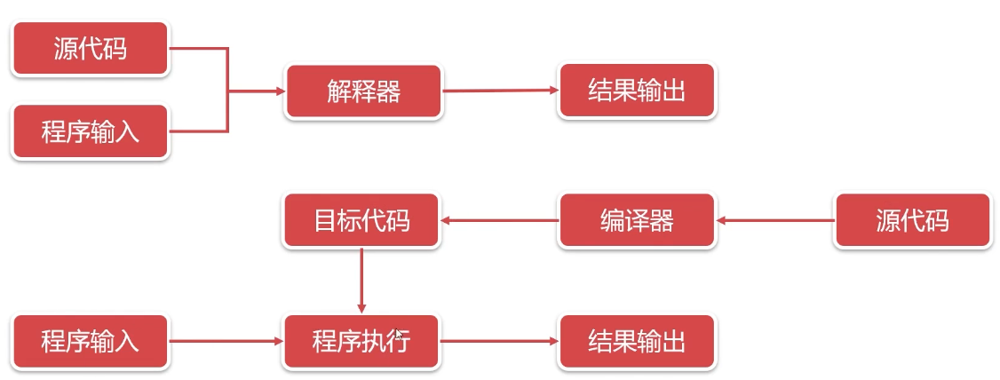

---
 
title: C++八股总结
date: 2022-01-26 14:43:17
tags:
- C++
categories:
- [C++]
---

# 阿秀

#  C/C++

##  基础语法

###  main函数

##### 1、 在main执行之前和之后执行的代码可能是什么？

* 执行之前
  * 设置栈指针
  * 初始化静态变量、全局变量  .data
  * 将为初始化的静态变量和全局变量赋初值，.bss
  * 全局对象构造函数
* 执行之后
  * 全局对象析构函数

### 结构体

##### 2、结构体内存对齐问题？

* `alignof`可以计算出类型的对齐方式，`alignas`可以指定结构体的对齐方式
  * alignas设置的大小是整体的对齐大小

* 如果想使用单字节对齐的方式，使用`alignas`是无效的。应该使用`#pragma pack(push,1)`或者使用`__attribute__((packed))`

##### 70、如何获得结构成员相对于结构开头的字节偏移量

* ```cpp
  offsetof(S, x)
  ```

### new/malloc/delete/free

##### 41、C++中有几种类型的new

* **plain new**
* **nothrow new**
  * `char *p = new(nothrow) char[10e11];`
* **placement new**

##### 8、new / delete 与 malloc / free的异同

##### 12、被free回收的内存是立即返还给操作系统吗？

* 不是的，被free回收的内存会首先被ptmalloc使用双链表保存起来
* 避免了频繁的系统调用

##### 52、new和malloc的区别

##### 53、delete p、delete [] p、allocator都有什么作用

##### 54、new和delete的实现原理， delete是如何知道释放内存的大小的

##### 55、malloc申请的存储空间能用delete释放吗

不能

##### 56、malloc与free的实现原理

* 申请小于128k
  * 用brk分配内存， brk是将数据段(.data)的最高地址指针_edata往高地址推， 即堆区
  * brk分配的内存需要等到高地址内存释放以后才能释放
* 申请大于128k
  * 用mmap分配内存，在堆和栈之间找一块空闲内存分配，即堆栈之间的自由存储区
  * mmap分配的内存可以单独释放
*  malloc是从堆里面申请内存，也就是说函数返回的指针是指向堆里面的一块内存。操作系统中有一个记录空闲内存地址的链表。当操作系统收到程序的申请时，就会遍历该链表，然后就寻找第一个空间大于所申请空间的堆结点，然后就将该结点从空闲结点链表中删除，并将该结点的空间分配给程序

##### 57、malloc、realloc、calloc的区别

* malloc： 分配空间
* calloc： 分配空间并初始化为0
* realloc：在已经分配空间后面追加空间
  * 若空间足够则可以直接在后面追加
  * 若空间不够，则类似vector动态扩容，需要再找一块合适大小的空间，并将现有的数据拷贝过去

###  宏定义,const,static

##### 13、宏定义和函数有何区别

>  [宏函数和普通函数的区别](https://blog.csdn.net/macrossdzh/article/details/4481583?utm_medium=distribute.pc_relevant.none-task-blog-2~default~baidujs_baidulandingword~default-0-4481583-blog-115370781.235^v35^pc_relevant_anti_vip&spm=1001.2101.3001.4242.1&utm_relevant_index=3)
>
>  * 宏只是简单的文本替换，没有返回值，没有类型检测, 发生在预处理阶段
>  * 函数有函数调用，有返回值，有类型检测，发生在运行阶段

##### 36、宏定义和内联函数的区别

* 宏只是简单的文本替换，没有返回值，没有类型检测, 发生在预处理阶段

* 内联函数是代码嵌入，有返回值，有类型检测，发生在编译阶段
* **内联函数适用场景:**
  - 使用宏定义的地方都可以使用 inline 函数。
  - 作为类成员接口函数来读写类的私有成员或者保护成员，会提高效率

##### 14、宏定义和typedef区别

> [typedef char* p_char 和 #define p_char char * 的区别](https://blog.csdn.net/qq_36580990/article/details/122462976)
>
> * 宏只是简单的文本替换，没有类型检测, 发生在预处理阶段
>
> * typedef定义类型别名, 有类型检测，发生在编译阶段

#####  23、宏定义和const的区别

* 宏只是简单的文本替换，没有类型检测, 发生在预处理阶段
* const有类型检测，发生在编译和运行阶段，会提前求值

##### 24、C++中const和static的作用

> c++interview-面试问题-c++

###  全局/静态变量

##### 47、静态变量什么时候初始化

* 静态成员的数据存放在数据(data)区，未初始化的存储在(bss)区，编译的时候进行分配空间。
* 如果是在C语言中在编译的时候进行初始化。
* 如果是在C++中在对象第一次使用的时候进行初始化。

##### 73、全局变量和局部变量有什么区别？

> 内存分成5个区
>
> * 堆
> * 栈
> * 自由存储区  // 这个可能算在堆区
> * 全局／静态存储区： c中分为初始化的.data 和未初始化的.bss  但c++中没有区分
> * 常量存储区
> * 代码区
>
> 内存模型（内存布局，从下往上，从低地址到高地址）
>
> * 代码段
> * 数据段：已经初始化的全局/静态变量
> * BBS段：未赋值的全局/静态变量，但都已经初始化未默认值
> * 堆：对应brk()
> * 自由存储区：对应mmap()
> * 栈

* 生命周期不同
* 作用域不同
* 存储位置不同
  * 全局变量存储在全局存储区
  * 局部变量存储在堆栈中

##### 5、堆和栈的区别

* 申请方式不同。
  - 栈由系统自动分配。
  - 堆是自己申请和释放的。
* 申请效率不同。（栈更快）
  * 栈
    * 操作系统会**底层对栈提供支持**，会分配**专门的寄存器**存放栈的地址
    * 栈的入栈出栈操作也十分简单，并且有**专门的指令**执行，所以栈的效率比较高也比较快。
  * 堆
    * 而堆的操作是由C/C++函数库提供的，在分配堆内存的时候需要一定的**算法寻找合适大小的内存**。
    * 并且获取堆的内容需要**两次访问**，第一次访问指针，第二次根据指针保存的地址访问内存

##### 94、全局变量和static变量的区别

* 作用域不同，static只能在源文件中

### 指针

##### 3、指针和引用的区别

- 指针是一个变量，存储的是一个地址，引用是原变量的别名
- 指针指向可变，引用指向不可变，且定义时必须初始化
- sizeof指针得到的是本指针的大小，sizeof引用得到的是引用所指向变量的大小
- 作为函数参数
  - 指针在内部指向可变
  - 引用在内部指向不可变
- 引用本质是一个指针，同样会占4字节内存；指针是具体变量，需要占用存储空间


#####  4、在传递函数参数时，什么时候该使用指针，什么时候该使用引用呢？

- 用指针
  - 需要**返回函数内局部变量（堆内存）的内存**的时候用指针。
  - 使用指针传参需要开辟内存，用完要记得释放指针，不然会内存泄漏。
  - 而返回局部变量的引用是没有意义的
- 用引用
  - 对栈空间大小比较敏感（比如**递归**）的时候使用引用。使用引用传递不需要创建临时变量，开销要更小
  - **类对象作为参数**传递的时候使用引用，这是C++类对象传递的标准方式

##### 77、C++中的指针参数传递和引用参数传递有什么区别？底层原理你知道吗

* 指针参数传递本质上是值传递，它所传递的是一个地址值，需要开辟空间存储
  * 指针在函数内部可以改变指向
  * 符号表记录的是指针的地址，指针地址中存储的是实参的地址
    * 符号表-->指针地址--->实参地址
* 引用传递进来的也是实参的地址，但是是用过符号表记录这个地址的
  * 引用在函数内部不能改变指向
  * 符号表记直接记录的就是实参地址
    * 符号表-->实参地址

##### 7、区别以下指针类型

```
int *p[10]
int (*p)[10]
int *p(int)
int (*p)(int)
```


##### 17、常量指针和指针常量区别

* 指针常量是一个指针，指针指向可变，但指向的变量不可变，底层const : `int const *p或const int *p`
* 常量指针是一个指针，指向不可变，顶层const：`int *const p`

##### 18、a和&a有什么区别

> [指针数组和数组指针](https://blog.csdn.net/qq_48757526/article/details/124686346)
>
> [重点看：关于指针数组与数组指针详解（知识点全面）](https://blog.csdn.net/lirendada/article/details/122931987?utm_medium=distribute.pc_relevant.none-task-blog-2~default~baidujs_baidulandingword~default-0-122931987-blog-124686346.235^v35^pc_relevant_anti_vip&spm=1001.2101.3001.4242.1&utm_relevant_index=3)

```c++
int main(){
    int a[10] = {1,2,3,4,5,6,7,8,9}; 
    cout<<a<<endl;  // 0x7ffdc1d33c60
    cout<<*a<<endl; // 1
    cout<<*(a+1)<<endl; // 2
    int (*p)[10] = &a; // 二维数组的指针 *(p+1)就越界了
    cout<<*p<<endl;  // 0x7ffdc1d33c60  相当于a   就是首地址
    cout<<(*p)[0]<<endl;  // 1          相当于a[0]
    cout<<*(*p)<<endl;  // 1            相当于*a
    // cout<<*(*(p+1))<<endl; // 越界  p+1: 这里+1的步长是数组的长度


    int *p1 = a;  // 此时p1就等同于a      **关键点a就是一个指针， a给p赋值就是把a本身的值给p**  a和p1都是变量名，通过查表找到的地址就是数组的首地址，也就是他们本身就是数组的首地址
    cout<<p1<<endl;  // 0x7ffdc1d33c60
    cout<<*p1<<endl; // 1 
    return 0;
}


int main(){
    int a[3][4] = { {0, 1, 2, 3}, {4, 5, 6, 7}, {8, 9, 10, 11} };
    int (*p)[4] = a;   // 此时p就是a  相当于p就是a的别名
    // a[i][j] == p[i][j] == *(a[i]+j) == *(p[i]+j) == *(*(a+i)+j) == *(*(p+i)+j)
    return 0;
}

```

##### 26、数组名和指针（这里为指向数组首元素的指针）区别

* 数组名相当于一个常量指针
  * 不过sizeof返回的数组长度
  * 不能进行自增、自减操作（a++, a--）
  * 可以进行增减偏移量操作（a+1, a-1）
* **当数组名当做形参传递给调用函数**   此时数组名和指针完全一样
  * **就失去了原有特性，退化成一般指针，多了自增、自减操作**
  * **但sizeof运算符不能再得到原数组的大小了,而是指针的大小**

```c++
int main(){
    int a[10] = {1,2,3,4,5,6,7,8,9}; 
    int b[10] = {1,2,3,4,5,6,7,8,9}; 
    // a = b; // error a是一个常量指针，不能赋值
    // ++a; // 报错，不能自增，自减， 因为指向不可变
    // a++; // 报错，不能自增，自减， 因为指向不可变
    cout<<a<<endl;  // 0x7ffdc1d33c60
    cout<<*a<<endl; // 1
    cout<<*(a+1)<<endl; // 2
    return 0;
}
```

##### 74、指针加减计算要注意什么？

* 加减的步长由数据类型确定

##### 31、野指针和悬空指针

* 野指针：定义后未初始化，指向不明
* 悬空指针：指向内存释放后，没有置为nullptr

### 对象

#####  22、C++中struct和class的区别

* struct成员默认是公有、默认是public继承
* class成员默认是私有、默认是private继承

#####  28、拷贝初始化和直接初始化

* 使用explicit修饰构造函数时：如果构造函数存在隐式转换，编译时会报错
  * 例如语句3和4就是隐式类型转换

```c++
string str1("I am a string");//语句1 直接初始化
string str2(str1);//语句2 拷贝初始化
string str3 = "I am a string";//语句3 拷贝初始化，先为字符串”I am a string“创建临时对象，再把临时对象作为参数，使用拷贝构造函数构造str3
string str4 = str1;//语句4 拷贝初始化，这里相当于隐式调用拷贝构造函数，而不是调用赋值运算符函数

```

##### 29、初始化和赋值的区别

- 对于简单类型来说，初始化和赋值没什么区别
- 对于类和复杂数据类型来说
  - 定义的时候初始化就是直接初始化
  - 先定义（已经分配内存），后赋值就是赋值

```c++
int main(){
    A a(1,1);
    A a1 = a; //拷贝初始化操作，调用拷贝构造函数
    A b;
    b = a;//赋值操作，对象a中，num1 = 1，num2 = 1；对象b中，num1 = 2，num2 = 2
    return 0;
}
```

#####  40、什么情况下会调用拷贝构造函数

- 用实例化对象初始化另一个对象
- 函数的参数对象（非引用传递），本质是实参对象去初始化形参对象
- 函数的返回值是对象
  - **在Linux g++ 下则不会发生拷贝构造函数，不仅如此即使返回局部对象的引用，依然不会发生拷贝构造函数**
  - **Windows + VS2019在值返回的情况下发生拷贝构造函数，引用返回方式则不发生拷贝构造函数**
    - 在c++编译器发生NRV（Named return Value优化）优化，如果是引用返回的形式则不会调用拷贝构造函数，如果是值传递的方式依然会发生拷贝构造函数。

##### 69、C++中将临时变量作为返回值时的处理过程

* 返回值被存储在寄存器中，接受函数返回值时，用寄存器的值初始化


##### 34、C++有哪几种的构造函数

- 默认构造函数
- 初始化构造函数（有参数）
- 拷贝构造函数
- 移动构造函数（move和右值引用）
- 委托构造函数
  - 可在构造函数中调用构造函数
- 转换构造函数
  - 转换构造函数用于将其他类型的变量，隐式转换为本类对象

##### 103、如果有一个空类，它会默认添加哪些函数？

* 默认构造函数
* 拷贝构造函数
* 析构函数
* 赋值运算符

c++11

* 默认构造
* 析构函数
* 拷贝构造
* 赋值构造
* 移动拷贝构造
* 移动赋值构造

##### 116、 如何禁止程序自动生成拷贝构造函数

> c++11 delete/default : https://zhuanlan.zhihu.com/p/374042021

* 自己重写拷贝构造和等号赋值
* c++11 让拷贝构造 = delete
  * `Persion() = delete;`
* 若需要禁止访问拷贝构造和等号赋值
  * 将拷贝构造和等号赋值重载为private
  * 类的成员函数和friend函数还是可以调用private函数
    * 定一个base类，在base类中将拷贝构造函数和拷贝赋值函数设置成private
    * son类中不再定义拷贝构造函数，此时son中将也不存在拷贝构造函数

```c++
class Base 
{
public:
  Base(){
    cout<<"Base create..."<<endl;
  }
private:
	// 拷贝构造函数
  Base(Base& b){
    cout<<"Base copy..."<<endl;
  }
};

class Son : public Base
{
public:
  // Son(){ 
  //   cout<<"Son create..."<<endl;
  // }
};

int main()
{
  Son s;
  // 此时就不能正常使用拷贝构造函数了
  // Son ss(s); // 提示：无法引用 函数 "Son::Son(Son &)" (已隐式声明) -- 它是已删除的函数

	return 0;
}

// 打印
// Base create...
```

* 如果在son中重写拷贝构造函数，对于son的实例化还是可以调用拷贝构造函数的
  * 但是子类的拷贝构造函数还是不能使用的，即使为public，也不会调用base的拷贝构造函数，调用的仍然是base的构造函数
  * 要实现base的拷贝构造函数的功能，则需要在son的构造函数中重写

```c++
class Base 
{
public:
  int num;
  Base(){
    num = 10;
    cout<<"Base create..."<<endl;
  }
  void setNUm(int n){
    num = n;
  }
private:
	// 拷贝构造函数
  Base(Base& b){
    num = b.num;
    cout<<"Base copy..."<<endl;
  }
};

class Son : public Base
{
public:
  Son(){ 
    cout<<"Son create..."<<endl;
  }
  Son(Son& s){
    num = s.num;
    cout<<"Son copy..."<<endl;
  }
};

int main()
{

	Son s;
  cout<<s.num<<endl;
  s.setNUm(20);
  cout<<s.num<<endl;
  Son ss(s); // 调用的是子类的构造函数 ======重要：注意======
  cout<<ss.num<<endl;
	return 0;
}

// 打印
// Base create...
// Son create...
// 10
// 20
// Base create...
// Son copy...
// 20
```


#####  没有默认构造函数的情况

* 只要定义了任何一种构造函数，默认构造函数就不会自动生成了，例如下面自定义了拷贝构造函数，则编译器不在提供默认构造函数

```c++
class Base 
{
private:
	// 拷贝构造函数
  Base(Base& b){
    cout<<"Base copy..."<<endl;
  }
};

class Son : public Base
{
public:
  Son(){ // 报错，提示Base没有默认构造函数
    cout<<"son create"<<endl;
  }
};
```


##### 58、类成员初始化方式？构造函数的执行顺序 ？为什么用成员初始化列表会快一些？

* 执行顺序
  * 虚拟基类的构造函数（多个虚拟基类则按照继承的顺序执行构造函数）
  * 基类的构造函数（多个普通基类也按照继承的顺序执行构造函数）
  * 成员对象的构造函数（按照成员对象在类中的定义顺序）
  * 引用 ： 初始化列表
  * 常量 ：初始化列表
  * 派生类自己的构造函数
* 初始化列表
  * 在对象初始化（分配空间）的时候就给成员赋值了
  * **只调用一次有参构造**
* 构造函数体内的初始化
  * 在对象初始化（分配空间）的时候调用的是默认构造函数，先分配了空间
  * 然后在构造函数体中通过赋值进行初始化
  * **这种方式对于值类型无所谓，但是对于对象成员就多了一次默认构造的调用**
  * **一次默认构造+拷贝构造**

##### 59、有哪些情况必须用到成员列表初始化？作用是什么？

* 当初始化一个引用成员时；
* 当初始化一个常量成员时；
*  当调用一个基类的构造函数，而它拥有一组参数时；
* 当调用一个成员类的构造函数，而它拥有一组参数时

#####  115、如何阻止一个类被实例化？有哪些方法？

1. 将类定义为抽象基类或者将构造函数声明为private；

###  string、`char *、const char*`

##### 16、strlen和sizeof区别？

* sizeof是运算符
  * 参数可以是任何数据的类型或者数据
  * 因为sizeof值在编译时确定，所以不能用来得到动态分配（运行时分配）存储空间的大小
  * 注意字符指针，返回结果是指针的大小
* strlen是字符处理的库函数
  * 参数只能是字符指针且结尾是'\0'的字符串
  * 返回长度不包括'\0'

##### 60、C++中新增了string，它与C语言中的 char *有什么区别吗？它是如何实现的

* string继承自basic_string,其实是对`char*`进行了封装，封装的string包含了`char*`数组，容量，长度等属性
* string可动态扩容

##### 105、你知道const char* 与string之间的关系是什么吗？

```c++
#include <cstring>
int main(){
  //const char*、char*转string
  char* c = "abc";
  string s(c);

  const char* cc = "hello";
  string ss(cc);

  // string、char* 转const char*
  string s = "abc";
  const char* cc1 = s.c_str();

  char* c = "hello";
  const char* cc2 = c;

  // string、const char* 转 char*
  string s = "abc";
  char* c1 = new char[s.length()+1];
  strcpy(c1, s.c_str());

  const char* cc = "hello"; 
  char* c2 = new char[strlen(cc)+1]; 
  strcpy(c2, cc);
  return 0;
}
```

### 多态，虚函数

##### 27、final和override关键字

##### 33、C++中的重载、重写（覆盖）和隐藏的区别

* 重载
  * 参数个数不同
  * 参数顺序不同
  * 参数类型不同
  * 不能是返回值不同来区分

* 重写
  * 父类是虚函数，且函数名、参数类型、参数个数完全相同
  * 父类指针可以正常调用子类的重写函数
* 隐藏
  * 父类不是虚函数，且函数名、参数类型、参数个数完全相同
  * **两个函数参数不同，无论基类函数是不是虚函数，都会被隐藏。**
  * 总结：函数名相同则父类同名函数被隐藏
    * 除了了重写的情况：父类是虚函数，且函数名、参数类型、参数个数完全相同
  * *父类指针**不能**正常调用子类的隐藏父类的函数，父类指针只能调用父类被隐藏的函数*   多态的情况下

```c++
// 父类
class A {
public:
    virtual void fun(int a) { // 虚函数
        cout << "This is A fun " << a << endl;
    }  
    void add(int a, int b) {
        cout << "This is A add " << a + b << endl;
    }
};

// 子类
class B: public A {
public:
    void fun(int a) override {  // 覆盖
        cout << "this is B fun " << a << endl;
    }
    void add(int a) {   // 隐藏
        cout << "This is B add " << a + a << endl;
    }
};

int main() {
    // 基类指针指向派生类对象时，基类指针可以直接调用到派生类的覆盖函数，也可以通过 :: 调用到基类被覆盖
    // 的虚函数；而基类指针只能调用基类的被隐藏函数，无法识别派生类中的隐藏函数。

    A *p = new B();
    p->fun(1);      // 调用子类 fun 覆盖函数
    p->A::fun(1);   // 调用父类 fun
    p->add(1, 2);
    // p->add(1);      // 错误，识别的是 A 类中的 add 函数，参数不匹配
    // p->B::add(1);   // 错误，无法识别子类 add 函数

    B b;
    b.add(1);       // 调用子类 add 函数
    // b.add(1, 2);    // 调用父类 add 函数  不能正常调用
    return 0;
}
```


#####  65、C++的四种强制转换reinterpret_cast/const_cast/static_cast /dynamic_cast

> 参考：面试问题：c++: 多态指针转型

* **reinterpret_cast**：用于类型之间进行强制转换
* **const_cast**： 修改类型的const或volatile属性
* **static_cast**
  * 父子类之间转换
    * 向上转型，安全
    * 向下转型，不安全，转型成功，但使用子类独有数据时可能因为未初始化而报错
  * 用于基本数据类型之间的转换
  * 把空指针转换成目标类型的空指针
  * 把任何类型的表达式转换成void类型
* **dynamic_cast**
  * 父子类之间转换
    * 向上转型，安全
    * 向下转型，安全，转型成功返回相应的指针(基类指针确实指向一个派生类)，转成不成功则返回nullptr，便于判断进行后续操作


##### 71、静态类型和动态类型，静态绑定和动态绑定的介绍

>  看原文，花点时间

* 动态绑定主要指有虚函数的情况，运行的时候确定
* 静态绑定，编译的时候确定
  * `A* a  = null`: 这种情况是可以正常调用方法的（`a.fun()`），因为是静态绑定，但是如果方法中有使用成员变量，则会报错，因为成员变量没有初始化
* 当缺省参数和virtual函数一起使用的时候一定要谨慎，，，，看原文

##### 72、引用是否能实现动态绑定，为什么可以实现？

* 可以，和指针一样，只不过引用初始化必须赋值，不能用nullptr初始化（需要用左值初始化引用）
* **需要说明的是虚函数才具有动态绑定**，子类的非虚函数是不能通过父类指针访问的

##### 78、类如何实现只能静态分配和只能动态分配

* 只能静态分配
  * 把new、delete运算符重载为private属性
* 只能动态分配
  * 把构造、析构函数设为protected属性，再用子类来动态创建
    * 设为protected属性，保证了不能直接静态分配
    * 每次获取只能通过子类获取
    * 在子类中写死，每次分配只通过动态分配

##### 79、如果想将某个类用作基类，为什么该类必须定义而非声明

> [c++中类的申明和定义](https://blog.csdn.net/guomutian911/article/details/49200949?ops_request_misc=%257B%2522request%255Fid%2522%253A%2522168890861816800192265966%2522%252C%2522scm%2522%253A%252220140713.130102334..%2522%257D&request_id=168890861816800192265966&biz_id=0&utm_medium=distribute.pc_search_result.none-task-blog-2~all~baidu_landing_v2~default-2-49200949-null-null.142^v88^insert_down28v1,239^v2^insert_chatgpt&utm_term=c%2B%2B%E7%B1%BB%E7%9A%84%E5%A3%B0%E6%98%8E%E4%B8%8E%E5%AE%9A%E4%B9%89&spm=1018.2226.3001.4187)

* 派生类中包含并且可以使用它从基类继承而来的成员，为了使用这些成员，派生类必须知道他们是什么。所以必须定义而非声明
  * 子类需要使用父类的方法，要知道方法具体是什么，就必须定义

#####  93、定义和声明的区别

* **如果是指变量的声明和定义：** 从编译原理上来说，声明是仅仅告诉编译器，有个某类型的变量会被使用，但是编译器并不会为它分配任何内存。而定义就是分配了内存。

* **如果是指函数的声明和定义：** 声明：一般在头文件里，对编译器说：这里我有一个函数叫function() 让编译器知道这个函数的存在。 定义：一般在源文件里，具体就是函数的实现过程 写明函数体。

#####  15、变量声明和定义区别？

* 声明，告诉编译器类型，不分配内存，可多次声明
* 定义，分配内存，多次声明只能定义一次

#####  

##### 81、知道C++中的组合吗？它与继承相比有什么优缺点吗？

* 组合
  * 高内聚，低耦合
* 继承
  * 高耦合
    * 父类修改，子类也可能需要修改

##### 122、成员函数里memset(this,0,sizeof(*this))会发生什么

* 有虚函数，会把虚函数指针置空
* 有成员对象，会破坏成员对象的内存

###  非常规

#####  30、extern"C"的用法

##### 32、C和C++的类型安全

* c
  * malloc返回值问题易出错
* c++
  * new 替代 malloc
  * nullptr 替代 NULL
  * const 替代 define
  * **dynamic_cast**, 向下转型更安全相比static_cast

#####  19、各语言区别

**字节码、程序编译与程序解释**

* 编译是将高级语言整体翻译为底层语言在机器上执行，编译是将高级语言翻译成和高级语言逻辑完全一致的低级语言
* 解释是将高级语言作为输入，一句一转换的转换为底层指令在机器上执行



* 编译型语言: C/C+＋、Object-C、Golang
* 解释型语言：Python、Php、Javascript

* java虚拟机
  * Java是一种编译+解释的语言
    * java程序  编译成  JVM字节码 
    * JVM字节码 解释成  机器码
    * 字节码(英语:Bytecode)通常指的是已经经过编译，但与特定机器代码无关，需要解释器转译后才能成为机器代码的中间代码。字节码通常不像源码一样可以让人阅读，而是编码后的数值常量、引用、指令等构成的序列。
  * Java程序 --> Java字节码 --> Java虚拟机 --> 操作系统
  * 没有虚拟机的问题
    * 不同平台不同的编译器
    * 不同平台部署需要重新编译
    * 编译结果不复用
  * 有了Java虚拟机，一次编译，随处运行


#####  38、如何用代码判断大小端存储？

* 联合体
* 强制类型转换

##### 39、volatile、mutable和explicit关键字的用法

> [C++中的explicit详解](https://blog.csdn.net/k6604125/article/details/126524992)

* volatile：每次都去内存中取值
* mutable：const可修改
* explicit：禁止构造函数隐式类型转换
  * 28、拷贝初始化和直接初始化
  * “=”隐式调用拷贝构造函数，而不是赋值运算符

##### 42、C++的异常处理的方法

> [typeid: 数据类型](https://blog.csdn.net/m0_37345402/article/details/105041937)

* **try、throw和catch关键字**
* **C++标准异常类 exception**
  * bad_typeid
  * bad_cast
  * bad_alloc
  * out_of_range

##### 67、写C++代码时有一类错误是 coredump ，很常见，你遇到过吗？怎么调试这个错误？


##### 75、 怎样判断两个浮点数是否相等

> [为什么不能用==](https://blog.csdn.net/rick_geek/article/details/102728105)
>
> * 0.1， 0.2，0.4，0.6，0.8，0.3，0.7，0.9都是无法精确表示
> * 小数部分乘2取整，直到小数部分为0
>
> [判断方法](https://blog.csdn.net/WHY995987477/article/details/100175872)
>
> * abs(a-b) 和 eps比较
> * if (!(a > b || a < b))


##### 88、为什么模板类一般都是放在一个h文件中

* 模板还没有实例化

##### 99、如何在不使用额外空间的情况下，交换两个数？你有几种方法

##### 117、你知道Debug和Release的区别是什么吗

##### 125、C++从代码到可执行程序经历了什么？

* 预编译
* 编译
* 汇编
* 链接

#####  127、友元函数和友元类的基本情况

*  友元关系不能被继承。

* 友元关系是单向的，不具有交换性。若类B是类A的友元，类A不一定是类B的友元，要看在类中是否有相应的声明。
*  友元关系不具有传递性。若类B是类A的友元，类C是B的友元，类C不一定是类A的友元，同样要看类中是否有相应的申明

### strcpy、sprintf、memcpy

##### 87、你知道printf函数的实现原理是什么吗

* 函数压栈，参数从右往左压入栈
* 对于printf，栈顶，也就最先拿到的就是字符指针

#####  90、cout和printf有什么区别？

* cout是ostrem的全局对象
* printf是库函数

#####  100、你知道strcpy和memcpy的区别是什么吗

> [C/C++ memcpy的实现](https://blog.csdn.net/qq_42330920/article/details/123660241)

* strcpy只能复制字符串，而memcpy可以复制任意内容
* strcpy不需要指定长度，它遇到被复制字符的串结束符"\0"才结束，所以容易溢出。memcpy则是根据其第3个参数决定复制的长度

##### 112、说一说strcpy、sprintf与memcpy这三个函数的不同之处

##### 120、strcpy函数和strncpy函数的区别？哪个函数更安全

##  内存管理

#####  1、类的对象存储空间？

* 对象和结构体一样
* 多了虚函数指针
* 空类size为1

##### 3、什么是内存池，如何实现

* 0-15 共16个链表：4，8，12，，，128

##### 4、可以说一下你了解的C++得内存管理吗？

* 就是问内存分区
  * 堆
  * 栈
  * 自由存储区  // 这个可能算在堆区
  * 全局／静态存储区： c中分为初始化的.data 和未初始化的.bss  但c++中没有区分
  * 常量存储区
  * 代码区


##### 5、C++中类的数据成员和成员函数内存分布情况

* 成员变量存储和结构体一样
* 成员函数存储在代码区，包括静态成员函数，只是静态成员函数没有this指针

##### 6、关于this指针你知道什么？全说出来

- this指针是类的指针，指向对象的首地址

```c++
A a;a.func(10);//此处，编译器将会编译成：A::func(&a,10);
```

- this指针只能在成员函数中使用，在全局函数、静态成员函数中都不能用this。
- this指针只有在成员函数中才有定义，且存储位置会因编译器不同有不同存储位置,一般成员函数的第一个参数就是this指针。

this指针使用场景：

* 一种情况就是，在类的非静态成员函数中返回类对象本身的时候，直接使用 return *this；
* 另外一种情况是当形参数与成员变量名相同时用于区分，如this->n = n （不能写成n = n）

##### 7、几个this指针的易混问题

> 此题最好看原文

A. this指针是什么时候创建的？

* this在成员函数的开始执行前构造，在成员的执行结束后清除
  * 参考6、关于this指针你知道什么？全说出来  原文

B. this指针存放在何处？堆、栈、全局变量，还是其他

* 寄存器，栈，全局变量都有可能

C. this指针是如何传递类中的函数的？绑定？还是在函数参数的首参数就是this指针？那么，this指针又是如何找到“类实例后函数的”

* 函数调用前放到寄存器
* 作为函数第一个参数传给函数

D. this指针是如何访问类中的变量的

* this指针是类的指针

E.我们只有获得一个对象后，才能通过对象使用this指针。如果我们知道一个对象this指针的位置，可以直接使用吗

* 获得对象是不能拿到this指针的，只有在对象函数中才能拿到this指针
* 在对象函数中是可以对this取地址的，也可以正常使用this

F.每个类编译后，是否创建一个类中函数表保存函数指针，以便用来调用函数

* 只有虚函数会在类中创建函数表

##### 9、在成员函数中调用delete this会出现什么问题？对象还可以使用吗

* 在delete this之后进行的其他任何函数调用，只要不涉及到this指针的内容，都能够正常运行
* 一旦涉及到this指针，如操作数据成员，调用虚函数等，就会出现不可预期的问题

##### 11、 如果在类的析构函数中调用delete this，会发生什么

* 堆栈移除，会递归析构

##### 13、请说一下以下几种情况下，下面几个类的大小各是多少

> 看原文

* 空对象大小为1
* static成员不占用对象大小


##### 15、类对象的大小受哪些因素影响

* 成员变量
* 虚函数指针
* 内存对齐
* 基类

###  STL

##### 3、使用智能指针管理内存资源，RAII是怎么回事？

* RAII全称是“Resource Acquisition is Initialization”，直译过来是“资源获取即初始化”
* 智能指针（std::shared_ptr和std::unique_ptr）即RAII最具代表的实现

#####  4、迭代器：++it、it++哪个好，为什么

* 前置返回引用
* 后置返回对象，且在内部会产生临时对象

##### 5、说一下C++左值引用和右值引用

> 看原文

* C++11正是通过引入右值引用来优化性能，具体来说是通过移动语义来避免无谓拷贝的问题，
* 通过move语义来将临时生成的左值中的资源无代价的转移到另外一个对象中去，
* 通过完美转发来解决不能按照参数实际类型来转发的问题（同时，完美转发获得的一个好处是可以实现移动语义）
* 表达式b+c、**函数int func()的返回值是右值**

##### 7、简单说一下traits技法

> 不会

##### 8、STL的两级空间配置器

> 不熟，看侯杰视频

##### 21、STL中的allocator、deallocator

##### 12、容器内部删除一个元素

* 顺序容器，删除当前元素，当前元素迭代器失效，后面的迭代器也失效
* 关联容器，删除当前元素，只当前元素迭代器失效

##### 15、如何在共享内存上使用STL标准库？

> 不会

##### 22、STL中hash table扩容发生什么？

* hash底层是vector，所以扩容同vector


###  虚函数

##### 3、构造函数能否声明为虚函数或者纯虚函数，析构函数呢？

* 析构函数
  * 一般为虚函数
  * 可以为纯虚函数，该类变为抽象类，不可实例化，子类需要重写析构函数
* 构造函数
  * 不能为虚函数
    * 调用虚函数需要vptr
    * 但是需要调用构造函数才能生成vptr
    * 互相矛盾

##### 6、构造函数、析构函数、虚函数可否声明为内联函数

* 都可以声明为内联函数，不会报错
* 构造函数和析构函数声明为内联函数也没有意义
  * 编译器不会将构造函数和析构函数按内联函数去操作
* 虚函数
  * 当是指向派生类的指针（多态性）调用声明为inline的虚函数时，不会内联展开；
  * 当是对象本身调用虚函数时，会内联展开，当然前提依然是函数并不复杂的情况下

```c++
class A{
public:
  int a;
  A():a(10){

  }
  // void func(){
  //   cout<<"func"<<endl;
  // }
  virtual void func(){
    cout<<"func...."<<endl;
  }
  virtual void funcc(){
    cout<<"funcc...."<<endl;
  }
};

int main()
{
  A a;
  a.func();
  a.funcc();
  cout<<sizeof(a)<<endl; // 16   很奇怪
  return 0;
}
```

##### 10、构造函数和析构函数可以调用虚函数吗，为什么

> 看原文

* 可以但是不提倡

##### 16、构造函数或者析构函数中可以调用虚函数吗

> 看原文，有代码案例

*  可以但不提倡

##### 1、C++的多态如何实现

* 虚函数
* 对象的虚函数指针，对象初始化创建
* 类的虚函数表，编译阶段创建，在常量存储区
* 动态绑定，父类指针指向子类

##### 2、为什么析构函数一般写成虚函数

* 避免内存泄漏

#####  4、基类的虚函数表存放在内存的什么区，虚表指针vptr的初始化时间

* 虚函数表
  * 常量区
  * 编译阶段初始化
* 虚函数指针
  * 对象最前面4个字节
  * 对象初始化阶段初始化

##### 11、构造函数、析构函数的执行顺序？构造函数和拷贝构造的内部都干了啥？

* 构造函数
  * 基类构造函数
  * 成员类构造函数
  * 派生类构造函数
* 析构函数
  * 派生类析构函数
  * 成员类析构函数
  * 基类析构函数


##### 13、构造函数析构函数可否抛出异常

##### 17、构造函数的几种关键字

* default： 使用默认构造函数

```c++
CString() = default; //语句1
```

* delete: 删除

```c++
void* operator new() = delete;//这样不允许使用new关键字
```

##### 18、构造函数、拷贝构造函数和赋值操作符的区别

* **构造函数**
  * 对象不存在，没用别的对象初始化，在创建一个新的对象时调用构造函数

* **拷贝构造函数**
  * 对象不存在，但是使用别的已经存在的对象来进行初始化

* **赋值运算符**
  * 对象存在，用别的对象给它赋值，这属于重载“=”号运算符的范畴，“=”号两侧的对象都是已存在的

##### 20、什么是虚拟继承

> 看原文

* 解决菱形继承的问题
* 避免基类被多次初始化产生歧义

#####  21、什么情况会自动生成默认构造函数

> [何时编译器会自动生成默认构造函数](https://blog.csdn.net/weixin_41066529/article/details/89846314)

* 带有默认构造函数的类成员对象
* 带有默认构造函数的基类
* 带有一个虚函数的类（需要初始化虚函数指针）
* 带有一个虚基类的类（需要初始化指向虚基类的指针）

##### 32、那什么时候需要合成拷贝构造函数呢

* 如果一个类没有拷贝构造函数，但是含有一个类类型的成员变量，该类型含有拷贝构造函数，此时编译器会为该类合成一个拷贝构造函数；
* 如果一个类没有拷贝构造函数，但是该类继承自含有拷贝构造函数的基类，此时编译器会为该类合成一个拷贝构造函数；
* 如果一个类没有拷贝构造函数，但是该类声明或继承了虚函数，此时编译器会为该类合成一个拷贝构造函数；
  * （需要拷贝虚函数指针）
* 如果一个类没有拷贝构造函数，但是该类含有虚基类，此时编译器会为该类合成一个拷贝构造函数
  * （需要拷贝指向虚基类的指针）

##### 22、抽象基类为什么不能创建对象

* 虚函数指针为空，会报错

##### 24、多继承的优缺点，作为一个开发者怎么看待多继承

* 优点：可以调用多个基类的接口
* 缺点：菱形继承，产生二义性，需要虚继承

##### 27、为什么拷贝构造函数必须传引用不能传值

* 传值会调用拷贝构造函数，就会产生递归调用堆栈溢出

###  模板

##### 5、模板函数和模板类的特例化

* 引入原因
  * 编写单一的模板，它能适应多种类型的需求，使每种类型都具有相同的功能，但对于某种特定类型，如果要实现其特有的功能，单一模板就无法做到，这时就需要模板特例化
* 主意：
  * 模板及其特例化版本应该声明在同一个头文件中，且所有同名模板的声明应该放在前面，后面放特例化版本
* 函数
  * 普通函数可以将声明和定义分文件写
  * 函数模板只能都放在头文件中
  * 特例化函数可以将声明和定义分文件写

##### 7、C++模板是什么，你知道底层怎么实现的？

* 编译器从函数模板通过具体类型产生不同的函数；
* 编译器会对函数模板进行两次编译：
  * 在声明的地方对模板代码本身进行编译
  * 在调用的地方对参数替换后的代码进行编译。
* 模板函数声明和定义需要都放在同一个头文件中
  * 因为函数模板要被实例化后才能成为真正的函数，在使用函数模板的源文件中包含函数模板的头文件，如果该头文件中只有声明，没有定义，那编译器无法实例化该模板，最终导致链接错误

##### 23、模板类和模板函数的区别是什么

* 函数模板允许隐式调用和显式调用
* 类模板只能显示调用

# 计算机网络

43、Cookie和session的区别

> [Cookie和session的区别](https://blog.csdn.net/m0_65421722/article/details/127813102)

* Cookie： 用户信息直接存储在Cookie中

* Session：用户信息存储在服务器中，通过cookie传给前端一个sessionid，前端每次请求挈带sessionid，再通过这个sessionid在服务器查询用户信息

44、DDos 攻击了解吗？

> [什么是DDos](https://mp.weixin.qq.com/s?__biz=MzIwOTcyNjA3Mw==&mid=2247508943&idx=1&sn=d21d59a31de70bd5592204f8650e1d2b&chksm=976d9cd9a01a15cfc0d63b6001b047cf1e0aa9fe4252cac182cfff5735590a1eb28462757074&scene=27)
>
> [如何防御ddos攻击？](https://blog.csdn.net/xyyaq/article/details/123727315)


##  基础篇

###  TCP/IP

#### 应用层

> 应用层是工作在操作系统中的用户态，传输层及以下则工作在内核态

#####  常见应用层协议

| 协议   | 名称                       | 默认端口       | 底层协议                                                  |
| ------ | -------------------------- | -------------- | --------------------------------------------------------- |
| HTTP   | 超文本传输协议             | 80             | TCP                                                       |
| HTTPS  | 超文本传输安全协议         | 443            | TCP                                                       |
| Telnet | 远程登录服务的标准协议     | 23             | TCP                                                       |
| FTP    | 文件传输协议               | 20传输和21连接 | TCP                                                       |
| TFTP   | 简单文件传输协议           | 69             | UDP                                                       |
| SMTP   | 简单邮件传输协议（发送用） | 25             | TCP                                                       |
| POP    | 邮局协议（接收用）         | 110            | TCP                                                       |
| DNS    | 域名解析服务               | 53             | 服务器间进行域传输的时候用TCP 客户端查询DNS服务器时用 UDP |


###  键入网址到网页显示，期间发生了什么

* 解析URL并生成http消息
  * http消息
    * 请求行    状态行
    * 请求头    消息头
    * 消息体    消息体
* DNS域名解析
  * 查询浏览缓存
  * 查询操作系统缓存
  * 查询hosts文件
  * 查询本地DNS服务器
    * 本地服务器有缓存则直接返回   非权威
    * 若本地服务器就是负责这个域名解析的，则返回  是权威的
    * 若都不是则询问根服务器
  * 递归查询
    * 根服务器问域服务器，域服务器问权威服务器，权威服务器返回域服务器，域服务器返回根服务器，根服务器返回本地服务器
  * 迭代查询
    * 根服务器返回本地服务器域服务器 ip
    * 本地服务器问域服务器，域服务器返回本地服务器权威服务器ip
    * 本地服务器问权威服务器，权威服务器返回ip
    * 本地服务器返回ip
* 拿到ip后可以 把HTTP 的传输工作交给操作系统中的**协议栈**
* tcp传输
  * 字段
    * 源端口    16位
    * 目标端口 16位
    * 序号          32位
    * 确认序号  32位
    * 状态位      6位
    * 窗口大小  16位
  * 三次握手
  * `MTU`：一个网络包的最大长度，以太网中一般为 `1500` 字节。
  * `MSS`：除去 IP 和 TCP 头部之后，一个网络包所能容纳的 TCP 数据的最大长度
* ip传输
  * `ICMP` 用于告知网络包传送过程中产生的错误以及各种控制信息。
  * `ARP` 用于根据 IP 地址查询相应的以太网 MAC 地址。
  * 选择源ip(看原文)
    * 预先选择和目标ip在一个局域网的ip作为源ip
* MAC
  * 获取目标mac地址
    * 查询ARP缓存
    * 缓存无，则ARP广播
* 