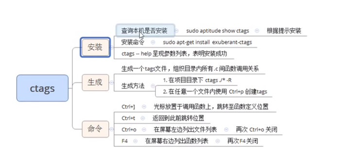

---
 
title: 网络编程学习笔记
date: 2022-01-26 14:43:17
tags:
- 网络编程
categories:
- [C++]
---

#  Network

####  read/write

```c++
read函数
ssize_t read(int fd, void *buf, size_t count);
参数：
	fd：文件描述符
	buf：存数据的缓冲区
	count：缓冲区大小
返回值：
	0：		读到文件末尾。 （对端已经关闭）【 ！重 ！点 ！】
	成功；	> 0 读到的字节数。
	失败：	-1， 设置 errno
    	errno = EAGAIN or EWOULDBLOCK: 设置了非阻塞方式读。 没有数据到达 没有读到数据。 说明不是read失败。

		errno = EINTR 慢速系统调用被 中断。

		errno = “其他情况” 异常。


write函数
ssize_t write(int fd, const void *buf, size_t count);
参数：
	fd：文件描述符
	buf：待写出数据的缓冲区
	count：数据大小
返回值：
	成功：写入的字节数。
	失败：-1， 设置 errno
```


####  **select**

> man select ： linux上查看使用

* 优点
  * 跨平台
* 缺点
  * 监听上限1024
  * 每次需要遍历fd_set，找到有读事件的文件并处理
    * 需要自己构建一个监听的文件描述符的集合数组来优化这个问题
  * 每次select都是系统调用，都要切换用户态和内核态，fd_set要不在用户态和内核态直接反复拷贝
* 参数

```c++
int select(int nfds, fd_set *readfds, fd_set *writefds,fd_set *exceptfds, struct timeval *timeout);

		nfds：监听的所有文件描述符中，最大文件描述符+1

		readfds： 读 文件描述符监听集合。	传入、传出参数

		writefds：写 文件描述符监听集合。	传入、传出参数		NULL

		exceptfds：异常 文件描述符监听集合	传入、传出参数		NULL

		timeout： 	> 0: 	设置监听超时时长。

				   NULL:	阻塞监听 （timeout）

				      0：	非阻塞监听，轮询 （timeout）
		返回值：

			> 0:	所有监听集合（3个）中， 满足对应事件的总数。

			  0：	没有满足监听条件的文件描述符

			 -1： 	errno

```

```c++
       int select(int nfds, fd_set *readfds, fd_set *writefds,
                  fd_set *exceptfds, struct timeval *timeout);
// 对文件描述符集合的位操作函数
       void FD_CLR(int fd, fd_set *set); // 将fd剔除集合，即置0
       int  FD_ISSET(int fd, fd_set *set); // 判断fd是否在集合中，即获取存储的值(0/1)
       void FD_SET(int fd, fd_set *set); //将fd置为1
       void FD_ZERO(fd_set *set); // 将fd集合元素全部置0
```


####  **poll**

* 优点：
  * 自带数组结构。 可以将 监听事件集合 和 返回事件集合 分离。
  * 拓展 监听上限。 超出 1024限制。

* 缺点：
  * 不能跨平台。 Linux
  * 无法直接定位满足监听事件的文件描述符， 编码难度较大。
* 参数

```c++
int poll(struct pollfd *fds, nfds_t nfds, int timeout);

		fds：监听的文件描述符【数组】

			struct pollfd {
				
				int fd：	待监听的文件描述符
				
				short events：	待监听的文件描述符对应的监听事件

						取值：POLLIN、POLLOUT、POLLERR

				short revnets：	传入时， 给0。如果满足对应事件的话， 返回 非0 --> POLLIN、POLLOUT、POLLERR
			}

		nfds: 监听数组的，实际有效监听个数。

		timeout:  > 0:  超时时长。单位：毫秒。

			      -1:	阻塞等待

			       0：  不阻塞

		返回值：返回满足对应监听事件的文件描述符 总个数。

```


####  **epoll**

> epoll是Linux下多路复用IO接口select/poll的增强版本，它能显著提高程序在**大量并发连接中只有少量活跃**的情况下的系统CPU利用率

* 优点：
  *  高效。突破1024文件描述符。

* 缺点：
  * 不能跨平台。 Linux。

```c++
	int epoll_create(int size);						//创建一棵监听红黑树

		size：创建的红黑树的监听节点数量。（仅供内核参考。）

		返回值：指向新创建的红黑树的根节点的 fd。 

			   失败： -1 errno
            

	int epoll_ctl(int epfd, int op, int fd, struct epoll_event *event);	//操作监听红黑树

		epfd：epoll_create 函数的返回值。 epfd

		op：对该监听红黑数所做的操作。

			EPOLL_CTL_ADD 添加fd到 监听红黑树

			EPOLL_CTL_MOD 修改fd在 监听红黑树上的监听事件。

			EPOLL_CTL_DEL 将一个fd 从监听红黑树上摘下（取消监听）

		fd：
			待监听的fd

		event：	本质 struct epoll_event 结构体 地址

			成员 events：
	
				EPOLLIN / EPOLLOUT / EPOLLERR

			成员 data： 联合体（共用体）：

				int fd;	  对应监听事件的 fd

				void *ptr； 

				uint32_t u32;

				uint64_t u64;		

		返回值：成功 0； 失败： -1 errno
            
            
     int epoll_wait(int epfd, struct epoll_event *events, int maxevents, int timeout); 	 //阻塞监听。

		epfd：epoll_create 函数的返回值。 epfd

		events：传出参数，【数组】， 满足监听条件的 那些 fd 结构体。

		maxevents：数组 元素的总个数。 1024
				
			struct epoll_event evnets[1024]
		timeout：

			-1: 阻塞

			0： 不阻塞

			>0: 超时时间 （毫秒）

		返回值：

			> 0: 满足监听的 总个数。 可以用作循环上限。

			0： 没有fd满足监听事件

			-1：失败。 errno
```

####  **ET/LT**

> [Epoll的边缘触发ET为什么要搭配非阻塞I/O使用？](https://blog.csdn.net/q1281405619/article/details/130036086)

* Edge Triggered (ET) 边缘触发只有数据到来才触发，不管缓存区中是否还有数据。
  * 缓冲区剩余未读尽的数据不会导致epo11_wait返回
  * 使用场景：读取文件的头信息（文件元信息，文件全部信息暂时不用读取）
* Level Triggered (LT) 水平触发只要有数据都会触发。
  * 缓冲区剩余未读尽的数据会导致epo11_wait返回
* 为什么使用ET
  * 使用LT的情况下，如果缓冲区小于写入的数据量，则一次不能读完，剩余的数据会再次触发epoll_wait返回，相当于在一个事件（只来了一次数据）上触发了多次epoll_wait的返回，这就耽误了对其它文件描述符上事件的监听
  * 使用ET则可以解决以上问题，一个事件只触发一次epoll_wait的返回，避免了epoll_wait多次返回
    * 只是在使用ET的情况下，需要while的去把数据读出来，就是把这个事件的所有数据通过while读完，因为没读完的不会再触发epoll_wait返回了

* ET为什么需要配合非阻塞
  * 因为每次事件需要while的去保证把这个事件的所有数据都读出来，而read如果是阻塞的，则会在这个事件的数据读完后阻塞住
  * 如果改成非阻塞，while读取完所有数据后，读不到数据也直接返回了，就不会阻塞


```c++
 event.events = EPOLLIN | EPOLLET;     // ET 边沿触发  
 // event.events = EPOLLIN;                 // LT 水平触发 (默认)  


epoll 的 ET模式， 高效模式，但是只支持 非阻塞模式。 --- 忙轮询。   ？？？？为什么只支持非阻塞？？？？

		struct epoll_event event;

		event.events = EPOLLIN | EPOLLET;

		epoll_ctl(epfd, EPOLL_CTL_ADD, cfd， &event);	
		
        // 下面三句设置非阻塞
		int flg = fcntl(cfd, F_GETFL);	

		flg |= O_NONBLOCK;

		fcntl(cfd, F_SETFL, flg);


```

#### **epoll反应堆**

> day4-4-源代码-epoll_ET_LT
>
> /learn/network/tcp_epoll/libevent.c
>
> epoll ET模式 + 非阻塞、轮询 + void *ptr

####  相关操作

```
nc 127.1 8000  // 直接和这个ip+port建立连接
```

#####  函数跳转包安装

> [ctags视频教程](https://www.bilibili.com/video/BV1iJ411S7UA?p=89&vd_source=7230a052308bbb41976f248d2c778e3a)


