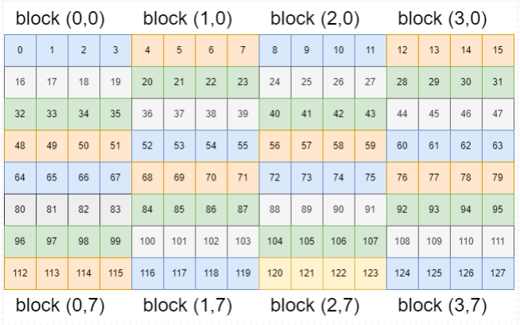

# 0

## windows的WSL安装Ubuntu

> [Windows通过WSL安装Ubuntu以及深度学习配置](https://blog.csdn.net/qq_40102732/article/details/134992151)
>
> [windows卸载wsl下的ubuntu](https://blog.csdn.net/qq_43779149/article/details/130447527)
>
> intel集成显卡不能使用cuda，所以使用WSL和虚拟机都不能支持CUDA

打开cmd终端（管理员身份）

默认安装方式：

* 该方式安装的是最新的ubuntu,不推荐

```
wsl --install
```

查看wsl版本

* wsl1、wsl2两个版本

```
wsl --list --verbose
```

卸载已经安装的版本

* Ubuntu是设备上安装的ubuntu名称

```
wsl --unregister Ubuntu
```

查看设备中安装的Ubuntu名称

```
wsl --list
```

选择可安装的Ubuntu版本

```
wsl.exe --list --online
```


安装指定的版本

```
wsl.exe --install Ubuntu-18.04
```

将系统安装转移到E盘上（默认安装是在C盘的）

* 打包

```
wsl --export Ubuntu-18.04 e:\wsl-ubuntu18.04.tar
```

* 接下来注销原来c盘的Ubuntu18.04,并解压包文件安装在e盘

```
wsl --unregister Ubuntu-18.04  # 注销
wsl --import Ubuntu-18.04 e:\wsl-ubuntu18.04 e:\wsl-ubuntu18.04.tar --version 2
```


# 1.2

##  CUDA下载安装

> 系统：Ubuntu18.04
>
> CUDA：11.6
>
> 下载地址：https://developer.nvidia.com/cuda-11-6-0-download-archive
>
> 注意：在虚拟机的ubuntu上是不能使用的，因为不能识别显卡

下载：


安装：

> [【Linux】什么是.bashrc，以及其使用方法](https://blog.csdn.net/weixin_57208584/article/details/135868555)

1. 添加环境变量

```shell
vi ~/.bashrc
```

* 文件末尾添加内容如下：
  * 安装的是什么版本号11.6就对应改成什么版本号


```shell
# config cuda
export LD_LABRARY_PATH=$LD_LIBRARY_PATH:/usr/local/cuda-11.6/lib64
export PATH=$PATH:/usr/local/cuda-11.6/bin
export CUDA HOME=$CUDA_HOME:/usr/local/cuda-11.6
export PATH=/usr/local/cuda/bin:$PATH
```

2. 环境变量立即生效

```shell
source ~/.bashrc
```

3. 检查是否安装成功

```shell
nvcc -V

# 成功返回
chuckie@ubuntu:/home/chuckie/WCUDA$ nvcc -V
nvcc: NVIDIA (R) Cuda compiler driver
Copyright (c) 2005-2021 NVIDIA Corporation
Built on Fri_Dec_17_18:16:03_PST_2021
Cuda compilation tools, release 11.6, V11.6.55 #11.6即版本号
Build cuda_11.6.r11.6/compiler.30794723_0
```

使用：

```c++
#include <stdio.h>

__global__ void hello_from_gpu()
{
    printf("Hello World from the the GPU\n");
}


int main(void)
{
    hello_from_gpu<<<4, 4>>>(); // 4*4  16线程执行
    cudaDeviceSynchronize();    // 同步  cpu与gpu同步

    return 0;
}
```

* 编译

```
nvcc test.cu -o test
```

* 执行

```
./test
```


#  1.3

##  nvidia-smi

> [CUDA版本和驱动版本对照表2023（包含CUDA12）](https://blog.csdn.net/c2793/article/details/134143566?ops_request_misc=&request_id=&biz_id=102&utm_term=CUDA%E9%A9%B1%E5%8A%A8%E5%8F%8ACUDA%20Toolkita%E7%89%88%E6%9C%AC%E5%AF%B9%E5%BA%94%E8%A1%A8&utm_medium=distribute.pc_search_result.none-task-blog-2~all~sobaiduweb~default-2-134143566.142^v100^pc_search_result_base4&spm=1018.2226.3001.4187)
>
> [Ubuntu 如何根据NVIDIA显卡型号确定对应的显卡驱动版本并安装](https://blog.csdn.net/str1ngthen/article/details/133792936?spm=1001.2014.3001.5501)
>
> [Ubuntu 安装CUDA](https://blog.csdn.net/str1ngthen/article/details/133793250)
>
> 注意：虚拟机的ubuntu是不行的，因为不能识别显卡

本教程使用的cuda版本：CUDA 11.6 Update 1


nvidia-smi参数说明


查询gpu详细信息

```
查询GPU详细信息 nvidia-smi -q
查询特定GPU详细信息 nvidia-smi -q -i 0 //查看0号GPU
显示GPU特定信息 nvidia-smi-q -i 0 -d MEMORY //查看0号GPU的内存大小
帮助命令 nvidia-smi -help
```


## 安装显卡驱动

> [Ubuntu 如何根据NVIDIA显卡型号确定对应的显卡驱动版本并安装](https://blog.csdn.net/str1ngthen/article/details/133792936?spm=1001.2014.3001.5501)

查看gpu信息

> [lspci详解](https://blog.csdn.net/weixin_38452632/article/details/136633239)

```
lspci | grep -e VGA
```

查看驱动列表

```
ubuntu-drivers devices
```


* 如果没有显示nvidia相关驱动列表，请检查显卡设置是否完整

* 可以看到这里推荐安装nvidia-driver-470，因此我们直接运行指令进行安装（***recommend：建议、推荐***）：

安装驱动

```
sudo apt install nvidia-driver-470  #安装470驱动
```

然后重启计算机

````
sudo reboot
````

##  ubuntu安装g++

Ubuntu下载g++:
```
sudo apt-get install g++
```

##  nvcc fatal错误

`nvcc-V` 和`nvidia-smi`都正常，但是编译出现如下错误

```
wangyj@node29:~/cuda$ nvcc test.cu -o test
nvcc fatal   : Path to libdevice library not specified
```

还是环境变量没有设置好

按如下在`~/.bashrc`设置

* cuda-11.6改成nvcc -V显示的正确版本

```shell
# config cuda
export LD_LABRARY_PATH=$LD_LIBRARY_PATH:/usr/local/cuda-11.6/lib64
export PATH=$PATH:/usr/local/cuda-11.6/bin
export CUDA HOME=$CUDA_HOME:/usr/local/cuda-11.6
export PATH=/usr/local/cuda/bin:$PATH
```

#  2.2

##  核函数

编程中通过核函数来启动GPU

注意事项：

1、核函数只能访问GPU内存

* GPU使用自己的显存，CPU使用自己的内存，它们之间互相不可直接访问，需要通过PCI总线交互

2、核函数不能使用变长参数

3、核函数不能使用静态变量

4、核函数不能使用函数指针

5、核函数具有异步性

* 核函数只是启动GPU执行，CPU不会等待GPU执行完成，需要等待

6、核函数不支持C++的iostream

* 需要使用printf

```cpp
#include <stdio.h>

// __global__ : 核函数的标识
__global__ void hello_from_gpu()
{
    printf("Hello World from the the GPU\n");
}


int main(void)
{
    // 第一个1设置线程块的个数，第二个1设置一个线程块中线程的个数
    hello_from_gpu<<<1, 1>>>();
    // 主机与设备同步（主机就是CPU,设备就是GPU，CPU等待GPU执行完成）
    cudaDeviceSynchronize();

    return 0;
}
```

#  2.3

##  线程模型

> 参考ppt

###  一维

一个核函数的调用对应于一个网格（grid）


```cpp
#include <stdio.h>

__global__ void hello_from_gpu()
{
    const int bid = blockIdx.x; // 当前块id
    const int tid = threadIdx.x; // 当前线程在当前块中的id

    const int id = threadIdx.x + blockIdx.x * blockDim.x; // 当前线程id
    printf("Hello World from block %d and thread %d, global id %d\n", bid, tid, id);
}


int main(void)
{
    hello_from_gpu<<<2, 4>>>();
    cudaDeviceSynchronize();

    return 0;
}

// 打印
Hello World from block 0 and thread 0, global id 0
Hello World from block 0 and thread 1, global id 1
Hello World from block 0 and thread 2, global id 2
Hello World from block 0 and thread 3, global id 3
Hello World from block 1 and thread 0, global id 4
Hello World from block 1 and thread 1, global id 5
Hello World from block 1 and thread 2, global id 6
Hello World from block 1 and thread 3, global id 7
```

###  多维

> 注意:内建变量(blockldx、threadldx、gridDim、blockDim)只在核函数有效，且无需定义!
>
> 多维网格和多维线程块本质是一维的，GPU物理上不分块。

1、CUDA可以组织三维的网格和线程块，
2、blockldx和threadldx是类型为uint3（无符号int）的变量，该类型是一个结构体，具有x,y,z三个成员(3个
成员都为无符号类型的成员构成)

```c++
blockldx.x
blockldx.y
blockIdx.z
    
threadldx.x
threadldx.y
threadldx.z
```

3、gridDim和blockDim是类型为dim3的变量，该类型是一个结构体，具有x,y,z三个成员

```c++
gridDim.x
gridDim.y
gridDim.z
    
blockDim.x
blockDim.y
blockDim.z
```

4、取值范围

```c++
blockldx.x范围------------[0, gridDim.x-1]
blockldx.y范围------------[0, gridDim.y-1]
blockldx.z范围------------[0, gridDim.z-1]
    
threadldx.x范围-----------[0, blockDim.x-1]
threadldx.y范围-----------[0, blockDim.y-1]
threadldx.z范围-----------[0, blockDim.z-1]
```

参数说明

```c++
<<<grid_size,block_size>>>
grid_size---------------->gridDim.x
block_size--------------->blockDim.x
    
gridDim和blockDim没有指定的维度默认为1:
gridDim.x = grid_size
gridDim.y = 1
gridDim.z = 1
blockDim.x= block_size
blockDim.y= 1
blockDim.z= 1
```

多维定义

```c++
// 定义多维网格和线程块(c++构造函数语法)
dim3 grid_size(Gx, Gy, Gz);
dim3 block_size(Bx, By, Bz);
// 举个例子,定义一个 2x2x1的网格，5x3x1的线程块，代码中定义如下
dim3 grid_size(2, 2); //等价于dim3 grid_size(2,2,1);
dim3 block_size(5,3); //等价于dim3 block_size(5,3,1);
```

网格和线程块的限制条件

```c++
网格大小限制:
gridDim.x 最大值--------2^31-1
gridDim.y 最大值--------2^16-1
gridDim.z 最大值--------2^16-1
    
线程块大小限制:
blockDim.x 最大值-----------1024
blockDim.y 最大值-----------1024
blockDim.z 最大值-----------64
注意:线程块总的大小最大为1024!!!
```

#  2.4

##  线程全局索引计算方式

```c++
一维Grid 一维Block:
int blockid = blockIdx.x;
int threadid = threadIdx.x;
int id = blockIdx.x *blockDim.x + threadIdx.x;
一维Grid 二维Block:
int blockid = blockIdx.x;
int threadid = threadIdx.y* blockDim.x + threadIdx.x
int id = blockIdx.x* blockDim.x* blockDim.y + threadIdx.y* blockDim.x + threadIdx.x;
一维Grid 三维Block
int blockid = blockIdx.x;
int threadid = threadIdx.z*threadDim.y*threadDim.x + threadIdx.y*threadDim.x + threadIdx.x;
int id = blockIdx.x*blockDim.x* blockDim.y* blockDim.z
         + threadIdx.z *blockDim.y* blockDim.x
         + threadIdx.y* blockDim.x + threadIdx.x;

二维Grid 一维Block:
int blockid = blockIdx.y* gridDim.x + blockIdx.x;
int id = blockid * blockDim.x + threadIdx.x;
二维Grid 二维Block:
int blockid = blockIdx.y* gridDim.x + blockIdx.x;
int id = blockid * (blockDim.x* blockDim.y)+ (threadIdx.y* blockDim.x)+ threadIdx.x;
二维Grid 三维Block
int blockid = blockIdx.y* gridDim.x + blockIdx.x;
int id = blockid * (blockDim.x* blockDim.y* blockDim.z)
         +(threadIdx.z*(blockDim.x* blockDim.y))
         +(threadIdx.y* blockDim.x)+ threadIdx.x;

三维Grid 一维Block:
int blockid = blockIdx.x+ blockIdx.y * gridDim.x+ gridDim.x* gridDim.y* blockIdx.z;
int id = blockid * blockDim.x + threadIdx.x;
三维Grid 二维Block:
int blockid = blockIdx.x+ blockIdx.y * gridDim.x+ gridDim.x* gridDim.y* blockIdx.z;
int id = blockid *(blockDim.x* blockDim.y)+ (threadIdx.y* blockDim.x)+ threadIdx.x;
三维Grid 三维Block
int blockid = blockIdx.x+ blockIdx.y * gridDim.x+ gridDim.x* gridDim.y* blockIdx.z;
int id= blockid *(blockDim.x*blockDim.y* blockDim.z)
       +(threadIdx.z*(blockDim.x* blockDim.y))
       +(threadIdx.y* blockDim.x)+ threadIdx.x;
```

#  2.5

##  nvcc编译流程与GPU计算能力
###  nvcc编译流程

> 官方文档：[1. Introduction — NVIDIA CUDA Compiler Driver 12.4 documentation](https://docs.nvidia.com/cuda/cuda-compiler-driver-nvcc/index.html)

1、nvcc分离全部源代码为:(1)主机代码(2)设备代码

2、主机(Host)代码是C/C++语法，设备(device)代码是C/C++扩展语言编写

3、nvcc先将设备代码编译为PTX(Parallel Thread Execution)伪汇编代码，再将PTX代码编译为二进制的cubin目标代码

4、在将源代码编译为 PTX 代码时，需要用选项`-arch=compute_XY`指定一个虚拟架构的计算能力用以确定代码中能够使用的CUDA功能

5、在将PTX代码编译为cubin代码时，需要用选项`-code=sm_ZW`指定一个真实架构的计算能力，用以确定可执行文件能够使用的GPU

###  PTX

> 官方文档：[1. Introduction — PTX ISA 8.4 documentation (nvidia.com)](https://docs.nvidia.com/cuda/parallel-thread-execution/index.html)

1、PTX(Parallel Thread Execution)是CUDA平台为基于GPU的通用计算而定义的虚拟机和指令集

2、nvcc编译命令总是使用两个体系结构:一个是虚拟的中间体系结构，另一个是实际的GPU体系结构

3、虚拟架构更像是对应用所需的GPU功能的声明

4、虚拟架构应该尽可能选择低---适配更多实际GPU；真实架构应该尽可能选择高---充分发挥GPU性能


###  GPU架构与计算能力

1、每款GPU都有用于标识“计算能力”(compute capability的版本号

2、形式X.Y，X标识主版本号，Y表示次版本号


并非GPU的计算能力越高，性能就越高

* 性能与计算能力，显存容量，显存带宽，浮点数运算峰值都有关


#  2.6

##  CUDA程序兼容性问题

###  指定虚拟架构计算能力
1、C/C++源码编译为PTX时，可以指定虚拟架构的计算能力，用来确定代码中能够使用的CUDA功能

2、C/C++源码转化为PTX这一步骤与GPU硬件无关

3、编译指令(指定虚拟架构计算能力）：

```shell
-arch=compute_XY
XY:第一个数字X代表计算能力的主版本号，第二个数字Y代表计算能力的次版本号
```

4、PTX的指令只能在更高的计算能力的GPU使用

* 指定的虚拟计算能力大于设备的GPU实际计算能力 则不能正常调用GPU（编译可通过，CPU部分可执行，但是核函数不会执行）

```c++
// 例如:
nvcc helloworld.cu -o helloworld -arch=compute_61
// 编译出的可执行文件helloworld可以在计算能力>=6.1的GPU上面执行，在计算能力小于6.1的GPU则不能执行GPU相关部分
```

###  指定真实架构计算能力
1、PTX指令转化为二进制cubin代码与具体的GPU架构有关

2、编译指令(指定真实架构计算能力)：

```shell
-code=sm_XY
XY:第一个数字X代表计算能力的主版本号，第二个数字Y代表计算能力的次版本号
```

3、注意:

* 二进制cubin代码，大版本之间不兼容!!!
* 指定真实架构计算能力的时候必须指定虚拟架构计算能力!!!
  * 否则编译直接报错
* 指定的真实架构能力必须大于或等于虚拟架构能力!!!

```c++
// 真实架构能力小于虚拟架构能力 编译不通过 编译出错
nvcc helloworld.cu -o helloworld -arch=compute_61 -code=sm_60
```

4、真实架构可以实现低小版本到高小版本的兼容!

* 若本机GPU实际计算能力为61

* 按60（低肖版本）编译可以支持60，61（高小版本）
* 按62编译则不能支持60，61

###  指定多个GPU版本编译
1、使得编译出来的可执行文件可以在多GPU中执行

2、同时指定多组计算能力:

```c++
// 编译选项
-gencode arch=compute_XY,code=sm_XY
// 例如:
-gencode arch=compute_35,code=sm_35 // 开普勒架构
-gencode arch=compute_50,code=sm_50 // 麦克斯韦架构
-gencode arch=compute_60,code=sm_60 // 帕斯卡架构
-gencode arch=compute_70,code=sm_70 // 伏特架构
```

3、编译出的可执行文件包含4个二进制版本，生成的可执行文件称为胖二进制文件(fatbinary)

4、注意:

* 执行上述指令必须CUDA版本支持7.0计算能力，否则会报错
  * 注意是CUDA版本，本机是11.6

* 过多指定计算能力，会增加编译时间和可执行文件的大小

###  nvcc即时编译

> 使用场景：本机的GPU是帕斯卡（X=6版本），若在本本机编译，则编译的可执行文件不能在最新的安培（X=8版本）上执行，所以可以将ptx嵌入到可执行文件中，当在安培（X=8版本）上执行时，会即时将嵌入的ptx编译成可在安培（X=8版本）上执行的可执行文件并执行。该方式不能有效发挥安培（X=8版本）的性能。

1、在运行可执行文件时，从保留的PTX代码临时编译出cubin文件

2、在可执行文件中保留PTX代码，nvcc编译指令指定所保留的PTX代码虚拟架构

```c++
// 指令:
-gencode arch=compute_XY,code=compute_XY
// 注意:
// (1)两个计算能力都是虚拟架构计算能力
// (2)两个虚拟架构计算能力必须一致

// 例如:

-gencode=arch=compute_35,code=sm_35
-gencode=arch=compute_50,code=sm_50
-gencode=arch=compute_61,code=sm_61
-gencode=arch=compute_61,code=compute_61  // 这一步才是即时编译
// 简化:
-arch=sm_XY
// 等价于 
-gencode=arch=compute_61,code=sm_61
-gencode=arch=compute_61,code=compute_61
```


###  nvcc编译默认计算能力
不同版本CUDA编译器在编译CUDA代码时，都有一个默认计算能力

* CUDA6.0及更早版本:  默认计算能力1.0
* CUDA 6.5~CUDA 8.0: 默认计算能力2.0
* CUDA 9.0~CUDA 10.2: 默认计算能力3.0
* CUDA 11.6: 默认计算能力5.2


查看本机CUDA编译默认支持的计算能力

```cpp
nvcc test.cu -ptx  // 生成test.ptx
cat test.ptx
// 文件中可以看到
// .target sm_52  表示默认支持计算能力5.2
```


#  3.1

##  CUDA矩阵加法运算程序

###  CUDA程序基本框架


###  设置GPU设备

1、获取GPU设备数量

* `__host__`表示可以在主机（CPU）中调用
* `__device__`表示可以在设备（GPU）中调用
* `cudaError_t`返回错误代码（是否成功）

```c++
int iDeviceCount=0; // 接受返回的GPU数量  若返回为0则表示没有GPU
cudaGetDeviceCount(&iDeviceCount);
```


2、设置GPU执行时使用的设备

* 只有`__host__`所以该函数只能在主机中使用

```c++
int iDev=0; // 0表示设置使用第0块GPU
cudaSetDevice(iDev);
```


###  内存管理

CUDA通过内存分配、数据传递、内存初始化、内存释放进行内存管理


####  内存分配

* 主机分配内存:

```c++
// 定义
extern void *malloc(unsigned int num_bytes);
// 使用
float *fpHost_A;
fpHost_A=(float *)malloc(nBytes);
```

* 设备分配内存:

```c++
float *fpDevice_A;
cudaMalloc((float**)&fpDevice_A,nBytes); // 注意是二级指针传入
```


####  数据拷贝

* 主机数据拷贝:

```c++
// 定义
void *memcpy(void *dest, const void *src, size tn); // src:源地址，dest：目标地址，tn:拷贝的字节数
// 使用
memcpy((void*)d,(void*)s, nBytes);
```

* 设备数据拷贝:

```c++
cudaMemcpy(Device_A, Host_A, nBytes, cudaMemcpyHostToHost);

kind:
cudaMemcpyHostToHost     主机->主机
cudaMemcpyHostToDevice   主机->设备
cudaMemcpyDeviceToHost   设备->主机
cudaMemcpyDeviceToDevice 设备->设备
cudaMemcpyDefault        默认方式只允许在支持统一虚拟寻址的系统上使用,自动识别以上四种情况之一
```


####  内存初始化

* 主机内存初始化

```c++
// 定义
void*memset(void *str,int c, size tn);
// 使用
memset(fpHost_A,0,nBytes);
```

* 设备内存初始化

```c++
cudaMemset(fpDevice_A,0,nBytes);
```


####  内存释放

* 释放主机内存

```c++
free(pHost_A);
```

* 释放设备内存

```c++
cudaFree(pDevice_A);
```


###  自定义设备函数
1、设备函数(device function)

(1)定义只能执行在GPU设备上的函数为设备函数

(2)设备函数只能被核函数或其他设备函数调用

(3)设备函数用`__device__`修饰

2、核函数(kernel function)

(1)用`__global__`修饰的函数称为核函数，一般由主机调用，在设备中执行

(2)`__global__`修饰符既不能和`__host__`同时使用，也不可与`__device__`同时使用

3、主机函数(host function)

(1)主机端的普通 C++函数可用`__host__`修饰

(2)对于主机端的函数,`__host__`修饰符可省略

(3)可以用`__host__`和`__device__`同时修饰一个函数减少冗余代码。编译器会针对主机和设备分别编译该函数。


#  3.2

##  CUDA错误检测

###  一、运行时API错误代码

**CUDA**运行时**API**大多支持返回错误代码，返回值类型为**cudaError_t**，**CUDA**运行时**API**成功执行，返回的错误代码为**cudaSuccess**，运行时**API**返回的执行状态值是枚举变量。

下图展示了部分**CUDA**运行时**API**错误代码的枚举变量：


###  二、错误检查函数

一些内存管理和**GPU**设置的**CUDA**运行时**API**函数，包括设备内存分配函数**cudaMalloc**、获取**GPU**数量的函数**cudaGetDeviceCount**。每一个函数都有类型为**cudaError_t**的返回值，返回一个枚举变量的错误代码。

####  1、涉及的运行时API函数介绍

（1）获取错误代码对应名称—**cudaGetErrorName**

文档说明：


作用：

返回错误代码对应的名称，\_\_**host**\_\_和\_\_**device**\_\_代表该运行时**API**可以运行在主机，也可以运行在设备。这个运行时**API**函数与前面我们介绍的都不一样，它的返回值是**char \***，返回一个字符串，传入的参数是**cudaError_t**类型的错误代码。比如我们假设函数返回的错误代码为**1**，运行**cudaGetErrorName**函数将返回字符串“**cudaErrorInvalidValue**”。

（2）获取错误代码描述信息—**cudaGetErrorString**

文档说明：


作用：

返回错误代码对应的描述信息，同**cudaGetErrorName**，\_\_**host**\_\_和\_\_**device**\_\_代表该运行时**API**可以运行在主机，也可以运行在设备。它的返回值是**char \***，返回一个字符串，传入的参数是**cudaError_t**类型的错误代码。比如我们假设函数返回的错误代码为**1**，运行**cudaGetErrorName**函数将返回字符串“**invalid argument**”。

#### 2、代码解析

我们把错误检测函数定义在命名为**tools/common.cuh**的文件中，今后所有通用工具类的代码，我们都会放在这个文件内，代码展示：

```cpp
#pragma once
#include <stdlib.h>
#include <stdio.h>

cudaError_t ErrorCheck(cudaError_t error_code, const char* filename, int lineNumber)
{
    if (error_code != cudaSuccess)
    {
        printf("CUDA error:\r\ncode=%d, name=%s, description=%s\r\nfile=%s, line%d\r\n",
                error_code, cudaGetErrorName(error_code), cudaGetErrorString(error_code), filename, lineNumber);
        return error_code;
    }
    return error_code;
}
```
调用错误检测函数：
```cpp
cudaError_t error = ErrorCheck(cudaSetDevice(iDev), __FILE__, __LINE__);
```
解析：

1. 预处理指令#**pragma once**确保当前文件在一个编译单元不被重复包含**CUDA**。
2. 调用错误检查函数时，**ErrorCheck**函数的第一个参数是可以返回错误代码的**CUDA**运行时**API**函数，\_\_**FILE**\_\_和\_\_**LINE**\_\_是**cpp**预先定义的标识符，\_\_**FILE**\_\_用于指示本行语句所在源文件的文件名，\_\_**LINE**\_\_用于指示本行语句在源文件中的位置信息。
3. 代码中**if**语句是用来判断待检测的运行时**API**函数是否发生错误，**error_code==cudaSuccess**则代表待检测的运行时**API**函数没有发生错误。只有发生错误时才会打印错误信息，报告错误代码、错误代码名字，错误代码文字描述、所在文件名字和发生错误行数。
4. 错误代码函数会返回待检测运行时**API**函数的**cudaError_t**类型的错误代码。

#### 3、实例演示

这是一个运行时API函数有书写错误的代码，用于错误检测函数检测实验。代码的第**24**行，**cudaMemcpy**函数用于主机向设备拷贝数据，**kind**参数应该设置为**cudaMemcpyHostToDevice**，但是我故意将**kind**参数设置成**cudaMemcpyDeviceToHost**，数据传输方向有误。

```cpp

#include <stdio.h>
#include "../tools/common.cuh"


int main(void)
{
    // 1、分配主机内存，并初始化
    float *fpHost_A;
    fpHost_A = (float *)malloc(4);
    memset(fpHost_A, 0, 4);  // 主机内存初始化为0
    
    float *fpDevice_A;
    cudaError_t error = ErrorCheck(cudaMalloc((float**)&fpDevice_A, 4), __FILE__, __LINE__);
    cudaMemset(fpDevice_A, 0, 4);  // 设备内存初始化为0

    // 2、数据从主机复制到设备
    ErrorCheck(cudaMemcpy(fpDevice_A, fpHost_A, 4, cudaMemcpyDeviceToHost), __FILE__, __LINE__); 
    
    // 3、释放主机与设备内存
    free(fpHost_A);  
    ErrorCheck(cudaFree(fpDevice_A), __FILE__, __LINE__);
    
    ErrorCheck(cudaDeviceReset(), __FILE__, __LINE__);
    return 0;
}
```

运行结果：

CUDA error:  
code=1, name=cudaErrorInvalidValue, description=invalid argument  
file=errorCheckFunction.cu, line24  

###  三、检查核函数

错误检查函数无法捕捉调用核函数时发生的相关错误，前面也讲到过，核函数的返回值类型时**void**，即核函数不返回任何值。可以通过在调用核函数之后调用**cudaGetLastError()**函数捕捉核函数错误。

####  1、涉及的运行时API函数介绍

获取cuda程序的最后一个错误—**cudaGetLastError**

文档说明：


作用：

返回**CUDA**程序的最后一个错误，\_\_**host**\_\_和\_\_**device**\_\_代表该运行时**API**可以运行在主机，也可以运行在设备。这个运行时**API**函数返回**cudaError_t**类型的错误代码。

#### 2、捕捉核函数错误方法

在调用核函数后，追加如下代码：

```cpp
ErrorCheck(cudaGetLastError(), __FILE__, __LINE__);
ErrorCheck(cudaDeviceSynchronize(), __FILE__, __LINE__);
```
说明：
1. 第一条语句作用是捕捉第二条同步函数之前的最后一个错误。
2. 第二条语句同步主机与设备，因为**CPU**和**GPU**是异构架构。

#### 3、实例演示

这段代码在调用核函数时，设置的线程块线程数量为**2048**个（超过了线程块内线程数量最大值**1024**个），核函数不能被成功调用，代码会发生错误，用于检查核函数的实验。

代码说明：

此代码是数组相加代码，在第**98**行，将线程块大小设置为**2048**，第**101**行执行调用核函数语句，因超出线程块的最大值会导致核函数调用失败，第**102**行捕捉截至第**103**行之前的最后一条错误。

```cpp
#include <stdio.h>
#include "../tools/common.cuh"

__device__ float add(const float x, const float y)
{
    return x + y;
}

__global__ void addFromGPU(float *A, float *B, float *C, const int N)
{
    const int bid = blockIdx.x;
    const int tid = threadIdx.x;
    const int id = tid + bid * blockDim.x; 

    if (id >= N) return;
    C[id] = add(A[id], B[id]);
    
}


void initialData(float *addr, int elemCount)
{
    for (int i = 0; i < elemCount; i++)
    {
        addr[i] = (float)(rand() & 0xFF) / 10.f;
    }
    return;
}


int main(void)
{
    // 1、设置GPU设备
    setGPU();

    // 2、分配主机内存和设备内存，并初始化
    int iElemCount = 4096;                     // 设置元素数量
    size_t stBytesCount = iElemCount * sizeof(float); // 字节数
    
    // （1）分配主机内存，并初始化
    float *fpHost_A, *fpHost_B, *fpHost_C;
    fpHost_A = (float *)malloc(stBytesCount);
    fpHost_B = (float *)malloc(stBytesCount);
    fpHost_C = (float *)malloc(stBytesCount);
    if (fpHost_A != NULL && fpHost_B != NULL && fpHost_C != NULL)
    {
        memset(fpHost_A, 0, stBytesCount);  // 主机内存初始化为0
        memset(fpHost_B, 0, stBytesCount);
        memset(fpHost_C, 0, stBytesCount);
    
    }
    else
    {
        printf("Fail to allocate host memory!\n");
        exit(-1);
    }


    // （2）分配设备内存，并初始化
    float *fpDevice_A, *fpDevice_B, *fpDevice_C;
    cudaMalloc((float**)&fpDevice_A, stBytesCount);
    cudaMalloc((float**)&fpDevice_B, stBytesCount);
    cudaMalloc((float**)&fpDevice_C, stBytesCount);
    if (fpDevice_A != NULL && fpDevice_B != NULL && fpDevice_C != NULL)
    {
        cudaMemset(fpDevice_A, 0, stBytesCount);  // 设备内存初始化为0
        cudaMemset(fpDevice_B, 0, stBytesCount);
        cudaMemset(fpDevice_C, 0, stBytesCount);
    }
    else
    {
        printf("fail to allocate memory\n");
        free(fpHost_A);
        free(fpHost_B);
        free(fpHost_C);
        exit(-1);
    }

    // 3、初始化主机中数据
    srand(666); // 设置随机种子
    initialData(fpHost_A, iElemCount);
    initialData(fpHost_B, iElemCount);
    
    // 4、数据从主机复制到设备
    cudaMemcpy(fpDevice_A, fpHost_A, stBytesCount, cudaMemcpyHostToDevice); 
    cudaMemcpy(fpDevice_B, fpHost_B, stBytesCount, cudaMemcpyHostToDevice); 
    cudaMemcpy(fpDevice_C, fpHost_C, stBytesCount, cudaMemcpyHostToDevice);


    // 5、调用核函数在设备中进行计算
    dim3 block(2048);
    dim3 grid((iElemCount + block.x - 1) / 2048); 

    addFromGPU<<<grid, block>>>(fpDevice_A, fpDevice_B, fpDevice_C, iElemCount);    // 调用核函数
    ErrorCheck(cudaGetLastError(), __FILE__, __LINE__);
    ErrorCheck(cudaDeviceSynchronize(), __FILE__, __LINE__);


    // 6、将计算得到的数据从设备传给主机
    cudaMemcpy(fpHost_C, fpDevice_C, stBytesCount, cudaMemcpyDeviceToHost);
  

    for (int i = 0; i < 10; i++)    // 打印
    {
        printf("idx=%2d\tmatrix_A:%.2f\tmatrix_B:%.2f\tresult=%.2f\n", i+1, fpHost_A[i], fpHost_B[i], fpHost_C[i]);
    }

    // 7、释放主机与设备内存
    free(fpHost_A);
    free(fpHost_B);
    free(fpHost_C);
    cudaFree(fpDevice_A);
    cudaFree(fpDevice_B);
    cudaFree(fpDevice_C);

    cudaDeviceReset();
    return 0;
}
```

执行结果：

The count of GPUs is 1.set GPU 0 for computing.  
***CUDA error:***  
***code=9, name=cudaErrorInvalidConfiguration, description=invalid configurationargument***  
***file=errorCheckKernel.cu, line102***  
idx= 1  matrix_A:0.90   matrix_B:10.90  result=0.00  
idx= 2  matrix_A:19.00  matrix_B:4.00   result=0.00  
idx= 3  matrix_A:15.80  matrix_B:15.00  result=0.00  
idx= 4  matrix_A:5.00   matrix_B:3.30   result=0.00  
idx= 5  matrix_A:11.10  matrix_B:4.20   result=0.00  
idx= 6  matrix_A:23.50  matrix_B:18.60  result=0.00  
idx= 7  matrix_A:20.90  matrix_B:4.50   result=0.00  
idx= 8  matrix_A:23.40  matrix_B:17.70  result=0.00  
idx= 9  matrix_A:16.90  matrix_B:18.40  result=0.00  
idx=10  matrix_A:7.30   matrix_B:18.30  result=0.00  

说明：

看斜体加粗部分，成功捕捉到错误。


#  3.3

##  CUDA计时

### 一、事件记时

####  1、记时代码解析

> **CUDA**事件记时代码如下，只需要将需要记时的代码嵌入记时代码之间：

```cpp
cudaEvent_t start, stop;
ErrorCheck(cudaEventCreate(&start), __FILE__, __LINE__);
ErrorCheck(cudaEventCreate(&stop), __FILE__, __LINE__);
ErrorCheck(cudaEventRecord(start), __FILE__, __LINE__);
cudaEventQuery(start);  //此处不可用错误检测函数

/************************************************************
需要记时间的代码
************************************************************/

ErrorCheck(cudaEventRecord(stop), __FILE__, __LINE__);
ErrorCheck(cudaEventSynchronize(stop), __FILE__, __LINE__);
float elapsed_time;
ErrorCheck(cudaEventElapsedTime(&elapsed_time, start, stop), __FILE__, __LINE__);
printf("Time = %g ms.\n", elapsed_time);

ErrorCheck(cudaEventDestroy(start), __FILE__, __LINE__);
ErrorCheck(cudaEventDestroy(stop), __FILE__, __LINE__);
```

代码解析：

1. 第1行**cudaEvent_t start, stop：**定义两个**CUDA**事件类型（**cudaEvent_t**）的变量；
2. 第2、3行**cudaEventCreate**函数初始化定义的**cudaEvent_t**变量；
3. 第4行通过**cudaEventRecord**函数，在需要记时的代码块之前记录代表时间开始的事件；
4. 第5行**cudaEventQuery**函数在**TCC**驱动模式的**GPU**下可省略，但在处于**WDDM**驱动模式的**GPU**必须保留，因此，我们就一直保留这句函数即可。注意：**cudaEventQuery**函数不可使用错误检测函数；
5. 第8行是需要记时的代码块；
6. 第11行在需要记时的代码块之后记录代表时间结束的事件；
7. 第12行**cudaEventSynchronize**函数作用是让主机等待事件**stop**被记录完毕；
8. 第13~15行**cudaEventElapsedTime**函数的调用作用是计算**cudaEvent_t**变量**start**和**stop**时间差，记录在**float**变量**elapsed_time**中，并输出打印到屏幕上；
9. 第17、18行调用**cudaEventDestroy**函数销毁**start**和**stop**这两个类型为**cudaEvent_t**的**CUDA**事件。

####  2、核函数记时实例演示

> 此代码计算运行核函数10次的平均时间，核函数实际运行**11**次，由于第一次调用核函数，往往会花费更多的时间，如果将第一次记录进去，可能导致记录的时间不准确，因此忽略第一次调用核函数的时间，取**10**次平均值。

```cpp
#include <stdio.h>
#include "../tools/common.cuh"

#define NUM_REPEATS 10

__device__ float add(const float x, const float y)
{
    return x + y;
}

__global__ void addFromGPU(float *A, float *B, float *C, const int N)
{
    const int bid = blockIdx.x;
    const int tid = threadIdx.x;
    const int id = tid + bid * blockDim.x; 
    if (id >= N) return;
    C[id] = add(A[id], B[id]);
    
}


void initialData(float *addr, int elemCount)
{
    for (int i = 0; i < elemCount; i++)
    {
        addr[i] = (float)(rand() & 0xFF) / 10.f;
    }
    return;
}


int main(void)
{
    // 1、设置GPU设备
    setGPU();

    // 2、分配主机内存和设备内存，并初始化
    int iElemCount = 4096;                     // 设置元素数量
    size_t stBytesCount = iElemCount * sizeof(float); // 字节数
    
    // （1）分配主机内存，并初始化
    float *fpHost_A, *fpHost_B, *fpHost_C;
    fpHost_A = (float *)malloc(stBytesCount);
    fpHost_B = (float *)malloc(stBytesCount);
    fpHost_C = (float *)malloc(stBytesCount);
    if (fpHost_A != NULL && fpHost_B != NULL && fpHost_C != NULL)
    {
        memset(fpHost_A, 0, stBytesCount);  // 主机内存初始化为0
        memset(fpHost_B, 0, stBytesCount);
        memset(fpHost_C, 0, stBytesCount);
    
    }
    else
    {
        printf("Fail to allocate host memory!\n");
        exit(-1);
    }


    // （2）分配设备内存，并初始化
    float *fpDevice_A, *fpDevice_B, *fpDevice_C;
    ErrorCheck(cudaMalloc((float**)&fpDevice_A, stBytesCount), __FILE__, __LINE__);
    ErrorCheck(cudaMalloc((float**)&fpDevice_B, stBytesCount), __FILE__, __LINE__);
    ErrorCheck(cudaMalloc((float**)&fpDevice_C, stBytesCount), __FILE__, __LINE__);
    if (fpDevice_A != NULL && fpDevice_B != NULL && fpDevice_C != NULL)
    {
        ErrorCheck(cudaMemset(fpDevice_A, 0, stBytesCount), __FILE__, __LINE__); // 设备内存初始化为0
        ErrorCheck(cudaMemset(fpDevice_B, 0, stBytesCount), __FILE__, __LINE__);
        ErrorCheck(cudaMemset(fpDevice_C, 0, stBytesCount), __FILE__, __LINE__);
    }
    else
    {
        printf("fail to allocate memory\n");
        free(fpHost_A);
        free(fpHost_B);
        free(fpHost_C);
        exit(-1);
    }

    // 3、初始化主机中数据
    srand(666); // 设置随机种子
    initialData(fpHost_A, iElemCount);
    initialData(fpHost_B, iElemCount);
    
    // 4、数据从主机复制到设备
    ErrorCheck(cudaMemcpy(fpDevice_A, fpHost_A, stBytesCount, cudaMemcpyHostToDevice), __FILE__, __LINE__); 
    ErrorCheck(cudaMemcpy(fpDevice_B, fpHost_B, stBytesCount, cudaMemcpyHostToDevice), __FILE__, __LINE__);
    ErrorCheck(cudaMemcpy(fpDevice_C, fpHost_C, stBytesCount, cudaMemcpyHostToDevice), __FILE__, __LINE__);


    // 5、调用核函数在设备中进行计算
    dim3 block(32);
    dim3 grid((iElemCount + block.x - 1) / 32);

    float t_sum = 0;
    for (int repeat = 0; repeat <= NUM_REPEATS; ++repeat)
    {
        cudaEvent_t start, stop;
        ErrorCheck(cudaEventCreate(&start), __FILE__, __LINE__);
        ErrorCheck(cudaEventCreate(&stop), __FILE__, __LINE__);
        ErrorCheck(cudaEventRecord(start), __FILE__, __LINE__);
        cudaEventQuery(start);  //此处不可用错误检测函数

        addFromGPU<<<grid, block>>>(fpDevice_A, fpDevice_B, fpDevice_C, iElemCount);    // 调用核函数

        ErrorCheck(cudaEventRecord(stop), __FILE__, __LINE__);
        ErrorCheck(cudaEventSynchronize(stop), __FILE__, __LINE__);
        float elapsed_time;
        ErrorCheck(cudaEventElapsedTime(&elapsed_time, start, stop), __FILE__, __LINE__);
        // printf("Time = %g ms.\n", elapsed_time);

        if (repeat > 0)
        {
            t_sum += elapsed_time;
        }

        ErrorCheck(cudaEventDestroy(start), __FILE__, __LINE__);
        ErrorCheck(cudaEventDestroy(stop), __FILE__, __LINE__);
    }

    const float t_ave = t_sum / NUM_REPEATS;
    printf("Time = %g ms.\n", t_ave);

    // 6、将计算得到的数据从设备传给主机
    ErrorCheck(cudaMemcpy(fpHost_C, fpDevice_C, stBytesCount, cudaMemcpyDeviceToHost), __FILE__, __LINE__);

    // 7、释放主机与设备内存
    free(fpHost_A);
    free(fpHost_B);
    free(fpHost_C);
    ErrorCheck(cudaFree(fpDevice_A), __FILE__, __LINE__);
    ErrorCheck(cudaFree(fpDevice_B), __FILE__, __LINE__);
    ErrorCheck(cudaFree(fpDevice_C), __FILE__, __LINE__);

    ErrorCheck(cudaDeviceReset(), __FILE__, __LINE__);
    return 0;
}
```

对第103~129行代码进行说明：

1. 第111行为调用核函数代码，它包含在我们前文所描述的记录时间代码之间；
2. 第119~122行，作用是计算除了第一次调用核函数的时间外，其它**10**次调用核函数的时间和；
3. 第128、129行，计算**10**次调用核函数平均值，并打印输出。

###  二、nvprof性能刨析

#### 1、nvprof工具说明

> **CUDA** **5.0**后有一个工具叫做**nvprof**的命令行分析工具，**nvprof**是一个可执行文件。
>
> 如下执行命令语句，其中**exe_name**为可执行文件的名字。

```bash
nvprof ./exe_name
```

####  2、nvprof实例演示

代码如下：

```cpp
#include <stdio.h>
#include "../tools/common.cuh"

#define NUM_REPEATS 10

__device__ float add(const float x, const float y)
{
    return x + y;
}

__global__ void addFromGPU(float *A, float *B, float *C, const int N)
{
    const int bid = blockIdx.x;
    const int tid = threadIdx.x;
    const int id = tid + bid * blockDim.x; 
    if (id >= N) return;
    C[id] = add(A[id], B[id]);
    
}


void initialData(float *addr, int elemCount)
{
    for (int i = 0; i < elemCount; i++)
    {
        addr[i] = (float)(rand() & 0xFF) / 10.f;
    }
    return;
}


int main(void)
{
    // 1、设置GPU设备
    setGPU();

    // 2、分配主机内存和设备内存，并初始化
    int iElemCount = 4096;                     // 设置元素数量
    size_t stBytesCount = iElemCount * sizeof(float); // 字节数
    
    // （1）分配主机内存，并初始化
    float *fpHost_A, *fpHost_B, *fpHost_C;
    fpHost_A = (float *)malloc(stBytesCount);
    fpHost_B = (float *)malloc(stBytesCount);
    fpHost_C = (float *)malloc(stBytesCount);
    if (fpHost_A != NULL && fpHost_B != NULL && fpHost_C != NULL)
    {
        memset(fpHost_A, 0, stBytesCount);  // 主机内存初始化为0
        memset(fpHost_B, 0, stBytesCount);
        memset(fpHost_C, 0, stBytesCount);
    
    }
    else
    {
        printf("Fail to allocate host memory!\n");
        exit(-1);
    }


    // （2）分配设备内存，并初始化
    float *fpDevice_A, *fpDevice_B, *fpDevice_C;
    ErrorCheck(cudaMalloc((float**)&fpDevice_A, stBytesCount), __FILE__, __LINE__);
    ErrorCheck(cudaMalloc((float**)&fpDevice_B, stBytesCount), __FILE__, __LINE__);
    ErrorCheck(cudaMalloc((float**)&fpDevice_C, stBytesCount), __FILE__, __LINE__);
    if (fpDevice_A != NULL && fpDevice_B != NULL && fpDevice_C != NULL)
    {
        ErrorCheck(cudaMemset(fpDevice_A, 0, stBytesCount), __FILE__, __LINE__); // 设备内存初始化为0
        ErrorCheck(cudaMemset(fpDevice_B, 0, stBytesCount), __FILE__, __LINE__);
        ErrorCheck(cudaMemset(fpDevice_C, 0, stBytesCount), __FILE__, __LINE__);
    }
    else
    {
        printf("fail to allocate memory\n");
        free(fpHost_A);
        free(fpHost_B);
        free(fpHost_C);
        exit(-1);
    }

    // 3、初始化主机中数据
    srand(666); // 设置随机种子
    initialData(fpHost_A, iElemCount);
    initialData(fpHost_B, iElemCount);
    
    // 4、数据从主机复制到设备
    ErrorCheck(cudaMemcpy(fpDevice_A, fpHost_A, stBytesCount, cudaMemcpyHostToDevice), __FILE__, __LINE__); 
    ErrorCheck(cudaMemcpy(fpDevice_B, fpHost_B, stBytesCount, cudaMemcpyHostToDevice), __FILE__, __LINE__);
    ErrorCheck(cudaMemcpy(fpDevice_C, fpHost_C, stBytesCount, cudaMemcpyHostToDevice), __FILE__, __LINE__);


    // 5、调用核函数在设备中进行计算
    dim3 block(32);
    dim3 grid((iElemCount + block.x - 1) / 32);

    addFromGPU<<<grid, block>>>(fpDevice_A, fpDevice_B, fpDevice_C, iElemCount);    // 调用核函数

    // 6、将计算得到的数据从设备传给主机
    ErrorCheck(cudaMemcpy(fpHost_C, fpDevice_C, stBytesCount, cudaMemcpyDeviceToHost), __FILE__, __LINE__);

    // 7、释放主机与设备内存
    free(fpHost_A);
    free(fpHost_B);
    free(fpHost_C);
    ErrorCheck(cudaFree(fpDevice_A), __FILE__, __LINE__);
    ErrorCheck(cudaFree(fpDevice_B), __FILE__, __LINE__);
    ErrorCheck(cudaFree(fpDevice_C), __FILE__, __LINE__);

    ErrorCheck(cudaDeviceReset(), __FILE__, __LINE__);
    return 0;
}
```

假定生成可执行文件为**nvprofAnalysis**，执行：

```bash
nvprof ./nvprofAnalysis
```

执行结果：


主要看**GPU activities**：

1. [CUDA memcpy HtoD]：主机向设备拷贝数据花费时间占比44.98%；
2. [CUDA memset]：设备调用cudaMemset函数初始化数据占用时间占比23.76%；
3. 核函数执行占比为18.81%；
4. [CUDA memcpy DtoH]：设备向主机拷贝数据花费时间占比12.14%；


#  3.4

##  运行时GPU信息查询

###  一、运行时API查询GPU信息

####  1、涉及的运行时API函数介绍

下图为获取**GPU**运行时信息的**CUDA**运行时**API**函数：


作用：

1. 参数传入：1、事先定义的**cudaDeviceProf**类型的变量 2、计算机**GPU**的索引号；
2. 该函数只能在主机中调用；

####  2、实例演示

> 通过调用**cudaGetDeviceProperties**运行时**API**打印设备信息：

```cpp
#include "../tools/common.cuh"
#include <stdio.h>

int main(void)
{
    int device_id = 0;
    ErrorCheck(cudaSetDevice(device_id), __FILE__, __LINE__);

    cudaDeviceProp prop;
    ErrorCheck(cudaGetDeviceProperties(&prop, device_id), __FILE__, __LINE__);

    printf("Device id:                                 %d\n",
        device_id);
    printf("Device name:                               %s\n",
        prop.name);
    printf("Compute capability:                        %d.%d\n",
        prop.major, prop.minor);
    printf("Amount of global memory:                   %g GB\n",
        prop.totalGlobalMem / (1024.0 * 1024 * 1024));
    printf("Amount of constant memory:                 %g KB\n",
        prop.totalConstMem  / 1024.0);
    printf("Maximum grid size:                         %d %d %d\n",
        prop.maxGridSize[0], 
        prop.maxGridSize[1], prop.maxGridSize[2]);
    printf("Maximum block size:                        %d %d %d\n",
        prop.maxThreadsDim[0], prop.maxThreadsDim[1], 
        prop.maxThreadsDim[2]);
    printf("Number of SMs:                             %d\n",
        prop.multiProcessorCount);
    printf("Maximum amount of shared memory per block: %g KB\n",
        prop.sharedMemPerBlock / 1024.0);
    printf("Maximum amount of shared memory per SM:    %g KB\n",
        prop.sharedMemPerMultiprocessor / 1024.0);
    printf("Maximum number of registers per block:     %d K\n",
        prop.regsPerBlock / 1024);
    printf("Maximum number of registers per SM:        %d K\n",
        prop.regsPerMultiprocessor / 1024);
    printf("Maximum number of threads per block:       %d\n",
        prop.maxThreadsPerBlock);
    printf("Maximum number of threads per SM:          %d\n",
        prop.maxThreadsPerMultiProcessor);

    return 0;
}
```

输出：


说明：

1. Device id:  计算机中GPU的设备代号；
2. Device name:  显卡名字，我的显卡是Tesla P100-PCIE-16GB；
3. Compute capability: GPU计算能力，我的主版本是6，次版本是0；
4. Amount of global memory: 显卡显存大小，我的是4G的显存；
5. Amount of constant memory: 常量内存大小；
6. Maximum grid size:  最大网格大小（三个维度分别的最大值）；
7. Maximum block size:   最大线程块大小（三个维度分别的最大值）；
8. Number of SMs:  流多处理器数量；
9. Maximum amount of shared memory per block:  每个线程块最大共享内存数量；
10. Maximum amount of shared memory per SM:  每个流多处理器最大共享内存数量；
11. Maximum number of registers per block:  每个线程块最大寄存器内存数量；
12. Maximum number of registers per SM: 每个流多处理器最大寄存器内存数量；
13. Maximum number of threads per block:  每个线程块最大的线程数量；
14. Maximum number of threads per SM:   每个流多处理器最大的线程数量。

###  二、查询GPU计算核心数量

CUDA运行时API函数是无法查询GPU的核心数量的（起码我不知道要用哪一个运行时API函数），不过我在论坛上找到了怎么根据GPU架构计算核心数量的方法了，直接上代码：

代码如下：

```cpp
#include <stdio.h>
#include "../tools/common.cuh"

int getSPcores(cudaDeviceProp devProp)
{  
    int cores = 0;
    int mp = devProp.multiProcessorCount;
    switch (devProp.major){ // 主版本号
     case 2: // Fermi
      if (devProp.minor == 1) cores = mp * 48;
      else cores = mp * 32;
      break;
     case 3: // Kepler
      cores = mp * 192;
      break;
     case 5: // Maxwell
      cores = mp * 128;
      break;
     case 6: // Pascal
      if ((devProp.minor == 1) || (devProp.minor == 2)) cores = mp * 128;
      else if (devProp.minor == 0) cores = mp * 64;
      else printf("Unknown device type\n");
      break;
     case 7: // Volta and Turing
      if ((devProp.minor == 0) || (devProp.minor == 5)) cores = mp * 64;
      else printf("Unknown device type\n");
      break;
     case 8: // Ampere
      if (devProp.minor == 0) cores = mp * 64;
      else if (devProp.minor == 6) cores = mp * 128;
      else if (devProp.minor == 9) cores = mp * 128; // ada lovelace
      else printf("Unknown device type\n");
      break;
     case 9: // Hopper
      if (devProp.minor == 0) cores = mp * 128;
      else printf("Unknown device type\n");
      break;
     default:
      printf("Unknown device type\n"); 
      break;
      }
    return cores;
}

int main()
{
    int device_id = 0;
    ErrorCheck(cudaSetDevice(device_id), __FILE__, __LINE__);
    

    cudaDeviceProp prop;
    ErrorCheck(cudaGetDeviceProperties(&prop, device_id), __FILE__, __LINE__);

    printf("Compute cores is %d.\n", getSPcores(prop));

    return 0;
}
```

执行结果：


#  3.5

##  组织线程模型

> 查看PPT和代码
>
> 以二维数组讲解

###  数据存储方式

* 数据在内存中是以线性、以行为主（c、c++）的方式存储
* 本例中，16x8的二维数组，在内存中以一段连续的128个地址存储该数组
  * nx = 16
  * ny = 8


###  二维网格二维线程块

```c++
// 线程与二维矩阵映射关系
ix=threadIdx.x+blockIdx.x*blockDim.x
iy=threadIdx.y+blockIdx.y*blockDim.y
// 线程与二维矩阵映射关系
idx = iy*nx + ix
```


###  二维网格一维线程块

```c++
// 线程与二维矩阵映射关系
ix = threadIdx.x+blockIdx.x*blockDim.x
iy = blockIdx.y
// 线程与二维矩阵映射关系
idx = iy*nx + ix
```



###  一维网格一维线程块

```cpp
// 线程与二维矩阵映射关系
ix = threadIdx.x+blockIdx.x*blockDim.x
iy由循环进行指定
// 线程与二维矩阵映射关系
idx=iy*nx+ ix
```


#  4.1

##  GPU硬件资源

###  流多处理器--SM
* GPU并行性依靠流多处理器SM(streaming multiprocessor)来完成

* 一个GPU是由多个SM构成的，Fermi架构SM关键资源如下：

1、CUDA核心(CUDA core)

2、共享内存/L1缓存(shared memory/L1 cache)

3、寄存器文件(RegisterFile)

4、加载和存储单元(Load/Store Units)

5、特殊函数单元(Special Function Unit)

6、Warps调度(Warps Scheduler) 线程调度


* GPU中每个SM都可以支持数百个线程**并发**执行
* 以线程块block为单位，向SM分配线程块，多个线程块可被同时分配到一个可用的SM上
* 当一个线程块被分配好SM后，就不可以再分配到其他SM上了

###  线程模型与物理结构

* 左图线程模型，是在逻辑角度进行分析
* 线程模型可以定义成干上万个线程
* 网格中的所有线程块需要分配到SM上进行执行
* 线程块内的所有线程分配到同一个SM中执行，但是每个SM上可以被分配多个线程块
* 线程块分配到SM中后，会以32个线程为一组进行分割，每个组成为一个wrap
* 右图物理结构，是在硬件角度进行分析，因为硬件资源是有限的，所以活跃的线程束的数量会受到SM资源限制。


###  线程束

* CUDA 采用单指令多线程SIMT架构管理执行线程，每32个为一组，构成一个线程束。
* 果一个线程块中相邻的 32个线程构成一个线程束
  * 具体地说，一个线程块中第0到第 31 个线程属于第 0 个线程束
  * 第 32 到第 63 个线程 属于第1个线程束，依此类推。
* 每个线程束中只能包含同一线程块中的线程
* 每个线程束包含32个线程
* 线程束是GPU硬件上真正的做到了**并行**
* 线程束数量=ceil(线程块中的线程数/32)
  * 线程块中的线程数最好是32的倍数，这样资源利用率更高

#  4.2 

##  CUDA内存模型概述

###  内存结构层次特点

* 局部性原则
  * 时间局部性
  * 空间局部性

* 如图，底部存储器特点:
  1、更低的每比特位平均成本
  2、更高的容量
  3、更高的延迟
  4、更低的处理器访问频率
* CPU和GPU主存采用DRAM(动态随机存取存储器
  低延迟的内存采用SRAM(静态随机存取存储器)


###  CUDA内存模型

* 寄存器(register)
* 共享内存(shared memory)
* 本地（局部）内存(local memory )
* 常量内存(constant memory)
* 纹理内存(texture memory)
* 全局内存(global memory)


#  4.3

##  寄存器和本地内存

###  寄存器

* 寄存器内存在片上(on-chip)，具有GPU上最快的访问速度，但是数量有限，属于GPU的稀缺资源;
* 寄存器仅可在线程内可见，生命周期也与所属线程一致;
* 核函数中定义的不加任何限定符的变量一般存放在寄存器中，
* **内建变量存放于寄存器中，如gridDim、blockDim、 blockldx等**
* 核函数中定义的不加任何限定符的数组有可能存在于寄存器中，但也有可能存在于本地内存中，取决于数组大小，数组过大，寄存器放不下，则放在本地内存中

* 寄存器都是32位的，保存1个double类型的数据需要两个寄存器，寄存器保存在SM的寄存器文件;
* 计算能力5.0~9.0的GPU，每个SM中都是64K的寄存器数量，Fermi架构只有32K;
* 每个线程块使用的最大数量不同架构是不同的计算能力6.1是64K;
* 每个线程的最大寄存器数量是255个，Fermi架构是63个;


###  本地内存

* 寄存器放不下的内存会存放在本地内存
  * 1、索引值不能在编译时确定的数组存放于本地内存:
  * 2、可能占用大量寄存器空间的较大本地结构体和数组;
  * 3、任何不满足核函数寄存器限定条件的变量
* 每个线程最多高达可使用512KB的本地内存
* 本地内存从硬件角度看只是全局内存的一部分，延迟也很高，本地内存的过多使用，会减低程序的性能。
* 对于计算能力2.0以上的设备，本地内存的数据存储在每个SM的一级缓存和设备的二级缓存中


###  寄存器溢出
* 核函数所需的寄存器数量超出硬件设备支持，数据则会保存到本地内存(local memory)中:
  * 1、一个SM运行并行运行多个线程块/线程束，总的需求寄存器容量大于64KB;
  * 2、单个线程运行所需寄存器数量大于255个!
* 寄存器溢出会降低程序运行性能
  * 1、本地内存只是全局内存的一部分，延迟较高!
  * 2、寄存器溢出的部分也可进入GPU的缓存中,

###  实例

> 4.3节对应代码

```c++
nvcc --resource-usage registerNum.cu -o registerNum -arch=sm_60
```

* `--resource-usage`: 这是一个选项，用于指示 `nvcc` 输出关于资源使用情况的信息，包括寄存器数、常量内存使用量等。在编译完成后，`nvcc` 将输出关于资源使用情况的报告。
* 不加`-arch=sm_60`也可以，默认就是CUDA支持的默认计算能力（本机CUDA11.1默认为sm_52）


1. **ptxas info: 0 bytes gmem**： 这一行指示了全局内存（静态全局内存）使用情况。在这里显示的 `0 bytes gmem` 表示编译后的代码没有使用全局内存（其实代码中使用了动态全局内存）。
2. **ptxas info: Compiling entry function '_Z9addMatrixPiS_S_ii' for 'sm_60'**： 这是 ptxas 编译器的信息。它显示了正在编译的 CUDA 核函数的名称 `_Z9addMatrixPiS_S_ii` 和目标 GPU 的架构版本 `sm_60`。在这里，`_Z9addMatrixPiS_S_ii` 是一个核函数的名称，`sm_60` 是针对 Compute Capability 6.0 的编译。
3. **ptxas info: Function properties for _Z9addMatrixPiS_S_ii**： 这一行提供了有关特定核函数的一些属性信息。
4. **0 bytes stack frame, 0 bytes spill stores, 0 bytes spill loads**： 这部分提供了有关核函数的栈帧、溢出存储和溢出加载的信息。在这里，显示的都是 0 字节，表示该核函数没有栈帧，也没有发生溢出存储和溢出加载。
5. **ptxas info: Used 8 registers, 352 bytes cmem[0]**： 这一行提供了有关核函数使用的寄存器和常量内存的信息。在这里，显示使用了 8 个寄存器和 352 字节的常量内存。


#  4.4

##   全局内存

* 全局内存在片外。
  * 特点:容量最大，延迟最大，使用最多
* 全局内存中的数据所有线程可见，Host端可见且具有与程序相同的生命周期

###  全局变量初始化

* 动态全局内存

  * 主机代码中使用CUDA运行时API `cudaMalloc`动态声明内存空间，由`cudaFree`释放全局内存

  * 主机与**GPU动态全局变量之间的交互**使用`cudaMemcpy`, 参考3.1

* 静态全局内存:

  * 使用` __device__`关键字静态声明全局内存
  * 不能定义在函数（核函数核和主机函数）中
  * 核函数可以直接访问静态全局变量，不用数据传递

* host不能直接访问GPU静态全局变量，需要通过如下两个函数和**GPU静态全局变量交互**


```c++
#include <cuda_runtime.h>
#include <iostream>
#include "common.cuh"

// 静态全局变量， 不能定义在核函数中也不能定义在主机函数中
__device__ int d_x = 1;
__device__ int d_y[2];

__global__ void kernel(void)
{
    // 核函数中可以直接访问核修改静态全局变量
    d_y[0] += d_x;
    d_y[1] += d_x;

    printf("d_x = %d, d_y[0] = %d, d_y[1] = %d.\n", d_x, d_y[0], d_y[1]);
}


int main(int argc, char **argv)
{
    int devID = 0;
    cudaDeviceProp deviceProps;
    CUDA_CHECK(cudaGetDeviceProperties(&deviceProps, devID));
    std::cout << "运行GPU设备:" << deviceProps.name << std::endl;

    int h_y[2] = {10, 20};
    // 将主机数据传递给GPU静态全局变量
    CUDA_CHECK(cudaMemcpyToSymbol(d_y, h_y, sizeof(int) * 2));

    dim3 block(1);
    dim3 grid(1);
    kernel<<<grid, block>>>();
    CUDA_CHECK(cudaDeviceSynchronize());
    // 将GPU静态全局变量传递给主机
    CUDA_CHECK(cudaMemcpyFromSymbol(h_y, d_y, sizeof(int) * 2));
    printf("h_y[0] = %d, h_y[1] = %d.\n", h_y[0], h_y[1]);

    CUDA_CHECK(cudaDeviceReset());

    return 0;
}
```


# 4.5

##  共享内存

###  共享内存作用

* 共享内存在片上(on-chip)，与本地内存和全局内存相比具有更高的带宽和更低的延迟
* **共享内存中的数据在线程块内所有线程可见**，可用作线程间通信，共享内存的生命周期也与所属线程块一致
* 使用shared 修饰的变量存放于共享内存中，共享内存可定义动态与静态两种
* 每个SM的共享内存数量是一定的，也就是说，如果在单个线程块中分配过度的共享内存，将会限制活跃线程束的数量
* 访问共享内存必须加入同步机制:线程块内同步`void dsyncthreads()`

* 不同计算能力的架构，每个SM中拥有的共享内存大小是不同的
* 每个线程块使用的最大数量不同架构是不同的
  * 以计算能力8.9为例
    * 每个SM最大有100KB的共享内存
    * 每个线程块最大有99KB的共享内存，但是多个线程块的共享内存和是100KB，所以其中一个线程块有99KB的共享内存，那么其它线程块就只能有1KB的共享内存了


* 经常访问的数据由全局内存(global memory)搬移到共享内存(shared memory)，提高访问效率
* 改变全局内存访问内存的内存事务方式，提高数据访问的带宽，

###  静态共享内存
* 共享内存变量修饰符:`__shared__`
* 静态共享内存声明:`__shared__ float tile[size, size]`
* 静态共享内存作用域:
  1、核函数中声明，静态共享内存作用域局限在这个核函数中
  2、文件核函数外声明，静态共享内存作用域对所有核函数有效
* 静态共享内存在编译时就要确定内存大小

```c++
#include <cuda_runtime.h>
#include <iostream>
#include "common.cuh"

__global__ void kernel_1(float* d_A, const int N)
{
    const int tid = threadIdx.x;
    const int bid = blockIdx.x;
    const int n = bid * blockDim.x + tid;
    // 静态共享内存
    __shared__ float s_array[32];

    if (n < N)
    {
        s_array[tid] = d_A[n];
    }
    // 线程块内同步
    __syncthreads();

    // tid == 0 要求只在每个线程块中的第一个线程中做如下操作
    // 这里应该是在线程同步之后才执行，所以在第一个线程中也能打印出其它线程赋值之后的值
    if (tid == 0)
    {
        for (int i = 0; i < 32; ++i)
        {
            printf("kernel_1: %f, blockIdx: %d\n", s_array[i], bid);
        }
    }

}


int main(int argc, char **argv)
{
    int devID = 0;
    cudaDeviceProp deviceProps;
    CUDA_CHECK(cudaGetDeviceProperties(&deviceProps, devID));
    std::cout << "运行GPU设备:" << deviceProps.name << std::endl;

    int nElems = 64;
    int nbytes = nElems * sizeof(float);

    float* h_A = nullptr;
    h_A = (float*)malloc(nbytes);
    for (int i = 0; i < nElems; ++i)
    {
        h_A[i] = float(i);
    }

    float* d_A = nullptr;
    CUDA_CHECK(cudaMalloc(&d_A, nbytes));
    CUDA_CHECK(cudaMemcpy(d_A, h_A, nbytes,cudaMemcpyHostToDevice));

    dim3 block(32);
    dim3 grid(2);
    kernel_1<<<grid, block>>>(d_A, nElems);

    CUDA_CHECK(cudaFree(d_A));
    free(h_A);
    CUDA_CHECK(cudaDeviceReset());

}
```

###  动态共享内存

```c++
#include <cuda_runtime.h>
#include <iostream>
#include "common.cuh"

// 定义动态共享内存， 必须要有关键字extern，数组必须是[],不能使用指针来定义数字（float *s_array 定义数组是错误的）
extern __shared__ float s_array[];

__global__ void kernel_1(float* d_A, const int N)
{
    const int tid = threadIdx.x;
    const int bid = blockIdx.x;
    const int n = bid * blockDim.x + tid;

    if (n < N)
    {
        s_array[tid] = d_A[n];
    }
    __syncthreads();

    if (tid == 0)
    {
        for (int i = 0; i < 32; ++i)
        {
            printf("kernel_1: %f, blockIdx: %d\n", s_array[i], bid);
        }
    }

}


int main(int argc, char **argv)
{
    int devID = 0;
    cudaDeviceProp deviceProps;
    CUDA_CHECK(cudaGetDeviceProperties(&deviceProps, devID));
    std::cout << "运行GPU设备:" << deviceProps.name << std::endl;

    int nElems = 64;
    int nbytes = nElems * sizeof(float);

    float* h_A = nullptr;
    h_A = (float*)malloc(nbytes);
    for (int i = 0; i < nElems; ++i)
    {
        h_A[i] = float(i);
    }

    float* d_A = nullptr;
    CUDA_CHECK(cudaMalloc(&d_A, nbytes));
    CUDA_CHECK(cudaMemcpy(d_A, h_A, nbytes,cudaMemcpyHostToDevice));

    dim3 block(32);
    dim3 grid(2);
    // 注意传入的32,用来指定动态共享内存数组的大小
    kernel_1<<<grid, block, 32>>>(d_A, nElems);

    CUDA_CHECK(cudaFree(d_A));
    free(h_A);
    CUDA_CHECK(cudaDeviceReset());
}
```

#  4.6

##  常量内存

* 常量内存是有常量缓存的全局内存，数量有限大小仅为64KB，由于有缓存，线程束在读取相同的常量内存数据时，访问速度比全局内存快
* 常量内存中的数据对同一编译单元内所有线程可见;
* 使用:`__constant__` 修饰的变量存放于常量内存中，**不能定义在核函数和主机函数中(否则编译报错)**，且**常量内存是静态定义的(定义即需初始化)**;
* 常量内存仅可读，不可写，
* 给核函数传递数值参数时，这个变量就存放于常量内存。

* **常量内存必须在主机端使用`cudaMemcpyToSymbol`进行初始化，或者定义时就手动初始化**;
* 线程束中所有线程从相同内存地址中读取数据时，常量内存表现最好，例如数学公式中的系数，因为线程束中所有的线程都需要读取同一个地址空间的系数数据，因此**只需要读取一次，广播给线程束中的所有线程**。

```c++
#include <cuda_runtime.h>
#include <iostream>
#include "common.cuh"

// 定义常量内存
__constant__ float c_data;
__constant__ float c_data2 = 6.6f;

__global__ void kernel_1(void)
{
    
    printf("Constant data c_data = %.2f.\n", c_data);
}

// 这里的参数N存储为常量内存，线程束中只用一次访问即可广播到所有线程
__global__ void kernel_2(int N)
{
    int idx = threadIdx.x;
    if (idx < N)
    {

    }   
}

int main(int argc, char **argv)
{ 
    
    int devID = 0;
    cudaDeviceProp deviceProps;
    CUDA_CHECK(cudaGetDeviceProperties(&deviceProps, devID));
    std::cout << "运行GPU设备:" << deviceProps.name << std::endl;

    float h_data = 8.8f;
    // 用h_data初始化常量内存c_data
    CUDA_CHECK(cudaMemcpyToSymbol(c_data, &h_data, sizeof(float)));

    dim3 block(1);
    dim3 grid(1);
    kernel_1<<<grid, block>>>();
    CUDA_CHECK(cudaDeviceSynchronize());
    // 将常量内存c_data2赋值给主机的h_data
    CUDA_CHECK(cudaMemcpyFromSymbol(&h_data, c_data2, sizeof(float)));
    printf("Constant data h_data = %.2f.\n", h_data);

    CUDA_CHECK(cudaDeviceReset());

    return 0;
}
```

#  4.7

##  GPU缓存

###  GPU缓存种类
* 一级缓存(L1);
* 二级缓存(L2);
* 只读常量缓存，
* 只读纹理缓存;

###  GPU缓存作用

* GPU缓存是不可编程的内存:
* 每个SM都有一个一级缓存，所有SM共享一个二级缓存;
* L1缓存和L2缓存用来存储本地内存(localmemory)和全局内存(global memory)的数据，也包括寄存器溢出的部分，
  * 如下图全局内存和本地内存都在DRAM上
* 在GPU上只有内存加载可以被缓存，内存存储操作不能被缓存
  * 从DRAM上加载全局内存和本地内存时，可以通过L2->L1缓存，但是计算完的数据存储到DRAM时，不会通过L1，L2缓存，而是直接存储到DRAM
* 每个SM有一个只读常量缓存和只读纹理缓存，它们用于在设备内存中提高来自各自内存空间内的读取性能。


###  L1缓存查询与设置
* GPU全局内存是否支持L1缓存查询指令
  * `cudaDeviceProp::globalL1CacheSupported`
* 默认情况下，数据不会缓存在统一的L1纹理缓存中(默认直接从L2到计算，不通过L1)，但可以通过编译指令启用缓存
  * 开启:`-Xptxas -dlcm=ca`  作为编译命令添加
    * 除了带有禁用缓存修饰符的内联汇编修饰的数据外，所有读取都将被缓存
  * 开启:`-Xptxas -fscm=ca` 作为编译命令添加
    * 所有数据读取都将被缓存。

###  L1缓存与共享内存
* 计算能力为8.9的显卡为例:

  * 1)统一数据缓存大小为128KB，统一数据缓存**包括共享内存、纹理内存和L1缓存**;
    * 128KB是物理设备的大小，共享内存、纹理内存和L1缓存是逻辑概念，这三个一起分享这块物理设备

  * 2)共享内存从统一的数据缓存中分区出来，并且可以配置为各种大小，共享内存容量可设置为0，8，16，32，64和100KB，剩下的数据缓存用作L1缓存，也可由纹理单元使用

  * 3)L1缓存与共享内存大小是可以进行配置的，但不一定生效，GPU会自动选择最优的配置。

* 伏特架构(计算能力7.0):统一数据缓存大小为128KB，共享内存容量可以设置为0、8、16、32、64或96KB;
* 图灵架构(计算能力7.5):统一数据缓存大小为96KB，共享内存容量可以设置为32KB或64KB;
* 安培架构(计算能力8.0):统一数据缓存大小为192KB，共享内存容量可以设置为0、8、16、32、64、100、132或164KB.

```c++
#include <cuda_runtime.h>
#include <iostream>
#include "common.cuh"


__global__ void kernel(void)
{
    
}


int main(int argc, char **argv)
{ 
    
    int devID = 0;
    cudaDeviceProp deviceProps;
    CUDA_CHECK(cudaGetDeviceProperties(&deviceProps, devID));
    std::cout << "运行GPU设备:" << deviceProps.name << std::endl;

    // 查看是否支持L1缓存
    if (deviceProps.globalL1CacheSupported){
        std::cout << "支持全局内存L1缓存" << std::endl;
    }
    else{
        std::cout << "不支持全局内存L1缓存" << std::endl;
    }

    // 查看L2缓存大小
    std::cout << "L2缓存大小：" << deviceProps.l2CacheSize / (1024 * 1024) << "M" << std::endl;

    dim3 block(1);
    dim3 grid(1);
    kernel<<<grid, block>>>();
    CUDA_CHECK(cudaDeviceSynchronize());
    

    CUDA_CHECK(cudaDeviceReset());

    return 0;
}
```

* `-Xptxas -dlcm=ca`:开启L1缓存

```shell
wangyj@node29:/home/CUDA-code/4.7lesson$ nvcc GPU_cache.cu -o GPU_cache -arch=sm_60 -Xptxas -dlcm=ca
wangyj@node29:/home/CUDA-code/4.7lesson$ ./GPU_cache 
运行GPU设备:Tesla P100-PCIE-16GB
支持全局内存L1缓存
L2缓存大小：4M
```

#  4.8

##  计算资源分配

###  线程执行资源分配
* 线程束本地执行上下文主要资源组成:
  1)程序计数器;
  2)寄存器;
  3)共享内存;
* SM处理的每个线程束计算所需的计算资源属于片上(on-chip)资源，因此从一个执行上下文切换到另一个执行上下文是没有时间损耗的。
* 对于一个给定的内核，同时存在于同一个SM中的线程块和线程束数量取决于在SM中可用的内核所需寄存器和共享内存数量

###  寄存器对线程数目的影响
* 每个线程消耗的寄存器越多，则可以放在一个SM中的线程束就越少
* 如果减少内核消耗寄存器的数量，SM便可以同时处理更多的线程束
  * 假设一个SM的寄存器大小为64KB
    * 一个线程所需寄存器大小为1KB，则同时可供64个线程使用，对应2个线程束
    * 一个线程所需寄存器大小为0.5KB，则同时可供128个线程使用，对应4个线程束


###  共享内存对线程块数量的影响
* 一个线程块消耗的共享内存越多，则在一个SM中可以同时处理的线程块就会变少
* 如果每个线程块使用的共享内存数量变少，那么可以同时处理更多的线程块


###  SM占有率
* 当计算资源(如寄存器和共享内存)已分配给线程块时，线程块被称为活跃的块，线程块所包含的线程束被称为活跃的线程束，活跃线程束可分为以下3种类型:
  * 1)选定的线程束
    * 活跃的且正在执行的线程束
  * 2)阻塞的线程束
    * 尚未做好执行的准备的线程束
  * 3)符合条件的线程束。
    * 活跃的但尚未执行的线程束

* 占用率是每个SM中活跃的线程束占最大线程束的比值:
  * 占用率=活跃线程束数量/最大线程束数量
    * 最大线程束数量 = SM中最多驻留线程数量/32
* **要最大化利用计算资源，则设置的线程块数量和线程数量要尽可能的和SM中最多驻留线程块数量和SM中最多驻留线程数量一致**


```c++
#include <cuda_runtime.h>
#include <iostream>
#include "common.cuh"

int main(int argc, char **argv)
{    
    int devID = 0;
    cudaDeviceProp deviceProps;
    CUDA_CHECK(cudaGetDeviceProperties(&deviceProps, devID));
    std::cout << "运行GPU设备:" << deviceProps.name << std::endl;
    std::cout << "SM数量：" << deviceProps.multiProcessorCount << std::endl;
    std::cout << "L2缓存大小：" << deviceProps.l2CacheSize / (1024 * 1024) << "M" << std::endl;
    std::cout << "SM最大驻留线程数量：" << deviceProps.maxThreadsPerMultiProcessor << std::endl;
    std::cout << "设备是否支持流优先级：" << deviceProps.streamPrioritiesSupported << std::endl;
    std::cout << "设备是否支持在L1缓存中缓存全局内存：" << deviceProps.globalL1CacheSupported << std::endl;
    std::cout << "设备是否支持在L1缓存中缓存本地内存：" << deviceProps.localL1CacheSupported << std::endl;
    std::cout << "一个SM可用的最大共享内存量：" << deviceProps.sharedMemPerMultiprocessor / 1024  << "KB" << std::endl;
    std::cout << "一个SM可用的32位最大寄存器数量：" << deviceProps.regsPerMultiprocessor / 1024 << "K" << std::endl;
    std::cout << "一个SM最大驻留线程块数量：" << deviceProps.maxBlocksPerMultiProcessor << std::endl;
    std::cout << "GPU内存带宽：" << deviceProps.memoryBusWidth << std::endl;
    std::cout << "GPU内存频率：" << (float)deviceProps.memoryClockRate / (1024 * 1024) << "GHz" << std::endl;

    CUDA_CHECK(cudaDeviceReset());
    return 0;
}
```


* 计算能力8.9为例:
  * 一个SM最多拥有的线程块个数为Nb=24
  * 一个SM最多拥有的线程个数为Nt=1536
  * 一个SM寄存器大小为64KB
  * 一个SM共享内存上限为100KB
  * 一个线程块的共享内存上限为99KB
* 并行性规模足够大(即核函数执行配置中定义的总线程足够多)的前提下分析SM占有率:
  * 1)寄存器和共享内存使用很少的情况，线程块中线程数不小于64(Nt/Nb)时，可以获得100%的占有率
    * 此时设置的线程数量=线程块（24）* 线程块大小（64） = 1536， 正好等于Nt
    * SM占有率 = (1536/32)/(Nt/32) = 100%  
  * 2)有限寄存器对占有率的影响，当在SM上驻留最多的线程1536个，核函数中每个线程最多使用42个寄存器
    * 每个线程最多使用寄存器数量 = 64KB / 1536 = 65536 / 1536 = 42
    * 当一个线程所需的寄存器数量大于42时，可驻留的线程数就会小于1536， 所以SM占有率就会小于100%
    * 例如当一个线程所需的寄存器数量大于84时，可驻留的线程数就会小于768，SM占有率就会小于50%
  * 3)有限共享内存对占有率的影响，若线程块大小定义为64，每个SM需要激活24个线程块才能拥有1536个线程，达到100%的利用率每个线程块可分配4.16KB的共享内存。
    * 一个线程块可分配的共享内存大小 = 一个SM共享内存上限（100KB） / 线程块数量（24） = 4.16
    * 如果一个线程块所需的共享内存大小大于8.32，可用的线程块就会小于12， SM占有率也会小于50%
* 注意:如果一个线程块需要使用的共享内存超过了99KB，会导致核函数无法启动。
* **网格和线程块大小的准则**:
  * 1)保持每个线程块中线程数量是线程束大小的倍数, 即32的倍数
    * 若线程块中线程数量为65，则需要3个线程束，第三个线程束中却只有一个线程活跃，剩余31个线程不工作，就会导致资源浪费
  * 2)线程块不要设计的太小;
    * 最好大于等于一个SM最多拥有的线程块个数
  * 3)根据内核资源（寄存器和共享内存大小）调整线程块的大小
  * 4)线程块的数量要远远大于SM的数量，保证设备有足够的并行
    * 为了实现延迟隐藏

#  4.9

##  延迟隐藏

###  延迟隐藏的概念
* 指令延迟:在指令发出和完成之间的时钟周期被定义为指令延迟
  * 例如一个指令的时钟周期为5，在指令发出后需要等待5个时钟周期才能完成，这个等待的过程就是指令延迟
* 当每个时钟周期中所有线程束调度器都有一个符合条件的线程束时，可以达到计算资源的完全利用
  * 例如有5个指令，每个指令时钟周期都为5，则第一个指令发出后，接着发第二个，一共发五次，第五个指令发出后正好第一个指令完成，对于第一个指令来说就没有等待的过程了
* GPU的指令延迟被其他线程束的计算隐藏称为延迟隐藏
* 指令可以被分为两种基本类型
  * 1)算数指令
  * 2)内存指令

###  算术指令隐藏
* 算数运算指令延迟是从开始运算到得到计算结果的时钟周期，通常为4个时钟周期
* 满足延迟隐藏所需的线程束数量，利用利特尔法则可以合理提供一个估计值:
  * 所需线程束数量=延迟 x吞吐量
  * 吞吐量是实际数据访问速度
  * 带宽是理论数据访问速度


* 算数运算指令延迟是从开始运算到得到计算结果的时钟周期，通常为4个时钟周期
* 吞吐量是SM中每个时钟周期的操作数量确定的
* 16-bit 所需线程束数量=512/32=16 （需要512个线程才能隐藏延迟）
* 32-bit 所需线程束数量=512/32=16
* 64-bit 所需线程束数量=8/32=1(8个操作也需要1个线程束)

* 提升算数指令并行性方法:
  * 1)线程中更多独立指令
  * 2)更多并发线程


###  内存指令隐藏
* 内存访问指令延迟是从命令发出到数据到达目的地的时钟周期，通常为400~800个时钟周期
* 对内存操作来说，其所需的并行可以表示为在每个时钟周期内隐藏内存延迟所需的字节数
  * 504.2G/s / 10.0145GHz = 50B/cycle
  * 800x50 / 1024=39KB


* 假设每个线程都把一个浮点数(4字节)从全局内存移动到SM中进行计算，则至少需要10000
  线程或者313个线程束来隐藏所有内存延迟
  * 39KB / 4 = 10000个线程
  * 10000个线程  / 32个线程 = 313个线程束

#  4.10

##  避免线程束分化

###  线程束分支
* GPU支持传统的、C/C++风格的显式控制流结构，如if...then...else for和while;
  * 核函数中通过if...then...else控制不同的条件下的线程执行不同逻辑的任务，就会导致线程任务的不同，导致线程束分化
* GPU是相对简单的设备，没有复杂的分支预测机制
* 一个线程束中的所有线程在同一个周期中必须执行相同的指令
* 如果同一个线程束中的线程执行不同分支的指令，则会造成线程束分支
* 下图紫色表示等待的线程
  * 32个线程中，满足if的部分会同时并行执行，但是满足else只能等待，就会导致资源浪费
  * else部分需要在if的部分执行完成后才执行，此时if部分的线程又处于等待，进一步导致资源浪费


* 线程束分支会降低GPU的并行计算能力，条件分支越多，并行性削弱越严重，
* 线程束分支只发生在同一个线程束中，不同线程束不会发生线程束分化
  * 因此可以让不同的线程束负责不同的任务（同一个线程束中所有线程的任务类型相同），而不是在一个线程束中让不同的线程负责不同的任务
* 为获取最佳性能，应避免在同一个线程束中有不同的执行路径
* 下面的代码是对上面代码的优化
  * 通过线程束的编号来控制不同线程束负责不同的逻辑任务


###  并行规约计算
* 在向量中满足交换律和结合律的运算，称为规约问题，并行执行的规约计算称为并行规约计算


* 假设要计算4096个元素求和，设计线程块大小为512，每个线程负责一个数据元素，共需8个线程块。
  * GPU负责8个线程块的求和运算
  * 将8个线程块的求个结果复制到主机中串行求和


* 如下是两种不同的并行规约计算方式


###  代码

> github

编译

```shell
 cmake -S . -B build
 cmake --build build/
```

