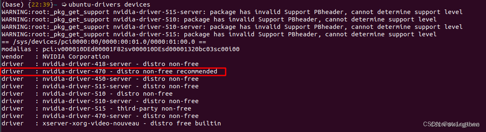

# 0

## windows的WSL安装Ubuntu

> [Windows通过WSL安装Ubuntu以及深度学习配置](https://blog.csdn.net/qq_40102732/article/details/134992151)

# 1.2

##  CUDA下载安装

> 系统：Ubuntu18.04
>
> CUDA：11.6
>
> 下载地址：https://developer.nvidia.com/cuda-11-6-0-download-archive
>
> 注意：在虚拟机的ubuntu上是不能使用的，因为不能识别显卡

下载：


安装：

> [【Linux】什么是.bashrc，以及其使用方法](https://blog.csdn.net/weixin_57208584/article/details/135868555)

1. 添加环境变量

```shell
vi ~/.bashrc
```

* 文件末尾添加内容如下;

```shell
# config cuda
export LD_LABRARY_PATH=$LD_LIBRARY_PATH:/usr/local/cuda-11.6/lib64
export PATH=$PATH:/usr/local/cuda-11.6/bin
export CUDA HOME=$CUDA_HOME:/usr/local/cuda-11.6
export PATH=/usr/local/cuda/bin:$PATH
```

2. 环境变量立即生效

```shell
source ~/.bashrc
```

3. 检查是否安装成功

```shell
nvcc -V

# 成功返回
chuckie@ubuntu:/home/chuckie/WCUDA$ nvcc -V
nvcc: NVIDIA (R) Cuda compiler driver
Copyright (c) 2005-2021 NVIDIA Corporation
Built on Fri_Dec_17_18:16:03_PST_2021
Cuda compilation tools, release 11.6, V11.6.55 #11.6即版本号
Build cuda_11.6.r11.6/compiler.30794723_0
```

使用：

```c++
#include <stdio.h>

__global__ void hello_from_gpu()
{
    printf("Hello World from the the GPU\n");
}


int main(void)
{
    hello_from_gpu<<<4, 4>>>(); // 4*4  16线程执行
    cudaDeviceSynchronize();    // 同步  cpu与gpu同步

    return 0;
}
```

* 编译

```
nvcc test.cu -o test
```

* 执行

```
./test
```


#  1.3

##  nvidia-smi

> [CUDA版本和驱动版本对照表2023（包含CUDA12）](https://blog.csdn.net/c2793/article/details/134143566?ops_request_misc=&request_id=&biz_id=102&utm_term=CUDA%E9%A9%B1%E5%8A%A8%E5%8F%8ACUDA%20Toolkita%E7%89%88%E6%9C%AC%E5%AF%B9%E5%BA%94%E8%A1%A8&utm_medium=distribute.pc_search_result.none-task-blog-2~all~sobaiduweb~default-2-134143566.142^v100^pc_search_result_base4&spm=1018.2226.3001.4187)
>
> [Ubuntu 如何根据NVIDIA显卡型号确定对应的显卡驱动版本并安装](https://blog.csdn.net/str1ngthen/article/details/133792936?spm=1001.2014.3001.5501)
>
> [Ubuntu 安装CUDA](https://blog.csdn.net/str1ngthen/article/details/133793250)
>
> 注意：虚拟机的ubuntu是不行的，因为不能识别显卡


nvidia-smi参数说明


查询gpu详细信息

```
查询GPU详细信息 nvidia-smi -q
查询特定GPU详细信息 nvidia-smi -q -i 0
显示GPU特定信息 nvidia-smi-q -i 0 -d MEMORY
帮助命令 nvidia-smi -help
```


## 安装显卡驱动

> [Ubuntu 如何根据NVIDIA显卡型号确定对应的显卡驱动版本并安装](https://blog.csdn.net/str1ngthen/article/details/133792936?spm=1001.2014.3001.5501)

查看gpu信息

> [lspci详解](https://blog.csdn.net/weixin_38452632/article/details/136633239)

```
lspci | grep -e VGA
```

查看驱动列表

```
ubuntu-drivers devices
```



* 如果没有显示nvidia相关驱动列表，请检查显卡设置是否完整

* 可以看到这里推荐安装nvidia-driver-470，因此我们直接运行指令进行安装（***recommend：建议、推荐***）：

安装驱动

```
sudo apt install nvidia-driver-470  #安装470驱动
```

然后重启计算机

````
sudo reboot
````

##  ubuntu安装g++

Ubuntu下载g++:
```
sudo apt-get install g++
```

