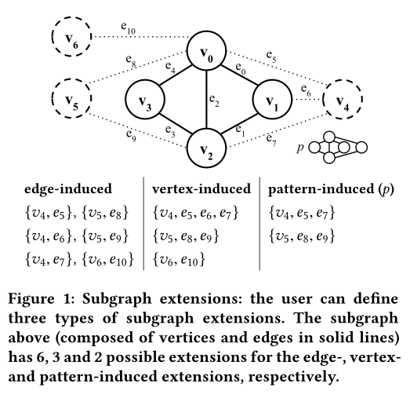
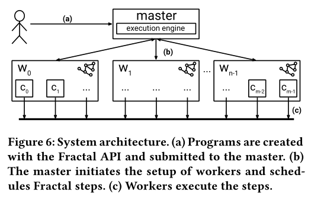

#  Fractal-paper

> [Fractal](https://dl.acm.org/doi/10.1145/3299869.3319875)
>
> 2019.06
>
> 数据库／数据挖掘／内容检索
>
> 会议：SIGMOD
>
> 出版社：ACM
>
> A类
>
> 无向图
>
> 异构网络
>
> 分布式系统
>
> GPM

* 方案
* 优点
* 缺点
* 编程模型
* 对标系统
* 基于系统

## KEYWORDS

* graph pattern mining; distributed systems
* 图形模式挖掘；分布式系统 

##  ABSTRACT

* 对Fractal的定义
  * 一个支持**分布式**图形模式挖掘（GPM）应用的高性能和高生产率系统。
  * 一个基于Spark[64]的通用图形模式挖掘分布式系统 

* 创新点
  * 采用了一种动态（自动调整）负载平衡机制，该机制基于一种**层次结构和位置感知**的工作窃取机制，允许系统适应不同的工作负载特征
  * 通过结合**深度优先策略和从头开始的处理范式**来枚举子图，以避免存储大量中间状态，从而提高内存效率

* 使用
  * 提供了丰富的API,可快速组合并表达许多GPM算法

##   1 INTRODUCTION

* 分布式图挖掘系统：[37,22,23,61]  Pregel(2010)、 PowerGraph(2012)、GraphX(2014)、Blogel(2014)

  * 问题：专注于基于矩阵的算法，可能并不适用于所有的**GPM问题**(Arabesque   SOSP’15)
    * GPM方法的核心是执行子图枚举， 该过程会产生大量的中间结果

* 针对特殊GPM问题的分布式算法

  * frequent subgraph mining [1], motif counting [47], and clique counting [19]

* GPM第一代通用解决方案

  * Arabesque [53] and NScale [45   2016]
    * 两个系统都提供了处理粗粒度GPM应用程序的编程接口
    * 问题： 它们的计算模型不支持细粒度的交互式分析

* Fractal目标

  * 提供灵活但简单的API，专注于分析人员的生产力
  * 对现代分布式体系结构上的一系列GPM内核提供有效的系统支持，可以处理它们的不规则内存和计算需求

* Fractal贡献

  * 提供了灵活的API, 用极简的代码组成广泛的GPM应用
  * 缓解了不规则导致的内存需求，将**深度优先策略与“从头开始处理(from scratch processing)”范式**相结合，以保持内存需求有限 
  * 自适应负载平衡，结合了一种新的**分层工作窃取和通信缓解策略**，该策略能够**感知任务位置**并减少通信开销
  * 图缩减和过滤，依赖于一种新的图缩减优化来加速许多GPM方法的枚举阶段，当待挖掘的子图集中在真实图的某个区域时，这种压缩是有效的，可以减少内存的开销，否则压缩无效，可参件#OVERHEADS AND LIMITATIONS中第三条
  * 广泛评估，性能优于专门的分布式算法和通用系统

##  2 BACKGROUND

* 图的定义
* 图挖掘问题

##  3 COMPUTATION MODEL

**Fractal采用了一个包含三种计算原语的模型：扩展、聚合和过滤。**(extension, aggregation, and filtering)

* Extension  扩展      如图Figure 1
  * 基于边的扩展          适用于FSM
  * 基于顶点的扩展      适用于motif extraction, clique listing kernels
  * 基于子图的扩展      适用于graph querying and matching
  * 使用**规范子图检测**避免对称性引起的冗余计算
* Aggregation   聚合
  * 需要三个函数支持聚合原语
    * 一个从子图中抽取键的映射函数
    * 一个从子图中抽取值的映射函数
    * 一个缩减函数，用于缩减共享同一个键的值
  * 聚合原语适用于与频繁计数和聚合相关的GPM应用
* Filtering   过滤
  * 过滤原语用于修剪不符合应用标准的子图
  * Fractal支持两种过滤选择
    * 局部过滤利用局部信息修剪子图
    * 聚合过滤使用聚合原语步骤中提供的信息来修剪子图   适用于FSM
  * 这两种过滤操作对性能提升至关重要，因为它们限制了不相关子图的枚举，并减少了给定任务的搜索空间 

###  Fractal Programming Interface

##  4 FRACTAL SYSTEM DETAILS

**系统架构**

* (a) 用户通过提交指令和主服务器之间交互
* (b) 主服务器包含执行引擎，它管理底层集群资源并协调fractal步骤的执行 
* (c) worker表示执行实际GPM处理的实例, 每个worker在多核上运行
  * master和workers之间有通信
  * workers之间也有通信，通过参与者模型范式(actor-model paradigm)通信
  * 这种设计简化了workers之间的初始化和异步工作分配 

**系统初始化**

* 先启动master再启动workers
  * master是workers之间通信的节点
* workers初始化包括创建内部结构（对每个worker和它对应的核进行全局标识）和在内存从读入图数据
* 每个worker向主机发送一条注册消息, 当master确认worker的注册时，就会广播它们的地址, 此后每个worker都可以自己和其它worker通信

##  OVERHEADS AND LIMITATIONS

* 恒定内存需求
  * 当机器本身的内存就足够满足挖掘需要时，针对内存优化的就不再起作用
* 工作窃取机制
  * 当处理小图时，分布式带来的启动和通信开销得不到分摊