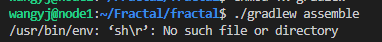
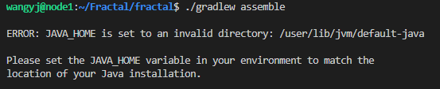
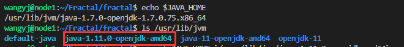
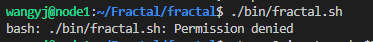
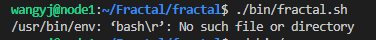
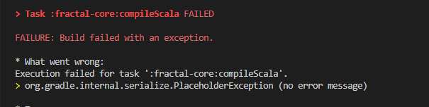

#  Fractal

> [Fractal论文](https://dl.acm.org/doi/10.1145/3299869.3319875)
>
> [Fractal-github](https://github.com/dccspeed/fractal)
>
> 以下操作都是基于Linux系统


##  配置Fractal

**安装spark**

> Fractal是java开发的所以需要先在安装jdk
>
> Fractal是基于spark的所以需要先安装spark

* 当前系统已经安装了jdk，所以`export JAVA_HOME=<openjdk-8-installation-folder>`这一步不需要
  * 这一步的意思是定义jdk的环境变量
* `cd <repositories-folder>`: 新建一个文件夹,并cd到这个文件夹下
* `wget https://archive.apache.org/dist/spark/spark-2.2.0/spark-2.2.0-bin-hadoop2.7.tgz`: 下载spark
* `tar zxvf spark-2.2.0-bin-hadoop2.7.tgz `: 解压文件
* `mv spark-2.2.0-bin-hadoop2.7 spark`:  将解压的文件夹重命名为spark
* `rm spark-2.2.0-bin-hadoop2.7.tgz`: 删除压缩包
* `cd spark`

```
export SPARK_HOME=`pwd` 将当前路径设置为SPARK_HOME的环境变量
```

**构建Fractal**

```
cd <repositories-folder>                                     //进入上面新建的文件夹
git clone https://github.com/dccspeed/fractal.git            //从github上拷贝下Fractal
cd fractal                                                   
export FRACTAL_HOME=`pwd`                                    //将当前路径设置为FRACTAL_HOME的环境变量
./gradlew assemble                                           //编译fractal
```

**编译错误**

* 报错1


* 解决方案

```
 chomd +x gradlew
```

* 错误原因： gradlew没有权限


* 报错2



* 解决方案

```
终端：vim ./gradlew
终端打开后直接输入：`:set fileformat=unix`
然后退出保存： `:wq`
```

* 错误原因：gradlew的文件格式有问题（windows上的格式），通过`:set fileformat=unix`修改文件格式以符合linux系统


* 报错3



* 错误原因：JAVA_HOME路径有问题
* 解决方案：找到正确的jdk路径并再次设置JAVA_HOME
  * 查看已经安装的jdk位置： `echo $JAVA_HOME`
  * 重新设置JAVA_HOME： `export JAVA_HOME='/usr/lib/jvm/java-1.11.0-openjdk-amd64'`




**执行错误：**

* 错误1



* 错误原因：没有执行.sh文件的权限
* 解决方案:
  * cd到bin目录下执行：`chmod u+x *.sh`  
    * 这里的u 这里指文件所有者，+x 添加可执行权限，*.sh表示所有的sh文件


* 错误2



* 错误原因：fractal.sh文件格式问题
* 解决方案：
  * cd到bin目录下执行：`vim fractal.sh`
  * vim打开后输入：`:set ff=unix`
  * 然后保存退出：`:wq`


* **错误3**



* 错误原因：jdk版本不对，需要安装jdk1.8
* 解决方案：
  * Linux非root用户安装：在自己的目录下新件jvm文件夹，再将下载的jdk1.8安装包拖入jvm文件夹
  * 在jvm文件夹下解压安装包：`tar -zxvf jdk-8u151-linux-x64.tar.gz`
  * 设置临时环境变量：`export JAVA_HOME='/home/wangyj/jvm/jdk1.8.0_151'`

>jdk1.8资源
>
>链接：https://pan.baidu.com/s/1txqGI8wwmRqZeV0pbjg9xQ 
>提取码：zukz
>
>[Linux非root用户安装JDK](https://blog.csdn.net/weixin_44273302/article/details/113617259)


##  使用Fractal

####  **设置临时环境变量**

* cd到项目根目录下/Fractal执行如下命令
  * 使用已经安装好的jdk1.8， 如果没有安装请看：配置Fractal---执行错误----错误3

```
export JAVA_HOME='/home/wangyj/jvm/jdk1.8.0_151'
```

* cd到/Fractal/spark执行如下命令

```
export SPARK_HOME=`pwd` 将当前路径设置为SPARK_HOME的环境变量
```

* cd到/Fractal/fractal执行如下命令

```
export FRACTAL_HOME=`pwd` 
```

* 编译, 在/Fractal/fractal下执行

```
./gradlew assemble
```


####  **挖掘自带的模式图**

* 查看所有自带模式图

```
./bin/fractal.sh
```

```
可供选择的模式图：fsm|motifs|cliques|cliquesopt|gquerying|gqueryingnaive|kws
```

* 查看某个模式图执行参数

```
app=cliques ./bin/fractal.sh
```

```
ALGOPTION for 'cliques':
   inputgraph=<file-path>                  'Input graph file path'
   steps=1|2|...                           'Extension steps. If the target subgraph has size k, then steps=k-1'
```

* 在数据集`citeseer-single-label.graph`上执行3个点的cliques挖掘

```
steps=2 inputgraph=$FRACTAL_HOME/data/citeseer-single-label.graph app=cliques ./bin/fractal.sh
```


####  挖掘自定义模式图

**命令**

```
steps=2 inputgraph=$FRACTAL_HOME/data/citeseer-single-label.graph app=gquerying query=$FRACTAL_HOME/data/q6-house.graph ./bin/fractal.sh
```

* steps=n, 表示n步扩展
* inputgraph， 真实图地址
* query， 模式图地址
* app=gquerying， 表示是自定义模式图的挖掘

**模式图格式**

```
<vertex id> <vertex label> [<neighbour id1> <neighbour id2> ... <neighbour id n>]

例如房子模式图
0 1 1 4
1 1 0 2 4
2 1 1 3
3 1 2 4
4 1 0 1 3

其中第二列都是1，表示标签都是1，即同构图，若标签不同则是y
```

