#  GraphPi-paper

> [GraphPi论文](https://pacman.cs.tsinghua.edu.cn/~zjd/publication/sc20-graphpi/sc20-graphpi.pdf)
>
> 2020.11
>
> Tianhui Shi, Mingshu Zhai, Yi Xu, Jidong Zhai
>
> 清华大学
>
> 计算机体系结构/并行与分布计算/存储系统
>
> 会议：SC
>
> 出版社：IEEE
>
> A类
>
> 无向图
>
> 可单机也可分布式

* 方案
* 优点
  * 性能预测模型，排列组合所有约束集合和匹配顺序的组合，并通过对**真实图特征的分析**(真实图中顶点，边，三角形个数等信息)，预测出最优的schedule(约束集合和匹配顺序的组合)
  * 核心：考虑了真实图的数据分布，使得schedule的预测更加准确

* 缺点
* 编程模型
* 对标系统
  * Fractal、GraphZero
* 基于系统
  * Automine --->  GraphZero ---> GraphPi

##  KEYWORDS

* Graph mining, pattern matching, automor-phisms elimination
* 图挖掘、模式匹配、自同构消除 

##  Abstract

目前图挖掘系统面临的两个挑战：

* 模式中固有的**对称性**可能会引入大量冗余计算

* 模式的**不同匹配顺序**有显著的性能差异，很难预测

GraphPi: 分布式,  无向图

GraphPi创新点：

* 利用群论中基于2-圈(2-cycles)的**新算法**生成多组非对称约束，每组约束可以完全消除冗余计算
* 设计了一个精确的**性能模型**，以确定有效模式匹配的**最佳匹配顺序和不对称约束集**

性能效果：

* 测试环境：天河2A超级计算机
* GraphPi在单个节点上对6个真实图形数据集的性能优于最先进的系统，最高可达105倍。还将GraphPi扩展到1024个节点（24576个核）


##    I.  INTRODUCTION

图分析问题主要可以分为两类：

* 图计算
* 图挖掘
  * 模式匹配是最经典，最常见的图挖掘问题，是[NP-complete](https://blog.csdn.net/wxdsdtc831/article/details/7942435)问题


目前最先进图挖掘系统的性能表现：

* 最先进的图形模式匹配系统(Graphzero)[12]需要几个小时甚至几天的时间，才能在具有数**百万条**边的未标记图形上挖掘出大小为6的模式[13]


通用的图挖掘系统：

* Arabesque
  * 分布式
  * 创新点：提出**过滤处理编程模型**简化可伸缩图形挖掘算法的开发 
  * 问题：分布式带来的启动和通信的开销；挖掘过程中产生大量的中间结果
* RStream
  * 特点：单机  去核心( out-of-core)  利用磁盘来存储中间结果
  * 创新点：
    * 提出了一个新的编程模型，这个编程模型为开发人员提供了**关系代数**来表达各种各样的挖掘任务
    * 提出了一个运行时引擎，**通过元组流高效实现关系代数**的运行时引擎

* 目前通用图挖掘系统的问题：
  * 性能相对较差，存储候选数据的中间数据呈指数级增长
  * 案例：RStream生成大约1.2TB的中间数据，以计算具有100万条边的MiCo图上的4-motif[18] 


特殊的图挖掘系统：

* 频繁子图挖掘(FSM)

* 近似模式挖掘( approximate pattern mining)

  *  ASAP [23]: 分布式近似模式挖掘系统， 用于估计模式图在真实图中的数量， 允许用户在结果准确性和用时上权衡
  * ASAP的问题：如果挖掘的模式图在真实图中很少，ASAP无法通过采样生成相对准确的估计，这在一些实际的图挖掘应用中很常见

* 目前比较好的特殊图挖掘系统

  * 这两个系统解决的问题：模式图与真实图匹配时存在大量不同的匹配顺序，这个匹配顺序称之为：**schedule**，不用的匹配顺序，性能有很大的区别

  * AutoMine [18]
    * 提出了一种性能评估模型，用于选择性能相对较高的schedule(匹配顺序)
  * GraphZero[12]
    * 基于AutoMine，GraphZero进一步生成一组限制条件，以打破模式中的对称性


当前特殊图挖掘系统存在的两个局限性：

* 由于模式图的**对称性**，导致挖掘结果存在重复结果，产生了大量冗余计算
  * GraphZero通过使用限制来消除自同构
  * 但GraphZero不考虑不同的限制对性能的影响 
* 不同的匹配顺序(schedule)，使得匹配性能有很大的不同，很难找到一个最佳的schedule


**GraphPI提出的4个新组件，也是GraphPi的主要贡献：**

* 提出了一种基于两个循环（2-cycle  基于群论）的自同构消除算法，用于生成多组约束（restrictions），从而有效地打破模式的对称性 (Section IV-A)
* 提出了一个2阶段“计算避免”schedule生成器，以消除低效的schedule (Section IV-B)
* 提出了一个精确的性能预测模型，用于确定schedule和约束集的最佳组合 (Section IV-C)
* 提出了一种包含排除原则(Inclusion-Exclusion Principle )优化技术 ，只用计算嵌入数量（embeddings），而不用知道具体是哪些匹配结果时使用 (Section IV-D)


性能评估：

* GraphPi比在同一个节点上运行的GraphZero快105倍，比Fractal[26]快154倍。
* 在使用包含排除原理（IEP）计算嵌入数后，GraphPi的性能可以比不使用IEP的性能进一步提高1110倍。
* 目前，GraphPi可以扩展到1024个计算节点（24576个计算核心）。

##  II.  BACKGROUND AND MOTIVATION

Schedules and Restrictions

* Schedules ：就是匹配顺序
  * A1表示，A第一个开始匹配、B2表示，B第二个开始匹配、、、
* Restrictions：约束就是当同构的点匹配真实图中顶点时，匹配的结果有一个大小的比较，由此可以避免结果交换产生的同构
  * 边上大于号表示，在真实图中的匹配结果要满足这个大小关系，A1>B2, 即要求id(A) > id(B)   ， id(A)表示A在真实图中匹配的点


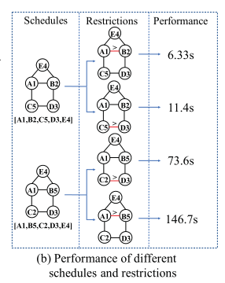

* 以上的约束过程用到了领域等价类的概念 [29]，但是领域等价类只对部分模式图有效，针对这个问题GraphZero提出了以下解决方案
  * GraphZero通过减少任何模式的自同构数目到1来部分地解决这个问题
  * GraphZero仍然存在的问题：它只能产生一组限制，并且不考虑模式匹配中不同约束集的性能差异

###  Challenges of Pattern Matching

* 很难提前预测并找到一个最佳的schedule和restrictions的组合，使得挖掘效果最好

* n个顶点的图会生成n!个匹配顺序(schedule)

* 每个匹配顺序都对应于多个约束集合(restrictions)，这导致组合非常多，而每种组合的挖掘性能都有很大差距

  

##  III. OVERVIEW OF GRAPHPI

GraphPi由四个主要组件组成：

* 配置(configuration)生成： 生成所有约束集和匹配顺序的组合，configuration：指每个组合
* 性能预测： 找到匹配顺序和约束集最佳的组合
* 代码生成和编译
* 分布式模式匹配

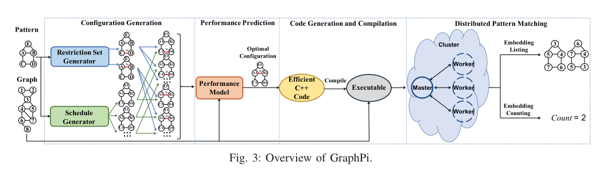


##  IV. METHODOLOGY OF GRAPHPI

####  A. 2-Cycle Based Automorphism Elimination

> 本部分的置换群只是用来形式化(formalize)要解决的问题，其实就是用更规范的方式来表示同构
>
> 模式图的所有同构结果构成一个置换群

* 本方法的目的：生成约束集合，打破对称性，消除自同构

* 生成约束集合的流程;
  * 根据模式图生成所有的自同构 ，没有细讲，需要自行理解
  * 根据所有的自同构生成所有的置换(permutation), 也就是置换群( permutation group)，没有细讲，需要自行理解
  * 根据置换群生成约束集合(sets of restrictions), 这个生成过程是这部分主要讲解的内容
    * 其实就是根据所有的2-cycle(两个元素的置换)排列组合（排列组合不是全排列，只是抽取其中的几个置换约束），保证可以消除所有的同构

#####  置换群表示同构

* 置换群的基本概念

```
矩阵形式  ---->   简写形式
1 2 3
1 2 3    ---->   (1)

1 2 3 
2 1 3    ---->   (12)

1 2 3 
3 2 1    ---->   (13)

1 2 3 
1 3 2    ---->   (23)

1 2 3 
2 3 1    ---->   (123)

1 2 3 
3 1 2    ---->   (132)
```

* 置换群在表示同构中的使用
  * 2-cycle是置换的基本元素，任何k-cycle(k>2)都可以拆解为2-cycle
  * 例如：（A，B，C，D）就可以拆解为（A，B）、（A，C）、（A，D）

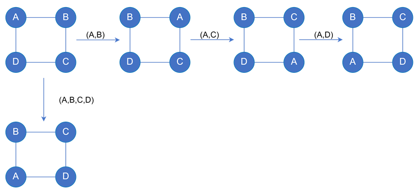

* 模式图的所有同构结果构成一个置换群(生成所有同构和所有置换)

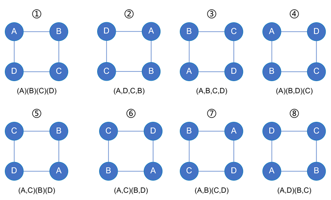

##### 根据置换群生成约束集合

* 约束可以有很多：`R1、R2、R3、R4、R5、、、、、`，但一个约束集合只需要中其中几个约束就可以保证去除所有同构，而且不同的约束集合在与不同的匹配顺序组合时会产生显著的性能差异，所以需要先列举所有的约束集合并选择最合适的与匹配顺序组合（这个组合和选择的过程在C部分会讲到）
  * 约束集合1：` {{R1=id(B)>id(D)},{R3=id(A)>id(C)},{R4=id(A)>id(B)}}`
  * 约束集合2：` {{R1=id(B)>id(D)},{R3=id(A)>id(C)},{R5=id(C)>id(D)}}`
  * 约束集合3：` {{R2=id(A)>id(D)}.......`
* 值得注意的：`R1和R3`两个约束没有直接匹配⑧中的两个置换(2个2-cycle：(A,D)(B,C))，但是仍然得到了约束
  * 假设有①的匹配结果`e1(x1,x2,x3,x4)`,由`R1、R3`两个约束可以得到下面两个结果
    * `id(B)>id(D)  ----->   x2>x4`
    * `id(A)>id(C)  ----->   x1>x3`
  * 则有⑧的匹配结果`e2(x4,x3,x2,x1)`, 由`R1、R3`两个约束可以得到下面两个结果
    * `id(B)>id(D)  ----->   x3>x1`  ，与上面的`id(A)>id(C)  ----->   x1>x3`矛盾
    * `id(A)>id(C)  ----->   x4>x2`  ，与上面的`id(B)>id(D)  ----->   x2>x4`矛盾
  * 可以看到如何满足了与①的匹配，在`R1、R3`的约束下就一定不能得到⑧的匹配

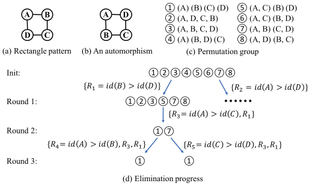

#####  几个算法思想

######  validate

> 用于判断约束集合是否可以去除所有置换(permutation)，最终只保留自身置换(identity permutation)
>
> 也就是判断是否可以消除所有同构

**思想**

* 使用这个约束集合的情况下在一个n(模式图的顶点个数)个顶点的完全图中挖掘模式图，得到挖掘结果个数ANSwith
* 不使用这个约束集合的情况下在一个n(模式图的顶点个数)个顶点的完全图中挖掘模式图，得到挖掘结果个数ANSwithout
* 如果满足：` ANSwith = ANSwithout/automorphisms_count   `,则表示可以实现对自身外的所有自同构的约束
  *  `automorphisms_count:同构个数`
  * `/：去除，不是除号`

######  no_conflict

> 用于判断当前的约束集合是否可以消除某个置换(permutation)
>
> 例如案例中的：R1和R3两个约束构成的约束集合可以对⑧构成约束

**思想**

* 使用一个有向图记录约束，若图中出现了环则说明约束成功，若图为有向无环图则约束不成功
* 对于置换(A)(B)(C)(D)，有匹配结果e1(x1,x2,x3,x4)，若存在约束`{{R1=id(B)>id(D)},{R3=id(A)>id(C)}}`, 则将边`x2-->x4`和`x1-->x3`加入图中
* 对于置换(A,D)(B,C),  则有匹配结果e2(x4,x3,x2,x1),  对于上面的约束`R1,R2`, 则将边`x4-->x2`和`x3-->x1`加入图中
* 此时在图中就形成了由`x2-->x4`与`x4-->x2`构成的环，即表示存在`x2>x4`与`x4>x2`的冲突，还有`x1-->x3`与，，的环，只要图中有一个环则表示基于当前约束(`R1,R2`)，该置换(`(A,D)(B,C)`)可以被消除

####  B. 2-Phase Computation-Avoid Schedule Generation

> n个顶点的模式图理论上有n!和匹配顺序，但并不是把n！个顺序都交给后续的性能预测环节去计算最有效的匹配顺序与约束的组合
>
> 通过本部分的两个步骤找到最有可能使得挖掘效率高的匹配顺序，再交由后续的性能预测模型

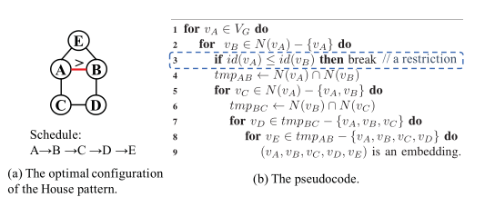

**步骤1**

* **保证当前挖掘点必须与之前已经挖掘过的点是相连的**，这样才能使得当前挖掘点的匹配候选集尽可能少
  * 例如已经挖掘了C、D点，当前挖掘点应该从与它们相连的A或B中选择，但是如果选择E那么E的候选集就是整个真实图的所有顶点
  * 如果当前挖掘点选择A, 则A的匹配候选集是C的匹配点的所有邻接点，即`N(vC)`, 挖掘A后再挖掘E，那么E的匹配候选集是A的匹配点的所有邻接点，即`N(vA)`
  * 显然候选集`N(vA)`远小于整个真实图中的所有顶点
  * 所以保持当前挖掘的点与之前已经挖掘过的点是相连的，可以大量削减当前点的匹配候选集
* 该过程也存在**求交过程**
  * 例如已经挖掘了A, B点， 再选择挖掘E, 此时E的匹配候选集是A的匹配点的邻接点集与B的匹配点的邻接点集的交集，即`N (vA)∩ N (vB)`

**步骤2**

* **将求交过程尽可能放在外层循环中**，因为求交过程是匹配过程中计算消耗最大的环节，而外层循环执行次数少，所以将求交过程尽可能放在外层会使得总计算最少
* 找到模式图中最大的任意两两不想连的顶点集，并保证如果有匹配顺序**不是**这个顶点集中的顶点在最内层循环中匹配时，那么删除这个匹配顺序
  * 如上图(b) The pseudocode,  可以看到匹配过程是多层循环，每层循环匹配完成一个点的匹配，并对需要求交的集合执行求交操作
  * 如上图(a),  最大的任意两两不相连的顶点集为：{D,E} 或 {C, D}或{A,D}或{B,C},  虽然有多个这样的顶点集，但都是最大2个顶点，那就从中任选一个(如果有顶更多的这样的顶点集，则选择顶点更多的那个顶点集)
  * 如果选择{D,E}这个顶点集，则这两个点放在最内层循环中匹配时，如上图(b)，这个匹配顺序就会被保留，如果最后两个顶点不是两两不相连的就会删除当前匹配顺序
* 将最大的任意两两不想连的顶点集中顶点放在最内层的原因
  * 因为两两不相连，所以拿到当前点的邻接点后不需要与之前已经匹配的点的邻接点求交集，因为后面的点一定用不到这个求交结果
  * 假设当前匹配A, 之前已经匹配了B,  后续还有C要匹配，而A,C是两两不不相连的
    * 如果C的匹配候选集是 N(vA)∩N(vB)， 那么说明C与A,B一定是相连的，只有与它们相连的情况下才会用它们的邻接点的交集作为候选集，而这与假设中的A,C两两不相连矛盾
    * 所以如果将两两不相连的点放在最内层匹配，则拿到其邻接点集后一定不用执行求交操作
* 如下图

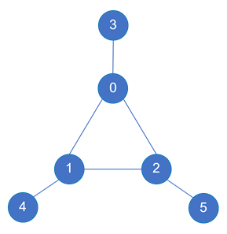

```
最大两两不相连的顶点集：{3，4，5}

如下顺序会被保留
0 <--- G 
1 <--- N(v0)  此处执行求交操作N(v0)∩N(v1)用于下一步计算   在第二层  求交操作在更外层
2 <--- N(v0)∩N(v1)
3 <--- N(v0)
4 <--- N(v1)
5 <--- N(v2)

如下顺序会被修剪
5 <--- G
0 <--- N(v3)
1 <--- N(v0)   此处执行求交操作N(v0)∩N(v1)用于下一步计算  在第三层  
2 <--- N(v0)∩N(v1)
4 <--- N(v1)
5 <--- N(v2)

因为最内层的三个循环点不是两两不相连的（2-5相连），所以会被修剪
```

####  C. An Accurate Performance Prediction Model

* 影响算法性能的因素有三个：(核心算法如图：Fig5 : (b) The pseudocode )
  * 循环遍历的集合的基数（如line1） 
  * 因不满足限制而中断循环的概率（如line3）
  * 以及两个集合相交的开销 
* 性能预测模型
  * `n : 模式图的顶点个数`
  * `costi : 第i层循环的总计算成本`
  * `li ： 每层循环的循环基数 ， 即候选集的大小， i表示循环的层数`
  * `fi : 一个嵌入被过滤掉的概率 ， 如line3`
  * `ci : 求交操作的开销`

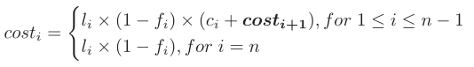

* 计算每个影响性能的变量

  * 计算`ci`
    * 真实图中顶点的邻接点可以预先排序，因此相交操作的时间复杂度为O（card1+card2），其中card1和card2是相交的两个集合的基数(集合中的顶点个数)。
  * 计算`li`
    * 就是当前循环的候选集的基数，如果候选集是求交的结果，则`li`就等于求交结果的基数，例如`line 7, l4 = |tmpAB| = |N (vA)∩N (vB)|`
  * 基数(cardinalities)的预测, *因为性能预测过程是预处理过程，并没有真实匹配，所以候选集的基数，不能直接同过`.size`方法得到，只能预测*
    * 一个顶点的邻接点集合的基数的估计
      * `基数= 2*|EG|/|VG|`     ， 也就是每个点平均的邻接点个数  ，
      * `|EG|` : 真实图的边数； `|VG|` : 真实图的顶点数 
      * `2*|EG|` : 图中所有顶点的邻接点的总和， 一条边被两个点公用， 也就是一条边产生2个邻接点
        * A—B, A的邻接点有B，计算一次，B的邻接点有A，计算第二次
    * 多个顶点的邻接点集合的交集的基数的估计
      * 基数 = 下图第一个公式

  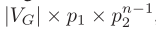

  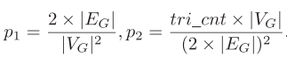

  * 计算`fi`
    * 对于n个顶点的模式图，与之匹配的一个嵌入有n!种自同构，这些自同构结果存储再一个集合S中
    * 例如：n=5的模式图，有则S中有 [1,2,3,4,5], [1,2,3,5,4],[1,2,4,3,5].....n!中自同构
    * 对于限制 id(A) > id(B)，有S中有一半的结果会被过滤掉,如下列举了会被过滤的所有组合，所以`fi = ((4+3+3+1)*3*2*1)/n! = 1/2`

```
1 2 ...  2 3 ...  3 4 ...  4 5...
1 3 ...  2 4 ...  3 5 ...
1 4 ...  2 5 ...
1 5 ...
```


####  D. Counting with Inclusion-Exclusion Principle

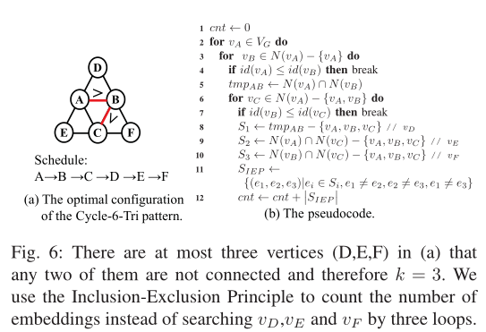

* 但是以上方式没有考虑内K层循环中可能存在约束，这会使得求得的计数是有可能偏大的

  * 可以使用计算约束集合的`Algorithm 1`中的`no_conflict`函数求得使用某几个约束，而不使用某几个约束时，还有哪些自同构情况没有被移除掉，并用x记录没有被移除的自同构个数
    * 例如Fig4中有约束集合：` {{R1=id(B)>id(D)},{R3=id(A)>id(C)},{R4=id(A)>id(B)}}`，假如在内K层循环中有R4这个约束，则有①和⑦这种自同构没有被移除掉，所以x = 2

  * 最后的计数应该是：` ansIEP/x `
    * `ansIEP`: 是同过以上方式挖掘的计数结果


####  E. Distributed Implementation

* GraphPi可以处理的数据图的大小受到内存的限制。
* 内存感知、图分区、网络负载平衡 这些分布式问题暂时没有解决
* 目前GraphPi解决的分布式问题主要是： 任务划分带来的工作负载不均衡
* GraphPi中的真实图的存储是以邻接的形式存储在一维数组中，且邻接点是排序的， 即稀疏矩阵的存储格式
* 由于顶点度数在现实图形中通常遵循**幂律分布**，GraphPi利用**细粒度任务划分技术**来处理工作负载不平衡问题
  * 在GraphPi中，有一个主线程负责划分和分配任务
  * 主线程执行外部循环，并将外部循环的值打包到任务中。
  * 工作线程需要解包任务并继续执行剩余的内部循环。
* GraphPi使用工作窃取算法来安排节点之间的计算。 

##  V. EVALUATION

### A. Methodology

####  Platforms

* 天河2A超级计算机上进行测试，每个节点有2个12核Intel Xeon E5-2692（v2）处理器（禁用超线程）和64GB内存
* 我们已经用OpenMP\/MPI混合编程模型实现了GraphPi。在每个节点上，我们使用24个OpenMP线程运行1个MPI进程。
* 每个节点都使用Linux内核版本3.10.0和gcc版本4.8.5运行Kylin Linux。所有程序都使用-O3优化选项编译 

####  Datasets

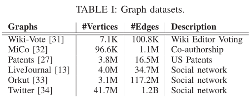

####  Patterns

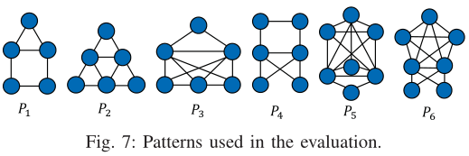

####  Comparison

* 评估对比系统：**GraphZero [12] and Fractal [26]** （最先进的单机模式匹配系统）
  * GraphZero是AutoMine[18]的升级版，其性能比AutoMine高出40倍。
  * Fractal是一种基于JVM的系统，它在性能上优于几种基于JVM的专用算法（MRSUB[35]、SEED[36]和QKCount[37]）和通用系统（Arabesque[14]和GraphFrames[38]）
* 与GraphZero和Fractal相比，GraphPi在单个节点上运行，**不使用包含排除优化原理（IEP）**

###  B. Overall Performance

* 对于不同图形上的6种模式，GraphPi分别比GraphZero高9.7倍、1.4倍、26.0倍、11.7倍、42.5倍和60.3倍。 
* 对于不同图形上的6种模式，GraphPi分别比Fractal好83.6倍、64.9倍、154.3倍、35.5倍、36.5倍和25.7倍。 
* 因为Orkut上的Fractal内存不足，所以没有测试结果
* 与GraphZero和Fractal相比，GraphPi在单个节点上运行，**不使用包含排除优化原理（IEP）**

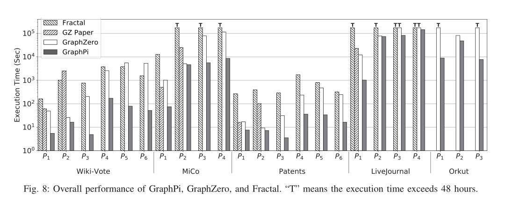

###  C. Breakdown Analysis

####  Restriction Set Generation

>  分析选择的限制集合是否是最合适的 

* GraphPI相对GraphZero 列举了更多的限制集合，使得schedule选择时有更多的选择，从而使得选到更合适的限制集合，使得性能更好
* GraphPI和GraphZero 在处理同样的模式图和真实图的挖掘时，选择的限制集合不同，导致性能不同
* GraphZero只会产生一个限制集合，这集合产生的schedule匹配的性能可能时次优的
* GraphPih会生成所有的限制集合，以供schedule的选择，找到最优的匹配schedule

下面是模式图P1、P2、P3分别在真实图Wiki-Vote和Patents上执行挖掘时，GraphPi相对GraphZero性能提升的表

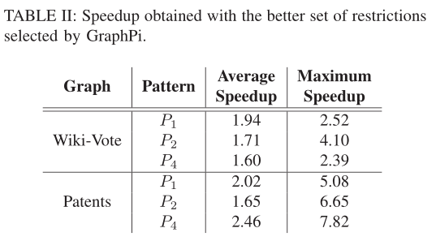

####  Schedule Generation and Selection

> 分析基于匹配顺序选择的schedule是否是最合适的

* 列举了P3在Wiki-Vote执行挖掘产生的所有schedule
* `x`表示被GraphPi的 2-phase computation-avoid schedule generator剪枝的匹配顺序
* `空心圆圈`表示经过GraphPi的 2-phase computation-avoid schedule generator保留下来的匹配顺序
* `红三角形`表示GraphZero选择的schedule
* `蓝色五角星`表示GraphPi选择的schedule

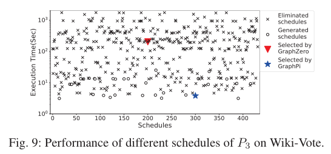

####  Accuracy of Performance Prediction Model

> 性能预测模型的准确性
>
> 分析预测的最优schedule相对实际最优schedule差距有多大

* 如下图

  * Oracle表示实际最优的schedule

  * GraphPi表示GraphPi选择的schedule

* 平均而言，GraphPi选择的schedule只比Oracle schedule慢32%


###  D. Counting Embeddings with IEP

> 分析使用IEP和不适用带来的性能差异

* 对于不同图形上的6种模式，有IEP的计数平均比没有IEP的计数分别高出4.3倍、457.8倍、320.5倍、265.5倍、11.1倍和10.1倍

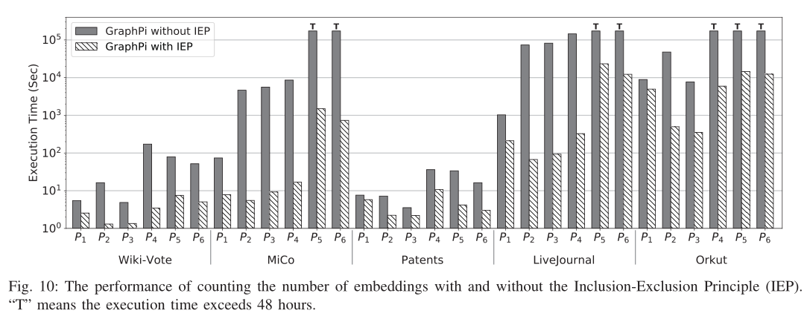

###  E. Scalability of Distributed V ersion

> 分布式版本的可扩展性

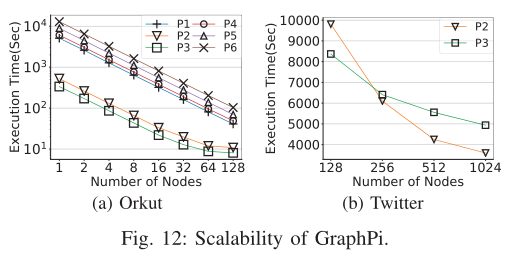

###  F . Overhead of Preprocessing and Code Generation

> 预处理和代码生成的开销

* 实验中报告的时间不包括预处理（即配置生成和性能预测）和代码生成时间
* 因为预处理时间相对于挖掘时间很短，可以忽略
* 下面是6个模式图预处理的时间消耗

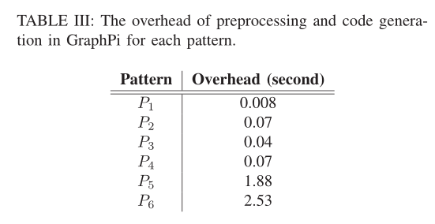

##  VI. RELATEDWORK

###  General-Purpose Graph Mining Systems

> 通用图形挖掘系统 
>
> 提供了**灵活的编程模型**来表达复杂的图挖掘算法

* Arabesque[14]是第一个提供高级抽象和灵活编程模型的分布式图形挖掘系统
* G-thinker[16]提供了一个直观的图形探索API，用于实现各种图形挖掘算法和一个高效的运行时引擎
  * G-Miner[17]将图形挖掘作业的处理建模为一个独立的任务，并通过一种新颖的设计简化了任务处理
* RStream[15]是一个单机系统，通过元组流高效地实现关系代数
  * 为了支持可扩展的图形挖掘，RStream使用核心外处理来利用磁盘支持来存储中间数据

###  Graph Pattern Matching Systems

> 图模式匹配系统

* 已经提出了专门的模式匹配系统[19]–[21]，[29]，[39]，[40]
* Automine[18]建立在基于集合的表示之上，并使用编译技术生成高效的模式匹配代码
  * 由于模式图结构上固有的对称性，Automine的算法会导致大量计算冗余
* GraphZero[12]基于Automine提供了一种基于群论的算法，以打破模式中固有的对称性，消除冗余计算 

* Peregrine[41]是另一个基于DFS的系统，它提供了基于模式的编程模型和工作流（类似于GraphZero）
  * Peregrine也有一个schedule生成模块，但Peregrine生成的schedule仅基于模式，没有考虑真实图中的数据分布（真实图中顶点，边，三角形个数等信息，即GraphPi用于性能预测的信息）

###  Approximate Subgraph Counting

> 近似子图计数

* 一些计算引擎和系统被设计用于**估计**嵌入的大致数量[2]、[42]、[43] 。ASAP[23]是其中最先进的一种
* ASAP是一个用于图形模式匹配的分布式**近似**计算引擎
  * 通过**抽取样本**的方式进行估计

##  PS

使用：

* 为什么要提前输入真实图中三角形个数
  * 用于预测多个邻接点集合求交后集合的基数，用于选出约束与匹配顺序最优的组合
  * 没有提前输入三角形个数则不能找到最优组合
* 什么情况下不能使用IEP
  * 模式图不存在最大两两不相连的顶点集

缺陷:

* 从每个点出发 ,而不是从最小匹配点出发
* 匹配过程中没有出入度的匹配约束
* 需要提前输入真实图中的三角形个数才能使用性能预测模型

GraphPi执行流程：

* 对于用户输入的任意模式图，会在预处理阶段生成多组约束，然后找到schedule和约束集的最佳组合，然后再执行匹配


