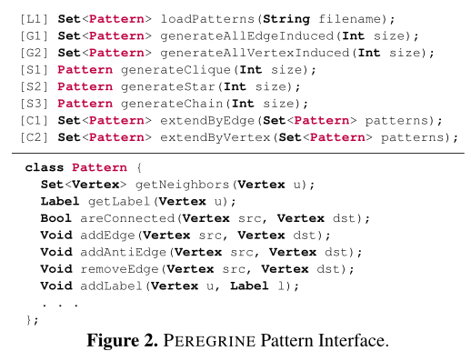
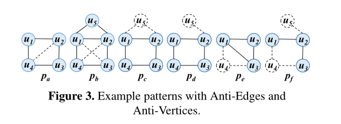
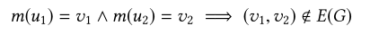
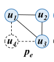
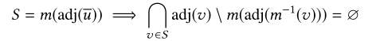
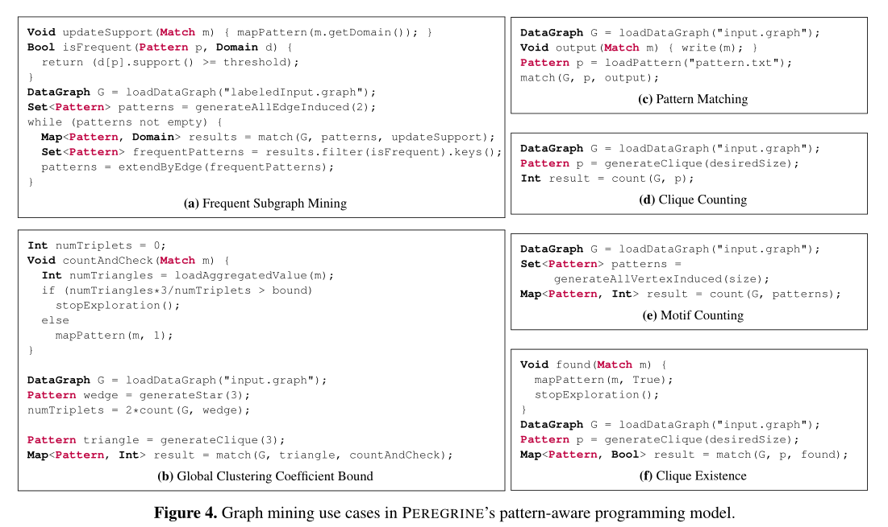
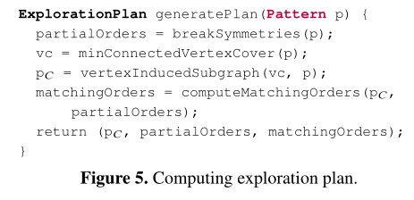
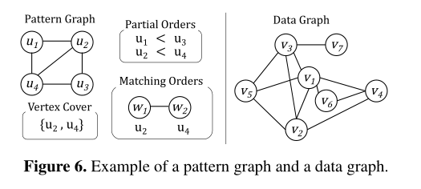
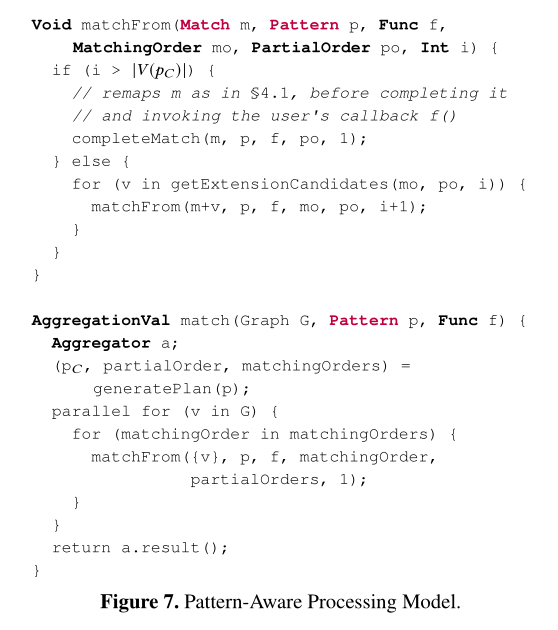
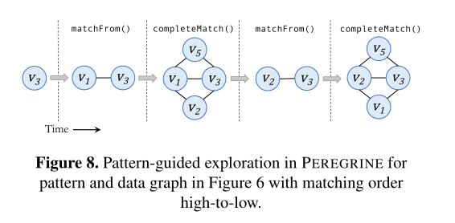

#  Peregrine

> [github](https://github.com/pdclab/peregrine)
>
> 2020.4

现有图挖掘系统问题：

(a)探索不必要的子图;

  		这些系统执行大量不必要的计算;具体来说，从图中探索的每个子图(即使是在中间步骤中)都会被处理以确保规范化，并被分析以提取其模式或验证它是否与另一个模式同构。由于图挖掘用例的探索空间非常大，在每个被探索的子图上执行这些计算严重地限制了这些系统的性能。

(b)对探索的子图进行昂贵的计算;

​		这些系统中的编程模型与底层的探索策略紧密相连，这使得领域专家很难表达复杂的挖掘用例。例如，包含某些严格断开的顶点对(即没有边)的子图可以根据缺失的边提供建议;在现有的任何系统中，都不能直接挖掘具有子结构约束的子图。

​		解决方案：直接挖掘感兴趣的子图

(c)**在内存中保存中间部分子图;**

​		在这些系统中进行详尽的探索，最终会生成大量的中间子图，这些子图需要保存(在内存中或磁盘中)，以便进行扩展。基于**广度优先探索的系统[52,57]**需要高内存容量，而**Fractal[12]和AutoMine[34]**等系统则使用**引导探索策略**来减少这种影响;然而，由于它们不是完全模式感知的，它们处理大量的中间子图，随着图的增长，这严重限制了它们的可伸缩性。


文章核心：

peregrine：一个模式感知的图挖掘系统，

1、它可以直接挖掘感兴趣的子图，

2、同时避免挖掘不必要的子图，

3、同时在挖掘过程中跳过昂贵的计算。


性能：

性能优于目前最先进的分布式和单机图挖掘系统，

并可在更大的图上扩展到复杂的挖掘任务


文章参考的通用图形挖掘系统

Peregrine             在单台16核机器

Arabesque[52]、 在8台16核机器集群

RStream[57]、 同一台机器

Fractal[12]、  在8台16核机器集群

G-Miner[8]      在8台16核机器集群

AutoMine[34]


##  2背景与动机

###  2.1 图挖掘概述

* 图的术语

* 图挖掘模式

* 图挖掘问题

  *  Motif Counting：主题数

  * Frequent Subgraph Mining (FSM)： 频繁子图挖掘

  * Clique Counting： 小团结计数 

  * Pattern Matching： 模式匹配

###  2.2 图挖掘系统的问题

####  2.2.1 性能

* 高的计算需求
  * 产生大量的中间结果，进行了大量不必要的探索，并需要对它们进行同构检测，规范化检测
* 高的内存要求
  * 存储中间结果

####  2.2.2 可编程性

###  2.3 Peregrine概述

直接挖掘子图，无需探索不必要的匹配，同时避免了整个挖掘过程中昂贵的同构和规范化检查。

* 基于模式的编程
  * **反边和反顶点**:反边在匹配中强制两个顶点之间严格断开连接，而反顶点在匹配中严格捕捉顶点之间没有共同邻居的情况
* 勘探计划自动生成
  * **先对模式进行分析**，以**消除其本身的对称性**，从而避免在探索过程中进行昂贵的规范化检查。然后，模式被简化为它的分数子结构，允许使用简单的图遍历和邻接表交集操作来识别匹配，而不执行显式的同构检查
* 引导模式探索
  * 探索过程匹配模式的**核心子结构**，使用数据图中的递归图遍历生成部分匹配。当生成部分匹配时，通过与部分匹配中顶点的邻接表相交，将它们扩展成最终的完全匹配

执行严格的基于**顶点度的匹配顺**序来减少peregrinee中的负载不平衡。此外，我们结合了**实时聚合和早期终止特征**，在采矿过程中提供全局更新，一旦满足计算最终结果所需的条件，勘探就可以停止。


Peregrine 提供了一个基于模式的编程模型，提前对模式分析，以消除其本身的对称性，从而避免容易的同构检测计算，并且会自动生成执行计划，工作流程和GraphZero类似。


##  3 Peregrine编程模型

###  3.1 Peregrine模式

提供的快速自动生成的模式：

* Clique
* motif
* star
* 边引导
* 顶点引导

```c++
//API
[L1]Set<Pattern> loadPatterns(Stringfilename);         //静态构建并加载  从文件中直接读取  构建模式图
[G1]Set<Pattern> generateAllEdgeInduced(Intsize);      //动态构建  生成一定数量的边所能引导的所有唯一模式
[G2]Set<Pattern> generateAllVertexInduced(Intsize);    //动态构建  生成一定数量的顶点所能引导的所有唯一模式
[S1]PatterngenerateClique(Intsize);       //动态构建  直接构建常用的模式图 
[S2]PatterngenerateStar(Intsize);
[S3]PatterngenerateChain(Intsize);
[C1]Set<Pattern> extendByEdge(Set<Pattern> patterns);  //动态构建 通过顶点或边扩展 并返回新的扩展的结果
[C2]Set<Pattern> extendByVertex(Set<Pattern> patterns);
//模式图
class Pattern{
    Set<Vertex>  getNeighbors(Vertex u);   //访问模式图 获取顶点的边集合
    Label getLabel(Vertex u);
    Bool areConnected(Vertex src,Vertex dst);
    Void addEdge(Vertex src,Vertex dst);    //修改模式图  添加边
    Void addAntiEdge(Vertex src,Vertex dst);//修改模式图  添加反边
    Void removeEdge(Vertex src,Vertex dst); //修改模式图  删除边
    Void addLabel(Vertex u,Label l);
    . . .
};
```






####  3.1.1 反边

* 反边用于模型中顶点对之间的约束。
* 提取两个不相干的人有两个共同朋友的图

```c++

m是真实图中与模式图中某个顶点匹配的所有点集
（u1，u2）在模式图中是反边

```




####  3.1.2 反顶点

* 在一个社交网络图中提取只有一个共同朋友的朋友对(u1，u3)
* 反顶点用于模型中顶点共享邻域之间的约束。



* 有反顶点的模式图  在匹配的时候反顶点不参与匹配




####  3.1.3 边诱导和顶点诱导模式

 every edge-induced match ofp′is a vertex-induced match
ofp, and then we show that every vertex-induced match ofp
is an edge-induced match ofp′.

###  3.2 Peregrine中的模式感知挖掘程序



####  3.2.1 FSM:反单调性和标签发现

####  3.2.2 存在的查询


##  4 模式感知的匹配引擎

* 步骤1：对匹配的顶点实施部分排序来打破模式图的对称性，这样可以避免非标准匹配，解决了探索不必要的子图的问题;
  * 枚举所有的自同构来识别对称性，并迭代排序对称顶点对，直到唯一满足排序的自同构是每个顶点映射到自己的自同构。
  * Network Motif Discover Using Subgraph Enumeration and Symmetry-Breaking. InResearch in Computational Molecular Biology, pages 92–106, 2007
* 步骤2：在模式图中找到最小的覆盖所有边的连通顶点集
* 步骤3：根据最小的覆盖所有边的连通顶点集生成一个核心模式图

```c++
ExplorationPlan generatePlan(Pattern p) {
    //步骤1：对匹配模式图的顶点进行强制部分排序，打破模式图p的对称性  
    partialOrders = breakSymmetries(p); 
    //步骤2：在模式图中找到最小的覆盖所有边的连通顶点集
    vc = minConnectedVertexCover(p);  
    //步骤3：根据最小的覆盖所有边的连通顶点集生成一个核心模式图
    pC= vertexInducedSubgraph(vc, p);   
    //步骤4：根据核心模式图和模式图的局部顺序生成匹配顺序
    matchingOrders = computeMatchingOrders(pC,partialOrders); 
    return (pC, partialOrders, matchingOrders);
}
```






###  4.1 直接匹配给定的模式

> [图的同构](https://blog.csdn.net/qq_21774161/article/details/103035449)

基于[5,16,24]

为了避免非正则匹配，我们通过对匹配的顶点[16]进行部分**排序**来打破p的**对称性**

这涉及枚举p的所有自同构来识别对称性，并对对称顶点对进行迭代排序，直到满足排序的唯一自同构是每个顶点映射到自己的自同构。

需要计算匹配顺序

通过排序，顺序匹配，避免了正则性检测

首先，为了避免非正则匹配，我们通过对匹配的顶点[16]进行部分排序来打破pby的对称性。这涉及枚举所有的自同构来识别对称性，并迭代排序对称顶点对，直到唯一满足排序的自同构是每个顶点映射到自己的自同构。对于图6中的示例模式，我们获得了部分orderingu1


```c++

```


###  4.2 匹配反边

###  4.3 匹配反顶点


##  5 模式感知挖掘

###  5.1 模式感知处理模型

```c++
Void matchFrom(Match m,Pattern p,Func f, MatchingOrder mo,PartialOrder po,Int i) {
    if (i >|V(pC)|) {
        completeMatch(m, p, f, po, 1);  //将完全匹配的结果通过回调函数f    返回给用户
    } else {
        for (v in getExtensionCandidates(mo, po, i)) {
            matchFrom(m+v, p, f, mo, po, i+1); //递归匹配
        }
    }
}
AggregationVal match(Graph G,Pattern p,Func f) {
    Aggregatora;
    (pC, partialOrder, matchingOrders) = generatePlan(p); // 1 获取核心图、模式图局部顺序、匹配顺序
    parallel for (v in G) {
        for (matchingOrder in matchingOrders) { // 2 一个顶点对应一个匹配顺序递归匹配
            matchFrom({v}, p, f, matchingOrder,partialOrders, 1);
        }
    }
    return a.result();
}
```


 




