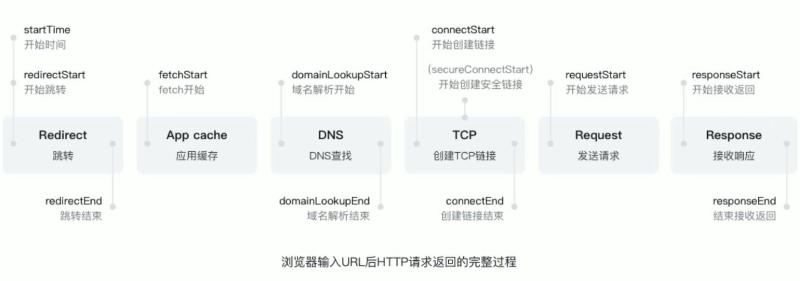
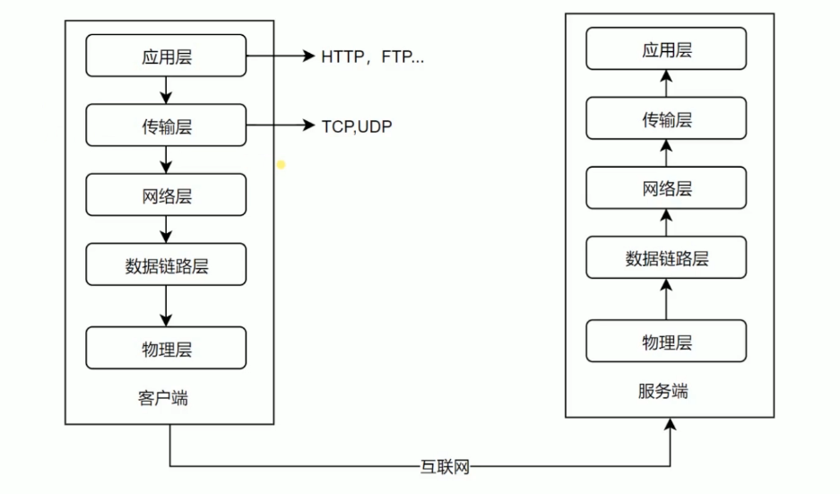

>[HTTP菜鸟教程](https://www.runoob.com/http/http-tutorial.html)
>
>[HTTP教程-MDN web docs](https://developer.mozilla.org/zh-CN/docs/Web/HTTP)
>
>[Node.Js的HTTP-API](https://nodejs.org/api/http.html)
>
>[Node.js-HTTP传输指南](https://nodejs.org/zh-cn/docs/guides/anatomy-of-an-http-transaction/)


* 一个IP地址可以对应多个域名


##  HTTP请求过程



* Redirect : 将URL跳转到指定的URL(如果有指定的情况)
* APP cache :  查找资源是否已经缓存
* DNS : 将域名转换成IP地址
* TCP :  三次握手
* Request : 发送请求
* Response ：响应请求


## 五层网络模型



* TCP在传输层，HTTP在应用层，HTTP的发送是建立在TCP之上的
* HTTP1.0以前，一个TCP的建立对应一个HTTP，HTTP内容传输完成后，TCP连接会自动释放，*效率低*
* HTTP2.0开始，一个TCP的建立对应多个HTPP, 且可以是永久建立，即HTTP内容传输完成后，TCP连接任然保持建立，*效率高（减少了TCP建立的次数，从而减小了三次握手等产生的资源消耗）*


##  TCP三次握手与四次挥手

> 关于TCP三次握手和四次挥手及面试相关问题可以查看文章----->[HTTP(0x02)-TCP三次握手与四次挥手详解&面试常见问题](https://chuckiewill.github.io/2020/09/02/HTTP/HTTP(0x02)-TCP%E4%B8%89%E6%AC%A1%E6%8F%A1%E6%89%8B%E5%9B%9B%E6%AC%A1%E6%8C%A5%E6%89%8B/)


##  URI、URL、URN

**定义：**

* URI: 统一资源标识符，它包括：URL、URN
* URL: 统一资源定位器
* URN: 永久统一资源定位符

**URL格式：**

* protocol :// hostname[:port] / path / [;parameters] [?query]#fragment

**URL格式说明：**

>**protocol（协议）**
>
>指定使用的传输协议，下表列出 protocol 属性的有效方案名称。 最常用的是[HTTP协议](https://baike.baidu.com/item/HTTP协议)，它也是WWW中应用最广的协议。
>
>file 资源是本地计算机上的文件。格式file:///，注意后边应是三个斜杠。
>
>ftp 通过 FTP访问资源。格式 FTP://
>
>gopher 通过 Gopher 协议访问该资源。
>
>http 通过 HTTP 访问该资源。 格式 HTTP://
>
>https 通过安全的 HTTPS 访问该资源。 格式 HTTPS://
>
>mailto 资源为电子邮件地址，通过 SMTP 访问。 格式 mailto:
>
>MMS 通过 支持MMS（[流媒体](https://baike.baidu.com/item/流媒体)）协议的播放该资源。（代表软件：Windows Media Player）格式 MMS://
>
>ed2k 通过 支持ed2k（专用下载链接）协议的P2P软件访问该资源。（代表软件：[电驴](https://baike.baidu.com/item/电驴)） 格式 ed2k://
>
>Flashget 通过 支持Flashget:（专用下载链接）协议的P2P软件访问该资源。（代表软件：快车） 格式 Flashget://
>
>thunder 通过 支持thunder（专用下载链接）协议的P2P软件访问该资源。（代表软件：[迅雷](https://baike.baidu.com/item/迅雷)） 格式 thunder://
>
>news 通过 NNTP 访问该资源。
>
>**hostname（主机名）**
>
>是指存放资源的服务器的[域名系统](https://baike.baidu.com/item/域名系统)(DNS) 主机名或 IP 地址。有时，在主机名前也可以包含连接到服务器所需的用户名和密码（格式：username:password@hostname）。
>
>**port（端口号）**
>
>整数，可选，省略时使用方案的默认端口，各种[传输协议](https://baike.baidu.com/item/传输协议)都有默认的端口号，如http的默认端口为80。如果输入时省略，则使用默认端口号。有时候出于安全或其他考虑，可以在服务器上对端口进行重定义，即采用非标准端口号，此时，URL中就不能省略端口号这一项。
>
>**path（路径）**
>
>由零或多个“/”符号隔开的字符串，一般用来表示主机上的一个目录或文件地址。
>
>**parameters（参数）**
>
>这是用于指定特殊参数的可选项。
>
>**query(查询)**
>
>可选，用于给[动态网页](https://baike.baidu.com/item/动态网页)（如使用CGI、ISAPI、PHP/JSP/ASP/ASP.NET等技术制作的网页）传递参数，可有多个参数，用“&”符号隔开，每个参数的名和值用“=”符号隔开。
>
>**fragment（信息片断）**
>
>字符串，用于指定网络资源中的片断。例如一个网页中有多个名词解释，可使用fragment直接定位到某一名词解释。
>
>


##  HTTP 方法

> [HTTP 请求方法](https://developer.mozilla.org/zh-CN/docs/Web/HTTP/Methods)


##  HTTP CODE

> [HTTP 响应代码](https://developer.mozilla.org/zh-CN/docs/Web/HTTP/Status)


##  HTTP 访问控制(CORS)-跨域问题

> [HTTP访问控制（CORS）](https://developer.mozilla.org/zh-CN/docs/Web/HTTP/Access_control_CORS)

##  HTTP Headers

> [HTTP Headers-MDN](https://developer.mozilla.org/zh-CN/docs/Web/HTTP/Headers)
>
> [HTTP Headers-菜鸟](https://www.runoob.com/http/http-header-fields.html)

### Cache-Control（缓存）

> [Cache-Control-MDN](https://developer.mozilla.org/zh-CN/docs/Web/HTTP/Headers/Cache-Control)

###  ETag Last-Modified (缓存验证)

>[ETag](https://developer.mozilla.org/zh-CN/docs/Web/HTTP/Headers/ETag)
>
>[Last-Modified](https://developer.mozilla.org/zh-CN/docs/Web/HTTP/Headers/Last-Modified)

* **缓存验证前提：`Cache-Control`设置为`no-cache`**
  * `no-cache`是指允许缓存，但是每次发送网络请求都任然需要发送到原服务器，通过`ETag`或`Last-Modified`判断请求的数据是否修改，如果没有修改就用缓存中的数据，如果修改了则使用实时返回的数据。
* **缓存验证的意义**
  * `Cache-Control`设置为`public`或`private`时，可以实现缓存，但是也存在一个问题，就是如果设置的缓存时间过长，有可能服务端数据已经改变，但是网络请求任然使用的是本都缓存的数据，不能及时更新服务端的数据
  * 缓存验证就是判断服务端的数据是是否变化，如果变化了就把服务端的更新后的数据发送过来，如果没有变化就使用本地缓存的数据

**ETag**

* `ETag`判断服务端数据是否修改的方法是：**数据签名**，及对数据进行例如哈希计算的方式计算出一个唯一的值，只要数据发发生改变这个值就会变化，通过比较这个值即可判断数据是否修改了，次验证相对`Last-Modified`更严格

* `ETag`验证流程
  * 浏览器第一次向服务端发送请求，在服务端返回的文件头中就会包括`ETag=777` (777是虚拟的数据唯一签名)，浏览器会将这个数据签名保存在`If-None-Match`属性中
  * 下一次浏览器访问服务端时就会将`If-None-Match=777`在文件头中发送给服务端，服务端会将`If-None-Match`和实时的`ETag`比较，如果不同就说明数据变化了，则返回浏览器新的数据及更新后的`ETag`, 如果相同则说明数据发送了变化，返回`304`(因为304表示Not Modified 数据没有修改)，浏览器识别304后会忽略返回主体（事实上此时分会主体中也没有太多数据，验证的本质就是减少数据的传递，而此时根本不需要传数据）中的数据直接缓存取数据。

* 一下是浏览器>=第二次向服务端发送请求，服务端返回的结果

-HTTP基础/image-20200922155159908.png)


**Last-Modified**

* `Last-Modified`判断服务端数据是否修改的方法是：**数据修改时间**，通过比较修改时间判断是否修改。
* 验证流程同`ETag`，只是把数据签名改成了数据修改时间


### Content-Type

> [content-type](https://www.runoob.com/http/http-content-type.html)


###  Cookie

> [Set-Cookie](https://developer.mozilla.org/zh-CN/docs/Web/HTTP/Headers/Set-Cookie)
>
> [Cookie](https://developer.mozilla.org/zh-CN/docs/Web/HTTP/Headers/Set-Cookie)

**`Cookie`是服务端通过`Set-Cookie`设置并返回给浏览器的唯一标识，浏览器接收这个标识后会保存，在下一次发送同域请求时会带上`Cookie`**   

`Cookie`的典型应用是：辨识同一个用户为服务端的访问，及将`Cookie`的值设置为用户id的键值对，每次访问服务端都带上用户id即可辩护是否是同一个用户


**通过`Set-Cookie`设置`Cookie`**

* Cookie值是键值对（id=123）
* Set-Cookie可以设置多个Cookie，以数组的形式
* max-age: 设置cookie过期时间，超过设置的时间，在浏览器请求服务端的时候就不会带上这个cookie值了
* httponly: 不允许以documnet.cookie的形式直接获取cookie

```js
 response.writeHead(200, {
    'Content-Type': 'text/html',//以html个格式解析
    'Set-Cookie': ['id=123; max-age=2', 'abc=345; httponly']
  })
```

* 以上设置服务端返回的效果

-HTTP基础/image-20200922164501448.png)


**`document.cookie`的方式获取`cookie`**

* 直接通过js代码即可获取
* 如果`Set-Cookie`对`Cookie`设置了httponly, 则`document.cookie`访问的方式失效

```html
<script>
  console.log(document.cookie)
</script>
```


**在同域下，每次发送网络请求，只要cookie值未超时，都会自动带在request header中发送给服务端**


###  Connection （HTTP长连接）

**理解HTTP长连接**

* HTTP是建立在TCP连接之上的
* HTTP2.0开始，一个TCP的建立对应多个HTPP, 且可以是永久建立，即HTTP内容传输完成后，TCP连接任然保持建立，*效率高（减少了TCP建立的次数，从而减小了三次握手等产生的资源消耗）
* **THHP长连接就是指的TCP的永久建立**，当传输任务完成后，TCP任然保持连接，当有HTTP传输时直接利用这个建立好的TCP连接，不用再次三次挥手建立TCP连接，以此减少资源的消耗（TCP永久建立也有时间设置，超过某个时间段任然没有HTTP传输，TCP连接也会自动释放）


**浏览器中查看HTTP长连接**

* 右击`Name` 勾选`Connection ID` 即可在右侧显示连接ID
* 点击右侧的`Connection ID` 可以升序摆列ID号
* `Connection ID` ： 就是TCP连接的ID，同一个ID号表示同一个TCP连接
* 相同的ID表示这些HTTP在这同一个TCP连接上传递数据

-HTTP基础/image-20200922174235645.png)


**设置`Connection`**

* 默认情况下为`Connention : keep-alive`，无需代码设置，此时表示允许建立HTTP长连接
* 若要关闭HTTP长连接，需要做如下设置：`Connection': 'close'`，关闭后TCP连接就不再保持持久连接，一旦数据传输完成就立马断开连接。

```js
response.writeHead(200, {
      'Content-Type': 'image/jpg',
      'Connection': 'close'

    })
```


###  数据协商（Accept、Content、User-Agent）

* Accept ------  Content-Type   :  数据格式
* Accept-Encoding -------  Content-Encoding  :  编码方式
* Accept-Language  ------   Content-Language  :  语言
* User-Agent  :   浏览器或客户端设备信息 

**请求头 Request:**

-HTTP基础/image-20200926090805926.png)

**返回头Response:**

-HTTP基础/image-20200926092400199.png)


###  Content-Encoding：gzip 数据压缩

* 压缩数据使得传输的数据减小，提高传输速率

```js
const http = require('http')
const fs = require('fs')
const zlib = require('zlib')//node自带的压缩包

http.createServer(function (request, response) {
  console.log('request come', request.url)

  const html = fs.readFileSync('test.html') //同步读取html文件
  response.writeHead(200, {
    'Content-Type': 'text/html',//以html个格式解析
    'Content-Encoding': 'gzip' // 以gzip的方式编码（压缩）
  })
  response.end(zlib.gzipSync(html)) //压缩数据并返回浏览器
}).listen(8888)

console.log('server listening on 8888')
```


###  Location(重定向)

>[Location-MDN](https://developer.mozilla.org/zh-CN/docs/Web/HTTP/Headers/Location)

**使用场景：**

* 将页面重定向到新的地址，以前数据在地址A,但现在数据在地址B,但以前的用户仍然在用地址A获取数据，此时是获取不到数据的，而用`Location`就可以直接在用户请求地址A时自动跳转到新的地址B，即可获取数据

**重定向中状态码301与302区别：**

* 301 ： 第一次请求原地址（地址A），地址A会响应再跳转到新地址（地址B）,后续再请求地址A时，请求不会发到地址A，而是直接跳转到地址B，由地址B响应
* 302 ： 每次请求原地都是原地址响应再跳转到新地址，新地址再响应
* 301只有第一次请求需要原地址响应，而302每次都到原地址响应

**301重定向的原理：**

* 301重定向是将新地址的数据缓存到了浏览器，每次请求就直接在缓存中获取了
* 这样缓存的问题： 一旦服务端数据发生变化，客户端不能及时更新

**使用：**

```js
const http = require('http')

http.createServer(function (request, response) {
  console.log('request come', request.url)
   //原地址
  if(request.url === '/'){
    response.writeHead(302, {
      'Location': '/new'   //重定向到新的地址
    })
    response.end('')
  }
  //新地址
  if(request.url === '/new'){
    response.writeHead(200)
    response.end('http')
  }
 
}).listen(8888)

console.log('server listening on 8888')
```


##  创建一个简单的web服务

>[Node.js-HTTP传输指南](https://nodejs.org/zh-cn/docs/guides/anatomy-of-an-http-transaction/)
>
>[Node.Js的HTTP-API](https://nodejs.org/api/http.html)

* http.createServer()： 创建服务 。创建的返回结果是一个server
  * server.listen(端口) ： 给服务添加监听端口
* request相关的操作是对服务请求的处理
  * 请求可以是直接在浏览器输入域名，或者在浏览器解析中发送请求。
* response相关的操作是对请求返回的处理
  * 对浏览器发来的请求作出反馈，返回浏览器需要的数据。

```js
const http = require('http')

http.createServer(function (request, response) {
  console.log('request come', request.url)

  //设置允许跨域访问
  response.writeHead(200, {
    'Access-Control-Allow-Origin': 'http://127.0.0.1:8888',
    'Access-Control-Allow-Methods': 'PUT, GET, OPTIONS',
    'Access-Control-Allow-Headers': 'X-Test-Cors, X-PINGOTHER, Content-Type',
    'Access-Control-Max-Age': '86400',
    'Content-Type': 'text/html'    //以html个格式解析
  })
  response.end('123')
}).listen(8887)

console.log('server listening on 8887')
```


##  Git Bash终端访问网路命令

* `curl 域名`： 发送网络请求并接受返回结果

  * 案例

  ```js
  curl baidu.com
  ```

  -HTTP基础/image-20200921131724348.png)

  ```
  curl www.baidu.com
  ```

  -HTTP基础/image-20200921131838199.png)

* `curl -v  域名`  返回更详细的网络请求

