> L231

* Vue和 React越来越接近
  * Vue3 Options API 对应 React class Component
  * Vue3 Composition API对应React Hooks

>前端组件库
>
>* React UI 组件库
>  Ant Design ：https://ant.design/
>   React Bootstrap： https://react-bootstrap.github.io/ 
>   MATERIAL-UI ：  https://material-ui.com/
>
>* Vue UI组件库
>
>  Element : https://element.eleme.io/#/zh-CN
>  vant : https://youzan.github.io/vant/#/zh-C%E2%80%A6
>  View UI :  https://www.iviewui.com/
>
>* 动画库
>   Animate.css ：  https://animate.style/
>* 常用效果组件
>  swiper ： https://www.swiper.com.cn/
>   mescroll.js   http://www.mescroll.com/api.html
>
>* 工具类轮子
>  lodash.js ：  https://www.lodashjs.com/
>   Day.js  ： https://dayjs.fenxianglu.cn/ 
>   timeago.js ：  https://github.com/hustcc/timeago.js
>   echarts  ：  https://echarts.apache.org/zh/index.html
>   Meditor.md  :  https://pandao.github.io/editor.md/
>   validator.js :   https://github.com/validatorjs/validator.js
>
>* Vue工具类
>  vue-draggable ：  https://www.itxst.com/vue-draggable/tutorial.html
>   vue-qr :   https://www.npmjs.com/package/vue-qr
>   vue-cropper :   https://github.com/xyxiao001/vue-cropper
>   vue-lazyload :   https://www.npmjs.com/package/vue-lazyload
>   vue-simple-upload :   https://github.com/saivarunk/vue-simple-upload

#  一、Vue

> [Vue官方文档](https://cn.vuejs.org/)
>
> [Vue3官方文档](https://v3.cn.vuejs.org/)
>
> [Chuckie's Blog - Vue](https://chuckiewill.github.io/2020/06/10/Vue/Vuejs/)

* v-show和v-if 的区别
* 为何v-for 中要用key
* 描述Vue 组件生命周期（有父子组件的情况)
* vue 组件如何通讯
* 描述组件渲染和更新的过程
* 双向数据绑定v-model的实现原理

##  Vue使用

###  Vue基础知识点

* 插值操作
  * v-html :会有XSS风险，会覆盖子组件
* computed 和watch
  * computed有缓存，data 不变则不会重新计算
  * watch 如何深度监听?
  * watch 监听引用类型，拿不到oldVal, 因为oldVal 和 val都是存储的引用地址，而引用地址是没有变化的只是引用的堆中的值类型发生了变化

```vue
<template>
    <div>
        <input v-model="name"/>
        <input v-model="info.city"/>
    </div>
</template>

<script>
export default {
    data() {
        return {
            name: '双越',
            info: {
                city: '北京'
            }
        }
    },
    watch: {
        name(oldVal, val) {
            // eslint-disable-next-line
            console.log('watch name', oldVal, val) // 值类型，可正常拿到 oldVal 和 val
        },
        info: {
            handler(oldVal, val) {
                // eslint-disable-next-line
                console.log('watch info', oldVal, val) // 引用类型，拿不到 oldVal 。因为指针相同，此时已经指向了新的 val
            },
            deep: true // 深度监听
        }
    }
}
</script>
```

* class和style的绑定及使用
* 列表渲染，v-for
  * v-if和v-for不能同时使用，因为是先执行v-for,再执行v-if，而生成的每一个子标签都要进行v-if判断就太耗费性能了

* 事件
  * event参数，自定义参数
  * 事件修饰符，按键修饰符
  * 【观察】事件被绑定到哪里?
    * event的原型对象是DOM的原生事件
    * event 是原生的
    * 事件被挂载到当前元素（@在哪个元素上，事件就挂在哪个元素上）
    * 和 DOM 事件一样
  * [v-on修饰符](https://cn.vuejs.org/v2/api/#v-on)
  * [v-on按键修饰符](https://cn.vuejs.org/v2/guide/events.html#%E6%8C%89%E9%94%AE%E4%BF%AE%E9%A5%B0%E7%AC%A6)
* [表单](https://cn.vuejs.org/v2/guide/forms.html)
  * v-model
  * 常见表单项textarea checkbox radio select
  * 修饰符lazy number trim

###  Vue组件使用

####  组件间通讯

* props 和$emit
* 组件间通讯–自定义事件

####  组件生命周期

* created和mounted的区别

  * created是已经完成vue的实例化和初始化，但是页面还没有渲染
  * mounted是已经完成了页面的渲染

* beforeDestory中一般会做什么事情

  * 销毁定时任务
  * 绑定的document或window事件需要销毁
  * 销毁组件中自定义的全局事件

  `this.$bus.$off('发出事件名', 函数名)   //函数名：需要取消事件监听的函数`

* 父子组件生命周期调用顺序

```js
父组件-beforeCreate
父组件-created
父组件-beforeMount
子组件-beforeCreate
子组件-created
子组件-beforeMount
子组件-mounted
父组件-mounted


父组件 beforeUpdate
子组件 beforeUpdate
子组件 updated
父组件 updated

父组件 beforeDestroy
子组件 beforeDestroy
子组件 destroyed
父组件 destroyed
```

###  Vue高级特性（重点）

####  **自定义v-model**

```vue
//父组件
<template>
    <div>
        <!-- 自定义 v-model -->
        <p>{{name}}</p>
        <CustomVModel v-model="name"/>
    </div>
</template>

<script>
import CustomVModel from './CustomVModel'

export default {
    components: {
       CustomVModel
    },
    data() {
        return {
            name: 'Chuckie'
        }
    }
}
</script>
```

```vue
//子组件
<template>
    <!-- 例如：vue 颜色选择 -->
    <input type="text"
        :value="text1"
        @input="$emit('change1', $event.target.value)"//将更新后的值传给v-model的回调函数
    >
    <!--
        1. 上面的 input 使用了 :value 而不是 v-model
        2. 上面的 change1 和 model.event1 要对应起来
        3. text1 属性对应起来
    -->
</template>

<script>
export default {
    model: {
        prop: 'text1', // 对应 props text1
        event: 'change1' //对应父组件中v-model默认处理绑定的函数
    },
    props: {
        text1: {
            type: String,
            default() {
                return ''
            }
        }
    }
}
</script>
```


####  **$nextTick**

* Vue是异步渲染（原理部分会详细讲解)
* data改变之后，DOM不会立刻渲染
* $nextTick 会在DOM渲染之后被触发，以获取最新DOM节点
* 注意`ref`和`this.$refs`的配合使用

```vue
<template>
  <div id="app">
    <ul ref="ul1">
        <li v-for="(item, index) in list" :key="index">
            {{item}}
        </li>
    </ul>
    <button @click="addItem">添加一项</button>
  </div>
</template>

<script>
export default {
  name: 'app',
  data() {
      return {
        list: ['a', 'b', 'c']
      }
  },
  methods: {
    addItem() {
        this.list.push(`${Date.now()}`)
        this.list.push(`${Date.now()}`)
        this.list.push(`${Date.now()}`)

        // 获取 DOM 元素
        const ulElem = this.$refs.ul1
        // eslint-disable-next-line
        console.log( ulElem.childNodes.length ) //------------- 分析点1 -------------

        // 1. 异步渲染，$nextTick 待 DOM 渲染完再回调
        // 2. 页面渲染时会将 data 的修改做整合，多次 data 修改只会渲染一次，例如上面添加3个值，但只渲染了一次
        this.$nextTick(() => {
          // 获取 DOM 元素
          const ulElem = this.$refs.ul1
          // eslint-disable-next-line
          console.log( ulElem.childNodes.length )//------------- 分析点2 -------------
        })
    }
  }
}
</script>
//分析点1
第一次执行输出3  
虽然data已经更新，此时list添加了3个值，长度应该是6
但是渲染是异步的，此时页面还没有渲染就执行到了分析点1的位置
所以此时拿到的是还没渲染之前的dom结构，所以长度是3

//分析点2
第一次执行输出6
因为是分析点2的代码在$nextTick的回调函数里
而$nextTick的回调函数在页面渲染后才会调用
所以此时拿到的dom结构时更新后的dom,及data的更新已经渲染到页面，所以长度为6
```


####  **slot**

* 作用域插槽
* 具名插槽


####  **动态、异步组件**

* 动态组件应用场景
  * 新闻详情页，不确定新闻是文本还是图片还是视频，文本图片视频的结构也不清楚
  * 拿到的数据给定了新闻的文本图片视频的展示情况
  * 根据具体的展示情况在渲染对应的文本组件或图片组件或视频组件

```vue
<template>
    <div>
        <!-- 动态组件 -->
        <component :is="NextTickName"/><!-- 此处渲染NextTick组件 -->
        <div v-for=" ( val, key) in newsData" :key="key">
          <component :is="val.type"/> <!-- 此处渲染2个Text组件1个Image组件1个Viedo组件 -->
        </div>
    </div>
</template>

<script>
import NextTick from './NextTick
import Text from './Text
import Image from './Image
import Video from './Video
    

export default {
    components: {
        NextTick,
        Text,
        Image,
        Video
    },
    data() {
        return {
            NextTickName: "NextTick",
            newsData: {  //新闻数据，给定了现有2个文本，再有一个图片，再有一个视频
              1:{
                type: 'Text' 
              },
              2: {
                type: 'Text'
              },
              3:{
                type: 'Image'
              },
              4:{
                type: 'Video'
              }
            }
        }
    }
}
</script>
```

* 异步组件
  * 异步组件就是异步加载（在项目打包时，一般的组件都是同步加载的）
  * 使用场景：某个组件体积很大，且不一定在一开始加载就需要使用，则可以在使用时再引入
  * 使用：引入方式不同

```js
//同步引入
import FormDemo from ' ../BaseUse/FormDemo '  //加载时即引入
export default {
    components: {
        FormDemo
    }
}
```

```js
//异步引入
export default {
    components: {
        FormDemo: () => import(' ../BaseUse/FormDemo')//页面需要使用该组件时再引入
    }
}
```


####  **keep-alive**

* 缓存组件

  > 常见使用场景：tab切换控制的组件

  * 如果没有`keep-alive`的包裹，则组件在不显示（v-if判断为false）时就会销毁，再次显示时需要再次加载，这样就会耗费性能
  * 如果有`keep-alive`的包裹，则组件在不显示时并不会销毁，会缓存下来，再次显示时直接使用

```vue
   <keep-alive> <!-- tab 切换 -->
        <KeepAliveStageA v-if="state === 'A'"/> <!-- v-show -->
        <KeepAliveStageB v-if="state === 'B'"/>
        <KeepAliveStageC v-if="state === 'C'"/>
    </keep-alive>
```

* v-if：
  * 属于条件显示，满足条件就显示元素，不满足就删除元素，**通过操作DOM元素完成**。
  * v-if的**首次渲染显示的开销较小**，因为它只渲染满足条件的那一个元素，**切换组件时开销较大**，因为它每切换以此就要重新触发生命周期渲染显示新元素
  * v-if值为false时，会将该元素节点从DOM树中删除，也就是会删除它的依赖、事件监听等。
* v-show：
  * 原理是**通过控制元素的display属性来决定是否显示元素**，属于响应式的。
  * **首次渲染的开销较大**，因为它会将所有页面全部渲染好之后，在由display属性来决定显示谁。**切换开销较小**，因为已经全部全然完成，只需要改display属性便可以显示。
  * 适用于：小组件的切换
* keep-alive：
  * 用于缓存活动组件，一开始并不会渲染全部组件，而是会渲染需要显示的组件，当切换组件时，会把之前已经渲染的组件缓存，每一次切换都会缓存该组件。缓存时通过vue框架的js层面实现的。
  * 属于按需渲染实现，所以它的**切换开销和首次渲染开销都较小**
  * 适用于：大组件的切换，例如tab组件的切换
* v-show和keep-alive的区别
  * 渲染机制不同
    * v-show是首次全部渲染完成，首次渲染的开销较大，切换开销较小
    * keep-alive是按需渲染，使用时才渲染，首次渲染开销和切换开销都较小
  * 实现方式不同
    * v-show是css控制
    * keep-alive是vue框架实现的缓存
  * 相同点
    * 都不会触发组件的重新渲染，不会操作dom

####  **mixin（混入）**

> [mixin官方教程-vue2.x](https://cn.vuejs.org/v2/guide/mixins.html)
>
> 混入提供了一种将组件中共有的部分抽离实现可复用的功能。
>
> 组件中的任何部分都可抽离（data,methods,生命周期函数等）

* mixin的使用场景：
  * 多个组件有相同的逻辑，抽离出来
* mixin的问题（Vue 3提出的Composition API旨在解决这些问题）
  * 变量来源不明确，不利于阅读
  * 多mixin可能会造成命名冲突
  * mixin和组件可能出现多对多的关系，复杂度较高
* 合并策略
  * 组件data,methods优先级高于mixin data,methods优先级
    * 值为对象的选项，例如 `methods`、`components` 和 `directives`，将被合并为同一个对象。两个对象键名冲突时，取组件对象的键值对。
    * 数据对象在内部会进行递归合并，并在发生冲突时以组件数据优先
  * 生命周期函数，先执行mixin里面的，再执行组件里面的
    * 同名钩子函数将合并为一个数组，因此都将被调用。另外，混入对象的钩子将在组件自身钩子**之前**调用。
  * 自定义的属性，组件中的属性优先级高于 mixin 属性的优先级

```js
//mixin.js
export default {
    data() {
        return {
        }
    },
    methods: {
    },
    mounted() {
    }
    .......
}
```

```vue
//mixin的使用
<template>
</template>

<script>
import myMixin from './mixin'

export default {
    mixins: [myMixin], // 可以添加多个，会自动合并起来
}
</script>
```

* 全局mixin
  * 所有组件不需要mixin关键字注册，即可全部默认引入
  * 组件需要使用全局mixin的属性直接使用即可
  * 不推荐使用，维护性不高，耦合性太高

```js
app.mixin({
    data() {
        return {
        }
    },
    methods: {
    },
    mounted() {
    }
    .......
})
```

* 自定义属性的混入
  * 通过`this.$options`拿到自定义属性

```html
<!DOCTYPE html>
<html lang="en">
<head>
  <meta charset="UTF-8">
  <meta name="viewport" content="width=device-width, initial-scale=1.0">
  <title>lesson 28</title>
  <script src="https://unpkg.com/vue@next"></script>
</head>
<body>
  <div id="root"></div>
</body>
<script>
  // 自定义的属性，组件种的属性优先级高于 mixin 属性的优先级
  const myMixin = {
    number: 1  //自定义属性
  }

  const app = Vue.createApp({
    mixins: [myMixin],
    number: 2,//自定义属性（不是在data中定义）
    template: `
      <div>
        <div>{{this.$options.number}}</div>
      </div>
    `
  });
  
  //修改默认的自定义属性混入优先级
  //默认组件自定义属性优先级>mixin自定义属性优先级
  //下面的修改后    默认组件自定义属性优先级 < mixin自定义属性优先级
  app.config.optionMergeStrategies.number = (mixinVal, appValue) => {
    return mixinVal || appValue;
  }

  const vm = app.mount('#root');
</script>
</html>
```


###  Vuex 待完成

> [Vuex官网](https://vuex.vuejs.org/zh/)
>
> 面试考点主要是state的设计

* 基本概念
  * State
  * Getter
  * Mutation
  * Action
  * Module
* 组件中使用
  * 访问 State 和 Getter
    * 为了访问 state 和 getter，需要创建 `computed` 引用以保留响应性，这与在选项式 API 中创建计算属性等效。
  * 访问 Mutation 和 Action
    * 要使用 mutation 和 action 时，只需要在 `setup` 钩子函数中调用 `commit` 和 `dispatch` 函数。
* state的设计（待完成）

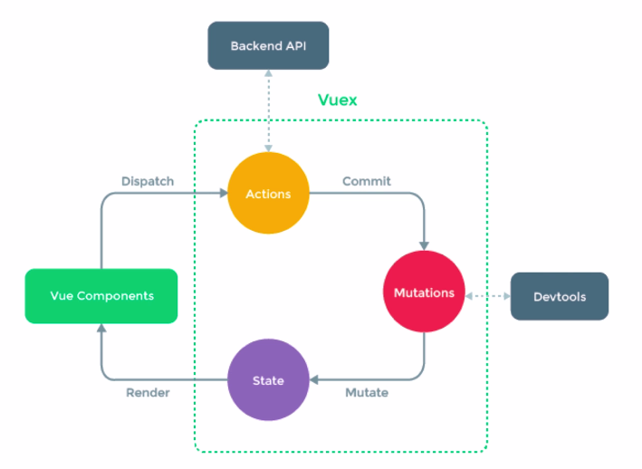

###  Vue-router

* 路由模式( hash、H5 history )
* 路由配置(动态路由、懒加载)
  * 动态路由是指可以在路径中携带参数
  * 懒加载是指异步加载

* Vue-router路由模式
  * hash模式(默认) ,如`http://abc.com/#/user/10`
  * H5 history模式,如`http://abc.com/user/20`    
    * 需要server端支持，因此无特殊需求可选择前者
    * [后端支持的原因和使用官方教程](https://router.vuejs.org/zh/guide/essentials/history-mode.html)

```js
// 路由设置为history
import { createRouter, createWebHistory } from 'vue-router'

const router = createRouter({
  history: createWebHistory(),
  routes: [
    //...
  ],
})

```


##  Vue原理

###  组件化

####  数据驱动视图

* 传统组件,只是静态渲染,更新还要依赖于操作DOM，
* 数据驱动视图- Vue MVVM， 不再需要操作DOM,更新数据即可使页面更新并渲染
* 数据驱动视图- React setState ，不再需要操作DOM,更新数据即可使页面更新并渲染

####  Vue中的MVVM

* 数据修改vue就可以实现自动驱动页面的渲染
* 不用开发者去操作DOM，可以专注于业务的开发，实现更复杂的功能

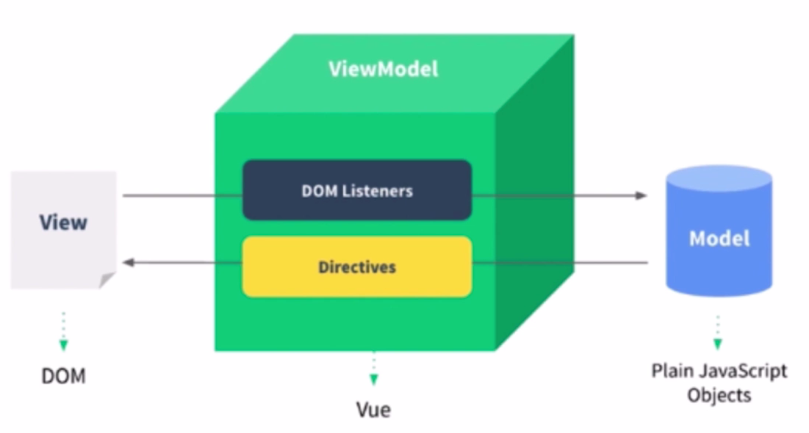

###  响应式

>  组件data的数据一旦变化,立刻触发视图的更新
>
>  [vue.js关于Object.defineProperty的利用原理](https://www.jianshu.com/p/07ba2b0c8fca/)
>
>  [Object.defineProperty方法（详解）](https://blog.csdn.net/weixin_46726346/article/details/115913752)

* 实现响应式的核心API —— **Object.defineProperty**

```js
//Object.defineProperty基本使用
// 案例1 属性本身没有
const data = {}
let name1 ='zhangsan'
Object.defineProperty(data,'name', {  //name表示在对象data上添加属性，属性名为name
  get: function () { 
    console.log( 'get') 
    return name1 // 不是data.name  而是外部在通过data.name访问时，返回name1的值
  },
  set: function (newVal) {
    console.log('set')
    name1 = newVal  // data.name 实际存储的位置
  }
});

//测试
console.log(data.name) //打印 get  zhangsan
data.name = 'lisi'  //打印 set
console.log(data.name) //打印 get  lisi


// 案例2 属性本身存在
const data = {
  name: 'zhangsan'
}
function observer(data,key,value){
  Object.defineProperty(data,'name', { 
    get: function () { 
      console.log( 'get')
      return value    // 指定data.name 获取的值
    },
    set: function (newVal) {
      console.log('set')
      value = newVal // newVal赋值给value后，value再赋值给data.name  从而实现对data.name的修改  避免形成zi'di
    }
  })
}

observer(data,'name',data.name)
//测试
console.log(data.name) //打印 get  zhangsan
data.name = 'lisi'  //打印 set
console.log(data.name) //打印 get  lisi


// 错误案例
const data = {
  name: 'zhangsan'
}
Object.defineProperty(data,'name', { 
  get: function () { 
    console.log( 'get')
    return data.name
  },
  set: function (newVal) {
    console.log('set')
    data.name = newVal
  }
})

//测试
console.log(data.name) //一直打印get  因为get函数中又执行了data.name, 无限循环的执行data.name, 无限循环的打印get
data.name = 'lisi'  //执行不到这里
console.log(data.name) //执行不到这里
```


* 深度监听data变化及监听数组变化
  * 深度监听data变化用到了递归的方式
  * 监听数组变化主要是对数组原生方法对数组的修改做到了监听

```js
// 触发更新视图
function updateView() {
    console.log('视图更新-Object.defineProperty监听')
}
// 触发更新视图
function updateViewArray() {
  console.log('视图更新-数组原生方法监听')
}

// 重新定义数组原型
const oldArrayProperty = Array.prototype
// 创建新对象，原型指向 oldArrayProperty ，再扩展新的方法不会影响原型
const arrProto = Object.create(oldArrayProperty);
['push', 'pop', 'shift', 'unshift', 'splice'].forEach(methodName => {
    arrProto[methodName] = function () {
        updateViewArray() // 触发视图更新
        oldArrayProperty[methodName].call(this, ...arguments)
        // Array.prototype.push.call(this, ...arguments)
    }
})

// 重新定义属性，监听起来
function defineReactive(target, key, value) {
    // 深度监听
    observer(value)

    // 核心 API
    Object.defineProperty(target, key, {
        get() {
            return value
        },
        set(newValue) {
            if (newValue !== value) {
                // 深度监听
                observer(newValue)

                // 设置新值
                // 注意，value 一直在闭包中，此处设置完之后，再 get 时也是会获取最新的值
                value = newValue

                // 触发更新视图
                updateView()
            }
        }
    })
}

// 监听对象属性
function observer(target) {
    if (typeof target !== 'object' || target === null) {
        // 不是对象或数组
        return target
    }

    // 污染全局的 Array 原型
    // Array.prototype.push = function () {
    //     updateView()
    //     ...
    // }

    if (Array.isArray(target)) {
        target.__proto__ = arrProto
    }

    // 重新定义各个属性（for in 也可以遍历数组）
    for (let key in target) {
        defineReactive(target, key, target[key])
    }
}

// 准备数据
const data = {
    name: 'zhangsan',
    age: 20,
    info: {
        address: '北京' // 需要深度监听
    },
    nums: [10, 20, 30]
}

// 监听数据
observer(data)

// 测试
// data.name = 'lisi'
// data.age = 21
// data.age = {num: 22}   // 设置新值需要深度监听的案例
// console.log('age', data.age.num)
// data.x = '100' // 新增属性，监听不到 —— 所以有 Vue.set
// delete data.name // 删除属性，监听不到 —— 所以有 Vue.delete
// data.info.address = '上海' // 深度监听
data.nums.push(4) // 特殊处理的方式监听数组
console.log(data.nums)
data.nums = [1,2,3,4] // Object.defineProperty的方式监听数组
console.log(data.nums)// 打印结果[1,2,1000,4] 因为后面对nums[2]做了修改，而数组是堆栈存储，存储的是同一个位置所以会影响
data.nums[2] = 1000 // Object.defineProperty的方式监听数组
console.log(data.nums) // 打印结果[1,2,1000,4]
```


* Object.defineProperty的一些缺点( Vue3.0启用Proxy )
  * 深度监听，需要递归到底，一次性计算量大
  * 无法监听新增属性/删除属性(用Vue.set和 Vue.delete专门来处理新增和删除属性的响应式 )
  * 无法原生监听数组，需要特殊处理，
    * 即原生数组的方法（push、pop、shift等等）对数组的修改无法通过Object.defineProperty监听到，所以需要对这些原生方法做特殊处理，
    * 通过索引对数组的修改可以通过Object.defineProperty监听到																																																																																													
* Proxy有兼容性问题，Proxy兼容性不好,且无法polyfill


###  虚拟DOM和diff

####  **虚拟DOM**

**虚拟DOM的解决方案:**

* 用JS模拟DOM结构，计算出最小的变更（最小单元需要修改的dom），操作DOM

* 用js的原因：js的计算远快于dom更新

**用JS模拟DOM结构：**

```html
<div id="div1" class=container"">
    <p>vdom</p>
    <ul style="font-size: 20px">
        <li>a</li>
    </ul>
</div>
```

```js
// 用vnode模拟上面的html片段 
{
    tag:'div',
    props:{
        id: 'div1',
        className: 'container'
    },
    children:[
       {
           tag: 'p',
           chuildren:'vdom'
       },
       {
           tag: 'ul',
           props:{
               sytle: 'font-size: 20px'
           },
           children: [
               tag: 'li',
               children: 'a'
           ]
       }
    ]
}
```

**通过snabbdom学习vdom：**

> [snabbdom英文文档](https://github.com/snabbdom/snabbdom)
>
> [snabbdom中文文档](https://github.com/coconilu/Blog/issues/152)
>
> [snabbdom-github](https://github.com/snabbdom/snabbdom)
>
> * 简洁强大的vdom库，易学易用
> * Vue参考它实现的vdom和diff
> * Vue3.0重写了vdom的代码，优化了性能

* 安装及使用 
  * 安装snabbdom：`npm i snabbdom`
  * 使用snabbdom: 官方文档有案例
* snabbdom核心内容
  * h函数
  * vnode数据结构  
  * patch函数 （比对新旧vnode就是用的diff算法）

```js
//h函数的返回值就是vnode结构
// sel: 标签   data:属性  children: 子节点
let vnode = h('sel', {data}, [children])

// sel: div标签，并有id=container, class=two, classes
// data: on（事件属性），click（事件类型）
// children: 可以是数组，数组元素是也是h函数返回的vnode,也可以是text类型的内容
const vnode = h("div#container.two.classes", { on: { click: someFn } }, [
  h("span", { style: { fontWeight: "bold" } }, "This is bold"),
  " and this is just normal text",
  h("a", { props: { href: "/foo" } }, "I'll take you places!"),
]);
```

```js
const container = document.getElementById("container")
//初始化，第一次执行render函数生成最初的vnode结构，并用它替换container容器的内容
patch(container, vnode)
//更新vdom， 数据变化触发响应式，重新执行render函数生成新的newVnode, 比较newVnode和vnode，计算最小的变更，并更新dom
patch(vnode, newVnode)
```

```js
//vnode结构
// sel: 标签   data:属性  children: 子节点 , text: 没有子节点，只有文本内容，
// elm: 这个vnode对应的实际dom标签, key: 循环体中传入的key, 若没有传则是undefine
{ sel, data, children, text, elm, key }
```


**vdom总结**

* 用JS模拟DOM结构(vnode)
* 新旧vnode对比,**得出最小的更新范围**,最后更新DOM
* 数据驱动视图的模式下, 有效控制DOM操作
* jQuery的更新是整体页面刷新，但是**vdom只更新需要更新的局部地方**，效率更高
  * 下面使用snabbdom构建例子解释


```js
// 定义 h
const h = snabbdom.h

const container = document.getElementById('container')

// 生成 vnode
const vnode = h('ul#list', {}, [
    h('li.item', {}, 'Item 1'),
    h('li.item', {}, 'Item 2')
])
patch(container, vnode)

document.getElementById('btn-change').addEventListener('click', () => {
    // 生成 newVnode
    const newVnode = h('ul#list', {}, [
        h('li.item', {}, 'Item 1'), // 更新时计算出该节点没有变化，所以不会操作该节点DOM
        h('li.item', {}, 'Item B'), // 更新时计算出该节点有变化(局部)，所以会操作该节点DOM
        h('li.item', {}, 'Item 3')  // 更新时计算出该节点有变化(局部)，所以会操作该节点DOM
    ])
    patch(vnode, newVnode)

    // vnode = newVnode // patch 之后，应该用新的覆盖现有的 vnode ，否则每次 change 都是新旧对比
})
```


####  **diff算法**

> [比较两个对象的diff算法-github](https://github.com/cujojs/jiff)

**diff算法概述**

* 树diff的时间复杂度O(n^3)
  * 第一，遍历tree1 ;
  * 第二, 遍历tree2
  * 第三, 排序
* 优化时间复杂度到O(n)
  * 只比较同一层级,不跨级比较
    * 树结构的同层级比较，是线性比较，时间复杂度O(n)
    * snabbdom中子节点的比较方式是：头对头，头对尾， 尾对尾，尾对头
* tag和key不相同,则直接删掉重建,不再深度比较
* tag和key ,两者都相同,则认为是相同节点,不再比较其它属性,直接继续比较其子节点

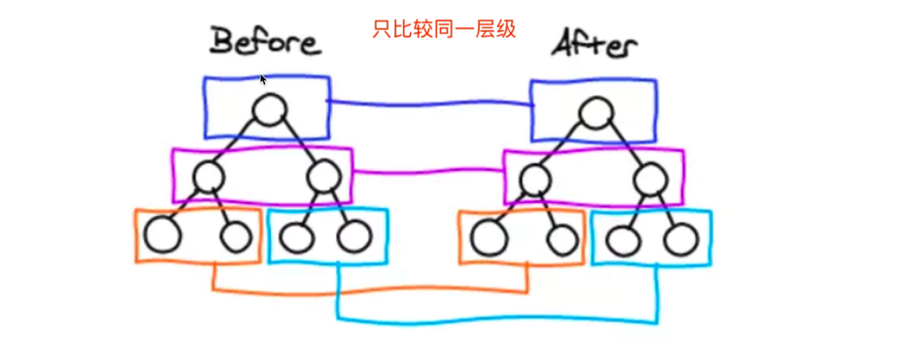

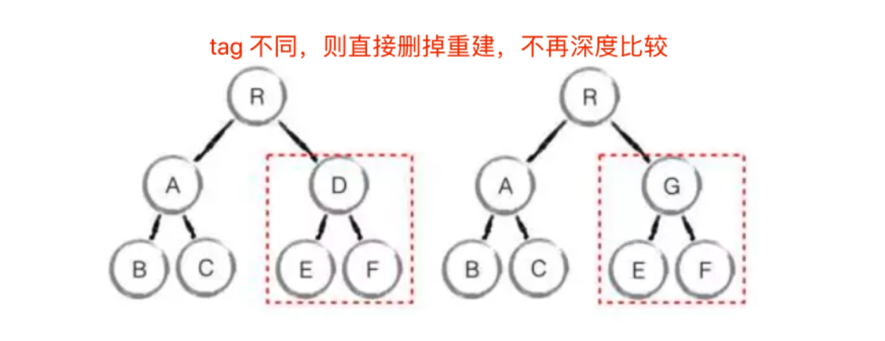

**diff源码解读-snabbdom源码**

* `patch()`

```ts
//patch()函数的大致逻辑,非源码

function patch(oldVnode: VNode | Element, vnode: VNode): VNode {
    //第一个参数是否是vnode
    if (!isVnode(oldVnode)) {
      //创建一个空的vnode，关联到这个实际的DOM元素,
      //对应patch(container, vnode)的container
      oldVnode = emptyNodeAt(oldVnode);
    }

    //相同的vnode(key和sel都相等)
    if (sameVnode(oldVnode, vnode)) {
      //对比两个vnode
      patchVnode(oldVnode, vnode, insertedVnodeQueue);

    //不同的vnode， 直接删掉重建
    } else {
      elm = oldVnode.elm!;
      parent = api.parentNode(elm) as Node;
      //重建
      createElm(vnode, insertedVnodeQueue);
    }
  };
```

* `sameVnode()`

```ts
//判断相同vnode的函数sameVnode()
function sameVnode(vnode1: VNode, vnode2: VNode): boolean {
  const isSameKey = vnode1.key === vnode2.key; //都不传key,则都为undefine,结果仍然为true
  const isSameIs = vnode1.data?.is === vnode2.data?.is;
  const isSameSel = vnode1.sel === vnode2.sel;

  return isSameSel && isSameKey && isSameIs;
}
```

* `patchVnode()`
  * oldCh和newCh都有Children则调用updateChildren 
  * newCh有Children, oldCh无Children则调用addVnodes
  * oldCh有Children, newCh无Children则调用removeVnodes


```ts
//patchVnode()函数的大致逻辑,非源码 

function patchVnode(
    oldVnode: VNode,
    vnode: VNode,
    insertedVnodeQueue: VNodeQueue
  ) {

    //设置vnode.elm
    const elm = (vnode.elm = oldVnode.elm)!;
    //旧的children
    const oldCh = oldVnode.children as VNode[];
    //新的children
    const ch = vnode.children as VNode[];
  
    //新的vnode.text === undefined (vnode.children !== undefined)
    if (isUndef(vnode.text)) {
      //新旧都有children
      if (isDef(oldCh) && isDef(ch)) {
        if (oldCh !== ch) updateChildren(elm, oldCh, ch, insertedVnodeQueue);
      //新children有，旧children无，（旧vnode可能有text）
      } else if (isDef(ch)) {
        //清空text
        if (isDef(oldVnode.text)) api.setTextContent(elm, "");
        //添加children
        addVnodes(elm, null, ch, 0, ch.length - 1, insertedVnodeQueue);
      //旧children有，新children无
      } else if (isDef(oldCh)) {
        //移除旧children
        removeVnodes(elm, oldCh, 0, oldCh.length - 1);
      //旧text有值
      } else if (isDef(oldVnode.text)) {
        //散出旧text
        api.setTextContent(elm, "");
      }

    //新的vnode.text !== undefined (vnode.children === undefined)
    //新的vnode.text !== 旧的vnode.text
    } else if (oldVnode.text !== vnode.text) {
      //移除旧children
      if (isDef(oldCh)) {
        removeVnodes(elm, oldCh, 0, oldCh.length - 1);
      }
      //设置新text
      api.setTextContent(elm, vnode.text!);
    }
  }
```

* `updateChildren()`
  * 头对头，头对尾， 尾对尾，尾对头的比较
  * 如何以上都没有命中则判断新节点中有没有key和老节点是一样的（v-for用key的原因）
    * 如果没有则直接添加新节点
    * 如果有则再判断是否sel(节点标签)也一样
      * 如果不是则直接添加新节点
      * 如果是（key和sel都相同）则调用patchVnode继续比较子节点


```ts
function updateChildren(
    parentElm: Node,
    oldCh: VNode[],
    newCh: VNode[],
    insertedVnodeQueue: VNodeQueue
  ) {

    while (oldStartIdx <= oldEndIdx && newStartIdx <= newEndIdx) {
      if (oldStartVnode == null) {
        oldStartVnode = oldCh[++oldStartIdx]; // Vnode might have been moved left
      } else if (oldEndVnode == null) {
        oldEndVnode = oldCh[--oldEndIdx];
      } else if (newStartVnode == null) {
        newStartVnode = newCh[++newStartIdx];
      } else if (newEndVnode == null) {
        newEndVnode = newCh[--newEndIdx];
      //开始和开始比对
      } else if (sameVnode(oldStartVnode, newStartVnode)) {
        patchVnode(oldStartVnode, newStartVnode, insertedVnodeQueue);
        oldStartVnode = oldCh[++oldStartIdx];
        newStartVnode = newCh[++newStartIdx];
      //结束和结束比对
      } else if (sameVnode(oldEndVnode, newEndVnode)) {
        patchVnode(oldEndVnode, newEndVnode, insertedVnodeQueue);
        oldEndVnode = oldCh[--oldEndIdx];
        newEndVnode = newCh[--newEndIdx];
      //旧children开始和新children结束比对
      } else if (sameVnode(oldStartVnode, newEndVnode)) {
        // Vnode moved right
        patchVnode(oldStartVnode, newEndVnode, insertedVnodeQueue);
        api.insertBefore(
          parentElm,
          oldStartVnode.elm!,
          api.nextSibling(oldEndVnode.elm!)
        );
        oldStartVnode = oldCh[++oldStartIdx];
        newEndVnode = newCh[--newEndIdx];
      //旧children结束和新children开始比对
      } else if (sameVnode(oldEndVnode, newStartVnode)) {
        // Vnode moved left
        patchVnode(oldEndVnode, newStartVnode, insertedVnodeQueue);
        api.insertBefore(parentElm, oldEndVnode.elm!, oldStartVnode.elm!);
        oldEndVnode = oldCh[--oldEndIdx];
        newStartVnode = newCh[++newStartIdx];
      //以上比对都未命中
      } else {
        if (oldKeyToIdx === undefined) {
          oldKeyToIdx = createKeyToOldIdx(oldCh, oldStartIdx, oldEndIdx);
        }
        //拿新节点key,能否对应上oldChildren中某个节点的key
        idxInOld = oldKeyToIdx[newStartVnode.key as string];
        //没对应导上
        if (isUndef(idxInOld)) {
          // New element
          api.insertBefore(
            parentElm,
            createElm(newStartVnode, insertedVnodeQueue),
            oldStartVnode.elm!
          );
        //对应上了
        } else {
          //对应上key的节点
          elmToMove = oldCh[idxInOld];
          //sel是否相等（sameVnode()的条件）
          if (elmToMove.sel !== newStartVnode.sel) {
            //新建
            api.insertBefore(
              parentElm,
              createElm(newStartVnode, insertedVnodeQueue),
              oldStartVnode.elm!
            );
          //sel相等， key相等
          } else {
            patchVnode(elmToMove, newStartVnode, insertedVnodeQueue);
            oldCh[idxInOld] = undefined as any;
            api.insertBefore(parentElm, elmToMove.elm!, oldStartVnode.elm!);
          }
        }
        newStartVnode = newCh[++newStartIdx];
      }
    }
  }
```


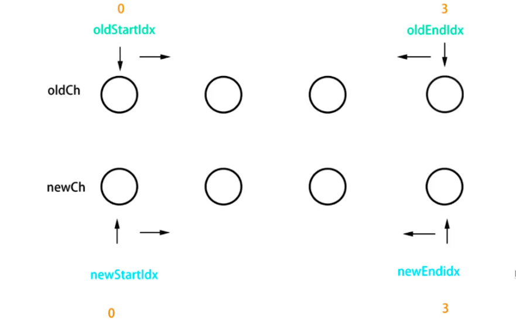

* diff算法总结
  * patchVnode
  * addVnodes removeVnodes
  * updateChildren ( key的重要性)


###  模板编译

#### **with语法**

* 改变{}内自由变量的查找规则,当做obj属性来查找
* 如果找不到匹配的obj属性,就会报错
* with要慎用,它打破了作用域规则,易读性变差

```js
const obj = {a: 100, b: 200} 
console.log(obj.a)
console.log(obj.b)
console.log(obj.c) //undefined
```

```js
//使用with,能改变{}内自由变量的查找方式
//将{}内自由变量，当做obj 的属性来查找
with(obj) {
console.log(a)
console.log(b)
console.log(c) //会报错! ! !
}

```

####  **理解模板编译**

* 模板不是html , 有指令、插值、JS 表达式,能实现判断、循环
* htmI是标签语言,只有JS才能实现判断、循环(图灵完备的)
* 因此，模板一定是转换为某种JS代码,即编译模板（将.vue文件中的模板编译成js代码的过程）
* 模板编译成的js代码就是render函数,执行render函数返回vnode
* 基于vnode再执行patch和diff ，实现虚拟dom, 页面渲染
* 使用webpack vue-loader , 会在开发环境下编译模板(重要，因为在开发环境下完成模板编译，使得生产环境不用再进行模板编辑，减少了计算，提高了性能)
* vue组件可以用render代替template

```js
Vue.component( 'heading', {
    render: function (createElement) {
        return createElement (
            'h' + this. Level,
            [
                createElement('a', {
                    attrs: {
                        name: ' headerId' ,
                        href: '#' + 'headerId'
                    }
                },'this is a tag')
            ]
        )
    }
})

//上面的render函数还原成模板，大概就是下面的写法
Vue.component( 'heading', {
    template:`
		<h1>
			<a name="headerId" href="headerId"/>
        </h1>
    `
})
```

####  vue中的模板编译

> 使用vue-template-compiler

**搭建测试环境**

* 新建测试文件夹
* 初始化

```js
npm init -y
```

* 安装vue-template-compiler

```js
npm install vue-template-compiler --save
```

* 新建index.js

* 运行

```js
node .\index.js
```

**实现模板编译相关函数理解**

```js
const compiler = require('vue-template-compiler')

// 插值
// const template = `<p>{{message}}</p>`
// with(this){return _c('p',[_v(_s(message))])}
// with(this){return createElement('p',[createTextVNode(toString(message))])}
// h -> vnode
// createElement -> vnode

// // 表达式
// const template = `<p>{{flag ? message : 'no message found'}}</p>`
// // with(this){return _c('p',[_v(_s(flag ? message : 'no message found'))])}

// // 属性和动态属性
// const template = `
//     <div id="div1" class="container">
//         
//     </div>
// `
// with(this){return _c('div',
//      {staticClass:"container",attrs:{"id":"div1"}},
//      [
//          _c('img',{attrs:{"src":imgUrl}})
//      ])}

// // 条件
// const template = `
//     <div>
//         <p v-if="flag === 'a'">A</p>
//         <p v-else>B</p>
//     </div>
// `
// with(this){return _c('div',[(flag === 'a')?_c('p',[_v("A")]):_c('p',[_v("B")])])}

// 循环
// const template = `
//     <ul>
//         <li v-for="item in list" :key="item.id">{{item.title}}</li>
//     </ul>
// `
// with(this){return _c('ul',_l((list),function(item){return _c('li',{key:item.id},[_v(_s(item.title))])}),0)}

// 事件
// const template = `
//     <button @click="clickHandler">submit</button>
// `
// with(this){return _c('button',{on:{"click":clickHandler}},[_v("submit")])}

// v-model
const template = `<input type="text" v-model="name">`
// 主要看 input 事件
// with(this){return _c('input',{directives:[{name:"model",rawName:"v-model",value:(name),expression:"name"}],attrs:{"type":"text"},domProps:{"value":(name)},on:{"input":function($event){if($event.target.composing)return;name=$event.target.value}}})}

// render 函数
// 返回 vnode
// patch

// 编译
const res = compiler.compile(template)
console.log(res.render)

// ---------------分割线--------------

// // 从 vue 源码中找到缩写函数的含义
// function installRenderHelpers (target) {
//     target._o = markOnce;
//     target._n = toNumber;
//     target._s = toString;
//     target._l = renderList;
//     target._t = renderSlot;
//     target._q = looseEqual;
//     target._i = looseIndexOf;
//     target._m = renderStatic;
//     target._f = resolveFilter;
//     target._k = checkKeyCodes;
//     target._b = bindObjectProps;
//     target._v = createTextVNode;
//     target._e = createEmptyVNode;
//     target._u = resolveScopedSlots;
//     target._g = bindObjectListeners;
//     target._d = bindDynamicKeys;
//     target._p = prependModifier;
// }

```

###  渲染过程


###  前端路由

> * hash模式(默认) ,如`http://abc.com/#/user/10`
> * H5 history模式,如`http://abc.com/user/20`

####  **hash模式**

```js
// http://127.0.0.1:8881/01-hash.html?a=100&b=20#/aaa/bbb
location.protocol // 'http: '
location.hostname // '127.0.0.1'
location.host// '127.0.0.1:8881'
location.port // '8881'
location.pathname // '/01-hash.html'
location.search // ' ?a=100&b=20'
location.hash // '#/aaa/bbb'
```

* hash模式特点
  * hash变化会触发网页跳转，即浏览器的前进、后退
  * hash 变化不会刷新页面，SPA（单页面应用）必需的特点
  * hash永远不会提交到server端（前端自生自灭）
* hash核心API
  * window.onhashchange

```html
<!DOCTYPE html>
<html lang="en">
<head>
    <meta charset="UTF-8">
    <meta name="viewport" content="width=device-width, initial-scale=1.0">
    <meta http-equiv="X-UA-Compatible" content="ie=edge">
    <title>hash test</title>
</head>
<body>
    <p>hash test</p>
    <button id="btn1">修改 hash</button>

    <script>
        // hash 变化，包括：
        // a. JS 修改 url
        // b. 手动修改 url 的 hash  z
        // c. 浏览器前进、后退
        window.onhashchange = (event) => {
            console.log('old url', event.oldURL)
            console.log('new url', event.newURL)

            console.log('hash:', location.hash)
        }

        // 页面初次加载，获取 hash
        document.addEventListener('DOMContentLoaded', () => {
            console.log('hash:', location.hash)
        })

        // JS 修改 url
        document.getElementById('btn1').addEventListener('click', () => {
            location.href = '#/user'
        })
    </script>
</body>
</html>
```


####  **H5 history**

* H5 history 模式特点
  * 用url规范的路由，但跳转时不刷新页面
  * 需要server端支持，因此无特殊需求可选择hash模式
    * 前端路由有很多个（多个url），所以需要后端在接受任何url的时候都返回主文件

```js
例如前端初始url: https://localhost/index
后端没有做配置的情况下：
浏览器输入 https://localhost/index, 后端会返回主文件（单页面应用的文件）
前端跳转了路由url变为: https://localhost/user , 此时刷新页面就会报错找不到该页面，因为后端只能默认响应 https://localhost/index的请求返回主文件，不能对路由变化的url做出响应

后端配置，设置任何路由形式的访问都返回主文件
此时前端路由变化后，再次刷新页面就可以正常请求到主文件了
```

* H5 history 的核心API
  * history.pushState  （新增时即做页面渲染，因为新增不触发window.onpopstate）
  * window.onpopstate(只有浏览器前进后退时才触发，history.pushState新增路由时不会触发)

```html
<!DOCTYPE html>
<html lang="en">
<head>
    <meta charset="UTF-8">
    <meta name="viewport" content="width=device-width, initial-scale=1.0">
    <meta http-equiv="X-UA-Compatible" content="ie=edge">
    <title>history API test</title>
</head>
<body>
    <p>history API test</p>
    <button id="btn1">修改 url</button>

    <script>
        // 页面初次加载，获取 path
        document.addEventListener('DOMContentLoaded', () => {
            console.log('load', location.pathname)
        })

        // 打开一个新的路由
        // 【注意】用 pushState 方式，浏览器不会刷新页面
        document.getElementById('btn1').addEventListener('click', () => {
            const state = { name: 'page1' }
            console.log('切换路由到', 'page1')  // 此处做页面渲染
            history.pushState(state, '', 'page1') // 重要！！
        })

        // 监听浏览器前进、后退
        window.onpopstate = (event) => { // 重要！！
            //这里的event.state就是上面history.pushState(state, '', 'page1')的state
            console.log('onpopstate', event.state, location.pathname) // 此处做页面渲染
        }

        // 需要 server 端配合，可参考
        // https://router.vuejs.org/zh/guide/essentials/history-mode.html#%E5%90%8E%E7%AB%AF%E9%85%8D%E7%BD%AE%E4%BE%8B%E5%AD%90
    </script>
</body>
</html>
```


**hash和H5 history选择**

* to B的系统推荐用hash ，简单易用，对url规范不敏感
* to C的系统，可以考虑选择H5 history ，但需要服务端支持


## 面试题汇总

1 v-show和v-if 的区别

* v-if条件为false时，对应的元素以及其子元素不会渲染。(通过Vue控制)  回流
* v-show条件为false时，对应的元素以及其子元素会渲染。只是将元素的display属性设置为none，所以没有显示出来。（通过css控制）重绘
* 总结：
  * 当需要在显示与隐藏之间切片很频繁时，使用v-show
  * 当只有少次切换时，通常使用v-if

2 为何v-for 中要用key

* 必须用key ，且不能是index和random
* diff 算法中通过tag和key来判断，是否是sameNode（结合比对方式）
* 减少渲染次数，提升渲染性能

3 描述Vue 组件生命周期（有父子组件的情况)

> [Chuckie's Blog - Vue](https://chuckiewill.github.io/2020/06/10/Vue/Vuejs/)

4 vue 组件如何通讯

> [Chuckie's Blog - Vue](https://chuckiewill.github.io/2020/06/10/Vue/Vuejs/)

* 父子组件props和this.$emit
* 自定义事件event.$no event.$off event.$emit
* vuex

5 描述组件渲染和更新的过程（一个组件渲染到页面,修改data触发更新(数据驱动视图)）

> * 响应式:监听data属性getter setter (包括数组)
> * 模板编译:模板到render函数,再到vnode
> * vdom : patch(elem, vnode)和patch(vnode, newVnode)

* 初始渲染过程
  * 解析模板为render函数(或在开发环境完成，通过webpack的vue-loader )
  * 触发响应式,监听data属性getter setter
  * 执行render函数,生成vnode， patch(elem, vnode),  *在这个过程中会触发getter*
* 更新过程.
  * 修改data，触发setter ( 此前在getter中已被监听)
  * 重新执行render函数,生成newVnode
  * patch(vnode, newVnode)
  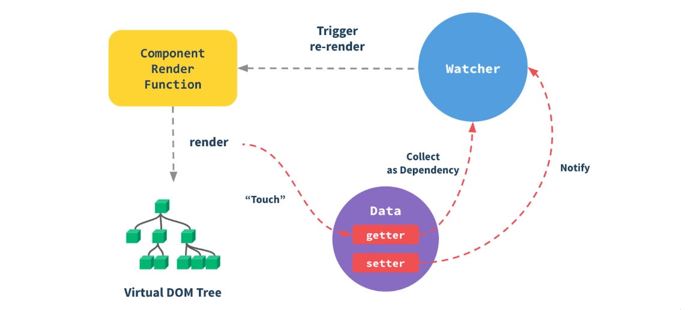
* 异步渲染
  * 回顾$nextTick
  * 汇总data的修改，一次性更新视图
  * 减少DOM操作次数,提高性能

6 双向数据绑定v-model的实现原理

* input元素的value = this.name(name是双向绑定的变量)
* 绑定input事件this.name = $event.target.value
* data 更新触发re-render

7 对MVVM的理解

> [Chuckie's Blog - Vue](https://chuckiewill.github.io/2020/06/10/Vue/Vuejs/)

8 computed 有何特点

* computed 的计算结果会缓存，data不变不会重新计算
* 提高性能

9 为何组件data必须是一个函数?

* 每个组件就是一个class是一个类，每次使用组件就是对它的实例化，实例化就会执行data()函数，就会为每个使用组件的地方产生一个自己独立的存储空间，每个实例化的组件在修改data属性时不会相互影响
* 如果data不是一个函数，而是一个对象，则每个实例化的组件data都会指向同一个存储地址，当一个组件修改data属性时，其它组件的data就也修改了，会使组件之间相互影响

10 ajax请求应该放在哪个生命周期

* mounted
* JS是单线程的，ajax异步获取数据
* 放在mounted之前没有用，只会让逻辑更加混乱，
* 若放在mounted之前，由于js是单线程，且ajax是异步请求，所以还是会先进行页面渲染，再网络请求，而mounted恰恰就是在页面渲染后触发

11 如何将组件所有props传递给子组件?

* $props
* `<User v-bind= "$props”/>`
* 细节知识点，优先级不高

12 自定义v-model

13 多个组件有相同的逻辑，如何抽离?

* mixin
* 以及 mixin的一些缺点

14 何时要使用异步组件?

* 加载大组件
* 路由异步加载

15 何时需要使用keep-alive ?

* 缓存组件，不需要重复渲染
* 如多个静态tab 页的切换

16 何时需要使用beforeDestory

* 解绑自定义事件event.$off
* 清除定时器
* 解绑自定义的DOM 事件，如window scroll 等

17 什么是作用域插槽

18 Vuex中action和mutation有何区别

* action中处理异步，mutation 不可以
* mutation做原子操作
* action可以整合多个mutation

19 Vue-router常用的路由模式

* hash 默认
* H5 history(需要服务端支持)
* 两者比较

20 如何配置Vue-router 异步加载

```js
export default new VueRouter(i
    routes: [
        {
            path: '/',
            component: ()=> import(
            	 //webpackChunkName:T"navigator"
           		 './ ../ components/Navigator'
            )
        },{
            path: ' /feedback ' ,
            component:()=> import(
           		 /* webpackChunkName: "feedback"*/
              	'./../ components/FeedBack'
            )
        }
    ]
})

```

21 请用vnode描述一个 DOM结构

22 监听data变化的核心API是什么

* Object.defineProperty
* 以及深度监听、监听数组
* 有何缺点

23 Vue如何监听数组变化

* Object.defineProperty不能监听数组变化
* 重新定义原型，重写push pop等方法，实现监听
* Proxy可以原生支持监听数组变化

24 请描述响应式原理

* 监听data变化
* 组件渲染和更新的流程

25 diff 算法的时间复杂度

* o(n)
* 在O(n^3)基础上做了一些调整（3个调整）

26 简述diff 算法过程

* patch(elem, vnode)和patch(vnode, newVnode)
* patchVnode和addVnodes和removeVnodes
* updateChildren ( key的重要性)

27 Vue为何是异步渲染，$nextTick何用?

* 异步渲染（以及合并data修改），以提高渲染性能
* $nextTick在 DOM更新完之后，触发回调, 但此时图片或视频的加载可能还没有完成

28 Vue常见性能优化方式

* 渲染

  * 合理使用v-show、v-if、keep-alive

  * 合理使用异步组件

  * v-for 时加key ，以及避免和v-if 同时使用

* 响应式

  * data层级不要太深（响应式原理结合）

* 缓存

  * 合理使用computed

* 资源利用

  * 自定义事件、DOM事件及时销毁

  * 使用vue-loader在开发环境做模板编译（预编译)


* 前端通用的性能优化
  * 图片懒加载
  * 代码压缩
  * CSS放在head ,JS放在body最下面
  * 尽早开始执行JS，用DOMContentLoaded触发
  * 对DOM查询进行缓存
  * 频繁DOM操作，合并到一起插入DOM结构
  * 防抖
  * 节流

* webpack层面的优化(后面会讲)

* 使用SSR

# 二、Vue3

> Vue3体积更小
>
> CompositionAPI*更好的类型推导？？？？？？*

##  Vue3优势

1 Vue3比 Vue2有什么优势?

* 性能更好
* *体积更小？？？？？*
* 更好的代码组织
* 更好的逻辑抽离
* 更好的ts支持
* 更多新功能

##  Vue3生命周期

2 描述Vue3生命周期

* Options API生命周期
  * beforeDestroy改为beforeUnmount（只改名）
  * destroyed改为unmouted（只改名）
  * 其他沿用Vue2的生命周期
* Composition API
  * 需要引入
  * setup()代替beforeCreate()和created()

```js
<script>
import { onBeforeMount, onMounted, onBeforeUpdate, onUpdated, onBeforeUnmount, onUnmounted } from 'vue'

export default {

    // setup 等于 beforeCreate 和 created
    setup() {
        console.log('setup')

        onBeforeMount(() => {
            console.log('onBeforeMount')
        })
        onMounted(() => {
            console.log('onMounted')
        })
        onBeforeUpdate(() => {
            console.log('onBeforeUpdate')
        })
        onUpdated(() => {
            console.log('onUpdated')
        })
        onBeforeUnmount(() => {
            console.log('onBeforeUnmount')
        })
        onUnmounted(() => {
            console.log('onUnmounted')
        })
    }
}
</script>
```

##  Composition API和Options API

3 如何看待Composition API和Options API ?

* Composition API (为大型项目而设计)
  * 更好的代码组织
  * 更好的逻辑复用(有一道专门的面试题)
  * *更好的类型推导？？？？？？*
* 如何选择?
  * 不建议共用，会引起混乱
  * 小型项目、业务逻辑简单，用Options API
  * 中大型项目、逻辑复杂，用Composition API
* 别误解Composition API
  * Composition API属于高阶技巧，不是基础必会
  * Composition API是为解决复杂业务逻辑而设计
  * Composition API就像Hooks在 React中的地位

##  ref、toRef、toRefs

4 如何理解ref toRef和toRefs ?

####  ref

* 生成值类型的响应式数据
* 可用于模板和reactive
* 通过`.value`修改值和获取值, 模板、reactive中获取不需要通过`.value`
* 通过ref可以获取到标签

```js
<template>
    <!-- 模板中获取不用.value -->
    <p>ref demo {{ageRef}} {{state.name}}</p>
</template>

<script>
import { ref, reactive } from 'vue'

export default {
    name: 'Ref',
    setup() {
        const ageRef = ref(20) // 值类型 响应式
        const nameRef = ref('Chuckie')

        const state = reactive({
            name: nameRef  //reactive中获取不用.value
        })

        setTimeout(() => {
            console.log('ageRef', ageRef.value)// 获取也用.value

            ageRef.value = 25 // .value 修改值
            nameRef.value = 'ChuckieA'
        }, 1500);

        return {
            ageRef,
            state
        }
    }
}
</script>
```

```js
//通过ref可以获取到标签
<template>
    <p ref="elemRef">我是一行文字</p>
</template>

<script>
import { ref, onMounted } from 'vue'

export default {
    name: 'RefTemplate',
    setup() {
        const elemRef = ref(null)

        onMounted(() => {
            console.log('ref template', elemRef.value.innerHTML, elemRef.value)
        })

        return {
            elemRef
        }
    }
}
</script>
```

####  toRef

* 一个普通对象要实现响应式用reactive
* reactive中对象的一个单独属性要单拎出来具有响应式用toRef
* toRef产出的值和reactive中原本的那个值指向同一个地址，修改会联动
* toRef 如果用于普通对象（非响应式对象），产出的结果不具备响应式

```js
<template>
    <p>toRef demo - {{ageRef}} - {{state.name}} {{state.age}}</p>
</template>

<script>
import { ref, toRef, reactive } from 'vue'

export default {
    name: 'ToRef',
    setup() {
        const state = reactive({
            age: 20,
            name: 'Chuckie'
        })

        const age1 = computed(() => {
            return state.age + 1
        })

        // // toRef 如果用于普通对象（非响应式对象），产出的结果不具备响应式
        // const state = {
        //     age: 20,
        //     name: 'Chuckie'
        // }

        const ageRef = toRef(state, 'age')

        setTimeout(() => {
            state.age = 25  //state.age和ageRef，因为它们指向同一个地址
        }, 1500)

        setTimeout(() => {
            ageRef.value = 30 //state.age和ageRef，因为它们指向同一个地址
        }, 3000)

        return {
            state,
            ageRef
        }
    }
}
</script>
```

####  toRefs

* 将响应式对象( reactive封装）转换为普通对象(但对象中的值还具有响应式)
* 对象的每个属性，都是 ref 对象
* 两者（响应式对象和转换成的普通对象）保持引用关系, 即修改是联动了（修改响应式对象属性（state），普通对象属性也会修改）
* 用toRefs(state)的目的是：在模板中使用state中的属性时不用再通过state.属性的方式获取，直接通过属性名就可以获取
* toRefs如果用于普通对象（非响应式对象），产出的结果不具备响应式

```vue
<template>
    <!-- 用toRefs后，就不用通过state.age, state.name这个繁琐的方式再获取了 -->
    <p>toRefs demo {{age}} {{name}}</p>
</template>

<script>
import { ref, toRef, toRefs, reactive } from 'vue'

export default {
    name: 'ToRefs',
    setup() {
        const state = reactive({
            age: 20,
            name: 'Chuckie'
        })

        const stateAsRefs = toRefs(state) // 将响应式对象，变成普通对象,但对象中的值还具有响应式

        // const { age: ageRef, name: nameRef } = stateAsRefs // 每个属性，都是 ref 对象
        // return {
        //     ageRef,
        //     nameRef
        // }

        return stateAsRefs  //具有响应式

        return {
          ...state//直接解构state后返回就不具备响应式了
        }
    }
}
</script>
```

####  最佳使用方式

* reactive做对象的响应式，用ref做值类型响应式
* setup中返回toRefs(state)，或者toRef(state,‘'xxx’)
* ref的变量命名都用xxxRef
* 合成函数返回响应式对象时，使用toRefs，便于使用方解构

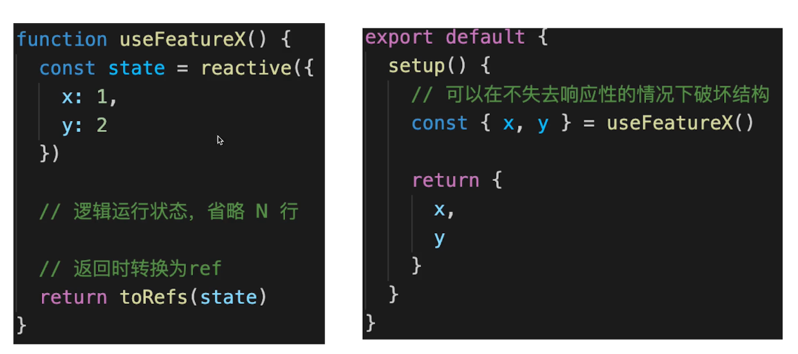

####  进阶，深入理解

* 为何需要ref ?
  * Vue3是用Proxy实现响应式，该方式只能对对象实现响应式，不能对值类型实现响应式，而ref使得值类型具有响应式
  * setup中返回值类型，会丢失响应式，而ref使得值类型具有响应式
  * 如在setup、computed、合成函数，都有可能返回值类型
  * Vue 如不定义ref ，用户将自造ref ，反而混乱

```js
// computed 返回的是一个类似于 ref 的对象，也有 .value  age1就是一个类似ref的对象
        const age1 = computed(() => {
            return state.age + 1
        })
```

* 为何需要.value ?
  * ref是一个对象（不丢失响应式) ，value存储值类型的值
  * 通过.value属性的get和set 实现响应式，将值类型转化为一个ref对象，ref对象的.value存储值类型的值，这时ref对象是一个对象就可以用Proxy实现对其属性的监听，就可以实现响应式了
  * 用于模板、reactive时，不需要.value，其他情况都需要
* 为何需要toRef toRefs ?
  * 初衷: 在不丢失响应式的情况下，对响应式对象的数据**实现解构**
  * 前提︰针对的是响应式对象( reactive封装的)非普通对象
  * 注意:不创造响应式，而是延续响应式

## Vue3升级

> [v3迁移指南](https://v3.cn.vuejs.org/guide/migration/introduction.html)

5 Vue3升级了哪些重要的功能?

####  createApp

```js
// vue2.x
const app = new Vue({/*选项*/ })
Vue.use(/* ...*/)
Vue.mixin(/* ..。*/)
Vue.component(/* ...*/)
Vue.directive(/* ...*/)

// vue3
const app = Vue.createApp({/*选项*/ })
app.use(/* ... */)
app.mixin(/* ...*/)
app.component(/* ...*/)
app.directive(/* ...*/)
```

####  emits属性

```js
//父组件
<template>
  <HelloWorld msg="Hello Vue 3.0 + Vite" @onSayHello="sayHello"/>
</template>

<script>
import HelloWorld from './components/HelloWorld.vue'

export default {
  name: 'App',
  components: {
    HelloWorld,
  },
  methods: {
    sayHello(info) {
      console.log('hello', info)
    }
  }
}
</script>


//子组件
export default {
  emits: ['onSayHello'],
  setup(props, { emit }) {
    emit('onSayHello', 'vue3')//vue3是参数
  }
}
```


####  多事件

* 一个事件可以同时触发多个函数

```html
<!--在methods 里定义 one two两个函数-->
<button @click="one($event), two($event)">Submit</button>
```


####  Fragment

* vue2中`<template>`下必须有一个根标签包裹所有元素
* vue3中则不需要，可以直接在`<template>`下写标签

```html
<!-- vue2.x组件模板-->
<template>
    <div class="blog-post">
        <h3>{{title }}</h3>
        <div v-html="content"></div>
    </div>
</template>
```

```html
<!-- vue3 组件模板-->
<template>
    <h3>{{title}}</h3>
    <div v-html="content"></div>
</template>

```

####  v-model代替.sync

> [v3迁移指南-移除.sync](https://v3.cn.vuejs.org/guide/migration/v-model.html#v-model)
>
> 功能：使父组件传入子组件的属性随子组件的变化而实时变化
>
> 本质：一个语法糖，仍然是父子间通信的方式实现的

```js
<!-- vue 2.x-->
<MyComponent v-bind:title.sync="title"/>
<!-- vue 3.x-->
<MyComponent v-model:title="title" />
```

```html
<!--pageTitle是父组件的属性-->
<ChildComponent v-model:title="pageTitle" /> 
```

```js
// ChildComponent.vue

export default {
  props: {
    title: String 
  },
  emits: ['update:title'],//这是规定的写法
  methods: {
    changePageTitle(title) {
      this.$emit('update:title', title) 
    }
  }
}
```


####  异步组件

> [v3迁移指南-异步组件](https://v3.cn.vuejs.org/guide/migration/async-components.html)
>
> 需要使用`defineAsyncComponent`函数，`import { defineAsyncComponent } from 'vue'`

```js
const asyncModal = defineAsyncComponent(() => import('./Modal.vue'))
```

####  移除filter

> [v3迁移指南-移除过滤器](https://v3.cn.vuejs.org/guide/migration/filters.html#%E8%BF%87%E6%BB%A4%E5%99%A8)

####  Teleport

> [v3迁移指南-Teleport](https://v3.cn.vuejs.org/guide/teleport.html#teleport)
>
> 将弹出层直接挂载到body上

```js
app.component('modal-button', {
  template: `
    <button @click="modalOpen = true">
        Open full screen modal! (With teleport!)
    </button>

    <teleport to="body"> //也可以传送到其它标签下，例如#hello，即传送到id为hello的标签下
      <div v-if="modalOpen" class="modal">
        <div>
          I'm a teleported modal! 
          (My parent is "body")
          <button @click="modalOpen = false">
            Close
          </button>
        </div>
      </div>
    </teleport>
  `,
  data() {
    return { 
      modalOpen: false
    }
  }
})
```

####  Suspense

> [v3迁移指南-Suspense](https://v3.cn.vuejs.org/guide/migration/suspense.html#suspense)
> 
> 使用场景：配合异步组件使用，当异步组件没有加载完成时则显示loading状态

```vue
<template>
  <suspense>
    <template #default>
      <todo-list />
    </template>
    <template #fallback>
      <div>
        Loading...
      </div>
    </template>
  </suspense>
</template>

<script>
export default {
  components: {
    TodoList: defineAsyncComponent(() => import('./TodoList.vue'))
  }
}
</script>
```

####  Composition API

* reactive  实现响应式
* watch和watchEffect
* ref相关    
* setup  等于vue2中的beforeCreate和created
* readonly   只读
* 生命周期钩子函数

##  Composition API逻辑复用

6 Composition API 如何实现代码逻辑复用?

* 抽离逻辑代码到一个函数，这个函数可以在多个组件中使用，这就是逻辑复用
* 函数命名约定为useXxxx格式( React Hooks也是)
* 在setup 中引用useXxx函数，逻辑复用的函数就是合成函数

```vue
<template>
    <p>mouse position {{x}} {{y}}</p>
</template>

<script>
import { reactive } from 'vue'
import useMousePosition from './useMousePosition'

export default {
    name: 'MousePosition',
    setup() {
        const { x, y } = useMousePosition()
        return {
            x,
            y
        }
    }
}
</script>
```

```js
//useMousePosition.js
//监听鼠标位置变化，并实时显示到页面
import { ref, onMounted, onUnmounted } from 'vue'

function useMousePosition() {
    const x = ref(0)
    const y = ref(0)

    function update(e) {
        x.value = e.pageX
        y.value = e.pageY
    }

    onMounted(() => {
        console.log('useMousePosition mounted')
        window.addEventListener('mousemove', update)
    })

    onUnmounted(() => {
        console.log('useMousePosition unMounted')
        window.removeEventListener('mousemove', update)
    })

    return {
        x,
        y
    }
}

export default useMousePosition
```

##  Vue3响应式

7 Vue3如何实现响应式?

####  Proxy基本使用

> Proxy 与 Reflect 是 ES6 为了操作对象引入的 API
>
> [Proxy 与 Reflect用法](https://www.runoob.com/w3cnote/es6-reflect-proxy.html)

* Proxy结合Reflect的使用

```js
// const data = {
//     name: 'zhangsan',
//     age: 20,
// }
const data = ['a', 'b', 'c']

const proxyData = new Proxy(data, {
    // target: 传入的data, key: 键, receiver: proxyData
    get(target, key, receiver) {
        // 只处理本身（非原型的）属性，主要针对数组（数组ownKeys获取索引和length, 对象ownKeys获取键值）
        const ownKeys = Reflect.ownKeys(target)
        if (ownKeys.includes(key)) {
            console.log('get', key) // 监听
        }
        // console.log('get', key) // 监听
        const result = Reflect.get(target, key, receiver)//返回获取的键值
        return result // 返回结果
    },
    set(target, key, val, receiver) {
        //重复的数据，不处理, 数组操作时设置length其实是多余的，因为添加元素后，length自然就更新了
        if (val === target[key]) {
            return true
        }

        const result = Reflect.set(target, key, val, receiver)//设置成则返回true，否则false
        console.log('set', key, val)
        // console.log('result', result) // true
        return result // 是否设置成功
    },
    deleteProperty(target, key) {
        const result = Reflect.deleteProperty(target, key)//删除成则返回true，否则false
        console.log('delete property', key)
        // console.log('result', result) // true
        return result // 是否删除成功
    }
})

//测试
// 对象的测试
// proxyData.age  //触发get, 打印结果：get age
// proxyData.age = 30 //触发set, 打印结果set age 30
// delete proxyData.age //触发deleteProperty,打印结果delete property age

// 数组的测试
// proxyData.push('100')
// 1 不去重的情况（多次触发get和set）
// 打印结果
// get push  调用push函数时会先触发get获取push属性
// get length  再次触发get 获取length属性
// set 3 100    触发set 完成添加新属性
// set length 4  再次触发set 完成length的更新
// 2 去重的情况（在get中判断是获取本身属性才触发打印，在set中判断是不是重复设置才打印）
// 打印结果
// get length  length是本身的属性，所以会触发打印
// set 3 100
```

* Reflect作用
  * 和Proxy能力一一对应
  * 规范化、标准化、函数式
  * 替代掉Object上的工具函数, 让Object成为一个存粹的数据结构

```js
//Reflect.ownKeys()获取数组或对象的直接属性，即非原型属性
let target = [10,20,30]
condole.log(Reflect.ownKeys(target))// ["0", "1", "2", "length"]

let target = {a:10， b:20}
condole.log(Reflect.ownKeys(target))// ["a", "b"]
```

``` js
//理解规范化、标准化、函数式
const obj = {a : 100, b : 200}

'a' in obj //传统写法  
Reflect.has(obj, 'a') //Reflect写法

delete obj.b //传统写法 
Reflect.deleteProperty(obj, 'b')//Reflect写法
```

```js
//替代掉Object上的工具函数
const obj = {a : 100, b : 200}

Object.hasOwnPropertyNames(obj)//['a','b']
Reflect.ownKeys(obj)//['a','b']
```

####  Proxy实现响应式

> Proxy结合Reflect可以实现对数组和对象的监听，且可以监听删除和增加新属性，且递归深度监听效率更高，完美解决了vue2中用Object.defineProperty实现响应式的问题

* 深度监听，性能更好，
  * vue2的递归是一开始就递归到底了，
  * vue3中一开始只监听了data的第一层属性，深层属性在触发get时才递归到底进行监听，
  * 即vue2中一开始就实现了对所有属性的监听，vue3中深层属性在触发get时才进入监听状态
* 可监听新增/删除属性
* 可监听数组变化，支持数组原生方法

* Proxy无法兼容所有浏览器，无法polyfill
```js
function addViewUp(){
  console.log('新增属性页面更新')
}
function editViewUp(){
  console.log('修改属性页面更新')
}
function deleteViewUp(){
  console.log('删除属性页面更新')
}
// 创建响应式
function reactive(target = {}) {
    if (typeof target !== 'object' || target == null) {
        // 不是对象或数组，则返回
        return target
    }

    // 代理配置
    const proxyConf = {
        get(target, key, receiver) {
            const result = Reflect.get(target, key, receiver)
        
            // 只对本身（非原型的）属性进行深度监听
            const ownKeys = Reflect.ownKeys(target)
            let deepRes = null
            if (ownKeys.includes(key)) {
              // 深度监听
              deepRes = reactive(result)
            }
            return deepRes
        },
        set(target, key, val, receiver) {
            // 重复的数据，不处理
            if (val === target[key]) {
                return true
            }
    
            const ownKeys = Reflect.ownKeys(target)
            let isNewKey = true // 新增key 新增属性
            if (ownKeys.includes(key)) {
              isNewKey = false  // 已有key 修改属性
            }

            const result = Reflect.set(target, key, val, receiver)
            if(isNewKey){//新增属性视图更新
              addViewUp()
            }else{//修改属性视图更新
              editViewUp()
            }
            return result // 是否设置成功
        },
        deleteProperty(target, key) {
            const result = Reflect.deleteProperty(target, key)
            deleteViewUp() // 删除属性试图更新
            return result // 是否删除成功
        }
    }

    // 生成代理对象
    const observed = new Proxy(target, proxyConf)
    return observed
}

// 测试数据
const data = {
    name: 'zhangsan',
    age: 20,
    info: {
        city: 'beijing',
        a: {
            b: {
                c: {
                    d: {
                        e: 100
                    }
                }
            }
        }
    }
}

// 生成响应式对象
const proxyData = reactive(data)
console.log(proxyData.info.city)
proxyData.info.a.b.c.d.e = 'xxxx'
delete proxyData.name
proxyData.xxx = 'xxxx'

// 打印结果
beijing
修改属性页面更新
删除属性页面更新
新增属性页面更新
```

##  watch 和watchEffect

8 watch 和watchEffect的区别是什么?

* 两者都可监听data属性变化
* watch
  * 需要开发者明确指定监听哪个属性
  * 深度监听时**拿不到旧值**，因为深度监听的对象是引用类型，oldValue和newValue指向同一个地址
* watchEffect 
  * 会根据其中的属性，自动监听其变化，即代码块中某个属性变化了就会触发
  * 初始化时，一定会执行一次（收集要监听的数据），类似watch的immediate:为true

```vue
<template>
    <p>watch vs watchEffect</p>
    <p>{{numberRef}}</p>
    <p>{{name}} {{age}}</p>
</template>

<script>
import { reactive, ref, toRefs, watch, watchEffect } from 'vue'

export default {
    name: 'Watch',
    setup() {
        const numberRef = ref(100)
        const state = reactive({
            name: 'chuckie',
            age: 20,
            a:{
              b:100
            }
        })

        watchEffect(() => {
            // 初始化时，一定会执行一次（收集要监听的数据）
            console.log('hello watchEffect')
        })
        watchEffect(() => {
            console.log('state.name', state.name)//name变化时触发
            // 也可以在这里调用一个函数，函数内部有响应式数据变化也会触发watchEffrctd
        })
        watchEffect(() => {
            console.log('state.age', state.age)//age变化时触发
        })
        watchEffect(() => {
            //以下任何一个变量变化都会触发下面的代码执行
            console.log('state.age', state.age)
            console.log('state.name', state.name)
        })

        watch(numberRef, (newNumber, oldNumber) => {
            console.log('ref watch', newNumber, oldNumber)
        }
        // , {
        //     immediate: true // 初始化之前就监听，可选
        // }
        )

        setTimeout(() => {
            numberRef.value = 200
        }, 1500)

        watch(
            // 第一个参数，确定要监听哪个属性
            () => state.a,

            // 第二个参数，回调函数
            (newAge, oldAge) => {
                console.log('state watch', newAge, oldAge)//深度监听时，newAge和oldAge的值相同，因为newAge, oldAge是引用类型，指向同一个地址
            },

            // 第三个参数，配置项
            {
                immediate: true, // 初始化之前就监听，可选
                deep: true // 深度监听
            }
        )

        setTimeout(() => {
            state.a.b = 25
        }, 1500)

        return {
            numberRef,
            ...toRefs(state)
        }
    }
}
</script>
```

##  setup获取实例

9 setup 中如何获取组件实例?

* 在setup和其他Composition API中没有this
* 可通过`getCurrentInstance`获取当前实例
* 若使用Options API可照常使用this

```vue
<script>
import { onMounted, getCurrentInstance } from 'vue'
export default {
    name: 'GetInstance',
    data() {
        return {
            x: 1
        }
    },
    setup() {
        const instance = getCurrentInstance()  
        onMounted(() => {
            console.log('x', instance.data.x)
        })  
    }
}
</script>
```

##  Vue3为何比 Vue2快

10 Vue3为何比 Vue2快?

####  Proxy响应式

* 深度监听不用在第一次就一次性递归到底，在使用深层属性时才递归并实现监听

####  PatchFlag

> [Vue3模板编译测试工具：Vue3 Template Explorer](https://vue-next-template-explorer.netlify.app/)

* 编译模板时,动态节点做标记，分为不同的类型,如TEXT、 PROPS、CLASS等
  * 动态节点:  有插值表达式（有变量需要vue底层处理）的节点
  * 静态节点：纯写死的节点，没有变量需要处理


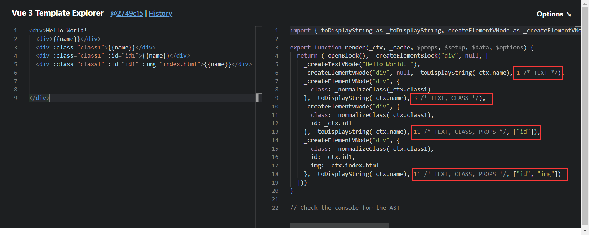

* diff算法时，可以区分静态节点,以及不同类型的动态节点，从而优化diff算法
  * 只有标记了PatchFlag的vnode才进行比对

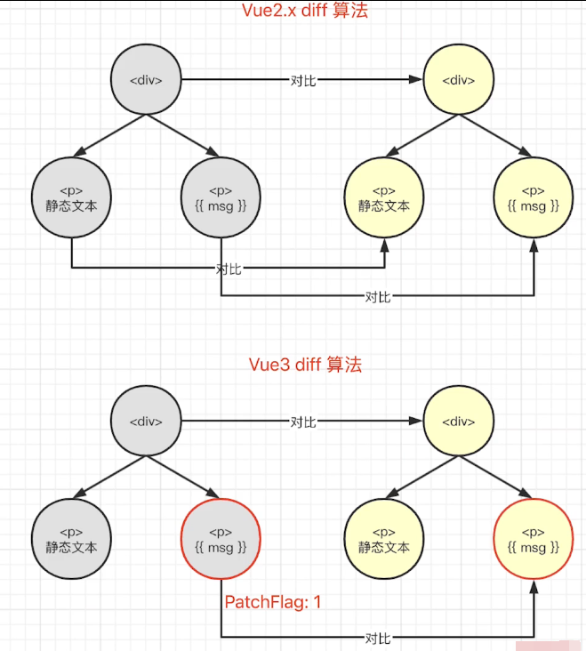


####  hoistStatic

* 将静态节点的定义,提升到父作用域,缓存起来（空间换时间）
* 多个(到一定的阈值后才会合并)相邻的静态节点,会被合并起来（编译优化）

```html
<div>
  <div>Hello World</div>
  <div>Hello World</div>
  <div>Hello World</div>
  <div :id= "ids">{{msg}}</div>
</div>
```

```js
const _hoisted_1 = /*#__PURE__*/_createElementVNode("div", null, "Hello World", -1 /* HOISTED */)  // 静态节点缓存起来
const _hoisted_2 = /*#__PURE__*/_createElementVNode("div", null, "Hello World", -1 /* HOISTED */)
const _hoisted_3 = /*#__PURE__*/_createElementVNode("div", null, "Hello World", -1 /* HOISTED */)
const _hoisted_4 = ["id"]

export function render(_ctx, _cache, $props, $setup, $data, $options) {
  return (_openBlock(), _createElementBlock("div", null, [
    _hoisted_1,  // 静态节点缓存起来
    _hoisted_2,
    _hoisted_3,
    _createElementVNode("div", { id: _ctx.ids }, _toDisplayString(_ctx.msg), 9 /* TEXT, PROPS */, _hoisted_4)
  ]))
}
```


####  cacheHandler

* 缓存事件（空间换时间），每次执行render函数生成vnode时不用重新定义函数

```html
<div>
  <div @click="clickHander">Hello World</div>
</div>
```

```js
export function render(_ctx, _cache, $props, $setup, $data, $options) {
  return (_openBlock(), _createElementBlock("div", null, [
    _createElementVNode("div", {
      onClick: _cache[0] || (_cache[0] = (...args) => (_ctx.clickHander && _ctx.clickHander(...args)))
    }, "Hello World")
  ]))
}

```


####  tree-shaking

* 模板编译时,根据不同的情况，引入不同的API（从vue中引入的进行模板编译的API），需要使用才引入

####  SSR 优化

> 使用SSR时就不能使用hoistStatic、cacheHandler

* 静态节点直接输出,绕过了vdom，即静态节点直接转换成了字符串  （编译优化）
* 动态节点,还是需要动态渲染

```html
<div>
  <div >Hello World</div>
  <div >Hello World</div>
  <div >Hello World</div>
  <div @click="clickHander">Hello World</div>
</div>
```

```js
import { mergeProps as _mergeProps } from "vue"
import { ssrRenderAttrs as _ssrRenderAttrs } from "vue/server-renderer"

export function ssrRender(_ctx, _push, _parent, _attrs, $props, $setup, $data, $options) {
  const _cssVars = { style: { color: _ctx.color }}
  _push(`<div${_ssrRenderAttrs(_mergeProps(_attrs, _cssVars))}><div>Hello World</div><div>Hello World</div><div>Hello World</div><div>Hello World</div></div>`)
}
```


##  Vite

11 Vite是什么?

* 一个前端打包工具，Vue作者发起的项目
* 借助Vue的影响力，发展较快，和webpack竞争
* 优势:开发环境下无需打包，启动快
  * 开发环境使用ES6 Module ，无需打包（不用转成es5）----非常快
  * 生产环境使用rollup ，并不会快很多

```html
<!DOCTYPE html>
<html>
<head>
    <meta charset="UTF-8">
    <meta name="viewport" content="width=device-width, initial-scale=1.0">
    <title>ES Module demo</title>
</head>
<body>
    <p>基本演示</p>
    <!-- 通过直接在script中插入module的方式就可以使用，ES6 Module -->
    <script type="module">
        import { add, multi } from './src/math.js'
        console.log('add res', add(10, 20))
        console.log('multi res', multi(10, 20))
    </script>
</body>
</html>
```

####  ES6 module

> 案例代码： L231-es-module-demo
>
> * 基本使用
> * 外链引入
> * 动态引入
> * 远程引入

**核心点：**

* 直接将代码通过ES6 Module的方式引入，不需要转换为ES5后再执行

##  Composition API和React Hooks

12 Composition API和 React Hooks的对比

* 前者setup只会被调用一次，而后者函数组件会被多次调用
* 前者无需useMemo（缓存数据） useCallback（缓存函数） ，因为setup只调用一次
* 前者无需顾虑调用顺序，而后者需要保证hooks的顺序一致
* 前者reactive + ref比后者useState ，要难理解


#  三、React

> * ？
>
>   * bind this
>
>   * 父子通信，子组件调用父组件方法

> [Chuckie's Blog-React](https://chuckiewill.github.io/categories/react/)

* React 组件如何通讯
* JSX本质是什么
* context是什么，有何用途?
* shouldComponentUpdate的用途
* 描述redux单项数据流 (手写流程图)
* setState是同步还是异步

##  React使用
###  React基础知识点

####  JSX基本使用

* 变量、表达式
* class style
* 子元素和组件

```jsx
import React from 'react'
import './style.css'
import List from '../List'

class JSXBaseDemo extends React.Component {
    constructor(props) {
        super(props)
        this.state = {
            name: 'chuckie',
            imgUrl: 'https://img1.mukewang.com/5a9fc8070001a82402060220-140-140.jpg',
            flag: true
        }
    }
    render() {
        // 获取变量 插值 {}  vs  vue中用{{}}
        const pElem = <p>{this.state.name}</p>
        return pElem

        // 表达式
        const exprElem = <p>{this.state.flag ? 'yes' : 'no'}</p>
        return exprElem

        // 子元素
        const imgElem = <div>
            <p>我的头像</p>
              // 静态属性
              // 动态属性
        </div>
        return imgElem

        // class
        const classElem = <p className={this.state.title}>设置 css class</p>  // 动态属性
        const classElem = <p className="title">设置 css class</p> // 静态属性
        return classElem

        // style
        const styleElem = <p style="fontSize: 30px,  color: blue">设置 style</p> // 静态属性
        const styleData = { fontSize: '30px',  color: 'blue' } 
        const styleElem = <p style={styleData}>设置 style</p> // 动态属性
        // 内联写法，注意 {{ 和 }}
        // const styleElem = <p style={{ fontSize: '30px',  color: 'blue' }}>设置 style</p> // 动态属性
        return styleElem

        // 原生 html
        const rawHtml = '<span>富文本内容<i>斜体</i><b>加粗</b></span>'
        const rawHtmlData = {
            __html: rawHtml // 注意，必须是这种格式
        }
        const rawHtmlElem = <div>
            <p dangerouslySetInnerHTML={rawHtmlData}></p>  // 解析为html再显示
            <p>{rawHtml}</p> // 不解析直接显示字符串
        </div>
        return rawHtmlElem

        // 加载组件
        const componentElem = <div>
            <p>JSX 中加载一个组件</p>
            <hr/>
            <List/>
        </div>
        return componentElem
    }
}

export default JSXBaseDemo

```

* 条件判断
  * if else
  * 三元表达式
  * 逻辑运算符`&&  ||`

```jsx
import React from 'react'
import './style.css'

class ConditionDemo extends React.Component {
    constructor(props) {
        super(props)
        this.state = {
            theme: 'black'
        }
    }
    render() {
        const blackBtn = <button className="btn-black">black btn</button>
        const whiteBtn = <button className="btn-white">white btn</button>

        // // if else
        // if (this.state.theme === 'black') {
        //     return blackBtn
        // } else {
        //     return whiteBtn
        // }

        // // 三元运算符
        // return <div>
        //     { this.state.theme === 'black' ? blackBtn : whiteBtn }
        // </div>

        // &&
        return <div>
            { this.state.theme === 'black' && blackBtn }
        </div>
    }
}

export default ConditionDemo
```

* 列表渲染
  * map
  * key  和vue中的key类似

```jsx
import React from 'react'

class ListDemo extends React.Component {
    constructor(props) {
        super(props)
        this.state = {
            list: [
                {
                    id: 'id-1',
                    title: '标题1'
                },
                {
                    id: 'id-2',
                    title: '标题2'
                },
                {
                    id: 'id-3',
                    title: '标题3'
                }
            ]
        }
    }
    render() {
        return <ul>
            { /* vue v-for */
                this.state.list.map(
                    (item, index) => {
                        // 这里的 key 和 Vue 的 key 类似，必填，不能是 index 或 random
                        return <li key={item.id}>
                            index {index}; id {item.id}; title {item.title}
                        </li>
                    }
                )
            }
        </ul>
    }
}

export default ListDemo

```

####  事件

* bind this
  * 对象普通方法需要使用bind this
    * 在构造函数中绑定  只用bind一次  性能更高
    * 不要在事件绑定的时候bind  这样每次触发事件都要bind一次 性能低
  * 对象静态方法(箭头函数)不需要使用bind this
* 关于event参数
  * vue中的event是原生事件
    * 事件被挂载在当前元素上
  * React中的event是对原生事件封装后的事件
    * 事件被挂载在document上， 和DOM事件、vue事件都不一样
      * React17开始事件不再被挂载到document上了
      * React17开始事件被挂载到root组件
      * 有利于多个React版本并存,例如微前端
    * React中通过event.nativeEvent获取原生事件
    * React封装后的事件模拟出了DOM事件所有能力
* 传递自定义参数

```jsx
import React from 'react'

class EventDemo extends React.Component {
    constructor(props) {
        super(props)
        this.state = {
            name: 'chuckie',
            list: [
                {
                    id: 'id-1',
                    title: '标题1'
                },
                {
                    id: 'id-2',
                    title: '标题2'
                },
                {
                    id: 'id-3',
                    title: '标题3'
                }
            ]
        }

        // 修改方法的 this 指向
        this.clickHandler1 = this.clickHandler1.bind(this)
    }
    render() {
        // // this - 使用 bind
        // return <p onClick={this.clickHandler1}>
        //     {this.state.name}
        // </p>

        // // this - 使用静态方法
        // return <p onClick={this.clickHandler2}>
        //     clickHandler2 {this.state.name}
        // </p>

        // // event
        // return <a href="https://imooc.com/" onClick={this.clickHandler3}>
        //     click me
        // </a>

        // 传递参数 - 用 bind(this, a, b)
        return <ul>{this.state.list.map((item, index) => {
            return <li key={item.id} onClick={this.clickHandler4.bind(this, item.id, item.title)}>
                index {index}; title {item.title}
            </li>
        })}</ul>
    }
    clickHandler1() {
        // console.log('this....', this) // this 默认是 undefined
        this.setState({
            name: 'lisi'
        })
    }
    // 静态方法，this 指向当前实例
    clickHandler2 = () => {
        this.setState({
            name: 'lisi'
        })
    }
    // 获取 event
    clickHandler3 = (event) => {
        event.preventDefault() // 阻止默认行为
        event.stopPropagation() // 阻止冒泡
        console.log('target', event.target) // 指向当前元素，即当前元素触发
        console.log('current target', event.currentTarget) // 指向当前元素，假象！！！

        // 注意，event 其实是 React 封装的。可以看 __proto__.constructor 是 SyntheticEvent 组合事件
        console.log('event', event) // 不是原生的 Event ，原生的是 MouseEvent
        console.log('event.__proto__.constructor', event.__proto__.constructor)

        // 原生 event 如下。其 __proto__.constructor 是 MouseEvent
        console.log('nativeEvent', event.nativeEvent)
        console.log('nativeEvent target', event.nativeEvent.target)  // 指向当前元素，即当前元素触发
        console.log('nativeEvent current target', event.nativeEvent.currentTarget) // 指向 document ！！！ 事件挂载的地方

        // 1. event 是 SyntheticEvent ，模拟出来 DOM 事件所有能力
        // 2. event.nativeEvent 是原生事件对象
        // 3. 所有的事件，都被挂载到 document 上
        // 4. 和 DOM 事件不一样，和 Vue 事件也不一样
    }
    // 传递参数
    clickHandler4(id, title, event) {
        console.log(id, title)
        console.log('event', event) // 最后追加一个参数，即可接收 event
    }
}

export default EventDemo

```

####  表单
* 受控组件
  * 可以理解为双向数据绑定
* input textarea select用value
* checkbox radio用checked

```jsx
import React from 'react'

class FormDemo extends React.Component {
    constructor(props) {
        super(props)
        this.state = {
            name: 'chuckie',
            info: '个人信息',
            city: 'beijing',
            flag: true,
            gender: 'male'
        }
    }
    render() {

        // // 受控组件（非受控组件，后面再讲）
        // return <div>
        //     <p>{this.state.name}</p>
        //     <label htmlFor="inputName">姓名：</label> {/* 用 htmlFor 代替 for */}
        //     <input id="inputName" value={this.state.name} onChange={this.onInputChange}/>
        // </div>

        // textarea - 使用 value
        return <div>
            {/* <textarea onChange={this.onTextareaChange}>{this.state.info}</textarea>  这种方式是错误的，要用value属性 */}
            <textarea value={this.state.info} onChange={this.onTextareaChange}/>
            <p>{this.state.info}</p>
        </div>

        // select - 使用 value
        return <div>
            <select value={this.state.city} onChange={this.onSelectChange}>
                <option value="beijing">北京</option>
                <option value="shanghai">上海</option>
                <option value="shenzhen">深圳</option>
            </select>
            <p>{this.state.city}</p>
        </div>

        // checkbox - 使用checked
        return <div>
            <input type="checkbox" checked={this.state.flag} onChange={this.onCheckboxChange}/>
            <p>{this.state.flag.toString()}</p>
        </div>

        // radio - 使用checked
        return <div>
            male <input type="radio" name="gender" value="male" checked={this.state.gender === 'male'} onChange={this.onRadioChange}/>
            female <input type="radio" name="gender" value="female" checked={this.state.gender === 'female'} onChange={this.onRadioChange}/>
            <p>{this.state.gender}</p>
        </div>

        // 非受控组件 - 后面再讲
    }
    onInputChange = (e) => {
        this.setState({
            name: e.target.value
        })
    }
    onTextareaChange = (e) => {
        this.setState({
            info: e.target.value
        })
    }
    onSelectChange = (e) => {
        this.setState({
            city: e.target.value
        })
    }
    onCheckboxChange = () => {
        this.setState({
            flag: !this.state.flag
        })
    }
    onRadioChange = (e) => {
        this.setState({
            gender: e.target.value
        })
    }
}

export default FormDemo

```

####  组件使用
* props传递数据
* props传递函数
* props类型检查

```jsx
import React from 'react'
import PropTypes from 'prop-types'

class Input extends React.Component {
    constructor(props) {
        super(props)
        this.state = {
            title: ''
        }
    }
    render() {
        return <div>
            <input value={this.state.title} onChange={this.onTitleChange}/>
            <button onClick={this.onSubmit}>提交</button>
        </div>
    }
    onTitleChange = (e) => {
        this.setState({
            title: e.target.value
        })
    }
    onSubmit = () => {
        const { submitTitle } = this.props // 拿到父组件的方法
        submitTitle(this.state.title) // 调用父组件的方法将参数传递给父组件

        this.setState({
            title: ''
        })
    }
}
// props 类型检查
Input.propTypes = {
    submitTitle: PropTypes.func.isRequired
}

class List extends React.Component {
    constructor(props) {
        super(props)
    }
    render() {
        const { list } = this.props

        return <ul>{list.map((item, index) => {
            return <li key={item.id}>
                <span>{item.title}</span>
            </li>
        })}</ul>
    }
}
// props 类型检查
List.propTypes = {
    list: PropTypes.arrayOf(PropTypes.object).isRequired
}

class TodoListDemo extends React.Component {
    constructor(props) {
        super(props)
        // 状态（数据）提升
        this.state = {
            list: [
                {
                    id: 'id-1',
                    title: '标题1'
                },
                {
                    id: 'id-2',
                    title: '标题2'
                },
                {
                    id: 'id-3',
                    title: '标题3'
                }
            ]
        }
    }
    render() {
        return <div>
            <Input submitTitle={this.onSubmitTitle}/>
            <List list={this.state.list}/>
        </div>
    }
    // 传递给子组件的方法
    onSubmitTitle = (title) => {
        this.setState({
            list: this.state.list.concat({
                id: `id-${Date.now()}`,
                title
            })
        })
    }
}

export default TodoListDemo

```

####  setState
* 不可变值 （赋值前不能修改原state, 对数组的操作都要是纯函数操作）
* 可能是异步更新 （传入对象或函数都是以下情况）
  * 正常使用是异步更新state，需要在回调函数中才能拿到state新值
  * 同步更新情况
    * setTimeout 中 setState 是同步的
    * 自己定义的 DOM 事件，setState 是同步的，例如在 componentDidMount 中自定义的事件
* 可能会被合并
  * 传入对象会合并
  * 传入函数不会合并

```jsx
import React from 'react'

// 函数组件（后面会讲），默认没有 state
class StateDemo extends React.Component {
    constructor(props) {
        super(props)

        // 第一，state 要在构造函数中定义
        this.state = {
            count: 0
        }
    }
    render() {
        return <div>
            <p>{this.state.count}</p>
            <button onClick={this.increase}>累加</button>
        </div>
    }
    increase = () => {
        // 第二，不要直接修改 state ，使用不可变值 ----------------------------
        // this.state.count++ // 错误
        this.setState({
            count: this.state.count + 1 // SCU
        })
        // 操作数组、对象的的常用形式，最下面有举例

        // 第三，setState 可能是异步更新（有可能是同步更新） ----------------------------
        
        this.setState({
            count: this.state.count + 1
        }, () => {
            // 联想 Vue $nextTick - DOM
            console.log('count by callback', this.state.count) // 回调函数中可以拿到最新的 state，此时打印的是1
        })
        console.log('count', this.state.count) // 异步的，拿不到最新值，此时打印的还是0

        // setTimeout 中 setState 是同步的
        setTimeout(() => {
            this.setState({
                count: this.state.count + 1
            })
            console.log('count in setTimeout', this.state.count)
        }, 0)

        // 自己定义的 DOM 事件，setState 是同步的。再 componentDidMount 中

        // 第四，state 异步更新的话，更新前会被合并 ----------------------------
        
        // 传入对象，会被合并（类似 Object.assign ）。执行结果只一次 +1
        this.setState({
            count: this.state.count + 1
        })
        this.setState({
            count: this.state.count + 1
        })
        this.setState({
            count: this.state.count + 1
        })
        
        // 传入函数，不会被合并。执行结果是 +3
        this.setState((prevState, props) => {
            return {
                count: prevState.count + 1
            }
        })
        this.setState((prevState, props) => {
            return {
                count: prevState.count + 1
            }
        })
        this.setState((prevState, props) => {
            return {
                count: prevState.count + 1
            }
        })
    }
    bodyClickHandler = () => {
        this.setState({
            count: this.state.count + 1
        })
        console.log('count in body event', this.state.count)
    }
    componentDidMount() {
        // 自己定义的 DOM 事件，setState 是同步的
        document.body.addEventListener('click', this.bodyClickHandler)
    }
    componentWillUnmount() {
        // 及时销毁自定义 DOM 事件
        document.body.removeEventListener('click', this.bodyClickHandler)
        // clearTimeout
    }
}

export default StateDemo

// -------------不要直接修改 state ，使用不可变值，数组和对象的处理------------

// 不可变值（函数式编程，纯函数） - 数组
const list5Copy = this.state.list5.slice() // 深拷贝
list5Copy.splice(2, 0, 'a') // 中间插入/删除
this.setState({
    list1: this.state.list1.concat(100), // 追加
    list2: [...this.state.list2, 100], // 追加
    list3: this.state.list3.slice(0, 3), // 截取
    list4: this.state.list4.filter(item => item > 100), // 筛选
    list5: list5Copy // 其他操作
})
// 注意，不能直接对 this.state.list 进行 push pop splice 等，这样违反不可变值

// 不可变值 - 对象
this.setState({
    obj1: Object.assign({}, this.state.obj1, {a: 100}),
    obj2: {...this.state.obj2, a: 100}
})
// 注意，不能直接对 this.state.obj 进行属性设置，这样违反不可变值

```

####  生命周期

> 以下是React17(含)以后的生命周期函数

* `componentDidMount()`  对应于vue中`mounted()`
* `componentDidUpdate() `对应于vue中`updated()`
* `componentWillUnmount()`对应于vue中`beforeUnmount()`

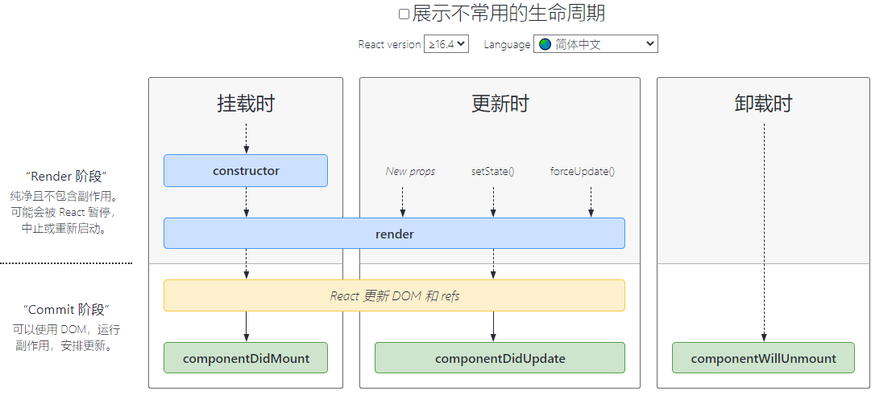

* `shouldComponentUpdate() `

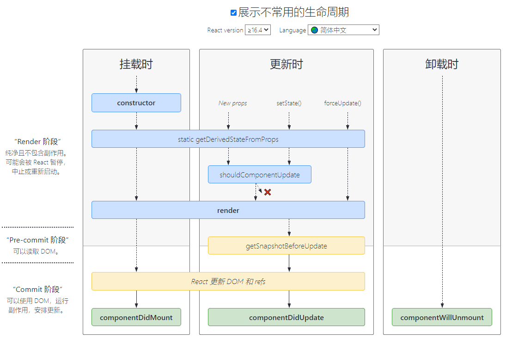

###  React高级特性

####  函数组件

* 纯函数,输入props, 输出JSX
* 没有实例,没有生命周期,没有state，**减少了性能的消耗，性能更高**
* 不能扩展其他方法

####  非受控组件

> 受控组件：自己实现双向绑定，通过state就可以拿到节点变化的value
>
> 非受控组件：state只是给节点赋初始值，后续节点value的变化与state无关，也就是不受state控制，如果要拿到节点变化的value只能在ref的配合下通过DOM拿到节点，再拿到实时变化的value
>
> 非受控组件使用场景：
>
> * 必须手动操作DOM元素, setState实现不了
> * 文件上传`<input type=file>`
> * 某些富文本编辑器,需要传入DOM元素

* ref
  * 类似vue中的ref，用于获取指定dom节点
* defaultValue defaultChecked
  * 给dom节点赋初始值
  * input textarea select给value赋值时要用defaultValue 
  * checkbox radio给checked赋值时要用defaultChecked
* 手动操作DOM元素
  * 获取dom节点的实时vaule

```jsx
import React from 'react'

class App extends React.Component {
    constructor(props) {
        super(props)
        this.state = {
            name: 'chuckie',
            flag: true,
        }
        this.nameInputRef = React.createRef() // 创建 ref
        this.fileInputRef = React.createRef()
    }
    render() {
        // input defaultValue
        return <div>
            {/* 使用 defaultValue 而不是 value ，使用 ref */}
            <input defaultValue={this.state.name} ref={this.nameInputRef}/>
            {/* state 并不会随着改变 */}
            <span>state.name: {this.state.name}</span>
            <br/>
            <button onClick={this.alertName}>alert name</button>
        </div>

        // checkbox defaultChecked
        return <div>
            <input
                type="checkbox"
                defaultChecked={this.state.flag}
            />
        </div>

        // file
        return <div>
            <input type="file" ref={this.fileInputRef}/>
            <button onClick={this.alertFile}>alert file</button>
        </div>

    }
    alertName = () => {
        const elem = this.nameInputRef.current // 通过 ref 获取 DOM 节点
        alert(elem.value) // 不是 this.state.name  而是dom节点实时变化的value
    }
    alertFile = () => {
        const elem = this.fileInputRef.current // 通过 ref 获取 DOM 节点
        alert(elem.files[0].name)
    }
}

export default App

```


####  Portals 

> 传送门，类似vue中Teleport

* 核心API: `ReactDOM.createPortal(模板，挂载的目标节点)`

```jsx
import React from 'react'
import ReactDOM from 'react-dom'

class PortalsDemo extends React.Component {
    constructor(props) {
        super(props)
        this.state = {
        }
    }
    render() {
        // // 正常渲染
        // return <div className="modal">
        //     {this.props.children} {/* 类似vue slot，this.props.children即是父组件传入的内容  */}
        // </div>

        // 使用 Portals 渲染到 body 上。
        // fixed 元素要放在 body 上，有更好的浏览器兼容性。
        return ReactDOM.createPortal(
            <div className="modal">{this.props.children}</div>,
            document.body // 挂载的目标DOM节点
        )
    }
}

export default PortalsDemo


// 父组件使用
 <PortalsDemo>Modal 内容</PortalsDemo>
```


####  context

> 使用场景：公共信息(语言、主题)传递给每个组件
>
> 不使用的原因：
>
> * 用props多层传递太繁琐
> * 用redux小题大做

```jsx
import React from 'react'

// 创建 Context 填入默认值（任何一个 js 变量）
const ThemeContext = React.createContext('light')

// 底层组件 - 函数是组件
function ThemeLink (props) {
    // const theme = this.context // 会报错。函数式组件没有实例，即没有 this

    // 函数式组件可以使用 Consumer 获取context属性的变化
    return <ThemeContext.Consumer>
        { value => <p>link's theme is {value}</p> }
    </ThemeContext.Consumer>
}

// 底层组件 - class 组件
class ThemedButton extends React.Component {
    // 指定 contextType 读取当前的 theme context。
    // static contextType = ThemeContext // 也可以用 ThemedButton.contextType = ThemeContext
    render() {
        const theme = this.context // React 会往上找到最近的 theme Provider，然后使用它的值。
        return <div>
            <p>button's theme is {theme}</p>
        </div>
    }
}
ThemedButton.contextType = ThemeContext // 指定 contextType 读取当前的 theme context。

// 中间的组件再也不必指明往下传递 theme 了。
function Toolbar(props) {
    return (
        <div>
            <ThemedButton />
            <ThemeLink />
        </div>
    )
}

// 顶层组件
class App extends React.Component {
    constructor(props) {
        super(props)
        this.state = {
            theme: 'light'
        }
    }
    render() {
        return <ThemeContext.Provider value={this.state.theme}>
            <Toolbar />
            <hr/>
            <button onClick={this.changeTheme}>change theme</button>
        </ThemeContext.Provider>
    }
    changeTheme = () => {
        this.setState({
            theme: this.state.theme === 'light' ? 'dark' : 'light'
        })
    }
}

export default App

```


####  异步组件
* import()
* React.lazy
* React.Suspense  和vue中的Suspense 类似

```jsx
import React from 'react'

const ContextDemo = React.lazy(() => import('./ContextDemo')) // 引入异步组件

class App extends React.Component {
    constructor(props) {
        super(props)
    }
    render() {
        return <div>
            <p>引入一个动态组件</p>
            <hr />
            {/* fallbac是默认展示的效果 */}
            <React.Suspense fallback={<div>Loading...</div>}> 
                <ContextDemo/>
            </React.Suspense>
        </div>

        // 1. 强制刷新，可看到 loading （看不到就限制一下 chrome 网速）
        // 2. 看 network 的 js 加载
    }
}

export default App

```

#### 高阶组件HOC

> 逻辑抽离

使用

```jsx
//高阶组件不是一种功能，而是一种模式
const HOCFactory = (Component) => {
  class HOC extends React. Component {
    //在此定义多个组件的公共逻辑
    render(){
      return <Component {... this.props} /> //返回拼装的结果
    }
  }
  return HOC
}
const EnhancedComponent1 = HOCFactory (WrappedComponent1)
const EnhancedComponent2 = HOCFactory (WrappedComponent2)
```

案例: 获取鼠标位置的公共需求

* withMouse中实现获取鼠标位置的功能
* 哪个组件需要使用这个功能，调用withMouse，并将组件自己传入，返回的则是加上这个功能后的组件

```jsx
import React from 'react'

// 高阶组件
const withMouse = (Component) => {
    class withMouseComponent extends React.Component {
        constructor(props) {
            super(props)
            this.state = { x: 0, y: 0 }
        }
  
        handleMouseMove = (event) => {
            this.setState({
                x: event.clientX,
                y: event.clientY
            })
        }
  
        render() {
            return (
                <div style={{ height: '500px' }} onMouseMove={this.handleMouseMove}>
                    {/* 1. 透传所有 props 2. 增加 mouse 属性 */}
                    <Component {...this.props} mouse={this.state}/>
                </div>
            )
        }
    }
    return withMouseComponent
}

const App = (props) => {
    const a = props.a
    const { x, y } = props.mouse // 接收 mouse 属性
    return (
        <div style={{ height: '500px' }}>
            <h1>The mouse position is ({x}, {y})</h1>
            <p>{a}</p>
        </div>
    )
}

export default withMouse(App) // 返回高阶函数
```


####  Render Props

> 逻辑抽离

使用

```jsx
// Render Props 的核心思想
//通过一个函数将class 组件的state 作为props 传递给纯函数组件
class Factory extends React.Component {
  constructor() {
    this.state = {
    /* state 即多个组件的公共逻辑的数据*/
    }
  }
  /*修改state*/
  render(){
    return <div>{this.praps.render(this.state)}</div> 
  }
}

const App = ()=>(
  <Factory render={ 
  /* render 是一个函数组件*/
    (props) => <p>{props.a} {props.b} ...</p>
  }/>
)  
```

案例

```jsx
import React from 'react'
import PropTypes from 'prop-types'

class Mouse extends React.Component {
    constructor(props) {
        super(props)
        this.state = { x: 0, y: 0 }
    }
  
    handleMouseMove = (event) => {
      this.setState({
        x: event.clientX,
        y: event.clientY
      })
    }
  
    render() {
      return (
        <div style={{ height: '500px' }} onMouseMove={this.handleMouseMove}>
            {/* 将当前 state 作为 props ，传递给 render （render 是一个函数组件） */}
            {this.props.render(this.state)}
        </div>
      )
    }
}
Mouse.propTypes = {
    render: PropTypes.func.isRequired // 必须接收一个 render 属性，而且是函数
}

const App = (props) => (
    <div style={{ height: '500px' }}>
        <p>{props.a}</p>
        <Mouse render={
            /* render 是一个函数组件 */
            ({ x, y }) => <h1>The mouse position is ({x}, {y})</h1>
        }/>
        
    </div>
)

/**
 * 即，定义了 Mouse 组件，只有获取 x y 的能力。
 * 至于 Mouse 组件如何渲染，App 说了算，通过 render prop 的方式告诉 Mouse 。
 */

export default App
```


###  React性能优化

####  shouldComponentUpdate (简称SCU )

* SCU默认返回true ，即React默认重新渲染所有子组件
* React为什么不直接底层支持比对来避免不必要的渲染，反而要开发者来进行比对，判断是否需要重新渲染
  * 因为比对必须配合"不可变值”的规则，但不是每个开发者都会遵循这个规则，如果没有遵循这个规则，则会在比对中报错，在报错和性能的抉择中React选择不出错
  * 可先不用SCU ,有性能问题时再考虑使用

```jsx
import React from 'react'
import PropTypes from 'prop-types'

class Input extends React.Component {
    constructor(props) {
        super(props)
        this.state = {
            title: ''
        }
    }
    render() {
        return <div>
            <input value={this.state.title} onChange={this.onTitleChange}/>
            <button onClick={this.onSubmit}>提交</button>
        </div>
    }
    onTitleChange = (e) => {
        this.setState({
            title: e.target.value
        })
    }
    onSubmit = () => {
        const { submitTitle } = this.props // 拿到父组件的方法
        submitTitle(this.state.title) // 调用父组件的方法将参数传递给父组件

        this.setState({
            title: ''
        })
    }
}
// props 类型检查
Input.propTypes = {
    submitTitle: PropTypes.func.isRequired
}

class List extends React.Component {
    constructor(props) {
        super(props)
    }
    render() {
        const { list } = this.props

        return <ul>{list.map((item, index) => {
            return <li key={item.id}>
                <span>{item.title}</span>
            </li>
        })}</ul>
    }
}
// props 类型检查
List.propTypes = {
    list: PropTypes.arrayOf(PropTypes.object).isRequired
}

class Footer extends React.Component {
    constructor(props) {
        super(props)
    }
    render() {
        return <p>
            {this.props.text}
            {this.props.length}
        </p>
    }
    componentDidUpdate() {
        console.log('footer did update')
    }
    // shouldComponentUpdate默认返回true
    shouldComponentUpdate(nextProps, nextState) {
        if (nextProps.text !== this.props.text
            || nextProps.length !== this.props.length) {
            return true // 值有变化才渲染
        }
        return false // 值没有变化则不重复渲染
    }

    // React 默认：父组件有更新，子组件则无条件也更新！！！
    // 性能优化对于 React 更加重要！
    // SCU 一定要每次都用吗？—— 需要的时候才优化
}

class TodoListDemo extends React.Component {
    constructor(props) {
        super(props)
        // 状态（数据）提升
        this.state = {
            list: [
                {
                    id: 'id-1',
                    title: '标题1'
                },
                {
                    id: 'id-2',
                    title: '标题2'
                },
                {
                    id: 'id-3',
                    title: '标题3'
                }
            ],
            footerInfo: '底部文字'
        }
    }
    render() {
        return <div>
            <Input submitTitle={this.onSubmitTitle}/>
            <List list={this.state.list}/>
            {/* Footer是静态节点，父组件每次更新其实它是不需要更新的，这里就需要用到shouldComponentUpdate */}
            <Footer text={this.state.footerInfo} length={this.state.list.length}/>
        </div>
    }
    onSubmitTitle = (title) => {
        this.setState({
            list: this.state.list.concat({
                id: `id-${Date.now()}`,
                title
            })
        })
    }
}

export default TodoListDemo

```

```jsx
// 注意“不可变值”的规则，否则shouldComponentUpdate中比对时就会报错
import React from 'react'
import PropTypes from 'prop-types'
import _ from 'lodash'

class Input extends React.Component {
    constructor(props) {
        super(props)
        this.state = {
            title: ''
        }
    }
    render() {
        return <div>
            <input value={this.state.title} onChange={this.onTitleChange}/>
            <button onClick={this.onSubmit}>提交</button>
        </div>
    }
    onTitleChange = (e) => {
        this.setState({
            title: e.target.value
        })
    }
    onSubmit = () => {
        const { submitTitle } = this.props
        submitTitle(this.state.title)

        this.setState({
            title: ''
        })
    }
}
// props 类型检查
Input.propTypes = {
    submitTitle: PropTypes.func.isRequired
}

class List extends React.Component {
    constructor(props) {
        super(props)
    }
    render() {
        const { list } = this.props

        return <ul>{list.map((item, index) => {
            return <li key={item.id}>
                <span>{item.title}</span>
            </li>
        })}</ul>
    }

    // 增加 shouldComponentUpdate
    shouldComponentUpdate(nextProps, nextState) {
        // _.isEqual 做对象或者数组的深度比较（一次性递归到底）
        if (_.isEqual(nextProps.list, this.props.list)) {
            // 相等，则不重复渲染
            return false
        }
        return true // 不相等，则渲染
    }
}
// props 类型检查
List.propTypes = {
    list: PropTypes.arrayOf(PropTypes.object).isRequired
}

class TodoListDemo extends React.Component {
    constructor(props) {
        super(props)
        this.state = {
            list: [
                {
                    id: 'id-1',
                    title: '标题1'
                },
                {
                    id: 'id-2',
                    title: '标题2'
                },
                {
                    id: 'id-3',
                    title: '标题3'
                }
            ]
        }
    }
    render() {
        return <div>
            <Input submitTitle={this.onSubmitTitle}/>
            <List list={this.state.list}/>
        </div>
    }
    onSubmitTitle = (title) => {
        // 正确的用法
        this.setState({
            list: this.state.list.concat({
                id: `id-${Date.now()}`,
                title
            })
        })

        // // 为了演示 SCU ，故意写的错误用法
        // this.state.list.push({
        //     id: `id-${Date.now()}`,
        //     title
        // })
        // this.setState({
        //     list: this.state.list
        // })
    }
}

export default TodoListDemo

```


####  PureComponent和React.memo

* PureComponent , SCU中实现了浅比较
* 通过PureComponent 构建的组件，不需要自己定义shouldComponentUpdate，因为已经默认有了shouldComponentUpdate，且对参数做了浅比较，若浅比较相等则返回false，不重复渲染；若浅比较不相等则返回true，重新渲染
* 浅比较已适用大部分情况(尽量不要做深度比较)

```jsx
class List extends React.PureComponent {
    constructor(props) {
        super(props)
    }
    render() {
        const { list } = this.props

        return <ul>{list.map((item, index) => {
            return <li key={item.id}>
                <span>{item.title}</span>
            </li>
        })}</ul>
    }
    shouldComponentUpdate() {/*浅比较*/}
}
```

* memo，函数组件中的PureComponent

```jsx
function MyComponent (props) {
  /* 使用props 渲染*/
}
function areEqual(prevProps,nextProps) {
  /*
  如果把nextProps 传入render 方法的返回结果与
  将prevProps 传入render 方法的返回结果一致则返回t rue,
  否则返回false
  */
}
export default React.memo(MyComponent, areEqual) ;
```


####  不可变值immutable.js

> Giuhub地址： [immutable.js]( https://github.com/immutable-js/immutable-js )

* 为了配合React中“不可变值”规则的使用，使用`immutable.js`就可以完全保证开发者时遵循"不可变值"规则的
* immutable.js基于共享数据(不是深拷贝) , 速度块
* 有一定学习和迁移成本,按需使用


###  Redux

####  基本概念

* store state
* action
* reducer

#### 单项数据流

* dispatch(action)
* reducer -> newState
* subscribe触发通知

#### react- redux

* `< Provider> connect`
* connect
* mapStateT oProps mapDispatchToProps

异步action
中间件

###  React-router


#  四、webpack

* 前端代码为何要进行构建和打包?
* module chunk bundle分别什么意思，有何区别?
* loader和plugin 的区别?
* webpack 如何实现懒加载?
* webpack常见性能优化
* babel-runtime和 babel-polyfill的区别


#  五、框架综合应用
* 基于React设计一个todolISt (组件结构，redux state 数据结构）
* 基于Vue设计一个购物车（组件结构，vuex state 数据结构)