---


title: 前端面试基础
date: 2020-01-02 10:43:17
tags:
- Index
categories:
- [Index]

---


>  L247 - 快速搞定前端技术一面 匹配大厂面试要求

#  一、HTML

> [Chuckie's Blog-HTML](https://chuckiewill.github.io/categories/html/)

* 如何理解HTML语义化?

* 默认情况下，哪些HTML标签是块级元素、哪些是内联元素?

#  二、CSS

> [Chuckie's Blog-CSS](https://chuckiewill.github.io/categories/css/)

###  2.1布局

####  盒子模型的宽度如何计算? 

* offsetWidth=(内容宽度＋内边距＋边框)，无外边距

```html
  div{
  	width:100px;// 即内容宽度
  	padding:10px;
  	border: 1px solid red
  }
  
  //offsetWidth = 122px
```

  

* 使offsetWidth === 设置的宽度，内边距和边框不占元素宽高，内容宽度会被压缩

  * `box-sizing:border-box;`

```html
    div{
    	width:100px;// 即盒子宽度   此时内容宽度为100-22=78px
    	padding:10px;
    	border: 1px solid red;
        box-sizing:border-box;
    }
    
    //offsetWidth = 100px
```

​    

####  margin 纵向重叠的问题

* 相邻元素的margin-top和margin-bottom 会发生重叠

* 空白内容的标签也会重叠

* 相邻元素之间的margin距离以**最大的那个margin**为准

  * 若中间有空白内容标签，则比较空白标签margin-top、空白标签margin-bottom、上方元素margin-bottom、下方元素margin-top, 哪个值大则为上方元素与下方元素之间的距离

```html
    <!DOCTYPE html>
    <html>
    <head>
        <meta charset="UTF-8">
        <meta name="viewport" content="width=device-width, initial-scale=1.0">
        <meta http-equiv="X-UA-Compatible" content="ie=edge">
        <title>margin 纵向重叠</title>
        <style type="text/css">
            p {
                font-size: 16px;
                line-height: 1;
                margin: 15px;
                background-color: aqua;
            }
            div{
              margin-top:70px;
              margin-bottom: 5px;
              background-color: blue;
    
            }
        </style>
    </head>
    <body>   
        <p>AAA</p>
        <div></div>
        <div></div>
        <p>hhhhh</p>
    </body>
    </html>
    
    //1 div会重叠
    //2 比较div的margin-bottom(5px)、div的margin-top(70px)、<p>AAA</p>的margin-bottom(15px)、<p>hhhhh</p>的margin-top(15px),其中最大的是70px，
    //3 所以<p>AAA</p>与<p>hhhhh</p>之间的margin距离是70px
```


####  margin负值的问题

* margin-top 和margin-left负值，元素向上、向左移动，会影响其他元素
* margin-right负值，右侧元素左移，自身不受影响
* margin-bottom负值，下方元素上移，自身不受影响

####  BFC理解和应用

* 什么是BFC
  * Block format context ，块级格式化上下文
  * 一块独立渲染区域，内部元素的渲染不会影响边界以外的元素
* 形成 BFC的常见条件
  * float 不是none
  * position是absolute或 fixed
  * overflow不是visible
  * display是flex inline-block 等

####  float布局的问题，以及clearfix（手写）

* 如何实现圣杯布局和双飞翼布局
* 圣杯布局和双飞翼布局的目的
  * 三栏布局，中间一栏最先加载和渲染（内容最重要)
  * 两侧内容固定，中间内容随着宽度自适应
  * —般用于PC网页
* clearfix **清除浮动**

#### flex画色子

* 实现一个三点色子
* flex主要属性
  * align-self（交叉轴子元素）
  * justify-content（主轴）
  * align-items（交叉轴）
  * flex-direction（方向，水平：row）

###  定位

####  absolute和relative分别依据什么定位?

* absolute： 依据最近一层的定位元素定位（absolute, fixed,relative,body）
* relative： 相对自己

#### 居中对齐有哪些实现方式?

* 水平居中
  * inline元素： `text-align: center`
    * inline元素的父元素中设置 `text-align: center`
    * 定义 `text-align: center`属性的子标签会继承这个属性
  * block元素：`margin:auto`
    * block元素自身设置`margin:auto`
    * block元素自身设置`text-align: center`可以使其内部的文字水平居中
  * absolute元素:left: 50% + margin-left负值
    * 父元素为定位元素（absolute, fixed,relative,body）
    * absolute元素自身设置`left:50%; margin-left:-absolute元素自身宽的一半`
      * `left:50% `是右移父元素宽的一半，即absolute元素右边移动到父元素的中轴
      *  `margin-left:-absolute元素自身宽的一半`是利用margin负值使自身左移
* 垂直居中
  * inline元素:line-height的值等于height值
  
    * 父元素中设置line-height的值等于height值
  
  * block元素内容
  
    * 设置block元素中的文字垂直居中：设置自身line-height的值等于height值
  
  * absolute元素: top:50% + margin-top 负值
  
    * 父元素为定位元素（absolute, fixed,relative,body）
    * absolute元素自身设置`top:50%; margin-top:-absolute元素自身高的一半`
      * `top:50% `是右移父元素高的一半，即absolute元素上边移动到父元素的中轴
      *  `margin-top:-absolute元素自身宽的一半`是利用margin负值使自身上移
  
  * absolute元素: transform(-50%,-50%)
  	* 次方法兼容性差
    * 此方法不用计算自身元素的宽高的一半
```css  position: absolute;
      left: 50%;//右移父元素宽的一半
      top: 50%;//下移父元素高的一半 
      transform: translate(-50%, -50%)//自身左移上移自身的宽高的一半
```

  * absolute元素: top, left, bottom,right = 0 + margin: auto

```css
      position: absolute;
      top: 0;
      left: 0;
      bottom: 0;
      right: 0;
      margin: auto;
```


###  图文样式

####  line-height的继承问题

* 写具体数值，如30px，则继承该值

```css
      body {
            font-size: 20px;
            line-height: 25px;
        }
        p {
            background-color: #ccc;
            font-size: 16px;
        }
        //p行高25px
        //此时是p继承了 line-height: 25px; 
```

  

* 写比例，如2、1.5，则继承该比例
```css
       body {
            font-size: 20px;
            line-height: 2;
        }
        p {
            background-color: #ccc;
            font-size: 16px;
        }
        //p行高  16px*2 ,所以行高为32px
        //此时是p继承了 line-height: 2; 然后计算出行高32px
```

​    

* 写百分比，如200%，则继承计算出来的值（考点)

```css
       body {
            font-size: 20px;
            line-height: 200%;//此时body行高40px
        }
        p {
            background-color: #ccc;
            font-size: 16px;
        }
        //p行高 20px*200% ,所以行高为40px
        //此时是body先计算出 line-height: 40px, 然后p标签继承了line-height: 40px
		//若此时body没有font-size:20px  则p的行高为16px*200%=32px
```


###  响应式

####  rem是什么?

* px，绝对长度单位，最常用，1px=2像素

* em ，相对长度单位，相对于父元素，不常用

* rem ，相对长度单位，相对于根元素，常用于响应式布局

```css
            html {
                font-size: 100px;
            }
            div {
                background-color: #ccc;
                margin-top: 10px;
                font-size: 0.16rem;//此时div的字体为0.16*100px=16px
            }
```

####  响应式布局的常见方案?  

* 使用media媒体查询，再根据不同屏幕尺寸设置html的font-size，再利用rem实现响应式

#### 网页视口尺寸

* `window.screen.height`//屏幕高度
* `window.innerHeight` //网页视口高度  
  * 屏幕减去页面上下导航的高度
* `document.body.clientHeight `// body高度 
  * body高度是根据内容变化的，内容越多高度就随之增加

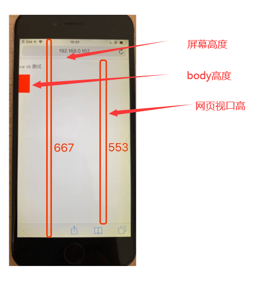

####  vh/vw

* 1vh = 网页视口高度的1/100
  *  window.innerHeight === 100vh
* 1vw = 网页视口宽度的1/100
  * window.innerWidth === 100vw

* 1vmax = max(1vh, 1vw)  //谁大取谁
* 1vmin = min(1vh, 1vw)  //谁小取谁


#  三、javascript

##  变量类型和计算

####  typeof 能判断哪些类型

* 识别所有值类型

  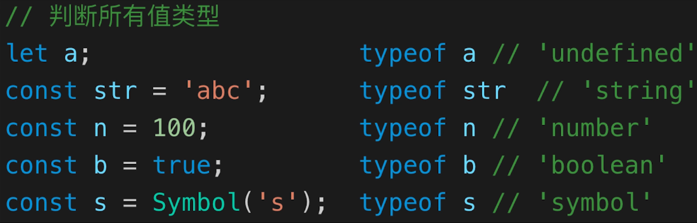

* 识别函数

* 判断是否是引用类型（不可再细分)

  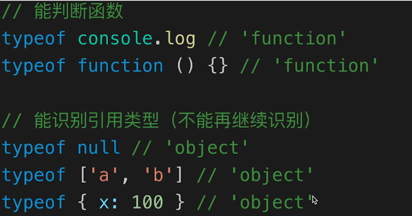


####  值类型和引用类型的区别

* 值类型

  * 值类型是用栈存储的

```js
  //值类型
  let a = 100
  let b = a
  a = 200
  console.log (b)//打印结果为 100
  
```

  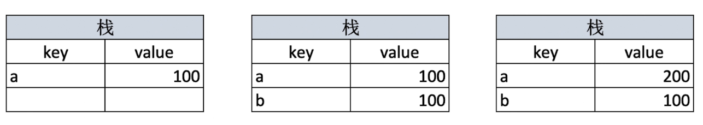

* 引用类型

  * 引用类型是同时用堆栈存储的，实际内容存在堆中，栈中只存储了内存地址，所以两个变量实际是指向同一个内存地址的

```js
  //引用类型
  let a = { age: 20 }
  let b = a
  b.age = 21
  console.log (a.age)//打印结果为 21
  
```

  

* 常见值类型
  * `let a `:  undefined类型
  * 字符串
  * 数字
  * 布尔
  * es6中的symbol
* 常见引用类型
  * 对象
  * 数组
  * `const n = null` //特殊引用类型，指向空地址
  * 函数  //特殊引用类型  不存储数据

####  数据类型转换

#####  字符串拼接

```js
const a = 100 + 10// 110
const b = 100 + '10'//'10010'
const c = true + '10'//'true10 '
const a = 100 + true// 101
const a = 100 + false// 100

```

#####  if语句和逻辑运算

* truly变量: `!!a === true`的变量
* falsely变量:` !!a === false`的变量

```js
//以下是falsely变量。除此之外都是truly变量
!!0 === false
!!NaN === false
!!'' == false
!!null === false
!!undefined === false
!!false === false
```


#### 何时使用===何时使用==

*  ==
  * `100 == '100' `true
  * `0 == ''  ` true
  * `0 == false ` true
  * `false == ' '  `  true
  * `null == undefined  `    true


**结论：**

```js
//除了== null 之外，其他都一律用===，例如
const obj = { x: 100 }
if (obj.a == null) { }
//相当于:
// if (obj.a === null || obj.a === undefined) {}

```

#### 手写深拷贝

*函数可以深拷贝吗？？？？*

```js
/**
 * 深拷贝
 * @param {Object} obj 要拷贝的对象
 */
function deepClone(obj = {}) {
    //只要不是数组和对象都原值返回
    if (typeof obj !== 'object' || obj == null) {
        // obj 是 null ，或者不是对象和数组，直接返回 typeof null === 'object'
        return obj
    }

    // 初始化返回结果
    let result
    if (obj instanceof Array) {
        result = []
    } else {
        result = {}
    }

    for (let key in obj) {
        // 保证 key 不是原型的属性
        //hasOwnProperty返回true则不是原型的属性
        if (obj.hasOwnProperty(key)) {
            // 递归调用！！！
            result[key] = deepClone(obj[key])
        }
    }

    // 返回结果
    return result
}
```


##  原型和原型链

> [Javascript(0x07)-JS中的原型链](https://chuckiewill.github.io/2020/10/03/Javascript/Javascript(0x07)-JS%E4%B8%AD%E7%9A%84%E5%8E%9F%E5%9E%8B%E9%93%BE/)

**如何准确判断一个变量是不是数组 ?**

* `a instanceof Array `

**手写一个简易的jQuery , 考虑插件和扩展性**

* 插件即在显示原型上添加属性：`a.prototype.x = mmmm`
* 扩展性即在继承

**class的原型本质,怎么理解?**

* 原型及原型链的理解


##  作用域和闭包

> apply，call,bind
>
> https://blog.csdn.net/a15180180753/article/details/103495023
>
> https://blog.csdn.net/wyyandyou_6/article/details/81488103
>
> https://www.cnblogs.com/moqiutao/p/7371988.html

1. this的不同应用场景，如何取值?
   * 当做普通函数被调用
   * 使用call apply bind
   * 作为对象方法调用
   * 在class的方法中调用
   * 箭头函数

2. 手写bind函数

3. 实际开发中闭包的应用场景，举例说明
   * 事件函数的封装
   * 隐藏数据
   * 用闭包模拟私有方法
   * dom生成10个标签，点击第几个标签就弹出数字几

###  作用域

* 全局作用域

  * 全局定义

* 函数作用域

  * 函数体内定义

* 块级作用域（ES6新增)

  * if、while、for的`{ }`块中定义

```js
  if(true){
      let x = 100
  }
  console.log(x)//会报错
```

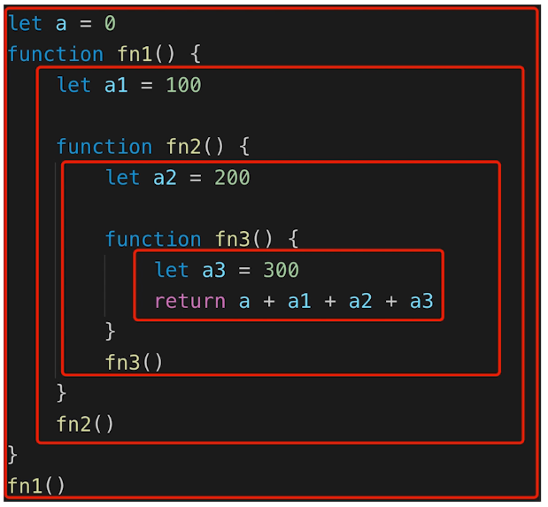

###  自由变量

* 自由变量定义：一个变量在当前作用域没有定义，但被使用了
* 向上级作用域，一层一层依次寻找，直至找到为止
* 如果到全局作用域都没找到，则报错xx is not defined

###  闭包

> **闭包就是能够读取其他函数内部变量的函数**
>
> 作用域应用的特殊情况，有两种表现:
>
> * 函数作为参数被传递
> * 函数作为返回值被返回

```js
//函数作为返回值
function create() {
    const a = 100
    return function () {
        console.log(a)
    }
}

const fn = create()
const a = 200
fn() // 100
```

```js
// 函数作为参数被传递
function print(fn) {
    const a = 200
    fn()
}
const a = 100
function fn() {
    console.log(a)
}
print(fn) // 100
```

**总结：**

* 所有的自由变量的查找，是在函数定义的地方，向上级作用域查找
* 不是在执行的地方查找！！！


###  this

> **this取什么值是在函数执行的时候确定的，不是在定义时确定的**

**情况1：**

* `.call()`函数会改变this指向，并且函数直接执行
* `.bind()`函数会改变this指向，并且需要接受返回的函数，然后再执行

```js
function fn1() {
  console.log(this)
}
fn1()// window

fn1.call({ x:100})// { x:100 }  此处函数直接执行
const fn2 = fn1.bind ({x: 200 })  //bind()函数可以重定义this的指向
fn2()// { x:200 }
```
**情况2：定时器**

* 定时器的回调函数中的this不再指向对象，而是指向window
  * 因为定时器的回调函数是挂在浏览器上执行的，所以this指向浏览器即window
  * 函数内的this指向调用该函数的对象


```js
const zhangsan = {
  name:'张三',
  sayHi() {
    // this 即当前对象
    console.log(this)
  },
  wait() { 
    setTimeout( function( ) {
      // this === window
      console.log(this)
    })
  }
}
zhangsan.sayHi()
zhangsan.wait()
```
**情况3：箭头函数**

* 箭头函数的this取上级作用域的this

```js
const wangwu = {
  name:'王五',
  sayHi( ) {
    // this 即当前对象
    console. log ( this)
  },
  waitAgain() {
    //箭头函数的this取上级作用的this
    setTimeout(() => { 
      //this即当前对象
      console.log( this)
    })
  }
}
wangwu.sayHi()
wangwu.waitAgain()
```

**情况4：对象**

* 对象中方法this指向对象本身

```js
class People {
  constructor(name) {
    this.name = name
    this.age = 20
  }
  sayHi() {
    console.log (this)
  }
}
const chuckie = new People('chuckie')
chuckie.sayHi()// chuckie对象
```

###  apply,call,bind方法

> apply,call,bind方法是函数原型上的方法：Function.prototype.apply,,,,,,
>
> [JS中call()、apply()、bind()的区别及用法](https://blog.csdn.net/wyyandyou_6/article/details/81488103)
>
> [JS中的call、apply、bind方法详解](https://www.cnblogs.com/moqiutao/p/7371988.html)

* bind 是返回对应函数，便于稍后调用；apply 、call 则是立即调用 。
* 三者的相同点：都是用来改变this的指向
* call()和apply()的区别：
  * 相同点：都是调用一个对象的一个方法，用另一个对象替换当前对象（功能相同）
    
    * B.call(A, args1,args2);即A对象调用B对象的方法
    * F.apply(G, arguments);即G对象应用F对象的方法
    
  * 不同点：参数书写方式不同
  
    * call()的第一个参数是this要指向的对象，后面传入的是参数列表，参数可以是任意类型，当第一个参数为null、undefined的时候，默认指向window；bind和call的传参方式是一样的
  
    * apply()：第一个参数是this要指向的对象，第二个参数是数组

###  bind,call,apply的使用场景

* call

  * 判断数据类型

  * 类数组转数组 (类数组是指具有索引和值的结构，也有length属性的对象，关键是类数组不是数组，是对象，不具有数组的方法)

```js
// * 判断数据类型
const array = [1,2,3,4];
const type = Object.prototype.toString.call(array);
console.log(`type`, type)  //type [object Array]

// * 类数组转数组
const arrayLike = { 
  0: "name",
  1: "age",
  2: "gender",
  length: 3
}
const res =  Array.prototype.slice.call(arrayLike);
console.log(`res`, res) // res ["name","age","gender"]
```

* apply
  * 获取数组最大值
    * 利用了apply传入的参数是数组，如果不用apply就要用`...`展开符进行展开再传入

```js
// apply  对给定数组求最大值/最小值
const array = [1,2,3,4,5];
// Math.max(1,2,3,4,5)
// const max = Math.max(...array)
// const min = Math.min(...array)
const max = Math.max.apply(null,array)
const min = Math.min.apply(null,array)
console.log(`max`, max)
console.log(`min`, min)
```

* bind
  * react类组件事件响应函数的绑定

```js
class App extends React.Component {
  constructor(props) {
    super(props);  
    this.name = 'freemen'
    this.handleClick = this.handleClick.bind(this)
  }
  handleClick(){
    console.log(`this.name`, this.name)
  }
  render(){
    return (
      <button onClick={this.handleClick}>
        点击
      </button>
    )
  }
}


<button onClick={this.handleClick}> 这一句渲染完成后相当于
<button onClick={handleClick(){
    console.log(`this.name`, this.name)
  }}>
而此时浏览器是不知道this指向的
而通过this.handleClick = this.handleClick.bind(this) 改变this指向，明确了调用handleClick的是组件对象，所以this指向的就是组件对象
```


###  手写bind

> * arguments : Javascript中存在一种名为伪数组的对象结构。还有像调用 getElementsByTagName , document.childNodes 之类的，它们返回NodeList对象都属于伪数组。不能应用 Array下的 push , pop 等方法。
> * 但是我们能通过 Array.prototype.slice.call 转换为真正的数组的带有 length 属性的对象，这样 domNodes 就可以应用 Array 下的所有方法了。
> * arguments中存储着传给当前函数的所有参数

```js
// 模拟 bind
Function.prototype.bind1 = function () {
    // 将参数拆解为数组
    const args = Array.prototype.slice.call(arguments)

    // 获取 this（数组第一项）
    const t = args.shift()

    // fn1.bind1(...) 中的 fn1
    const self = this

    // 返回一个函数
    return function () {
        const returnArgs = Array.prototype.slice.call(arguments) // 注意要将bind传入的参数和返回函数传入的参数合并
        return self.apply(t, args.concat(returnArgs)) // 执行的这个方法可能有返回值， 所以这里也需要返回
    }
}

function fn1(a, b, c) {
    console.log('this', this)
    console.log(a, b, c)
    return 'this is fn1'
}

const fn2 = fn1.bind1({x: 100}, 10, 20)
const res = fn2(30) // 注意返回函数也是可以传入参数的
console.log(res)


//打印结果
this { x: 100 }
10 20 30   
this is fn1
```

###  闭包的应用

* 事件函数的封装

```html
<!DOCTYPE html>
<html lang="en">
<head>
  <meta charset="UTF-8" />
  <meta http-equiv="X-UA-Compatible" content="IE=edge" />
  <meta name="viewport" content="width=device-width, initial-scale=1.0" />
  <title>Document</title>
  <style>
    body {
      font-size: 12px;
    }
    h1 {
      font-size: 1.5em;
    }
    h2 {
      font-size: 1.2em;
    }
  </style>
</head>

<body>
  <p>这是p元素的文案</p>
  <h1>这是h1元素的文案</h1>
  <h2>这是h2元素的文案</h2>
  <a href="#" id="size12">12</a>
  <a href="#" id="size14">14</a>
  <a href="#" id="size16">16</a>
  <script>
    // 获取页面元素
    const size12Btn = document.getElementById('size12');
    const size14Btn = document.getElementById('size14');
    const size16Btn = document.getElementById('size16');
    // makeSizer返回事件响应函数
    const makeSizer = size => () => {
      document.body.style.fontSize = size + 'px';
    };
    // 页面元素绑定事件
    size12Btn.onclick = makeSizer(12);
    size14Btn.onclick = makeSizer(14);
    size16Btn.onclick = makeSizer(16);
  </script>
</body>
</html>
```

* 隐藏数据，缓存插件

```js
// 闭包隐藏数据，只提供 API
function createCache() {
    const data = {} // 闭包中的数据，被隐藏，不被外界访问
    return {
        set: function (key, val) {
            data[key] = val
        },
        get: function (key) {
            return data[key]
        }
    }
}

const c = createCache()
c.set('a', 100)
console.log( c.get('a') )

//打印结果
100
```

* 用闭包模拟私有方法

```js
const makeCounter = function () {
  let privateCounter = 0;
  function changeBy(val) {
    privateCounter += val;
  }
  return {
    increment() {
      changeBy(1);
    },
    decrement() {
      changeBy(-1);
    },
    value() {
      return privateCounter;
    },
  };
};
const Counter1 = makeCounter();
const Counter2 = makeCounter();
console.log(Counter1.value()); /* logs 0 */
Counter1.increment();
Counter1.increment();
console.log(Counter1.value()); /* logs 2 */
Counter1.decrement();
console.log(Counter1.value()); /* logs 1 */
console.log(Counter2.value()); /* logs 0 */
Counter2.increment();
Counter2.increment();
console.log(Counter2.value()); /* logs 2 */
console.log(Counter1.value()); /* logs 1 */
```


* dom生成10个标签，点击第几个标签就弹出数字几

```js
//正确方法
let a
for (let i = 0; i < 10; i++) {
    a = document.createElement('a')
    a.innerHTML = i + '<br>'
    a.addEventListener('click', function (e) {
        e.preventDefault()
        alert(i)
    })
    document.body.appendChild(a)
}

//错误方法
let a, i
for ( i = 0; i < 10; i++) {
    a = document.createElement('a')
    a.innerHTML = i + '<br>'
    a.addEventListener('click', function (e) {
        e.preventDefault()
        alert(i)
    })
    document.body.appendChild(a) //此时每次弹出都是10
}

```

```html
// 注意var是函数作用域，所以在这里for的块没有形成闭包，需要用()(i)来形成闭包
<html lang="en">
<head>
  <meta charset="UTF-8" />
  <meta http-equiv="X-UA-Compatible" content="IE=edge" />
  <meta name="viewport" content="width=device-width, initial-scale=1.0" />
  <title>Document</title>
</head>

<body>
  <div>0</div>
  <div>1</div>
  <div>2</div>
  <div>3</div>
  <div>4</div>
  <script>
    var nodes = document.getElementsByTagName('div');
    var length = nodes.length;
    for (var i = 0; i < length; i++) {
      (function (i) {
        nodes[i].onclick = function () {
          alert(i);
        };
      })(i);
    }
  </script>
</body>
</html>
```


##  异步和单线程

> [Javascript(0x05)-异步编程](https://chuckiewill.github.io/2020/08/05/Javascript/Javascript-0x05-异步编程/)
>
> [Javascript(0x06)-js异步中的任务队列](https://chuckiewill.github.io/2020/10/02/Javascript/Javascript(0x06)-js异步中的任务队列/)

* 同步和异步的区别是什么?

* 手写用Promise加载一张图片

* 前端使用异步的场景有哪些?

* setTimeout问题（js任务队列）

```js
  //setTimeout笔试题
  console.log(1)
  setTimeout ( function () {
    console.log(2)
  },1000)
  console.log(3)
  setTimeout( function () {
    console.log(4)
  },0)
  console.log(5)
  
  //打印结果
  1,3,5,4,2
```

* 手写用Promise加载一张图片

```js
  function loadImg(src) {
      const p = new Promise(
          (resolve, reject) => {
              const img = document.createElement('img')
              img.onload = () => {
                  resolve(img)
              }
              img.onerror = () => {
                  const err = new Error(`图片加载失败 ${src}`)
                  reject(err)
              }
              img.src = src
          }
      )
      return p
  }
  
  
  
  const url1 = 'https://img.mukewang.com/5a9fc8070001a82402060220-140-140.jpg'
  const url2 = 'https://img3.mukewang.com/5a9fc8070001a82402060220-100-100.jpg'
  
  //递归回调写法
  loadImg(url1).then(img1 => {
    console.log(img1.height, img1.width)
    loadImg(url2).then(img2 => {
      console.log(img2.height, img2.width)
    })
  })
  
  //promise写法
  loadImg(url1).then(img1 => {
      console.log(img1.width)
      return img1 // 普通对象
  }).then(img1 => {
      console.log(img1.height)
      return loadImg(url2) // promise 实例
  }).then(img2 => {
      console.log(img2.width)
      return img2
  }).then(img2 => {
      console.log(img2.height)
  }).catch(ex => console.error(ex))
  
  // async await 写法
  async function test(){
    let img1 = await loadImg(url1)
    console.log(img1.width,img1.height)
    let img2 = await loadImg(url2)
    console.log(img2.width,img2.height)
  }
  test()
```

* 请描述event loop (事件循环/事件轮询）的机制，可画图

  * 自行回顾event loop的过程
  * 和DOM渲染的关系
  * 微任务和宏任务在event loop过程中的不同处理

* 什么是宏任务和微任务，两者有什么区别?

* Promise有哪三种状态?如何变化?

  * pending 状态，不会触发then和catch
  * resolved状态，会触发后续的then回调函数，不会触发catch
  * rejected状态，会触发后续的catch回调函数，不会触发then

* 场景题- promise then和catch的连接

```js
  // 第一题
  Promise.resolve().then(() => {
      console.log(1)
  }).catch(() => {
      console.log(2)
  }).then(() => {
      console.log(3)
  })

  
  // 第二题
  Promise.resolve().then(() => { // 返回 rejected 状态的 promise
      console.log(1)
      throw new Error('erro1')
  }).catch(() => { // 返回 resolved 状态的 promise
      console.log(2)
  }).then(() => {
      console.log(3)
  })
  
  // 第三题
  Promise.resolve().then(() => { // 返回 rejected 状态的 promise
      console.log(1)
      throw new Error('erro1')
  }).catch(() => { // 返回 resolved 状态的 promise
      console.log(2)
  }).catch(() => {
      console.log(3)
  })


//1 3
//1 2 3 
//1 2
```

  

* 场景题- async/await语法

```js
  async function fn( ) {
      return 100
  }
  ( async function ( ) {
  const a = fn() // ??   
  const b = await fn()// ??
  })()
  
  a 为一个Promise对象
  b 为 100
```

```js
  !( async function () {
      console.log( 'start ' )
      const a = await 100
      console.log( 'a', a)
      const b = await Promise.resolve(200)
      console.log ( 'b', b)
      const c = await Promise.reject(300) //此处报错  后续不再执行
      console.log( 'c', c)
      console.log( 'end ' )
  })()//执行完毕，打印出那些内容?
  
  //打印结果
  start
  a100
  b200
```

  

* 场景题- promise和setTimeout的顺序

```js
  console.log ( 100)
  setTimeout(() => {
      console.log ( 200)
  })
  Promise.resolve( ).then(() =→>{
      console.log( 300)
  })
  console.log (400)
  
  //打印结果
  100
  400
  300
  200
```

  

* 场景题–外加async/await的顺序问题

```js
  async function async1 ( ) {
      console.log ( 'async1 start ')  //2
      await async2()                 //注意  此处先执行async2  然后将后面的代码加入微任务队列
      console.log( 'async1 end ' ) //6
  }
  
  async function async2 (){
      console. log( 'async2 ') //3
  }
  
  console. log( 'script start ' )   //1
  
  setTimeout( function () {
      console.log ( 'setTimeout ' )  //8
  }，0)
  
  async1()
  
  //注意  初始化promise时,传入的函数会立刻被执行
  new Promise ( function ( resolve) {
      console.log ( 'promise1' )  //4
      resolve()
  }).then (function ( ) {
      console.log( ' promise2' )  //7
  })
  
  console.log( 'script end ' )  // 5
  
```

  

* async/await和Promise的关系

  * 执行async函数，返回的是 Promise对象
  * await相当于Promise 的then
  * try...catch可捕获异常，代替了Promise的catch
  
* 宏任务有哪些?微任务有哪些?微任务触发时机更早

* 微任务、宏任务和DOM渲染的关系

* 微任务、宏任务和DOM渲染，在event loop 的过程

### 并行、并发、单线程

- 并行是指同时执行，只有多线程的语言才支持
- 并发本质是充分利用cpu资源（多个任务交替使用cpu），并没有正真同时执行
- JavaScript、Python都是单线程语言，只能实现并发，不能实现并行
- Python的多线性是通过伪线程实现的
- JavaScript 并发
  - 宏任务，微任务机制实现并发，EventLoop
  - 本质是CPU足够快，当请求资源时（查询数据库、网络请求等）,此时CPU就空出来了，而这时CPU会切换到其他任务，只要切换的足够快，就实现了并发。
- Node.js 优势是只能异步编程，不支持同步编程，异步编程就大大提升了资源的利用率
- 浏览器和nodejs 已支持JS启动进程，即并发，如Web Worker
- JS和DOM渲染共用同一个线程，因为JS可修改DOM结构

### 同步和异步

* 异步是基于js单线程的	

* 异步不会阻塞代码执行, 定时器函数
* 同步会阻塞代码执行，例如`alert()`

### 应用场景

* 网络请求，如ajax图片加载
* 定时任务，如setTimeout
* 查询数据库
* 读写文件
* DOM事件

###  event loop

> event loop(事件循环/事件轮询/任务队列)
>
> [Javascript(0x06)-js异步中的任务队列](https://chuckiewill.github.io/2020/10/02/Javascript/Javascript(0x06)-js异步中的任务队列/)

* JS是单线程运行的
* 异步要基于回调来实现
* event loop就是异步回调的实现原理
* 异步和DOM事件都是使用回调，基于event loop

###  宏任务和微任务

> 宏任务macroTask和微任务microTask

* 宏任务: setTimeout , setInterval , Ajax，DOM事件 ；    宏任务是由浏览器规定的

* 微任务: Promise async/await；      微任务是ES6语法规定的

* 微任务执行时机比宏任务要早

```js
  console.log(100)
  setTimeout(() => {
      console.log(200)
  })
  Promise.resolve().then(() => {
      console.log(300)
  })
  console.log(400)
  // 100 400 300 200
```

  

**微任务和宏任务的区别**

* 宏任务: DOM渲染后触发,如setTimeout
  * ES 语法没有，JS 引擎不处理，浏览器（或 nodejs）干预处理, 
  * 即交给Web APIs处理，然后回调函数加入Callback Queue
* 微任务: DOM渲染前触发,如Promise 
  * ES 语法标准之内，JS 引擎来统一处理。
  * 即微任务**不交给Web APIs处理， 直接加入micro task queue**,  Call Stack 清空后直接在micro task queue中提取微任务的回调函数执行

```js
// 修改 DOM
const $p1 = $('<p>一段文字</p>')
const $p2 = $('<p>一段文字</p>')
const $p3 = $('<p>一段文字</p>')
$('#container')
    .append($p1)
    .append($p2)
    .append($p3)

 // 微任务：渲染之前执行（DOM 结构已更新）
 Promise.resolve().then(() => {
     const length = $('#container').children().length
     alert(`micro task ${length}`)// 此时DOM还没有渲染
 })

// 宏任务：渲染之后执行（DOM 结构已更新）
setTimeout(() => {
    const length = $('#container').children().length
    alert(`macro task ${length}`)// 此时DOM已经渲染
})
```

**执行流程：**

1. 代码在Call  Stack中执行，遇到同步代码则直接执行，遇到遇到微任务则加入micro task queue ,遇到宏任务则交给我Web APIs 处理，Web APIs处理完成后将回调函数加入宏任务队列（Callback Queue）
2. 代码都执行完，Call Stack空闲后，从micro task queue 提取微任务的回调函数执行
3. Call Stack再次空闲，且micro task queue也为空后，开始DOM渲染
4. DOM渲染完后，触发Event Loop ,从宏任务队列提取回调函数执行


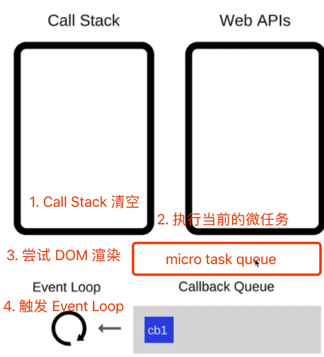


###  event loop和DOM渲染

* 每次Call Stack清空(即每次轮询结束) , 即同步任务执行完

* 都是DOM重新渲染的机会, DOM结构如有改变则重新渲染

* 然后再去触发下一-次 Event Loop

```js
  const $p1 = $('<p>一段文字</p>')
  const $p2 = $('<p>一段文字</p>')
  const $p3 = $('<p>一段文字</p>')
  $('#container')
              .append($p1)
              .append($p2)
              .append($p3)
  
  Promise.resolve().then(() => {
   const length = $('#container').children().length
   alert(`micro task ${length}`)// 此时DOM还没有渲染
   alert('本次 call stack 结束，DOM 结构已更新，但尚未触发渲染')
  })
  // （alert 会阻断 js 执行，也会阻断 DOM 渲染，便于查看效果）
  // 到此，即本次 call stack 结束后（同步任务都执行完了），浏览器会自动触发渲染，不用代码干预
  
  // 另外，按照 event loop 触发 DOM 渲染时机，setTimeout 时 alert ，就能看到 DOM 渲染后的结果了
  setTimeout(function () {
      alert('setTimeout 是在下一次 Call Stack ，就能看到 DOM 渲染出来的结果了')
  })
```

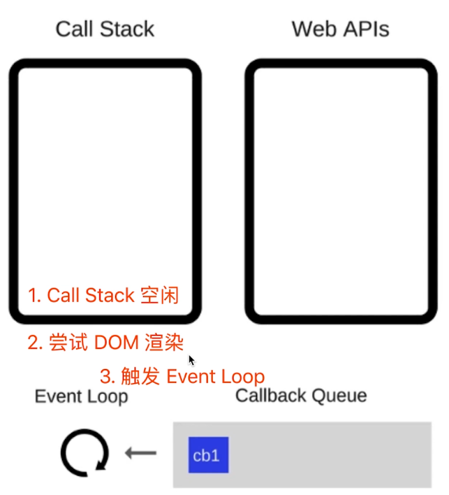


#  JS  Web API 

> [window和document的区别](https://www.cnblogs.com/tangjianqiang/p/13661361.html)
>
> [Dom和Bom的区别](https://zhuanlan.zhihu.com/p/464921428)

##  DOM

* DOM是哪种数据结构
  * 树结构（DOM树）
* DOM操作的常用API
* attribute和property的区别
* 一次性插入多个DOM节点，考虑性能

###  property 和attribute区别

* property :修改对象属性，不会体现到 html结构中(修改的是model层的数据) ； 推荐
* attribute :修改html属性，会改变html结构（修改的view层的数据）
* 两者都有可能引起DOM重新渲染

```js
// property 形式
p1.style.width = '100px'
console.log( p1.style.width )
p1.className = 'red'
console.log( p1.className )
console.log(p1.nodeName)
console.log(p1.nodeType) // 1

// attribute 形式
p1.setAttribute('data-name', 'micro')
console.log( p1.getAttribute('data-name') )
p1.setAttribute('style', 'font-size: 50px;')
console.log( p1.getAttribute('style') )
```


###  操作DOM节点

```js
// 以ID名获取元素
const div1 = document.getElementById('div1') 
console.log('div1', div1)

// 以元素的标签名获取元素  获取的结果为集合
const divList = document.getElementsByTagName('div') 
console.log('divList.length', divList.length)
console.log('divList[1]', divList[1]) //以索引获取集合中需要的元素

// 以元素的class名获取元素  获取的结果为集合
const containerList = document.getElementsByClassName('container') // 集合
console.log('containerList.length', containerList.length)
console.log('containerList[1]', containerList[1]) //以索引获取集合中需要的元素

// 以查询的方式获取元素，查询值为元素的标签名  获取的结果为集合
const pList = document.querySelectorAll('p')
console.log('pList', pList)

const pList = document.querySelectorAll('p')
const p1 = pList[0]

```

###  操作DOM结构

>  [HTML DOM nodeType 属性](https://www.w3school.com.cn/jsref/prop_node_nodetype.asp)
>
> nodeType ===1 表示 元素为标签
>
>  nodeType ===3 表示 元素为text类型，即为标签的文本内容

```js
const div1 = document.getElementById('div1')
const div2 = document.getElementById('div2')

// 新建节点
const newP = document.createElement('p')
newP.innerHTML = 'this is newP' //填写元素内容
// 插入节点
div1.appendChild(newP)//将新节点加入到父节点(div1)中

// 移动节点
// p1节点原本是在div1中的， 以下操作会将p1移动到div2中
const p1 = document.getElementById('p1')
div2.appendChild(p1)

// 获取父元素
// 获取p1元素的父节点
console.log( p1.parentNode )

// 获取子元素列表
// 获取div1节点的所有子节点
const div1ChildNodes = div1.childNodes
console.log( div1.childNodes )
const div1ChildNodesP = Array.prototype.slice.call(div1.childNodes).filter(child => {
    if (child.nodeType === 1) { //nodeType ===1 表示 元素为标签
        return true            
    }
    return false
})
console.log('div1ChildNodesP', div1ChildNodesP)

// 删除子节点
// 删除div1下的子节点
div1.removeChild( div1ChildNodesP[0] )
```

###  DOM性能

> * 频繁更新DOM会耗费很多资源，所以尽量减少刷新的次数，可以将更新的整理好后一次性更新

**将频繁操作改成一次性操作**

* 利用`document.createDocumentFragment()`

```js
const list = document.getElementById('list')

// 创建一个文档片段，此时还没有插入到 DOM 结构中
const frag = document.createDocumentFragment()

for (let i  = 0; i < 20; i++) {
    const li = document.createElement('li')
    li.innerHTML = `List item ${i}`

    // 先插入文档片段中
    frag.appendChild(li)
}

// 都完成之后，再统一插入到 DOM 结构中
list.appendChild(frag)

console.log(list)
```

**DOM查询做缓存**

```js
//DOM查询做缓存
//不缓存 DOM查询结果
//此时每次循环都会判断i < document.getElementsByTagName('p' )，每次判断都会查询一次长度
for (let i = 0; i < document.getElementsByTagName('p' ).length; i++){
  //每次循环，都会计算 length ,频繁进行DOM查询
}
//缓存DOM查询结果
const pList = document.getElementsByTagName( 'p')
const length = pList.length
for ( let i = 0; i < length; i++) {
  //缓存length ,只进行一次DOM查询
}
```

### PS: 测试代码

```html
<!DOCTYPE html>
<html lang="en">
    <head>
        <meta charset="UTF-8">
        <meta name="viewport" content="width=device-width, initial-scale=1.0">
        <meta http-equiv="X-UA-Compatible" content="ie=edge">
        <title>dom 演示</title>

        <style>
            .container {
                border: 1px solid #ccc;
            }
            .red {
                color: red;
            }
        </style>
    </head>
    <body>
        <div id="div1" class="container">
            <p id="p1">一段文字 1</p>
            <p>一段文字 2</p>
            <p>一段文字 3</p>
        </div>
        <div id="div2">
            
        </div>
        <ul id="list">
        </ul>

        <script src="./dom-3.js"></script>
    </body>
</html>
```


## BOM

**navigator**

```js
// navigator
const ua = navigator.userAgent
const isChrome = ua.index0f ( 'Chrome')
console.log ( isChrome)


```

**history**

```js
// history
history.back()//后退
history.forward()//前进
```


**screen**

```js
// screen
console.log(screen.width)
console.log ( screen.height)
```


**location**

```js
//location
console.log(location.href )//    查看url
console.log(location.protocol)// 查看协议：'http: ' 或'https : '
console.log(location.pathname)// 查看路由路径 ' /learn/199 '
console.log( location.search)//  查看参数
console.log ( location.hash)//  
```


##  事件

* 编写一个通用的事件监听函数
* 描述事件冒泡的流程
* 无限下拉的图片列表，如何监听每个图片的点击?  事件代理

###  事件绑定

> * 阻止事件默认行为：`event.preventDefault()` ;  例如点击a标签时会阻止跳转

**通用的事件绑定函数--简版**

```js
// 通用的事件绑定函数--简版
// elem:需要绑定事件的元素， type:事件类型 ， fn:回调函数
function bindEvent(elem, type, fn) {
    elem.addEventListener(type, fn)
}

// 普通绑定
const btn1 = document.getElementById('btn1')
bindEvent(btn1, 'click', event => {
    // console.log(event.target) // 获取触发的元素
    event.preventDefault() // 阻止默认行为  例如点击a标签时会阻止跳转
    alert(event.target.innerHTML)
})
```

**通用的事件绑定函数--可选择事件代理**

```js
//html结构
<div class="maopao">
  <h1>事件代理</h1>
  <div id="div3">
      <a href="#">a1</a><br>//需求：点击每个a标签都弹出标签内容
      <a href="#">a2</a><br>//如果给每个a标签绑定相同的事件就太冗余了
      <a href="#">a3</a><br>//在父元素中处理事件
      <a href="#">a4</a><br>//注意：在父元素上绑定事件时需要判断是不是为a标签，以免父元素本身和其它子元素触发事件
      <button id="but1">加载更多...</button>
  </div>
</div>
```


```js
// 通用的事件绑定函数--可选择事件代理
// elem:需要绑定事件的元素， type:事件类型 ,selector:事件代理的元素, fn:回调函数
function bindEvent(elem, type, selector, fn) {
    //当传入3个参数，即不传入代理事件元素
    if (fn == null) {
        fn = selector
        selector = null
    }
    elem.addEventListener(type, event => {
        const target = event.target
        if (selector) {
            // 代理绑定
            //matches是dom元素对象的方法
            if (target.matches(selector)) {//判断元素是否为代理事件的元素
                // fn.call(target,event)
                fn(event)//执行回调函数
            }
        } else {
            // 普通绑定
            fn(event)
        }
    })
}

// 代理绑定
const div3 = document.getElementById('div3')
bindEvent(div3, 'click', 'a', event => { //a标签即为事件代理的元素
    event.preventDefault()
    alert(event.target.innerHTML)
})
const but1 = document.getElementById('but1')
bindEvent(but1, 'click', event => { //没有事件代理即可不传该参数
    event.preventDefault()
    alert(event.target.innerHTML)
})
```


###  事件冒泡

> * 事件向上冒泡时，回调函数event.target始终为**实际点击的元素**
> *  阻止冒泡: `event.stopPropagation()`

```html
//html结构
    <body>
        <div class="maopao">
          <h1>冒泡测试</h1>
          <div id="div1">
              <p id="p1">激活</p>
              <p id="p2">取消</p>
              <p id="p3">取消</p>
              <p id="p4">取消</p>
          </div>
          <div id="div2">
              <p id="p5">取消</p>
              <p id="p6">取消</p>
          </div>
        </div>
        <script src="./event.js"></script>
    </body>
```


```js
// 通用的事件绑定函数--简版
// elem:需要绑定事件的元素， type:事件类型 ， fn:回调函数
function bindEvent(elem, type, fn) {
    elem.addEventListener(type, fn)
}

const p1 = document.getElementById('p1')
bindEvent(p1, 'click', event => {
    event.stopPropagation() // 阻止冒泡
    console.log('激活')
    console.log('冒泡-click p1',event.target) //打印p1
})
const body = document.body
bindEvent(body, 'click', event => {
    console.log('取消')
    console.log('冒泡-click body',event.target)//打印实际点击的元素
})
const div2 = document.getElementById('div2')
bindEvent(div2, 'click', event => {
    console.log('取消')
    console.log('冒泡-click div2',event.target)////打印实际点击的元素
})
```

###  事件代理

> * 事件代理是指将子元素的事件绑定到父元素上处理
>
> * 应用场景：无限下拉的图片，点击每个图片的事件处理效果相同，此时如果给每一个元素绑定相同的事件处理函数就太浪费资源了，而且代码也太冗余了，利用事件代理就可以在其父元素上统一监听，绑定一次即可

```html
//html结构
<div class="maopao">
  <h1>事件代理</h1>
  <div id="div3">
      <a href="#">a1</a><br>//需求：点击每个a标签都弹出标签内容
      <a href="#">a2</a><br>//如果给每个a标签绑定相同的事件就太冗余了
      <a href="#">a3</a><br>//在父元素中处理事件
      <a href="#">a4</a><br>//注意：在父元素上绑定事件时需要判断是不是为a标签，以免父元素本身和其它子元素触发事件
      <button>加载更多...</button>
  </div>
</div>
```

```js
// 通用的事件绑定函数--简版
//elem:需要绑定事件的元素， type:事件类型 ， fn:回调函数
function bindEvent(elem, type, fn) {
    elem.addEventListener(type, fn)
}

//代理绑定
const div3 = document.getElementById('div3')
bindEvent(div3, 'click', event => {
  event.preventDefault() //点击a标签时会阻止跳转
  event.stopPropagation() //阻止冒泡
  const target = event.target
  if (target.nodeName === 'A'){ //只有点击的元素为a标签时才处理，避免父元素本身和其它子元素触发事件
    alert(target.innerHTML)
  }
})
```


##  AJAX

> jQuery:https://blog.csdn.net/xianhenyuan/article/details/92669817
>
> Fetch: https://developer.mozilla.org/zh-CN/docs/Web/API/Fetch_API/Using_Fetch
>
> axios: http://www.axios-js.com/zh-cn/

* 手写一个简易的ajax
* 跨域的常用实现方式

###  XMLHttpRequest

> XMLHttpRequest是浏览器的API，所以在使用时需要结合html文件，在浏览器中打开，否则会报错（直接在node.js环境中使用就会报错）

**GET**

```js
//1 实例化
const xhr = new XMLHttpRequest()
//2 发送请求
// 参数：请求方法；资源地址；是否异步：true为异步，false为同步
xhr.open('GET', '/data/test.json', true)
//3 回调函数
//  readyState变化时会触发这个回调函数
xhr.onreadystatechange = function () {
    if (xhr.readyState === 4) {
        if (xhr.status === 200) {
            // console.log(
            //     JSON.parse(xhr.responseText)
            // )
            alert(xhr.responseText)
        } else if (xhr.status === 404) {
            console.log('404 not found')
        }
    }
}
//4 发送数据：因为这里是get请求，所以发送的数据是null，若是post请求则直接将
xhr.send(null)
```

**POST**

```js
//1 实例化
const xhr = new XMLHttpRequest()
//2 发送请求
// 参数：请求方法；资源地址；是否异步：true为异步，false为同步
xhr.open('POST', '/data/test.json', true)
//3 回调函数
xhr.onreadystatechange = function () {
    if (xhr.readyState === 4) {
        if (xhr.status === 200) {
            // console.log(
            //     JSON.parse(xhr.responseText)
            // )
            alert(xhr.responseText)
        } else if (xhr.status === 404) {
            console.log('404 not found')
        }
    }
}
//4 发送数据：因为这里是get请求，所以发送的数据是null，若是post请求则直接将
cosnt list = {
    "name": "chuckie"
}
xhr.send(JSON.stringify(list))
```

**promise写法**

```js
function ajax(url) {
    const p = new Promise((resolve, reject) => {
        const xhr = new XMLHttpRequest()
        xhr.open('GET', url, true)
        xhr.onreadystatechange = function () {
            if (xhr.readyState === 4) {
                if (xhr.status === 200) {
                    resolve(
                        JSON.parse(xhr.responseText)
                    )
                } else if (xhr.status === 404 || xhr.status === 500) {
                    reject(new Error('404 not found'))
                }
            }
        }
        xhr.send(null)
    })
    return p
}

const url = '/data/test.json'
ajax(url)
.then(res => console.log(res))
.catch(err => console.error(err))
```


###  状态码

**`xhr.readyState`**

* 0-(未初始化)还没有调用send()方法
* 1-(载入）已调用send()方法，正在发送请求
* 2-(载入完成) send()方法执行完成，已经接收到全部响应内容
* 3-(交互）正在解析响应内容
* 4-(完成）响应内容解析完成，可以在客户端调用

**`xhr.status`**

* 2xx-表示成功处理请求，如200
* 3xx–需要重定向，浏览器直接跳转，如301 302 304
* 4xx-客户端请求错误，如404 403
* 5xx -服务器端错误

###  跨域

> [HTTP(0x03)-跨域问题](https://chuckiewill.github.io/2020/09/03/HTTP/HTTP(0x03)-跨域问题/)

同源策略，

跨域解决方案

JSONP

CORS

##  存储

描述cookie localStorage sessionStorage区别

* 容量
* API易用性
* 是否跟随http请求发送出去

**cookie**

* cookie可以实现存储的原因是，在页面刷新时，cookie的值不会清零，但是cookie本身不是用来存储的
* cookie的缺点
  * 存储有限，最大4KB
  * 每次http请求时都需要将cookie发送到服务端，增加了请求数据量
  * 只能用`document.cookie` = '..’来修改，该接口太过简陋，使用不方便

**localStorage和sessionStorage**

* HTML5专门为存储而设计，最大可存5M

* API简单易用setItem getItem

  * 以键值对的形式存储

```js
  localstorage.setItem( 'a', 100)
  localstorage.getItem( 'a') //"100"     //注意返回结果都为字符串，会有强制类型转换
  sessionStorage.setItem( 'b', '200')
  sessionStorage.getItem( 'b')//"200"
```

  

* 不会随着http请求被发送出去

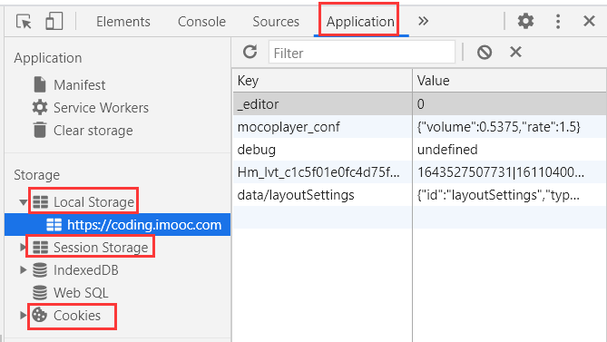

* localStorage和sessionStorage区别
  * localStorage 数据会永久存储，除非代码或手动删除 ，（多用此方法）
  * sessionStorage数据只存在于当前会话，浏览器关闭则清空


##  HTTP

> [Chuckie's Blog-HTTP](https://chuckiewill.github.io/categories/HTTP/)

* http常见的状态码有哪些?
* http常见的header有哪些?
* 什么是 Restful API
* 描述一下http的缓存机制（重要)

###  http code

* 状态码分类
  * 1xx服务器收到请求
  * 2xx请求成功，如200
  * 3xx重定向，如302（该服务端已不工作，请求其他地址）
  * 4xx客户端错误，如404（请求的地址错误）
  * 5xx服务端错误，如500（服务端代码错误）

* 常见状态码

  * 200 OK - [GET]:服务器成功返回用户请求的数据
  * 201 CREATED -[POST/PUT/PATCH]:用户新建或修改数据成功
  * 204 NO CONTENT - [DELETE]:用户删除数据成功。
  * 301永久重定向（配合location ，重定向的地址存储在location中，浏览器自动处理，下次请求直接请求重定向的地址)
  * 302临时重定向（配合location，浏览器自动处理，下次请求还是请求原地址，返回302后再去请求新地址，*百度搜索案例*)
  
  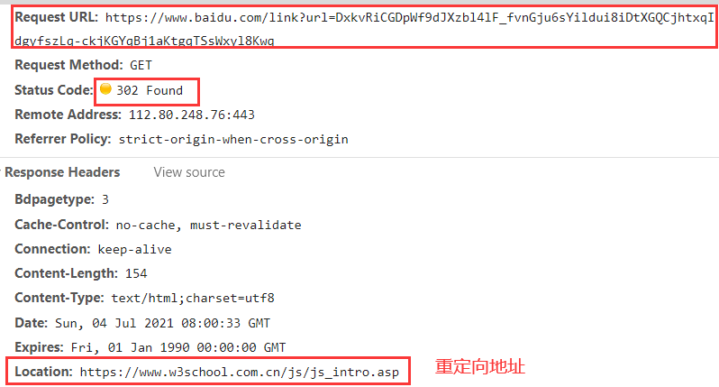
  * 304资源未被修改（刚才已经请求过了，且内容没有变化，服务端不会再次发送内容，客户端使用之前的内容即可）
  * 401 Unauthorized - [*]:表示用户没有权限（令牌、用户名、密码错误)。
  * 403 Forbidden - [*]表示用户得到授权(与401错误相对)，但是访问是被禁止的。
  * 404资源未找到（请求地址错误）
  * 500服务器错误（代码错误）
  * 504网关超时（数据库操作超时，服务端多个服务器之间交互超时）

###  http methods

* 传统methods

  * get获取服务器的数据
  * post向服务器提交数据
* 现状methods

  * get 获取数据
  * post  新建数据
  * patch 更新数据
  * put    更新数据
  * delete  删除数据

```
//案例
GET /teams:列出所有球队
POST /teams:新建一个球队
GET /teams/ID:获取某个球队的信息
PUT /teams/ID:更新某个球队的信息（更新球队的全部信息)
PATCH /teams/ID:更新某个球队的信息（更新球队的部分信息)
```


####  Restful API

  >  —种新的API设计方法（早已推广使用)

  * 传统API与Restful API的区别
    * 传统API设计:把每个url当做一个功能
    * Restful API设计:把每个url当做一个唯一的资源的id(url是资源的唯一标识)

  * Restful API设计的特点

    * 不使用url参数

      * 传统API 设计:`/api/list?pageIndex=2`
      * Restful API设计:`/api/list/2`

    * 用method表示操作类型

```js
//传统API 设计
      post请求/api/create-blog         //创建博客
      post请求/api/update-blog?id=100  //更新第100页博客
      get请求/api/get-blog?id=100      //获取第100页博客
```


```js
//Restful API设计
      post请求/api/blog         //创建博客
      patch请求/api/blog/100    //更新第100页博客
      get请求/api/blog/100      //获取第100页博客
```


###  http headers

* 常见的Request Headers（客户端传给服务端的头信息）
  * Accept浏览器可接收的数据格式
  * Accept-Encoding浏览器可接收的压缩算法，如gzip
  * Accept-Languange浏览器可接收的语言，如zh-CN
  * Connection: keep-alive  长链接：一次TCP连接重复使用
  * cookie
  * Host  请求地址的域名
  * User-Agent (简称UA)浏览器信息
  * Content-type发送数据的格式，如application/json
* 常见的Response Headers（服务端返回客户端的头信息）
  * Content-type返回数据的格式，如application/json
  * Content-length返回数据的大小，多少字节
  * Content-Encoding返回数据的压缩算法，如gzip
  * Set-cookie

###  http 缓存

* 什么是缓存?（对不需要重复获取的资源存储在本地）
* 为什么需要缓存?（提升响应速度，减少资源浪费）
* 哪些资源可以被缓存?—静态资源（ js css img )

####  强制缓存

> Expires已经被Cache-Control代替
>
> [强制缓存解释](https://blog.csdn.net/m0_63657524/article/details/125966386)

* Cache-Control

  * Response Headers中
  * 控制强制缓存的逻辑
  * 例如Cache-Control: max-age=3153600（单位是秒)  控制可缓存的最大时长
  * Cache-Control的值
    * max-age （控制可缓存的最大时长）
    * no-store  （不允许强制缓存也不允许协商缓存）
    * no-cache  （只是不允许强制缓存）
    * public   （终端用户的设备可缓存，路由过程中也可缓存）
    * private  （只允许终端用户的设备可缓存）

  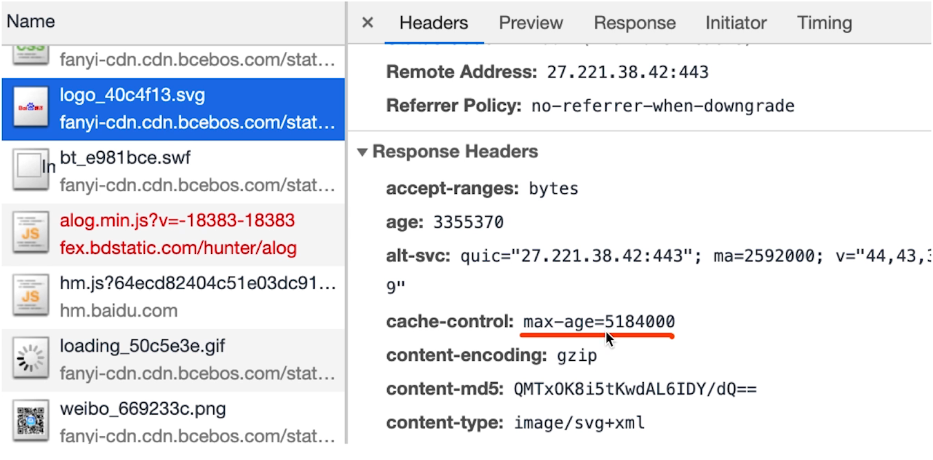

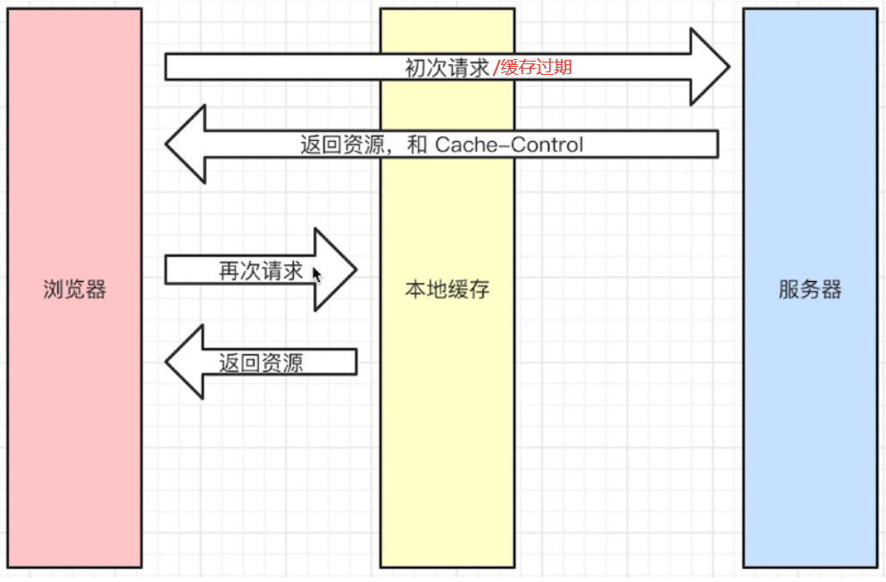

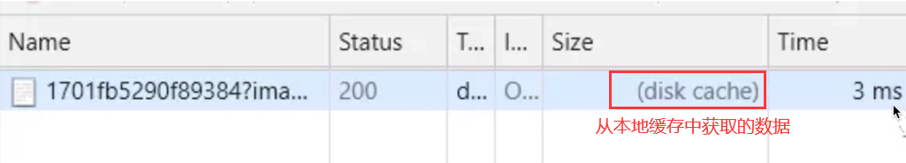

####  协商缓存

> 协商缓存是一种服务器端缓存策略
>
> * 服务器判断客户端资源是否和服务端资源一样，若一致则返回304（资源未被修改），否则返回200和最新的资源
> * 判断资源是否一致的方式是对比资源标识是否发生变化

* 资源标识

  >  在Response Headers中,有两种
  >
  > * Last-Modified资源的最后修改时间
  > * Etag资源的唯一标识(一个字符串,是通过内容计算出来的，只要内容没变，字符串就不变)

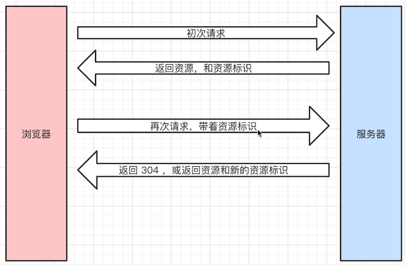

* Last-Modified的情况
  * If-Modified-Since的值就是Last-Modified的值

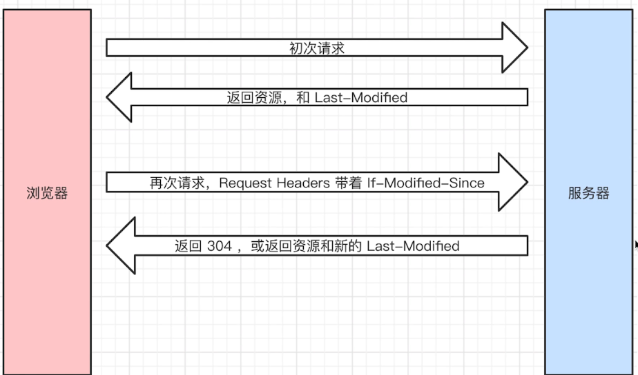

* Etag的情况
  * If-None-Match的值就是Etag的值

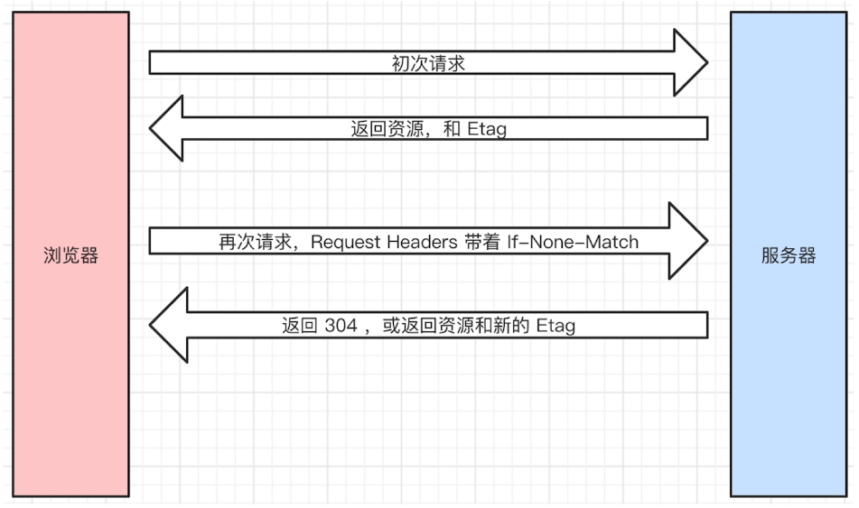

* Last-Modified和Etag
  * 会优先使用Etag
  * Last-Modified只能精确到秒级
  * 如果资源被重复生成,而内容不变,则Etag更精确，因为Etag是根据内容生成的字符串
  * Last-Modified和Etag可以同时使用

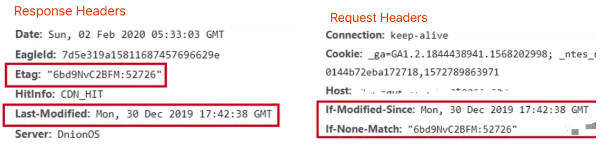

####  缓存流程图

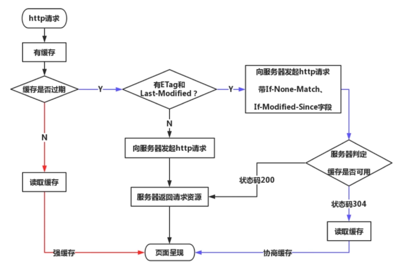

####  三种刷新操作

* 正常操作:地址栏输入url , 跳转链接,前进后退等
* 手动刷新: F5 ,点击刷新按钮;右击菜单刷新
* 强制刷新: ctrl + F5
* 正常操作:强制缓存有效,协商缓存有效
* 手动刷新:强制缓存失效,协商缓存有效
* 强制刷新:强制缓存失效,协商缓存失效


#  开发环境

## git

> [Chuckie'Blog-Git](https://chuckiewill.github.io/categories/tools/git/)

###  常用命令

* git add .
* git checkout xxx        恢复到修改前的状态（撤销修改）
  * git checkout 文件名    恢复这个文件的修改
  * git checkout .       恢复所有文件的修改
  * *已经git add 的文件则不能再撤销修改，只要是还没有加入缓存区的都可以修改*
  * *只能撤销修改的文件，不能撤销新建的文件*

* git commit -m "xxx"

* git push origin master  提交到远程服务器
  
* git push orgin 新分支名   在远程新建分支并将本地此分支提交到远程（此操作包括在远程新建分支和提交分支）
  
* git pull origin master

* git branch   查看分支
* git checkout -b xxx  新建分支并切换到该分支上
  
*  git checkout xxx   切换分支
  
* git merge xxx     合并分支

* git diff  查看文件修改的具体内容

  * git diff  文件名   查看单个文件的修改内容
  * git diff  不加文件名  查看所有的文件修改内容
  * *git add 之后再执行git diff 就无效了，只有在未加入缓存区之前，才能查看修改的内容*

* git show + 版本号     查看这个版本修改的具体内容

  * 先通过 git log 找到版本号

* git log   查看提交的版本，

  * 此时是对已经git add 和git commit 后的版本查看，
  * 若没有git commit 则无效，本质是对git commit 的版本进行查看

* git fetch  访问远程仓库，从中拉取所有本地还没有的数据

* git stash   将修改的部分移除并暂存在其他地方（误操作时使用）

  * git stash pop  推出暂存的部分

* git status  查看当前状态（可以查看修改了哪些文件，新增加了哪些文件，此时还没提交版本）

  * 文件修改，或文件添加后已经保持，但还没有git add ,此时文件标红

  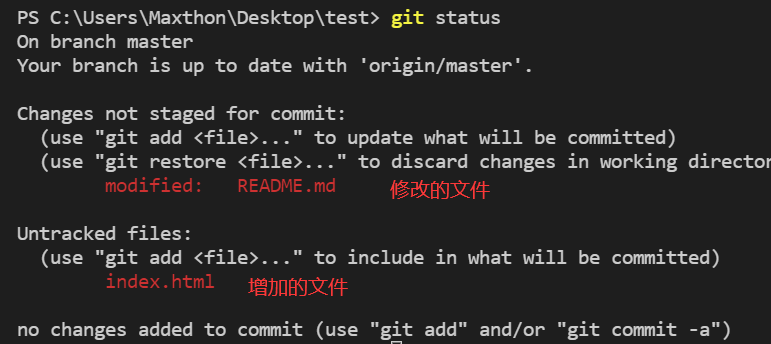

  * git add 后，此时文件标绿

  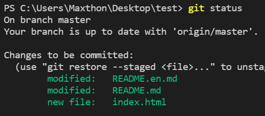

  * git commit 后，此时就看不到修改的文件和添加的文件了，只会显示已提交x个版本


###  多人开发

1. leader创建项目，此时项目为master分支

2. 开发者1 需要开发登陆功能

   * 拉取master分支的代码到本地：`git clone`

   * 新建分支并切换到该分支进行开发：`git checkout -b login`  //login为新分支名
   * 修改或添加文件，完成开发
   * 将开发完成的代码提交到远程服务器：`git push origin login`//在远程新建login分支并将本地该分支提交到远程

3. 开发者2 需要开发注册功能

   * 拉取master分支的代码到本地：`git clone`

   * 新建分支并切换到该分支进行开发：`git checkout -b register`  //login为新分支名
   * 修改或添加文件，完成开发
   * 将开发完成的代码提交到远程服务器：`git push origin register`//在远程新建register分支并将本地该分支提交到远程

4. leader合并开发者1和2的代码

   * leader在master分支上，拉取最新内容`git fetch `

   * 切到需要合并的分支上

     * `git branch`不会显示开发者新建的分支名，可以在远程查看分支名
  * 然后直接执行`git checkout 分支名`就直接切换到分支上了，而且本地分支和远程分支是一一对应的
   
* 切到分支后，拉取最新代码：`git pull orgin 分支名`    //此操作是确保每个分支是最新内容
  
* 合并分支（终端切在master分支上）: `git merge login` //将login分支内容合并到master分支上
  
* 将合并后的代码推到远程服务器： `git push`
  
* 按以上步骤合并下一个分支，直到产生冲突
  
     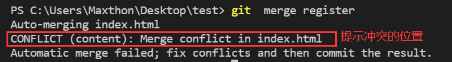
   
     * 找到冲突文件的位置，选择保留方式，并修改冲突位置
     
     
     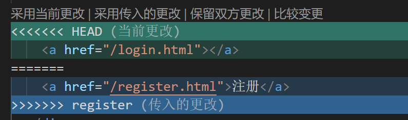 
     * 因为处理冲突后修改了文件内容，所以需要`git add  git commit`
     * 提交到远程服务器： `git push`

###  误操作

> 拉取master分支后，本来是要新建分支再开发，但是忘记新建分支就直接在master分支上开发了
>
> * 以下操作是在没有加入暂存区之前执行才有效
> * 执行完以下操作后，master恢复到没有开发前的状态

1. 将已经在master上开发的部分移除并暂存到其他地方：`git stash`
2. 新建分支并切到相应分支上：`git checkout -b 新分支`
3. 将暂存的部分推出到新的分支上：`git stash pop`
4. 将修改的部分暂存到暂存区并提交本版再推到远程：`gti add、 git commit、 git push origin 新分支`


##  webpack babel

> [Chuckie'Blog-webpack](https://chuckiewill.github.io/categories/third-repositories/webpack/)
>
> ES6模块化，浏览器暂不支持
> ES6语法，浏览器并不完全支持
> 压缩代码，整合代码，以让网页加载更快

###  webpack打包流程

* 安装node.js

* 项目根目录下初始化：`npm init -y`
  
  * 初始化后根文件夹下会生成文件`package.json`
  
* 安装webpack: `npm install --save-dev webpack webpack-cli`

  * 使用 webpack 4+ 版本，还需要安装 CLI

* 根目录下新建资源文件夹（src）即入口文件(index.js)

  * `src/index.js`

* 根目录下新建配置文件`webpack.config.js`,并配置入口和出口
```js
  //webpack.config.js
  const path = require('path')
  
  module.exports = {
    //development是开发模式，production是生产模式（上线模式）
    mode: 'development',//production
    //入口：可以是字符串、数组、对象，这里只有一个入口，写字符串即可
    entry:'./src/main.js',
    //出口: path:打包文件保存路径  filename:打包的文件名
    output:{
        path: path.resolve(__dirname,'dist'),
        filename: 'bundle.js'
    }
  }
```

* package.json中定义打包启动

```json
  //package.json
    "scripts": {
      "build": "webpack"
    },
```

* 打包

```js
  npm run build
  //打包后的文件存储在./dist/bundle.js中
```

###  打包index.html

* 目前的index.html文件是存放在项目的根目录下的。
  * 在真实发布项目时，发布的是dist文件夹中的内容，但是dist文件夹中如果没有index.html文件，那么打包的js等文件也就不能起效果
  * 所以，需要将index.html文件打包到dist文件夹中，这个时候就可以使用`HtmlWebpackPlugin`插件

* `HtmlWebpackPlugin`插件的功能：

  * 自动生成一个index.html文件(可以指定模板来生成)
  * 将打包的js文件，自动通过script标签插入到body中

* 安装`HtmlWebpackPlugin`插件

```js
  npm install html-webpack-plugin --save-dev
```

* 使用插件，修改webpack.config.js文件中plugins部分

  * 这里的template表示根据什么模板来生成index.html
  * fielname是在dist文件夹中生成的文件名

```js
  //webpack.config.js
  const HtmlWebpackPlugin = require('html-webpack-plugin')
  
  module.exports = {
    plugins: [
      new HtmlWebpackPlugin({
        template: './src/index.html',
        filename: 'index.html'
      })
    ]
  }
```


###  搭建本地服务

* webpack提供了一个可选的本地开发服务器，这个本地服务器基于node.js搭建，内部使用express框架，可以实现浏览器自动刷新显示我们修改后的结果。

* 安装

```js
npm install --save-dev webpack-dev-server@版本号
```

* webpack.config.js中配置` devServer`

  * contentBase：为哪一个文件夹提供本地服务，默认是根文件夹，一般指定./dist
  * port：端口号
  * inline：页面实时刷新
  * historyApiFallback：在SPA页面中，依赖HTML5的history模式

```js
module.exports = {
    devServer: {
      contentBase: './dist',
      inline: true,
      port:3000
    }
}
```

* package.js中配置`scripts`

  * 该配置是设置启动本地服务器的命令

  * `--open`: 表示直接打开浏览器

```js
 "scripts": {
    "dev": "webpack-dev-server --open"
  },
```

* 启动本地服务器

```js
终端：npm run dev
```

###  webpack配置分离

> [webpack配置分离详细教程:Chuckie'Blog-webpack](https://chuckiewill.github.io/categories/third-repositories/webpack/)
>
> 开发模式转生成模式的简易操作流程

1. 新建webpack.prod.js,将webpack.config.js的内容复制到该文件并做如下修改

* 去掉devServer的配置（因为上线的产品不需要本地服务）
* output和mode做如下修改

```js
//webpack.config.js
module.exports = {
  mode: 'production',//改为生产模式
  output:{
      path: path.resolve(__dirname,'dist'),
      filename: 'bundle.[contenthash].js'//增加哈希值，以提高性能
  },
}
```

2. package.json修改

* 重定向打包的配置文件

```json
 "scripts": {
    "build": "webpack  --config webpack.prod.js",
  },
```


###  ES6转ES5（待完成）


###  模块化 导入导出

#### ES6 export import

> 使用前提：  script  type类型为module

```
<script src='../text.js' type='module'></script>
```

* 导出：export: 逐一导出


```js
  export let myName = "Tom";
  export let myAge = 20;
  export let myfn = function(){
              return "My name is" + myName + "! I'm '" + myAge + "years old."
          }
  export let myClass =  class myClass {
              static a = "yeah!";
          }
```

  * 导出：export: 统一导出，等同于逐一导出

```js
  let myName = "Tom";
  let myAge = 20;
  let myfn = function(){
      return "My name is" + myName + "! I'm '" + myAge + "years old."
  }
  let myClass =  class myClass {
      static a = "yeah!";
  }
  export { myName, myAge, myfn, myClass }
```

  * 导出：export: export default 
    * 在一个文件或模块中，export、import 可以有多个，export default 仅有一个。
    * export default 中的 default 是对应的导出接口变量。
    * 通过 export 方式导出，在导入时要加{ }，export default 则不需要。
    * export default 向外暴露的成员，可以使用任意变量来接收。

```js
  var a = "My name is Tom!";
  export default a; // 仅有一个
   
  import b from "./xxx.js"; // 不需要加{}， 使用任意变量接收
```

```js
  //导出
  let myName = "Tom";
  let myAge = 20;
  let myfn = function(){
      return "My name is" + myName + "! I'm '" + myAge + "years old."
  }
  let myClass =  class myClass {
      static a = "yeah!";
  }
  export default{ myName, myAge, myfn, myClass }
  
  //导入
  import xxx from './xxx.js'
  //使用
  xxx.myName
  xxx.myAge
  xxx.myfn()
  xxx.myClass
```

  

* 导入：import: 导入时  路径一定是相对路径


```
1 逐个导入
import { myName, myAge, myfn, myClass } from "./test.js";
console.log(myfn());// My name is Tom! I'm 20 years old.
console.log(myAge);// 20
console.log(myName);// Tom
console.log(myClass.a );// yeah!

2 统一导入
import * as aaa from "./test.js"
console.log(aaa.myAge);// 20
```

* 导入：import: as用法

```
/*-----export [test.js]-----*/
let myName = "Tom";
export { myName as exportName }
 
/*-----import [xxx.js]-----*/
import { exportName } from "./test.js";
console.log(exportName);// Tom
使用 as 重新定义导出的接口名称，隐藏模块内部的变量
/*-----export [test1.js]-----*/
let myName = "Tom";
export { myName }
/*-----export [test2.js]-----*/
let myName = "Jerry";
export { myName }
/*-----import [xxx.js]-----*/
import { myName as name1 } from "./test1.js";
import { myName as name2 } from "./test2.js";
console.log(name1);// Tom
console.log(name2);// Jerry
```

#### 对比commonJS模块

* 使用前提：需要node.js环境解析  所以 使用前要先安装node.js

* 导出

```
module.exports = {变量名，函数名，对象名}
```

* 导入

```
let {变量名，函数名，对象名}  = require('../aaa.js')
```

* 别名


```js
//导出  
module.exports = {
    别名:原名
  }
  
  module.exports = {
    db:sequelize
  }
```

```js
//导入 
const {原名 : 别名} = require('../../core/db')
const {sequelize : db} = require('../../core/db')
```

  

##  linux常用命令

* 本地登陆linux账户：`ssh  主机名@地址`

* 查看文件

  * 平铺：`ls`
  * 列表形式：`ll`
  * 查看所有文件（包括隐藏文件）：`ls -a`

* 清屏：`clear`

* 创建文件夹：`mkdir ...`

* 删除文件夹：`rm -rf ...`

  * `-r`:   递归删除

  * `-f`：强制删除

* 删除文件： `rm 文件名`

* 切换文件夹：`cd 文件夹名/`   后退：`cd ../`

* 修改文件名： `mv 原文件名  新文件名`

* 移动文件：`mv 文件名   新路径（相对路径）/文件名`

* 拷贝：`cp 被拷贝文件名  拷贝文件名`

* 新建文件

  * `touch 文件名`  //只新建
  * `vi 文件名 `     或`vim 文件名`   //新建并打开
    * 键盘点击`i`进入编辑模式，可以编辑文件
    * 点即`ESC`按键，再输入`:`，再输入`w`（写入），再回车，再输入`q`（保存）,再回车即可保存文件并推出
    * 点即`ESC`按键，再输入`:`，再输入`q`,强制推出，之前修改的内容并没有保存

* 查看文件内容

  * `vi 文件名   或   vim文件名`： 可打开还可修改
  * `cat 文件名`： 只能查看文件
  * `head 文件名`： 查看文件头部内容
  * `tail 文件名`： 查看文件尾部

* 在文件中查找关键字： `grep "关键字"  文件名`


##  抓包（待完成）

>  移动端h5页，查看网络请求，需要用工具抓包
> windows一般用fiddler
> Mac oS一般用charles

* 抓包流程
  * 手机和电脑连同一个局域网
  * 将手机代理到电脑上
  * 手机浏览网页，即可抓包


#  运行环境

##  页面加载过程

* 从输入url到渲染出页面的整个过程
* window.onload和DOMContentLoaded的区别
  * 在页面渲染时（根据render tree渲染页面时），遇到图片（img标签）或视频加载时，不会阻断渲染，渲染会继续，只是图片的位置会预留处理，当图片、视频加载完成后会将图片、视频放到预留的位置，而图片加载时间可能长于渲染时间，所以会出现渲染已经完成，但时图片还未加载完成的情况 

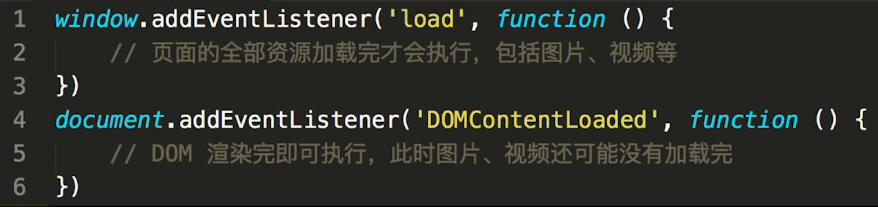


* 加载资源的形式
  * html代码
  * 媒体文件：图片、视频等
  * javascript 、css代码
* 加载资源的过程
  * DNS解析:域名->IP地址
  * 浏览器根据IP地址向服务器发起http请求（建立TCP链接，再发送请求）
  * 服务器处理http请求，并返回给浏览器
* 渲染页面的过程
  * 根据HTML代码生成DOM Tree
  * 根据CSS代码生成CSSOM Tree
  * 将DOM Tree和CSSOM Tree整合形成Render Tree
  * 根据Render Tree渲染页面
    * Layout(回流):根据生成的渲染树，进行回流(Layout)，得到节点的几何信息(位置，大小)
    * Painting(重绘):根据渲染树以及回流得到的几何信息，得到节点的绝对像素
    * 调用GPU触发渲染，将结果展示在页面上
  * 遇到`<script>`则暂停渲染，优先加载并执行js代码，完成再继续
  * 直至把Render Tree渲染完成


## 性能优化

**性能优化原则**

* 多使用内存、缓存或其他方法
* 减少CPU计算量，减少网络加载耗时
* (适用于所有编程的性能优化——空间换时间)

**让加载更快**

* 减少资源体积︰压缩代码
  * 例如：生产模式下webpack打包生成的bundle.js文件就是压缩文件
* 减少访问次数∶合并代码，SSR服务器端渲染，缓存
  * SSR  *此处不懂，待完成？？？？？？？*
    * 服务器端渲染:将网页和数据一起加载，一起渲染
    * 非SSR（前后端分离):先加载网页，再加载数据，再渲染数据
    * 早先的JSP ASP PHP，现在的vue React SSR
  * 合并代码案例：生产模式下webpack打包生成的bundle.js文件就是多个js文件合并后的文件
  * 缓存案例：*这里http缓存机制需要设置`Etag或Last-Modified`吗？？？？？*
    * webpack打包的静态资源加hash后缀，根据文件内容计算hash
    * 文件内容不变，则hash 不变，则url不变
    * url和文件不变，则会自动触发http缓存机制，返回304

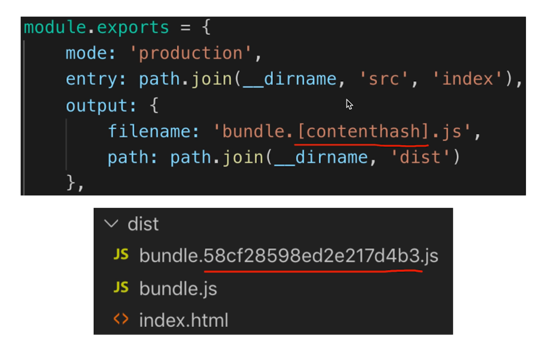

* 使用更快的网络:CDN     *此处不懂，待完成？？？？？？？*

**让渲染更快**

* CSS放在head ,JS放在body最下面
* 尽早开始执行JS，用DOMContentLoaded触发
* 懒加载（图片懒加载，上滑加载更多)

```html
//src="preview. png" 是占位图片，data-realsrc="abc.png"是图片的真实地址

<script type="text/javascript">
    //1 拿到图片节点
    var img1 = document.getElementById( ' img1 ')
    //2 监听图片是否正在页面显示
    .....
    //3 若图片正在页面显示则将src更换为真实的图片地址并加载图片
    img1.src = img1.getAttribute( 'data-realsrc ' )
</script>

```


* 对DOM查询进行缓存
* 频繁DOM操作，合并到一起插入DOM结构


* **节流throttle**

  > 函数节流: 规定在一个**单位时间内**，事件响应函数只能被触发一次。如果这个单位时间内触发多次函数，**只有一次生效**
  >
  > *频繁操作频繁触发事件--->无论操作多频繁都设定每隔n毫秒触发一次事件*
  >
  > 使用场景：
  >
  > * window.onresize事件
  >
  >   * 网页大小变化时触发事件，右上角全屏和小窗口的切换，或者拖动窗口大小的变化 
  >
  > * mousemove事件
  >
  >   * 拖拽一个元素时，要随时拿到该元素被拖拽的位置
  >
  >   * 直接用drag事件，则会频发触发，很容易导致卡顿
  >
  >   * 节流:无论拖拽速度多快，都会每隔100ms触发一次


```html
//throttle.html
<!DOCTYPE html>
<html lang="en">
    <head>
        <meta charset="UTF-8">
        <meta name="viewport" content="width=device-width, initial-scale=1.0">
        <meta http-equiv="X-UA-Compatible" content="ie=edge">
        <title>throttle 演示</title>
        <style>
            #div1 {
                border: 1px solid #ccc;
                width: 200px;
                height: 100px;
            }
        </style>
    </head>
    <body>
        <div id="div1" draggable="true">可拖拽<div>

        <script src="./throttle1.js"></script>
    </body>
</html>
```

```js
//throttle1.js
const div1 = document.getElementById('div1')

// //设置定时器
// let timer = null

// div1.addEventListener('drag', function(e){
//   //若定时器还未执行则跳过下面的代码，直接返回
//   if(timer){
//     return
//   }
//   timer = setTimeout(()=>{
//     console.log(e.offsetX,e.offsetY)
//     timer = null
//   },500)
// })

//抽离出节流函数
//fn是需要节流的函数，delay是节流的时间间隔
function throttle(fn, delay = 100){
  let timer = null
  return function(event){  // 这里的event就是事件函数的返回值
    if(timer){
      return
    }
    timer = setTimeout(()=>{
      //这里的this指向的是throttle返回的这个函数
      fn(event)
      timer=null
    }, delay)
  }
}

//抽离出节流函数
//fn是需要节流的函数，delay是节流的时间间隔
function throttle(fn, delay = 100){
  let timer = null
  return function(){
    if(timer){
      return
    }
    timer = setTimeout(()=>{
      //这里的this指向的是throttle返回的这个函数
      fn.apply(this, arguments)
      timer=null
    }, delay)
  }
}

//这里的参数e会传给throttle返回的函数
div1.addEventListener('drag', throttle(function(e){
  console.log(e.offsetX,e.offsetY)
}, 200))
```


* **防抖debounce**

  > 防抖函数：事件被触发n秒后再执行回调，如果在这n秒内又被触发，则重新计时
  >
  > *频繁操作频繁触发事件--->在频繁操作结束并停顿n毫秒后触发事件*
  >
  > 案例（搜索框）
  >
  > * 监听一个输入框时，文字变化后触发change事件
  > * 直接用keyup事件，则会频发触发change事件
  > * 防抖∶用户输入结束或暂停时，才会触发change事件

```html
//debounce.html
<!DOCTYPE html>
<html lang="en">
    <head>
        <meta charset="UTF-8">
        <meta name="viewport" content="width=device-width, initial-scale=1.0">
        <meta http-equiv="X-UA-Compatible" content="ie=edge">
        <title>debounce 演示</title>
    </head>
    <body>
        <input type="text" id="input1">

        <script src="./debounce1.js"></script>
    </body>
</html>
```

```js
//debounce1.js
const input = document.getElementById('input1')

// //建立定时器
// let timer = null

// input.addEventListener('keyup',function(){
//   if(timer){
//     //clearTimeout是window对象，用于阻止 setTimeout() 方法执行
//     clearTimeout(timer)
//   }
//   timer = setTimeout(() => {
//     //模拟触发change事件
//     console.log(input.value)
//     //清空定时器
//     timer = null
//   }, 500)
// })


//抽离出防抖函数
//fn：需要防抖的函数，delay防抖的时间间隔
function debounce(fn, delay = 500){
  //timer在闭包中
  let timer = null 
  return function(){
    if(timer){
      clearTimeout(timer)
    }
    timer = setTimeout(()=>{
      fn.apply(this,arguments) //使用此方式时传入的函数不能是箭头函数，否则this就会有误
      timer = null
    },delay)
  }
}

input.addEventListener('keyup', debounce(function(num = 200){
  console.log(input.value)
  console.log(num)
}, 600))
```

##  安全

* XSS跨站请求攻击

  > [npm-xss包](https://www.npmjs.com/pacage/xss)
  >
  > XSS又叫CSS (Cross Site Script) ，跨站脚本攻击。

  * 案例
    * 一个博客网站，我发表一篇博客，其中嵌入`<script>`脚本
    * 脚本内容:获取cookie ，发送到我的服务器（服务器配合跨域)
    * 发布这篇博客，有人查看它，我轻松收割访问者的cookie

  * 预防xss攻击

    * 替换特殊字符，如`<`变为`&lt;`,`>`变为`&gt;`
    *  `<script>`变为`&lt;script&gt;`，直接显示，而不会作为脚本执行
    * 前端要替换，后端也要替换，都做总不会有错

* XSRF 跨站请求伪造（*CSRF（Cross-site request forgery）跨站请求伪造*）

  * 案例
    * 你正在购物，看中了某个商品，商品id是100
    * 付费接口是xxx.com/pay?id=100，但没有任何验证
    * 我是攻击者，我看中了一个商品，id是200
    * 我向你发送一封电子邮件，邮件标题很吸引人
    * 但邮件正文隐藏着  **此时你的浏览器是存储了购买商品的网站的个人信息（例如cookie）即验证信息的**
    * 你一查看邮件，就帮我购买了id是200的商品
  * 预防xsrf攻击
    * 使用post接口（post接口实现跨域很复杂，需要服务端验证，所以直接用img标签是攻击不了的）
    * 增加验证，例如密码、短信验证码、指纹等


#  补充知识点

##  正则表达式

> [正则表达式教程](https://www.runoob.com/regexp/regexp-syntax.html)
>
> [正则表达式30分钟入门教程](https://deerchao.cn/tutorials/regex/regex.htm)

```js

// 邮政编码
/\d{6}/

// 小写英文字母
/^[a-z]+$/

// 英文字母
/^[a-zA-Z]+$/

// 日期格式 2019.12.1
/^\d{4}-\d{1,2}-\d{1,2}$/

// 用户名  6-18位字母，数字，下划线  
/^[a-zA-Z]\w{5, 17}$/

// 简单的 IP 地址匹配
/\d+\.\d+\.\d+\.\d+/

```


#   面试真题

* var和let const 的区别

  * var 和let是变量，可修改;const是常量，不可修改;

  * let const 有块级作用域，var没有
  * var是 ES5语法，let const是ES6语法;var有变量提升

```js
// 变量提升 ES5
console.log(a) // undefined
var a = 200

var a
console.log(a) // undefined
a = 200

//上面两种写法一样，类似函数声明

console.log(b)//报错，b没有声明，因为let没有变量提升
let b = 100
```

* typeof 返回哪些类型
  * undefined string number boolean symbol
  * object （注意，typeof null === 'object’)
  * function
* 列举强制类型转换和隐式类型转换
  * 强制: parseInt parseFloat toString 等
  * 隐式:if、逻辑运算、==、＋拼接字符串

* 手写深度比较，模拟lodash isEqual

```js
// 判断是否是对象或数组
function isObject(obj) {
    return typeof obj === 'object' && obj !== null
}
// 全相等（深度）
function isEqual(obj1, obj2) {
    if (!isObject(obj1) || !isObject(obj2)) {
        // 值类型（注意，参与 equal 的一般不会是函数）
        return obj1 === obj2
    }
    //可能传入的就是同一个对象，指向同一个引用地址
    if (obj1 === obj2) {
        return true
    }
    // 两个都是对象或数组，而且不相等
    // 1. 先取出 obj1 和 obj2 的 keys ，比较个数
    const obj1Keys = Object.keys(obj1)
    const obj2Keys = Object.keys(obj2)
    if (obj1Keys.length !== obj2Keys.length) {
        return false
    }
    // 2. 以 obj1 为基准，和 obj2 依次递归比较
    for (let key in obj1) {
        // 比较当前 key 的 val —— 递归！！！
        const res = isEqual(obj1[key], obj2[key])
        if (!res) {
            return false
        }
    }
    // 3. 全相等
    return true
}
```


* split()和join()的区别

```js
'1-2-3'.split('-')//[1,2,3]
[1,2,3].join( '-')// '1-2-3'
```

* 数组的pop push unshift shift分别做什么

  * pop: 删除数组最后一个元素，返回值：删除的元素
  * shift: 删除数组第一个元素，返回值：删除的元素
  * push: 在数组最后添加元素，返回值：添加元素后的数组长度
  * unshift: 在数组最前添加元素，返回值：添加元素后的数组长度

* 数组API有哪些是纯函数

  > 纯函数:1.不改变源数组(没有副作用); 2.返回一个数组

```js
const arr = [10, 20, 30, 40]
// concat
const arr1 = arr.concat([50, 60, 70])
const arr2 = arr.concat(50) // [10, 20, 30, 40, 50]
const arr3 = arr.concat('50') //[10, 20, 30, 40, "50"]
// map 对每个元素执行操作
const arr2 = arr.map(num => num * 10)
// filter  将满足条件的元素以数组返回
const arr3 = arr.filter(num => num > 25)
// slice  拷贝 但是是浅拷贝，只拷贝了第一层，更深层只是拷贝引用， 
// 新数组的引用和原数组的引用指向同一片内存地址
const arr4 = arr.slice()
```

* 数组的常见非纯函数

```js
//非纯函数
push pop shift unshift
forEach
some every
reduce
```

* 数组slice和splice的区别

```js
const arr = [10, 20, 30, 40, 50]

// slice 纯函数  只截取,不添加,不影响原数组
const arr1 = arr.slice() //[10, 20, 30, 40, 50]
// 截取index在[1, 4)之间的元素，包括index=1的元素，不包括index=4的元素
const arr2 = arr.slice(1, 4)//[20, 30, 40]
// 从index=2的位置开始截取后面所有的元素，包括index=2的元素
const arr3 = arr.slice(2)//[30, 40, 50]
// 截取后三个元素 
const arr4 = arr.slice(-3)//[30, 40, 50] 

// splice 非纯函数  可截取，也可添加，影响原数组
//从index=3的位置开始截取2个元素，并从index=3的位置添加元素'a', 'b', 'c'
const spliceRes = arr.splice(3, 2, 'a', 'b', 'c') 
console.log(spliceRes, arr)//[40, 50],[10, 20, 30, "a", "b", "c"]
//截取index在[2, 4]区间的元素
const spliceRes1 = arr.splice(2, 3)
console.log(spliceRes1, arr)//[30, 40, 50],[10, 20]
//在index=1的位置添加元素'a', 100, 'c'
const spliceRes2 = arr.splice(1, 0, 'a', 100, 'c')
console.log(spliceRes2, arr) //[],[10, "a", 100, "c", 20, 30, 40, 50]
```

* [10,20,30].map(parseInt)返回结果是什么?

  > [parseInt(string, radix)](https://developer.mozilla.org/zh-CN/docs/Web/JavaScript/Reference/Global_Objects/parseInt)
  >
  > parseInt是将radix进制的字符串string转换为十进制整数
  >
  > 若不传参数radix则传入上面进制的数就返回什么进制的数，只是去掉小数点后的部分，只保留整数部分

```js
const res = [10, 20, 30].map(parseInt)
console.log(res) //[10, NaN, NaN]

// 拆解
[10, 20, 30].map((num, index) => {
    return parseInt(num, index)
})

//理解parseInt(string, n)
//string是需要转换的字符串
//n是以n进制解析并转换

//parseInt('10', 0)等同于parseInt('10', 10)

parseInt('10',10) //10
parseInt('10',0)  //10
parseInt('10',2)  //2
parseInt('1010.01') //1010
```


* ajax请求get和post的区别?
  * get一般用于查询操作，post 一般用户提交操作
  * get参数拼接在url 上 , post放在请求体内（数据体积可更大)
  * 安全性:post易于防止XSRF
* 函数call和apply的区别
  * 传参方式不一样
* 事件代理（委托）是什么?
* 闭包是什么，有什么特性?有什么负面影响?
  * 闭包就是能够读取其他函数内部变量的函数
  * 特性∶函数作为参数被传入，函数作为返回值被返回
  * 特性: 自由变量的查找，要在函数定义的地方（而非执行的地方）
  * 影响:变量会常驻内存，得不到释放。闭包不要乱用
* 如何阻止事件冒泡和默认行为?
  * event.stopPropagation()
  * event.preventDefault()
* 查找、添加、删除、移动DOM节点的方法?
* 如何减少DOM操作?
  * 缓存DOM查询结果
  * 多次DOM操作，合并到一次插入
* 解释jsonp的原理，为何它不是真正的ajax ?
  * jsonp是利用`<script>`请求到一段js代码(代码是可以已经包含了数据)并直接执行
  * 因为jsonp没有使用xmlhttprequestAPI，没有服务端允许跨域的步骤
* document load和ready的区别
  * load: 图片、视频加载完成后
  * ready: 渲染完成后，但图片、视频可能还未加载完   `DOMContentLoaded`
* ==和===的不同
  * == 会尝试类型转换
  * === 严格相等  值和类型都一样
* 函数声明和函数表达式的区别
  * 函数声明`function fn() {...}`
  * 函数表达式`const fn = function() {...}`
  * 函数声明会在代码执行前预加载，而函数表达式不会

```js
// 函数声明  
const res = sum(10, 20)
console.log(res) //正常执行
function sum(x, y) { //函数会提前预加载
    return x + y
}
```

```js
// 函数表达式
var res = sum(10, 20)//报错 sum是undefined 
console.log(res) 
var sum = function (x, y) {//sum会变量提升
    return x + y
}
```


* new Object()和Object.create()的区别
  * {}等同于new Object() ，原型为Object.prototype
  * Object.create(null)没有原型
  * Object.create({...})可指定原型
  * **`Object.create({...})`新建一个空对象，并让空对象的隐式原型等于传入的值**

```js
const obj1 = {
    a: 10,
    b: 20,
    sum() {
        return this.a + this.b
    }
}

const obj2 = new Object({
    a: 10,
    b: 20,
    sum() {
        return this.a + this.b
    }
})

console.log(obj1 === obj2)//false 引用指向不同的地址

const obj21 = new Object(obj1) // obj21 === obj1 引用指向同一个地址

const obj3 = Object.create(null) //{} 没有原型 因为原型为null
const obj4 = new Object() // {}  原型为Object.prototype

const obj5 = Object.create({
    a: 10,
    b: 20,
    sum() {
        return this.a + this.b
    }
})

const obj6 = Object.create(obj1)
//obj6.__proto__ === obj1
//obj6.__proto__ === obj21
```


* 关于this的场景题
  * this在执行的时候确定，不是在定义的时候确定

```js
const User = {
    count: 1,
    getCount: function() {
        return this.count
    }
}
console.log (User.getCount())/ / 1
const func = User.getCount
console.log( func() )// undefined
```

* 关于作用域和自由变量的场景题

```js
let i
for(i = 1; i <= 3;i++){
  setTimeout(function(){
    console.log(i)
  },0)
}

//打印结果
// 4 4 4 
```

```js
let a = 100
function test(){
  alert(a) //100   该作用域没有定义则向上一级作用域查找
  a = 10
  alert(a)//10
}
test()
alert(a)//10
```


* 判断字符串以字母开头，后面字母数字下划线，长度6-30

```js
const reg = /^[a-zA-Z]\w{5,29}$/
```

* 手写字符串trim保证浏览器兼容性

  > trim():去除字符串两边的空白
  >
  > replace():在字符串中查找匹配的子串，并替换与正则表达式匹配的子串。返回值：修改后的字符串

```js
先判断是否有String.prototype.trim。若没有则做下面操作以达到兼容的效果
String.prototype.trim= function (){
    //this指向需要使用trim函数的字符串
    //replace(/^\s+/,'')去掉开头的空格
    //replace(/\s+$/,'')去掉结尾的空格
	return this.replace(/^\s+/,'').replace(/\s+$/,'')
}
//(原型、this、正则表达式)
```

* 获取多个数字中的最大值

  > 使用Math.max() 或下面的函数

```js
function max() {
  const nums = Array.prototype.slice.call(arguments)//变为数组
  let max = nums[0]
  nums.forEach(n => {
      if (n > max){
          max = n
      }
  })
  return max
}

console.log(max(-10,-29,-39,-1,-29,-200,0))//0
```

* 如何捕获JS程序中的异常?

```js
//高风险位置
try {
// todo
} catch (ex) {
console.error(ex) // 手动捕获catch
} finally {
// todo
}
```

```js
//自动捕获
window.onerror = function (message, source, lineNum, colNum, error) {
//第一，对跨域的jS,如CDN的，不会有详细的报错信息
//第二，对于压缩的js，还要配合sourceMap 反查到未压缩代码的行、列
}

```


* 什么是JSON ?
  * json是一种数据格式 ,本质是一段字符串。
  * json格式和JS对象结构一致,对JS语言更友好
  * window.JSON是一个全局对象: JSON.stringify  JSON.parse
  * JSON中key和字符串都要用双引号
* 获取当前页面url参数

```js
//url:http://code/questions-demo/index.html?a=10&b=20&c=30
// 传统方式
function query(name) {
    //去掉？ location.search: '?a=10&b=20&c=30'
    const search = location.search.substr(1) // 类似 array.slice(1)
    // search: 'a=10&b=20&c=30'
    const reg = new RegExp(`(^|&)${name}=([^&]*)(&|$)`, 'i')//'i':不分大小写
    const res = search.match(reg)
    console.log(res)
    //res[0]  "&b=20&"  匹配的整体
    //res[1]  "&"       匹配的第一个()
    //res[2]  "20"      匹配的第二个()
    //res[3]  "&"       匹配的第三个()
    if (res === null) {
        return null
    }
    return res[2]  //20
}
query('b')

//URLSearchParams
function query(name) {
    const search = location.search
    const p = new URLSearchParams(search)
    return p.get(name)
}
console.log( query('b') )//20
```

* 将url参数解析为JS对象

```js
//传统方式，分析search
function queryTo0bj() { 
    const res = {}
    const search = location. search.substr(1) //去掉前面的'?'
    // search: 'a=10&b=20&c=30'
    search.split('&').forEach(paramStr => {
        const arr = paramStr.split('=')
        const key = arr[0]
        const val = arr[1]
        res[key] = val
    })
    return res
}


//使用URLSearchParams
function queryTo0bj() {
    const res = {}
    const pList = new URLSearchParams(location.search)
    pList.forEach((val, key) => {
    	res[key] = val
    })
    return res
}

```


* 手写数组flat, 考虑多层级

  > 将多维数组变成一维数组
  >
  > some():  检测数组元素中是否有元素符合指定条件
  >
  > * 如果有一个元素满足条件，则表达式返回*true* , 剩余的元素不会再执行检测。
  > * 如果没有满足条件的元素，则返回false。

```js
function flat(arr) {
    // 验证 arr 中，还有没有深层数组 [1, 2, [3, 4]]
    const isDeep = arr.some(item => item instanceof Array)
    if (!isDeep) {
        return arr // 已经是 flatern [1, 2, 3, 4]
    }
	////等同于[].concat(1, 2, [3, 4]) [].concat(...arr)
    const res = Array.prototype.concat.apply([], arr)
    return flat(res) // 递归
}

const res = flat( [1, 2, [3, 4, [10, 20, [100, 200]]], 5] )
console.log(res)
```


* 数组去重
  * 推荐使用set的方式，因为传统方式forEach和indexOf都是遍历，就形成了嵌套遍历，时间复杂度更大

```js
// 传统方式
function unique(arr) {
    const res = []
    arr.forEach(item => {
        if (res.indexOf(item) < 0) {
            res.push(item)
        }
    })
    return res
}

// 使用 Set （无序，不能重复）
function unique(arr) {
    const set = new Set(arr)
    return [...set]
}
```

* 手写深拷贝
  * 注意, Object.assign不是深拷贝! 它只拷贝了第一层，更深层的只拷贝了引用
* 介绍一下RAFrequestAnimationFrame
  * 要想动画流畅,更新频率要60帧/s , 即16.67ms更新一次视图
  * setTimeout要手动控制频率,而RAF浏览器会自动控制
  * 后台标签或隐藏iframe中, RAF会暂停,而setTimeout依然执行

```html
<!DOCTYPE html>
<html lang="en">
    <head>
        <meta charset="UTF-8">
        <meta name="viewport" content="width=device-width, initial-scale=1.0">
        <meta http-equiv="X-UA-Compatible" content="ie=edge">
        <title>JS 真题演示</title>

        <style>
            #div1 {
                width: 100px;
                height: 50px;
                background-color: red;
            }
        </style>
    </head>
    <body>
        <p>JS 真题演示</p>

        <div id="div1"></div>
		//引用jQuery
        <script src="https://cdn.bootcss.com/jquery/3.4.0/jquery.js"></script>
        <script src="./RAF.js"></script>
    </body>
</html>
```


```js
///RAF.js
// 3s 把宽度从 100px 变为 640px ，即增加 540px
// 60帧/s ，3s 180 帧 ，每次变化 3px

const $div1 = $('#div1')
let curWidth = 100
const maxWidth = 640

// setTimeout
function animate() {
    curWidth = curWidth + 3
    $div1.css('width', curWidth)
    if (curWidth < maxWidth) {
        setTimeout(animate, 16.7) // 自己控制时间
    }
}
animate()

// RAF
function animate() {
    curWidth = curWidth + 3
    $div1.css('width', curWidth)
    if (curWidth < maxWidth) {
        window.requestAnimationFrame(animate) // 时间不用自己控制
    }
}
animate()

```


* 前端性能如何优化?- -般从哪几个方面考虑?
  * 原则:多使用内存、缓存,减少计算、减少网路请求
  * 方向:加载页面,页面渲染,页面操作流畅度