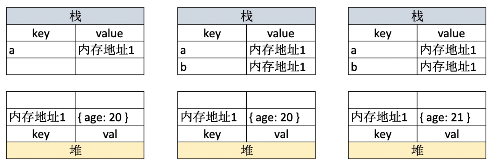

# L247 - 快速搞定前端技术一面 匹配大厂面试要求

#  HTML

#### 如何理解HTML语义化?
####  默认情况下，哪些HTML标签是块级元素、哪些是内联元素?

#  CSS

###  布局

####  盒子模型的宽度如何计算? 

* offsetWidth=(内容宽度＋内边距＋边框)，无外边距

  ```html
  div{
  	width:100px;// 即内容宽度
  	padding:10px;
  	border: 1px solid red
  }
  
  //offsetWidth = 122px
  ```

  

* 使offsetWidth === 设置的宽度，内边距和边框不占元素宽高，内容宽度会被压缩

  * `box-sizing:border-box;`

    ```html
    div{
    	width:100px;// 即盒子宽度   此时内容宽度为100-22=78px
    	padding:10px;
    	border: 1px solid red;
        box-sizing:border-box;
    }
    
    //offsetWidth = 100px
    ```

    

####  margin 纵向重叠的问题

* 相邻元素的margin-top和margin-bottom 会发生重叠

* 空白内容的标签也会重叠

* 相邻元素之间的margin距离以**最大的那个margin**为准

  * 若中间有空白内容标签，则比较空白标签margin-top、空白标签margin-bottom、上方元素margin-bottom、下方元素margin-top, 哪个值大则为上方元素与下方元素之间的距离

    ```html
    <!DOCTYPE html>
    <html>
    <head>
        <meta charset="UTF-8">
        <meta name="viewport" content="width=device-width, initial-scale=1.0">
        <meta http-equiv="X-UA-Compatible" content="ie=edge">
        <title>margin 纵向重叠</title>
        <style type="text/css">
            p {
                font-size: 16px;
                line-height: 1;
                margin: 15px;
                background-color: aqua;
            }
            div{
              margin-top:70px;
              margin-bottom: 5px;
              background-color: blue;
    
            }
        </style>
    </head>
    <body>   
        <p>AAA</p>
        <div></div>
        <div></div>
        <p>hhhhh</p>
    </body>
    </html>
    
    //1 div会重叠
    //2 比较div的margin-bottom(5px)、div的margin-top(70px)、<p>AAA</p>的margin-bottom(15px)、<p>hhhhh</p>的margin-top(15px),其中最大的是70px，
    //3 所以<p>AAA</p>与<p>hhhhh</p>之间的margin距离是70px
    ```


####  margin负值的问题

* margin-top 和margin-left负值，元素向上、向左移动，会影响其他元素
* margin-right负值，右侧元素左移，自身不受影响
* margin-bottom负值，下方元素上移，自身不受影响

####  BFC理解和应用

* 什么是BFC
  * Block format context ，块级格式化上下文
  * 一块独立渲染区域，内部元素的渲染不会影响边界以外的元素
* 形成 BFC的常见条件
  * float 不是none
  * position是absolute或 fixed
  * overflow不是visible
  * display是flex inline-block 等

####  float布局的问题，以及clearfix（手写）

* 如何实现圣杯布局和双飞翼布局
* 圣杯布局和双飞翼布局的目的
  * 三栏布局，中间一栏最先加载和渲染（内容最重要)
  * 两侧内容固定，中间内容随着宽度自适应
  * —般用于PC网页
* clearfix **清除浮动**

#### flex画色子

* 实现一个三点色子
* flex主要属性
  * align-self（交叉轴子元素）
  * justify-content（主轴）
  * align-items（交叉轴）
  * flex-direction（方向，水平：row）

###  定位

####  absolute和relative分别依据什么定位?

* absolute： 依据最近一层的定位元素定位（absolute, fixed,relative,body）
* relative： 相对自己

#### 居中对齐有哪些实现方式?

* 水平居中
  * inline元素： `text-align: center`
    * inline元素的父元素中设置 `text-align: center`
    * 定义 `text-align: center`属性的子标签会继承这个属性
  * block元素：`margin:auto`
    * block元素自身设置`margin:auto`
    * block元素自身设置`text-align: center`可以使其内部的文字水平居中
  * absolute元素:left: 50% + margin-left负值
    * 父元素为定位元素（absolute, fixed,relative,body）
    * absolute元素自身设置`left:50%; margin-left:-absolute元素自身宽的一半`
      * `left:50% `是右移父元素宽的一半，即absolute元素左边移动到父元素的中轴
      *  `margin-left:-absolute元素自身宽的一半`是利用margin负值使自身左移
* 垂直居中
  * inline元素:line-height的值等于height值
  
    * 父元素中设置line-height的值等于height值
  
  * block元素内容
  
    * 设置block元素中的文字垂直居中：设置自身line-height的值等于height值
  
  * absolute元素: top:50% + margin-top 负值
  
    * 父元素为定位元素（absolute, fixed,relative,body）
    * absolute元素自身设置`top:50%; margin-top:-absolute元素自身高的一半`
      * `top:50% `是右移父元素高的一半，即absolute元素上边移动到父元素的中轴
      *  `margin-top:-absolute元素自身宽的一半`是利用margin负值使自身上移
  
  * absolute元素: transform(-50%,-50%)
  
    * ```
      position: absolute;
      left: 50%;//右移父元素宽的一半
      top: 50%;//下移父元素高的一半 
      transform: translate(-50%, -50%)//自身左移上移自身的宽高的一半
      ```
  
    * 次方法兼容性差
  
    * 此方法不用计算自身元素的宽高的一半
  
  * absolute元素: top, left, bottom,right = 0 + margin: auto
  
    * ```
      position: absolute;
      top: 0;
      left: 0;
      bottom: 0;
      right: 0;
      margin: auto;
      ```


###  图文样式

####  line-height的继承问题

* 写具体数值，如30px，则继承该值

  * ```
      body {
            font-size: 20px;
            line-height: 25px;
        }
        p {
            background-color: #ccc;
            font-size: 16px;
        }
        //p行高25px
        //此时是p继承了 line-height: 25px; 
    ```

  

* 写比例，如2、1.5，则继承该比例

  * ```
       body {
            font-size: 20px;
            line-height: 2;
        }
        p {
            background-color: #ccc;
            font-size: 16px;
        }
        //p行高  16px*2 ,所以行高为32px
        //此时是p继承了 line-height: 2; 然后计算出行高32px
    ```

    

* 写百分比，如200%，则继承计算出来的值（考点)

  * ```
       body {
            font-size: 20px;
            line-height: 200%;//此时body行高40px
        }
        p {
            background-color: #ccc;
            font-size: 16px;
        }
        //p行高 20px*200% ,所以行高为40px
        //此时是body先计算出 line-height: 40px, 然后p标签继承了line-height: 40px
    ```


###  响应式

####  rem是什么?

* px，绝对长度单位，最常用，1px=2像素

* em ，相对长度单位，相对于父元素，不常用

* rem ，相对长度单位，相对于根元素，常用于响应式布局

  * ```
            html {
                font-size: 100px;
            }
            div {
                background-color: #ccc;
                margin-top: 10px;
                font-size: 0.16rem;//此时div的字体为0.16*100px=16px
            }
    ```

####  响应式布局的常见方案?  

* 使用media媒体查询，再根据不同屏幕尺寸设置html的font-size，再利用rem实现响应式

#### 网页视口尺寸

* `window.screen.height`//屏幕高度
* `window.innerHeight` //网页视口高度  
  * 屏幕减去页面上下导航的高度
* `document.body.clientHeight `// body高度 
  * body高度是根据内容变化的，内容越多高度就随之增加


####  vh/vw

* 1vh = 网页视口高度的1/100
  *  window.innerHeight === 100vh
* 1vw = 网页视口宽度的1/100
  * window.innerWidth === 100vw

* 1vmax = max(1vh, 1vw)  //谁大取谁
* 1vmin = min(1vh, 1vw)  //谁小取谁


#  javascript

##  变量类型和计算

####  typeof 能判断哪些类型

* 识别所有值类型

  

* 识别函数

* 判断是否是引用类型（不可再细分)

  


####  值类型和引用类型的区别

* 值类型

  * 值类型是用栈存储的

  ```js
  //值类型
  let a = 100
  let b = a
  a=200
  console.log (b)//打印结果为 100
  
  ```

  

* 引用类型

  * 引用类型是同时用堆栈存储的，实际内容存在堆中，栈中只存储了内存地址，所以两个变量实际是指向同一个内存地址的

  ```js
  //引用类型
  let a = { age: 20 }
  let b = a
  b.age = 21
  console.log (a.age)//打印结果为 21
  
  ```

  

* 常见值类型
  * `let a `:  undefined类型
  * 字符串
  * 数字
  * 布尔
  * es6中的symbol
* 常见引用类型
  * 对象
  * 数组
  * `const n = null` //特殊引用类型，指向空地址
  * 函数  //特殊引用类型  不存储数据

####  数据类型转换

#####  字符串拼接

```js
const a = 100 + 10// 110
const b = 100 + '10'//'10010'
const c = true + '10'//'true10 '
const a = 100 + true// 101
const a = 100 + false// 100

```

#####  if语句和逻辑运算

* truly变量: `!!a === true`的变量
* falsely变量:` !!a === false`的变量

```js
//以下是falsely变量。除此之外都是truly变量
!!0 === false
!!NaN === false
!!'' == false
!!null === false
!!undefined === false
!!false === false
```


#### 何时使用===何时使用==

*  ==
  * `100 == '100' `true
  * `0 == ''  ` true
  * `0 == false ` true
  * `false == ' '  `  true
  * `null ==undefined  `    true


**结论：**

```js
//除了== null 之外，其他都一律用===，例如
const obj = { x: 100 }
if (obj.a == null) { }
//相当于:
// if (obj.a == null || obj.a === undefined) {}

```

#### 手写深拷贝

```js
/**
 * 深拷贝
 * @param {Object} obj 要拷贝的对象
 */
function deepClone(obj = {}) {
    if (typeof obj !== 'object' || obj == null) {
        // obj 是 null ，或者不是对象和数组，直接返回 typeof null === 'object'
        return obj
    }

    // 初始化返回结果
    let result
    if (obj instanceof Array) {
        result = []
    } else {
        result = {}
    }

    for (let key in obj) {
        // 保证 key 不是原型的属性
        if (obj.hasOwnProperty(key)) {
            // 递归调用！！！
            result[key] = deepClone(obj[key])
        }
    }

    // 返回结果
    return result
}
```


##  原型和原型链

> [Javascript(0x07)-JS中的原型链](https://chuckiewill.github.io/2020/10/03/Javascript/Javascript(0x07)-JS%E4%B8%AD%E7%9A%84%E5%8E%9F%E5%9E%8B%E9%93%BE/)

**如何准确判断一个变量是不是数组 ?**

* `a instanceof Array `

**手写一个简易的jQuery , 考虑插件和扩展性**

* 插件即在显示原型上添加属性：`a.prototype.x = mmmm`
* 扩展性即在继承

**class的原型本质,怎么理解?**

* 原型及原型链的理解


##  作用域和闭包

> apply，call,bind
>
> https://blog.csdn.net/a15180180753/article/details/103495023
>
> https://blog.csdn.net/wyyandyou_6/article/details/81488103
>
> https://www.cnblogs.com/moqiutao/p/7371988.html

1. this的不同应用场景，如何取值?
   * 当做普通函数被调用
   * 使用call apply bind
   * 作为对象方法调用
   * 在class的方法中调用
   * 箭头函数

2. 手写bind函数

3. 实际开发中闭包的应用场景，举例说明
   * 隐藏数据
   * dom生成10个标签，点击第几个标签就弹出数字几

###  作用域

* 全局作用域

  * 全局定义

* 函数作用域

  * 函数体内定义

* 块级作用域（ES6新增)

  * if、while、for的`{ }`块中定义

  ```js
  if(true){
      let x = 100
  }
  console.log(x)//会报错
  ```


###  自由变量

* 自由变量定义：一个变量在当前作用域没有定义，但被使用了
* 向上级作用域，一层一层依次寻找，直至找到为止
* 如果到全局作用域都没找到，则报错xx is not defined

###  闭包

> 作用域应用的特殊情况，有两种表现:
>
> * 函数作为参数被传递
> * 函数作为返回值被返回

```js
//函数作为返回值
function create() {
    const a = 100
    return function () {
        console.log(a)
    }
}

const fn = create()
const a = 200
fn() // 100
```

```js
// 函数作为参数被传递
function print(fn) {
    const a = 200
    fn()
}
const a = 100
function fn() {
    console.log(a)
}
print(fn) // 100
```

**总结：**

* 所有的自由变量的查找，是在函数定义的地方，向上级作用域查找
* 不是在执行的地方查找！！！


###  this

> **this取什么值是在函数执行的时候确定的，不是在定义时确定的**

**情况1：**

* `.call()`函数会改变this指向，并且函数直接执行
* `.bind()`函数会改变this指向，并且需要接受返回的函数，然后再执行

```js
function fn1() {
  console.log(this)
}
fn1()// window

fn1.call({ x:100})// { x:100 }  此处函数直接执行
const fn2 = fn1.bind ({x: 200 })  //bind()函数可以重定义this的指向
fn2()// { x:200 }
```
**情况2：定时器**

* 定时器的回调函数中的this不再指向对象，而是指向window

```js
const zhangsan = {
  name:'张三',
  sayHi() {
    // this 即当前对象
    console.log(this)
  },
  wait() { 
    setTimeout( function( ) {
      // this === window
      console.log(this)
    })
  }
}
zhangsan.sayHi()
zhangsan.wait()
```
**情况3：箭头函数**

* 箭头函数的this取上级作用域的this

```js
const wangwu = {
  name:'王五',
  sayHi( ) {
    // this 即当前对象
    console. log ( this)
  },
  waitAgain() {
    //箭头函数的this取上级作用的this
    setTimeout(() => { 
      //this即当前对象
      console.log( this)
    })
  }
}
wangwu.sayHi()
wangwu.waitAgain()
```

**情况4：对象**

* 对象中方法this指向对象本身

```js
class People {
  constructor(name) {
    this.name = name
    this.age = 20
  }
  sayHi() {
    console.log (this)
  }
}
const chuckie = new People('chuckie')
chuckie.sayHi()// chuckie对象
```

###  apply,call,bind方法

> apply,call,bind方法是函数原型上的方法：Function.prototype.apply,,,,,,
>
> [JS中call()、apply()、bind()的区别及用法](https://blog.csdn.net/wyyandyou_6/article/details/81488103)
>
> [JS中的call、apply、bind方法详解](https://www.cnblogs.com/moqiutao/p/7371988.html)

* bind 是返回对应函数，便于稍后调用；apply 、call 则是立即调用 。
* 三者的相同点：都是用来改变this的指向
* call()和apply()的区别：
  * 相同点：都是调用一个对象的一个方法，用另一个对象替换当前对象（功能相同）
    
    * B.call(A, args1,args2);即A对象调用B对象的方法
    * F.apply(G, arguments);即G对象应用F对象的方法
    
  * 不同点：参数书写方式不同
  
    * call()的第一个参数是this要指向的对象，后面传入的是参数列表，参数可以是任意类型，当第一个参数为null、undefined的时候，默认指向window；
  
    * apply()：第一个参数是this要指向的对象，第二个参数是数组

###  手写bind

> * arguments : Javascript中存在一种名为伪数组的对象结构。还有像调用 getElementsByTagName , document.childNodes 之类的，它们返回NodeList对象都属于伪数组。不能应用 Array下的 push , pop 等方法。
> * 但是我们能通过 Array.prototype.slice.call 转换为真正的数组的带有 length 属性的对象，这样 domNodes 就可以应用 Array 下的所有方法了。
> * arguments中存储着传给当前函数的所有参数

```js
// 模拟 bind
Function.prototype.bind1 = function () {
    // 将参数拆解为数组
    const args = Array.prototype.slice.call(arguments)

    // 获取 this（数组第一项）
    const t = args.shift()

    // fn1.bind1(...) 中的 fn1
    const self = this

    // 返回一个函数
    return function () {
        return self.apply(t, args)
    }
}

function fn1(a, b, c) {
    console.log('this', this)
    console.log(a, b, c)
    return 'this is fn1'
}

const fn2 = fn1.bind1({x: 100}, 10, 20, 30)
const res = fn2()
console.log(res)


//打印结果
this { x: 100 }
10 20 30   
this is fn1
```

###  闭包的应用

* 隐藏数据，缓存插件

```js
// 闭包隐藏数据，只提供 API
function createCache() {
    const data = {} // 闭包中的数据，被隐藏，不被外界访问
    return {
        set: function (key, val) {
            data[key] = val
        },
        get: function (key) {
            return data[key]
        }
    }
}

const c = createCache()
c.set('a', 100)
console.log( c.get('a') )

//打印结果
100
```

* dom生成10个标签，点击第几个标签就弹出数字几

```js
//正确方法
let a
for (let i = 0; i < 10; i++) {
    a = document.createElement('a')
    a.innerHTML = i + '<br>'
    a.addEventListener('click', function (e) {
        e.preventDefault()
        alert(i)
    })
    document.body.appendChild(a)
}

//错误方法
let a, i
for ( i = 0; i < 10; i++) {
    a = document.createElement('a')
    a.innerHTML = i + '<br>'
    a.addEventListener('click', function (e) {
        e.preventDefault()
        alert(i)
    })
    document.body.appendChild(a) //此时每次弹出都是10
}

```


##  异步和单线程

> [Javascript(0x05)-异步编程](https://chuckiewill.github.io/2020/08/05/Javascript/Javascript-0x05-异步编程/)
>
> [Javascript(0x06)-js异步中的任务队列](https://chuckiewill.github.io/2020/10/02/Javascript/Javascript(0x06)-js异步中的任务队列/)

* 同步和异步的区别是什么?

* 手写用Promise加载一张图片

* 前端使用异步的场景有哪些?

* setTimeout问题（js任务队列）

  ```js
  //setTimeout笔试题
  console.log(1)
  setTimeout ( function () {
    console.log(2)
  },1000)
  console.log(3)
  setTimeout( function () {
    console.log(4)
  },0)
  console.log(5)
  
  //打印结果
  1,3,5,4,2
  ```

* 手写用Promise加载一张图片

  ```js
  function loadImg(src) {
      const p = new Promise(
          (resolve, reject) => {
              const img = document.createElement('img')
              img.onload = () => {
                  resolve(img)
              }
              img.onerror = () => {
                  const err = new Error(`图片加载失败 ${src}`)
                  reject(err)
              }
              img.src = src
          }
      )
      return p
  }
  
  
  
  const url1 = 'https://img.mukewang.com/5a9fc8070001a82402060220-140-140.jpg'
  const url2 = 'https://img3.mukewang.com/5a9fc8070001a82402060220-100-100.jpg'
  
  //递归回调写法
  loadImg(url1).then(img1 => {
    console.log(img1.height, img1.width)
    loadImg(url2).then(img2 => {
      console.log(img2.height, img2.width)
    })
  })
  
  //promise写法
  loadImg(url1).then(img1 => {
      console.log(img1.width)
      return img1 // 普通对象
  }).then(img1 => {
      console.log(img1.height)
      return loadImg(url2) // promise 实例
  }).then(img2 => {
      console.log(img2.width)
      return img2
  }).then(img2 => {
      console.log(img2.height)
  }).catch(ex => console.error(ex))
  
  // async await 写法
  async function test(){
    let img1 = await loadImg(url1)
    console.log(img1.width,img1.height)
    let img2 = await loadImg(url2)
    console.log(img2.width,img2.height)
  }
  test()
  ```

* 请描述event loop (事件循环/事件轮询）的机制，可画图

  * 自行回顾event loop的过程
  * 和DOM渲染的关系
  * 微任务和宏任务在event loop过程中的不同处理

* 什么是宏任务和微任务，两者有什么区别?

* Promise有哪三种状态?如何变化?

  * pending 状态，不会触发then和catch
  * resolved状态，会触发后续的then回调函数，不会触发catch
  * rejected状态，会触发后续的catch回调函数，不会触发then

* 场景题- promise then和catch的连接

  ```js
  // 第一题
  Promise.resolve().then(() => {
      console.log(1)
  }).catch(() => {
      console.log(2)
  }).then(() => {
      console.log(3)
  })
  
  // 第二题
  Promise.resolve().then(() => { // 返回 rejected 状态的 promise
      console.log(1)
      throw new Error('erro1')
  }).catch(() => { // 返回 resolved 状态的 promise
      console.log(2)
  }).then(() => {
      console.log(3)
  })
  
  // 第三题
  Promise.resolve().then(() => { // 返回 rejected 状态的 promise
      console.log(1)
      throw new Error('erro1')
  }).catch(() => { // 返回 resolved 状态的 promise
      console.log(2)
  }).catch(() => {
      console.log(3)
  })
  ```

  

* 场景题- async/await语法

  ```js
  async function fn( ) {
      return 100
  }
  ( async function ( ) {
  const a = fn() // ??   
  const b = await fn()// ??
  })()
  
  a 为一个Promise对象
  b 为 100
  ```

  ```js
  ( async function () {
      console.log( 'start ' )
      const a = await 100
      console.log( 'a', a)
      const b = await Promise.resolve(200)
      console.log ( 'b', b)
      const c = await Promise.reject(300) //此处报错  后续不再执行
      console.log( 'c', c)
      console.log( 'end ' )
  })()//执行完毕，打印出那些内容?
  
  //打印结果
  start
  a100
  b200
  ```

  

* 场景题- promise和setTimeout的顺序

  ```js
  console.log ( 100)
  setTimeout(() => {
      console.log ( 200)
  })
  Promise.resolve( ) .then(() =→>{
      console.log( 300)
  })
  console.log (400)
  
  //打印结果
  100
  400
  300
  200
  ```

  

* 场景题–外加async/await的顺序问题

  ```js
  async function async1 ( ) {
      console.log ( 'async1 start ')  //2
      await async2()                 //注意  此处先执行async2  然后将后面的代码加入微任务队列
      console.log( 'async1 end ' ) //6
  }
  
  async function async2 (){
      console. log( 'async2 ') //3
  }
  
  console. log( 'script start ' )   //1
  
  setTimeout( function () {
      console.log ( 'setTimeout ' )  //8
  }，0)
  
  async1()
  
  //注意  初始化promise时,传入的函数会立刻被执行
  new Promise ( function ( resolve) {
      console.log ( 'promise1' )  //4
      resolve()
  }).then (function ( ) {
      console.log( ' promise2' )  //7
  })
  
  console.log( 'script end ' )  // 5
  
  ```

  

* async/await和Promise的关系

  * 执行async函数，返回的是 Promise对象
  * await相当于Promise 的then
  * try...catch可捕获异常，代替了Promise的catch
  
* 宏任务有哪些?微任务有哪些?微任务触发时机更早

* 微任务、宏任务和DOM渲染的关系

* 微任务、宏任务和DOM渲染，在event loop 的过程

### 并行、并发、单线程

- 并行是指同时执行，只有多线程的语言才支持
- 并发本质是充分利用cpu资源（多个任务交替使用cpu），并没有正真同时执行
- JavaScript、Python都是单线程语言，只能实现并发，不能实现并行
- Python的多线性是通过伪线程实现的
- JavaScript 并发
  - 宏任务，微任务机制实现并发，EventLoop
  - 本质是CPU足够快，当请求资源时（查询数据库、网络请求等）,此时CPU就空出来了，而这时CPU会切换到其他任务，只要切换的足够快，就实现了并发。
- Node.js 优势是只能异步编程，不支持同步编程，异步编程就大大提升了资源的利用率
- 浏览器和nodejs 已支持JS启动进程，即并发，如Web Worker
- JS和DOM渲染共用同一个线程，因为JS可修改DOM结构

### 同步和异步

* 异步是基于js单线程的	

* 异步不会阻塞代码执行, 定时器函数
* 同步会阻塞代码执行，例如`alert()`

### 应用场景

* 网络请求，如ajax图片加载
* 定时任务，如setTimeout
* 查询数据库
* 读写文件
* DOM事件

###  event loop

> event loop(事件循环/事件轮询/任务队列)
>
> [Javascript(0x06)-js异步中的任务队列](https://chuckiewill.github.io/2020/10/02/Javascript/Javascript(0x06)-js异步中的任务队列/)

* JS是单线程运行的
* 异步要基于回调来实现
* event loop就是异步回调的实现原理
* 异步和DOM事件都是使用回调，基于event loop

###  宏任务和微任务

> 宏任务macroTask和微任务microTask

* 宏任务: setTimeout , setInterval , Ajax，DOM事件 ；    宏任务是由浏览器规定的

* 微任务: Promise async/await；      微任务是ES6语法规定的

* 微任务执行时机比宏任务要早

  ```js
  console.log(100)
  setTimeout(() => {
      console.log(200)
  })
  Promise.resolve().then(() => {
      console.log(300)
  })
  console.log(400)
  // 100 400 300 200
  ```

  

**微任务和宏任务的区别**

* 宏任务: DOM渲染后触发,如setTimeout
  * ES 语法没有，JS 引擎不处理，浏览器（或 nodejs）干预处理, 
  * 即交给Web APIs处理，然后回调函数加入Callback Queue
* 微任务: DOM渲染前触发,如Promise 
  * ES 语法标准之内，JS 引擎来统一处理。
  * 即微任务**不交给Web APIs处理， 直接加入micro task queue**,  Call Stack 清空后直接在micro task queue中提取微任务的回调函数执行

```js
// 修改 DOM
const $p1 = $('<p>一段文字</p>')
const $p2 = $('<p>一段文字</p>')
const $p3 = $('<p>一段文字</p>')
$('#container')
    .append($p1)
    .append($p2)
    .append($p3)

 // 微任务：渲染之前执行（DOM 结构已更新）
 Promise.resolve().then(() => {
     const length = $('#container').children().length
     alert(`micro task ${length}`)// 此时DOM还没有渲染
 })

// 宏任务：渲染之后执行（DOM 结构已更新）
setTimeout(() => {
    const length = $('#container').children().length
    alert(`macro task ${length}`)// 此时DOM已经渲染
})
```

**执行流程：**

1. 代码在Call  Stack中执行，遇到同步代码则直接执行，遇到遇到微任务则加入micro task queue ,遇到宏任务则交给我Web APIs 处理，Web APIs处理完成后将回调函数加入宏任务队列（Callback Queue）
2. 代码都执行完，Call Stack空闲后，从micro task queue 提取微任务的回调函数执行
3. Call Stack再次空闲，且micro task queue也为空后，开始DOM渲染
4. DOM渲染完后，触发Event Loop ,从宏任务队列提取回调函数执行


###  event loop和DOM渲染

* 每次Call Stack清空(即每次轮询结束) , 即同步任务执行完

* 都是DOM重新渲染的机会, DOM结构如有改变则重新渲染

* 然后再去触发下一-次 Event Loop

  ```js
  const $p1 = $('<p>一段文字</p>')
  const $p2 = $('<p>一段文字</p>')
  const $p3 = $('<p>一段文字</p>')
  $('#container')
              .append($p1)
              .append($p2)
              .append($p3)
  
  Promise.resolve().then(() => {
   const length = $('#container').children().length
   alert(`micro task ${length}`)// 此时DOM还没有渲染
   alert('本次 call stack 结束，DOM 结构已更新，但尚未触发渲染')
  })
  // （alert 会阻断 js 执行，也会阻断 DOM 渲染，便于查看效果）
  // 到此，即本次 call stack 结束后（同步任务都执行完了），浏览器会自动触发渲染，不用代码干预
  
  // 另外，按照 event loop 触发 DOM 渲染时机，setTimeout 时 alert ，就能看到 DOM 渲染后的结果了
  setTimeout(function () {
      alert('setTimeout 是在下一次 Call Stack ，就能看到 DOM 渲染出来的结果了')
  })
  ```


#  JS  Web API 

##  DOM

* DOM是哪种数据结构
  * 树结构（DOM树）
* DOM操作的常用API
* attribute和property的区别
* 一次性插入多个DOM节点，考虑性能

###  property 和attribute区别

* property :修改对象属性，不会体现到 html结构中(修改的是model层的数据) ； 推荐
* attribute :修改html属性，会改变html结构（修改的view层的数据）
* 两者都有可能引起DOM重新渲染

```js
// property 形式
p1.style.width = '100px'
console.log( p1.style.width )
p1.className = 'red'
console.log( p1.className )
console.log(p1.nodeName)
console.log(p1.nodeType) // 1

// attribute 形式
p1.setAttribute('data-name', 'micro')
console.log( p1.getAttribute('data-name') )
p1.setAttribute('style', 'font-size: 50px;')
console.log( p1.getAttribute('style') )
```


###  操作DOM节点

```js
// 以ID名获取元素
const div1 = document.getElementById('div1') 
console.log('div1', div1)

// 以元素的标签名获取元素  获取的结果为集合
const divList = document.getElementsByTagName('div') 
console.log('divList.length', divList.length)
console.log('divList[1]', divList[1]) //以索引获取集合中需要的元素

// 以元素的class名获取元素  获取的结果为集合
const containerList = document.getElementsByClassName('container') // 集合
console.log('containerList.length', containerList.length)
console.log('containerList[1]', containerList[1]) //以索引获取集合中需要的元素

// 以查询的方式获取元素，查询值为元素的标签名  获取的结果为集合
const pList = document.querySelectorAll('p')
console.log('pList', pList)

const pList = document.querySelectorAll('p')
const p1 = pList[0]

```

###  操作DOM结构

>  [HTML DOM nodeType 属性](https://www.w3school.com.cn/jsref/prop_node_nodetype.asp)
>
> nodeType ===1 表示 元素为标签
>
>  nodeType ===3 表示 元素为text类型，即为标签的文本内容

```js
const div1 = document.getElementById('div1')
const div2 = document.getElementById('div2')

// 新建节点
const newP = document.createElement('p')
newP.innerHTML = 'this is newP' //填写元素内容
// 插入节点
div1.appendChild(newP)//将新节点加入到父节点(div1)中

// 移动节点
// p1节点原本是在div1中的， 以下操作会将p1移动到div2中
const p1 = document.getElementById('p1')
div2.appendChild(p1)

// 获取父元素
// 获取p1元素的父节点
console.log( p1.parentNode )

// 获取子元素列表
// 获取div1节点的所有子节点
const div1ChildNodes = div1.childNodes
console.log( div1.childNodes )
const div1ChildNodesP = Array.prototype.slice.call(div1.childNodes).filter(child => {
    if (child.nodeType === 1) { //nodeType ===1 表示 元素为标签
        return true            
    }
    return false
})
console.log('div1ChildNodesP', div1ChildNodesP)

// 删除子节点
// 删除div1下的子节点
div1.removeChild( div1ChildNodesP[0] )
```

###  DOM性能

> * 频繁更新DOM会耗费很多资源，所以尽量减少刷新的次数，可以将更新的整理好后一次性更新

**将频繁操作改成一次性操作**

* 利用`document.createDocumentFragment()`

```js
const list = document.getElementById('list')

// 创建一个文档片段，此时还没有插入到 DOM 结构中
const frag = document.createDocumentFragment()

for (let i  = 0; i < 20; i++) {
    const li = document.createElement('li')
    li.innerHTML = `List item ${i}`

    // 先插入文档片段中
    frag.appendChild(li)
}

// 都完成之后，再统一插入到 DOM 结构中
list.appendChild(frag)

console.log(list)
```

**DOM查询做缓存**

```js
//DOM查询做缓存
//不缓存 DOM查询结果
//此时每次循环都会判断i < document.getElementsByTagName('p' )，每次判断都会查询一次长度
for (let i = 0; i < document.getElementsByTagName('p' ).length; i++){
  //每次循环，都会计算 length ,频繁进行DOM查询
}
//缓存DOM查询结果
const pList = document.getElementsByTagName( 'p')
const length = pList.length
for ( let i = 0; i < length; i++) {
  //缓存length ,只进行一次DOM查询
}
```

### PS: 测试代码

```html
<!DOCTYPE html>
<html lang="en">
    <head>
        <meta charset="UTF-8">
        <meta name="viewport" content="width=device-width, initial-scale=1.0">
        <meta http-equiv="X-UA-Compatible" content="ie=edge">
        <title>dom 演示</title>

        <style>
            .container {
                border: 1px solid #ccc;
            }
            .red {
                color: red;
            }
        </style>
    </head>
    <body>
        <div id="div1" class="container">
            <p id="p1">一段文字 1</p>
            <p>一段文字 2</p>
            <p>一段文字 3</p>
        </div>
        <div id="div2">
            
        </div>
        <ul id="list">
        </ul>

        <script src="./dom-3.js"></script>
    </body>
</html>
```


## BOM

**navigator**

```js
// navigator
const ua = navigator.userAgent
const isChrome = ua.index0f ( ' Chrome')
console.log ( isChrome)


```

**history**

```js
// history
history.back()//后退
history.forward()//前进
```


**screen**

```js
// screen
console.log(screen.width)
console.log ( screen.height)
```


**location**

```js
//location
console.log(location.href )//    查看url
console.log(location.protocol)// 查看协议：'http: ' 或'https : '
console.log(location.pathname)// 查看路由路径 ' /learn/199 '
console.log( location.search)//  查看参数
console.log ( location.hash)//  
```


##  事件

* 编写一个通用的事件监听函数
* 描述事件冒泡的流程
* 无限下拉的图片列表，如何监听每个图片的点击?  事件代理

###  事件绑定

> * 阻止事件默认行为：`event.preventDefault()` ;  例如点击a标签时会阻止跳转

**通用的事件绑定函数--简版**

```js
// 通用的事件绑定函数--简版
// elem:需要绑定事件的元素， type:事件类型 ， fn:回调函数
function bindEvent(elem, type, fn) {
    elem.addEventListener(type, fn)
}

// 普通绑定
const btn1 = document.getElementById('btn1')
bindEvent(btn1, 'click', event => {
    // console.log(event.target) // 获取触发的元素
    event.preventDefault() // 阻止默认行为  例如点击a标签时会阻止跳转
    alert(event.target.innerHTML)
})
```

**通用的事件绑定函数--可选择事件代理**

```js
//html结构
<div class="maopao">
  <h1>事件代理</h1>
  <div id="div3">
      <a href="#">a1</a><br>//需求：点击每个a标签都弹出标签内容
      <a href="#">a2</a><br>//如果给每个a标签绑定相同的事件就太冗余了
      <a href="#">a3</a><br>//在父元素中处理事件
      <a href="#">a4</a><br>//注意：在父元素上绑定事件时需要判断是不是为a标签，以免父元素本身和其它子元素触发事件
      <button id="but1">加载更多...</button>
  </div>
</div>
```


```js
// 通用的事件绑定函数--可选择事件代理
// elem:需要绑定事件的元素， type:事件类型 ,selector:事件代理的元素, fn:回调函数
function bindEvent(elem, type, selector, fn) {
    //当传入3个参数，即不传入代理事件元素
    if (fn == null) {
        fn = selector
        selector = null
    }
    elem.addEventListener(type, event => {
        const target = event.target
        if (selector) {
            // 代理绑定
            if (target.matches(selector)) {//判断元素是否为代理事件的元素
                // fn.call(target,event)
                fn(event)//执行回调函数
            }
        } else {
            // 普通绑定
            fn(event)
        }
    })
}

// 代理绑定
const div3 = document.getElementById('div3')
bindEvent(div3, 'click', 'a', event => { //a标签即为事件代理的元素
    event.preventDefault()
    alert(event.target.innerHTML)
})
const but1 = document.getElementById('but1')
bindEvent(but1, 'click', event => { //没有事件代理即可不传该参数
    event.preventDefault()
    alert(event.target.innerHTML)
})
```


###  事件冒泡

> * 事件向上冒泡时，回调函数event.target始终为**实际点击的元素**
> *  阻止冒泡: `event.stopPropagation()`

```html
//html结构
    <body>
        <div class="maopao">
          <h1>冒泡测试</h1>
          <div id="div1">
              <p id="p1">激活</p>
              <p id="p2">取消</p>
              <p id="p3">取消</p>
              <p id="p4">取消</p>
          </div>
          <div id="div2">
              <p id="p5">取消</p>
              <p id="p6">取消</p>
          </div>
        </div>
        <script src="./event.js"></script>
    </body>
```


```js
// 通用的事件绑定函数--简版
// elem:需要绑定事件的元素， type:事件类型 ， fn:回调函数
function bindEvent(elem, type, fn) {
    elem.addEventListener(type, fn)
}

const p1 = document.getElementById('p1')
bindEvent(p1, 'click', event => {
    event.stopPropagation() // 阻止冒泡
    console.log('激活')
    console.log('冒泡-click p1',event.target) //打印p1
})
const body = document.body
bindEvent(body, 'click', event => {
    console.log('取消')
    console.log('冒泡-click body',event.target)//打印实际点击的元素
})
const div2 = document.getElementById('div2')
bindEvent(div2, 'click', event => {
    console.log('取消')
    console.log('冒泡-click div2',event.target)////打印实际点击的元素
})
```

###  事件代理

> * 事件代理是指将子元素的事件绑定到父元素上处理
>
> * 应用场景：无限下拉的图片，点击每个图片的事件处理效果相同，此时如果给每一个元素绑定相同的事件处理函数就太浪费资源了，而且代码也太冗余了，利用事件代理就可以在其父元素上统一监听，绑定一次即可

```html
//html结构
<div class="maopao">
  <h1>事件代理</h1>
  <div id="div3">
      <a href="#">a1</a><br>//需求：点击每个a标签都弹出标签内容
      <a href="#">a2</a><br>//如果给每个a标签绑定相同的事件就太冗余了
      <a href="#">a3</a><br>//在父元素中处理事件
      <a href="#">a4</a><br>//注意：在父元素上绑定事件时需要判断是不是为a标签，以免父元素本身和其它子元素触发事件
      <button>加载更多...</button>
  </div>
</div>
```

```js
// 通用的事件绑定函数--简版
//elem:需要绑定事件的元素， type:事件类型 ， fn:回调函数
function bindEvent(elem, type, fn) {
    elem.addEventListener(type, fn)
}

//代理绑定
const div3 = document.getElementById('div3')
bindEvent(div3, 'click', event => {
  event.preventDefault() //点击a标签时会阻止跳转
  event.stopPropagation() //阻止冒泡
  const target = event.target
  if (target.nodeName === 'A'){ //只有点击的元素为a标签时才处理，避免父元素本身和其它子元素触发事件
    alert(target.innerHTML)
  }
})
```


##  AJAX

> jQuery:https://blog.csdn.net/xianhenyuan/article/details/92669817
>
> Fetch: https://developer.mozilla.org/zh-CN/docs/Web/API/Fetch_API/Using_Fetch
>
> axios: http://www.axios-js.com/zh-cn/

* 手写一个简易的ajax
* 跨域的常用实现方式

###  XMLHttpRequest

> XMLHttpRequest是浏览器的API，所以在使用时需要结合html文件，在浏览器中打开，否则会报错（直接在node.js环境中使用就会报错）

**GET**

```js
//1 实例化
const xhr = new XMLHttpRequest()
//2 发送请求
// 参数：请求方法；资源地址；是否异步：true为异步，false为同步
xhr.open('GET', '/data/test.json', true)
//3 回调函数
//  readyState变化时会触发这个回调函数
xhr.onreadystatechange = function () {
    if (xhr.readyState === 4) {
        if (xhr.status === 200) {
            // console.log(
            //     JSON.parse(xhr.responseText)
            // )
            alert(xhr.responseText)
        } else if (xhr.status === 404) {
            console.log('404 not found')
        }
    }
}
//4 发送数据：因为这里是get请求，所以发送的数据是null，若是post请求则直接将
xhr.send(null)
```

**POST**

```js
//1 实例化
const xhr = new XMLHttpRequest()
//2 发送请求
// 参数：请求方法；资源地址；是否异步：true为异步，false为同步
xhr.open('POST', '/data/test.json', true)
//3 回调函数
xhr.onreadystatechange = function () {
    if (xhr.readyState === 4) {
        if (xhr.status === 200) {
            // console.log(
            //     JSON.parse(xhr.responseText)
            // )
            alert(xhr.responseText)
        } else if (xhr.status === 404) {
            console.log('404 not found')
        }
    }
}
//4 发送数据：因为这里是get请求，所以发送的数据是null，若是post请求则直接将
cosnt list = {
    "name": "chuckie"
}
xhr.send(JSON.stringify(list))
```

**promise写法**

```js
function ajax(url) {
    const p = new Promise((resolve, reject) => {
        const xhr = new XMLHttpRequest()
        xhr.open('GET', url, true)
        xhr.onreadystatechange = function () {
            if (xhr.readyState === 4) {
                if (xhr.status === 200) {
                    resolve(
                        JSON.parse(xhr.responseText)
                    )
                } else if (xhr.status === 404 || xhr.status === 500) {
                    reject(new Error('404 not found'))
                }
            }
        }
        xhr.send(null)
    })
    return p
}

const url = '/data/test.json'
ajax(url)
.then(res => console.log(res))
.catch(err => console.error(err))
```


###  状态码

**`xhr.readyState`**

* 0-(未初始化)还没有调用send()方法
* 1-(载入）已调用send()方法，正在发送请求
* 2-(载入完成) send()方法执行完成，已经接收到全部响应内容
* 3-(交互）正在解析响应内容
* 4-(完成）响应内容解析完成，可以在客户端调用

**`xhr.status`**

* 2xx-表示成功处理请求，如200
* 3xx–需要重定向，浏览器直接跳转，如301 302 304
* 4xx-客户端请求错误，如404 403
* 5xx -服务器端错误

###  跨域

> [HTTP(0x03)-跨域问题](https://chuckiewill.github.io/2020/09/03/HTTP/HTTP(0x03)-跨域问题/)

同源策略，

跨域解决方案

JSONP

CORS

##  存储

描述cookie localStorage sessionStorage区别

* 容量
* API易用性
* 是否跟随http请求发送出去

**cookie**

* cookie可以实现存储的原因是，在页面刷新时，cookie的值不会清零，但是cookie本身不是用来存储的
* cookie的缺点
  * 存储有限，最大4KB
  * 每次http请求时都需要将cookie发送到服务端，增加了请求数据量
  * 只能用`document.cookie` = '..’来修改，该接口太过简陋，使用不方便

**localStorage和sessionStorage**

* HTML5专门为存储而设计，最大可存5M

* API简单易用setItem getItem

  * 以键值对的形式存储

  ```js
  localstorage.setItem( 'a', 100)
  localstorage.getItem( 'a') //"100"     //注意返回结果都为字符串，会有强制类型转换
  sessionStorage.setItem( 'b', '200')
  sessionStorage.getItem( 'b')//"200"
  ```

  

* 不会随着http请求被发送出去


* localStorage和sessionStorage区别
  * localStorage 数据会永久存储，除非代码或手动删除 ，（多用此方法）
  * sessionStorage数据只存在于当前会话，浏览器关闭则清空