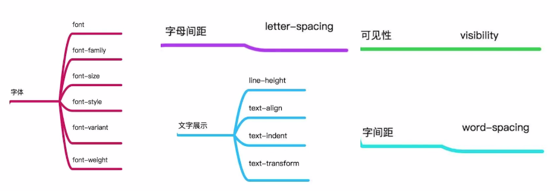
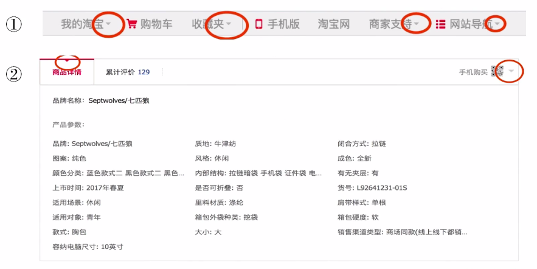
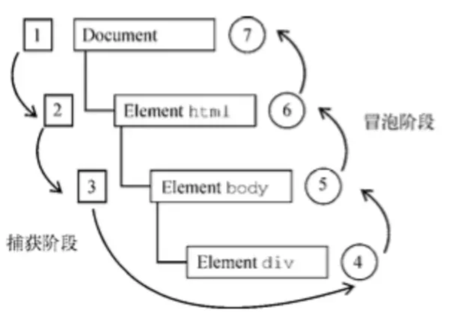

#  一、CSS 

##  1.1 基础知识

###  盒子模型

**定义**

CSS 基础框盒模型是 CSS 规范的一个模块，它定义了一种长方形的盒子, 包括它们各自的内边距（padding）与外边距（margin ），并根据视觉格式化模型来生成元素，对其进行布置、编排、布局（lay out）。常被直译为盒子模型、盒模型或框模型

**分类**

* 盒模型从标准定义上分为标准盒模型和替代（IE）盒模型
  * 标准盒模型的宽高计算方式:` width = width; height = height`
  * 替代(IE)盒模型的宽高计算方式:` width = width + padding + border; height = height + padding + border`
  * 盒模型切换
    * 标准盒模型 `box-sizing： content-box`，默认情况
    * 替代(IE)盒模型 `box-sizing：border-box`
* 从元素类型上分为块级盒子（Block box） 和 内联盒子（Inline box)

###  BFC

**定义**

块格式化上下文（Block FormattingContext，BFC） 是 Web 页面的可视 CSS 渲染的一部分，是块盒子的布局过程发生的区域，也是浮动元素与其他元素交互的区域。 简单的说BFC是一个完全独立的空间, 这个空间里子元素的渲染不会影响到外面的布局

**创建BFC**

* 常见：

  * float 不是none

  * position是absolute或 fixed

  * overflow不是visible

  * display是flex inline-block table-cell 等

* 完整：

  * 根元素（） 

  * 浮动元素（元素的 float 不是 none） 

  * 绝对定位元素（元素的 position为 absolute 或 fixed） 

  * 行内块元素（元素的 display为 inline-block） 

  * 表格单元格（元素的 display为 table-cell，HTML表格单元格默认为该值） 

  * 表格标题（元素的 display为 table-caption，HTML表格标题默认为该值） 

  * 匿名表格单元格元素（元素的 display为 table、table-row、 table-row-group、table-header-group、table-footer-group（分别是HTML table、row、tbody、thead、tfoot 的默认属性）或 inline-table） 

  * overflow 计算值(Computed)不为 visible 的块元素 

  * display值为 flow-root 的元素 

  * contain值为 layout、content 或 paint 的元素 

  * 弹性元素（display为 flex或 inline-flex元素的直接子元素） 

  * 网格元素（display为 grid 或 inline-grid 元素的直接子元素） 

    多列容器（元素的 column-count 或 column-width (en-US) 不为 auto，包括 column-count 为 1） 

  * column-span为 all的元素始终会创建一个新的BFC，即使该元素没有包裹在一个多列容器中（标准变更，Chrome bug）。

###  css 选择器


##  1.2 面试题

###  什么是盒模型?

###  盒模型的分类有？

###  盒模型的切换？

###  什么是 BFC?

###  如何创建 BFC?

###   BFC 解决的什么问题？

* 使用Float脱离文档流，父元素高度塌陷问题
  * 作用于父元素

* 垂直方向margin重叠的问题   
  * 作用于平行元素之间

```html
<!DOCTYPE html>
<html lang="en">
<head>
  <meta charset="UTF-8" />
  <meta name="viewport" content="width=device-width, initial-scale=1.0" />
  <title>css-box</title>
  <style>
    .test{
      background: red;
      color: black;
      width: 200px;
      line-height: 100px;
      text-align: center;
      margin: 50px;
    }

    .box-container {
      overflow: hidden;
    }
  </style>
</head>
<body>
  <!-- 修改前 -->
  <div class="test">box-one</div>
  <div class="test">box-two</div>
  <!-- 修改后 -->
  <div class="test">box-one</div>
  <div class="box-container">
    <div class="test">box-two</div>
  </div>
</body>
</html>
```

###  什么是 css 选择器优先级

* css选择器优先级是基于不同种类选择器组成的匹配规则

###  css 选择器的优先级

* !important> 行内样式 > ID 选择器 > 类、伪类、属性选择器> 标签、伪元素选择器> 通配符、子类选择器、兄弟选择器

### CSS 选择器是什么？

* 通俗的讲 CSS 选择器 用来对选定的页面元素进行样式修改

###  css 选择器有哪些？

```
选择器          式例
标签选择器      h1 { }
通配选择器      * { }
类选择器       .box { }
ID 选择器      #unique { }
标签属性选择器  a[title] { }
伪类选择器     p:first-child { }
伪元素选择器    p::first-line { }
后代选择器     article p
子代选择器     article > p
相邻兄弟选择器  h1 + p
通用兄弟选择器  h1 ~ p
```

* 标签属性选择器

```css
/* 存在title属性的<a> 元素 */
a[title] {
color: purple;
}
/* 存在href属性并且属性值匹配"https://example.org"的<a> 元素 */
a[href="https://example.org"] {
color: green;
}
/* 存在href属性并且属性值包含"example"的<a> 元素 */
a[href*='example'] {
font-size: 2em;
}
/* 存在href属性并且属性值结尾是".org"的<a> 元素 */
a[href$='.org'] {
font-style: italic;
}
/* 存在class属性并且属性值包含以空格分隔的"logo"的<a>元素 */
a[class~='logo'] {
padding: 2px;
}
```

* 伪元素选择器
  * 伪元素是一个附加至选择器末的关键词，允许你对被选择元素的特定部分修改样式

```html
<!DOCTYPE html>
<html lang="en">

<head>
  <meta charset="UTF-8" />
  <meta http-equiv="X-UA-Compatible" content="IE=edge" />
  <meta name="viewport" content="width=device-width, initial-scale=1.0" />
  <title>Document</title>
  <style>
    p {
      width: 60px;
    }

    /* 每一个 <p> 元素的第一行。 */
    p::first-line {
      color: blue;
      text-transform: uppercase;
    }
  </style>
</head>

<body>
  <p>
    程序员的梦工厂
  </p>
  <p>
    程序员的梦工厂
  </p>
  <p>
    程序员的梦工厂
  </p>
  <p>
    程序员的梦工厂
  </p>
  <p>
    程序员的梦工厂
  </p>
  <p>
    程序员的梦工厂
  </p>
</body>
</html>
```

* 通 用 兄 弟 选 择 器
  * 位 置 无 须 紧 邻，只 须 同 层 级，A~ B 选 择 A 元 素 之 后 所 有 同 层 级 B 元 素

```html
<!DOCTYPE html>
<html lang="en">
<head>
  <meta charset="UTF-8" />
  <meta http-equiv="X-UA-Compatible" content="IE=edge" />
  <meta name="viewport" content="width=device-width, initial-scale=1.0" />
  <title>Document</title>
  <style>
    p~span {
      color: red;
    }
  </style>
</head>
<body>
  <span>This is not red.</span>
  <p>Here is a paragraph.</p>
  <code>Here is some code.</code>
  <span>This is red</span>
  <span>This is red</span>
</body>
</html>
```


###  CSS中哪些属性是可以继承的? 



### px、em、rem、vw+vh区别

px:  绝对单位，网页开发基本长度单位 1px = 2像素
em: 相对单位，相对当前盒子字体大小进行计算，若没有设置字体大小则按浏览器默认字体大小计算
rem: 相对单位，相对根元素html字体大小进行计算，若没有设置字体大小则按浏览器默认字体大小计算
vw+vh: 相对单位，相对当前网页视口宽度和高度进行计算

###  三栏布局

####  float

```html
<!DOCTYPE html>
<html lang="en">
<head>
	<meta charset="UTF-8">
	<title>CSS实现三栏布局-浮动布局</title>
	<style type="text/css">

    * {
      margin: 0px;
      padding: 0px;
    }

    div {
      height: 100px;
    }

    .left {
      float: left;
      width: 100px;
      background: red;
    }

    .center {
      background: green;
      margin-left: 100px;
      margin-right: 100px;
    }

    .right {
      float: right;
      width: 100px;
      background: blue;
    }

	</style>
</head>
<body>
  <div class="box">
    <div class="left">left</div>
    <div class="right">right</div>    
    <div class="center">center</div>
  </div>
</body>
</html>
```

####  flex

```html
<!DOCTYPE html>
<html lang="en">
<head>
	<meta charset="UTF-8">
	<title>CSS实现三栏布局-flex布局</title>
	<style type="text/css">

    * {
        margin: 0px;
        padding: 0px;
    }

    .box {
      display: flex;
    }

    div {
      height: 100px;
    }

    .left {
      width: 100px;
      background: red;
    }

    .center {
      flex: 1;
      background: green;
    }

    .right {
      width: 100px;
      background: blue;
    }
  
	</style>
</head>
<body>
  <div class="box">
    <div class="left">left</div>
    <div class="center">center</div>
    <div class="right">right</div>    
  </div>
</body>
</html>
```

####  table

```html
<!DOCTYPE html>
<html lang="en">
<head>
	<meta charset="UTF-8">
	<title>CSS实现三栏布局-table布局</title>
  <style type="text/css">

    * {
      margin: 0px;
      padding: 0px;
    }

    .box {
      width: 100%; 
      display: table;
      height: 100px;
    }

    div {
      display: table-cell;
    }

    .left {
        width: 100px;
        background: red;
    }

    .center {
      background: green;
    }

    .right {
        width: 100px;
        background: blue;
    }
  
	</style>
</head>
<body>
  <div class="box">
    <div class="left">left</div>
    <div class="center">center</div>
    <div class="right">right</div>    
  </div>
</body>
</html>


```

####  position

```html
<!DOCTYPE html>
<html lang="en">
<head>
	<meta charset="UTF-8">
	<title>CSS实现三栏布局-定位布局</title>
	<style type="text/css">

    * {
      margin: 0px;
      padding: 0px;
    }

    .box {
      position: relative;
    }

    div {
      height: 100px;
      position: absolute;
    }

    .left {
      left: 0px;
      width: 100px;
      background: red;
    }
    
    .center {
      left: 100px;
      right: 100px;
      background: green;
    }

    .right {
      right: 0px;
      width: 100px;
      background: blue;
    }

	</style>
</head>
<body>
  <div class="box">
    <div class="left">left</div>
    <div class="center">center</div>
    <div class="right">right</div>  
  </div>
</body>
</html>
```

####  grid

```html
<!DOCTYPE html>
<html lang="en">
<head>
	<meta charset="UTF-8">
	<title>CSS实现三栏布局-grid布局</title>
	<style type="text/css">
    * {
      margin: 0px;
      padding: 0px;
    }

    .box {
      display: grid;
      grid-template-columns: 100px 1fr 100px;
    }

    div {
      height: 100px;
    }

    .left {
      background: red;
    }

    .center {
      background: green;
    }

    .right {
      background: blue;
    }
	</style>
</head>
<body>
  <div class="box">
    <div class="left">left</div>
    <div class="center">center</div>
    <div class="right">right</div>  
  </div>
</body>
</html>
```


###  css如何实现左边定宽，右边自适应?

####  非严格意义

##### float+calc

```html
<!DOCTYPE html>
<html lang="en">
<head>
  <meta charset="UTF-8">
  <meta http-equiv="X-UA-Compatible" content="IE=edge">
  <meta name="viewport" content="width=device-width, initial-scale=1.0">
  <title>左边定宽右边自适-float+calc</title>
  <style>
    * {
      margin:0;
      padding:0;  // 清除浏览器默认样式
    }
    .box-wrapper {
      width: 600px;
      height: 400px;
      border: 1px solid #000;
    }
    .left-box {
      float:left;
      width: 200px;
      height: 100%;
      background: red;
    }
    .right-box {
      float: right;
      width: calc(100% - 200px); // 100%是指父元素宽度的100% 即 .box-wrapper的宽度 600px
      height: 100%;
      background: blue;
    }
  </style>
</head>
<body>
  <div class="box-wrapper">
    <div class="left-box">
      left-box 
    </div>
    <div class="right-box">
      right-box
    </div>
  </div>
</body>
</html>
```

#####  inline- block- calc

```html
<!DOCTYPE html>
<html lang="en">
<head>
  <meta charset="UTF-8">
  <meta http-equiv="X-UA-Compatible" content="IE=edge">
  <meta name="viewport" content="width=device-width, initial-scale=1.0">
  <title>左边定宽右边自适-inline-block+calc</title>
  <style>
  
    * {
      margin:0;
      padding:0;
    }

    .box-wrapper {
      width: 600px;
      height: 400px;
      border: 1px solid #000;
    }

    .left-box {
      display: inline-block;
      width: 200px;
      height: 100%;
      background: red;
    }

    .right-box {
      display: inline-block;
      width: calc(100% - 200px);
      height: 100%;
      background: blue;
    }

  </style>
</head>
<body>
  <div class="box-wrapper">
    <div class="left-box">
      left-box 
    </div>
    <div class="right-box">
      right-box
    </div>
  </div>
</body>
</html>
```

#####  position+margin/padding

```html
<!DOCTYPE html>
<html lang="en">
<head>
  <meta charset="UTF-8">
  <meta http-equiv="X-UA-Compatible" content="IE=edge">
  <meta name="viewport" content="width=device-width, initial-scale=1.0">
  <title> 左边定宽右边自适应 + position + margin</title>
  <style>
  
    .box-wrapper {
      width: 600px;
      height: 400px;
      position: relative;
      border: 1px solid #000;
    }  

    .left-box {
      width: 200px;
      height: 100%;
      background: red;
      position: absolute;
    }
  
    .right-box {
      margin-left:200px;
      // padding-left:200px;  // 效果和margin-left:200px;一样
      height: 100%;
      background: blue;
    }

  </style>
</head>
<body>
    <div class="box-wrapper">
      <div class="left-box">
        left-box 
      </div>
      <div class="right-box">
        right-box
      </div>
    </div>
</body>
</html>
```


####  严格意义

#####  flex布局

```html
<!DOCTYPE html>
<html lang="en">
<head>
  <meta charset="UTF-8">
  <meta http-equiv="X-UA-Compatible" content="IE=edge">
  <meta name="viewport" content="width=device-width, initial-scale=1.0">
  <title>左边定宽右边自适 - flex </title>
  <style>
    .box-wrapper {
      width: 600px;
      height: 400px;
      border:1px solid #000;
      /* flex布局 */
      display: flex;
    }   

    .left-box {
      width: 200px;
      height: 100%;
      background: red;
    }
  
    .right-box {
      background: blue;
      flex: 1;  // 占满剩余的空间
    }
  </style>
</head>
<body>
  <div class="box-wrapper">
    <div class="left-box">
      left-box 
    </div>
    <div class="right-box">
      right-box
    </div>
  </div>
</body>
</html>
```

#####  table布局

```html
<!DOCTYPE html>
<html lang="en">
<head>
  <meta charset="UTF-8">
  <meta http-equiv="X-UA-Compatible" content="IE=edge">
  <meta name="viewport" content="width=device-width, initial-scale=1.0">
  <title>左边定宽右边自适 - table 布局 </title>
  <style>
    .box-wrapper {
      width: 600px;
      height: 400px;
      border: 1px solid #000;
      /* table 布局 */
      display: table;
    }

    .left-box {
      /* 设置宽度 */
      width: 200px;   
      height: 100%;
      background: red;
      display: table-cell;
    }
  
    .right-box {
      /* 不设置开宽度，宽度自适应 */
      height: 100%;
      background: blue;
      display: table-cell;
    }
  
  </style>
</head>
<body>
  <div class="box-wrapper">
    <div class="left-box">
      left-box 
    </div>
    <div class="right-box">
      right-box
    </div>
  </div>
</body>
</html>
```

#####  grid布局

```html
<!DOCTYPE html>
<html lang="en">
<head>
  <meta charset="UTF-8">
  <meta http-equiv="X-UA-Compatible" content="IE=edge">
  <meta name="viewport" content="width=device-width, initial-scale=1.0">
  <title>左边定宽右边自适 + grid 布局</title>
  <style>
    .box-wrapper {
      width: 600px;
      height: 400px;
      border:1px solid #000;
      display: grid;
      /* 声明列的宽度 */
      grid-template-columns: 200px auto; 
    }

    .left-box {
      background: red;
    }
  
    .right-box {
      background: blue;
    }
  </style>
</head>
<body>
  <div class="box-wrapper">
    <div class="left-box">
      left-box 
    </div>
    <div class="right-box">
      right-box
    </div>
  </div>
</body>
</html>

```

###  CSS如何实现绝对居中?

####  定宽高

#####  绝对定位+负margin值

```html
<!DOCTYPE html>
<html lang="en">
<head>
  <meta charset="UTF-8">
  <meta http-equiv="X-UA-Compatible" content="IE=edge">
  <meta name="viewport" content="width=device-width, initial-scale=1.0">
  <title>css绝对居中- (定宽高) 绝对定位 + 负magin值</title>
  <style>
    .box-wrapper {
      width: 300px;
      height: 300px;
      border: 1px solid red;
      /* 关键因素 */
      position: relative;
    }

    .box {
      width: 100px;
      height: 100px;
      background: blue;
      /* 关键因素 */
      position: absolute;
      left: 50%;   
      top: 50%;   
      /* 自身元素宽高的一半 */
      margin-left: -50px; 
      margin-top: -50px;
    }
  
  </style>
</head>
<body>
  <div class="box-wrapper">
    <div class="box">   
    </div>
  </div>
</body>
</html>
```


#####  绝对定位+ margin auto

```html
<!DOCTYPE html>
<html lang="en">
<head>
  <meta charset="UTF-8">
  <meta http-equiv="X-UA-Compatible" content="IE=edge">
  <meta name="viewport" content="width=device-width, initial-scale=1.0">
  <title>css绝对居中- (定宽高) 绝对定位 + margin auto</title>
  <style>
    .box-wrapper {
      width: 300px;
      height: 300px;
      border: 1px solid red;
      /* 关键因素 */
      position: relative;
    }
    .box {
      width: 100px;
      height: 100px;
      background: blue;
      /* 关键因素 */
      position: absolute;
      top: 0;
      left: 0;
      right: 0;
      bottom: 0;
      margin: auto;
    }
  </style>
</head>
<body>
  <div class="box-wrapper">
    <div class="box">   
    </div>
  </div>
</body>
</html>
```


####  不定宽高

#####  绝对定位+transform

```html
<!DOCTYPE html>
<html lang="en">
<head>
  <meta charset="UTF-8">
  <meta http-equiv="X-UA-Compatible" content="IE=edge">
  <meta name="viewport" content="width=device-width, initial-scale=1.0">
  <title>css绝对居中- (不定宽高) 绝对定位 + transform</title>
  <style>

    .box-wrapper {
      width: 200px;
      height: 200px;
      border: 1px solid red;
      /* 关键因素 */
      position: relative;
    }

    .box {
      background: yellow;
      /* 关键因素 */
      position: absolute;
      left: 50%;
      top: 50%;
      /* 自身元素左移和上移自身元素宽高的一半 */
      transform: translate(-50%, -50%); 
    }
  
  </style>
</head>
<body>
  <div class="box-wrapper">
    <div class="box">   
      绝对定位+transform
    </div>
  </div>
</body>
</html>
```


##### table- cell

```html
<!DOCTYPE html>
<html lang="en">
<head>
  <meta charset="UTF-8">
  <meta http-equiv="X-UA-Compatible" content="IE=edge">
  <meta name="viewport" content="width=device-width, initial-scale=1.0">
  <title>css绝对居中- (不定宽高) table-cell </title>

  <style>

    .box-wrapper {
      width: 300px;
      height: 300px;
      border: 1px solid red;
      /* 关键因素 */
      display: table-cell;
      /* 中线对齐 -- 上下居中 */
      vertical-align: middle;
      /* 左右居中 */ 
      text-align: center;
    }

    .box {
      /* 关键因素 */
      background: yellow;
      display: inline-block;
    }

  </style>
</head>
<body>
  <div class="box-wrapper">
    <div class="box">   
      table-cell
    </div>
  </div>
</body>
</html>
```


#####   flex布局

```html
<!DOCTYPE html>
<html lang="en">
<head>
  <meta charset="UTF-8">
  <meta http-equiv="X-UA-Compatible" content="IE=edge">
  <meta name="viewport" content="width=device-width, initial-scale=1.0">
  <title> css绝对居中- (不定宽高) flex布局 </title>
  <style>
    .box-wrapper {
      width: 300px;
      height: 300px;
      border: 1px solid red;
      /* 关键因素 */
      display: flex;
      justify-content: center;
      align-items: center;
    }
  
    .box {
      background: blue;
    }
  
  </style>
</head>
<body>
  <div class="box-wrapper">
    <div class="box">   
      flex布局
    </div>
  </div>
</body>
</html>
```

###  清除浮动有哪些方法，各有什么优缺点?
####  为什么要清除浮动?

* float导致子元素脱离文档流，父元素无法计算子元素高度

####  清除浮动有哪些方法?各有什么优缺点

* 父元素固定宽高

  * 优点:简单，代码量少，没有兼容问题
  * 缺点:内部元素高度不确定的情况下无法使用
* 添加新元素

  * 优点:简单，代码量少，没有兼容问题
  * 缺点:需要添加无语义的html元素，代码不够优雅，不便于后期的维护

```html
<!DOCTYPE html>
<html lang="en">
<head>
  <meta charset="UTF-8">
  <meta http-equiv="X-UA-Compatible" content="IE=edge">
  <meta name="viewport" content="width=device-width, initial-scale=1.0">
  <title>清除浮动(2)添加新元素</title>
  <style>
    .box-container {
      width: 142px;
      padding: 10px;
      border: 1px solid red;
    }
    img {
      width: 45px;
      height: 45px;
      float: left;
      margin-right: 10px;
    }
    .right-box{
      float: right;
    }

    .right-box-title {
      font-size: 16px;
      color: #1C1F21;
    }

    .right-box-content {
      font-size: 12px;
      color: #545C63;
    }
    /* 清除浮动(1)添加新元素  */
    .clear-element{
      clear: both;
    }
  </style>
</head>
<body>   
  <div class="box-container">
    
    <div class="right-box">
      <div class="right-box-title">java工程师</div>
      <div class="right-box-content">综合就业率第一</div>
    </div>
    <!-- 添加一个空元素，利用css提供的clear:both清除浮动 -->
    <div class="clear-element"></div>
  </div>
</body>
</html>
```


* 使用伪元素
  * 优点:仅用css实现，不容易出现怪问题
  * 缺点:仅支持IE8以上和非IE浏览器
* 触发父元素BFC
  * 优点:仅用css实现，代码少，浏览器支持好
  * 缺点:用overflow: hidden触发BFC的情况下，可能会使内部本应正常显示的元素被裁剪

```html
<!DOCTYPE html>
<html lang="en">
<head>
  <meta charset="UTF-8">
  <meta http-equiv="X-UA-Compatible" content="IE=edge">
  <meta name="viewport" content="width=device-width, initial-scale=1.0">
  <title>清除浮动(4)触发父元素BFC</title>
  <style>

    .box-container {
      width: 142px;
      border: 1px solid red;
      padding: 10px;
      /* 注意：是给父元素设置的属性 */
      overflow: auto;
      /* overflow: hidden; */
      /* float: left; */
      /* position: absolute; */
      /* display: inline-block */
      /* 以上属性均可触发BFC */
    }

    img {
      width: 45px;
      height: 45px;
      float: left;
      margin-right: 10px;
    }

    .right-box{
      float: right;
    }

    .right-box-title {
      font-size: 16px;
      color: #1C1F21;
    }

    .right-box-content {
      font-size: 12px;
      color: #545C63;
    }
    .content{
      width: 400px;
      height: 300px;
      background: #000;
    }
  </style>
</head>
<body>   
  <div class="box-container">
    
    <div class="right-box">
      <div class="right-box-title">java工程师</div>
      <div class="right-box-content">综合就业率第一</div>
    </div>
    <!-- <div class="content">content</div> -->
  </div>
</body>
</html>
```

### 如何用css画一个三角形?

####  用css画三角形的场景有哪些?



####  如何用css画一个三角形

> 利用了border四个方向相接的位置斜切的特性

```html
<!DOCTYPE html>
<html lang="en">
<head>
  <meta charset="UTF-8">
  <meta http-equiv="X-UA-Compatible" content="IE=edge">
  <meta name="viewport" content="width=device-width, initial-scale=1.0">
  <title>Document</title>
  <style>
    .triangle {
      width:0;
      border-top: 10px solid transparent;
      border-right: 10px solid transparent;
      border-bottom: 10px solid blue;
      border-left: 10px solid transparent;
    }
  </style>
</head>
<body>  
  <div class="triangle"></div>
</body>
</html>
```


####  为什么要用css画三角形的原因
出于页面性能考虑，避免发送过多的http请求，节省带宽


###  css提高页面性能的方法

1.属性设置使用简写，目的:减小生产包体积.
2.用CSS替换图片，目的:减少http请求节约带宽
3.删除不必要的零和单位， 目的:减小生产包体积.
4.用CSS精灵图(雪碧图)替代单个文件加载，目的: 减少http请求节约带宽


#  二、javascript

##  面试题

###  介绍下原型和原型链

* 么是原型和原型链? 
  * 什么是原型 
    * 在 javascript 中，函数可以有属性。每个函数都有一个特殊的属性叫作原型（prototype） 
  * 什么是原型链 
    * 原型链就是当我们访问对象的某个属性或方法时，如果在当前对象中找不到定义，会继续在当前对象的原型对象中查找，如果原型对象中依然没有找到，会继续在原型对象的原型中查找（原型也是 对象，也有它自己的原型）如此继续，直到找到为止，或者查找到最顶层的原型对象中也没有找到，就结束查找，返回 undefined。可以看出，这个查找过程是一个链式的查找，每个对象都有一个到它自身原型对象的链接，这些链接组件的整个链条就是原型链 
* 原型和原型链存在的意义是什么？ 
  * 使得实例对象可以共享构造函数原型属性和方法, 节省内存。构造函数原型上的属性和方法越多，节省内存越大.

###  如何理解作用域和作用域链?

* 什么是作用域？ 
  * 作用域是在运行时代码中的某些特定部分中变量，函数和对象的可访问性，作用域决定了代码区块中变量和其他资源的可见性。 
  * 作用域分为：全局作用域、局部作用域（函数作用域）、块级作用域（if、for）
* 作用域存在的意义是什么？
  * 作用域存在的最大意义就是变量隔离,即:不同作用域下同名变量不会有冲突。 
* 什么是作用域链？ 
  * 当我们在某个函数的内部作用域中查找某个变量时, 如果没有找到就会到他的父级作用域中查找, 如果父级也没找到就会接着一层一层的向上寻找，直到找到全局作用域还是没找到的话，就宣布放 弃。这种一层一层的作用域嵌套关系，就是作用域链。

###  介绍下闭包

* 什么是闭包？ 
  * 大白话:能够访问其他函数内部变量的函数，被称为闭包。 
* 闭包有哪些实际的使用场景? 
  * a、事件函数的封装 b、用闭包模拟私有方法 c、在循环中给页面元素绑定事件响应函数 d、防抖函数和节流函数的timer  e、Object.defineProperty实现响应式
* 闭包存在什么问题? 
  * 闭包本身会造成内部变量常驻内存
    * 闭包跟内存泄漏有关的地方是，使用闭包的同时比较容易循环引用，如果闭包的作用域中保存着一些 DOM 节 点，这时候可能会造成内存泄漏，但从本质上来讲这并给闭包的问题，在 IE浏览器中由于 BOM 的 DOM 中的对象是使用 c++以 COM 对象方式实现的, 而 COM 的垃圾回收机制使用的是引用计数策略， 也就是说如果两个对象之间形成的循环引用,那么这两个对象都无法被回收，从本质上来讲这并非闭包的锅

###  bind&call&apply的区别?

* 相同点
  * bind，call, apply都可 以改变this指向

* 不同点
  * 1 call和apply的传参方式不同
  * 2 bind和call, apply的返回值不同

###  bind,call,apply的使用场景

* call

  * 判断数据类型
  * 类数组转数组
  * Object.defineProperty实现响应式，处理数组的方法时使用
* apply

  * 获取数组最大值
  * 防抖和节流函数
* bind

  * react类组件事件响应函数的绑定

###  多种方式实现数组去重?

####  普通数组去重

#####  filter+indexOf

* 利用了indexOf返回的是查到第一个元素的下标，而遍历到后续重复的元素时，元素下标一定与第一个元素的下标不同

```js
const unique = (arr) => {
  if(!Array.isArray(array)){
      throw new Error("unique function params is not Array")
  }
  return arr.filter((item, index) => {
      return arr.indexOf(item) === index
  })
} 
```

#####  sort+相邻判断

```js
const unique = (arr) => {
  if(!Array.isArray(array)){
      throw new Error("unique function params is not Array")
  }
  arr = arr.sort()
  let res = []
  for(let i = 0 ; i<arr.length; ++i){
    if(arr[i] !== arr[i-1]){
      res.push(arr[i])
    }
  }
  return res
} 
```

#####  set+解构赋值

```js
const unique = (arr) => {
  if(!Array.isArray(array)){
      throw new Error("unique function params is not Array")
  }
  return [...new Set(arr)]
} 
```

#####  set与Array.from

```js
const unique = (arr) => {
  if(!Array.isArray(array)){
      throw new Error("unique function params is not Array")
  }
  return Array.from(new Set(arr))
} 
```

####  对象数组去重

#####  临时对象缓存数组项key值

```js
// 按对象的key属性去重
const unique = (arr, key) => {
  if(!Array.isArray(array)){
      throw new Error("unique function params is not Array")
  }
  let hasKeyValue = {}
  let res = []
  for(let i = 0 ; i < arr.length; ++i){
    let keyValue = arr[i][key]
    if(!hasKeyValue[keyValue]){
      res.push(arr[i])
      hasKeyValue[keyValue] = true
    }
  }
  return res
} 
```

#####  reduce方法+缓存对象

```js
// 按对象的key属性去重
const unique = (arr, key) => {
  if(!Array.isArray(array)){
      throw new Error("unique function params is not Array")
  }
  let hasKeyValue = {}
  return arr.reduce((pre, cur) => {
    hasKeyValue[cur[key]] ? "" : hasKeyValue[cur[key]] = true && pre.push(cur)
    return pre
  }, [])
} 
```

###  给定数组求最大值?

* Math.max

```js
const res = Math.max(...array)
const res = Math.max.apply(null,array)
```

* reduce

```js
function getMax(array){
  return array.reduce((prev,current)=>{
    return current>prev?current:prev
  })
}
```

* sort

```js
function getMax(array){
  const result = array.sort();
  return result[result.length-1];
}
```

### js中判断类型的方式有哪些?

**js中判断数据类型的场景?**

* 根据接口返回参数类型做区别处理;

**js中有哪些数据类型?**

* 基本数据类型: 
  * String、Number、Boolean、Symbol、undefined、Null
* 引用数据类型:
  * Object、Array、Function、 Date、FormData、Set、Map等等

**js中判断类型的方式有哪些?**

* typeof

  * 优点:使用简单

  * 缺点:功能残缺，只能用来判断6种数据类型: string,number,boolean,undefned,symbol,function

* Object.prototype.toString.call
  * 优点:适用于判断所有数据类型

  * 缺点:使用上相对typeof而言比较繁琐
* instanceof(不推荐使用)
  * instanceof运算符用于检测构造函数的prototype属性是否出现在某个实例对象的原型链上


###  实现函数防抖

* 概念
* 使用场景
* 实现

###  实现函数节流

* 概念
* 使用场景
* 实现

### 多种方式实现数组拍平

> 将多维数组变成一维数组

####  reduce+concat

* 利用concat可以将一个元素和一个数组拼接成一个数组

```js
const flatten = (arr) => {
  return arr.reduce((pre, cur) => {
    return  pre.concat(Array.isArray(cur) ? flatten(cur) : cur)
  },[])
}
```


####  es6自带的flat函数

```js
const flatten = (arr) => {
  return arr.flat(Infinity)  // Infinity：无穷大， 表示将多维数组完全拍平， 传入数字表示拍平的维数
}
```


####  while+`...`+concat+some

* 利用concat可以将一个元素和一个数组拼接成一个数组
* some执行数组每个元素，如有满足添加的则返回true，后续元素不再执行，若没有满足条件的元素则返回false

```js
const flatten = (arr) => {
  while(arr.some(Array.isArray)){ // 数组元素有数组的情况
    arr = [].concat(...arr) // 降维一次
  }
  return arr
}
```


###  使如下判断成立

* Object.defineProperty实现对数据的监听
* 实现vue2中的响应式

```html
<!DOCTYPE html>
<html lang="en">
<head>
  <meta charset="UTF-8">
  <meta http-equiv="X-UA-Compatible" content="IE=edge">
  <meta name="viewport" content="width=device-width, initial-scale=1.0">
  <title>question</title>
</head>
<body>
  <script>
    // a = 1,2,3
    let value = 0;
    Object.defineProperty(window,'a',{
      get(){
        return value += 1; 
      }
    });
    if(a===1&&a===2&&a===3){
      console.log(`object`)
    }
  </script>
</body>
</html>
```


### 如何实现new操作符

* new
  * 实例化对象：把一个构造函数变成一个对象
  * 返回值的问题: 构造函数中如果有值返回 那实例化后的对象就是这个返回值

```js
// 构造函数，没有返回值
const TMap = function(options){
  this.name = options.name;
  this.address = options.address;
} 

// 构造函数，有返回值
// const TMap = function(options){
//   this.name = options.name;
//   this.address = options.address;
//   return {
//     name: 'Tmap',
//     address:  'SZ'
//   }
// } 


// const map  = new TMap({
//   name: 'tmap',
//   address:"BJ"
// });

// console.log('map :>> ', map);

//1. 实例化对象  2.返回值的问题: 构造函数中如果有值返回 那实例化后的对象就是这个返回值。

const ObjectFactory = (...args)=>{ // ...args 表示挨个传入参数， args: [TMap, {name:"MAP", address:"BJ"}]
  // 1 定义构造函数转为的对象
  const obj = {};
  // 2 拿到传入的构造函数
  // const Constructor = [].shift.call(args)
  const Constructor = args.shift()
  // 3 使得obj原型链上有构造函数
  obj.__proto__ = Constructor.prototype; 
  // 4 调用构造函数, 此时this指向obj，所以name和address属性属于obj
  const ret = Constructor.apply(obj,args); 
  // 5 构造函数有返回值则返回构造函数的返回值，若没有则返回构造函数转化为的对象
  return typeof ret === 'object'? ret: obj;
}

const map = ObjectFactory(TMap,{name:"MAP",address:"BJ"}); // ObjectFactory就是自己实现的new
// 相当于 const map = new TMap({name:"MAP",address:"BJ"})
console.log('map :>> ', map);
```


###  如何实现一个bind函数

* 核心点
  * bind函数改变this指向
  * bind函数是Function. prototype上的方法
  * bind函数的返回值也是函数
  * bind函数调用之后返回的函数的参数同样也接收处理

```js
// 模拟 bind
Function.prototype.bind1 = function () {
    // 将参数拆解为数组
    const args = Array.prototype.slice.call(arguments)

    // 获取 this（数组第一项）
    const t = args.shift()

    // fn1.bind1(...) 中的 fn1
    const self = this

    // 返回一个函数
    return function () {
        const returnArgs = Array.prototype.slice.call(arguments) // 注意要将bind传入的参数和返回函数传入的参数合并
        return self.apply(t, args.concat(returnArgs)) // 执行的这个方法可能有返回值， 所以这里也需要返回
    }
}

function fn1(a, b, c) {
    console.log('this', this)
    console.log(a, b, c)
    return 'this is fn1'
}

const fn2 = fn1.bind1({x: 100}, 10, 20)
const res = fn2(30) // 注意返回函数也是可以传入参数的
console.log(res)


//打印结果
this { x: 100 }
10 20 30   
this is fn1
```


###  如何实现call&apply函数

* 核心点

  * call

    * 改变thi s指针
    * 返回函数调用
    * 参数挨个依次传递

  * apply

    * 改变thi s指针
    * 返回函数调用

    * 数组方式传参

```js

const obj = {
  name: "freemen"
}

function testFunc(a,b){
  console.log('a :>> ', a);
  console.log('b :>> ', b);
  console.log('this.name :>> ', this.name);
}

// testFunc.call(obj,'a','b')

// testFunc.apply(obj,['a','b'])

const core = (context,args,_this) => {
  args = args || [];
  const key = Symbol(); // 生成唯一的值
  context[key] = _this; // context即改变后的this指向，context[key]即要执行的函数绑定到对象上
  const result = context[key](...args) //z
  delete context[key] // 在对象上删除函数
  return result; 
}

// ...args表示挨个传入参数
Function.prototype.callFn = function(context,...args){
  return core(context,args,this);
}

// args表示只传入一个参数
Function.prototype.applyFn = function(context,args){
  return core(context,args,this);
}

testFunc.callFn(obj,'a','b'); //挨个传入参数
testFunc.applyFn(obj,['a','b']); //只传入一个参数即数组

```


###  如何实现instanceof


#  三、ES6

##  面试题

###  let const和var的区别

* var 和let是变量，可修改;const是常量，不可修改;
* let const 有块级作用域，var没有
* var是 ES5语法，let const是ES6语法;var有变量提升
* let定义变量会有暂时性死区，即不能在定义前给变量赋值
* let、const定义的变量不会挂载在window上，但是var会
* const使用注意事项

  * 定义之后不能修改

  * 在定义时  必须附初始值

  * 定义的对象不能修改  但是对象内的属性可以修改

```js
// var变量提升案例 ES5
console.log(a) // undefined
var a = 200

var a
console.log(a) // undefined
a = 200
//上面两种写法一样，类似函数声明


// var变量提升案例
var fullName = 'freemen';
function f(){
  // var fullName 下面if判断中的定义变量提升到这里了，所以下面打印的是undefined
  console.log(`fullName`, fullName)  // 打印 undefined 因为下面的fullName变量提升到函数顶部了
  if(false){
    var fullName = "mkw"
  }
}
f()


// let没有变量提升
console.log(b)//报错，b没有声明，因为let没有变量提升
let b = 100


// 暂时性死区
var fullName = "freemen";
if(true){
  fullName = 'test' // 这里的fullName解析为下面的let定义的
  let fullName; // 报错 因为不能在定义前赋值
}


// let、const定义的变量不会挂载在window上，但是var会
<script>
  var fullName ='freemen';
  console.log(`window`, window.fullName) // 打印freemen
  let fullName ='freemen';
  console.log(`window`, window.fullName) // 打印undefined
</script>
```

###  箭头函数和普通函数的区别

* 箭头函数的this指向父级作用域的this
* .call()、 .apply()、 .bind()无法改变箭头函数中this的指向
  * 不会报错,但函数类使用的变量可能是undefined
  * 本质还是因为箭头函数的this指向父级作用域的this，不会指向指定的对象，而是指向指定对象的父级作用域的this
* 不可以被当作构造函数
  * 直接报错
* 不可以使用arguments对象
  * 箭头函数使用arguments对象会直接报错，提示没有定义
  * 通过`...args`的方式接收参数，且args就是数组，不是类数组

```js
function test(){
  console.log(arguments) // arguments是类数组
}
test('a', 'b', 100)
const test1 = (...args) => { // args接收所有的参数，args就是数组
  console.log(args)
}
test1('a', 'b', 100)
const test2 = (args) => {
  console.log(args) // 只打印a，即args只接收第一个参数
}
test2('a', 'b', 100)
```


* 函数声明会在代码执行前预加载，而函数表达式不会

```js
// 函数声明  
const res = sum(10, 20)
console.log(res) //正常执行
function sum(x, y) { //函数会提前预加载
    return x + y
}

// 函数表达式
var res = sum(10, 20)//报错 sum是undefined 
console.log(res) 
var sum = function (x, y) {//sum会变量提升
    return x + y
}
```

* 箭头函数不支持new.target
  * 直接报错
  * `new.target`返回一个指向构造方法或函数的引用

```js
// 正常用法
function Person(){
  this.name = 'chuckie'
  const target = new.target
  console.log(target)
}
const obj = new Person
// 下面写法直接报错
const Person1 = ()=>{
  this.name = 'chuckie'
  const target = new.target
  console.log(target)
}
const obj1 = new Person1
```

###  forEach、for in、for of三者的区别

* forEach是数组的方法  **同步执行**
  * 便利的时候更加简洁，效率和 for 循环相同，不用关心集合下标的问题，减少了出错的概率。 
  * 没有返回值 
  * 不能使用 break 中断循环，不能使用 return返回到外层函数 
* for…in用于循环遍历数组或对象属性(大部分用于对象， 遍历键值) **同步执行**
* for…of一个数据结构只要部署了 Symbol.iterator 属性，就被视为具有 iterator 接口，就可以用 for…of循环遍历它的成员,可用 for…of遍历的成员包括:数组, Set 和 Map 结构, 类数组对象 **异步执行**

###  ES6中数组去重方法

* set
* 只适用于普通数组，对象数组不使用

###  ES6中对象新增的方法有哪些?

* Object.is()
  * 用来比较两个值是否严格相等，与（===）基本类似，可以判断值类型也可以判断对象(判断引用是否相等)，也可以判断特殊数据NaN
  * 有`===`为什么还要有`Object.is()` , `===`不能判断`NaN === NaN`,但是`Object.is()`可以

```js
if(NaN===NaN){ // 判断为false
  console.log(`getName`); //不打印
}
const result = Object.is(NaN,NaN);
console.log(`result`, result); // 打印true
```

* Object.assign()

  * [Object.assign()使用教程和注意事项](https://www.runoob.com/w3cnote/es6-object.html)

  * 用于合并对象，但是只能浅拷贝
  * 返回值是合并后的对象
  * 第一个参数是目标合并对象，会修改原对象

* Object.keys()

  * 返回一个数组，成员是参数对象自身的（不含继承的）所有可遍历（ `enumerable` ）属性的键名

* Object.values()

  * 返回一个数组，成员是参数对象自身的（不含继承的）所有可遍历（ `enumerable` ）属性的键值

* Object.entries ()

  * 返回一个二维数组，成员是参数对象自身的（不含继承的）所有可遍历（ `enumerable` ）属性的键值对数组
  * 数组的第一维是键名数组
  * 数组的第二维是键值数组

###  class 和 function 的区别

* class本质是函数

* 相同点： 都可以用作构造函数
* 不同点： class 不可以使用 call apply bind 的方式来改变this指向 

```js
    // 相同点:
    // * 都可以用作构造函数 
    // function Persion(){
    //   this.fullName = "freemen";
    // }
    // class Persion{
    //   constructor(){
    //     this.fullName = "freemen";
    //   }
    // }
    // const object = new Persion
    // console.log(`object`, object)
    // 不同点:
    // * class 不可以使用 call apply bind 的方式来改变他的执行上下文   
    // function sayName(){
    //   console.log(`this.fullName`, this.fullName)
    // }
    class Persion {
      constructor(){
        this.fullName = "freemen";
      }
    }
    const obj = {
      fullName: "freemen"
    }
    sayName.call(obj)
    Persion.call(obj) //报错
```

###  Promise

* Promise.prototype.then

  * 可以支持链式调用

  * then 接受两个参数且都是函数  

    * 第一个函数是我们promise 状态变成fullfilled 时候的回调函数 

    * 第二个函数是我们promise 状态变成rejected  时候的回调函数 

  * 返回值也是Promise(新的)

* Promise.prototype.catch() 捕获Promise错误

* Promise.prototype.finally() 

  * 用于指定不管 Promise 对象最后状态如何，都会执行的操作

* Promise.all

* Promise.race

* Promise.resolve  返回一个Promise实例 -> resolved

* Promise.reject    返回一个Promise实例 -> rejected

###  `...`的实现原理

* 使用concat()方法

```js
const arr = [1,2,3,4]
const arr1 = [...arr]
const arr2 = [].concat(arr)
```


#  四、HTTP

##  面试题

###  网络分层模型

###  常见的状态码

###  http有哪些请求方法?

###  GET和POST有什么区别?

* get用来获取数据，post用来提交数据
* get参数有长度限制(受限于url长度,具体的数值取决于浏览器和服务器的限制,最长2048字节) , 而post无限制。
* get是明文传输, post是放在请求体中
* Get具有数据缓存，而Post没有

###  http协议中的header及含义

* accept:代表客户端希望接受的数据类型
* accept-encoding:浏览器发给服务器，声明浏览器支持的编码类型
* accept-language:表示浏览器所支持的语言类型
* Cache-Control:缓存开关，no- -cache表示禁用缓存
* referer: referer的正确英语拼法是referrer。由于早期HTTP规范的拼写错误，主要用于防止盗链和恶意请求

#  五、浏览器

##  面试题

###   浏览器的事件传输机制原理

* 背景:
  * 事件传输机制冒泡和捕获分别由微软和网景公司提出
  * 这两个概念都是为了解决页面中事件流(事件发生顺序)的问题

* 事件触发的三个阶段
  * 捕获阶段
  * 目标阶段
  * 冒泡阶段



###  localStorage和sessionStorage的区别

* 相同点
  * HTML5专门为存储而设计，最大可存5M
* 不同点
  * localStorage 数据会永久存储，除非代码或手动删除 ，（多用此方法）
  * sessionStorage数据只存在于当前会话，浏览器关闭则清空

###  浏览器的事件循环机制

> [Javascript(0x06)-js异步中的任务队列](https://chuckiewill.github.io/2020/10/02/Javascript/Javascript(0x06)-js异步中的任务队列/)

* 宏任务和微任务
  * 宏任务
    * script块（最开始的代码块）
    * 定时器
    * ajax网络请求
    * dom事件
  * 微任务
    * [process.nextTick](https://nodejs.org/zh-cn/docs/guides/event-loop-timers-and-nexttick/)
    * Promise
    * Async/ Await
    * [MutationObserver(html5新特性)](https://blog.csdn.net/qq_35385241/article/details/121989261)

###  浏览器的回流和重绘

####  浏览器的渲染过程

* 解析HTML，生成DOM树，解析CSS，生成CSSOM树
* 将DOM树和CSSOM树结合，生成渲染树(Render Tree)
* Layout(回流):根据生成的渲染树，进行回流(Layout)，得到节点的几何信息(位置，大小)
* Painting(重绘):根据渲染树以及回流得到的几何信息，得到节点的绝对像素
* 调用GPU触发渲染，将结果展示在页面上

####  回流和重绘的概念

* 回流: 通过构造渲染树,将可见DOM节点以及它对应的样式结合起来,可是还需要计算其在设备视口(viewport)内的确切位置和大小,这个计算的阶段就是回流
* 重绘:通过构造渲染树,知道了哪些节点是可见的,以及可见节点的样式和具体的几何信息(位置、大小) ,那么就可以将渲染树的每个节点都转换为屏幕上的实际像素,这个阶段就叫做重绘节点

####  软件工程和建筑学的渊源

* 回流:相当于把房子拆了重建
* 重绘:相当于重新粉刷
* 结论:回流必然导致重绘， 重绘不一 定会伴随着回流

####  何时触发回流和重绘

* 添加或删除可见的DOM元素
* 元素的内容、位置或尺寸发生变化
* 页面一开始渲染的时候
* 浏览器的窗口尺寸变化

####  如何避免回流和重绘

* 使用文档片段fragment，将多次修改合并为一次

###  跨域问题

> [HTTP(0x03)-跨域问题](https://chuckiewill.github.io/2020/09/03/HTTP/HTTP(0x03)-跨域问题/)

* 同源策略

* 什么是跨域

* 跨域的常见解决方案
  * jsonp
    * 原理:利用`<script> `标签没有跨域限制的漏洞,网页可以得到从其他来源动态产生的JSON数据。JSONP请求一定需要对方的服务 器做支持才可以。(https://www.imooc.com?callback getData)
    * 优点: 简单兼容性好,可用于解决主流浏览器的跨域数据访问的问题
    * 缺点:仅支持get方法具有局限性不安全可能会遭受XSS攻击
  * CORS
  * postMessage
    * postMessage是HTML5 XMLHttpRequest Level 2中的API,且是为数不多可以跨域操作的window属性之一 , 它可用于解决以下方面的问题
      * 页面和其打开的新窗C的数据传递
      * 多窗口之间消息传递
      * 页面与嵌套的iframe消息传递
      * 上面三个场景的跨域数据传递
  * nginx反向代理
    * 需要搭建一个中转nginx服务 ,用于转发请求

```js
server {
    listen 80;
    server_name wwW.imooc.com;
    location / {
        proxy_pass http://wwW.domain2.com:8080; #反向代理
    }
}
```

###  浏览器的主要组成部分

* 用户界面：包括地址栏、前进/后退按钮、书签菜单等。除了浏览器主窗口显示的请求的页面外,其他显示的各个部分都属于用户界面。
* 浏览器引擎：在用户界面和呈现引擎之间传送指令。
* 渲染引擎：负责显示请求的内容。如果请求的内容是HTML,它就负责解析HTML和CSS内容,并将解析后的内容显示在屏幕上
* 网络模块:用于网络调用，比如HTTP请求。其接口与平台无关并为所有平台提供底层实现。
* 用户界面后端:用于绘制基本的窗口小部件，比如组合框和窗口。其公开了与平台无关的通用接口，而在底层使用操作系统的用户界面方法。
* JavaScript解释器:用于解析和执行JavaScript代码。
* 数据存储模块:这是持久层。浏览器需要在硬盘上保存各种数据.例如Cookie SessionStorage LocalStorage

###  从输入一个URL到页面展示整个过程中发生了什么

> [11-6.pdf]()

* 首先讲清楚主流程: 
  * 其一是网页加载过程，就是从 URL到构建DOM树 
  * 其二就是网页渲染过程，从DOM生成可视化图像 
* 其次讲清楚渲染过程中包含的数据和模块 
  * 数据: 网页内容,DOM, 内部表示和图像 
  * 模块则包括: HTML 解释器,css 解释器,javascript引擎,布局和绘图模块 
* 最后讲清楚页面渲染的三个阶段以及具体的步骤: 
  * 第一个阶段就是从网页的URL到构建完DOM树 
  * 第二个阶段是从DOM树到构建完WebKit的绘图上下文 
  * 第三个阶段是从绘图上下文生成最终的图像

#   六、Vue

##  面试题

###  生命周期

* beforeCreate
  实例刚在内存中创建出来，还没有初始化data和methods
* created
  实例已经在内存中创建完成，此时data和methods已经创建完成
* beforeMount
  此时已经完成了模版的编译，只是还没有渲染到界面中去
* mounted
  模版已经渲染到了浏览器，创建阶段结束。即将进入运行阶段
* beforeUpdate.
  数据更新时调用，这里适合在更新之前访问现有的DOM
* updated
  页面重新渲染完毕，页面中的数据和data保持一致
* beforeDestroyed
  实例销毁之前调用。在这一步，实例仍然完全可用。
* destroyed
  实例销毁后调用。该钩子被调用后，对应Vue实例的所有指令都被解绑，所有的事件监听器被移除，所有的子实
  例也都被销毁。

###  父子组件生命周期执行顺序

```js
父组件-beforeCreate
父组件-created
父组件-beforeMount
子组件-beforeCreate
子组件-created
子组件-beforeMount
子组件-mounted
父组件-mounted


父组件 beforeUpdate
子组件 beforeUpdate
子组件 updated
父组件 updated

父组件 beforeDestroy
子组件 beforeDestroy
子组件 destroyed
父组件 destroyed
```

###  keep-alive

> [keep-alive官网](https://cn.vuejs.org/guide/built-ins/keep-alive.html)

* 与动态组件组合使用
* 核心点是缓存组件，保存组件中的**状态**
* 缓存实例的生命周期

```js
export default {
  activated() {
    // 在首次挂载、
    // 以及每次从缓存中被重新插入的时候调用
  },
  deactivated() {
    // 在从 DOM 上移除、进入缓存
    // 以及组件卸载时调用
  }
}
```

###  哪个生命周期函数中进行网络请求

* created、beforeMount、mounted都可
* 选择created  （created阶段data,methods已经完成初始化）
  * 能更快获取到服务端数据，减少页面 loading 时间；
  * ssr （服务端渲染）不支持 beforeMount 、mounted 钩子函数，所以放在 created 中有助于一致性；
* 选择mounted  （页面已经渲染完成）
  * 如果需要获取dom信息再请求，则需要在这个阶段
  * 会触发dom的二次渲染，容易造成页面闪屏问题

###  v-if  vs  v-show
