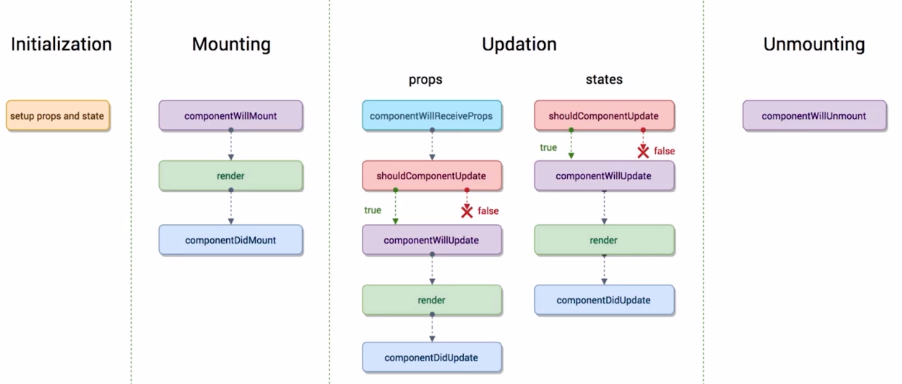

#  React进阶

##  PropTypes类型检查

**`PropTypes和DefaultProps`主要用于子组件中对父组件传入的数据进行类型检查**

**使用：**

```js
//TodoItem是该组件的组件名

import PropTypes from 'prop-types'

TodoItem.propTypes = {   //规定父组件传入数据的数据类型
  text : PropTypes.string.isRequired,  //强制该属性必须传
  content : PropTypes.oneOfType([PropTypes.number，PropTypes.string]),//传入数据类型可以是多个
  itemDel : PropTypes.func,
  index : PropTypes.number
}

TodoItem.defaultProps = {   //为属性设置默认值，当父组件没有给该属性传值时则默认显示这里设置的值
  text: 'hello word'
}
```

##  React响应式

**页面刷新（执行render函数）的几种情况：**

* 当`props`和`state`的数据发生变化时，`render`函数就会再次执行，从而实现页面的实时刷新
* 当父组件的`render`函数刷新时，子组件的`render`函数也会刷新，实现页面实时刷新

##  React虚拟DOM

**响应式渲染流程：**

1. state数据

2. JSX模版

3. 数据＋模版结合生成虚拟DOM（虚拟DOM就是一个JS对象，用它来描述真实DOM）（损耗了性能）

   ```js
   ［＇div＇， ｛id: ＇abc＇｝， ［＇span＇ ｛ ＇hello world＇］］
   ```

4. 用虚拟DOM的结构生成真实的DOM，界面显示

   ```html
    ＜div id＝＇abc＇＞＜span＞hello world＜/span＞＜/div＞
   ```

5. state发生变化

6. 数据＋模版生成新的虚拟DOM（极大的提升了性能）

   ```js
   ［＇div＇， ｛id: ＇abc＇｝， ［＇span＇ ｛ ＇bye bye＇］］
   ```

7. 比较原始虚拟DOM和新的虚拟DOM的区别，找到区别是span中内容（极大的提升性能）

8. 直接操作DOM，改变span中的内容

**虚拟DOM相对于真实DOM渲染的优势：**

1. 虚拟DOM是JS对象，新虚拟DOM和原虚拟DOM对比时，JS对象对比相较于真实DOM对比消耗的性能要小得多。
2. 数据更新后不是用新DOM完全替换原DOM,而是先对比新DOM和原DOM,只修改有变化的部分，从而消耗的性能更小。

**JSX-->真实DOM:**

`JSX-->React.createElement-->虚拟DOM(JS对象)-->真实DOM`

**虚拟DOM的优势：**

1. 性能提升了（相对真实DOM渲染的两个优势）
2. 可以实现跨端应用
   * web端：虚拟DOM可以生成真实DOM
   * 移动端：虚拟DOM可以生成原生组件


##  setState()异步处理

**`React`中的`setState()`是异步函数**

* 支持回调

```js
this.setState(() => {
	return {
	
	}
}, () => {
	//回调内容
})
```

* 异步处理容易引起的问题
  * 在数据更新，页面刷新后需要重新获取DOM,此时需要在`setState（）`的回调函数中执行获取DOM的操作，否则获取的结果是上次的DOM而不是这次更新后的结果
  * 原因：因为`setState()`是异步的，程序会先执行获取DOM的操作，再执行`setState()`跟新数据，刷新页面
  * 解决方案：将获取DOM的操作写在`setState()`的回调函数中。


##  ref的使用

**`ref`可以直接取到DOM中的元素，对该元素进行操作**

* 在元素(也可以是自定义组件)上绑定`ref`

  ```heml
  <input  ref = {(input) => {this.input = input}} />
  ```

* js中获取该元素并操作

  ```js
  //通过this.input既可以取到input元素
  const value = this.input.value    //取到input元素的值
  ```

##  组件

###  1 UI组件和容器组件 

* UI组件： 只有`render()`函数，只负责页面的渲染

* 容器组件：负责页面逻辑

* 一个UI组件和一个容器组件配合完成一个页面

* UI组件与容器组件的通信

  * 通信方式和普通的组件之间通信一样

  ```js
  //容器组件 
  import React, {Component} from 'react'
  import TodoListUI from './TodoListUI'
  import './TodoList.css'
  
  class TodoList extends Component {
    constructor(props) { 
      super(props)        
      this.state = {
         inputValue = '' 
      }
      this.changeInputValue = this.changeInputValue.bind(this) 
    }
  
    render() {          
      return (         
        <TodoListUI
          inputValue = {this.state.inputValue}          //向UI组件传数据
          changeInputValue = {this.changeInputValue}}/> //向UI组件传函数
      )
    }
  
    changeInputValue(){
        ......
    }
  }
  
  export default TodoList;
  
  
  
  //UI 组件
  import React, {Component, Fragment} from 'react'
  
  class TodoListUI extends Component {
    render() {
      return (
            <Input  value = {this.props.inputValue}             //容器组件传入的数据
                    onChange = {this.props.changeInputValue}/>  //容器组件传入的函数 
      )
    }
  }
  
  export default TodoListUI
  ```

###  2 无状态组件

* 无状态组件： 函数式的组件，只有`render()`函数的UI组件一般会写成无状态组件

  * 函数式组件就是定义方式是函数而不是类
  * **函数定义的组件性能更高，因为没有了周期函数，减少了性能的消耗**

* UI组件改为无状态组件的前后对比

  ```js
  //UI 组件
  import React, {Component, Fragment} from 'react'
  
  class TodoListUI extends Component {
    render() {
      return (
            <Input  value = {this.props.inputValue}             //容器组件传入的数据
                    onChange = {this.props.changeInputValue}/>  //容器组件传入的函数 
      )
    }
  }
  
  export default TodoListUI
  
  //改进后的无状态组件
  import React, {Fragment} from 'react'
  
  const TodoListUI = (props) => {
    return (
          <Input  value = {props.inputValue}             //容器组件传入的数据
                  onChange = {props.changeInputValue}/>  //容器组件传入的函数 
    )
  }
  
  export default TodoListUI
  ```

  

##  React生命周期

###  1 生命周期函数执行顺序



1. **Initialization ：  组件初始化阶段**

* `constructor()  `
  * 在组件创建时执行


2. **Mounting ： 组件页面挂载阶段**

* `componentWillMount() `
  * 在页面挂载之前执行，只会执行一次，后续render（）执行刷新时不再执行该函数
* `render()`
  *  挂载到页面，刷新页面时执行
* `componentDidMount()`
  * 页面挂载完成时执行，只会执行一次，后续render（）执行刷新时不再执行该函数


3. **Updation ： 组件页面刷新阶段**


* `componentWillReceiveProps()`
  * 接收了父组件传入的参数且父组件的render函数再次执行刷新传入的参数时，该函数会被执行
  * 即`props`的数据改变是回执行
* `shouldComponentUpdate() `
  * 页面刷新之前执行
  * 必须返回true或false   返回true则后去更新继续 ， 返回false则不再执行后续更新
* `componentWillUpdate()`
  * shouldComponentUpdate之后，页面刷新之前执行
* `render() `
  * 页面刷新时执行
* `componentDidUpdate() `
  * 页面更新完成后执行


4. **Unmounting ： 组件移除阶段**

* `componentWillUnmount()`
  * 组件在页面中移除时执行


###  2 shouldComponentUpdate()的使用场景

* `render`函数执行的条件之一是父组件`render`函数执行

* 场景：

  * 父组件有数据A、数据B
  * 子组件接收了父组件的数据A
  * 当父组件数据A变化时，父组件的`render`函数会执行，子组件的`render`函数也会执行并刷新页面，这是正常的情况
  * 当父组件数据B变化时，父组件的`render`函数会执行，子组件的`render`函数也会执行并刷新页面，但此时子组件是不需要刷新的，这就导致了性能的损耗。

* 解决方案：

  * 在子组件`shouldComponentUpdate()`函数中判断数据A是否变化，若没有变化则返回false，后续刷新就不会再执行了。
  * 当当父组件数据B变化时，子组件判断数据A没有变化，则不会执行后续刷新，从而避免了性能损耗。

  ```js
  //nextProps,nextState 可以拿到修改后的数据
  shouldComponentUpdate(nextProps, nextState) {
      if(nextProps.A !== this.props.A){   //修改后的数据和以前的数据比对，看时候有变化
        return true
      }else{
        return false
      }
    }
  ```

