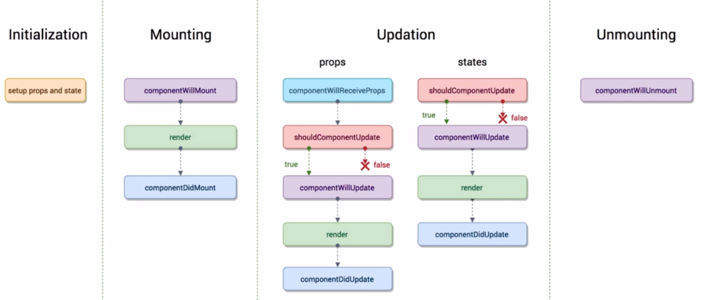

#  React基础

## React 简介

* 2013年由Facebook推出且开源

* 函数式编程

  * 代码主要是函数构成，有利于前端自动化测试

* 声明式开发（React、Vue）

  * 命令式编程 ---- jQuery

* 单向数据流

  * 父组件只给子组件传递数据 ，子组件不能直接修改父组件的数据，如果子组件要修改父组件的数据，需要通过调用父组件的方法来实现

* 视图层框架

* [React官网]( https://zh-hans.reactjs.org/ )

  v16.3.2

## React开发环境的搭建

* 使用React脚手架（Create React App）**创建[单页](https://zh-hans.reactjs.org/docs/glossary.html#single-page-application)应用** 

  * 1 安装Create React App脚手架并用该脚手架创建新项目
    * npx:   [npm 5.2+ 附带的 package 运行工具](https://medium.com/@maybekatz/introducing-npx-an-npm-package-runner-55f7d4bd282b) 

  ```js
  npx create-react-app <新建项目名称>  
      
  以上命令等价于
  npm install -g create-react-app
  create-react-app <新建项目名称>  
  ```

  * 2 终端切换到项目目录下

  ```
  cd <项目名称>
  ```

  * 3 开启项目

  ```
  npm start
  ```

##  React单页应用初始目录详解

**初始时主要文件目录**

* public(发布文件)
  * index.html
  * manifest.json(与pwa对应的文件)
* src(源文件)
  * App.css
  * App.js
  * App.test.js
  * index.css
  * index.js(入口文件)
  * logo.svg(首页使用的图片)
  * serviceWorker.js(与pwa对应的文件)
  * setupTest.js

**修改初始目录用于初始开发**

* public(发布文件)

  * index.html

    * 删除对`manifest.json`文件的引用

      ```
        <link rel="manifest" href="%PUBLIC_URL%/manifest.json" />    --- 删除
      ```

  * manifest.json(与pwa对应的文件)  --- 删除

* src(源文件)

  * App.css  --- 删除

  * App.js

    ```
    //修改删除已删除的引用
    
    import React from 'react';
    
    function App() {
      return (
        <div >
          hello word
        </div>
      );
    }
    
    export default App;
    ```

  * App.test.js   --- 删除

  * index.css  --- 删除

  * index.js(入口文件)

    ```
    //修改删除已删除的引用
    
    import React from 'react';
    import ReactDOM from 'react-dom';
    import App from './App';
    
    ReactDOM.render(
      <React.StrictMode>
        <App />
      </React.StrictMode>,
      document.getElementById('root')
    );
    ```

  * logo.svg(首页使用的图片) --- 删除

  * serviceWorker.js(与pwa对应的文件)  --- 删除

  * setupTest.js   --- 删除

**PWA**

pwa（ Progressive Web App ）主要作用是软件会缓存已经加载的页面，在断网后可以正常显示已经加载过的页面，提高用户体验。


##  React编码规范

####  1 组件首字母

* 自定义组件标签首字母大写，`react`原生组件标签首字母小写

####  2 函数`this`重定向

*  写在构造函数中

```js
constructor(props) {
    super(props)
    this.itemDel = this.itemDel.bind(this)
  }
```

####  3 `this.props`解构

* 子组件使用父组件传入的数据 ---  解构后使用

  ```js
   //原始写法
   this.props.itemDel(this.props.index)
   
   //解构后的写法
   const {itemDel, index} = this.props
   itemDel(index)
  
  
  //案例：
   render() {
      const { content, text } = this.props 
      return (
        <div>
          {text}-{content}
          <button onClick = {this.itemDel} >删除</button>
        </div>
      )
    }
  ```

####  4 `setState()`传入函数

* `setState()`传入函数不再是传入对象

  ```js
  //传入对象形式
  this.setState({
      属性： 值
  })
  
  //传入函数  ----  可以实现异步
  this.setState(() => {
      return {
          属性： 值
      }
  })
  this.setState((prevState) => {    //prevState相当于this.state  
      return {
          属性： 值
      }
  })
  ```

  * 案例1

    ```js
    const value = e.target.value   // 注意现在外面定义 再用 不要直接在setState中用
    this.setState(() => {
      return {
        inputValue: value
      }
    })
    
    // ES6 箭头函数简写
    const value = e.target.value  
    this.setState(() => ({
        inputValue: value
      }))
    ```

  * 案例2 

    ```js
    //传入对象写法
    this.setState({
      list: [...this.state.list, this.state.inputValue],
      inputValue: ''
    })
    
    //传入函数写法
    this.setState((prevState) => ({
      list: [...prevState.list, prevState.inputValue],
      inputValue: ''
    }))
    ```

  * 案例3

    ```js
    //传入对象写法
    const list = [...this.state.list]
    list.splice(index, 1)
    this.setState({
      list
    })
    
    //传入函数写法
    this.setState((prevState) => {
      const list = [...prevState.list]
      list.splice(index, 1)
      return {list}
    })
    ```

    

## React组件的使用基础

*  --1-- : 组件构造函数
*  --2--: 父组件(Component) 的构造函数
*  --3--: 存储组件的数据
*  --4--: 组件的html --- JSX
*  --5--: React组件的标签必须有一个根标签，可以是`<div>`,但是`<div>`会在DOM中渲染出来，为了不渲染，用`<Fragment>`来占位，起到跟标签的作用
*  --6--: jsx中用‘{}’包裹js代码
*  --7--： React中绑定事件： 将原生事件写成驼峰式即可  在`.bind`中传递参数
*  --8--： 将事件函数的this绑定为组件的this，以便在事件函数中通过this访问组件
*  --9--: 循环数组 注意绑定`key`值
*  --10--: 修改Reat组件中的数据 需要通过this.setState({})函数来修改

```js
import React, {Component, Fragment} from 'react'

class TodoList extends Component {
  constructor(props) {  //--1-- 
    super(props)        //--2--
    this.state = {      //--3--
      inputValue: 'hello',
      list: []
    }
  }

  render() {           // --4--
    return (           // --5--
      <Fragment>      
        <div>
          <input value = {this.state.inputValue}      // --6--
                 onChange = {this.changeInputValue.bind(this)}   //--7-- --8--
          />
          <button onClick = {this.submitInput.bing(this)}>提交</button>
        </div>
        <ul>
            {
              this.state.list.map(item => {   // --9--
                return (
                <Fragment  key={index}>   
                <li key={index}>{item}</li>
                <button onClick = {this.itemDel.bind(this, index)} key={index+1}>删除</button>                                              // --8--
                </Fragment>
                )
              })
            }
        </ul>
      </Fragment>
    )
  }

  changeInputValue(e){
    this.setState({    //--8--    --10--
      inputValue: e.target.value
    })
  }

  submitInput(){
    this.setState({
      list: [...this.state.list, this.inputValue]  
    })
  }
}

export default TodoList;
```

###  1 事件参数

* e为默认参数 arg为自定义参数

```js
// 利用箭头函数 e为默认参数 arg为自定义参数
onTouchStart={e => this.touchS(e, arg)}
```


## JSX语法

**`JSX`就是在`js`代码中写的`html`标签的语法**

* JSX中写注释

  ```
  {/*注释内容*/}
  
  {
  	//注释内容
  }
  ```

* 绑定样式: `className`   *注意不是`class`*

  ```
  <div className='calss1'></div>
  ```

* 不转义显示带有html标签的字符串

  ```
  //item:‘<h1>hello word</h1>’   -----  react组件中的数据
  
  <div dangerouslySetInnerHTML={{__html: item}}></div>
  
  
  这种方式在界面不会显示
  <h1>hello word</h1>  
  而是
  hello word  且是一号标题的字体大小
  ```

* `<label>`标签的`for`改为`htmlFor`

  ```
  <label htmlFor="insert">输入内容</label> 
  <input id="insert" />
  ```

  

##  组件间通信

###  1 父级向子级传递数据

* 实现步骤

  1. 父组件中通过属性（自定义）绑定要传递的数据

  ```js
  //子组件：<TodoItem/>
  //自定义属性：content
  //父组件中的数据：item   注意：{} 包裹
  <TodoItem content = {item}/>
  ```

  2. 子组件中通过`this.props.属性`取到父组件传入的数据

  ```js
  //自定义属性：content
  this.props.content
  ```

###  2 子级向父级传递数据

* 子级向父级传递数据是通过**子组件调用父组件的方法，给方法传值实现的。**这个操作包括两个功能：

  * 1 子组件调用父组件的方法；
  * 2 子组件向父组件传递数据

* 实现步骤：

  1. 父组件中通过属性（自定义）绑定子级可调用的方法

  ```js
  //子组件：<TodoItem/>
  //自定义属性(方法名)：itemDel
  //父组件中的方法：itemDel   注意：{} 包裹  this重定向
  <TodoItem itemDel = {this.itemDel.bind(this)}/>
  ```

  2. 子组件中通过`this.props.属性（自定义方法名）`调用父组件的方法

  ```js
  //自定义属性(方法名)：itemDel
  //父组件中该方法需要的参数： this.props.index
  this.props.itemDel(this.props.index)
  ```

  3. 父组件中接收子组件传来的数据

  ```js
  itemDel(index){
  	console.log(index)   //若该函数调用方是组件，则这个index就是子组件传来的
  }
  ```


#  React进阶

##  PropTypes类型检查

**`PropTypes和DefaultProps`主要用于子组件中对父组件传入的数据进行类型检查**

**使用：**

```js
//TodoItem是该组件的组件名

import PropTypes from 'prop-types'

TodoItem.propTypes = {   //规定父组件传入数据的数据类型
  text : PropTypes.string.isRequired,  //强制该属性必须传
  content : PropTypes.oneOfType([PropTypes.number，PropTypes.string]),//传入数据类型可以是多个
  itemDel : PropTypes.func,
  index : PropTypes.number
}

TodoItem.defaultProps = {   //为属性设置默认值，当父组件没有给该属性传值时则默认显示这里设置的值
  text: 'hello word'
}
```

##  React响应式

**页面刷新（执行render函数）的几种情况：**

* 当`props`和`state`的数据发生变化时，`render`函数就会再次执行，从而实现页面的实时刷新
* 当父组件的`render`函数刷新时，子组件的`render`函数也会刷新，实现页面实时刷新

##  React虚拟DOM

**响应式渲染流程：**

1. state数据

2. JSX模版

3. 数据＋模版结合生成虚拟DOM（虚拟DOM就是一个JS对象，用它来描述真实DOM）（损耗了性能）

   ```js
   ［＇div＇， ｛id: ＇abc＇｝， ［＇span＇ ｛ ＇hello world＇］］
   ```

4. 用虚拟DOM的结构生成真实的DOM，界面显示

   ```html
    ＜div id＝＇abc＇＞＜span＞hello world＜/span＞＜/div＞
   ```

5. state发生变化

6. 数据＋模版生成新的虚拟DOM（极大的提升了性能）

   ```js
   ［＇div＇， ｛id: ＇abc＇｝， ［＇span＇ ｛ ＇bye bye＇］］
   ```

7. 比较原始虚拟DOM和新的虚拟DOM的区别，找到区别是span中内容（极大的提升性能）

8. 直接操作DOM，改变span中的内容

**虚拟DOM相对于真实DOM渲染的优势：**

1. 虚拟DOM是JS对象，新虚拟DOM和原虚拟DOM对比时，JS对象对比相较于真实DOM对比消耗的性能要小得多。
2. 数据更新后不是用新DOM完全替换原DOM,而是先对比新DOM和原DOM,只修改有变化的部分，从而消耗的性能更小。

**JSX-->真实DOM:**

`JSX-->React.createElement-->虚拟DOM(JS对象)-->真实DOM`

**虚拟DOM的优势：**

1. 性能提升了（相对真实DOM渲染的两个优势）
2. 可以实现跨端应用
   * web端：虚拟DOM可以生成真实DOM
   * 移动端：虚拟DOM可以生成原生组件


##  setState()异步处理

**`React`中的`setState()`是异步函数**

* 支持回调

```js
this.setState(() => {
	return {
	
	}
}, () => {
	//回调内容
})
```

* 异步处理容易引起的问题
  * 在数据更新，页面刷新后需要重新获取DOM,此时需要在`setState（）`的回调函数中执行获取DOM的操作，否则获取的结果是上次的DOM而不是这次更新后的结果
  * 原因：因为`setState()`是异步的，程序会先执行获取DOM的操作，再执行`setState()`跟新数据，刷新页面
  * 解决方案：将获取DOM的操作写在`setState()`的回调函数中。


##  ref的使用

**`ref`可以直接取到DOM中的元素，对该元素进行操作**

* 在元素(也可以是自定义组件)上绑定`ref`

  * 别名：标签上对标签的别称  两处别名要一致
  * 调用名： 设置调用时的名称  

  ```heml
  <input  ref = {(别名) => {this.调用名 = 别名}} />
  
  //案例
  <input  ref = {(icon) => {this.inputIcon = icon}} />
  ```

* js中获取该元素并操作

  ```js
  //通过this.input既可以取到input元素
  const value = this.input.value    //取到input元素的值
  ```

##  组件

###  1 UI组件和容器组件 

* UI组件： 只有`render()`函数，只负责页面的渲染

* 容器组件：负责页面逻辑

* 一个UI组件和一个容器组件配合完成一个页面

* UI组件与容器组件的通信

  * 通信方式和普通的组件之间通信一样

  ```js
  //容器组件 
  import React, {Component} from 'react'
  import TodoListUI from './TodoListUI'
  import './TodoList.css'
  
  class TodoList extends Component {
    constructor(props) { 
      super(props)        
      this.state = {
         inputValue = '' 
      }
      this.changeInputValue = this.changeInputValue.bind(this) 
    }
  
    render() {          
      return (         
        <TodoListUI
          inputValue = {this.state.inputValue}          //向UI组件传数据
          changeInputValue = {this.changeInputValue}}/> //向UI组件传函数
      )
    }
  
    changeInputValue(){
        ......
    }
  }
  
  export default TodoList;
  
  
  
  //UI 组件
  import React, {Component, Fragment} from 'react'
  
  class TodoListUI extends Component {
    render() {
      return (
            <Input  value = {this.props.inputValue}             //容器组件传入的数据
                    onChange = {this.props.changeInputValue}/>  //容器组件传入的函数 
      )
    }
  }
  
  export default TodoListUI
  ```

###  2 无状态组件

* 无状态组件： 函数式的组件，只有`render()`函数的UI组件一般会写成无状态组件

  * 函数式组件就是定义方式是函数而不是类
  * **函数定义的组件性能更高，因为没有了周期函数，减少了性能的消耗**

* UI组件改为无状态组件的前后对比

  ```js
  //UI 组件
  import React, {Component, Fragment} from 'react'
  
  class TodoListUI extends Component {
    render() {
      return (
            <Input  value = {this.props.inputValue}             //容器组件传入的数据
                    onChange = {this.props.changeInputValue}/>  //容器组件传入的函数 
      )
    }
  }
  
  export default TodoListUI
  
  //改进后的无状态组件
  import React, {Fragment} from 'react'
  
  const TodoListUI = (props) => {
    return (
          <Input  value = {props.inputValue}             //容器组件传入的数据
                  onChange = {props.changeInputValue}/>  //容器组件传入的函数 
    )
  }
  
  export default TodoListUI
  ```

  

##  React生命周期

###  1 生命周期函数执行顺序



1. **Initialization ：  组件初始化阶段**

* `constructor()  `
  * 在组件创建时执行


2. **Mounting ： 组件页面挂载阶段**

* `componentWillMount() `
  * 在页面挂载之前执行，只会执行一次，后续render（）执行刷新时不再执行该函数
* `render()`
  *  挂载到页面，刷新页面时执行
* `componentDidMount()`
  * 页面挂载完成时执行，只会执行一次，后续render（）执行刷新时不再执行该函数


3. **Updation ： 组件页面刷新阶段**


* `componentWillReceiveProps()`
  * 接收了父组件传入的参数且父组件的render函数再次执行刷新传入的参数时，该函数会被执行
  * 即`props`的数据改变是回执行
* `shouldComponentUpdate() `
  * 页面刷新之前执行
  * 必须返回true或false   返回true则后去更新继续 ， 返回false则不再执行后续更新
* `componentWillUpdate()`
  * shouldComponentUpdate之后，页面刷新之前执行
* `render() `
  * 页面刷新时执行
* `componentDidUpdate() `
  * 页面更新完成后执行


4. **Unmounting ： 组件移除阶段**

* `componentWillUnmount()`
  * 组件在页面中移除时执行


###  2 shouldComponentUpdate()的使用场景

* `render`函数执行的条件之一是父组件`render`函数执行

* 场景：

  * 父组件有数据A、数据B
  * 子组件接收了父组件的数据A
  * 当父组件数据A变化时，父组件的`render`函数会执行，子组件的`render`函数也会执行并刷新页面，这是正常的情况
  * 当父组件数据B变化时，父组件的`render`函数会执行，子组件的`render`函数也会执行并刷新页面，但此时子组件是不需要刷新的，这就导致了性能的损耗。

* 解决方案：

  * 在子组件`shouldComponentUpdate()`函数中判断数据A是否变化，若没有变化则返回false，后续刷新就不会再执行了。
  * 当当父组件数据B变化时，子组件判断数据A没有变化，则不会执行后续刷新，从而避免了性能损耗。

  ```js
  //nextProps,nextState 可以拿到修改后的数据
  shouldComponentUpdate(nextProps, nextState) {
      if(nextProps.A !== this.props.A){   //修改后的数据和以前的数据比对，看时候有变化
        return true
      }else{
        return false
      }
    }
  ```

