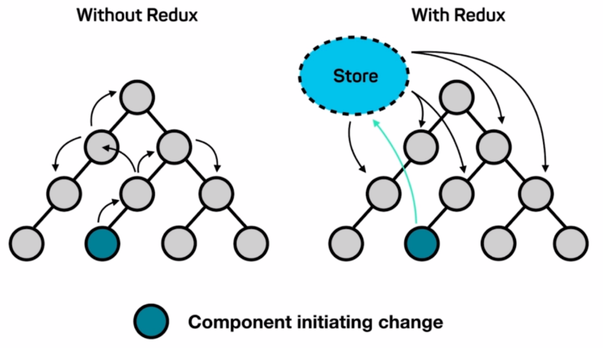
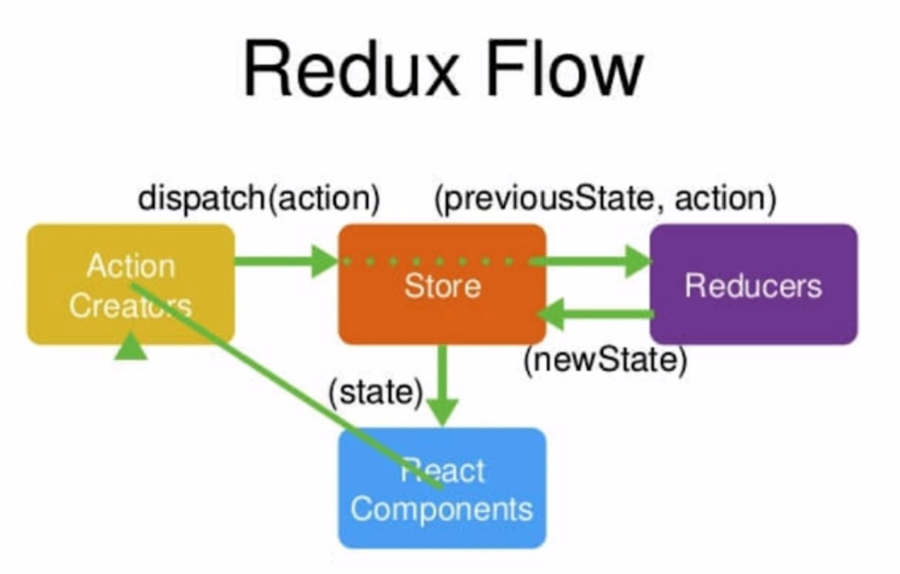

#   Redux基础

##  1 Redux简介

* **[Redux官方文档]( http://cn.redux.js.org/ )**

* 安装

  ```
  npm install --save redux
  ```

  




##  2 Redux 使用流程



1. 新建`store`和`reducer` 目录结构如下：

   * src (项目的源文件夹)
     * store  (用于管理全局数据的文件夹)
       * index.js (定义store)
       * reducer.js (定义reducer)

2. 编辑`index.js`

   ```js
   import { createStore } from 'redux'
   import reducer from './reducer'
   
   const store  = createStore(reducer, window.__REDUX_DEVTOOLS_EXTENSION__ && window.__REDUX_DEVTOOLS_EXTENSION__())
   
   export default store
   ```

3. 编辑`reducer.js`

   * state:  修改前的全局数据
     * state = defaultState  为全局数据设置默认值
   * action: 组件传来的需要修改的数据

   ```js
   const defaultState = {
       //在此处自定义全局数据的默认值
   }
   
   export default (state = defaultState, action) => {
     return state
   }
   ```

4. 组件中操作全局数据

* 4.1 组件中引入全局数据仓库

  ```js
  import store from './store/index'
  ```

* 4.2 组件中获取全局数据

  ```
  store.getState()
  ```

* 4.3 组件中修改全局数据

  * 通过`action`来间接修改  ----  大项目一般使用[`actionCreaters`](#4-actioncreators)来间接修改
  * 组件中定义的`action`本质上只是告诉`store`要做何修改，修改的数据什么，真正的修改是在`reducer`中进行的
  * **通过`store.dispatch(action)`将`action`提交给`store`处理**

  ```js
  const action = {
    type: '修改操作简称',  //在reducer中对比这个简称 做出相应的修改操作
    属性:  值     //设置此次修改的数据名（属性）、数据值 
  }
  store.dispatch(action)
  
  //案例
  const action = {
    type: 'change_input_value',
    value: 'hello'
  }
  store.dispatch(action)
  ```

* 4.4 在`reducer`根据`action`修改全局数据

  * `reducer`中其实也不能修改`store`的数据，所以需要**深拷贝**原来的数据，然后修改拷贝来的数据，将修改后的数据返回给`store`，`store`中再做数据更新
  * **`reducer`必须是纯函数**
    * 给定确定的输入就一定会有确定的输出，给定输入：state、action  则确定输出：newState || state
      * 函数中不能有网络请求、时间相关操作（new Date()  setTimeout等）
    * 不能有副作用，只是修改newState  不要有其它操作

  ```js
  const defaultState = {
    inputValue: '1232131',
  }
  
  export default (state = defaultState, action) => {
    if(action.type === 'change_input_value'){  //判断是什么操作（与组件定义一致）
      const newState = JSON.parse(JSON.stringify(state))  //深拷贝
      newState.inputValue = action.value  // 修改数据
      return newState  //返回给了stroe
    }
    return state
  }
  ```

* 4.5 组件中监听`store`中数据的变化，并实时获取，刷新组件中的数据

  * `store.subscribe()`: 当`store`中的数据发生变化时，该函数就会执行
  * `handleStoreChange` : 自定义函数，当`store.subscribe()`执行时 在该自定义函数中获取`store`更新后的数据

  ```js
  store.subscribe(this.handleStoreChange)
  
   handleStoreChange() {
      this.setState(store.getState())  // store.getState()获取store数据 
    }
  ```

  

##  3 action types的拆分

**使用流程：**

1. 在`src/store`文件夹下新建`actionTypes.js`

   * 将所有`action`的`type`定义成常量并导出

   ```js
   //案例
   export const CHANGE_INPUT_VALUE = 'change_input_value'
   export const ADD_TO_LIST = 'add_to_list'
   export const DEL_LIST = 'del_list'
   ```

2. 在`reducer.js`、`actionCreators.js`等文件文件中使用 需要导入

   ```js
   //导入
   import {CHANGE_INPUT_VALUE, ADD_TO_LIST, DEL_LIST} from './actionTypes'
   
   ```

**拆分的好处：**

* 当`type`用常量时，如果拼写错误，编译时会报错，便于快速定位BUG
* 如果`type`使用的是字符串，当字符串拼写错误时，编译时不会报拼写的错误，很能快速定位BUG


##  4 actionCreators

**`actionCreators`用于管理`action`，避免`action`在组件中直接定义**

**使用流程：**

1. 在`src/store`下新建`actionCreators.js`

   * 在文件中定义好`action`，实例化`action`时调用相应的函数并传入参数见即可

   ```js
   //案例
   import {CHANGE_INPUT_VALUE, ADD_TO_LIST, DEL_LIST} from './actionTypes'
   
   export const getInputChangeAction = (value) => ({
     type: CHANGE_INPUT_VALUE,
     value
   })
   
   export const getAddItemAction = () => ({
     type: ADD_TO_LIST
   })
   
   export const getDelItemAction = (index) => ({
     type: DEL_LIST,
     index
   })
   ```

2. 在组件中使用

   ```js
   import {getInputChangeAction, getAddItemAction, getDelItemAction} from './store/actionCreators'
   
   //e.target.value是传入的参数
   changeInputValue(e){
       const action = getInputChangeAction(e.target.value)
       store.dispatch(action)
   }
   ```


##  5 store拆分到组件中

###  5.1 目录设置

* 组件目录
  * store
    * actionCreators.js
    * actionTypes.js
    * reducer.js
    * index.js  (store文件夹默认导出文件)

###  5.2 reducer的拆分

1. 在组件所在文件夹下新建`store/reducer.js`

   * 将组件中使用的数据及对数据的操作写在该文件中，操作同全局`reducer`
     * 数据的定义
     * action的处理
   * 本质是对全局的`reducer`做了拆分，将组件相关的数据写到本文件中，便于管理

   **案例：**

   ```js
   import {SEARCH_FOCUSED} from '../../../store/actionTypes'  //注意引入路径的变化
   
   const defaultState = {
     focused: false
   }
   
   
   export default (state = defaultState, action) => {
     if (action.type === SEARCH_FOCUSED){
       const newState = JSON.parse(JSON.stringify(state))  //深拷贝
       newState.focused = true // 修改数据
       return newState  //返回给了stroe
     }
     return state;
   }
   ```

2. 在全局`reducer.js`中合并各组件的`reducer`

   * `headerReducer `（自定义名）:  从组件中引入拆分的`reducer.js`
   * `header`(自定义名) : 给组件中的`reducer`设置名称，便于管理

   ```js
   //src/store/reducer.js
   import { combineReducers } from 'redux'
   import headerReducer from '../common/header/store/reducer'   //从组件中引入拆分的`reducer.js`
   
   const reducer =   combineReducers({
     header: headerReducer  //给组件中的`reducer`设置名称，便于管理
   })
   
   export default reducer;
   ```

3. 组件中使用数据时改变调用路径

   * `header`： 组件管理的reducer
   * 由于在全局reducer中合并reducer所以多了一层访问

   ```js
   //没有拆分时访问
   const mapStateToProps = (state) => {
     return {
       focused: state.focused
     }
   }
   
   //拆分后访问
   const mapStateToProps = (state) => {
     return {
       focused: state.header.focused
     }
   }
   ```

###  5.3 actionTypes的拆分

* 注意`type`字符串中最好加上组件名，避免冲突
* 案例：

```js
export const SEARCH_FOCUSED = 'header/search_focused'  //header为组件名
export const SEARCH_BLUR = 'header/search_blur'
```

###  5.4 actionCreators的拆分

* 案例：

```js
import {SEARCH_FOCUSED, SEARCH_BLUR} from './actionTypes'

export const getSearchFucued = () => ({
  type: SEARCH_FOCUSED
})

export const getSearchBlur = () => ({
  type: SEARCH_BLUR
})
```

###  5.5  index.js的编写

* `index.js`: 主要是把`store`文件夹中的文件导入  然后统一导出
* 其它文件需要引入`store`中文件时路径只需要写到`store`文件夹一级即可

```js
import headerReducer from './reducer'
import * as actionCreators from './actionCreators'
import * as actionTypes from './actionTypes'

export {headerReducer, actionCreators, actionTypes}
```


##  6 immutable

###  6.1 immutable.js来管理store的数据

**使用`imumutable.js`来管理`store`的数据的原因：**

* `store`的数据是不能被改变的，这也是之前在`reucer.js`中使用深拷贝store中的数据的原因
* `immutable.js`可以确保其管理的对象的数据不会别改变
* 为了避免`store`数据被误操作而改变，选择`immutable.js`来管理`store`这样`store`就一定不会被改变了、

**immutable.js简介:**

* Giuhub地址： [immutable.js]( https://github.com/immutable-js/immutable-js )

* 安装:

  ```js
  npm install immutable --save
  ```

**immutable.js使用:**

* 在每个`reducer.js`中引入

* 重构`reucer.js`

  * 引入： `import {fromJS} from 'immutable'`

  * `fromJS()`函数包裹数据对象

  * 修改数据

    ```js
    state.set('属性名', 属性值)
    
    //多个属性时
    state.set('属性名1', 属性值1).set('属性名2', 属性值2)
    
    //merge()方法
    state.merge({
            属性名1: 属性值1,
            属性名2: 属性值2
     })
    ```
  
* 获取数据
  
    * 在组件中获取数据时使用
    
    ```js
    state.header.get('属性名')   //header是组件层
    state.getIn(['header','属性名'])
  ```
  
  **案例：**
  
  ```js
  //reducer.js
  import {SEARCH_FOCUSED} from './actionTypes'
  import {fromJS} from 'immutable'
  
  const defaultState = fromJS({
    focused: false
  })
  
  export default (state = defaultState, action) => {
    if (action.type === SEARCH_FOCUSED){
      return state.set('focused', true)
    }
    return state;
  }
  
  
  //组件中获取数据
  state.header.get('focused')
  ```

###  6.2 redux-immutable统一对象使用方式

* Gihub地址： [redux-immutable]( https://github.com/gajus/redux-immutable )

* 安装：

  ```js
  npm install redux-immutable --save
  ```

* 使用：

  * 修改全局`reducer.js`    --- `src/store/reducer.js`

  ```js
  //修改前
  import { combineReducers } from 'redux'
  //修改后
  import { combineReducers } from 'redux-immutable'
  ```

  * 获取数据方式的改变
    * header是组件名

  ```js
  //修改前
  state.header.get('focused')
  //修改后
  state.get('header').get('focused')
  上面写法等价于下面写法：
  state.getIn(['header','focused'])
  ```


###  6.3 使用immutable常见问题

####  6.3.1 存入store的对象都需是immutable对象

**当使用immutable来管理store时,存入store的数据必须都是immutable的格式，否则或出错**

**案例：**

```js
//reducer.js
import {LIST_CHANGE} from './actionTypes'
import {fromJS} from 'immutable'

const defaultState = fromJS({
  list: []
})

export default (state = defaultState, action) => {
  if (action.type === LIST_CHANGE){
    return state.set('list', action.list)--------------此处存入store的数据是immutable格式的
  }
  return state;
}

//actionCreators.js
import {LIST_CHANGE} from './actionTypes'
import { fromJS } from 'immutable'

export const getListChange = (list) => ({
  type: LIST_CHANGE,
  list: fromJS(list)-------------------------------------转化为immutable格式---------
})


```

####  6.3.2 immutbale数组不能用`list[i]`的方式取数据

**解决方案：**

* 将immutable数组转换成普通数组再使用

* `list.toJS()`

  ```js
  
  ```

  