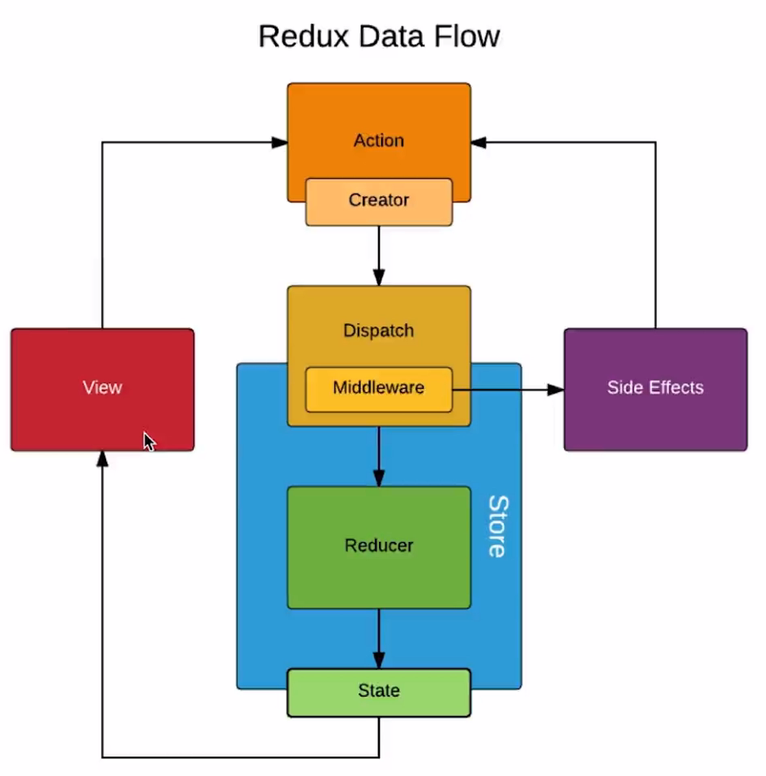

#   Redux基础

##  1 Redux简介

* **[Redux官方文档]( http://cn.redux.js.org/ )**

* 安装

  ```
  npm install --save redux
  ```

  


##  2 Redux 使用流程


1. 新建`store`和`reducer` 目录结构如下：

   * src (项目的源文件夹)
     * store  (用于管理全局数据的文件夹)
       * index.js (定义store)
       * reducer.js (定义reducer)

2. 编辑`index.js`

   ```js
   import { createStore } from 'redux'
   import reducer from './reducer'
   
   const store  = createStore(reducer, window.__REDUX_DEVTOOLS_EXTENSION__ && window.__REDUX_DEVTOOLS_EXTENSION__())
   
   export default store
   ```

3. 编辑`reducer.js`

   * state:  修改前的全局数据
     * state = defaultState  为全局数据设置默认值
   * action: 组件传来的需要修改的数据

   ```js
   const defaultState = {
       //在此处自定义全局数据的默认值
   }
   
   export default (state = defaultState, action) => {
     return state
   }
   ```

4. 组件中操作全局数据

* 4.1 组件中引入全局数据仓库

  ```js
  import store from './store/index'
  ```

* 4.2 组件中获取全局数据

  ```
  store.getState()
  ```

* 4.3 组件中修改全局数据

  * 通过`action`来间接修改  ----  大项目一般使用[`actionCreaters`](#4-actioncreators)来间接修改
  * 组件中定义的`action`本质上只是告诉`store`要做何修改，修改的数据什么，真正的修改是在`reducer`中进行的
  * **通过`store.dispatch(action)`将`action`提交给`store`处理**

  ```js
  const action = {
    type: '修改操作简称',  //在reducer中对比这个简称 做出相应的修改操作
    属性:  值     //设置此次修改的数据名（属性）、数据值 
  }
  store.dispatch(action)
  
  //案例
  const action = {
    type: 'change_input_value',
    value: 'hello'
  }
  store.dispatch(action)
  ```

* 4.4 在`reducer`根据`action`修改全局数据

  * `reducer`中其实也不能修改`store`的数据，所以需要**深拷贝**原来的数据，然后修改拷贝来的数据，将修改后的数据返回给`store`，`store`中再做数据更新
  * **`reducer`必须是纯函数**
    * 给定确定的输入就一定会有确定的输出，给定输入：state、action  则确定输出：newState || state
      * 函数中不能有网络请求、时间相关操作（new Date()  setTimeout等）
    * 不能有副作用，只是修改newState  不要有其它操作

  ```js
  const defaultState = {
    inputValue: '1232131',
  }
  
  export default (state = defaultState, action) => {
    if(action.type === 'change_input_value'){  //判断是什么操作（与组件定义一致）
      const newState = JSON.parse(JSON.stringify(state))  //深拷贝
      newState.inputValue = action.value  // 修改数据
      return newState  //返回给了stroe
    }
    return state
  }
  ```

* 4.5 组件中监听`store`中数据的变化，并实时获取，刷新组件中的数据

  * `store.subscribe()`: 当`store`中的数据发生变化时，该函数就会执行
  * `handleStoreChange` : 自定义函数，当`store.subscribe()`执行时 在该自定义函数中获取`store`更新后的数据

  ```js
  store.subscribe(this.handleStoreChange)
  
   handleStoreChange() {
      this.setState(store.getState())  // store.getState()获取store数据 
    }
  ```

  

##  3 action types的拆分

**使用流程：**

1. 在`src/store`文件夹下新建`actionTypes.js`

   * 将所有`action`的`type`定义成常量并导出

   ```js
   //案例
   export const CHANGE_INPUT_VALUE = 'change_input_value'
   export const ADD_TO_LIST = 'add_to_list'
   export const DEL_LIST = 'del_list'
   ```

2. 在`reducer.js`、`actionCreators.js`等文件文件中使用 需要导入

   ```js
   //导入
   import {CHANGE_INPUT_VALUE, ADD_TO_LIST, DEL_LIST} from './actionTypes'
   
   ```

**拆分的好处：**

* 当`type`用常量时，如果拼写错误，编译时会报错，便于快速定位BUG
* 如果`type`使用的是字符串，当字符串拼写错误时，编译时不会报拼写的错误，很能快速定位BUG


##  4 actionCreators

**`actionCreators`用于管理`action`，避免`action`在组件中直接定义**

**使用流程：**

1. 在`src/store`下新建`actionCreators.js`

   * 在文件中定义好`action`，实例化`action`时调用相应的函数并传入参数见即可

   ```js
   //案例
   import {CHANGE_INPUT_VALUE, ADD_TO_LIST, DEL_LIST} from './actionTypes'
   
   export const getInputChangeAction = (value) => ({
     type: CHANGE_INPUT_VALUE,
     value
   })
   
   export const getAddItemAction = () => ({
     type: ADD_TO_LIST
   })
   
   export const getDelItemAction = (index) => ({
     type: DEL_LIST,
     index
   })
   ```

2. 在组件中使用

   ```js
   import {getInputChangeAction, getAddItemAction, getDelItemAction} from './store/actionCreators'
   
   //e.target.value是传入的参数
   changeInputValue(e){
       const action = getInputChangeAction(e.target.value)
       store.dispatch(action)
   }
   ```


##  5 store拆分到组件中

###  5.1 目录设置

* 组件目录
  * store
    * actionCreators.js
    * actionTypes.js
    * reducer.js
    * index.js  (store文件夹默认导出文件)

###  5.2 reducer的拆分

1. 在组件所在文件夹下新建`store/reducer.js`

   * 将组件中使用的数据及对数据的操作写在该文件中，操作同全局`reducer`
     * 数据的定义
     * action的处理
   * 本质是对全局的`reducer`做了拆分，将组件相关的数据写到本文件中，便于管理

   **案例：**

   ```js
   import {SEARCH_FOCUSED} from '../../../store/actionTypes'  //注意引入路径的变化
   
   const defaultState = {
     focused: false
   }
   
   
   export default (state = defaultState, action) => {
     if (action.type === SEARCH_FOCUSED){
       const newState = JSON.parse(JSON.stringify(state))  //深拷贝
       newState.focused = true // 修改数据
       return newState  //返回给了stroe
     }
     return state;
   }
   ```

2. 在全局`reducer.js`中合并各组件的`reducer`

   * `headerReducer `（自定义名）:  从组件中引入拆分的`reducer.js`
   * `header`(自定义名) : 给组件中的`reducer`设置名称，便于管理

   ```js
   //src/store/reducer.js
   import { combineReducers } from 'redux'
   import headerReducer from '../common/header/store/reducer'   //从组件中引入拆分的`reducer.js`
   
   const reducer =   combineReducers({
     header: headerReducer  //给组件中的`reducer`设置名称，便于管理
   })
   
   export default reducer;
   ```

3. 组件中使用数据时改变调用路径

   * `header`： 组件管理的reducer
   * 由于在全局reducer中合并reducer所以多了一层访问

   ```js
   //没有拆分时访问
   const mapStateToProps = (state) => {
     return {
       focused: state.focused
     }
   }
   
   //拆分后访问
   const mapStateToProps = (state) => {
     return {
       focused: state.header.focused
     }
   }
   ```

###  5.3 actionTypes的拆分

* 注意`type`字符串中最好加上组件名，避免冲突
* 案例：

```js
export const SEARCH_FOCUSED = 'header/search_focused'  //header为组件名
export const SEARCH_BLUR = 'header/search_blur'
```

###  5.4 actionCreators的拆分

* 案例：

```js
import {SEARCH_FOCUSED, SEARCH_BLUR} from './actionTypes'

export const getSearchFucued = () => ({
  type: SEARCH_FOCUSED
})

export const getSearchBlur = () => ({
  type: SEARCH_BLUR
})
```

###  5.5  index.js的编写

* `index.js`: 主要是把`store`文件夹中的文件导入  然后统一导出
* 其它文件需要引入`store`中文件时路径只需要写到`store`文件夹一级即可

```js
import headerReducer from './reducer'
import * as actionCreators from './actionCreators'
import * as actionTypes from './actionTypes'

export {headerReducer, actionCreators, actionTypes}
```


##  6 immutable

###  6.1 immutable.js管理store

**使用`imumutable.js`来管理`store`的数据的原因：**

* `store`的数据是不能被改变的，这也是之前在`reucer.js`中使用深拷贝store中的数据的原因
* `immutable.js`可以确保其管理的对象的数据不会别改变
* 为了避免`store`数据被误操作而改变，选择`immutable.js`来管理`store`这样`store`就一定不会被改变了、

**immutable.js简介:**

* Giuhub地址： [immutable.js]( https://github.com/immutable-js/immutable-js )

* 安装:

  ```js
  npm install immutable --save
  ```

**immutable.js使用:**

* 在每个`reducer.js`中引入

* 重构`reucer.js`

  * 引入： `import {fromJS} from 'immutable'`

  * `fromJS()`函数包裹数据对象

  * 修改数据

    ```js
    state.set('属性名', 属性值)
    
    //多个属性时
    state.set('属性名1', 属性值1).set('属性名2', 属性值2)
    
    //merge()方法
    state.merge({
            属性名1: 属性值1,
            属性名2: 属性值2
     })
    ```
  
* 获取数据
  
    * 在组件中获取数据时使用
    
    ```js
    state.header.get('属性名')   //header是组件层
    state.getIn(['header','属性名'])
  ```
  
  **案例：**
  
  ```js
  //reducer.js
  import {SEARCH_FOCUSED} from './actionTypes'
  import {fromJS} from 'immutable'
  
  const defaultState = fromJS({
    focused: false
  })
  
  export default (state = defaultState, action) => {
    if (action.type === SEARCH_FOCUSED){
      return state.set('focused', true)
    }
    return state;
  }
  
  
  //组件中获取数据
  state.header.get('focused')
  ```

###  6.2 redux-immutable全局使用

* Gihub地址： [redux-immutable]( https://github.com/gajus/redux-immutable )

* 安装：

  ```js
  npm install redux-immutable --save
  ```

* 使用：

  * 修改**全局**`reducer.js`    --- `src/store/reducer.js`

  ```js
  //修改前
  import { combineReducers } from 'redux'
  //修改后
  import { combineReducers } from 'redux-immutable'
  ```

  * 获取数据方式的改变
    * header是组件名

  ```js
  //修改前
  state.header.get('focused')
  //修改后
  state.get('header').get('focused')
  上面写法等价于下面写法：
  state.getIn(['header','focused'])
  ```


###  6.3 使用immutable常见问题

####  6.3.1 存入store的对象都需是immutable对象

**当使用immutable来管理store时,存入store的数据必须都是immutable的格式，否则或出错**

**案例：**

```js
//reducer.js
import {LIST_CHANGE} from './actionTypes'
import {fromJS} from 'immutable'

const defaultState = fromJS({
  list: []
})

export default (state = defaultState, action) => {
  if (action.type === LIST_CHANGE){
    return state.set('list', action.list)--------------此处存入store的数据是immutable格式的
  }
  return state;
}

//actionCreators.js
import {LIST_CHANGE} from './actionTypes'
import { fromJS } from 'immutable'

export const getListChange = (list) => ({
  type: LIST_CHANGE,
  list: fromJS(list)-------------------------------------转化为immutable格式---------
})


```

####  6.3.2 immutbale数组不能用`list[i]`的方式取数据

**解决方案：**

* 将immutable数组转换成普通数组再使用

* `list.toJS()`

  

# Redux进阶

##  1 Redux-thunk 中间件

* GIthub地址： [`Redux-thunk`]( https://github.com/reduxjs/redux-thunk )
* 对`Redux-thunk`中间件的理解
  * 此中间件是指在`action`和`store`中间  *注意是`Redux`的中间件,而不是`React`的中间件*
  * 此中间件就是对`dispatch`重新做了一次封装
    * 当传入的action是对象时 ，直接交给store处理
    * 当传入的action是函数时 ，先执行函数，若函数中有对象形式的action再交给store处理




* 安装：

  ```js
  npm install redux-thunk --save
  ```

* 配置：

  * `scr/store/index.js`中配置  ---- *只有`thunk`中间件的情况*
    * 1 添加`applyMiddleware`: 用于给Redux添加中间件
    * 2 导入`redux-thunk`
    * 3 添加`thunk`中间件

  ```js
  import { createStore, applyMiddleware } from 'redux'   ----1----
  import thunk from 'redux-thunk';   -----2-----
  import reducer from './reducer'
  
  const store  = createStore(
    reducer, 
    applyMiddleware(thunk）  ------3-----
  	//window....: 也是中间件  配合redux-devtools使用
  export default store
  ```

  * `scr/store/index.js`中配置  ---- *有多个中间件的情况*

  ```js
  import { createStore, applyMiddleware, compose } from 'redux'
  import thunk from 'redux-thunk';
  import reducer from './reducer'
  
  const composeEnhancers = window.__REDUX_DEVTOOLS_EXTENSION_COMPOSE__ ?  window.__REDUX_DEVTOOLS_EXTENSION_COMPOSE__({}) : compose;
  const enhancer = composeEnhancers(
    applyMiddleware(thunk)
  );
  
  const store  = createStore(
    reducer, 
    enhancer
  )
  
  export default store
  ```

* 使用：

  * 网络请求写在`src/store/actionCreator.js`中
    * dispatch  : 直接将action传给store处理
    * 函数内可以直接调用`actionCreator.js`中的其他函数

  ```js
  export const getTodoList = () => {
    return (dispatch) => {
      axios.get('http://152.136.185.210:8000/api/n3/home/multidata').then((res) => {
        const item = res.data.data.banner.list[0].acm
        const action = getAddItemAxios(item)
        dispatch(action)
      })
    }
  }
  ```

  * 组件中调用该网络请求函数

  ```js
  import {getTodoList} from './store/actionCreators'
  
  const action = getTodoList()
  store.dispatch(action)
  ```


##  2 Redux-saga 中间件

* Github地址: [Redux-saga]( https://github.com/redux-saga/redux-saga )

* 安装：

  ```js
  npm install redux-saga --save
  ```

* 配置：[官方配置教程]( https://github.com/redux-saga/redux-saga#mainjs )

  * 在`src/store/index.js`中配置

  ```js
  import { createStore, applyMiddleware, compose } from 'redux'
  import createSagaMiddleware from 'redux-saga' //导入redux-saga
  import reducer from './reducer'
  import mySaga from './sagas'  // 导入saga文件 
  
  const sagaMiddleware = createSagaMiddleware() //实例化saga
  
  const composeEnhancers = window.__REDUX_DEVTOOLS_EXTENSION_COMPOSE__ ?  window.__REDUX_DEVTOOLS_EXTENSION_COMPOSE__({}) : compose;
  const enhancer = composeEnhancers(
    applyMiddleware(sagaMiddleware) //添加saga为redux的中间件
  );
  
  const store  = createStore(reducer, enhancer)
  sagaMiddleware.run(mySaga) // 执行saga文件
  
  export default store
  ```

* 编辑`sagas.js` : [官方教程]( https://github.com/redux-saga/redux-saga#sagasjs )

  * 在`src/store`下新建`sagas.js`文件
  * 组件中创建`action`通过`store.dispatch(action)`会将`action`同时传给`sagas.js`和`reducer.js`\
  * 若`<action.type>`匹配`sagas.js`中的设置，则执行`sagas.js`中对应的函数
  * 即在`action`和`store`之间多了`saga`做中间处理

  ```js
  //sagas.js
  
  import { takeEvery } from 'redux-saga/effects'
  
  function* <函数名>() {
  
  }
  
  function* mySaga() {
    yield takeEvery(<action.type>, <函数名>);
  }
  
  export default mySaga;
  ```

* `saga`中间件处理异步请求并更新`store`数据的流程

  * 1 定义`action`让`saga`可以抓取

  ```js
  //actionCreators.js
  export const getTodoList = () => ({
    type: GET_TODOLIST,
  })
  ```

  * 2 组件中实例化`action`并发送`action`

  ```js
  const action = getTodoList()
  store.dispatch(action)
  ```

  * 3 `sagas.js`中接收`action`并发送网络请求 
    * 网络请求不在使用`promise.then()`
    * 使用`yield`语法处理网络请求
    * `put`接口用于将`action`发送给`store`处理

  ```js
  import { put, takeEvery } from 'redux-saga/effects'
  import axios from 'axios'
  import { GET_TODOLIST } from './actionTypes'
  import { getAddItemAxios } from './actionCreators'  //将请求的数据更新到store的action
  
  function* getTodolist() {
    const res = yield axios.get('http://152.136.185.210:8000/api/n3/home/multidata')
    const item = res.data.data.banner.list[0].acm
    const action = getAddItemAxios(item)
    yield put(action)
  }
  
  function* mySaga() {
    yield takeEvery(GET_TODOLIST, getTodolist);
  }
  
  export default mySaga;
  ```

  * 4 更新`store`数据

  ```js
  //actionCreators.js
  export const getAddItemAxios = (item) => ({
    type: ADD_TO_LISTUP,
    item
  })
  
  //reducer.js
  if(action.type === ADD_TO_LISTUP){
      const newState = JSON.parse(JSON.stringify(state))
      newState.list.push(action.item)
      return newState
    }
  ```


##  3 React-redux

* Github地址：[react-redux]( https://github.com/reduxjs/react-redux )

* 安装：

  ```js
  npm install react-redux --save
  ```

####  3.1 API : Provider

**理解：**

* `<Provider>`声明了其包裹的组件可以直接与`store`建立联系，通过`API：connect`更方便的获取和修改`store`中数据

**使用：**

```js
//src/store/index.js
import React from 'react';
import ReactDOM from 'react-dom';
import TodoList from './TodoList';
import {Provider} from 'react-redux'; //导入react-redux
import store from './store'   //导入store

const App = (
  <Provider store = {store}>  //声明可以与store建立联系
    <TodoList />              //可以与store建议联系的组件
  </Provider>
)

ReactDOM.render(App,document.getElementById('root'));
```


####  3.2 API：connect

*只有`<Provider>`包裹的组件才可以使用`connect`与`store`建立连接*

1. 导入`connect`方法

   ```js
   import { connect } from 'react-redux'
   ```

2. 导出组件

   * 本质是返回`connect`函数的执行结果  其执行结果就是将派发`action`等业务逻辑加到了组件中

   ```js
   export default connect(mapStateToProps, mapDispatchToProps)(TodoList);
   ```

3. 获取`store`数据的方式的改变

   * 不建立连接时的方式

   ```js
   //1 导入store
   import store from './store/index'  
   //2 将store的所有数据赋值给组件的state
   this.state = store.getState()
   //3 通过this.state使用
   this.state.属性
   ```

   * 建立连接后的方式

   ```js
   //1 将store中的数据单个的赋值给组件的props   ----注意：可以单个赋值-----
   const mapStateToProps = (state) => {
     return {
       inputValue: state.inputValue
     }
   }
   //2 通过this.props使用
   this.props.inputValue
   ```

4. 修改`store`数据的方式的变化

   * 不建立连接时的方式

   ```js
   // 1 派发action的函数写在组件中  通过this.dispatch派发
   class TodoList extends Component {
       constructor(props) {  
           super(props) 
           this.changeInputValue = this.changeInputValue.bind(this)
       }
       render() { }
       changeInputValue(e){
         const action = getInputChangeAction(e.target.value)
         this.dispatch(action)
       }
   }
   //2 通过this.函数名 调用函数   需要绑定this
   this.changeInputValue
   ```

   * 建立连接后的方式

   ```js
   //1 派发action的函数写在mapDispatchToProps中  通过dispatch派发
   const mapDispatchToProps = (dispatch) => {
     return {
       changeInputValue(e){
         const action = getInputChangeAction(e.target.value)
         dispatch(action)
       }
     }
   }
   //2 通过this.props.函数名 调用函数   不需要绑定this
   this.props.changeInputValue
   ```

5. store数据改变，组件绑定的数据或自动刷新，不需要再订阅store的变化

   ```js
   store.subscribe(this.handleStoreChange)  //不再需要此订阅
   handleStoreChange() {
         this.setState(store.getState())
   }
   ```

**案例：**

```js
//组件.js
import React, {Component} from 'react'
import { connect } from 'react-redux'
import {getInputChangeAction} from './store/actionCreators'
import TodoListUI from './TodoListUI'

class TodoList extends Component {
  constructor(props) {  
    super(props)       
    this.state = store.getState()
    store.subscribe(this.handleStoreChange)
  }


  render() {  
      
    return (    
      <TodoListUI
        inputValue = {this.props.inputValue}
        changeInputValue = {this.props.changeInputValue}/>
    )
  }

}

const mapStateToProps = (state) => {
  return {
    inputValue: state.inputValue
  }
}

const mapDispatchToProps = (dispatch) => {
  return {
    changeInputValue(e){
      const action = getInputChangeAction(e.target.value)
      dispatch(action)
    }
  }
}

export default connect(mapStateToProps, mapDispatchToProps)(TodoList);
```

