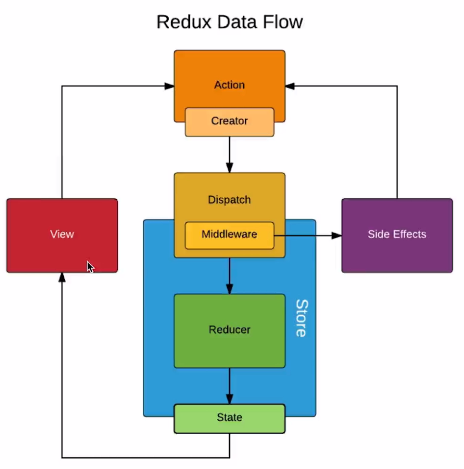

# Redux进阶

##  1 Redux-thunk 中间件

* GIthub地址： [`Redux-thunk`]( https://github.com/reduxjs/redux-thunk )
* 对`Redux-thunk`中间件的理解
  * 此中间件是指在`action`和`store`中间  *注意是`Redux`的中间件,而不是`React`的中间件*
  * 此中间件就是对`dispatch`重新做了一次封装
    * 当传入的action是对象时 ，直接交给store处理
    * 当传入的action是函数时 ，先执行函数，若函数中有对象形式的action再交给store处理




* 安装：

  ```js
  npm install redux-thunk --save
  ```

* 配置：

  * `scr/store/index.js`中配置  ---- *只有`thunk`中间件的情况*
    * 1 添加`applyMiddleware`: 用于给Redux添加中间件
    * 2 导入`redux-thunk`
    * 3 添加`thunk`中间件

  ```js
  import { createStore, applyMiddleware } from 'redux'   ----1----
  import thunk from 'redux-thunk';   -----2-----
  import reducer from './reducer'
  
  const store  = createStore(
    reducer, 
    applyMiddleware(thunk）  ------3-----
  	//window....: 也是中间件  配合redux-devtools使用
  export default store
  ```

  * `scr/store/index.js`中配置  ---- *有多个中间件的情况*

  ```js
  import { createStore, applyMiddleware, compose } from 'redux'
  import thunk from 'redux-thunk';
  import reducer from './reducer'
  
  const composeEnhancers = window.__REDUX_DEVTOOLS_EXTENSION_COMPOSE__ ?  window.__REDUX_DEVTOOLS_EXTENSION_COMPOSE__({}) : compose;
  const enhancer = composeEnhancers(
    applyMiddleware(thunk)
  );
  
  const store  = createStore(
    reducer, 
    enhancer
  )
  
  export default store
  ```

* 使用：

  * 网络请求写在`src/store/actionCreator.js`中
    * dispatch  : 直接将action传给store处理
    * 函数内可以直接调用`actionCreator.js`中的其他函数

  ```js
  export const getTodoList = () => {
    return (dispatch) => {
      axios.get('http://152.136.185.210:8000/api/n3/home/multidata').then((res) => {
        const item = res.data.data.banner.list[0].acm
        const action = getAddItemAxios(item)
        dispatch(action)
      })
    }
  }
  ```

  * 组件中调用该网络请求函数

  ```js
  import {getTodoList} from './store/actionCreators'
  
  const action = getTodoList()
  store.dispatch(action)
  ```


##  2 Redux-saga 中间件

* Github地址: [Redux-saga]( https://github.com/redux-saga/redux-saga )

* 安装：

  ```js
  npm install redux-saga --save
  ```

* 配置：[官方配置教程]( https://github.com/redux-saga/redux-saga#mainjs )

  * 在`src/store/index.js`中配置

  ```js
  import { createStore, applyMiddleware, compose } from 'redux'
  import createSagaMiddleware from 'redux-saga' //导入redux-saga
  import reducer from './reducer'
  import mySaga from './sagas'  // 导入saga文件 
  
  const sagaMiddleware = createSagaMiddleware() //实例化saga
  
  const composeEnhancers = window.__REDUX_DEVTOOLS_EXTENSION_COMPOSE__ ?  window.__REDUX_DEVTOOLS_EXTENSION_COMPOSE__({}) : compose;
  const enhancer = composeEnhancers(
    applyMiddleware(sagaMiddleware) //添加saga为redux的中间件
  );
  
  const store  = createStore(reducer, enhancer)
  sagaMiddleware.run(mySaga) // 执行saga文件
  
  export default store
  ```

* 编辑`sagas.js` : [官方教程]( https://github.com/redux-saga/redux-saga#sagasjs )

  * 在`src/store`下新建`sagas.js`文件
  * 组件中创建`action`通过`store.dispatch(action)`会将`action`同时传给`sagas.js`和`reducer.js`\
  * 若`<action.type>`匹配`sagas.js`中的设置，则执行`sagas.js`中对应的函数
  * 即在`action`和`store`之间多了`saga`做中间处理

  ```js
  //sagas.js
  
  import { takeEvery } from 'redux-saga/effects'
  
  function* <函数名>() {
  
  }
  
  function* mySaga() {
    yield takeEvery(<action.type>, <函数名>);
  }
  
  export default mySaga;
  ```

* `saga`中间件处理异步请求并更新`store`数据的流程

  * 1 定义`action`让`saga`可以抓取

  ```js
  //actionCreators.js
  export const getTodoList = () => ({
    type: GET_TODOLIST,
  })
  ```

  * 2 组件中实例化`action`并发送`action`

  ```js
  const action = getTodoList()
  store.dispatch(action)
  ```

  * 3 `sagas.js`中接收`action`并发送网络请求 
    * 网络请求不在使用`promise.then()`
    * 使用`yield`语法处理网络请求
    * `put`接口用于将`action`发送给`store`处理

  ```js
  import { put, takeEvery } from 'redux-saga/effects'
  import axios from 'axios'
  import { GET_TODOLIST } from './actionTypes'
  import { getAddItemAxios } from './actionCreators'  //将请求的数据更新到store的action
  
  function* getTodolist() {
    const res = yield axios.get('http://152.136.185.210:8000/api/n3/home/multidata')
    const item = res.data.data.banner.list[0].acm
    const action = getAddItemAxios(item)
    yield put(action)
  }
  
  function* mySaga() {
    yield takeEvery(GET_TODOLIST, getTodolist);
  }
  
  export default mySaga;
  ```

  * 4 更新`store`数据

  ```js
  //actionCreators.js
  export const getAddItemAxios = (item) => ({
    type: ADD_TO_LISTUP,
    item
  })
  
  //reducer.js
  if(action.type === ADD_TO_LISTUP){
      const newState = JSON.parse(JSON.stringify(state))
      newState.list.push(action.item)
      return newState
    }
  ```


##  3 React-redux

* Github地址：[react-redux]( https://github.com/reduxjs/react-redux )

* 安装：

  ```js
  npm install react-redux --save
  ```

####  3.1 API : Provider

**理解：**

* `<Provider>`声明了其包裹的组件可以直接与`store`建立联系，通过`API：connect`更方便的获取和修改`store`中数据

**使用：**

```js
//src/store/index.js
import React from 'react';
import ReactDOM from 'react-dom';
import TodoList from './TodoList';
import {Provider} from 'react-redux'; //导入react-redux
import store from './store'   //导入store

const App = (
  <Provider store = {store}>  //声明可以与store建立联系
    <TodoList />              //可以与store建议联系的组件
  </Provider>
)

ReactDOM.render(App,document.getElementById('root'));
```


####  3.2 API：connect

*只有`<Provider>`包裹的组件才可以使用`connect`与`store`建立连接*

1. 导入`connect`方法

   ```js
   import { connect } from 'react-redux'
   ```

2. 导出组件

   * 本质是返回`connect`函数的执行结果  其执行结果就是将派发`action`等业务逻辑加到了组件中

   ```js
   export default connect(mapStateToProps, mapDispatchToProps)(TodoList);
   ```

3. 获取`store`数据的方式的改变

   * 不建立连接时的方式

   ```js
   //1 导入store
   import store from './store/index'  
   //2 将store的所有数据赋值给组件的state
   this.state = store.getState()
   //3 通过this.state使用
   this.state.属性
   ```

   * 建立连接后的方式

   ```js
   //1 将store中的数据单个的赋值给组件的props   ----注意：可以单个赋值-----
   const mapStateToProps = (state) => {
     return {
       inputValue: state.inputValue
     }
   }
   //2 通过this.props使用
   this.props.inputValue
   ```

4. 修改`store`数据的方式的变化

   * 不建立连接时的方式

   ```js
   // 1 派发action的函数写在组件中  通过this.dispatch派发
   class TodoList extends Component {
       constructor(props) {  
           super(props) 
           this.changeInputValue = this.changeInputValue.bind(this)
       }
       render() { }
       changeInputValue(e){
         const action = getInputChangeAction(e.target.value)
         this.dispatch(action)
       }
   }
   //2 通过this.函数名 调用函数   需要绑定this
   this.changeInputValue
   ```

   * 建立连接后的方式

   ```js
   //1 派发action的函数写在mapDispatchToProps中  通过dispatch派发
   const mapDispatchToProps = (dispatch) => {
     return {
       changeInputValue(e){
         const action = getInputChangeAction(e.target.value)
         dispatch(action)
       }
     }
   }
   //2 通过this.props.函数名 调用函数   不需要绑定this
   this.props.changeInputValue
   ```

5. store数据改变，组件绑定的数据或自动刷新，不需要再订阅store的变化

   ```js
   store.subscribe(this.handleStoreChange)  //不再需要此订阅
   handleStoreChange() {
         this.setState(store.getState())
   }
   ```

**案例：**

```js
//组件.js
import React, {Component} from 'react'
import { connect } from 'react-redux'
import {getInputChangeAction} from './store/actionCreators'
import TodoListUI from './TodoListUI'

class TodoList extends Component {
  constructor(props) {  
    super(props)       
    this.state = store.getState()
    store.subscribe(this.handleStoreChange)
  }


  render() {  
      
    return (    
      <TodoListUI
        inputValue = {this.props.inputValue}
        changeInputValue = {this.props.changeInputValue}/>
    )
  }

}

const mapStateToProps = (state) => {
  return {
    inputValue: state.inputValue
  }
}

const mapDispatchToProps = (dispatch) => {
  return {
    changeInputValue(e){
      const action = getInputChangeAction(e.target.value)
      dispatch(action)
    }
  }
}

export default connect(mapStateToProps, mapDispatchToProps)(TodoList);
```

