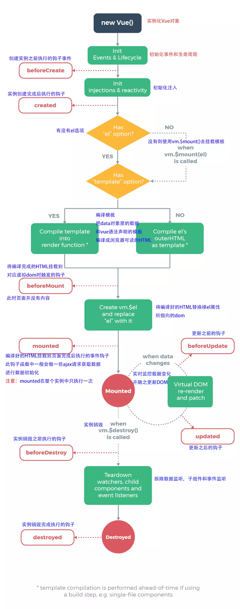
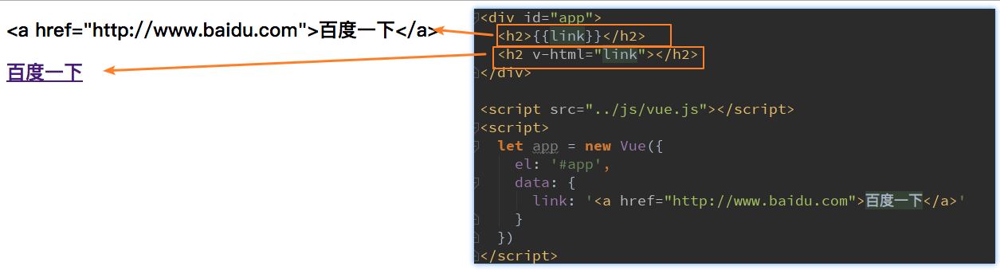
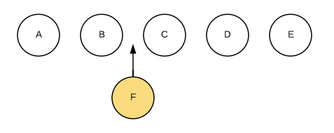
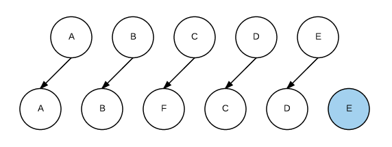
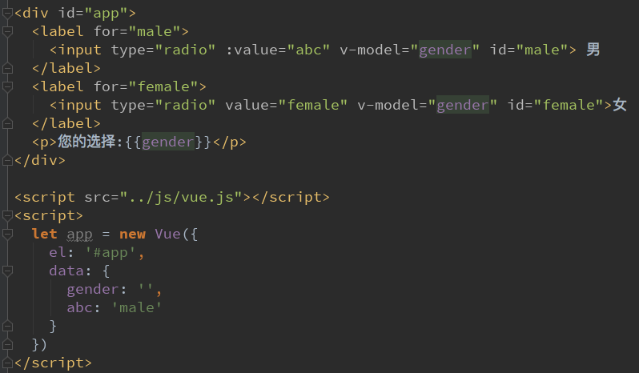
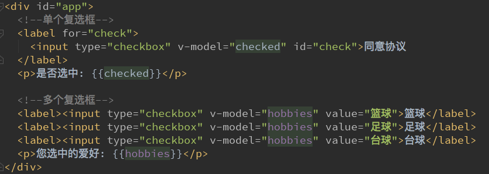
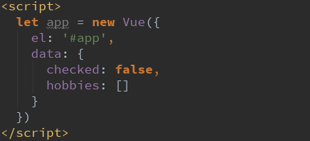
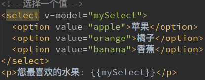
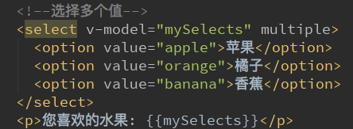
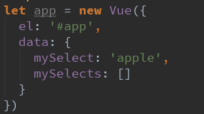

# 

#  一、Vue基础

##  1 Vue安装

* **[Vue官网]( https://cn.vuejs.org/ )**

* **方式一：直接CDN引入**

  * 你可以选择引入开发环境版本还是生产环境版本

  ```
  <!-- 开发环境版本，包含了有帮助的命令行警告 --> 
  <script src="https://cdn.jsdelivr.net/npm/vue/dist/vue.js"></script>
  <!-- 生产环境版本，优化了尺寸和速度 -->
  <script src="https://cdn.jsdelivr.net/npm/vue"></script>
  ```

* **方式二： 下载和引入**

```
开发环境 https://vuejs.org/js/vue.js 
生产环境 https://vuejs.org/js/vue.min.js
```

1. 官网下载vue.js   官网--->安装---->直接用<script>引入方式(下载文件就是vue.js)  -----  开发阶段下载开发版本
2. 在项目中新建js文件夹  再将vue.js文件  放入js文件夹下
3. 引入及使用

   * 创建Vue对象的时候，传入了一些options：{}
     * {}中包含了el属性：该属性决定了这个Vue对象挂载到哪一个元素上,以"id"确定元素。
     * {}中包含了data属性：该属性中通常会存储一些数据
       * 这些数据可以是我们直接定义出来的。
       * 也可能是来自网络，从服务器加载的。

```
    <div id="app">{{message}}
        <h1>{{name}}</h1>
    </div>
    <script src="../js/vue.js"></script>
    <script>
        const app = new Vue({
            el:'#app',
            data:{
                message:'你好呀  hello  vue',
                name : 'maxthon'
            }
        })
    </script>
```

* **方式三：NPM安装**

```js
npm install vue --save
```


##  2 Vue中的MVVM

* [MVVM维基百科](https://zh.wikipedia.org/wiki/MVVM)

  

* View

  * DOM层。
  * 给用户展示各种信息。

* Model
  
  * 数据层 -->传入Vue的options中的data
* VueModel
  * 视图模型层：View和Model沟通的桥梁。
  * 实现了Data Binding，也就是数据绑定，将Model的改变实时的反应到View中
  * 实现了DOM Listener，也就是DOM监听，当DOM发生一些事件(点击、滚动、touch等)时，可以监听到，并在需要的情况下改变对应的Data。

##  3 传入Vue的options

* 创建Vue对象的时候，传入了一些options：{}
  * {}中包含了el属性：该属性决定了这个Vue对象挂载到哪一个元素上。
  * {}中包含了data属性：该属性中通常会存储一些数据
    * 这些数据可以是我们直接定义出来的。
    * 也可能是来自网络，从服务器加载的。
  * {}中包含了methods属性：该属性中定义了函数
  * {}中包含了computed 属性:  计算属性

```js
<div id="app">{{message}}
    <h1>{{name}}</h1>
    <ul>
        <li v-for="item in movies">{{item}}</li>
    </ul>
    <h1>当前计数：{{count}}</h1>
    <button v-on:click="add">+</button>
    <button v-on:click="sub">-</button>
</div>
<script src="../js/vue.js"></script>
<script>
    const app = new Vue({
        el:'#app',
        data:{
            message:'你好呀  hello  vue',
            name : 'jack ma',
            movies:['心灵捕手','阿甘正传','星际穿越'],
            count:0
        },
        methods:{
            add(){
                console.log('add')
                this.count++
            },
            sub(){
                console.log('sub')
                this.count--
            }
        }
    })
</script>
```

##  4 Vue生命周期



###  4.1 生命周期各时间节点易错点

1. **created()中获取不了组件及元素**

​       *报错原因：*

* el是在created（）周期函数之后才挂载到Vue中的
* 所以在created（）中获取的组件或元素为空

​      *解决办法：*

* 将获取组件及元素的操作放到mounted（）周期函数中执行

2. **mouted()中可能数据还没有加载完成**

* mouted()在el挂载完成后执行

3. **update()中DOM渲染还没有完成**

* update()在数据更新到DOM后执行

4. **$nextTick()中图片还没有加载完成**

* $nextTick(()=>{回调函数}) 在DOM渲染完成后执行

  * update()钩子函数是在是数据更新到DOM完成的时间节点
  * nextTick()函数是在数据更新且DOM渲染完成后的时间节点(*DOM渲染完成 不包括图片加载完成*)

```
this.$nextTick(() => {
	//DOM渲染完成后需要执行的操作
})
```


#  二、Vue基础语法

##  1 插值操作

#### mustache语法（双大括号）

* 数据绑定是**响应式**的

#### v-once

* 该指令表示元素和组件只渲染一次，view层展示的数据不会随着model层数据的变化而改变。

```js
<div id="app">
    <h1 v-once>{{name}}</h1>
</div>
<script src="../js/vue.js"></script>
<script>
    const app = new Vue({
        el:'#app',
        data:{
            name : 'jack ma'
        }
    })
</script>
```

#### v-html

* 该指令用于解析html代码
* 当数据内容本身就是html代码时可以只用这个指令解析并展示



####  v-text

* v-text作用和Mustache比较相似：都是用于将数据显示在界面中
* v-text通常情况下，接受一个string类型

```js
<div id="app">
    <h1 >{{name}}</h1>---------1
    <h1 v-text="name"></h1>----2
</div>
<script src="../js/vue.js"></script>
<script>
    const app = new Vue({
        el:'#app',
        data:{
            name : 'jack ma'
        }
    })
</script>


//展示效果相同
jack ma------1
jack ma------2
```

####  v-pre

* v-pre用于跳过这个元素和它子元素的编译过程，用于显示原本的Mustache语法。

```js
<div id="app">
    <h1 >{{name}}</h1>---------1
    <h1 v-pre >{{name}}</h1>----2
</div>
<script src="../js/vue.js"></script>
<script>
    const app = new Vue({
        el:'#app',
        data:{
            name : 'jack ma'
        }
    })
</script>


//展示效果相同
jack ma------1
{{name}}------2
```

####  v-cloak

* 在vue实例编译完成之前，浏览器会直接显示未编译的Mustache标签。
* 为了避免这个问题，设置`v-cloak`指令可以 不显示Mustache标签，直到编译结束再显示编译之后的效果
* [v-cloak]{} 设置未编译完成之前的显示效果

```js
<div id="app">
    <h1 v-cloak>{{name}}</h1>
</div>
<script src="../js/vue.js"></script>
<script>
    const app = new Vue({
        el:'#app',
        data:{
            name : 'jack ma'
        }
    })
</script>
<style>
  [v-cloak] {
  	display: none;  //设置为不显示
  }       
</style>
```

##  2 绑定属性

####  v-bind

* `v-bind`用于： 1绑定一个或多个属性；2向组件传递props值

* 可以动态绑定的属性：图片链接`src`、网站链接`href`、类、样式等

* **`v-bind`的语法糖：`:`** 

  ```js
  v-bind:src="http:\\a.png"    等同于    :src="http:\\a.png"
  ```

####  v-bind绑定class

* 1 对象语法

  ```html
  //'active'、'line'为类名
  //isActive、isLine  为标志位  只有true、false取值  控制类是否生效
  <h2 class="title" :class="{'active': isActive, 'line': isLine}">Hello World</h2>
  ```

* 2 数组语法

  * 为类名时带`引号`

  ```html
  //'active'、'line'为类名
  <h2 class="title" :class=“[‘active’, 'line']">Hello World</h2>
  ```

  * 为变量名时不带引号  

  ```js
  <div id="app">
      <h1 :class=“[active, line]">{{name}}</h1>
  </div>
  <script src="../js/vue.js"></script>
  <script>
      const app = new Vue({
          el:'#app',
          data:{
              active : {color: red},
              ling: {font-size: 10px}
          }
      })
  </script>
  ```

####   v-bind绑定style

* 1 对象语法

  * style后面跟的是一个对象类型
    * 对象的key是CSS属性名称
    * 对象的value是具体赋的值，值可以来自于data中的属性

  ```js
  :style="{color: currentColor, fontSize: fontSize + 'px'}"
  ```

* 2 数组语法

  ```html
  <div :style="[baseStyles, overridingStyles]"></div>
  
  data: {
  	baseStyles:{backgroundcolor:'red'}  
  }
  ```

##  3 计算属性

####   computed

* `computed`用于将数据进行转化、多个数据相结合再提供一个简单的属性绑定到html模块中

  * 案例

  ```js
  <div id="app">
      <h1>{{fullName}}</h1>
  </div>
  <script src="../js/vue.js"></script>
  <script>
      const app = new Vue({
          el:'#app',
          data:{
              firstName: 'jack',
              lastName: 'ma'
          },
          computed: {
              fullName(){
                  return this.firstName+ ' '+ lastName
              }
          }
      })
  </script>
  //效果
  jack ma
  ```

* `compoouted`的`get`和`set`

  * `computed`中定义的计算属性本来是包含`get`和`set`方法，`get`用于获取计算属性的结果，`set`用于设置计算属性，但是一般都只需要获取`get`，所以就简写成上面的函数形式，直接返回计算结果
  * 案例

  ```js
  <div id="app">
      <h1>{{fullName}}</h1>
  </div>
  <script src="../js/vue.js"></script>
  <script>
      const app = new Vue({
          el:'#app',
          data:{
              firstName: 'jack',
              lastName: 'ma'
          },
          computed: {
              fullName: {
                  get(){
                      return this.firstName+ ' '+ lastName
                  },
                  set(newName) {
                      const names = newName.split(' ‘)
                      this.firsName = names[0]
                      this,lastName = names[1]
                  }
              }
          }
      })
  </script>
  //效果
  jack ma
  ```

####  computed VS methods

* computed 和 methods中定义的方法都可以达到对data数据加工的效果
* 但是：**计算属性会进行缓存，如果多次使用时，计算属性只会调用一次**  即只会计算一次  然后将计算结果保存，避免了重复无用的计算，节省了计算能力。

##  4 事件监听

####  v-on

* [v-on官方教程](https://cn.vuejs.org/v2/api/#v-on)
* `v-on`监听的事件包括`DOM`原生事件和组件自定义事件

* `v-on`的语法糖：`@`

* 案例

  * 三个点击按钮的效果一样

  ```js
  <div id="app">
      <h1>{{counter}}</h1>
  	<button v-on:click="counter++">点击counter+1</button>
  	<button v-on:click="onCounter">点击counter+1</button>
  	<button @:click="onCounter">点击counter+1</button>
  </div>
  <script src="../js/vue.js"></script>
  <script>
      const app = new Vue({
          el:'#app',
          data:{
              counter: 0
          },
          monteds: {
              onCounter(){
                  this.counter++
              }
          }
      })
  </script>
  ```

####  v-on参数

* 如果`v-on`方法不需要额外参数，那么方法后的()可以不添加

  * 不带`()`时，如果方法本身中有一个参数，那么会默认将原生事件event参数传递进去

* 如果`v-on`需要传入某个参数，同时需要event时，可以通过$event传入原生事件。

* 案例

  ```js
  <div id="app">
      <h1>{{counter}}</h1>
  	<button @:click="addOne">点击counter+1</button>
  	<button @:click="addTen(10, $event)">点击counter+10</button>
  </div>
  <script src="../js/vue.js"></script>
  <script>
      const app = new Vue({
          el:'#app',
          data:{
              counter: 0
          },
          monteds: {
              addOne(event){
                  console.log(event)
                  this.counter++
              },
              addTen(count, event){
                  this.counter += count
                  console.log(event)
              }
          }
      })
  </script>
  ```

####  v-on 修饰符

* `.stop`: 阻止冒泡
* `.prevent`: 阻止默认事件的调用  例如form的submit(提交)
* `.native `:监听组件根元素的原生事件。
* `.once` :只触发一次回调。

####  DOM原生事件列表

**[DOM原生事件列表](https://developer.mozilla.org/zh-CN/docs/Web/Events)**

##  5 条件判断

####  v-if、v-else-if、v-else

* v-if的原理
  
* v-if后面的条件为false时，对应的元素以及其子元素不会渲染。也就是根本不会有对应的标签出现在DOM中。
  
* 案例

  ```js
  <div id="app">
      <div v-if=“score>=90”>优秀</div>
      <div v-else-if=“score>=60”>及格</div>
      <div v-else>不及格</div>
  </div>
  <script src="../js/vue.js"></script>
  <script>
      const app = new Vue({
          el:'#app',
          data:{
              score: 99
          }
      })
  </script>
  ```

####  v-if VS  v-show

* v-if条件为false时，对应的元素以及其子元素不会渲染。
* v-show条件为false时，对应的元素以及其子元素会渲染。只是将元素的display属性设置为none，所以没有显示出来。
* 总结：
  * 当需要在显示与隐藏之间切片很频繁时，使用v-show
  * 当只有少次切换时，通常使用v-if

##  6 遍历循环

####  v-for

* 遍历数组

  * item: 数组中的元素
  * index： 数组中元素的索引

  ```js
  v-for=(item, index) in items
  ```

* 遍历对象

  ```js
  (属性值，属性名，属性索引)  in   info 
  (value, key,  index) in info 
  ```

####  :key

* **key的作用主要是为了高效的更新虚拟DOM。**

* 当某一层有很多相同的节点时，也就是列表节点时，我们希望插入一个新的节点，在B和C之间加一个F

  

  * Vue的虚拟DOM的Diff算法的处理方式是：C更新成F，D更新成C，E更新成D，最后再插入E，所以效率很低

    

  * 使用key

    * key相当于给每个节点做了唯一的标识
    * 这样就可以直接插入到B、C直接  效率更高

##  7 双向绑定

####  v-model

* `v-model`指令用于实现表单元素和数据的双向绑定
* 可使用标签：`input`、`textarea`

* 案例

  * 双向绑定流程
    * 因为input中的v-model绑定了message，所以会实时将输入的内容传递给message，message发生改变。
    * 当message发生改变时，因为上面我们使用Mustache语法，将message的值插入到DOM中，所以DOM会发生响应的改变。

  ```js
  <div id="app">
      <input type="text" v-model="message">
      <h2>{{message}}</h2>
  </div>
  <script src="../js/vue.js"></script>
  <script>
      const app = new Vue({
          el:'#app',
          data:{
              message: ''
          }
      })
  </script>
  ```

* **v-model原理**

  * 1.v-bind绑定一个value属性
  * 2.v-on指令给当前元素绑定input事件，将输入赋值给data中的数据

  ```js
  <input type="text" v-model="message">
  等同于
  <input type="text" v-bind:value="message" v-on:input="message = $event.target.value">
  ```

####  v-model:radio

* 用于多个单选框



####  v-model:checkbox

* 单个勾选框：
  * v-model即为布尔值.
  * 此时input的value并不影响v-model的值。
* 多个复选框：
  * 当是多个复选框时，因为可以选中多个，所以对应的data中属性是一个数组。
  * 当选中某一个时，就会将input的value添加到数组中。





####   v-model:select

* 单选：
  * 只能选中一个值。
  * v-model绑定的是一个值。
  * 当我们选中option中的一个时，会将它对应的value赋值到mySelect中
* 多选：可以选中多个值。
  * v-model绑定的是一个数组。
  * 当选中多个值时，就会将选中的option对应的value添加到数组mySelects中







####   v-model修饰符

* lazy修饰符：
  * 默认情况下，v-model默认是在input事件中同步输入框的数据的。
  * 也就是说，一旦有数据发生改变对应的data中的数据就会自动发生改变。
  * lazy修饰符可以让数据在失去焦点或者回车时才会更新：
* number修饰符：
  * 默认情况下，在输入框中无论我们输入的是字母还是数字，都会被当做字符串类型进行处理。
  * 但是如果我们希望处理的是数字类型，那么最好直接将内容当做数字处理。
  * number修饰符可以让在输入框中输入的内容自动转成数字类型：
* trim修饰符：
  * 如果输入的内容首尾有很多空格，通常我们希望将其去除
  * trim修饰符可以过滤内容左右两边的空格

```js
v-model.lazy="message"
v-model.number="message"
v-model.trim="message"
```


#  三、Vue组件化开发

##  1 组件化开发基础内容

###  1.1 注册组件

1. 创建组件构造器

* `Vue.extend()`
  * 传入自定义组件的模板 `template`
  * Vue2.x后这种写法就不再使用

2. 注册组件

* `Vue.component()`
  * 将组件构造器注册为一个组件，并且给它起一个组件的标签名称。
  * 传递两个参数：1、注册组件的标签名 2、组件构造器

3. 使用组件
   * 组件必须挂载在Vue实例下

```js
<div id="app">
    <!-- 3 使用组件 -->
    <m-cpn></m-cpn>
 </div>
 <script src="../js/vue.js"></script>
 <script>
    //  1 创建组件构造器
    const myComponent = Vue.extend({
        template: `
            <div>
                <h2>组件标题</h2>
                <p>我是组件内容</p>
            </div>
        `
    })
    // 2 注册组件  并定义组件标签的名称
    Vue.component('m-cpn', myComponent)
    
     const app = new Vue({
         el:'#app'
     })
 </script>
```


###  1.2 全局组件与局部组件

1. 全局组件

* 调用Vue.component()注册组件时，组件的注册是全局的。通该方法注册的组件可以在任意Vue实例下使用。

```js
// app1、app2两个实例都可以使用这个组件
<div id="app1">
    <!-- 3 使用组件 -->
    <m-cpn></m-cpn>
 </div>
<div id="app2">
    <!-- 3 使用组件 -->
    <m-cpn></m-cpn>
 </div>
 <script src="../js/vue.js"></script>
 <script>
    //  1 创建组件构造器
    const myComponent = Vue.extend({
        template: `
            <div>
                <h2>组件标题</h2>
                <p>我是组件内容</p>
            </div>
        `
    })
    // 2 注册组件  并定义组件标签的名称
    Vue.component('m-cpn', myComponent)
    
     const app1 = new Vue({
         el:'#app1'
     })
     
 	 const app2 = new Vue({
         el:'#app2'
     })
 </script>
```

2. 局部组件

* 若组件是在某个Vue实例中注册的，那么这个组件是局部组件，只能在这个Vue实例中使用。

```js
// app1可以使用这个组件   app2不会渲染出该组件
<div id="app1">
    <!-- 3 使用组件 -->
    <m-cpn></m-cpn>
 </div>
<div id="app2">
    <!-- 3 使用组件 -->
    <m-cpn></m-cpn>
 </div>
 <script src="../js/vue.js"></script>
 <script>
    //  1 创建组件构造器
    const myComponent = Vue.extend({
        template: `
            <div>
                <h2>组件标题</h2>
                <p>我是组件内容</p>
            </div>
        `
    })
    
     const app1 = new Vue({
         el:'#app1',
         components: {
             'my-cpn': myComponent   // 2 注册组件  并定义组件标签的名称
         }
     })
     
 	 const app2 = new Vue({
         el:'#app2'
     })
 </script>
```

###  1.3 父组件与子组件

* 传入组件构造器可以有： 模板`template`,还可以注册子组件`components`

```js
<div id="app">
    <!-- 3 使用组件 -->
    <parent-cpn></parent-cpn>
 </div>
 <script src="../js/vue.js"></script>
 <script>
    //  1 创建子组件构造器
    const myComponent1 = Vue.extend({
        template: `
            <div>
                <h2>我是子组件</h2>
                <p>我是子组件内容</p>
            </div>
        `
    })
    //  2 创建父组件构造器
    const myComponent2 = Vue.extend({
        template: `
            <div>
                <h2>我是父组件</h2>
                <p>我是父组件内容</p>
            </div>
        `,
        components: {
            'child-cpn': myComponent1   //父组件中注册子组件
        }
    })

     const app = new Vue({
         el:'#app',
         components: {
            'parent-cpn': myComponent2   //Vue实例中注册父组件
        }
     })
 </script>
```

###  1.4 注册组件语法糖

1. 注册全局组件语法糖

```js
Vue.component('m-cpn', {
    template: `
        <div>
            <h2>组件标题</h2>
            <p>我是组件内容</p>
        </div>
    `
})
```

2. 注册局部组件语法糖

```js
 const app = new Vue({
     el:'#app',
     components: {
        'parent-cpn': {
            template: `
                <div>
                    <h2>组件标题</h2>
                    <p>我是组件内容</p>
                </div>
            ` 
        }  
    }
 })
```

###  1.5 模板分离写法

1. 使用`<script> `标签实现

```js
<!-- 使用组件 -->
<div id="app">
    <m-cpn></m-cpn>
 </div>

 <!-- 组件模板 -->
 <script type="text/x-template" id="myCpn">
     <div>
        <h2>组件标题</h2>
        <p>我是组件内容</p>
    </div>
 </script>
 <script src="../js/vue.js"></script>

 <!-- Vue实例 -->
 <script>
     const app = new Vue({
         el:'#app',
         components: {
            'm-cpn': {
                template: '#myCpn'
            }
         }
     })
 </script>
```

2. 使用`<template>`标签实现

```js
<!-- 使用组件 -->
<div id="app">
    <m-cpn></m-cpn>
 </div>

 <!-- 组件模板 -->
 <template id="myCpn">
     <div>
        <h2>组件标题</h2>
        <p>我是组件内容</p>
    </div>
 </template>

 <script src="../js/vue.js"></script>
 <!-- Vue实例 -->
 <script>
     const app = new Vue({
         el:'#app',
         components: {
            'm-cpn': {
                template: '#myCpn'
            }
         }
     })
 </script>
```

###  1.6 组件数据存储

* **data在组件中必须是一个函数**
  * 因为组件会在多个位置使用，若data是对象形式，那么多个使用的位置就会指向同一个数据内存地址，一个位置修改数据，其他地方也会发生改变，导致组件相互影响，不能单独使用。若data是函数形式，在多个位置使用该组件时，会data函数会返回一个属于使用时组件自己的数据存储地址，是的组件使用是隔离的，不会互相影响。

```js
// 使用组件 
<div id="app">
    <m-cpn></m-cpn>
 </div>

 // 组件模板 
 <template id="myCpn">
     <div>
        <h2>组件标题</h2>
        <p>我是组件内容</p>
		<p>{{message}}</p>    
    </div>
 </template>
 <script src="../js/vue.js"></script>

 // Vue实例 
 <script>
     const app = new Vue({
         el:'#app',
         components: {
            'm-cpn': {
                template: '#myCpn',
                data(){
                    return {
                        message: '我是组件数据'
                    }
                }
            }
         }
     })
 </script>
```


##  2 父子间通信

###  2.1 父级向子级传递

* 在组件中，使用选项`props`来声明需要从父级接收到的数据。

* `props`的两种写法
  * 1 `props: {数据名： 数据类型声明}`
  * 2 `props: {数据名： {type：数据类型声明, default: 该数据默认值 }}`
  
* 注意：

  * 数据可以有多个类型： `props: {message: [string, Number]}`

  * 对象和数组默认值必须是函数

    ```js
    props: {
      cInfo: {
        type: Object,
        default() {
          return {}
        }
      }
    }
    ```

* 案例：

 ```js
<div id="app">
  <cpn :c-info="info" ></cpn>
</div>

<template id="cpn">
  <div>
    <h2>{{cInfo}}</h2>
    <h2>{{childMyMessage}}</h2>
  </div>
</template>

<script src="../js/vue.js"></script>
<script>
  const cpn = {
    template: '#cpn',
    props: {
      cInfo: {
        type: Object,
        default() {
          return {}
        }
      }
    }
  }

  const app = new Vue({
    el: '#app',
    data: {
      info: {
        name: 'why',
        age: 18,
        height: 1.88
      }
    },
    components: {
      cpn
    }
  })
</script>
 ```

###  2.2 子级向父级传递

**通过自定义事件实现子级向父级传递数据和事件**

* 自定义事件流程：
  * 1 在子组件中，通过$emit()来触发事件。（出发事件 同时可将数据传递出去）

    ```js
    this.$emit('自定义事件名'，数据)
    ```

  * 2 在父组件中，通过v-on来监听子组件事件。

    ```js
    //父组件中 
    // <cpn>为子组件
    <cpn @自定义事件名="cpnClick"></cpn>
    ```

* 案例：

```js
<!--父组件模板-->
<div id="app">
  <cpn @item-click="cpnClick"></cpn>
</div>

<!--子组件模板-->
<template id="cpn">
  <div>
    <button v-for="item in categories"
            @click="btnClick(item)">
      {{item.name}}
    </button>
  </div>
</template>

<script src="../js/vue.js"></script>
<script>

  // 1.子组件
  const cpn = {
    template: '#cpn',
    data() {
      return {
        categories: [
          {id: 'aaa', name: '热门推荐'},
          {id: 'bbb', name: '手机数码'},
          {id: 'ccc', name: '家用家电'},
          {id: 'ddd', name: '电脑办公'},
        ]
      }
    },
    methods: {
      btnClick(item) {
        // 发射事件: 自定义事件
        this.$emit('item-click', item)
      }
    }
  }

  // 2.父组件
  const app = new Vue({
    el: '#app',
    data: {
      message: '你好啊'
    },
    components: {
      cpn
    },
    methods: {
      cpnClick(item) {
        console.log('cpnClick', item);
      }
    }
  })
</script>

```

##  3 父子组件的直接访问

###  3.1 父访问子

####  3.1.1 $children

**语法:**

```js
//返回值为数组  拿到当前组件的所有子组件
this.$children

//以索引值拿到特定的子组件
this.$children[i]

//拿到特定组件后可以：1获取、修改子组件的数据  2调用子组件的方法 等
this.$children[i].属性
this.$children[i].方法
```

**$children的缺陷**

* 但是当子组件过多，我们需要拿到其中一个时，往往不能确定它的索引值，甚至还可能会发生变化。

* 需要快速且明确获取其中一个特定的组件，这个时候就可以使用$refs

####   3.1.2 $refs

**语法：**

* $refs和ref指令配合使用

* 1 通过ref给某一个子组件绑定一个特定的ID。

  ```html
  <child-cpn ref="child"></child-cpn>
  ```

* 2 通过this.$refs.ID就可以访问到该组件

  ```js
  this.$refs.child.属性/方法
  ```

###  3.2 子访问父

####  3.2.1 $parent

**语法：**

```js
//在子组件中  使用先的语法可以拿到父组件  
this.$parent

//拿到特父组件后可以：1获取、修改父组件的数据  2调用父组件的方法 等
this.$parent.属性
this.$parent.方法
```

* 不建议使用该方式操作父组件数据  因为这样会提高耦合度  容易引起一些问题  也不便于维护

####  3.2.2 $root

* `$root`可以在子组件中直接访问根组件也就是Vue对象，可以访问Vue对象下的数据和方法

* 语法: 

  ```js
  this.$root
  ```

###  3.3 非父子访问

* 非父子组件关系包括多个层级的组件，也包括兄弟组件的关系。

####  3.3.1 中央事件总线

**事件总线类似于Vuex， 只是Vuex用于管理状态， 事件总线用于管理事件**

**应用场景：**

* 相隔一个或多个组件的两个组件之间的通信

**使用：**

* main.js中新建Vue实例作为事件总线: `Vue.prototype.$bus = new Vue()`

```
Vue.prototype.$bus = new Vue()

new Vue({
  router,
  render: h => h(App),
}).$mount('#app')
```

* 组件发出全局事件：  

```
this.$bus.$emit('发出事件名'，参数)
```

* 组件监听全局事件：（一般在生命周期函数总监听）

```
this.$bus.$on('发出事件名', (参数) => {
 //处理事件       
})
```

* 组件取消全局事件的监听

```
this.$bus.$off('发出事件名', 函数名)   //函数名：需要取消事件监听的函数
```

##  4 插槽

* [插槽官网教程]( https://cn.vuejs.org/v2/guide/components-slots.html )


###   脚手架3中 配置文件别名

1. 在根目录下新建vue.config.js

* '@'表示： 'src'
* alias下配置别名

```
//vue.config.js
module.exports = {
    configureWebpack:{
        resolve: {
            alias: {
                'assets': '@/assets',
                'common': '@/common',
                'components': '@/components',
                'network': '@/network',
                'store': '@/store',
                'views': '@/views',
            }
        }
    }
}
```


###  混入

**混入提供了一种将组件中共有的部分抽离实现可复用的功能。组件中的任何部分都可抽离（data,methods,生命周期函数等）**

**定义：**

```
const mixin = {
  data: function () {
    return {
      message: 'hello',
      foo: 'abc'
    }
  },
  created: function () {
    this.hello()
  },
  methods: {
    hello: function () {
      console.log('hello from mixin!')
    }
  }
}
```

**使用：**

```
//app对象中就包含了 mixin对象中的data、methods、生命周期函数
const app = new Vue({
  mixins: [mixin],
})
```

**混入规则：**

* 1 data(数据)合并冲突  以组件数据优先
* 2  同名钩子函数将合并为一个数组，因此都将被调用。另外，混入对象的钩子将在组件自身钩子**之前**调用。
* 3  值为对象的选项，例如 `methods`、`components` 和 `directives`，将被合并为同一个对象。两个对象键名冲突时，取组件对象的键值对。  


###  getters方法->组件计算属性

将vuex中的getter中的方法直接转化成组件的计算属性

**store定义：**

```js
//state
const state = {
  cartList: []
}

//getters.js
export default {
  cartLength(state){
    return state.cartList.length
  }
}
```

**使用：**

```js
//导入
import { mapGetters } from 'vuex'

//使用
computed: {
  //1 不改别名用法
  ...mapGetters(['cartLength']),
  //2 改别名用法
  ...mapGetters({
    length: 'cartLength'
  })
}

//html
<p>{{cartLength}}</p>  //1 不改别名用法
<p>{{length}}</p>      //2 改别名用法
```


###  actions方法->组件方法

将vuex中的actions中的方法直接转化成组件的方法中的方法

* **注意：actions可以返回promise**

**store定义：**

```js
//actions.js
export default {
  addCart(context, payload){
    return new Promise((resolve, reject) => {
      if(...){
        resolve('成功')
      }else{
        resolve('成功')
      }  
    })
  }
}
```

**使用：**

```js
//导入
import { mapActions }  from 'vuex'

//使用
methods: {
  //1 不改别名用法
  ...mapActions(['addCart'])	
  //2 改别名用法
  ...mapActions({
    add: 'addCart'
  })
}

//调用
//原始调用
this.$store.dispatch('addCart', cart).then((res) => {
  console.log(res)
})
//引入后调用
this.addCart(cart).then((res) => {
  console.log(res)
})
```


##  零碎知识点

* 拿到组件的元素`$el`

```
//例：获取scroll组件到顶部的距离
this.$refs.scroll.$el.offsetTop
```


###   数组可响应式的方法

push()
pop()
shift()
unshift()
splice()
sort()
reverse()


注意：arry[0] = 'adfa'  索引修改不会刷新界面
Vue只带的方法：
Vue.set(对象，索引，替换值)