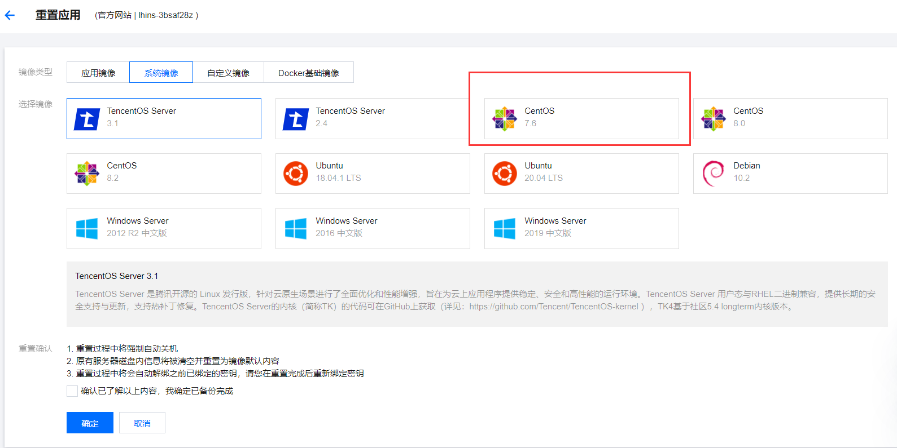
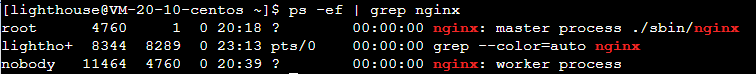

 


#  vue项目部署到腾讯云轻量应用服务器

###   登录腾讯云并找到相应位置

* 控制台

  


* 云产品
* 轻量应用服务器


###  安装需要的系统（CentOS 7.6）

* 可以根据需要重置为需要的系统，没有限制


* 选择系统镜像
* 安装**CentOS 7.6**



###  重置服务器密码

* 重置后记得保存密码
* 账户名为root 
* 这里设置的用户名及密码就是这个轻量应用服务器的用户名和密码
  * 在后续使用`xshell`和`xftp`时需要使用


###  将域名绑定到本服务器

* 点击域名解析即会跳转到域名页面


* 选择一个要绑定域名点进去


* 需要添加两条记录
  * www和@  主机记录就填这两个值


* 完成以上绑定后，在浏览器输入域名就会解析为服务器域名，并显示下面部署的前端项目

###  密钥与Xshell

> * 通过Xftp实现将本地文件传输到服务器的CentOS系统中

####  1 创建密钥

* 创建密钥后，会自动下载一个密钥文件，一定保存好这个文件，且记住下载保存的本地地址，后续在xftp中会用到


####  2 安装Xshell并建立与服务器的链接

* 下载Xftp下载地址：https://www.netsarang.com/zh/xftp/（有免费版需认证）  
  * 同时安装xsell和xftp  (下载的都是.exe文件，直接双击即可运行)

* 创建会话
  * 文件--->新建
  * 端口号保持22不变


* 输入root，点击确定


* 在Pubulic Key导入下载到本地的密钥（上面第一步创建并下载到本地的密钥），密码为空（不用填），确定即可连接成功


* 服务器公网IP地址


* Xshell与服务器建立连接后，即创建会话成功后，界面如下，此时Xshell当前会话的终端就是服务器的终端
  * 此时是可以直接将文件（压缩包也可）拖到终端的，拖动到终端后就实现了将文件传输到服务器（此时文件传输的位置就是终端所在的文件路径下）
  * 但是不能实现文件夹的传输，若要传输文件夹，则需要下载安装Xftp，后文会讲到


###  开放端口

* 如果有端口需要默认访问，则需要在防火墙设置


###  在CentOS上安装Nginx

####  1 打开服务器远程终端

* 点击登录即可进入终端


####  2 切换为root用户

* 输入的密码为服务器密码

```
su
```


####  3 安装依赖

> 在任意目录下执行

* gcc编译是否安装

```
检查安装：yum list installed | grep gcc
执行安装：yum install gcc -y
```

* openssl库编译是否安装

```
检查安装：yum list installed | grep openssl
执行安装：yum install openssl openssl-devel -y
```

* pcre库编译是否安装

```
检查安装：yum list installed | grep pcre
执行安装：yum install pcre pcre-devel -y
```

* zlib库编译是否安装

```
检查安装：yum list installed | grep zlib
执行安装：yum install zlib zlib-devel -y
```

* 一次性安装

```
一次性安装: yum install gcc openssl openssl-devel pcre pcre-devel zlib zlib-devel -y
```

( -y 代表自动安装 ， 自动选择 Y)

####  4 下载nginx

* 最开始进入终端在/home/lighthouse目录下，需要回退两次到更目录下
* 再切换到/usr/loacl目录下下载Nginx


```
cd  /usr/local
```

* 下载

```
wget http://nginx.org/download/nginx-1.18.0.tar.gz
```

* 解压
  * 解压后的文件名为：nginx-1.18.0， 该文件就在/usr/local下

```
tar -zxvf nginx-1.18.0.tar.gz
```

####  5 安装nginx

* 打开nginx解压后路径, 即切换到nginx-1.18.0目录下

```
 cd nginx-1.18.0
```

* 指定安装路径 (–prefix 是指定nginx安装路径)， 在终端执行如下2条命令完成安装
  * 安装完成后会在/usr/local目录下生成nginx文件夹

```
./configure --prefix=/usr/local/nginx
make && make install
```


###  将打包的vue文件通过Xftp上传到nginx

* xshell建立连接后，点击下面的按钮，启动Xftp，进行文件传输
* 点击后可能提示没有安装Xftp,没有安装，就先安装


* 打卡Xftp后也需要建立与服务器的连接，建立连接时需要输入用户名和密码，则输入服务器的用户名和密码
* 下面的界面就是建立连接后的界面，左边是本地文件，右边是服务器文件
* 将本地文件直接拖到服务器相应文件夹即可实现文件的上传


* 将vue打包的dist文件夹下的文件上传到服务器/usr/loacl/nginx/html文件夹下
  * /usr/loacl/nginx/html中原有的文件删除


###  启动nginx

* 切换到/usr/local/nginx/sbin文件夹下

```
./nginx
```

* 或者切换到/usr/local/nginx文件夹下

```
./sbin/nginx
```

* 或者按配置文件启动

```
/usr/local/nginx/sbin/nginx -c /usr/local/conf/nginx.conf
```

###  检测nginx是否启动

> 切换到/usr/local/nginx/sbin文件夹下

```
ps -ef | grep nginx
```

* 若启动成功终端如下



###  重新加载nginx

* 例如修改了nginx.conf后则需要重新加载才能更新修改的配置

> 切换到/usr/local/nginx/sbin文件夹下

```
./nginx -s reload
```

###  关闭nginx

```
./nginx -s stop
```


