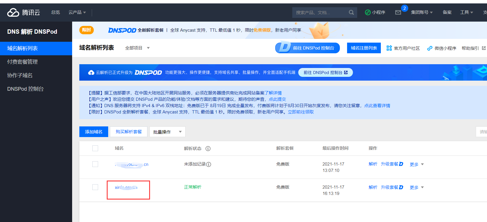
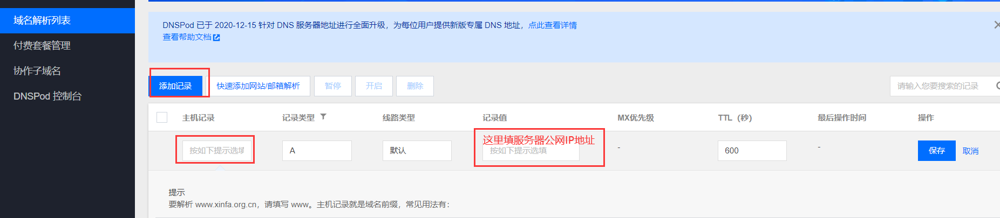
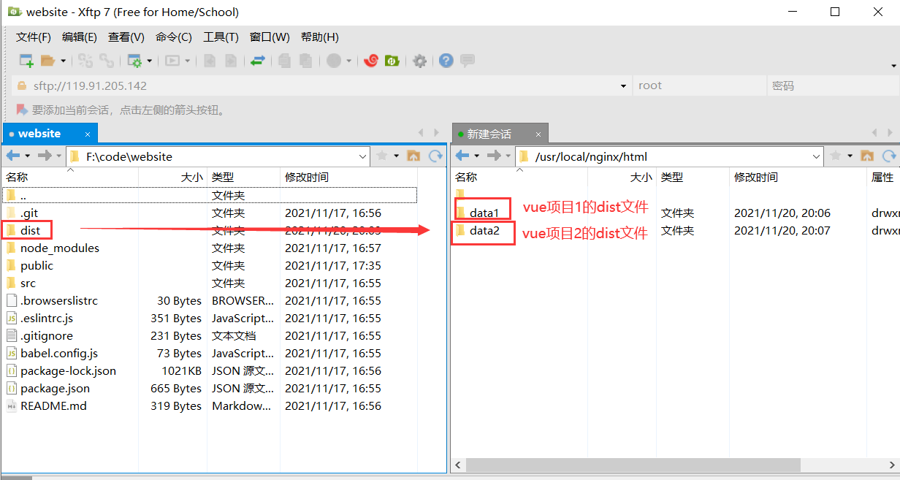

 ##  0、前言&问题描述

> **前言**
>
> 关于腾讯云轻量服务器的使用，在CentOS上安装及使用nginx,  域名与服务器的绑定， 通过nginx部署项目、通过Xftp进行文件传输等问题可以参考我的上一篇文章：[vue项目部署到腾讯云轻量应用服务器]()
>
> 参考：[使用nginx部署多个前端项目](https://juejin.cn/post/6844904183879958541)

> **问题描述**
>
> 有一台腾讯云轻量应用服务器，有两个域名: a.com和b.com
>
> 目标：通过nginx配置，使访问a.com时显示vue项目1， 访问b.com时显示vue项目2


##  1 将两个域名都解析到服务器的公网IP

> 两个域名都解析到这一个腾讯云轻量应用服务器的公网IP
>
> a.com和b.com的绑定操作都如下

* 点击域名解析即会跳转到域名页面


* 选择一个要绑定域名点进去



* 需要添加两条记录
  * www和@  主机记录就填这两个值




* 完成以上绑定后，在浏览器输入域名就会解析为服务器域名，并显示下面部署的前端项目


##  2 将多个dist文件传输到服务器上

* 在`/usr/local/nginx/html`下新建两文件夹data1和data2(文件名自定义，可区分即可)
* 在data1中放vue项目1的dist文件夹下的文件（dist是vue打包的项目文件）
* 在data2中放vue项目2的dist文件夹下的文件
* 以上的文件传输操作通过**Xftp**实现，Xftp的传输如下图



## 3 修改nginx.conf配置文件

* 通过配置不同的域名，实现不同项目的跳转
* 当访问a.com时，解析的就是html/data1，跳转到的就是vue项目1
* 当访问b.com时，解析的就是html/data2，跳转到的就是vue项目2

```
   server {
        listen       80;
        server_name  a.com;

        location / {
            root   html/data1;
            index  index.html index.htm;
        }
    }
    
    server {
        listen       80;
        server_name  b.com;

        location / {
            root   html/data2;
            index  index.html index.htm;
        }
    }
```

