#  linux

## 常用

#####  .bashrc

> [【Linux】什么是.bashrc，以及其使用方法](https://blog.csdn.net/weixin_57208584/article/details/135868555)

#####  Screen

> 用于将linux上的任务在后台执行，即使ssh断开也可以在后台继续执行
>
> https://www.elecfans.com/emb/202212051948505.html

```
screen -S "win" 新建   // S 必须大写
screen -ls      查看
screen -r "win" 重新进入
exit            退出
screen -d -r 26285.win  重名时 通过pid选择  pid = 26285
```


#####  安装g++

> [Ubuntu18.04中安装gcc、g++编译器 /运行c文件、c++文件【超详细图文教程】] : https://blog.csdn.net/weixin_43290551/article/details/125970965
>
> [快速升级到g++11和gcc11] : https://blog.csdn.net/weixin_37726222/article/details/124002454
>
> 查看版本：https://www.cnblogs.com/liujiaxin2018/p/16695558.html
>


#####  解压

> [zip](https://www.cnblogs.com/chinareny2k/archive/2010/01/05/1639468.html)

#####  cmake

> https://blog.csdn.net/qq_41375609/article/details/110535697

#####  shell脚本

```sh
#!/bin/bash        // 向系统表明是shell文件

echo "build 生成生产环境代码"   // echo 表示输出 输出内容用双引号
```

定时执行任务

* 该方式可以定时，但是任务提前完成仍然要等到定时时间结束后才能执行下一个任务

```shell
echo "================data/itwiki-2013====query/7_p3.graph============================" >> all28.txt
bin/count data/itwiki-2013 query/7_p3.graph 28 >> all28.txt &  // &符号获取pid
PID=$!  // 获取上面程序执行的pid
sleep 18000  //定时5小时 18000s  无论前面的任务是否在5小时内完成，都要等五小时，才能执行后面的z
echo "===============================================================================" >> all28.txt
kill -9 $PID //定时结束后结束进程

echo "================data/itwiki-2013====query/7_p3.graph============================" >> all28.txt
bin/count data/itwiki-2013 query/7_p3.graph 28 >> all28.txt &
PID=$!
sleep 18000
echo "===============================================================================" >> all28.txt
kill -9 $PID
```


#####  查看设备配置

> https://blog.csdn.net/weixin_53060366/article/details/125255658
>
> [Linux下查看CPU高速缓存(cache)信息](https://blog.csdn.net/wangquan1992/article/details/103821138)
>
> [Linux的CPU高速缓存cache和页高速缓存cache，buffer](https://blog.csdn.net/weixin_40535588/article/details/119998102)

查看内存

```
wangyj@node1:~/patternset$ free -h
              total        used        free      shared  buff/cache   available
Mem:           251G         16G         19G        2.3M        215G        233G
Swap:          8.0G        1.0M        8.0G

free [-bkmotV][-s <间隔秒数>]

-b 　以Byte为单位显示内存使用情况。

-k 　以KB为单位显示内存使用情况。

-m 　以MB为单位显示内存使用情况。

-h 　以合适的单位显示内存使用情况，最大为三位数，自动计算对应的单位值。单位有：B = bytes、K = kilos、M = megas、G = gigas、T = teras
```

查看gpu信息

> [lspci详解](https://blog.csdn.net/weixin_38452632/article/details/136633239)

```
lspci | grep -e VGA
```


查看cpu信息

```
lscpu
```

查看一级二级三级高速缓存

```
lscpu

//
L1d cache:           32K
L1i cache:           32K      
L2 cache:            1024K    // 1MB
L3 cache:            19712K   // 9.25MB
```

CPU 具体型号

```python
cat /proc/cpuinfo | grep name | cut -f2 -d: | uniq -c
1
```

CPU 个数：

```python
cat /proc/cpuinfo| grep "physical id"| sort| uniq| wc -l
1
```

CPU 每个里面的具体内核数量：

```python
cat /proc/cpuinfo| grep "cpu cores"| uniq
1
```

CPU 逻辑个数：

```python
cat /proc/cpuinfo| grep "processor"| wc -l
1
```

内核版本信息：

```shell
uname -r 或 uname -a
```

磁盘空间大小：

```shell
df -hT
```

内存大小：

```python
free -mh
1
#内存使用的百分比
free -m | sed -n '2p' | awk '{print "used mem is "$3"M,total mem is "$2"M,used percent is "$3/$2*100"%"}'
```

查看高速缓存区(Cached)

> https://blog.csdn.net/weixin_32559261/article/details/116801710

```
cat /proc/meminfo
```

#####  查看Linux内存消耗

```
sudo du -sh /home/wangyj
du -sh /home/wangyj
```


#####  如何查看Ubuntu版本

```
cat /etc/issue

// or
uname -v

// or
lsb_release -a
```

#####  在test.txtd第一行加入hello

````
sed '1i\hello' test.txt > tmp; mv -f tmp test.txt
````

##### 将本地文件拷贝到远程服务器

* `scp ` 远程拷贝
* `root@121.199.70.72:   ` 远程地址
  * `root`远程服务器名
  * `121.199.70.72`远程服务器地址
* `/var/www/zhihu` 文件要拷贝到远程服务器的文件夹路径

```
 scp -i ~/.ssh/vikingship.pem -r *  root@121.199.70.72:/var/www/zhihu
```

##### Xshell XFTP链接

* 密钥密码是密钥生成的时候设置的，如果生成密钥是一路回车，那密钥密码就是空（不输入即可）
* 本地密钥文件是不带后缀的id_rsa文件

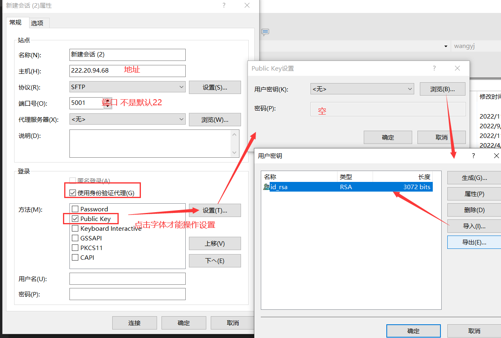

#####  查看文件大小

> https://blog.csdn.net/oqqHuTu12345678/article/details/125556409

使用“ls -l filepath”查看文件大小，第五列为文件字节数。

使用“ls -lh filepath”查看文件大小，加-h参数可以人性化显示文件大小。

```
wangyj@node1:~/dataset$ ls -l amazon-2008.txt 
-rw-rw-r-- 1 wangyj wangyj 70632805 May  5  2022 amazon-2008.txt
wangyj@node1:~/dataset$ ls -lh amazon-2008.txt 
-rw-rw-r-- 1 wangyj wangyj 68M May  5  2022 amazon-2008.txt
```


##  linux非root安装JDK11

1. **下载 JDK 11：** 打开 Oracle 或者 OpenJDK 官方网站，在下载页面找到 JDK 11 的版本。你可以选择 Oracle JDK 或 OpenJDK，视你的需求而定。

   例如，如果你选择使用 OpenJDK，可以使用如下命令下载：

   ```
   wget https://download.java.net/openjdk/jdk11/ri/openjdk-11+28_linux-x64_bin.tar.gz
   ```

2. **解压缩文件：** 使用以下命令解压缩下载的 tar 文件：

   ```
   tar -zxvf openjdk-11+28_linux-x64_bin.tar.gz
   ```

   这将在当前目录下创建一个新的目录，其中包含解压缩后的 JDK。

3. **设置环境变量：** 设置 `JAVA_HOME` 和 `PATH` 环境变量，让系统知道 JDK 的位置。假设你的 JDK 解压到了 `~/jdk-11`：

   ```
   export JAVA_HOME=~/jdk-11
   export PATH=$JAVA_HOME/bin:$PATH
   ```

   如果你想使这些变量在每次登录时都自动设置，将上述命令添加到你的 shell 配置文件（如 `~/.bashrc` 或 `~/.zshrc`）。

4. **验证安装：** 打开一个新的终端窗口并运行以下命令，验证是否正确安装了 JDK：

   ```
   java -version
   ```


##  虚拟机安装Ubuntu和CentOS

###  安装Ubuntu

> [官网](https://ubuntu.com/)

####  下载镜像文件(.iso)

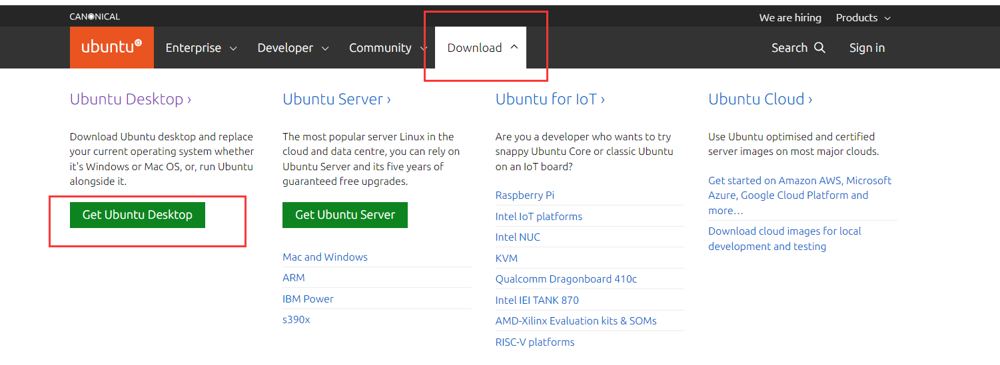

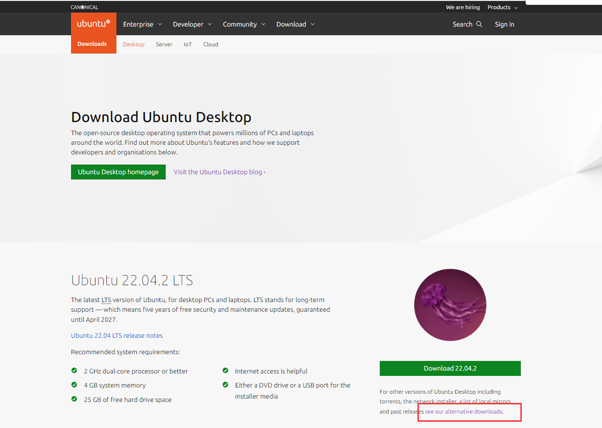

* 点击后滑动到底部，如下

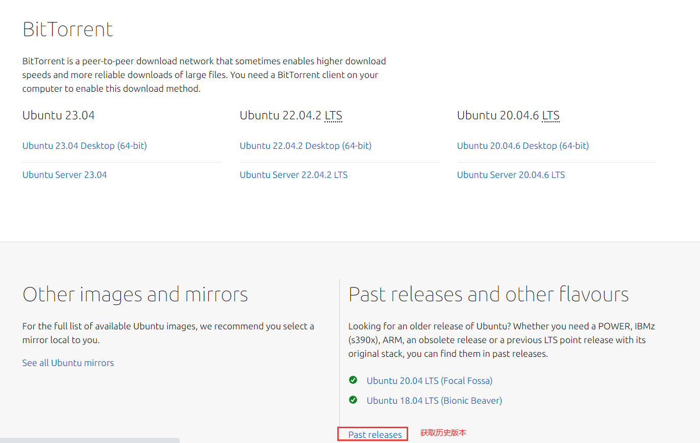

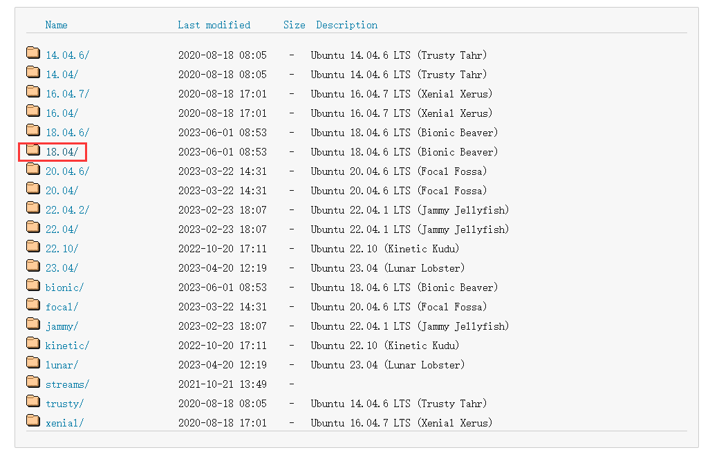

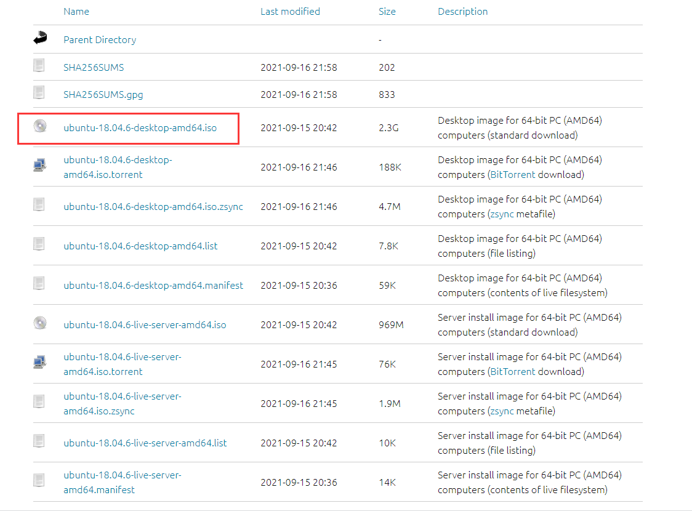

####  VMware安装Ubuntu

> [在VMware上安装Ubuntu详细教程](https://blog.csdn.net/GRT609/article/details/123931322)

###  安装CentOS

#### 下载镜像文件(.iso)

> [官网](https://www.centos.org/)
>
> [centos下载镜像文件](https://blog.csdn.net/qq_52772669/article/details/130735077)
>
> [CentOS 7镜像下载和安装教程](http://www.taodudu.cc/news/show-567516.html?action=onClick)
>
> [Centos7镜像版本命名规则](https://blog.csdn.net/weixin_72637522/article/details/130295593)

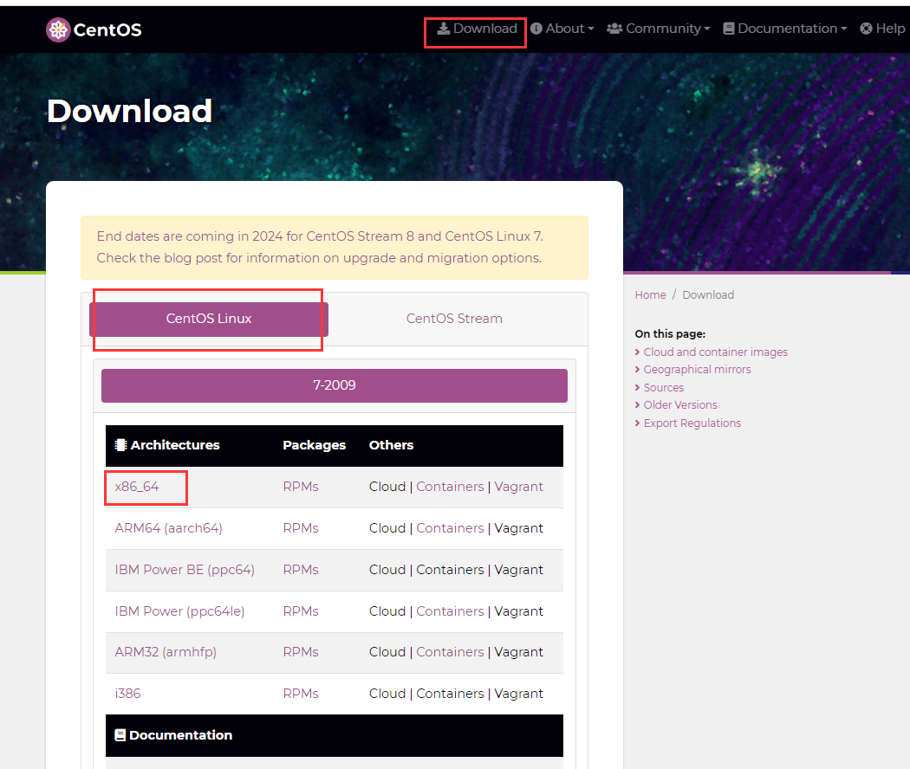

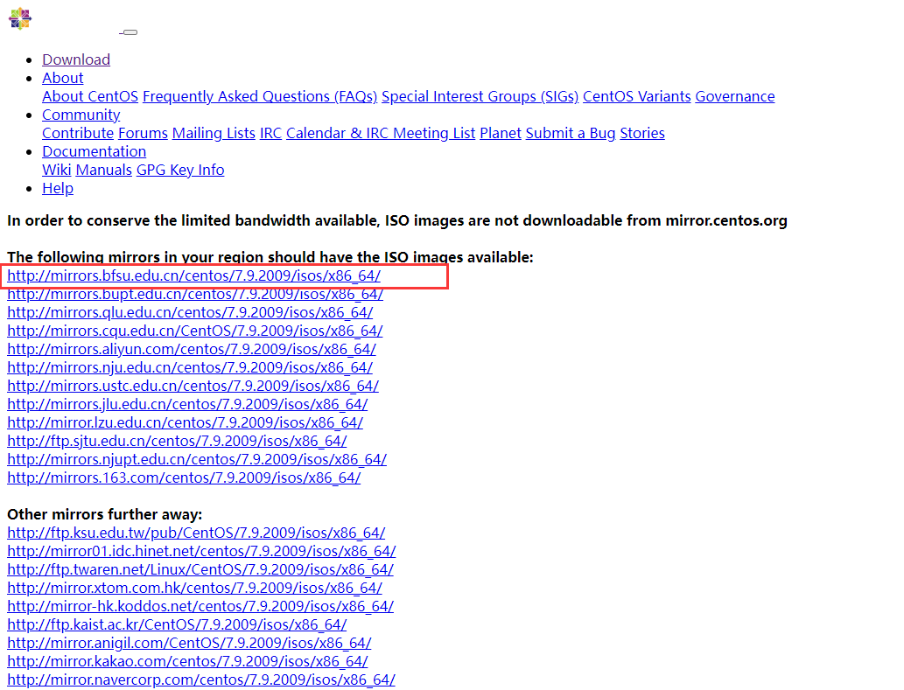

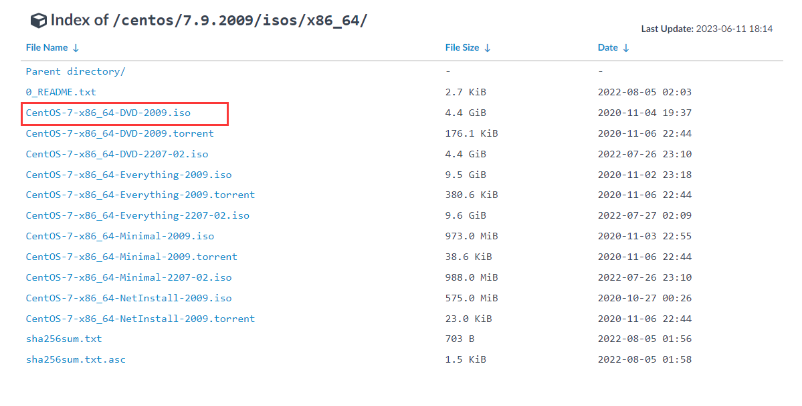

####       VMware安装CentOS

> [超详细VMware安装CentOs图文教程](https://blog.csdn.net/GRT609/article/details/123931322)
>
> [vmware 安装 centos](https://blog.csdn.net/weixin_45630258/article/details/125070170)


##  xftp连接虚拟机ubuntu

**ubuntu配置**

> [xshell和xftp与虚拟机Ubuntu之间的连接与配置](https://blog.csdn.net/xuyankuanrong/article/details/80246203)

* 安装openssh-server

```
sudo apt install openssh-server
```

* 检测是否启动
  * 只有`ssh-agent`则未启动，否则启动了

```
ps -e|grep ssh
```

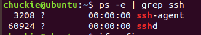

* 启动ssh

```
/etc/init.d/ssh start
```

基本以上步骤就可以连接了, 以下可以参考

```shell
sudo apt install openssh-server // 
apt install net-tools   // 安装net-tools工具
ifconfig // 查看ip

1.检查Ubuntu是否已安装xftp
vsftpd --version
2.如果没有安装，先安装xftp
sudo apt-get install vsftpd
3.检测Ubuntu是否安装ssh
ps -e|grep ssh
4.如果没有安装，先安装ssh
sudo apt-get install openssh-server
5.启动ssh
/etc/init.d/ssh start
```

**xftp设置**

* 只需要虚拟机ubuntu的IP地址和用户名和密码即可

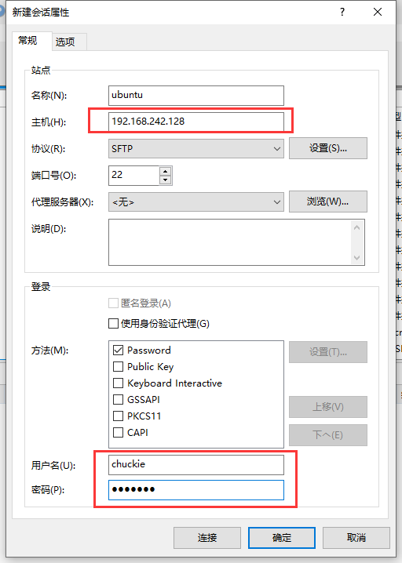

##  vscode 连接虚拟机ubuntu

ubuntu上的配置同：xftp连接虚拟机ubuntu

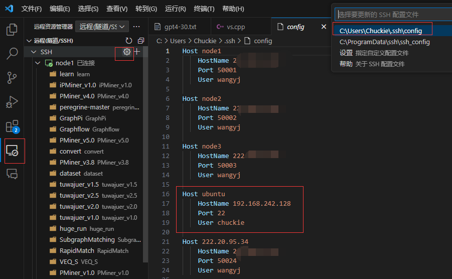

##  网络

查看路由表

在 Linux 操作系统，我们可以使用 `route -n` 命令查看当前系统的路由表

在 Linux 系统中，我们可以使用 `arp -a` 命令来查看 ARP 缓存的内容