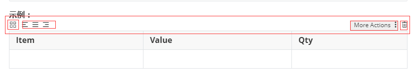
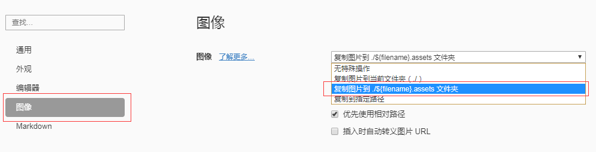

#  一、基础语法

## 1 表格

**语法：**

```
| Item      |    Value | Qty  |
```

**示例：**

| Item | Value | Qty  |
| ---- | ----- | ---- |
|      |       |      |

* 表格调整（对齐方式、增加行列、删除等操作） 如下图点击即可完成



## 2 分割线

*  用三个以上的星号、减号、底线来建立一个分隔线，行内不能有其他东西。也可以在星号或是减号中间插入空格 

**语法：**

```
* * *
or
***
or
*****
or
- - -
or
---------------------------------------
```

**示例：**

***

## 3 区块引用

* 区块引用一般用于标识引用他人内容的部分

**语法：**

```
> 内容
```

**示例：**

```
>这里参考了[Markdown 语法说明](https://www.appinn.com/markdown/)
```

>这里参考了[Markdown 语法说明](https://www.appinn.com/markdown/)

##  4 字体

* **加粗**

**语法：**

```
**内容1**
or
__内容2__
```

**示例：**

不加粗：内容

加粗：**内容1**  __内容2__

* **斜体**

**语法：**

```
*斜体1*
or
_斜体2_
```

**示例：**

*斜体1*
_斜体2_


#  二、链接的定义

## 1 行内式链接

* “标题”内容在鼠标移动到[内容]上时显示  同<a>标签中title的效果

**语法：**

```
[内容](链接地址 “标题”)
```

**示例：**

```
[百度翻译]( https://fanyi.baidu.com/?aldtype=16047#en/zh/  "网页翻译" )
```

[百度翻译]( https://fanyi.baidu.com/?aldtype=16047#en/zh/  "网页翻译" )

##  2 参考式链接

* 参考式链接将链接与内容分离。 使得在正文中编辑时只用写内容和参考标识符  更加简洁。链接一般统一定义在正文底部

**语法：**

```
[内容][参考标识符]
[参考表示符]:链接地址 “标题”
```

**示例：**

```
[百度翻译][1]
[1]:https://fanyi.baidu.com/?aldtype=16047#en/zh/  "网页翻译"
```


#  三、页面内跳转

> 参考[MarkDown中实现目录页面内跳转]( https://www.jianshu.com/p/4898c2e9a36d )  以下只总结了本人需要的部分  更多方式（标签跳转）请查看原文档

* 页面内跳转需要设置`锚点`（跳转的起点）及`锚点目标`（跳转的目标）   
* 页面内跳转一般用于实现目录跳转到正文指定位置

##  1 锚点的定义

**语法：**

* 行内式

```
[内容](#目标内容 “标题”)
```

* 参考式

```
[内容][参考标识符]
[参考标识符]：#目标内容 “标题”
```

**示例：**

```
[行内式链接](#行列式链接)
```

[行内式链接](#行内式链接)

##  2 锚点目标的定义

* 注意：目标内容中不能有大家字母和空格，所以如果锚点目标的 `目标内容` 中有大写字母或空格，则需要在定义锚点中的 `目标内容` 时，把大写字母改成小写字母，把空格改成 `-` 

**语法：**

```
目标内容    //就是目标内容本身没有特殊语法
```


#  四、github中实现目录跳转到不同.md文件指定位置

* 一般在README.md文件中展示目录  点击目录再跳转到正文.md文件中的指定位置

##  1 获取github中.md文件指定位置的网页链接

* 在github中打开.md文件   将鼠标移动到标题内容上时会出现一个链条的标志 点击这个标志即会在网页链接位置生成跳转到.md指定位置的网页链接


##  2 通过链接的方式实现目录跳转

* 同定义其他链接方式一样  只是链接地址换成了可以跳转到.md文件指定位置的链接地址

**示例：**

```
[跳转到本仓库的REAME.md文档的第一个标题位置](https://github.com/Wang-yujiang/Learning-Note-MarkDown-Advanced-/blob/master/README.md#learning-note-markdown-advanced-)
```

[跳转到本仓库的REAME.md文档的第一个标题位置](https://github.com/Wang-yujiang/Learning-Note-MarkDown-Advanced-/blob/master/README.md#learning-note-markdown-advanced-)


#  五、图片

## 1 图片定义

**语法：**

```


```

- 一个惊叹号 `!`
- 接着一个方括号，里面放上图片的替代文字
- 接着一个普通括号，里面放上图片的网址，最后还可以用引号包住并加上 选择性的 'title' 文字。

##  2 typora中设置图片以相对路径保存

* 将图片以相对路径的方式保存在与.md同文件夹下的文佳夹中   
* 在需要移动或发送.md文件时  连带图片文件夹一起移动
* 这样处理就可以**避免.md文件移动或发送后图片不能正常显示（找不到图片）的问题**

**设置操作：**

*文件-------->偏好设置------->如下图*




#  六、自动生成目录

##  方式1：[toc]

**注意：**

* 该方式在typora中有效果 可以实现跳转 
* 但是在上传到github后就不能正常显示了  ----  github不支持[toc]语法

**语法：**

* 在typora编辑器中打开.md文件 在文件头输入`[toc]`即可自动生成目录

##  方式2： npm 实现

1. **全局安装doctoc插件**

```
npm install doctoc -g
```

* 可以直接在Git Bash终端中执行  也可在cmd终端执行

2. **终端切换到.md所在文件夹下  执行如下命令：**

```
doctoc 文件名.md
```

* 可以直接在Git Bash终端中执行  也可在cmd终端执行

3. 执行完成  .md文件头就会自动生成目录 在github上也可以实现跳转