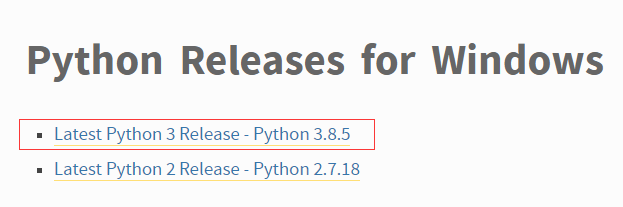
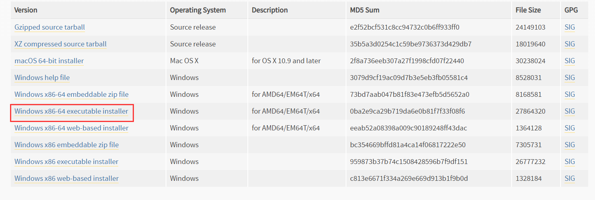
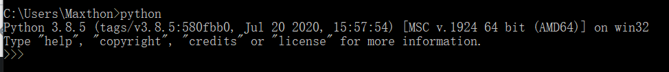
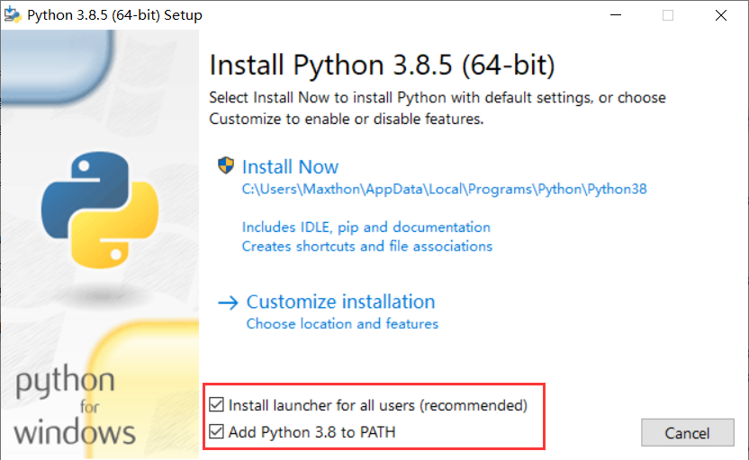

###   一、python解释器下载

**[python官网](https://www.python.org/)**

**解释器下载步骤：**

1. downloads ----  windows
2. 

3. 

4. **安装成功验证**
   * cmd终端输入：python，出现以下交互效果则安装成功
   * 

**安装注意点：**

 

###  二、vscode开发环境搭建

**插件：**

* Chinese
* Code runner
* Python
* vscode-icons

**运行文件：**

终端：`python 文件名`：  `python index.py`