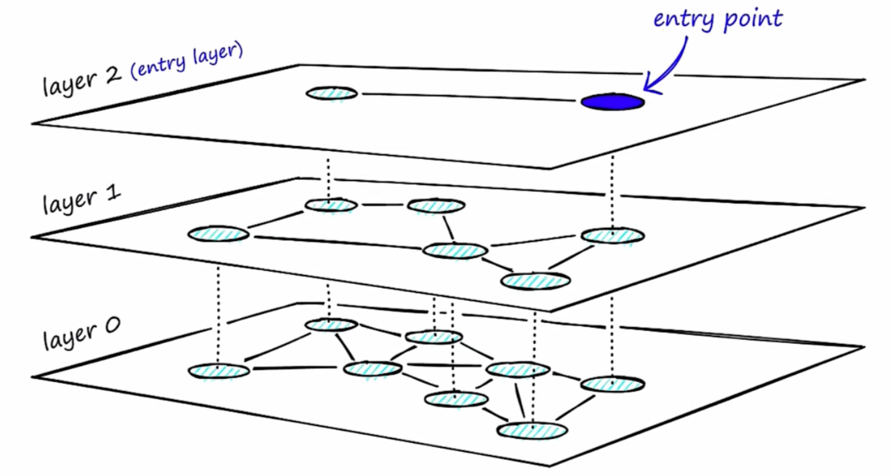
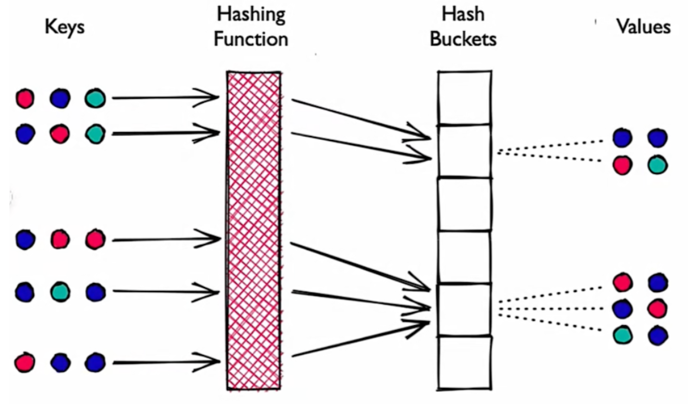
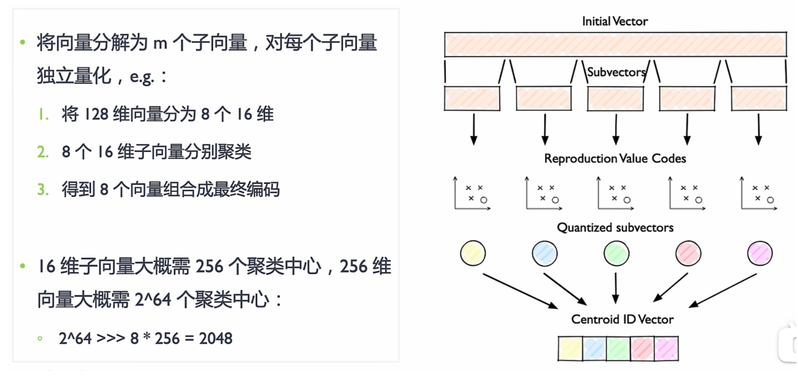

##  名词汇总

ANN: Approximate Nearest Neighbor 近似最近邻居

KNN: K Nearest Neighbor

RAG：Retrieval Augmented Generation  检索增强生成 （信息增强 在大语言模型中 添加额外信息）

LTR： 拟合精排结果的排序学习算法

IPNN： 特征交叉计算

MVKE: 多兴趣特征交叉

HitMatch: 交叉特征

MLP:**MLP，Multilayer Perceptron**

QPS:?

全量：？

RAG: Retrieval Augmented Generation 查询增强生成式 AI应用框架

* 

LLM: Large Language Model 大语言模型

###  相似性搜索

按数据结构分类

* Hash-based   
  * 主要利用哈希冲突  相似的向量在哈希时会冲突
  * Spherical hashing
  * Spetral hashing
  * LSH, Locally Sensitive Hashing 局部敏感哈希
* Tree-based
  * NGT Neighborhood Graph and Tree
  * Trinary Projection Trees
  * DT-ST
  * Annoy
  * 建立树结构：把高维空间划分成若干个子空间或者聚类中心，然后用树形结构来存储和检索。
  * 索引算法：通过二叉搜索树算法搜索，相似数据易在同—子树，从而更快地发现近似邻居。
  * 特点：基于精确距离计算 or近似距离计算。
  * 优缺点：优点对低维数据准确率较高。缺点是无法充分捕获数据复杂性，高维数据准确率较低。
* Graph-based
  * NGT Neighborhood Graph and Tree
  * HNSW
  * Scalable KNN Graph
  * Vamana
  * 数据结构：图中节点表示向量数据，边表示数据间相似性。
  * 构图方式：相似数据点更有可能通过边连接，搜索算法以有效方式遍历图找到相似近邻。
  * 优缺点：优点能够在高维数据中找到近似的近邻，从而提高搜索性能。缺点是构图方式复杂，影响内存效率。
* Inverted file 倒排文件索引
  * IVMF Inverted multiindex file
  * IVF Inverted File
  * 倒排文件索引（IVF）：将向量空间划分为多格 Voronoi 单元，单元以与聚类相同的方式，通过建立倒排索引表，以减少搜索空间。
  * 优缺点：优点是有助于设计快速缩小感兴趣相似区域的搜索算法；缺点是对于海量数据，细分向量空间会变慢。
  * 改进点：IVF 常与乘积量化（PQ）等量化方法结合，以提高性能。

按量化压缩分类

* Flat
  * 扁平化的索引 Flat indexing
    * Flat Indexing：使用ANN、IVF或 HNSW 等索引，直接计算查询向量与 DB中向量之间距离。为了将其与量化变体区分开来，使用这种方式使用时通常称为 IVF-Flat、HNSW-Flat等。
  * IVF Flat
  * HNSW Flat
* Quantized
  * 量化索引 Quantizeg indexing
    * 量化索引：将索引算法（IVF、HNSW）与量化方法相结合，以減少内存占用并加快索引速度。
    * 量化分类：标量量化（Scalar Quantization, SQ）或乘积量化（Product Quantization, PQ）。
    * 标量呈化 SQ：将向量对称划分包含每个维度的最小值和最大值的容器，将向量中的浮点数转换为整数。e.g.，神经网络模型对权重参数的量化。
    * 乘积量化 PQ：考虑沿每个向量维度值分布，执行压缩和数据缩减。将较大维度向量空间分解为较小维度子空间的笛卡尔积。
  * IVF SQ
  * Vamana PQ
  * HNSW-PQ
  * IVF PQ

### 相似性搜索算法

#### 相似性搜索算法比较

| 分类     | 经典算法 | 召回率   | 索引性能 |
| -------- | -------- | -------- | -------- |
| 暴力搜索 | K-Means  | 全局最优 | 低       |
| 基于树   | KD-Trees | 较高     | 高维下降 |
| 基于树   | Annoy    | 较高     | 较高     |
| 基于图   | NSW      | 高       | 高       |
| 基于图   | HNSW     | 较高     | 较高     |
| 基干哈希 | LSH      | 低       | 高       |
| 倒排索引 | IVF      | 高       | 较高     |
| 量化压缩 | SQ       | 高       | 低       |
| 量化压缩 | IQ       | 中       | 低       |

####  ANN

> Approximate Nearest Neighbor 近似最近邻居

####  IVF

> Inverted file 倒排文件索引

####   HNSW

> Hierarchical Navigable Small World 分层-可导航-小世界

图算法原理

* 构图：
  * 在已有的图中逐个插入顶点
  * 每次挑选M 个近邻向量，构建链接，即将这M个邻近向量与插入的向量链接
* 检索：
  * 随机挑选起始点
  * 遍历起点的邻接点，找到距离目标最近的邻居，并移动到最近的这个邻接点
  * 当所有邻居没有更近的距离，结束算法，当前点就是搜索结果

图算法的问题

* 数据增加--->空间点越密集
  * 1）构图速度变慢
    * 插入点时，需要和图中所有点计算距离，从而找到最近的M个点
  * 2）跳转数增加
* 图中所有点都以最短路径相连 
  * 搜索时，需要遍历所有节点

NSW 原理

> 构建无向图，即给定任意入口点，可以到达图中的任何节点：

* 首先形成长边（连接相距较远且需要多次遍历的节点），提高搜索效率
* 然后形成短边（连接附近的节点），提高搜索精度
* 通过遍历该图找到距给定查询向量最近的节点。
  * 先遍历长边 再遍历短边

HNSW构图原理

> HNSW 分层图结构解决遍历效率低，修复每个节点邻居数量上限，搜索复杂度降低 Log（m）。

* 图结构：将图分为多层，每一层作为一个SW（小世界），图中节点相互连接。每层节点都与上层节点相连。
* 构图：按距离相似度将近邻分成不同层。长边在顶层，层数越低边越短，最底层构成完整图。所有层都相互折叠，则 HNSW 图本质为 NSW 图。

* 检索：
  * 从最高层`l`开始沿最长边检索
  * 当前节点` n`值超出向量相似度，转移下一层图`l-1`
  * 在`l-1` 层图回退到`l`层图 `n `点沿最长边检索

####  LSH

> Locality Sensitive Hashing (LSH) 局部敏感哈希

* 原理：哈希函数将相似向量相同哈希值映射到桶中，通过比较哈希值判断向量间相似度。
* 哈希：Hash 碰撞概率尽可能高，越相似的向量越容易碰撞，相似向量被映射到同一个桶。
* 特点：性能高，每个哈希表桶向量远少于整个空间中向量数，并提供一个近似、非穷举结果。

####  PQ

> Product Quantization (PQ) 乘积量化

大规模数据集中，聚类算法最大的问题在于内存占用大：

1. 需要保存每个向量，向量中元素是浮点数FP（FP32 FP6）
2. 需要维护聚类中心和每个向量的聚类中心索引

###  常用评价标准

1. 准确率(Precision)
   准确率=检索相关的向量/检索出的向量总数。
2. 召回率( Recall )
   召回率=检索相关的向量/向量数据库中相关的向量总数0
3. 每秒平均吞吐(QPS)
   Query Per Second，QPs 是每秒查询数，每秒向量数据库能够处理的查询请求次数
4. 平均响应延迟(Latency)
   向量数据库的请求平均响应时间

###  索引方式

1. K-means and/or Faiss

2. Inverted File index(IVF )
3. Hierarchical Navigable Small World(HNSW)graphs

### 常见的神经网络种类

> 原文链接：https://blog.csdn.net/qq_51701007/article/details/136031584

1. Perceptron ANN: 
   感知机是一种用于二元分类任务的人工神经网络（ANN Artificial Neural Network）。它由一个输入层、一个或多个隐藏层和一个输出层组成。感知机算法是一种简单而高效的学习算法，可用于训练感知机模型。它通过根据预测输出和实际输出之间的误差调整输入和隐藏节点之间连接的权重来工作。

2. Convolution ANN: 
   卷积神经网络（CNN）是一种专门用于图像识别任务的ANN。它由多个卷积滤波器层组成，这些滤波器应用于输入图像以提取边缘、角点和纹理等特征。这些特征然后通过一个或多个全连接层产生最终输出。CNN以其能够学习空间特征层次结构的能力而闻名，这使它们在识别复杂图像模式方面非常有效。

3. Recurrent ANN: 
   循环人工神经网络（RNN）是一种用于处理序列数据（如时间序列或自然语言）的ANN。它们具有反馈连接，可以将信息从一步传递到下一步，从而使它们能够保留先前输入的记忆。RNN常用于语音识别、机器翻译和情感分析等应用中。

4. GANs: 
   生成对抗网络（GANs）是一种用于生成类似于给定训练数据集的新数据样本的ANN。它由两个神经网络组成：一个生成器网络，用于生成新样本；一个判别器网络，试图区分真实和伪造样本。这两个网络在一个类似游戏中的场景中一起训练，其中生成器试图欺骗判别器认为其样本是真实的，而判别器则试图正确识别真实样本和伪造样本。这个过程会一直持续下去，直到生成器能够产生与真实样本无法区分的高质量样本为止。