# RecommendationSystem

##  一、基础

### 推荐常用特征
用户特征
自然属性：姓名、性别、年龄、地域
画像特征：兴趣、行为
关系特征：人群属性、关注关系、亲密度

物品特征
静态特征：分类、标签、主题、价格
动态特征：热度、分类热度、标签热度
相关性特征：主题相似、分类匹配
上下文特征：最近N条浏览记录

相关性特征
关键词匹配
分类匹配
主题匹配
来源匹配

环境特征
时间
地理位置

热度特征
全局热度
分类热度
主题热度
关键词热度

协同特征
点击相似用户
兴趣分类相似用户
兴趣主题相似用户

###  推荐常用算法
基于流行度

* 最热门、最新、最多人点赞

基于内容

* 相同标签、相同关键词，相似主题

基于关联规则

* 看了A的人也看了B

近邻推荐

* 协同过滤
  * 基于用户
  * 基于物品
  * 基于模型

###  评估指标

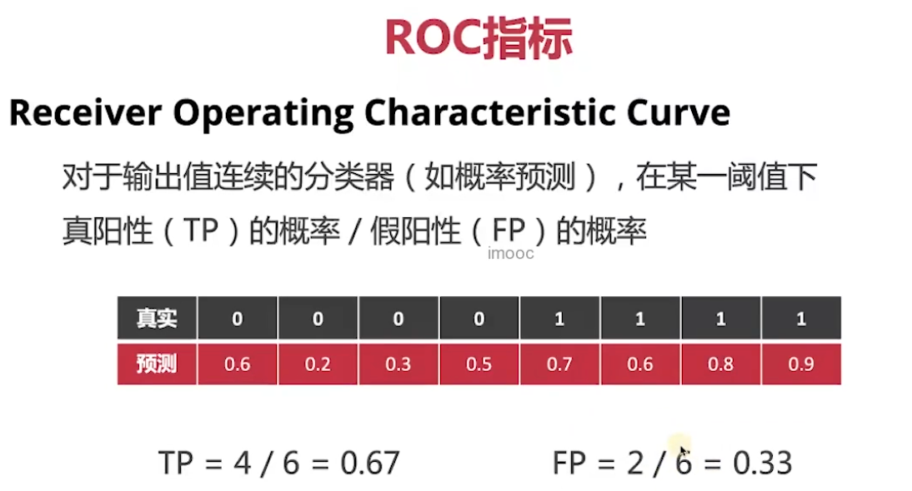

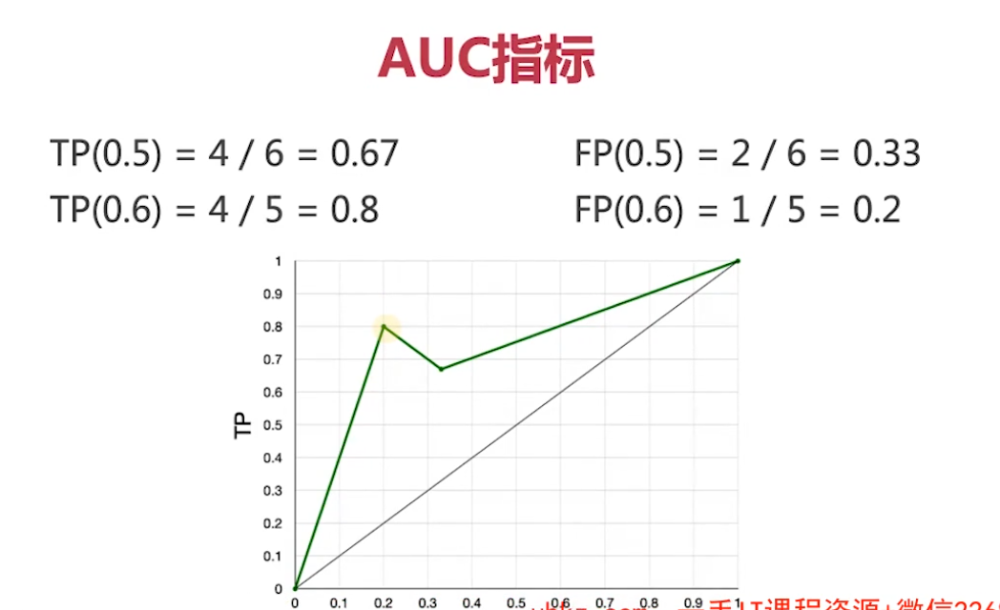

### 推荐系统评估标准

1. 满意度：准确率、停留时长、转化率
2. 覆盖率：长尾物品是否能被推荐
3. 多样性：推荐的物品是否两两不相似，尽可能覆盖多兴趣点

...

### Concrec技术选型
Spark
分布式大数据处理平台
解决了计算能力和存储能力分布的问题
不同于Hadoop，Spark基于内存计算，速度更快。
提供多种编程接口如SparkSQL，Mllib等

Flink
流式数据（stream）处理平台
以流处理为核心，高吞吐，低延迟
良好的容错性

###  框架

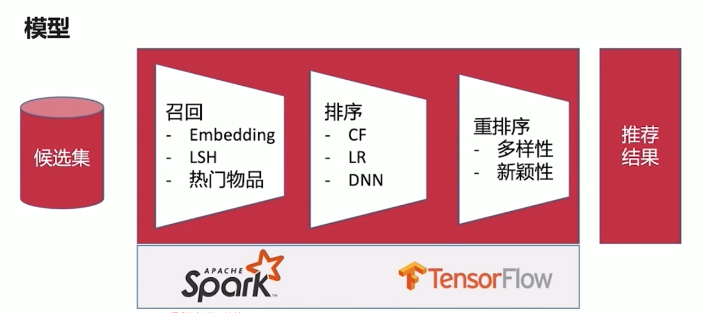

####  后端

Recall Service API
GET /recall
- 获取“猜你喜欢”召回结果
-参数：user_id 当前访问用户id
- 返回：动漫id数组

Recall Service API
GET /sim
-获取“相似推荐”召回结果
-参数：anime_id 当前动漫id
-返回：动漫id数组

Rank Service API
GET /rank
-获取“猜你喜欢”排序结果
-参数：user_id 当前访问用户id
-返回：动漫id数组

API Service API
GET /recommends
-获取“猜你喜欢〞推荐结果
-参数：user_id 当前访问用户id

-返回：动漫对象数组

GET /sim
-获取“相似推荐〞推荐结果
-参数：anime_id 当前动漫id

-返回：动漫对象数组

####  数据集

https://www.kaggle.com/datasets/CooperUnion/anime-recommendations-database

###  召回

####  策略

**热门**

返回热门的20个个动漫

避免马太效应

* 构建一个池子  1000
* 每次从池子里随机选取20返回

##  二、特征工程

### **特征工程的重要性**
基于大量数据的简单模型优于基于少量数据的复杂模型。
更多的数据优于聪明的算法
好的数据优于多的数据

**推荐系统常用特征**

以推荐电影为例

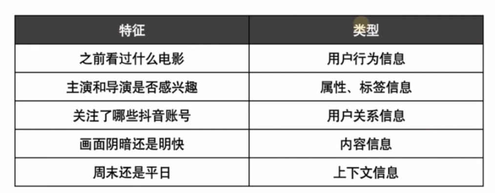

1 用户行为数据
最常用，也是最有效的数据
分为显性（explicit   **商业目录**）反馈行为和隐性（implicit）反馈行为

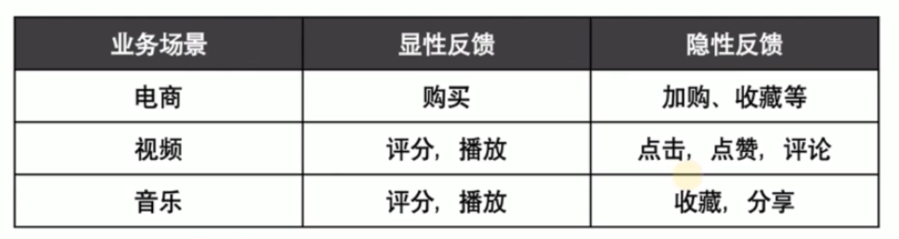

2 用户关系数据

3 属性、标签数据
直接属性
专人维护、用户上传

4 内容数据
非结构化的特征
需要通过NLP、图片识别等技术转化为可用特征

5 上下文数据
时间、地点等场景化信息
较难收集、但是作用显著

###  原始特征的问题
不属于统一量纲
不同特征有不同的值域以及分布
许多模型无法直接处理
比如：用户年龄、收入

信息冗余
多个特征蕴含相同信息
某一个特征被另一个特征所囊括
比如：生日和年龄

定性特征
具有分类属性的特征需要被数值化后才能进入模型
比如：电影分类、主演

缺失值
由于采样或特征自身的问题导致特征值的缺失
需要合理的对缺失值进行补充 （例如女性有的特征  男性没有 需要补充）

###  特征数值处理

**标准化**

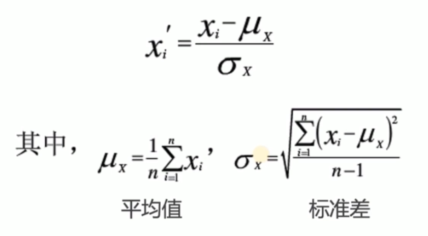

**归一化**

对于离群点比较多个情况下  这个方式不太合适

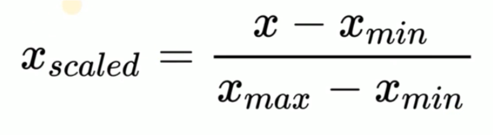

标准化 vs归一化
标准化
较适合本身就呈现正态分布的数据（如价格）
对异常值不敏感
归一化
较适合本身分布不确定的数据（如哑编码后的分类数据）
对异常值较敏感

**二值化**

将定性特征转换为定量特征
常用于分类等场景

例如：电影评分大于threshold(阈值) 则喜欢  否则 不喜欢

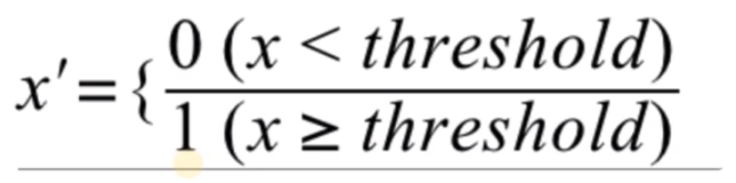

**哑编码** （不可二值化的特征）

将离散属性的分类特征转变为一组由0、1组成的向量
One-hot Encoding
Multi-hot Encoding

案例：

下面的方式数字化电影类型 会使得类型之间有大小关系 所以这种数值化不合适  哑编码就用于解决这种问题

电影的类型：
• 动作片 1
• 爱情片 2
• 科幻片 3
• 动画片 4

哑编码  

• 动作片 [1,0,0,0]
• 爱情片 [0,1,0,0]
• 科幻片 [0,0,1,0]
• 动画片 [0,0,0,1]

**缺失值补全**

对原始数据中确实的特征值，采取合适的方法进行补全
数值型特征补O，平均值，中位数
分类型特征可采取专门encode代表缺少值，或用embedding

**数值变换**
对于含有特殊意义的数据，手动进行变换
比如：税率、分贝数取log，邮编信息转换成经纬度坐标

### 特征选择
选择有意义的特征进入机器学习模型
大部分模型都可以识别出不相关的特征，为何还要筛除？
简化模型、提高训练速度；避免维度爆炸；避免过拟合

**方差过滤法**

筛选掉方差较小的特征

一组数据的同一特征方差很小  即这个特征没有区分度  则可以去掉这个特征

**相关系数法**

计算特征与目标直接的相关性（Pearson）

**卡方检验**  (特征工程最后一个视频)

检验变量间独立性的依据

假设两个变量相互独立则有：`p(x*y) = p(x)*p(y)`

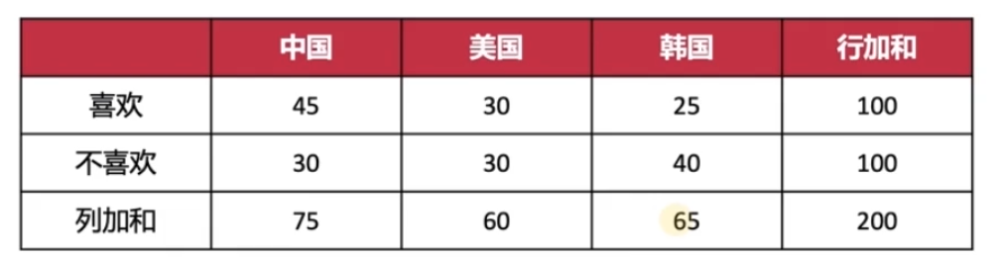

### 特征降维
降低特征维度、减少特征的数量
采用数学的方法将某些元素特征结合成更少量的新特征
避免维度爆炸、过拟合等问题

**PCA主成分分析**

##  三、召回

###  Embedding

> 4-5~4-7

**物品embedding**

每个用户都有喜欢的物品序列  将序列中的所有物品两两相连  得到一个物品到物品的矩阵

每个用户都有物品序列  每个物品序列中的物品都可两两相连  最终物品矩阵的值就是关联的次数

随机游走  得到L长度的跳转路径  类似Word的顺序  通过ItemToVec得到 embedding  根据预期相似度和计算相似度计算损失函数 然后梯度下降  得到特定维度的embedding

**用户embedding**

用用户喜欢的物品的embedding的平均值作为用户的embedding

###  存储embedding

Redis存储

id embedding  

key value 的方式存储

###  近邻查找

**精确查找**

暴力查找

K-D Tree

**近似查找**

K-Means

LSH  局部敏感哈希   哈希到相同的位置则相似

##  四、排序

###  推荐算法

#### **协同过滤**

* 矩阵分解

u1到I2表示u1对I2的评分 

U1 1.2 0.8 其实就是模型预测的U1的embedding  同理 I1 1.5 1.7也是

通过embedding举证乘法就可以计算出Rating Matrix中空格位置的值

通过损失函数和梯度下降 让乘积接近Rating Matrix有值位置的值

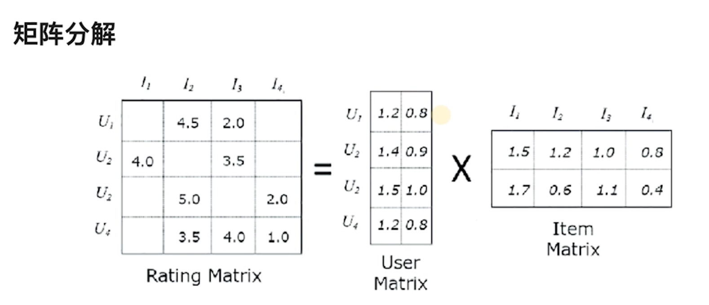

###  深度学习

> 可视化工具：playground.tensorflow.org

神经元

f是激活函数

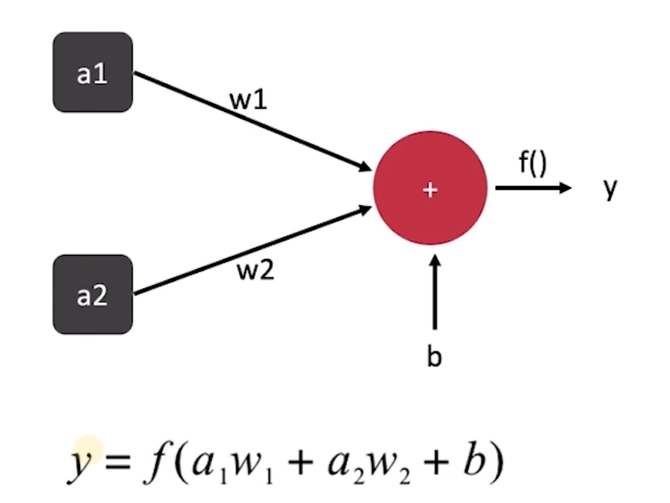

激活函数

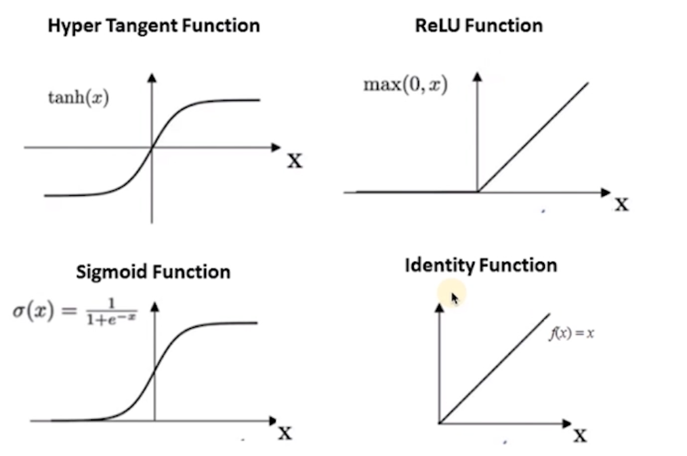

损失函数

xi是输入  是固定的

W,B是参数矩阵  是需要求解的

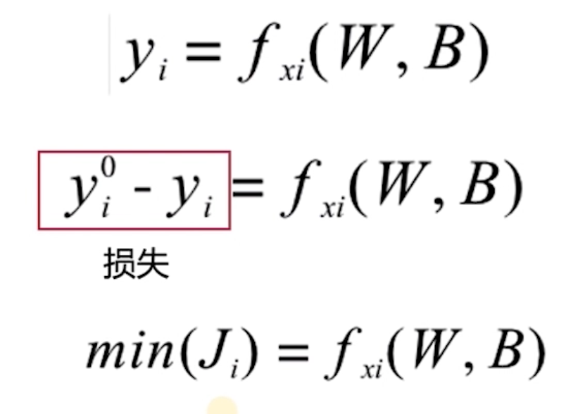

####  MLP

多层感知机

就是一个全链接的神经网路

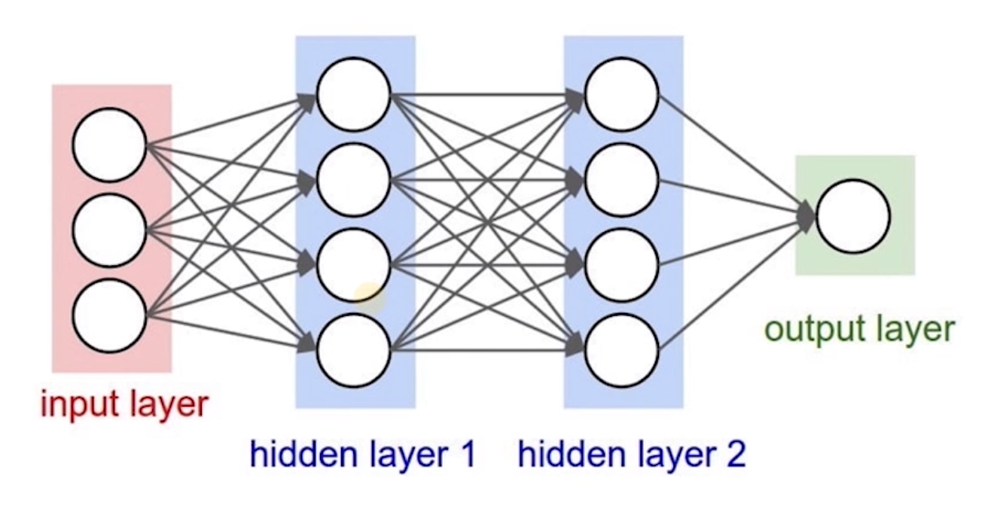

#### NeutralCF

神经网络协同过滤   双塔模型？

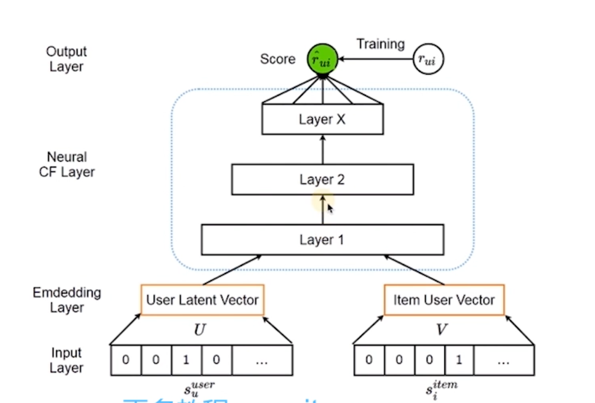

####  Wide&Deep Models

泛化是指：18岁的女生和30岁的男生的喜好都知道     要处理30岁女性和18岁男性则需要特征交叉 泛化得到

记忆力是指： 已经知道某个用户的喜好 就不用再通过深度学习去学习该用户的喜好 而是直接告诉模型该用户的喜欢 这就是记忆力

wide就是就是直接告诉模型用户喜欢什么  使得模型有记忆力

deep models则是利用交叉特征深度学习 具有泛化的能力

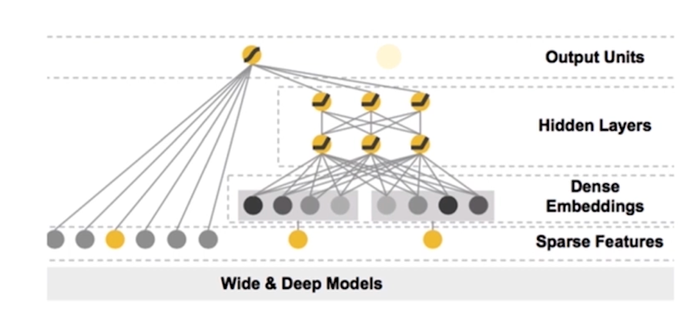

####  DIN

阿里团队的模型  引入了注意力机制

注意力机制是指：是一种模仿人类注意力的计算方法 它的核心思想是让模型在处理输入数据时，能够动态地关注输入的不同部分，从而提高模型的性能和效率

例如用户在逛淘宝  想买衣服时 会关注尺码、面料等信息  但是在买电子产品时就不会关注这些信息  那么只需要在买衣服时实用这些信息即可

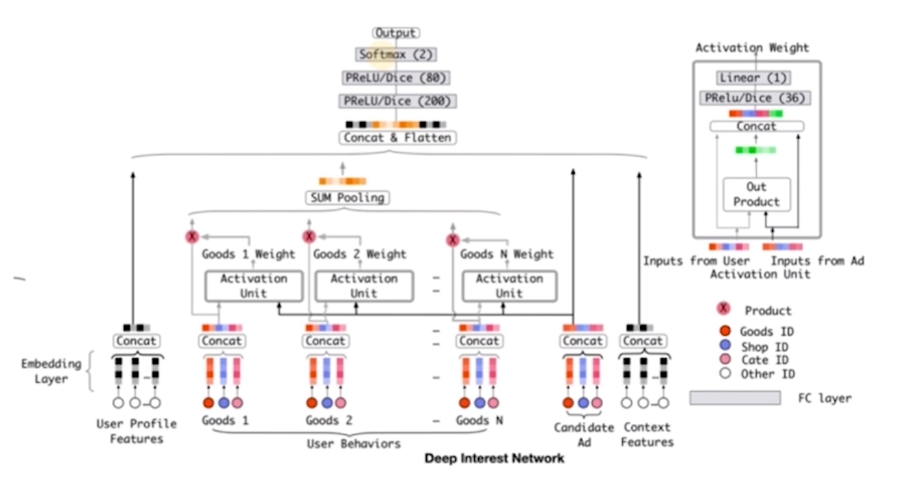

###  TensorFlow

> 深度学习框架：TensorFlow PyTroch  Caffe 

####  基本概念

**Tensor**

Tensor是一个表示多维数据的结构 可以是：

* 标量 （一个数值）
* 向量 （数组）
* 矩阵
* 多维矩阵

**Rank**

秩（Rank）代表一个tensor的维度
0维度  10 - Rank 0  
1维度  [1, 2, 3] - Rank 1  
2维度  [[1, 21, [3, 4]] - Rank 2
3维度  [[[11, [2]1, [[31, [411, [5], [6]]] - Rank 3

**Data Flow Graph**

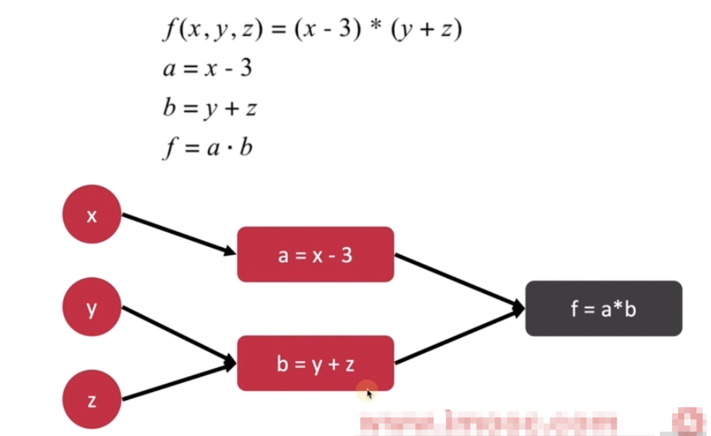

**TensorFlow API 框架**

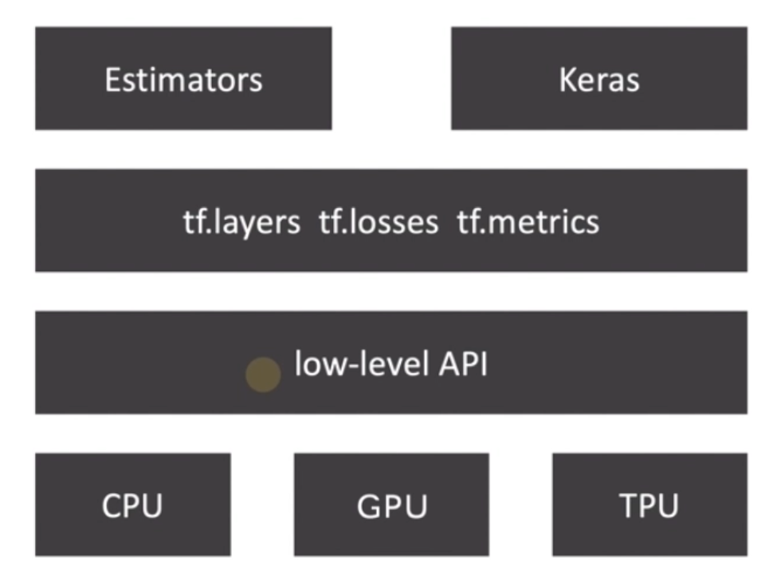

###  MLP模型

多层感知机 Multilayer Perceptron
至少含有三层（输入层、隐藏层、输出层）
除输入层之外均使用非线性激活函数

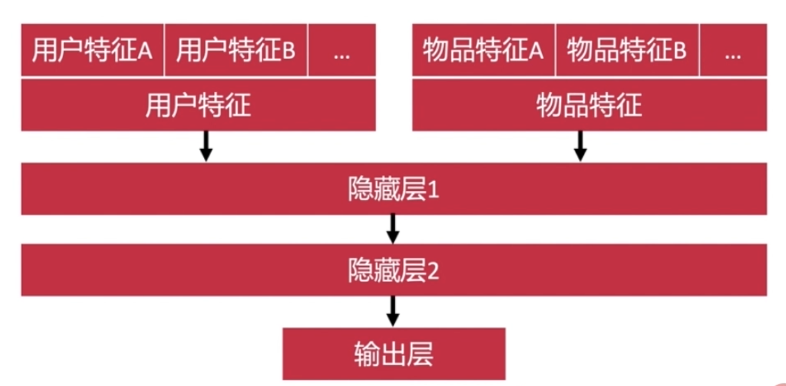

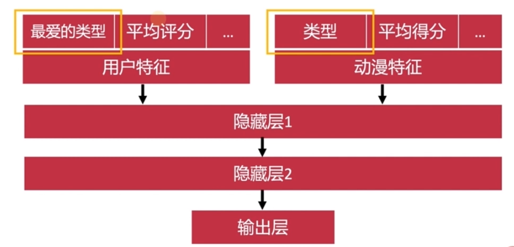

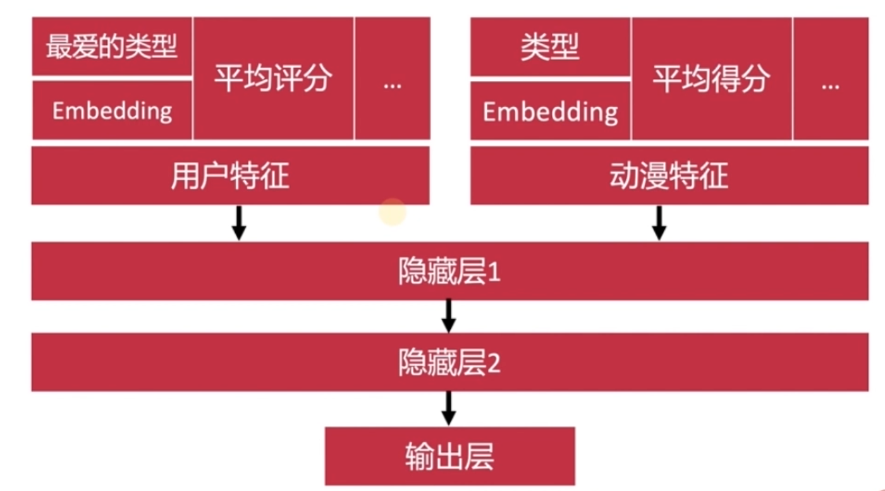

###  超参数
不能通过模型训练进行优化的参数
需要人为指定
比如神经网络的层数，每层的单元数

**超参数调优**
网格搜索

* 在所有候选超参数的取值中，尝试所有可能组合
  * 有3个超参数 每个超参数有3个取值 则一共27种组合

随机搜索

* 在所有可能取值中，随机选取超参数的组合
  * 有3个超参数 每个超参数有3个取值 则一共27种组合   随机选择10种组合 测试

