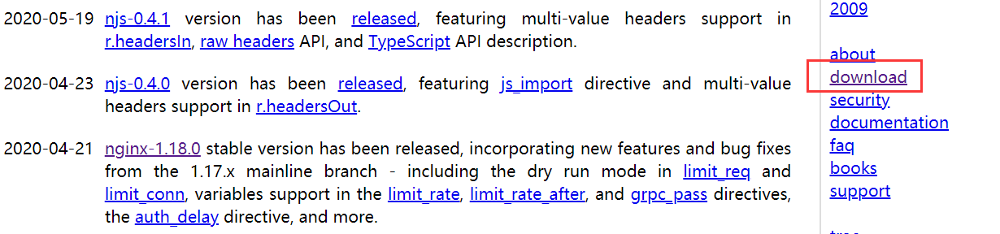
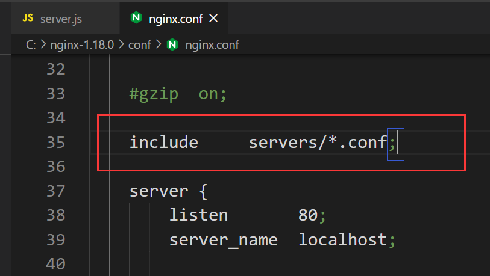
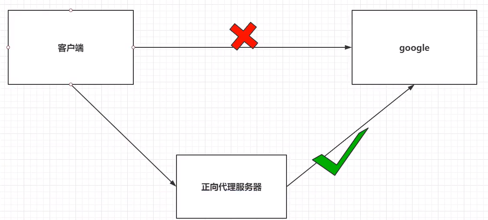

#  nginx

* **`nginx`用于部署项目**

##  一、基础介绍

主机-----> 操作系统（windows/linux）----->tomcat/nginx

###  1.1 安装

* [nginx官网]( http://nginx.org/ )

* [国内镜像下载地址]( http://mirrors.sohu.com/nginx/ )

* naginx版本
  *  mainline version ：主力版本，开发版
  *  stable version ：最稳定的版本，生产环境上建议使用的版本
  * legacy versions： 遗留老版本的稳定版
  
* 下载
  
  * 选择stable version  或者   点击官网右栏download
  
  
  
  
  
  
  
  * 选择windows
  
  

###  1.2 使用

* 关于nginx的cmd终端命令  *cmd终端切换到nginx的根目录下*
  * `nginx.exe`: 启动nginx   或者直接双击nginx.exe文件也可启动nginx
    * 网址输入localhost     页面显示welcome nginx则启动成功
  * `nginx -s stop`:中断运行
  * `nginx -s quit`:正常退出运行
  * `nginx -s reload` : 重启niginx

###  1.3 Nginx的配置文件

> [`nginx.conf`文件解析](https://www.cnblogs.com/paulwhw/articles/11116363.html)

**`nginx.conf`文件**

```json

#user  nobody;
worker_processes  1;
#worker_processes数值越大并发能力越强  

#error_log  logs/error.log;
#error_log  logs/error.log  notice;
#error_log  logs/error.log  info;
#错误存放的地址

#pid        logs/nginx.pid;

#以上为全局快


events {
    worker_connections  1024;
}

#以上为events块
#worker_connections数值越大并发能力越强


http {
    include       mime.types;
    default_type  application/octet-stream;

    #log_format  main  '$remote_addr - $remote_user [$time_local] "$request" '
    #                  '$status $body_bytes_sent "$http_referer" '
    #                  '"$http_user_agent" "$http_x_forwarded_for"';

    #access_log  logs/access.log  main;

    sendfile        on;
    #tcp_nopush     on;

    #keepalive_timeout  0;
    keepalive_timeout  65;

    #gzip  on;

    #include     servers/*.conf;
    server {
      listen       80; 
      server_name  test.com;

      location / {
        proxy_pass http://127.0.0.1:8888;
        proxy_set_header Host $host;
      }
    }

    server {
        listen       80;
        server_name  localhost;

        #charset koi8-r;

        #access_log  logs/host.access.log  main;

        location / {
            root   html;
            index  index.html index.htm;
        }
		#以上为location块
		#root: 将接收的请求根据html路径去查找静态资源
		#index: 默认去上述中找到index.html或index.htm 以响应用户
    }
	#以上是server块
	#listen： nginx监听的端口
	#server_name: nginx接收的ip地址或域名
}
#以上为http块
#include 表示从外部引入文件


    # another virtual host using mix of IP-, name-, and port-based configuration
    #
    #server {
    #    listen       8000;
    #    listen       somename:8080;
    #    server_name  somename  alias  another.alias;

    #    location / {
    #        root   html;
    #        index  index.html index.htm;
    #    }
    #}


    # HTTPS server
    #
    #server {
    #    listen       443 ssl;
    #    server_name  localhost;

    #    ssl_certificate      cert.pem;
    #    ssl_certificate_key  cert.key;

    #    ssl_session_cache    shared:SSL:1m;
    #    ssl_session_timeout  5m;

    #    ssl_ciphers  HIGH:!aNULL:!MD5;
    #    ssl_prefer_server_ciphers  on;

    #    location / {
    #        root   html;
    #        index  index.html index.htm;
    #    }
    #}

}

```


###  1.4 代理配置

* 按`nginx-1.18.0\conf`打开`nginx.conf`文件

  * 添加`include servers/*.conf`
    * 注意添加的位置，在`server`上面
    * `include servers/*.conf;`： 导入当前文件所在文件夹下的文件夹servers下的所有.conf文件
    * servers文件夹和文件夹下的文件都是自定义的，是自定义的配置文件

  

* `servers/test.conf`代理配置

  * 新建`nginx-1.18.0\conf、servers、test.conf`文件

  ```js
  //test.conf
  server {                            //server表示nginx启动的本地服务
  listen       80;                  //80 是nginx本地服务的端口号
    server_name  test.com;            //test.com  是nginx本地服务的域名地址
  
    location / {
      proxy_pass http://127.0.0.1:8888;   //nginx代理的地址访问test.com即会跳转到这个地址
      proxy_set_header Host $host;        //host延用test.com而不是http://127.0.0.1:8888的host
    }
  }
  ```
  
* 也可直接将`test.cong`文件的内容加在`nginx.conf`文件中，效果是一样的，只是这样分离更方便管理不同的配置

  * 添加在`nginx.conf`中`server`配置的地方


##  二、Nginx的反向代理

###  2.1 正向代理与反向代理

**正向代理**

1. 正向代理是由客户端设立的
2. 客户端了解代理服务器和目标服务器都是谁
3. 帮助实现突破访问权限，提高访问的速度，对目标服务器隐藏客户端的ip地址



**反向代理**

1. 反向代理服务器是配置在服务端的
2. 客户端是不知道具体访问的是哪台服务器
3. 达到负载均衡，并且可以隐藏服务器真正的ip地址


##  三、Nginx的负载均衡


##  四、Nginx的动静分离


##  五、Nginx集群

##   六、部署

###  6.1 本地部署

#### 6.1.1 方式一：

* 双击nginx-1.18.0文件夹下nginx.exe文件  启动运行
* 网址输入localhost     页面显示welcome nginx则启动成功
* 删除nginx-1.18.0\html文件夹下的文件
* **将需要部署的项目的dist文件夹下的所有文件及文件夹复制到nginx-1.18.0\html文件夹下**
* 网址再次输入localhost 则可查看部署项目了

#### 6.1.2 方式二：

* 双击nginx-1.18.0文件夹下nginx.exe文件  启动运行
* 网址输入localhost     页面显示welcome nginx则启动成功
* **将需要部署的项目的dist文件夹复制到nginx-1.18.0文件夹下**
* **修改nginx-1.18.0\conf\nginx.conf文件**

```
//修改前
location / {
    root   html;
    index  index.html index.htm;
}

//修改后
location / {
    root   dist;
    index  index.html index.htm;
}
```

###  6.2远程部署

