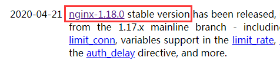
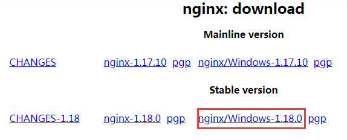

#  nginx

* **`nginx`用于部署项目**

##  基础介绍

主机-----> 操作系统（windows/linux）----->tomcat/nginx

* [nginx官网]( http://nginx.org/ )

* [国内镜像下载地址]( http://mirrors.sohu.com/nginx/ )

* naginx版本
  *  mainline version ：主力版本，开发版
  *  stable version ：最稳定的版本，生产环境上建议使用的版本
  * legacy versions： 遗留老版本的稳定版
  
* 下载
  
  * 选择stable version
  
  
  
  * 选择windows
  
  


* 关于nginx的cmd终端命令
  * `nginx -s stop`:中断运行
  * `nginx -s quit`:正常退出运行
  * `nginx -s reload` : 重启niginx


##   本地部署

###  方式一：

* 双击nginx-1.18.0文件夹下nginx.exe文件  启动运行
* 网址输入localhost     页面显示welcome nginx则启动成功
* 删除nginx-1.18.0\html文件夹下的文件
* **将需要部署的项目的dist文件夹下的所有文件及文件夹复制到nginx-1.18.0\html文件夹下**
* 网址再次输入localhost 则可查看部署项目了

###  方式二：

* 双击nginx-1.18.0文件夹下nginx.exe文件  启动运行
* 网址输入localhost     页面显示welcome nginx则启动成功
* **将需要部署的项目的dist文件夹复制到nginx-1.18.0文件夹下**
* **修改nginx-1.18.0\conf\nginx.conf文件**

```
//修改前
location / {
    root   html;
    index  index.html index.htm;
}

//修改后
location / {
    root   dist;
    index  index.html index.htm;
}
```


##  远程部署

