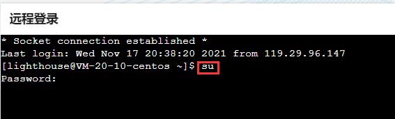

#  nginx

* **`nginx`用于部署项目**

##  一、基础介绍

主机-----> 操作系统（windows/linux）----->tomcat/nginx

###  1.1 nginx基本概念

* Nginx 是高性能的 HTTP 和反向代理的服务器，处理高并发能力是十分强大的， 能经受高负载的考验 有报告表明能支持高达 50,000 个并发连接数。

* Nginx支持热部署。它的启动特别容易, 并且几乎可以做到7*24不间断运行，即使运行数个月也不需要重新启动。你还能够在不间断服务的情况下，对软件版本进行进行升级。

###  1.2 在windows上安装nginx及使用

####  1.2.1 安装

* [nginx官网]( http://nginx.org/ )

* [国内镜像下载地址]( http://mirrors.sohu.com/nginx/ )

* naginx版本
  *  mainline version ：主力版本，开发版
  *  stable version ：最稳定的版本，生产环境上建议使用的版本
  * legacy versions： 遗留老版本的稳定版
  
* 下载
  
  * 选择stable version  或者   点击官网右栏download
  
  
  
  
  
  
  
  * 选择windows
  
  

####  1.2.2  使用

* 下载的时zip文件，解压后，进入解压的文件夹，双击nginx.exe即可启动nginx

* 关于nginx的cmd终端命令  *cmd终端切换到nginx的根目录下*
  * `nginx.exe`: 启动nginx   或者直接双击nginx.exe文件也可启动nginx
    * 网址输入localhost     页面显示welcome nginx则启动成功
    * 每次配置文件修改后都需要重启nginx
  * `nginx -s stop`:中断运行
  * `nginx -s quit`:正常退出运行
  * `nginx -s reload` : 重启niginx


###  1.3 在Linux(CentOS)系统安装nginx及使用

####  1.3.1 安装

#####  1 )终端切换为root用户

* 输入的密码为服务器密码

```
su
```




#####  2)安装依赖

> 在任意目录下执行

* gcc编译是否安装

```
检查安装：yum list installed | grep gcc
执行安装：yum install gcc -y
```

* openssl库编译是否安装

```
检查安装：yum list installed | grep openssl
执行安装：yum install openssl openssl-devel -y
```

* pcre库编译是否安装

```
检查安装：yum list installed | grep pcre
执行安装：yum install pcre pcre-devel -y
```

* zlib库编译是否安装

```
检查安装：yum list installed | grep zlib
执行安装：yum install zlib zlib-devel -y
```

* 一次性安装

```
一次性安装: yum install gcc openssl openssl-devel pcre pcre-devel zlib zlib-devel -y
```

( -y 代表自动安装 ， 自动选择 Y)

#####  3)下载nginx

* 再切换到/usr/loacl目录下下载Nginx


```
cd  /usr/local
```

* 下载

```
wget http://nginx.org/download/nginx-1.18.0.tar.gz
```

* 解压
  * 解压后的文件名为：nginx-1.18.0， 该文件就在/usr/local下

```
tar -zxvf nginx-1.18.0.tar.gz
```

#####  4)安装nginx

* 打开nginx解压后路径, 即切换到nginx-1.18.0目录下

```
 cd nginx-1.18.0
```

* 指定安装路径 (–prefix 是指定nginx安装路径)， 在终端执行如下2条命令完成安装
  * 安装完成后会在/usr/local目录下生成nginx文件夹

```
./configure --prefix=/usr/local/nginx
make && make install
```

####  1.3.2 使用(nginx常用命令)

> **注意：执行以下命令时，终端先切换到/usr/local/nginx/sbin目录下**

##### 启动nginx

* 切换到/usr/local/nginx/sbin文件夹下

```
./nginx
```

* 或者切换到/usr/local/nginx文件夹下

```
./sbin/nginx
```

* 或者按配置文件启动

```
/usr/local/nginx/sbin/nginx -c /usr/local/conf/nginx.conf
```

#####  检测nginx是否启动

```
ps -ef | grep nginx
```

* 若启动成功终端如下


#####  重新加载nginx

* 例如修改了nginx.conf后则需要重新加载才能更新修改的配置

```
./nginx -s reload
```

#####  关闭nginx

```
./nginx -s stop
```


####  1.3.3 防火墙问题

> 若是在windows的虚拟机的linux(CentOS)系统安装的nginx, 则启动nginx后不能在浏览器正常访问，需要开放防火墙对80端口的限制

* 查看f防火墙开放的端口号

```
firewall-cmd --list-all
```

* 设置开放的端口号

```
firewall-cmd --add-port=80/tcp --permanent
```

* 重启防火墙
  * 重启后才能看到80/tcp开放成功了

```
firewall-cmd --reload
```


* 终端出现如下提示，则是防火墙没有开启


* 开启，关闭及查看防火墙状态命令
  * 开启防火墙：systemctl start firewalld
  * 关闭防火墙：systemctl stop firewalld
  * 查看防火墙状态：systemctl status firewalld
* 移除端口
  * 移除后，也需要重启防火强才能看到移除了

```
firewall-cmd --remove-port=80/tcp --permanent
```


###  1.4  Nginx的配置文件

> [`nginx.conf`文件解析](https://www.cnblogs.com/paulwhw/articles/11116363.html)
>
> * 配置文件的位置
>
> ```
> linux下：/usr/loacal/nginx/conf/nginx.conf
> wIndows下： 解压的nginx文件夹/conf/nginx.conf
> ```

**配置文件的内容 :**

1)全局块：配置服务器整体运行的配置指令

* 从配置文件开始到 events 块之间的内容，主要会设置一些影响nginx 服务器整体运行的配置指令，主要包括配置运行 Nginx 服务器的用户（组）、允许生成的 worker process 数，进程 PID 存放路径、日志存放路径和类型以及配置文件的引入等。
* 例如：worker_processes 
  * 这是 Nginx 服务器并发处理服务的关键配置，worker_processes 值越大，可以支持的并发处理量也越多，但是会受到硬件、软件等设备的制约，建议设置为等于CPU总核心数

2)events 块 ：影响 Nginx 服务器与用户的网络连接

* events 块涉及的指令主要影响 Nginx 服务器与用户的网络连接，常用的设置包括是否开启对多 work process 下的网络连接进行序列化，是否允许同时接收多个网络连接，选取哪种事件驱动模型来处理连接请求，每个 word process 可以同时支持的最大连接数等。

3)http 块

* 这算是 Nginx 服务器配置中最频繁的部分，代理、缓存和日志定义等绝大多数功能和第三方模块的配置都在这里。
* http 块也可以包括 http全局块、server 块。

3.1)http 全局块

* http全局块配置的指令包括文件引入、MIME-TYPE 定义、日志自定义、连接超时时间、单链接请求数上限等。

3.2)server 块

* 这块和虚拟主机有密切关系，虚拟主机从用户角度看，和一台独立的硬件主机是完全一样的，该技术的产生是为了节省互联网服务器硬件成本。
* 每个 http 块可以包括多个 server 块，而每个 server 块就相当于一个虚拟主机。
* 而每个 server 块也分为全局 server 块，以及可以同时包含多个 locaton 块。

3.2.1)全局 server 块

* 最常见的配置是本虚拟机主机的监听配置和本虚拟主机的名称或IP配置。

3.2.2)location 块

* 一个 server 块可以配置多个 location 块。
* 这块的主要作用是基于 Nginx 服务器接收到的请求字符串（例如 server_name/uri-string），对虚拟主机名称（也可以是IP别名）之外的字符串（例如 前面的 /uri-string）进行匹配，对特定的请求进行处理。地址定向、数据缓存和应答控制等功能，还有许多第三方模块的配置也在这里进行。

**`nginx.conf`文件**

```json

#user  nobody;
worker_processes  1;
#worker_processes数值越大并发能力越强  处理并发数的配置 

#error_log  logs/error.log;
#error_log  logs/error.log  notice;
#error_log  logs/error.log  info;
#错误存放的地址

#pid        logs/nginx.pid;

#以上为全局快


events {
    worker_connections  1024;
}

#以上为events块
#worker_connections数值越大并发能力越强   支持的最大连接数


http {
    include       mime.types;
    default_type  application/octet-stream;

    #log_format  main  '$remote_addr - $remote_user [$time_local] "$request" '
    #                  '$status $body_bytes_sent "$http_referer" '
    #                  '"$http_user_agent" "$http_x_forwarded_for"';

    #access_log  logs/access.log  main;

    sendfile        on;
    #tcp_nopush     on;

    #keepalive_timeout  0;
    keepalive_timeout  65;

    #gzip  on;

    #include     servers/*.conf;
    server {
      listen       80; 
      server_name  test.com;

      location / {
        proxy_pass http://127.0.0.1:8888;
        proxy_set_header Host $host;
      }
    }

    server {
        listen       80;
        server_name  localhost;

        #charset koi8-r;

        #access_log  logs/host.access.log  main;

        location / {
            root   html;
            index  index.html index.htm;
        }
		#以上为location块
		#root: 将接收的请求根据html路径去查找静态资源
		#index: 默认去上述中找到index.html或index.htm 以响应用户
    }
	#以上是server块
	#listen： nginx监听的端口
	#server_name: nginx接收的ip地址或域名
}
#以上为http块
#include 表示从外部引入文件


    # another virtual host using mix of IP-, name-, and port-based configuration
    #
    #server {
    #    listen       8000;
    #    listen       somename:8080;
    #    server_name  somename  alias  another.alias;

    #    location / {
    #        root   html;
    #        index  index.html index.htm;
    #    }
    #}


    # HTTPS server
    #
    #server {
    #    listen       443 ssl;
    #    server_name  localhost;

    #    ssl_certificate      cert.pem;
    #    ssl_certificate_key  cert.key;

    #    ssl_session_cache    shared:SSL:1m;
    #    ssl_session_timeout  5m;

    #    ssl_ciphers  HIGH:!aNULL:!MD5;
    #    ssl_prefer_server_ciphers  on;

    #    location / {
    #        root   html;
    #        index  index.html index.htm;
    #    }
    #}


```


##  二、Nginx的反向代理

###  2.1 正向代理与反向代理

**正向代理**

1. 正向代理是由客户端设立的
2. 客户端了解代理服务器和目标服务器都是谁
3. 帮助实现突破访问权限，提高访问的速度，对目标服务器隐藏客户端的ip地址


**反向代理**

1. 反向代理服务器是配置在服务端的
2. 客户端是不知道具体访问的是哪台服务器
3. 达到负载均衡，并且可以隐藏服务器真正的ip地址


###   2.2 反向代理配置

* 按`nginx-1.18.0\conf`打开`nginx.conf`文件

  * 添加`include servers/*.conf`
    * 注意添加的位置，在`server`上面
    * `include servers/*.conf;`： 导入当前文件所在文件夹下的文件夹servers下的所有.conf文件
    * servers文件夹和文件夹下的文件都是自定义的，是自定义的配置文件

  

* `servers/test.conf`代理配置

  * 新建`nginx-1.18.0\conf、servers、test.conf`文件

  ```js
  //test.conf
  server {                            //server表示nginx启动的本地服务
    listen       80;                  //80 是nginx本地服务的端口号
    server_name  localhost;            //localhost  是nginx本地服务的域名地址
  
    location / {
      proxy_pass http://127.0.0.1:8888/;   //nginx代理的地址访问localhost即会跳转到这个地址
      proxy_set_header Host $host;        //host延用localhost而不是http://127.0.0.1:8888的host
    }
  }
  ```

* 也可直接将`test.cong`文件的内容加在`nginx.conf`文件中，效果是一样的，只是这样分离更方便管理不同的配置

  * 添加在`nginx.conf`中`server`配置的地方

###  2.3 location路径映射

**理解`\`**

* location后面的`“/”`指的是上面`server_name  localhost;`的`localhost`

```json
server {                            
  listen       80;                  
  server_name  localhost;            

  location / {
    proxy_pass http://127.0.0.1:8888/;  
    proxy_set_header Host $host;       
  }
}
```

**location匹配方式**

```json
# 1. = 匹配
location = / {
	#精准匹配，主机名后面不带任何的字符串
} 
#假如server_name是localhost  则只能精准匹配localhost   而localhost/xxx则不能匹配  因为多了/xxx

location / {
	#只要有/即可匹配
} 
#假如server_name是localhost  则只要有localhost即可匹配   localhost和localhost/xxx等都可匹配
```

---

```json
# 2. 通用匹配
location /xxx {
	#匹配所有以/xxx开头的路径
} 
```

----

```json
# 3. 正则匹配
location ~/xxx{
	#匹配所有以/xxx开头的路径   与通用匹配一样  只是优先级高
}
```

---

```json
# 4. 匹配开头路径
location ^~/xxx{
	#匹配所有以/xxx开头的路径   与通用匹配、正则匹配一样  只是优先级高于另外两个
}
```

---

```json
# 5. 匹配结尾
location ~*\.(gif|jpg|png)${
	#匹配以gif|jpg|png结尾的路径
}
```

**location匹配优先级**

```json
(location = ) > (location /xxx/yyy/xxx) > (location^~) > (location ~ , ~*) > (location/起始路径) > (location/)
                                                                                                
=匹配 > 完全匹配 > 开头匹配 > 正则匹配和结尾匹配 > 通用匹配(只有起始路径，匹配不全) > 通用匹配(只有根路径匹配)
```

* 完全匹配： 目标路径是localhost/xxx/yyy/xxx  匹配路径也是localhost/xxx/yyy/xxx   完全一致
* 一般匹配从上面的优先级的后面往前匹配**直到`(location^~)`为止，所以写配置文件的时候按上面的优先级顺序写**


##  三、Nginx的负载均衡


##  四、Nginx的动静分离


##  五、Nginx集群

##   六、部署

###  6.1 本地部署

#### 6.1.1 方式一：

* 双击nginx-1.18.0文件夹下nginx.exe文件  启动运行
* 网址输入localhost     页面显示welcome nginx则启动成功
* 删除nginx-1.18.0\html文件夹下的文件
* **将需要部署的项目的dist文件夹下的所有文件及文件夹复制到nginx-1.18.0\html文件夹下**
* 网址再次输入localhost 则可查看部署项目了

#### 6.1.2 方式二：

* 双击nginx-1.18.0文件夹下nginx.exe文件  启动运行
* 网址输入localhost     页面显示welcome nginx则启动成功
* **将需要部署的项目的dist文件夹复制到nginx-1.18.0文件夹下**
* **修改nginx-1.18.0\conf\nginx.conf文件**

```
//修改前
location / {
    root   html;
    index  index.html index.htm;
}

//修改后
location / {
    root   dist;
    index  index.html index.htm;
}
```

###  6.2远程部署

####  6.2.1 部署流程

* 前置步骤：
  * 1 购买云服务器，Linux
  * 2 购买域名、备案、解析域名与ip匹配
* 安装软件，在云服务器上
  * mysql
  * node
  * xampp
  * nginx
* nginx配置转发
  * nginx端口设置为80
  * 在云服务器上可以开启多个服务
  * nginx根据域名转发到对应的云服务器上的服务
    * ------------- *此处可查看上文：2.3location路径映射*---------------
    * 例如：chu.com  转发到  云服务商开启的localhost:3000服务
    * 例如：ckie.com  转发到  云服务商开启的localhost:4000服务
* 启动服务（node环境）
  * 不能直接在终端启动服务，因为终端关闭后，服务也关闭了
  * 开启**守护进程**即终端关闭后，服务仍然运行
    * 使用**pm2**---->[pm2官网文档](https://pm2.keymetrics.io/)
      * 安装：`npm install pm2 -g`
      * 启动： `pm2 start app.js`
      * 查看：`pm2 list`
      * 停止：`pm2 stop app`

* tips
  * 免费的https: lets encrypt