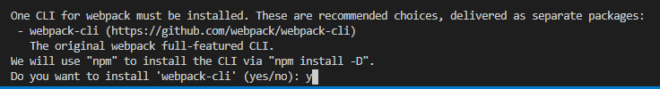

#  webpack

#  一、webpack

##   1 与grunt/gulp对比

* `webpack`是一个现代的JavaScript应用的静态**模块打包工具。**
  * `webpack`的核心是：**模块化** 和 **打包**
  * 文件压缩合并、预处理等功能只是`webpack`的附带功能
  * *使用场景：*整个项目使用了模块化管理，而且相互依赖非常强

* `grunt/gulp`被称为**前端自动化任务管理工具**
  * `grunt/gulp`的核心是：**Task**
  * 通过配置一系列的task，并且定义task要处理的事务（例如ES6、ts转化，图片压缩，scss转成css）
    之后让grunt/gulp来依次执行这些task，而且让整个流程自动化。
  * *使用场景：*项目的工程模块依赖非常简单或没有用到模块化的概念，只需要进行简单的合并、压缩。

##  2 webpack官网及安装

* **[webpack官网]( https://www.webpackjs.com/ )**

* webpack安装
  * 安装前提：先安装`Node.js`

  * 全局安装

    * 在终端直接执行webpack命令，使用的全局安装的webpack
    * `npm install webpack@版本号 -g`

  * 局部安装 ----    *切换到项目根目录下*

    * 当在package.json中定义了scripts时，其中包含了webpack命令，此时使用的是局部webpack

```js
npm insatll webpack@版本号 --save-dev
```


##  3 webpack起步

####  3.1 构建目录

* dist (用于存放之后打包的文件)
* src (用于存放自己写的源文件)
  * main.js (项目入口文件)
* index.html（浏览器打开展示的首页html）
* package.json（npm包管理的文件，通过终端npm init生成的，此文件不是手动创建）

####  3.2  打包js文件

* 以`main.js`为入口文件，以递归的方式将`main.js`引用的模块（js文件），模块中引用的模块统一打包到指定文件夹下的一个或多个包中（一般指定：dist/bundle.js）

* 命令

```js
webpack 源文件路径  打包后文件路径
webpack ./src/main.js ./dist/bundle.js
```

####  3.3 使用打包后的文件

* 在`./index.html`中引入打包的`bundle.js`

```html
// ./index.html
<body>
  <script src="./dist/bundle.js"></script>
</body>
```

* 引入后直接在浏览器中就运行index.html了

##  4 优化js打包操作

* 优化`webpack ./src/main.js ./dist/bundle.js`每次执行都要输入文件路径的操作

####  4.1 配置入口和出口

* 项目根目录下创建`webpack.config.js`文件

  * `path`相关操作是`node.js`中读取文件路径的语法

```js
//webpack.config.js
const path = require('path')

module.exports = {
//入口：可以是字符串、数组、对象，这里只有一个入口，写字符串即可
entry:'./src/main.js',
//出口: path:打包文件保存路径  filename:打包的文件名
output:{
    path: path.resolve(__dirname,'dist'),
    filename: 'bundle.js'
}
}
```

####  4.2 局部（本地）安装webpack

* 安装命令

```js
npm install webpack@版本号 --save-dev
```

* 通过node_modules/.bin/webpack启动webpack打包  ---- *此时使用的是局部的webpack* 

  * 注意：路径是反斜杠

```js
终端命令
.\node_modules\.bin\webpack
```

####  4.3 package.json中定义打包启动

```js
//package.js
  "scripts": {
    "build": "webpack"
  },
```

* 配置完成后执行如下命令即可打包文件了

```js
npm run build
```

  

**注意：**

* 最新版webpack在执行4.2 、4.3中的命令时还有如提示:



* 选择安装`webpack-cli`  安装后即可命令打包了


#  二、loader

##  1 loader介绍

####   1.1 webpack与loader

* `webpack`主要用于打包js文件，可以自动处理js之间相关的依赖
* `loader`用于执行将ES6转成ES5代码，将TypeScript转成ES5代码，将scss、less转成css，将.jsx、.vue文件转成js文件、加载图片等操作

####  1.2 loader使用流程

* **[webpack-loader官网]( https://www.webpackjs.com/loaders/ )**

1. 通过npm安装需要使用的loader
2. 在webpack.config.js中的module关键字下进行配置


##  2 css文件处理

1. 在src/css文件夹下创建css文件

```css
//src/css/normal.css
body{
   baackground-red
}
```

2. 在入口文件`main.js`文件中引入 css文件

```js
require('./css/normal.css')
```

3. **安装`css-loader`**

```js
npm install --save-dev css-loader
```

4. **安装`style-loader`**

```js
npm install style-loader --save-dev
```

5. **配置`css-loader`和`style-loader`**

```js
 module: {
   rules: [
     {
       test: /\.css$/,
       use: [ 'style-loader', 'css-loader' ]
     }
   ]
 }
```

**注意：**

* 压缩css文件时需要同时安装`css-loader`和`style-loader`

  * `css-loader`用于加载css文件
  * `style-loader用于`将css具体样式嵌入到文档中

* 注意配置循序一定是`style-loader`在前，`css-loader`在后

  * webpack在读取使用的loader的过程中，是按照从右向左的顺序读取的。

```js
use: [ 'style-loader', 'css-loader' ]
```


##  3 less文件处理

1. 在src/css文件夹下创建less文件

```css
//src/css/special.less
@fontSize: 50px;
@fontColor: red;

body {
 color: @fontColor;
 font-size: @fontSize;
}
```

2. 在入口文件`main.js`文件中引入 less文件

```js
require('./css/special.less')
```

3. **安装`css-loader`**

```js
npm install --save-dev css-loader
```

4. **安装`style-loader`**

```js
npm install style-loader --save-dev
```

5. **安装`less-loader`**

```js
npm install --save-dev less-loader less
```

6. 配置`css-loader`、`style-loader`、`less-loader`

```js
module: {
       rules: [{
           test: /\.less$/,
           use: [{
               loader: "style-loader" // creates style nodes from JS strings
           }, {
               loader: "css-loader" // translates CSS into CommonJS
           }, {
               loader: "less-loader" // compiles Less to CSS
           }]
       }]
   }
```

**注意：**

* 压缩less文件时需要同时安装`css-loader`、`style-loader`、`less-loader`

  * `css-loader`用于加载css文件
  * `style-loader用于`将css具体样式嵌入到文档中
  * `less-loader`用于将less转成css

* 注意配置循序一定是`style-loader`，`css-loader`、`less-loader`

  * webpack在读取使用的loader的过程中，是按照从右向左的顺序读取的。

```js
use: [ 'style-loader', 'css-loader', 'less-loader' ]
```

##  4 图片处理

1. 安装`url-loader`

```js
npm install --save-dev url-loader
```

2. 安装`file-loader`

```js
npm install --save-dev file-loader
```

3. 配置

* 出口添加`puplicPath: 'dist/'`
  * 修改源文件中查找图片的路径为`dist/`文件夹下，因为使用`file-loader`打包的图片会存放到`dist`文件夹下
  * 若不做此设置，图片将不能正常显示

* limit：限制文件大小（单位 byte）
  * 当图片小于8kb时，对图片进行base64编码；
  * 当图片大于8kb时，需要使用`file-loader`来压缩图片图片，压缩的图片会默认存储到dist文件夹下
* name: 'img/[name].[hash:8].[ext]'      ------  *img文件夹会创建在dist文件夹下*
  * img/:  文件要打包到的文件夹(此处是统一存放图片的文件夹)
  * [name] : 获取图片原来的名字, 不用传值， webpack会自动识别原来的文件名
  * [hash:8] : 为了防止图片名称冲突，使用hash，保留8位
  * [ext]： 使用图片原来的扩展名

```js
module: {
    output:{
      path: path.resolve(__dirname,'dist'),
      filename: 'bundle.js',
      publicPath: 'dist/'        //出口添加puplicPath: 'dist/'
    },
    rules: [
      {
        test: /\.(png|jpg|gif)$/,
        use: [
          {
            loader: 'url-loader',
            options: {
              limit: 8192，
              name: 'img/[name].[hash:8].[ext]'
            }
          }
        ]
      }
    ]
}
```

##  6 ES6转ES5

1. 安装`bable-loader`

   * 除了安装`babel-loader`还需要安装`babel-core`和`babel-preset-****`
     * `babel-preset-es2015` : 指转ES6（es2015就是ES6） ---  *简单写法  不需要再配置babel*
     * `babel-preset-env`： 也是转ES6  -----  *需要再做babel相配置*

```js
//方式1
npm install babel-loader@7 babel-core babel-preset-es2015  --save-dev

npm install babel-loader babel-core babel-preset-env   --save-dev
```

2. 配置

```js
module: {
 rules: [
   {
     test: /\.js$/,
     exclude: /(node_modules|bower_components)/,   //声明不做转换的文件夹
     use: {
       loader: 'babel-loader',
       options: {
         presets: ['es2015']             //对应安装方式1
         presets: ['@babel/preset-env']  //对应安装方式2
       }
     }
   }
 ]
}
```


#  三、webpack配置Vue

##   1 使用vue流程

1. 安装vue

```js
npm install vue --save
```

2. 配置

   * 因为使用的是`runtime-only`版本，所以需要在webpack.config.js中做如下配置

```js
resolve: {
   alias: {
     'vue$': 'vue/dist/vue.esm.js'
   }
}
```

3. 使用vue

   * 3.1 vue基础用法

```js
//main.js

import Vue from 'vue'
new Vue({
 el: '#app',
 data: {
   name: 'Chuckie'
 }
})
```

```html
//index.html

<body>
 <div id="app">
   <h2>{{name}}</h2>
 </div>

 <script src="./dist/bundle.js"></script>
</body>
```

   * 3.2 vue组件化开发用法

```js
//main.js

import Vue from 'vue'
const App = {
 template: `<h2>{{message}}</h2>`,
 data(){
   return {
     message: '我是APP组件'
   }
 }
}

new Vue({
 el: '#app',
 template: `            //template会直接替换index.html中<div id="app"></div>包裹的内容
 <div id="app"> 
   <h2>{{fname}}</h2>
   <c-cpn/>
 </div>
 `,
 data: {
   fname: 'Chuckie'
 },
 components: {
   'c-cpn' : App
 }
})
```

```html
//index.html

<body>
<div id="app">
</div>
<script src="./dist/bundle.js"></script>
</body>
```

   * 3.3 `.vue`文件封装处理

     * 使用`.vue`文件需要做如下安装和配置

       * 安装
```js
npm install vue-loader vue-template-compiler --save-dev
```
       * 配置

```js
//webpack.config.js
module: {
 rules: [
  {
     test: /\.vue$/,
     use: ['vue-loader']
   }
 ]
}
```

       * BUG处理
         * 问题：` Vue-loader`在15.*之后的版本 vue-loader的使用都是需要伴有 `VueLoaderPlugin `
         * 解决： webpack.config.js中做如下配置

```js
const VueLoaderPlugin = require('vue-loader/lib/plugin');
module.exports = {
 plugins: [
     // make sure to include the plugin for the magic
     new VueLoaderPlugin()
 ]
}
```


     * 使用：

```js
   //srv/vue/App.vue
   
   <template>
     <div>
       <h2 class="title">{{message}}</h2>
     </div>
   </template>
   
   <script>
     export default {
    name: 'App',
       data(){
           return {
             message: '我是.vue文件封装的APP组件',
           }
         }
     }
   </script>
   
   <style scoped>
     .title{
       color: green;
     }
   </style>
```

```js
   //main.js
   
   import Vue from 'vue'
   import App from './vue/App.vue'
   
   new Vue({
     el: '#app',
     template: '<App/>',
     comments: {
       App
     }
   })
```

```html
   //index.html
   
   <body>
     <div id="app">
     </div>
     <script src="./dist/bundle.js"></script>
   </body>
```

##   2 el和template的区别

* `el`: 用于和index.html中的#app进行绑定，让Vue实例之后可以管理它其中的内容
* `template`: template模板的内容会替换掉挂载的对应el的模板。
* 用`template`覆盖`el`之后就不需要在开发中再次操作index.html，只需要在template中写入对应的标签即可


```js
//main.js

import Vue from 'vue'
import App from './vue/App.vue'

new Vue({
  el: '#app',
  template: '<App/>',
  comments: {
    App
  }
})
```

```html
//index.html

<body>
  <div id="app">
  </div>
  <script src="./dist/bundle.js"></script>
</body>
```


#  四、plugin

##  1 plugin介绍

####   1.1 plugin与loader

* `plugin`是插件，它是对webpack现有功能的各种扩展，比如打包优化，文件压缩等等，是一个扩展器。
* `loader`主要用于转换某些类型的模块，它是一个转换器。

####   1.2 plugin的使用流程

1. 通过npm安装需要使用的plugins(某些webpack已经内置的插件不需要安装)
2. 在webpack.config.js中的plugins中配置插件。


##  2 添加版权的plugin

* `BannerPlugin`插件 ，该插件属于webpack自带的插件（不需要安装），用于为打包的文件添加版权声明。

* 配置webpack.config.js

```js
  //webpack.config.js
  const webpack = require('webpack')
  
  module.export = {
      plugins: [
          new webpack.BannerPlugin('最终版权归Chuckie所有')
        ]
  }
```

* 效果： 在`bundle.js`文件开头会添加`最终版权归Chuckie所有`的声明

##  3 打包html的plugin

* 目前的index.html文件是存放在项目的根目录下的。
  * 在真实发布项目时，发布的是dist文件夹中的内容，但是dist文件夹中如果没有index.html文件，那么打包的js等文件也就不能起效果
  * 所以，需要将index.html文件打包到dist文件夹中，这个时候就可以使用`HtmlWebpackPlugin`插件

* `HtmlWebpackPlugin`插件的功能：

  * 自动生成一个index.html文件(可以指定模板来生成)
  * 将打包的js文件，自动通过script标签插入到body中

* 安装`HtmlWebpackPlugin`插件

```js
  npm install html-webpack-plugin --save-dev
```

* 使用插件，修改webpack.config.js文件中plugins部分

  * 这里的template表示根据什么模板来生成index.html
  * fielname是在dist文件夹中生成的文件名
* 需要**删除之前在output中添加的publicPath属性**,否则插入的script标签中的src可能会有问题
  
```js
  //webpack.config.js
  const HtmlWebpackPlugin = require('html-webpack-plugin')
  
  module.exports = {
    plugins: [
      new HtmlWebpackPlugin({
        template: './src/index.html',
        filename: 'index.html'
      })
    ]
  }
  
  
```


##  4 js压缩的Plugin

* 安装

```js
  npm install uglifyjs-webpack-plugin --save-dev
```

* 配置

```js
const uglifyJsPlugin = require('uglifyjs-webpack-plugin') 
plugins: [
  new uglifyJsPlugin()
]
```

  

#  五、本地服务器

##  1 搭建本地服务器

* webpack提供了一个可选的本地开发服务器，这个本地服务器基于node.js搭建，内部使用express框架，可以实现浏览器自动刷新显示我们修改后的结果。

* 安装

```js
npm install --save-dev webpack-dev-server@版本号
```

* webpack.config.js中配置` devServer`

  * contentBase：为哪一个文件夹提供本地服务，默认是根文件夹，一般指定./dist
  * port：端口号
  * inline：页面实时刷新
  * historyApiFallback：在SPA页面中，依赖HTML5的history模式

```js
devServer: {
  contentBase: './dist',
  inline: true,
  port:3000
}
```

* package.js中配置`scripts`

  * 该配置是设置启动本地服务器的命令

  * `--open`: 表示直接打开浏览器

```js
 "scripts": {
    "dev": "webpack-dev-server --open"
  },
```

* 启动本地服务器

```js
终端：npm run dev
```


##  2 webpack配置分离

* 对`webpack.config.js`配置的分离

* webpack配置分离的原因：开发时配置和发布时配置不同 所以需要分离以便发布时依赖准确清晰

1. 项目根目录下新建`build`文件夹 文件夹下新建3个配置文件：

   * `base.config.js`: webpack基本配置（开发时和发布时都使用的配置）
   * `dev.config.js`: 开发时需要的webpack配置
   * `prod.config.js`: 发布时需要的webpack配置

2. 安装合并插件

```js
npm install webpack-merge --save-dev
```

3. 使用`webpack-merge`

   * `dev.config.js`中配置
```js
     const webpackMerge = require('webpack-merge')  //导入合并插件
     const baseConfig = require('./base.config')   //导入基础配置
     
     module.exports = webpackMerge(baseConfig, {   //合并
       devServer: {
         contentBase: './dist',
         inline: true
       }
     })
```

   * `prod.config.js`中配置

```js
     // const uglifyJsPlugin = require('uglifyjs-webpack-plugin')
     const webpackMerge = require('webpack-merge')
     const baseConfig = require('./base.config')
     
     module.exports = webpackMerge(baseConfig, {
       plugins: [
         // new uglifyJsPlugin()
       ],
     })
```

4. 删除之前的配置文件：`webpack.config.js`

5. 更改`config.js`中的配置

   * 默认情况下配置文件是：`webpack.config.js`

   * `--config`: 重定向配置文件的位置

```js
   "scripts": {
       "build": "webpack --config ./build/prod.config.js",    //指定配置文件位置
       "dev": "webpack-dev-server --open  --config ./build/dev.config.js"//指定配置文件位置
     },
```

6. 更改打包文件保存的路径

```js
   module.exports = {
     //出口: path:打包文件保存路径  filename:打包的文件名
     output:{
         path: path.resolve(__dirname,'dist'),
         filename: 'bundle.js'
     },
```

   * 生成dist文件的路径有变化   __dirname拿到的是prod.config.js所在的路径 
   * 若不更改 dist文件夹将生成在`prod.config.js`所在文件中
   * 更改：使dist文件夹生成在项目根目录下

```js
   module.exports = {
     //出口: path:打包文件保存路径  filename:打包的文件名
     output:{
         path: path.resolve(__dirname,'../dist'),    //'../dist'
         filename: 'bundle.js'
     },
```

   

