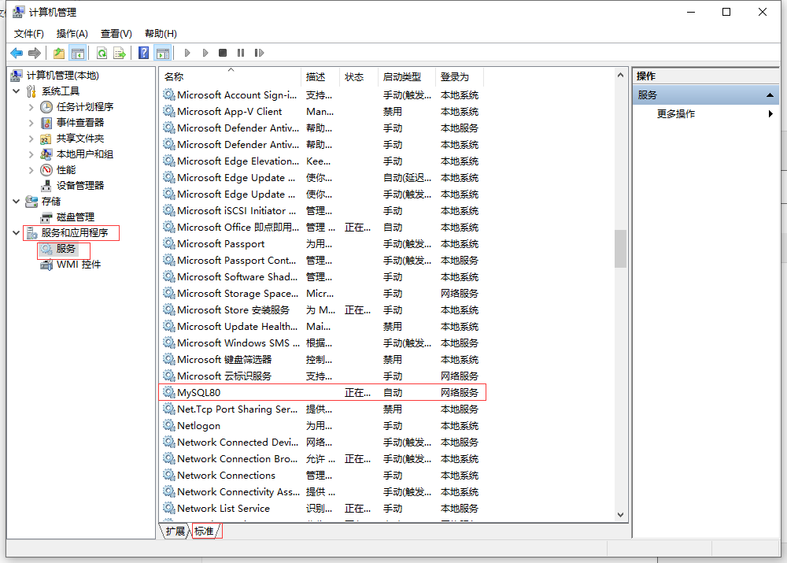

#  MySQL

##  一、简介

###  1.1 数据库分类

* 关系型数据库
  * MySQL 
  * Oracle
  * PostgresSQL
  * Access
* 非关系性数据库
  * Redis
    * 主要用于缓存，不能持久化
    * 以键值对的形式存储
  * MongoDB   
    * 可以持久化
    * 以js对象的形式存储

###  1.2 环境搭建

#### 1.2.1 安装MySQL

> [安装教程](https://www.runoob.com/w3cnote/windows10-mysql-installer.html)
>
> [视频安装教程](https://www.bilibili.com/video/BV1Vy4y1z7EX?p=3&vd_source=7230a052308bbb41976f248d2c778e3a)


####  1.2.2 安装XAMPP

> XAMPP是一个集成环境，其中包括了MySQL， 可以免去MySQL的安装过程
>
> [XAMPP官网](https://www.apachefriends.org/index.html)

**使用：**

* 在电脑开始中找到XAMPP
* 打开后点击，MySQL的Start即开启了数据库


####  1.2.3 安装navicat

> navicat是一个数据库可视化工具
>
> [navicat官网](http://www.navicat.com.cn/products#navicat)    ---  选择for MySQL
>
> [navicat下载地址](http://www.navicat.com.cn/download/navicat-for-mysql)

**使用：**

* 第一次使用，选择“连接”->"MySQL"或者“MariaDB”


* 第一次建立连接，不用输入密码

  * 连接名自定义
  * 主机、端口、用户名保持默认

  

  * 创建数据库
  
    

##  二、使用

> [MySQL菜鸟教程](https://www.runoob.com/mysql/mysql-tutorial.html)

###  1 基本使用教程

**查看MySQL服务**

* 计算机右键-->管理--->服务和应用程序--->双击服务--->标准--->找到MySQL

* 正常情况是正在运行和启动状态

* 右键MySQL80--->属性--->可以修改是否是自动开机即启动



**cmd终端开启或者关闭MySQL服务**（管理员模式）

```
net stop MySQL80(服务名)
net start MySQL80(服务名)
```

**登录MySQL**

* bin目录下mysql.exe链接mysql数据库服务器 

* cmd本地登录(可以非管理员)
  * -u跟用户名   -p跟密码

```c++
// 显示密码登录
mysql -uroot -p123456
// 隐式密码登录
mysql -uroot -p  回车再输入密码
```

* cmd终端报错

> [‘mysql‘ 不是内部或外部命令，也不是可运行的程序 或批处理文件，超详细解决步骤](https://blog.csdn.net/qq_42052591/article/details/122381215)

###  2 MySQL常用命令

* 注意命令后面加`;`   英文的分号
* 命令不区分大小写

```
 退出：exit
 显示数据库：show databases;
 使用某个数据库： use world;  // 数据库名：world
 创建数据库： create database test;   //创建名为test的数据库
 显示数据库中的表：show tables;  // 展示的表为上一个use的数据库  use数据库后可以穿插show等命令  再次执行show tables;任然显示前面use的数据库
 导入sql表： source 表的地址  // 本地表的绝对路径   路径中不要有中文   注意： 先use数据库，在导入，表即直接导入到数据库
```


###  3 关于表

* 任何一张表都有行和列:
  * 行row:被称为数据/记录
  * 列column :被称为字段
  * 每一个字段都有:字段名、数据类型、约束等属性
    * 数据类型:字符串，数字,日期等,后期讲
    * 约束:约束有很多,其中一个叫做唯一性的束,这种药束添加之后,该字段中的数据不能重复

###  4 SQL

**SQL分类**

* DQL: 数据查询语言(凡是带有select关键字的都是查询语句)select. . .
* DML: 数据操作语言（凡是对表当中的数据进行增删改的都是DML)
  * insert   delete   update
  * 主要是操作表中的数据data.
* DDL: 数据定义语言(凡是带有create- drop-alter的都是DDL)
  * DDL主要操作的是表的结构。不是表中的数据
    * create:新建,等同于增   增字段
    * drop:删除   删除字段
    * alter:修改  修改字段
    * 增删改和DM不同,这个主要是对表结构进行操作。

* TCL: 事务控制语言包括:
  * 事务提交:commit;
  * 事务回滚: rollback ;
* DCL: 数据控制语言。
  * 授权grant
  * 撤销权限revoke . . ..

**DQL**

```
// 查表中所有数据  全部显示在终端
select * from ttest(表明)
// 查看表的结构  不是表的中的数据
desc ttest   // 会显示表的字段的信息
```

