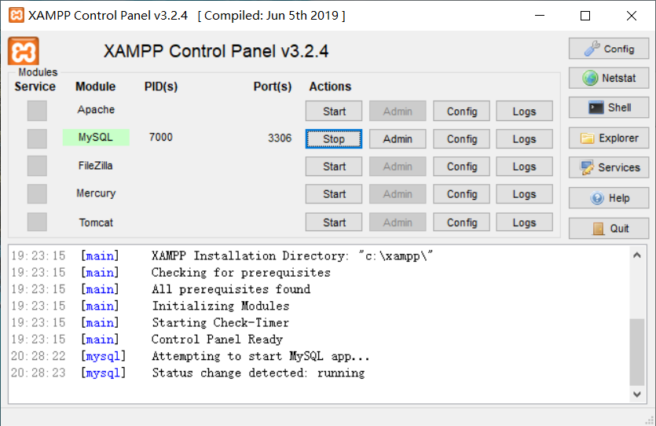
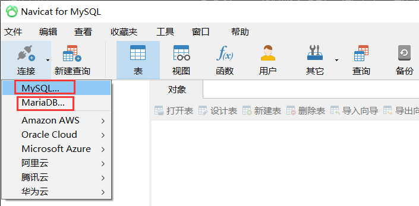
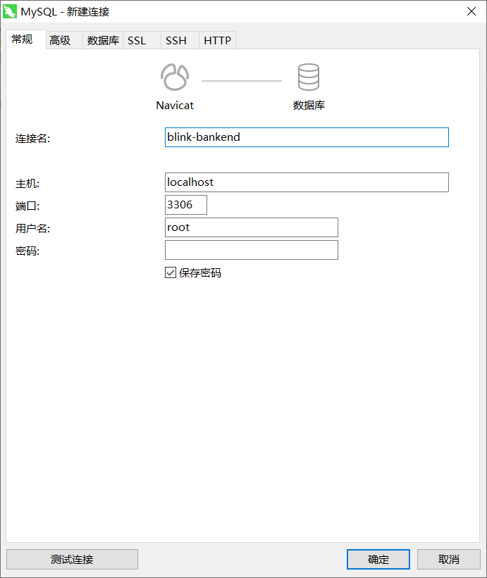
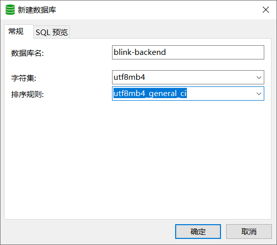

#  MySQL

##  一、简介

###  1.1 数据库分类

* 关系型数据库
  * MySQL 
  * Oracle
  * PostgresSQL
  * Access
* 非关系性数据库
  * Redis
    * 主要用于缓存，不能持久化
    * 以键值对的形式存储
  * MongoDB   
    * 可以持久化
    * 以js对象的形式存储

###  1.2 环境搭建

###  1.2.1 安装MySQL

> [安装教程](https://www.runoob.com/w3cnote/windows10-mysql-installer.html)
>
> [安装详细教程](https://www.runoob.com/mysql/mysql-install.html)

####  1.2.2 安装XAMPP

> XAMPP是一个集成环境，其中包括了MySQL， 可以免去MySQL的安装过程
>
> [XAMPP官网](https://www.apachefriends.org/index.html)

**使用：**

* 在电脑开始中找到XAMPP
* 打开后点击，MySQL的Start即开启了数据库

####  1.2.3 安装navicat

> navicat是一个数据库可视化工具
>
> [navicat官网](http://www.navicat.com.cn/products#navicat)    ---  选择for MySQL
>
> [navicat下载地址](http://www.navicat.com.cn/download/navicat-for-mysql)

**使用：**

* 第一次使用，选择“连接”->"MySQL"或者“MariaDB”

* 第一次建立连接，不用输入密码

  * 连接名自定义
  * 主机、端口、用户名保持默认

  

  * 创建数据库
  
    

