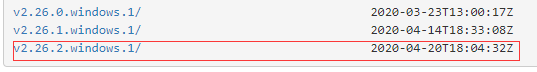
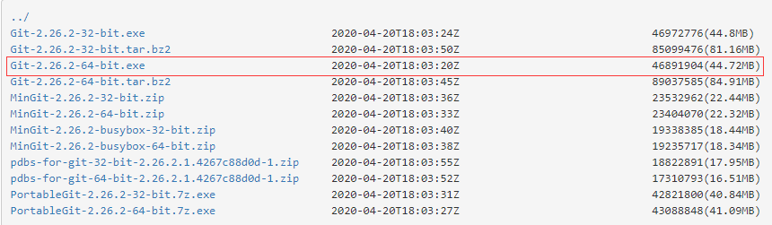
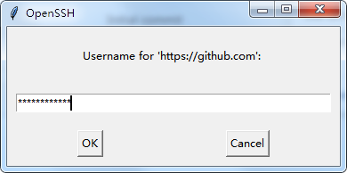
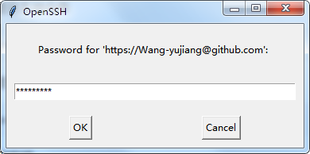
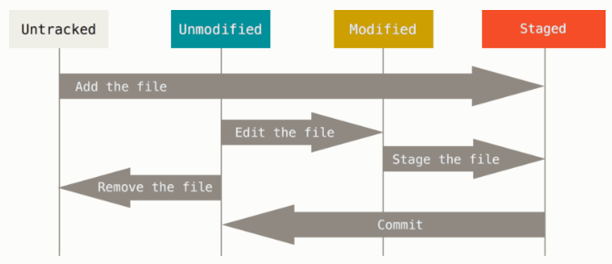
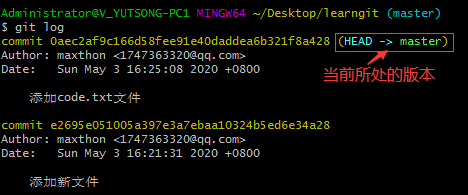
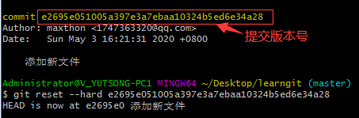
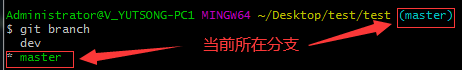

#  前言

> 本文笔记主要参考[Git 官网教程](https://git-scm.com/book/zh/v2/起步-关于版本控制) 做了简化和汇总，对`git`命令做了清晰的分类和解释，更便于快速查询了解 命令用途以解决实际问题。


#  一、Git起步

##  1 Git与GitHub的区别

* Git： Git是一个分布式版本管理系统  --->  一个软件
* GitHub ： GitHub是一个提供Git服务的网站  ---> 一个托管代码的地方

##  2 Git安装

* [官网][ https://git-scm.com/ ]

* [淘宝镜像][ https://npm.taobao.org/mirrors/git-for-windows/ ]
  * 倒序  最下面是最新版本





* 终端检测git下载

  ```
  git
  ```

* 检测安装的版本

  ```js
  git --version
  ```


* git Bash 中查找git安装路径

  ```
  where git
  ```


##  3 使用配置

*  git Bash 可以使用git 命令  
*  但是cmd和vsCode不能使用git 命令 , 需要配置环境变量以解决该问题----->[解决方案](https://blog.csdn.net/weixin_43187345/article/details/87975349)

##  4 获取帮助

* 获取帮助手册

  ```js
  $ git help <verb>
  $ git <verb> --help
  $ man git-<verb>
      
   //<verb>: 要查询的命令
  ```

* 案例： 要查询`add`相关的命令

  ```js
  git help add  OR  git add -h
  
  //-h: help简写
  ```

##  5 全局配置

* 用户名设置

```
//设置用户名  最好与GitHub用户名一致
git config --global user.name 'codewyj'

//查看用户名
git config --global user.name 

//修改用户名
git config --global user.name 'maxthon'
```

* 邮箱地址设置

```
//设置及修改邮箱地址  最好与GitHub邮箱一致
git config --global user.email "1747363320@qq.com"

//查看邮箱地址
git config --global user.email 
```

##  6 权限设置

* 输入远程仓库的用户名和密码  ---- 每次执行git push时会弹出





* 执行如下代码可只需第一次弹出填写即可  后续git push时不会再弹出

  ```
  git config --global credential.helper wincred
  ```

* 删除本地保存的账户

  ```
  git credential-manager uninstall
  ```

  

#  二、Git基础

##  1 创建Git仓库

###  1.1 在本地已存在目录中初始化仓库

*本地目录可以是空目录也可是已经有文件的目录*

**命令：**

```
git init
```

**命令效果：**

*  该命令将在项目根目录中创建一个名为 `.git` 的子目录，这个子目录含有初始化的 Git 仓库中所有的必须文件。
*  该命令只做了一个初始化的操作，项目里的文件还没有被跟踪。  可以通过 `git add` 命令来指定所需的文件来进行追踪，然后执行 `git commit`  提交

###  1.2 克隆现有项目

*可以克隆github上他人和自己的项目到本地创建本地仓库*

**命令1：**

* `<url>`:  github上的仓库地址

```
git clone <url>
```

**命令效果：**

*  这会在当前目录下创建一个与github远程仓库名同名 的目录，并在这个目录下初始化一个 `.git` 文件夹， 从远程仓库拉取下所有数据放入 `.git` 文件夹，然后从中读取最新版本的文件的拷贝。 

**命令2：**

* `<url>`:  github上的仓库地址
* ` <本地自定义仓库名>`:  将克隆下来的仓库重新自定义一个仓库名

```
git clone <url> <本地自定义仓库名>
```

**案例：**

* `<url>`:  https://github.com/libgit2/libgit2
* ` <本地自定义仓库名>`:  mylibgit

```
git clone https://github.com/libgit2/libgit2 mylibgit
```

*  此命令将在本地生成一个名为mylibgit的仓库

*  若没有` <本地自定义仓库名>`,本地创建的仓库名则为libgit2


##  2 Git仓库文件状态管理

###  2.1 Git文件状态

####  2.1.1文件状态概述

 每一个文件有两种状态：**已跟踪** 或 **未跟踪**。 已跟踪的文件是指那些被纳入了版本控制的文件，在上一次快照（`git commit`提交）中有它们的记录，在工作一段时间后， 它们的状态可能是未修改，已修改或已放入暂存区。 

* 未跟踪（Untracked）---------`git add`
* 已跟踪   ----------------------------`git commit`
  * 未修改（Unmodified）
  * 已修改(Modified)
  * 已放入暂存区(Staged)  ---`git add`



####  2.1.2 检查当前文件状态

**命令**

```
git status
```

**执行返回值**

```
Untracked files:    //显示未被跟踪的文件
Changes to be committed:     //显示在暂存区的文件（需要执行git commit提交的文件）
	 new file:   <文件名>       //文件状态：刚被跟踪
	 modified:	 <文件名>       //文件状态：已修改
	 renamed:  <原来文件名> -> <新文件名>  //文件状态： 文件重命名
Changes not staged for commit://显示已被跟踪但还未放入暂存区的文件（需要执行git add放入暂存区的文件）
	modified:   <文件名>        //文件状态：已修改
	deleted:    <文件名>        //文件状态：已删除
```

**状态简览命令：**

```
git status -s   OR   git status --short
```

**执行返回案例：**

```
$ git status -s
 M README
MM Rakefile  //文件已修，暂存后又作了修改(左栏M表示已暂存的修改 右栏M表示暂存后在工作区又修改且还未暂存)
A  lib/git.rb
M  lib/simplegit.rb
?? LICENSE.txt
```

* 新添加的未跟踪文件前面有 `??` 标记，
* 新添加到暂存区中的文件前面有 `A` 标记，
* 修改过的文件前面有 `M` 标记。
* 输出中有两栏，
  * 左栏指明了暂存区的状态，
  * 右栏指明了工作区的状态。 


###  2.2 暂存区管理

####  2.2.1  忽略需要跟踪的文件

在项目根目录下的`.gitignore`文件中配置忽略规则

具体的忽略规则可查看[详细教程-忽略文件](https://git-scm.com/book/zh/v2/Git-基础-记录每次更新到仓库)

* 1  新建.gitnore文件
  * 忽略文件需要新建一个.gitignore文件 
  * 该文件用于申明忽略文件或不忽略文件的规则
  * 规则对当前目录及子目录生效
  * 终端切换到需要的目录下（一般是项目根目录）  执行以下指令  新建.gitignore文件

```
    touch .gitignore
```

* 2 在.gitignore文件中编写忽略规则

  * “#” 开头是注释
  * 规则

  ```
  /mtk/       过滤整个文件        ------  mtk表示某个文件名     例如src
  *.zip       过滤所有.zip文件    ------  
  /mtk/do.c   过滤某个具体文件     ------  do.c表示某个文件的名字 例如index.js
  ！index.js  不过滤某个文件       ------  ! 表示不过滤
  ```

* **.gitignore忽略无效**

**原因**： 忽略提交的文件已经`git add`到暂存区了

**解决：** 将忽略提交的文件移除暂存区（即git不再跟踪该文件）

```
git rm --cached <文件名>
```


####  2.2.2 添加到暂存区

**命令**

```
git add <需要跟踪的文件名>
```

* `git add`有两个作用：
  * 将未被跟踪的文佳添加到暂存区，从而使文件变为跟踪的状态
  * 将修改后的文件添加到暂存区

####  2.2.3 查看暂存区文件

```
git ls-files
```

####  2.2.4 撤销或删除暂存区文件

**撤销暂存区的某文件**

```
git reset HEAD <文件名>
```

* 将已保存到暂存区的文件撤销保存，即将文件移除暂存区，使文件状态处于未加入暂存区的状态
* 即取消最近一次加入暂存区之前的修改

**删除暂存区的某文件**

```
git rm --cached <文件名>
```

* 只把文件从 Git 仓库中删除（亦即从暂存区域移除），但仍然保留在当前工作目录中。  即让文件保留在磁盘，但 Git不再 继续跟踪。  

**`git reset HEAD`和`git rm --cached`的区别**

* git rm -- cached 是从stage（暂存区） 里面删除文件，当你提交（commit）之后文件就会删除了。
* git reset HEAD  : 回退暂存区里的文件（还原为HEAD commit里面该文件的状态），会撤销从上一次提交（commit）之后的一些操作。
* 如果是对于新增文件，这两个操作时等效的。


###  2.3 提交管理

####  2.3.1 提交（快拍）更新

**命令**

```
git commit 
```

* 执行会启动文本编辑器来输入提交说明

```
git commit -m "<提交该版本的描述>"
```

*  `-m` 选项，避免启动文本编辑器
*  "<提交该版本的描述>"：直接将提交说明与命令放在同一行提交

**执行返回值案例**

```
$ git commit -m "Story 182: Fix benchmarks for speed"
[master 463dc4f] Story 182: Fix benchmarks for speed
 2 files changed, 2 insertions(+)
 create mode 100644 README
```

* 返回信息：  当前是在哪个分支（`master`）提交的，本次提交的完整 SHA-1 校验和是什么（`463dc4f`），以及在本次提交中，有多少文件修订过，多少行添加和删改过。 

####  2.3.2 跳过暂存区提交

**命令**

```
git commit -a
```

*   `-a` 选项:  使git会自动把所有已经跟踪过的文件暂存 
*   该命令使得文件修改后不用使用`git add`将文件加入暂存区  就可以直接提交

####  2.3.3  提交覆盖

**命令**

```
 git commit --amend -m <"提交信息">
```

* 使用场景： 提交后发现漏掉了几个文件没有添加，或者提交信息写错了。 
* 出现以上请求后使用`git add`将漏掉的文件添加到暂存区
* 执行`git commit --amend`命令再次提交，此次提交不会生成新版本，而是将需要添加的文件添加到上次的版本中或将上一次的提交信息做了修改。

###  2.4 文件管理

####  2.4.1 查看文件修改的具体内容

**命令**

```
git diff 
```

* 该命令显示当前**工作区**文件和**暂存区**或**提交版（快拍）**文件的差异

```
git diff --staged   OR   git diff --cached
```

* 该命令显示 **已暂存文件**与**最后一次提交的文件**之间的差异 

####  2.4.2 删除文件

**命令**

```
git rm <文件名>

git rm <文件名> -f
```

* 同时删除**工作区和暂存区**的该文件
* 如果要删除之前修改过或已经放到暂存区的文件，则必须使用强制删除选项 `-f` 

```
git rm --cached <文件名>
```

* 只把文件从 Git 仓库中删除（亦即从暂存区域移除），但仍然保留在当前工作目录中。  即让文件保留在磁盘，但 Git不再 继续跟踪。  

####  2.4.3 文件重命名

**命令**

```
git mv <原文件名> <新文件名>
```

* **暂存区和工作区**的文件同时更改


##  3 提交版本管理

###  3.1 查看提交历史

**命令**

```
git log 
```

**返回值案例**

```
$ git log
commit ca82a6dff817ec66f44342007202690a93763949
Author: Scott Chacon <schacon@gee-mail.com>
Date:   Mon Mar 17 21:52:11 2008 -0700

    changed the version number
```

*  列出每个提交的 SHA-1 校验和、作者的名字和电子邮件地址、提交时间以及提交说明。 

**[Git官网:`git log`的常用选项](https://git-scm.com/book/zh/v2/Git-基础-查看提交历史) **

**[Git官网:限制 `git log` 输出的选项 ](https://git-scm.com/book/zh/v2/Git-基础-查看提交历史)**

###  3.2 版本回退

* 查看版本

```
git log                    //多行显示
git log --pretty=oneline   //单行显示
```



* 回退操作

```
git reset --hard 提交版本号
```



* 回退后再回到现在

  * 1 查看历史操作  找到最新版本的提交版本号

  ```
  git reflog
  ```

  * 2 用回退指令回到最新的版本

  ```
  git reset --hard 最新版本的提交版本号
  ```

  

##  4 分支管理

###  4.1 分支管理相关指令

* 查看分支： `git branch`
* 查看分支详情（分支指向的版本）： `git branch -v`
* 创建分支： `git branch 分支名`
* 切换分支： `git checkout 分支名`
* 创建并切换分支： `git checkout -b 分支名` 
* 删除分支： `git branch -d 分支名`
* 合并分支： `git merge 被合并的分支名`

 ###  4.2 分支管理提示与注意

* 查看当前所在分支



* 注意：删除分支时 先退出要删除的分支 再删除

