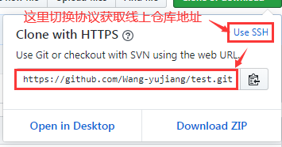
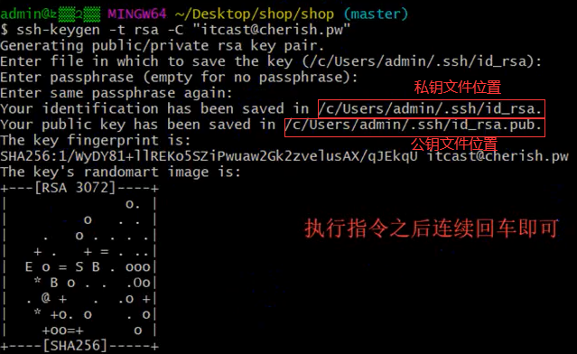
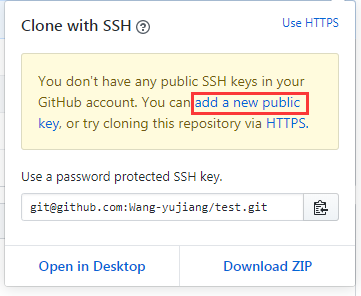
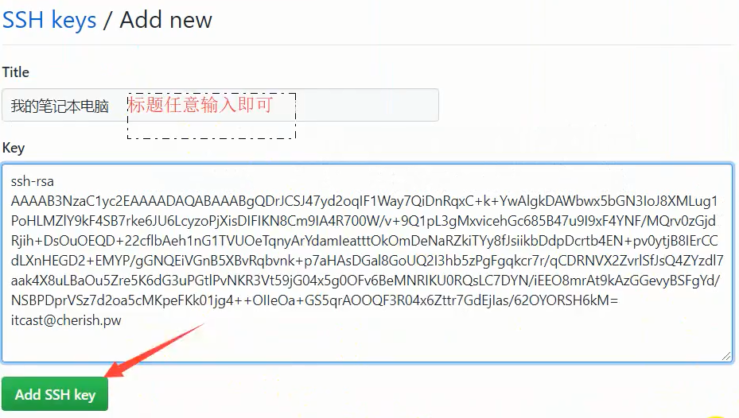

##   1 远程仓库的两种使用方式

1. 基于HTTPS协议
2. 基于SSH协议



###  1.1 基于HTTPS协议

* 1 在本地创建文件夹用于存放远程仓库内容

* 2 将远程仓库内容克隆到本地

```
git clone 线上仓库地址
```

* 3 在仓库上做对应的操作

  * 1 提交缓存区

  ```
  git add 
  ```

  * 2 提交本地仓库

  ```
  git commit -m “内容描述”
  ```

  * 3 提交线上仓库

  ```
  git push <remote> <branch>
  //<remote>: 远程服务器简称  
  //<branch>: 远程服务器分支名称
  //该命令默认 <remote>为：origin服务器   <branch>为：master分支
  ```

  * 4 拉取线上仓库

    * 其他人修改仓库后 通过拉取线上仓库可以获取最新修改后的版本

    ```
    git pull
    ```

    


###  1.2 基于SSH协议

该方式与HTTPS相比  只影响GitHub对于用户的身份鉴权的方式 其他操作指令相同

* 1 创建公私钥对文件

  * 1 安装OpenSSH
  * 2 项目根目录下执行如下指令  并一直回车即可

  ```
  ssh-keygen -t rsa -C "github的邮箱"
  ```

  

* 2 将公钥文件（id_rsa.pub）内容添加到GitHub中





* 3 后续操作同HTTPS的操作
  * 1 `git clone SSH类型的线上仓库地址`    
  * 2 `git add   `
  * 3 `git commit -m "解释内容"`
  * 4 `git push`         ----- 一般下班先操作 提交代码到线上仓库
  * 6 ` git pull`          ----- 一般上班是操作  拉取线上仓库最新版本


##  2 远程仓库的使用

###  2.1 查看远程仓库

**命令1--查看所有远程仓库简称**

```
git remote
```

**案例**

```
$ git remote
origin
```

*  该命令列出项目中指定的每一个远程服务器的简写 
*  origin 是 Git 给克隆的仓库服务器的默认简称，该简称可以代替远程仓库地址在本地使用

**命令2--查看所有远程仓库简称及URL**

```
git remote -v
```

**案例**

```
$ git remote -v
origin	https://github.com/schacon/ticgit (fetch)
origin	https://github.com/schacon/ticgit (push)
```

*  选项 `-v`，会显示需要读写远程仓库使用的 Git 保存的简写与其对应的 URL。 

**命令3--查看某个远程仓库详情**

```
git remote show <remote>
//<remote>: 远程仓库简称
```

**案例**

```
$ git remote show origin
* remote origin
  Fetch URL: https://github.com/schacon/ticgit
  Push  URL: https://github.com/schacon/ticgit
  HEAD branch: master
  Remote branches:
    master                               tracked
    dev-branch                           tracked
  Local branch configured for 'git pull':
    master merges with remote master
  Local ref configured for 'git push':
    master pushes to master (up to date)
```


###  2.2 添加远程仓库

* 方式1：

1. 终端切换到打算存放代码的目录下  

2. 执行`git clone 线上仓库地址`  在文件夹生成远程仓库名的文件夹

3. 终端切换到远程仓库名的文件夹下  

4. 将已项目的文件及文件夹复制到远程仓库名的文件夹里

   * 通过`git clone `克隆到本地，默认远程仓库简称为：`origin`, 默认远程跟踪分支为：`origin/master`

   * 修改远程分支名

     * 前提：必须是克隆方式在本地创建的仓库

     ```
     git clone -o <新分支名>
     -o, --origin <name>   use <name> instead of 'origin' to track upstream
     
     //例
     gitclone -o dev
     远程跟踪分支改为：dev/master
     
     ```

* 方式2 ：

**注意：该方式需要本地项目中有.git文件夹   **

**注意：github远程仓库必须是空仓库，否则执行下面的`git push -u ....`操作会报错**

1. 终端切换到本地项目根文件夹下
2. 若没有.git文件，则先执行`git  init `本地用`git`管理该项目
3. 执行如下命令

```
 git remote add <shortname> <url> 
 //<shortname>: 服务器简称
 //<url> : 服务器地址
 
 git push -u origin master
 //-u : --set-upstream-to :设置git pull、git push 、git fetch 的默认地址及分支
 
 //若执行报错，可以先git pull拉取线上数据并合并  若合并有误则再次执行git add 及 git commit 后再git push到远程服务器
 
```


###  2.3 从远程仓库中抓取与拉取

**命令**

```
 git fetch <remote>
 //<remote>: 远程仓库简称
```

*  这个命令会访问远程仓库，从中拉取所有本地还没有的数据。 执行完成后，本地将会拥有那个远程仓库中所有分支的引用，可以随时合并或查看。 
*  该命令只会将数据下载到本地仓库，并不会自动合并或修改当前的工作。 

###  2.4 远程仓库的重命名与移除

* 重命名

  * git remote添加仓库时

  ```js
  git remote rename <服务器原简称> <服务器新简称>
  ```

  * git clone添加仓库时
    * 通过`git clone `克隆到本地，默认远程仓库简称为：`origin`, 默认远程跟踪分支为：`origin/master`

  ```
  git clone -o <新分支名>
  -o, --origin <name>   use <name> instead of 'origin' to track upstream
  
  //例
  git clone -o dev
  远程跟踪分支改为：dev/master
  ```

* 删除

  ```js
  git remote remove <要删除的服务器简称>
  ```


##  3 远程分支

###  3.1 新建远程分支

* `<remote>` : 是远程仓库在本地的简称
* `<branch>`： 需要在远程新建的分支的分支名

```
git push <remote> <branch>
```

###  3.2 建立本分支与远程跟踪分支的对应关系

```
git branch --set-upstream-to=origin/<branch> master
//<branch>: origin远程仓库中的分支
//该命令是将origin服务器中的<branch>分支与本地的master分支关联起来  

//简写(该命令会将终端所在分支与远程<remote>/<branch>分支建立联系)
git branch -u <remote>/<branch> 
```

###  3.3 查看远程跟踪分支与本地分支的对应关系

```
git branch -vv
```

###  3.4 删除远程分支

```
git push <remote> --delete <branch>

//案例
$ git push origin --delete serverfix
To https://github.com/schacon/simplegit
 - [deleted]         serverfix
```


##  4 冲突的产生与解决

###  4 .1 冲突产生的原因

1.  其他成员对项目做了更改  线上仓库生成了新的版本
2.  而本人在修改文件内容前没有执行git pull  从线上仓库获取最新的版本
3.  在本人修改文件后git  push到线上时 就会产生冲突

###  4 .2 解决冲突

*  1 执行指令 `git pull`
*  2 指令执行结束后 git会自动合并有冲突的文件（内容合并 同时会在文件中标注合并的地方） 同时在终端显示有冲突的文件
*  3 根据终端提示， 打开冲突合并后的文件。  根据文件中合并地方的标注， 团队成员商量修改文件 
*  4 文件修改后 `git add` 添加到缓冲区  `git commit -m ` 添加到本地   `git push`提交到线上仓库


##  5 打标签

###  5.1 列出标签

```
git tag
```

```
$ git tag -l "v1.8.6*"
v1.8.6
v1.8.6-rc0
```

* `-l`: 等价于`-list`  表示以列表形式展示
* 可以查询指定tag，也可模糊查询

###  5.2 创建标签

**附注标签**

```
git tag -a <标签名> -m <"描述">

//案例
git tag -a v1.4 -m "my version 1.4"
```

*  `-a` 选项： 表明是附注标签

*  `-m`选项： 用于阻止启动编辑器输入描述

**轻量标签**

```
git tag <标签名>
```

* 没有其他标签和描述

**查看标签详情**

```
git show <标签名>
```

**附注标签和轻量标签的区别**

* 附注标签保存了更多信息，包括： 打标签者的信息、打标签的日期时间、附注信息，具体的提交信息。通过`git show`都可以显示、
* 轻量标签没有保存上述信息，适用于临时打标签

###  5.3 后期打标签

*给已提交的版本打标签*

```
git tag -a <标签名>  <版本号>
//案例
git tag -a v1.2 9fceb02  //此处是附注标签
```

###  5.4 共享标签

*将本地标签同步到远程仓库*

* 将指定标签同步到远程仓库

```
git push <远程仓库简称> <标签名>
//案例
git push origin v1.6
```

* 将所有本地标签同步到远程仓库

```
git push <远程仓库简称>  --tags
//案例
git push origin --tags
```

###  5.5 删除标签

**删除本地标签**

```
git tag -d <标签名>
//案例
git tag -d v1.4-lw
```

**删除远程仓库标签**

```
//方案1
git push <远程仓库简称> :refs/tags/<标签名>
//案例
git push origin :refs/tags/v1.4-lw

//方案2 
git push <远程仓库简称> --delete <标签名>
```


###  5.6 检出标签 

```
git checkout <标签名>
```

