##  1 基本概念

* 仓库（Repository）:
  * 仓库用来存放代码，每个项目对应一个仓库
* 收藏（Star）：
  *  收藏项目，方便下次查看
* 复制克隆项目（Fork）:
  * 将别人的项目克隆到自己的GitHub上  
* 发起请求（Pull Request）: 
  * 修改克隆来的项目后  将修改记录发送给克隆来项目的账户  提示对方是否合并修改
* 关注（Watch）:
  * 关注项目，当项目更新可以接收到通知
* 事务卡片（Issue）：
  * 发现代码BUG,但是目前没有成型的代码，需要讨论时用
* GitHub主页
  * 左侧显示自己的仓库
  * 中间显示关注用户的动态
  * 右侧显示发现


##  2 创建仓库

###  2.1 进入创建页

* 首页左上角点击“NEW”创建新仓库

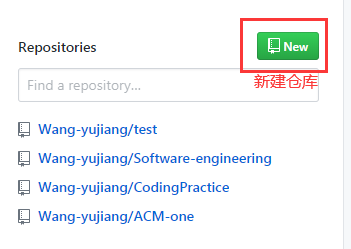

* 首页右上角击“+”号---->New repository

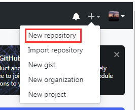


###  2.2 创建具体操作 


###  2.3 仓库主页功能介绍

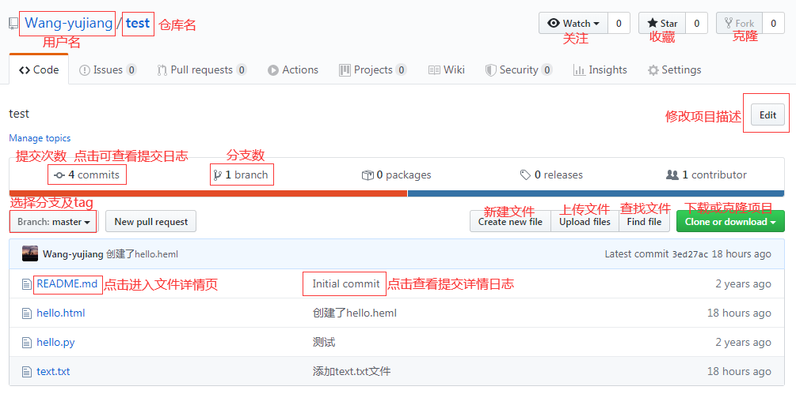

###  2.4 文件详情页


###  2.5 查找文件

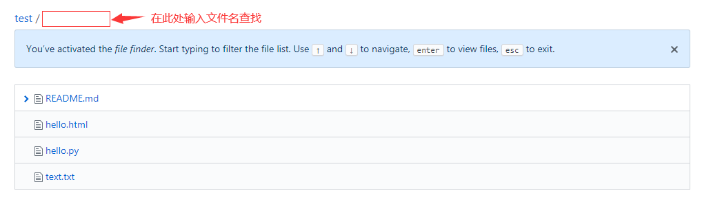

###  2.6 更改仓库名

* 仓库主页----->settings

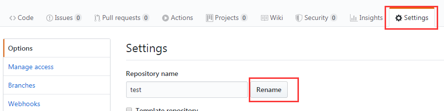

###  2.7 删除仓库

* 仓库主页------>settings  最下面

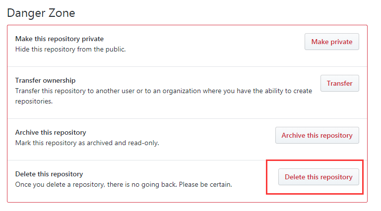

##  3 个人主页

###  3.1 进人个人主页

点击主页右上角头像


###  3.2 个人主页可查看的信息


###  3.3 修改个人信息

* 进入修改

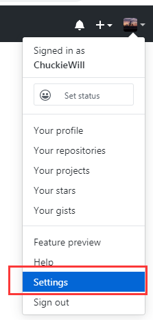

* 修改github的用户名

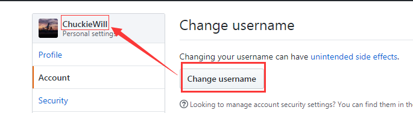


##  4 创建项目

* project是一个管理项目的工作区 ， 创建项目后可以建立工作流程，分配工作任务 ，实时调整工作任务等

* 创建入口1

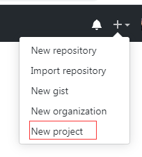

* 创建入口2： 在进入仓库主页后选择项目并创建

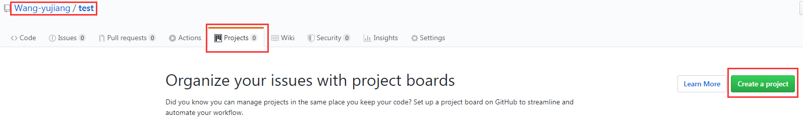

##  5 消息提示

###  5.1 查看关注的项目

关注的项目 ，在项目有更新时会发送通知给关注了的用户

* 点击首页右上角 的 铃铛


* 进入消息页 再按如下标注点击

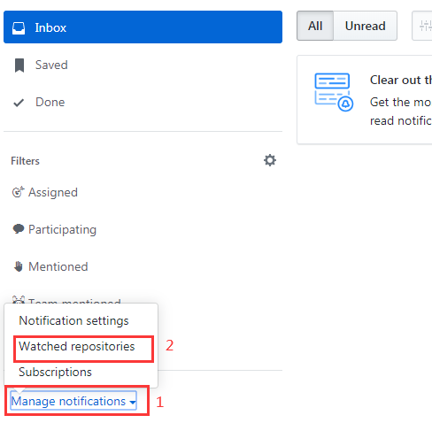

* 关注的项目

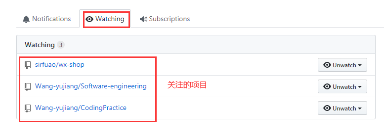

##  6 解决图片上传到github不显示问题

* windows解决方案

  1. 打开`hosts`文件  路径：` C:\Windows\System32\drivers\etc\hosts `
  2. 在`hosts`文件末尾添加如下代码：

  ```
  # GitHub Start 
  140.82.113.3      github.com
  140.82.114.20     gist.github.com
  
  151.101.184.133    assets-cdn.github.com
  151.101.184.133    raw.githubusercontent.com
  151.101.184.133    gist.githubusercontent.com
  151.101.184.133    cloud.githubusercontent.com
  151.101.184.133    camo.githubusercontent.com
  151.101.184.133    avatars0.githubusercontent.com
  199.232.68.133     avatars0.githubusercontent.com
  199.232.28.133     avatars1.githubusercontent.com
  151.101.184.133    avatars1.githubusercontent.com
  151.101.184.133    avatars2.githubusercontent.com
  199.232.28.133     avatars2.githubusercontent.com
  151.101.184.133    avatars3.githubusercontent.com
  199.232.68.133     avatars3.githubusercontent.com
  151.101.184.133    avatars4.githubusercontent.com
  199.232.68.133     avatars4.githubusercontent.com
  151.101.184.133    avatars5.githubusercontent.com
  199.232.68.133     avatars5.githubusercontent.com
  151.101.184.133    avatars6.githubusercontent.com
  199.232.68.133     avatars6.githubusercontent.com
  151.101.184.133    avatars7.githubusercontent.com
  199.232.68.133     avatars7.githubusercontent.com
  151.101.184.133    avatars8.githubusercontent.com
  199.232.68.133     avatars8.githubusercontent.com
  
  # GitHub End
  ```

* MacOS解决方案

  1. 通过命令行
     先sudo -i 临时获取管理员权限，会提示你输入密码，就是启动的密码。
     然后 vi /etc/hosts
     前面的vi是编辑器，当然也可以换用其他的
     /etc/hosts 是hosts内容，文档末尾添加以上代码完保存就OK

  2. 通过图形界面
     按快捷键组合 Shift+Command+G 三个组合按键查找文件，并输入 hosts 文件的所在路径：/etc/hosts
     找到hosts文件，文档末尾添加以上代码完保存就OK。


##  7 解决github访问速度慢的问题

* 国内访问github慢的原因

 GitHub的CDN域名遭到DNS污染，导致无法连接使用 GitHub 的加速分发服务器，才使得国内访问速度很慢 。

* 解决DNS污染

 通过修改 Hosts 文件，将域名解析直接指向 IP 地址来绕过 DNS 的解析，以此解决污染问题。 

* 获取github相关ip地址
  * github.com
  * github.global.ssl.fastly.net

 访问[https://www.ipaddress.com/](https://www.ipaddress.com/) 这个网站来获取当前github最新的ip地址 

* 次改host文件

文件地址：C:\Windows\System32\drivers\etc\hosts

```
140.82.114.4	github.com
199.232.5.194	github.global.ssl.fastly.net
```

