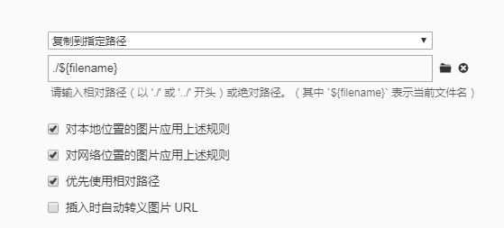

**使用场景：**

* 使用`typora`编辑器编辑`md`文件
* 图片直接复制粘贴到文件中即可（不用使用`hexo`推荐的繁琐语法）
* 生成静态网页文件后在本地、上传到github上后都可以正常显示图片

**实现方法：**

* 1 设置`typora`保存图片的方式

  * 通过`文件---->偏好设置----->图像 ` 做如下设置

  

  * 该设置目的：使图片保存在`.md`文件的同名文件夹下，且该同名文件夹和`.md`文件在同一个文件夹下。同时该设置可以方便的直接粘贴图片到文件中即可，图片路径会自动生成。

* 2 修改`Hexo`配置

  * `_config.yml`文件中修改` post_asset_folder: false`为` post_asset_folder: true`
  * 该配置目的： 每次新建Markdown文件的时候，都会创建一个与文件同名的文件夹用于存放图片 ，与上面`typora`的配置一致

* 3 安装`hexo-asset-image`插件

  * ```
    npm install https://github.com/7ym0n/hexo-asset-image --save
    ```

  * 该插件用于在生成静态网页时生成正确的图片访问路径

