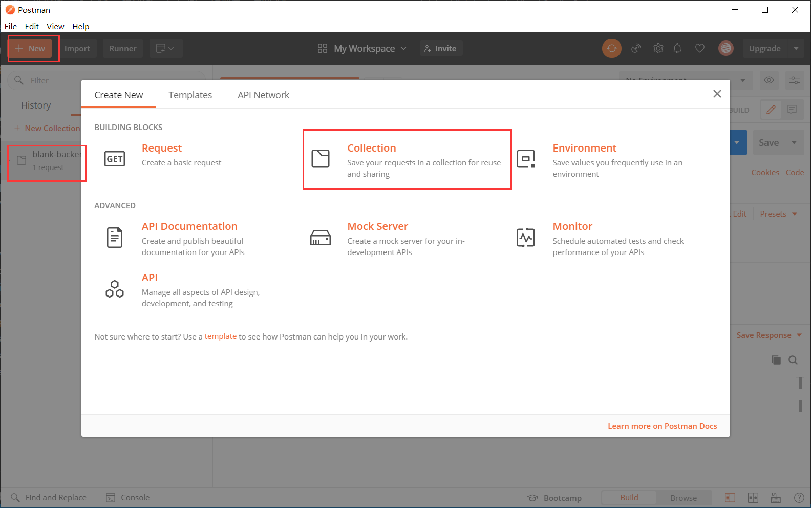
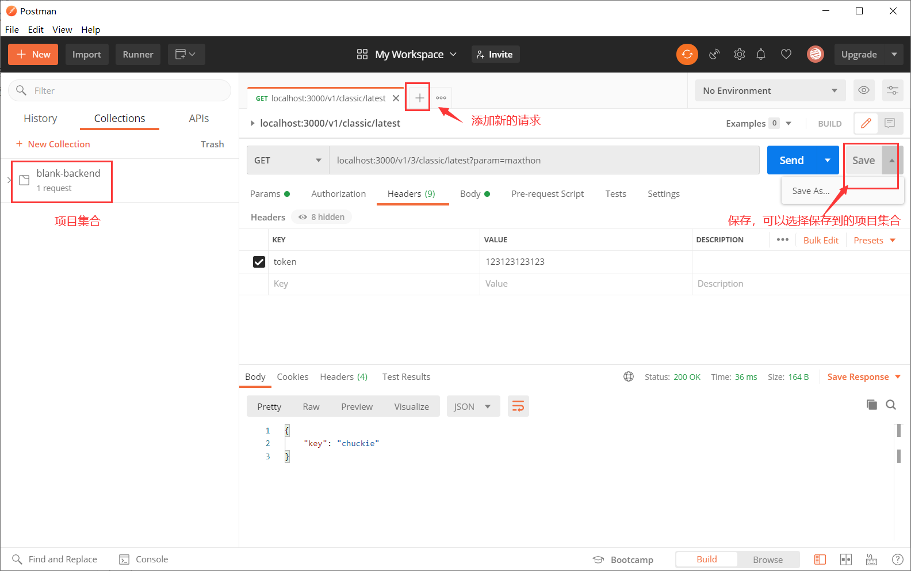
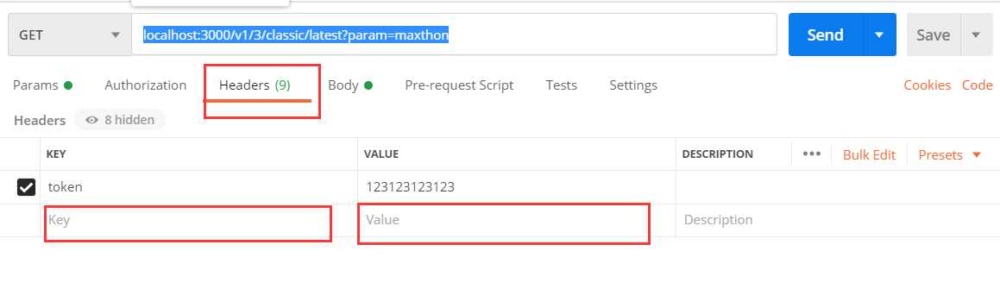
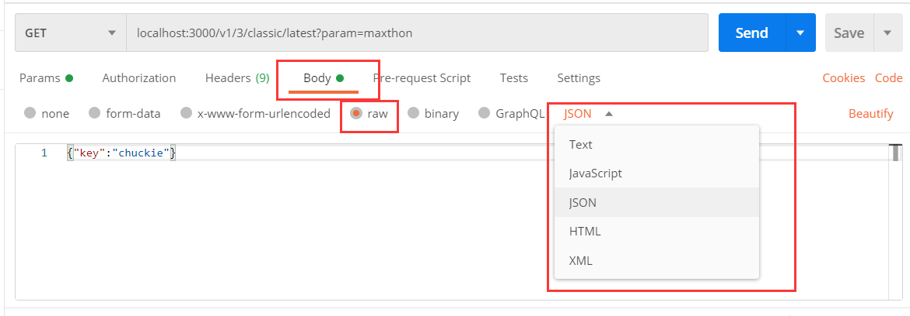

> [postman教程大全](https://www.jianshu.com/p/97ba64888894)

##  1 新建

###  1.1 新建项目集合



###  1.2 新建请求并添加到项目集合中




##  2 请求自定义

###  2.2 post

1. 路径传参

   * 其中`3`为传入的参数

   ```js
   localhost:3000/v1/3/classic/latest
   ```

2. `?param`传参

   * `maxthon`：为参数

   ```js
   localhost:3000/v1/classic/latest?param=maxthon
   ```

3. `headers`传参

   * 直接添加键值对即可

   

4. `body`传参

   * 选择‘Body->row->选择格式->输入内容’

   