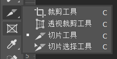

# ps
###  1 新建设置

* 背景色：透明
* 分辨率：72
* 单位像素

###  2 面板操作

#####  1 选择图层

*  选择图层--------面板左上角  勾选✔自由选择   同时选择图层而不是组

* 选择图层推荐用法--------- 不勾选✔自由选择  选择图层   -------ctrl+鼠标左击就可以选中图层

#####  2 视图设置（切图基本设置）

* 1 四大面板---------信息、字符、图层、历史记录

  信息、字符------> 在窗口中设置

* 2 视图中需选择：✔标尺、✔显示--->智能参考线
* 3 信息设置
* * 第一颜色信息：RGB颜色
  * 第二颜色信息：RGB颜色
  * 标尺单位：像素
  * 状态信息：✔文档大小、✔文档尺寸
* 4 编辑--->首选项----->单位与标尺------>单位    标尺、文字都选择：像素
* 5 保存以上设置： 窗口----->工作区------>新建工作区
  * 已经建立web切图   若误操作后可以点击web切图回复设置
  * 在面板右上角可以切换右侧面板的选择

###  3 工具

#####  1 选取工具

* shift+选择   --------  选择正方形、正圆形
* alt+选择  ----------   以鼠标所在位置为圆形选择圆形
* 多个选取快捷键
  * shift+选择下一个选取   + 效果
  * alt+选择下一个选取   - 效果
* **ctrl+点击图层缩略图  ------>  以虚线的形式选择图层内容**
* **取消选区-----------> ctrl+d**
* 复制图层(图形)：alt+拖动要复制的图形
* 选择图形，变换大小--------------ctrl+t

#####  2 吸管及颜色填充

* 填充颜色：alt+delete
* 填充背景颜色：ctrl+delete

#####  3 参考线

* 拖动建立参考线
  1. 视图----------标尺✔
  2. 从上方或左边拖动参考线即可建立参考线
* 手动准确建立标尺   ---  快捷键：alt+v+e
  * 视图----------新建参考线  可以设置标尺的位置（单位px  例：1920px）
* 删除参考线   
  *  已更一根的删除：将参考线拖动到上方或左方即可   
  * 一次全部清除参考线：视图-------清除参考线
* 隐藏参考线    快捷键：ctrl+;（注意是ctrl+分号）     再按这个快捷键又会显示
* 技巧：选择图层，拖动参考线会自动向图层边缘靠拢

#####  4 放大缩小

alt健可以快速切换放大和缩小

###  4 传统切图

#####  1 基于参考线的切片

1. 用参考线框住要切片的图
2. 用上图第三个工具“切片工具”----选择视图上方的“基于参考线的切片”
3. 删除不需要的参考线框住的区域
4. 导出：文件------导出------存储为web所用格式-----选择存储图片类型（一般png24），导出后会在指定路径下生成文件夹，文件夹下就是所有的切图

###  5 精准切图

* 按图层切图，导出内容很多

文件-----导出-----将图层导出到文件（效果：将每个图层的内容都导出成了图片）

###  6 自动切图

编辑-----首选项-----增效工具----启用生成器✔

文件-----生成----图像资源✔

选择图层组或者图层在名称后加上后缀  例如“.png”、“.svg”即可在PSD文件下生成文件夹，文件夹中就有生成的图片

注意：取消文件名后缀后，文件夹下就没有相应的图片了

* 生成苹果规范UI @2x  : 在文件名后空格+@2x+后缀   例如：电影。@2x.png

  [https://www.jianshu.com/p/c8ea4e7e9a6b]

删除切片选区：ctrl + h

###  7 剪切工具实现切图

1. 选择要剪切的内容（先选择图层，在ctrl+点击图层缩略图）
2. 点击剪切工具
3. 消除图层背景色：alt+点击图层显示标识（眼睛）
4. 回车
5. 点击面板上方的✔
6. 文件----导出----导出为

图像放大和缩小

* ctrl+t  拖动放大和缩小

编组

* shift选中要编为一组的图层

* ctrl + G

复制图层

* ctrl + j
