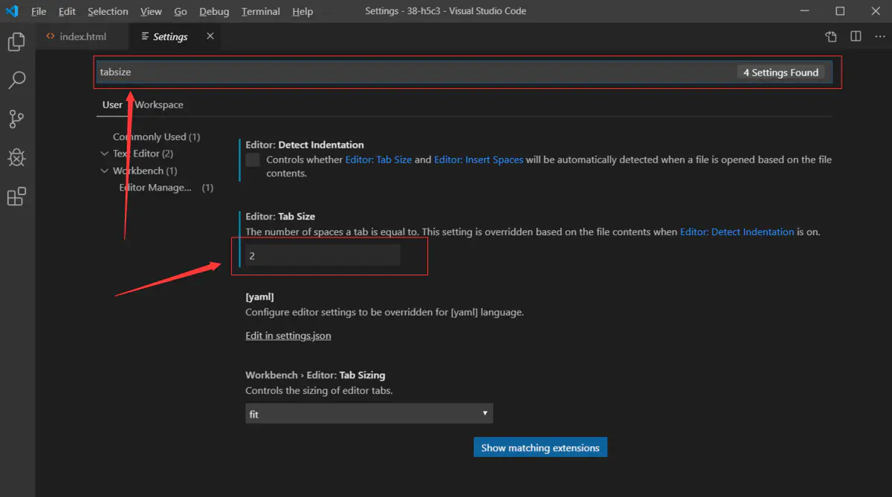
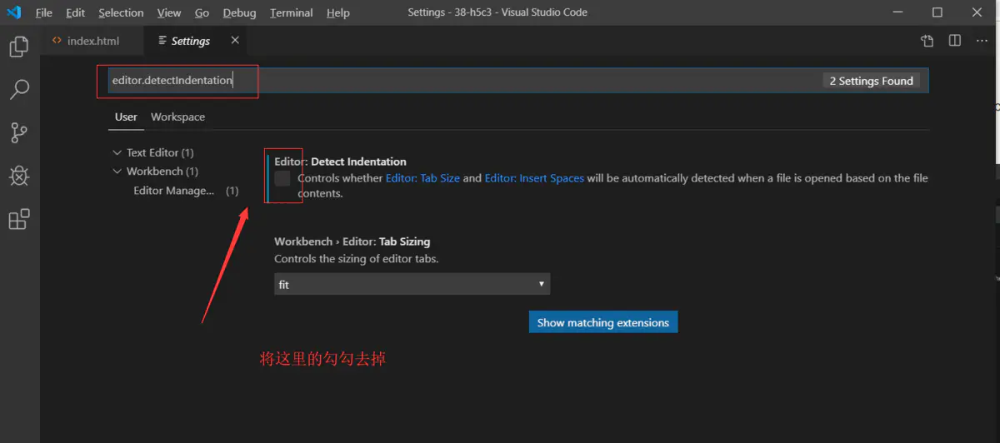
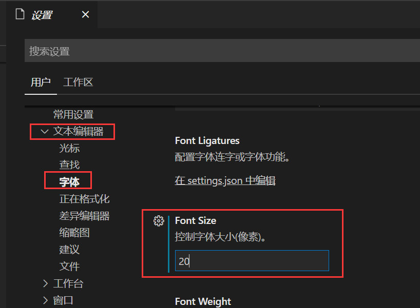
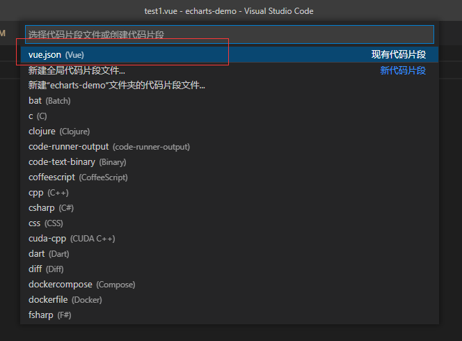
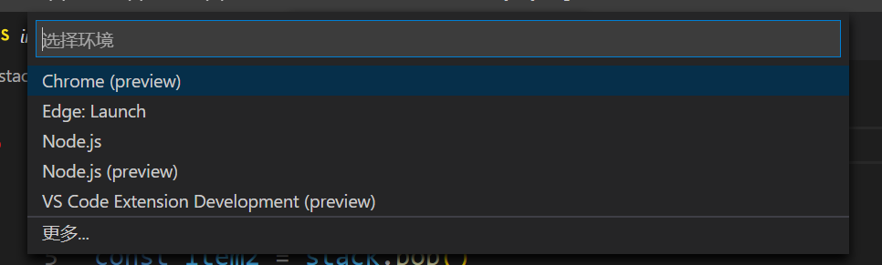
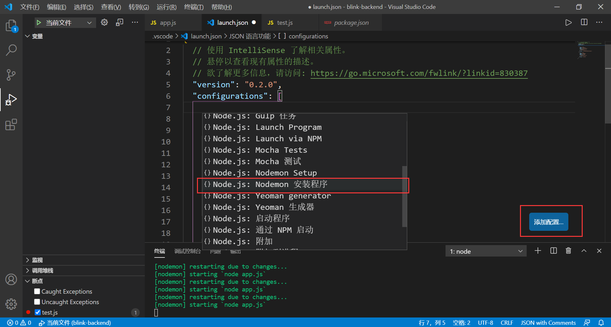
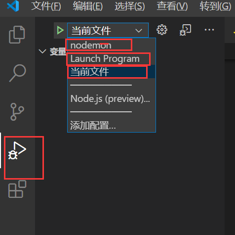
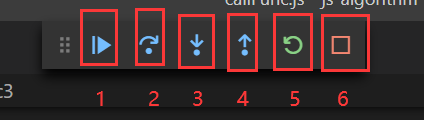

#  vscode使用

##  0 快捷键

* 缩进

向右：tab  or  ctrl+]

向左：shift+tab   or   ctrl+[

* ! 
  * 自动生成一套HTML代码
* tab
  * 增加选中行的缩进
* tab+shift
  * 减小选中行的缩进
* alt + b
  * 快速在浏览器中浏览网页
* ctrl + c
  * 复制
* ctrl + x
  * 剪切
* ctrl + v
  * 粘贴
* ctrl + .
  * 让输入法在中英文标点符号之间来回进行切换
* ctrl + /
  * 在代码当中快速打出注释
* alt+shift+a
  * 多行注释
* ctrl+f
  * 在文件中查找
* 查看函数： ctrl + 点击要查看的函数
* 查看完函数后返回原来的位置： alt + -


##  1 插件配置

###  1.1 基础插件配置

* 汉化

```
搜索chinese
Chinese (Simplified) Language Pack for Visual Studio Code
```

*  Atom One Dark Theme   一种主题风格

```
Atom One Dark Theme
```

* KoroFileHeader  ---  **函数头部解释快捷键**
  * 光标处添加函数注释  

    1.Windows：ctrl+alt+t
    2.mac:ctrl+cmd+t

  * 还可以给文件加描述
    1.Windows：ctrl+alt+i
    2.mac:ctrl+cmd+i


###  1.2  前端开发插件配置

*   vscode-icons    目录图标

```
vscode-icons
```

*  open in browser    方便打开html文件
   *  alt+B

```
open in browser  
```

###  1.3 react 开发相关插件

*  https://segmentfault.com/a/1190000019928571 
*  https://blog.csdn.net/qq_34586870/article/details/100079410 
*  Reactjs code snippets	react代码段
*  React Redux ES6 Snippets	代码段
*  ES7 React/Redux/GraphQL/React-Native snippets	代码段
*  JavaScript (ES6) code snippets	es6代码段
*  Auto Rename Tag	从名字就能看出，当你需要更改标签的时候，你改了第一个就会自动更改第二个
*  Document This	文档注释 快捷键Ctrl +Alt + D两次
*  Image preview	在代码行号前面显示图片预览
*  Path Intellisense	路径补全
*  vscode-icons	文件图标
*  npm Intellisense	对package.json内中的依赖包的名称提示
*  Bracket Pair Colorizer	用彩虹色标注括号
*  Settings Sync	将配置同步到github，更换开发环境的时候就不用重复配置了
*  Todo Tree	待办事项高亮，知乎配置介绍
   

###  1.4 vue 相关插件

* vetur

##  2 设置

###  2.1 缩进设置

*  file-->preferenses-->setting   (文件-首选项-设置)
* 搜索`tabsize`

  


*  要是设置了之后发现没有生效的话，那么就继续在搜索框那边搜`editor.detectIndentation` ，将这一项修改为false即可 

  

###   2.2 字体大小设置

**快捷键设置：**

*vscode整个编辑器字体都会变化，包括编辑、目录、终端等字体都会变化*

* 放大：`ctrl + '+'` 
* 缩小：`ctrl + '-'`

**设置字体具体像素大小：**

* file-->preferenses-->setting   (文件-首选项-设置)



###  2.3 快捷键设置

####  2.3.1 按F5无法开启调试的问题

**解决方案：**

1. 在“文件-首选项-键盘快捷方式”中，先查找“调试：开始调试”，然后鼠标右键点击“删除键绑定”
2. 然后在重新设置“调试：开始调试”的“键绑定”为F5，之后回车就可以了

**问题原因：**

* 出现这个问题的原因是原键绑定设置了执行条件“!inDebugMode”，这个条件不能在原默认设置单独删除，所以将原来的配置整体删除后重新设置即可。

###  2.4 设置vue模板快捷生成

> 教程：https://blog.csdn.net/weixin_44157964/article/details/105602639

* 首选项-----用户片段-----vue



* vue.json复制为如下代码

```json
{
	// Place your snippets for vue here. Each snippet is defined under a snippet name and has a prefix, body and 
	// description. The prefix is what is used to trigger the snippet and the body will be expanded and inserted. Possible variables are:
	// $1, $2 for tab stops, $0 for the final cursor position, and ${1:label}, ${2:another} for placeholders. Placeholders with the 
	// same ids are connected.
	// Example:
	// "Print to console": {
	// 	"prefix": "log",
	// 	"body": [
	// 		"console.log('$1');",
	// 		"$2"
	// 	],
	// 	"description": "Log output to console"
	// }

	"Print to console": {
        "prefix": "vue",
        "body": [
            "<template>",
            "    <div>\n",
            "    </div>",
            "</template>",
            "<script>",
            "export default {",
            "   data() {",
            "      return {",
			"      }",
			"   },",
			"   created(){",
			"   },",
			"   computed:{",
			"   },",
			"   methods:{",
			"   },",
			"}",
			"</script>",
			"<style lang=\"scss\" scoped>\n",
			"</style>",
            "$2"
        ],
        "description": "Log output to console"
    }

}
```

使用：`输入vue+tab键`即可自动补全

## 3 配置

###  3.1 启动项配置

####  3.1.1 每次调试弹出运行环境的选择

**问题描述：**

* 每次点击`shift+f5`都弹出如下运行环境的选择框，使得调试过程很不便捷

  

**解决方案：**

* 1 打开要运行的文件
* 2 点击菜单栏`运行-添加配置`  选择相应的运行环境
* 若在根目录下出现`.vscode/launch.json`文件则配置成功

#### 3.1.2 调试文件`launch.json`的配置

* 文件位置：项目根目录下`.vscode/launch.json`

* 每次调试文件变化时，需要在`launch.json`文件中作相应的修改
  * `"program": "${workspaceFolder}\\`需要调试的文件路径" 

```js
{
  "version": "0.2.0",
  "configurations": [
    // ----1-----将调试与node serv项目自动重启(nodemon)向结合的配置------
    {
      "type": "node",
      "request": "launch",
      "name": "nodemon",
      "runtimeExecutable": "nodemon",
      "program": "${workspaceFolder}/app.js",
      "restart": true,
      "console": "integratedTerminal",
      "internalConsoleOptions": "neverOpen",
      "skipFiles": [
        "<node_internals>/**"
      ]
    },
    // ----2-----配置默认调试入口文件------
    {
      "type": "node",
      "request": "launch",
      "name": "Launch Program",
      "skipFiles": [
        "<node_internals>/**"
      ],
      "program": "${workspaceFolder}\\app.js"
    },
    // ----3-----配置调试当前文件------
    {
      "type": "node",
      "request": "launch",
      "name": "当前文件",
      "skipFiles": [
        "<node_internals>/**"
      ],
      "program": "${file}"
    }
  ]
}
```

#####  3.1.2.1  配置node serv项目自动重启与调试向结合

* 此配置使得，当开启调试的时候，也会同时开启自动重启



#####  3.1.2.2  不同配置的切换

* nodemon:  1-----将调试与node serv项目自动重启(nodemon)向结合的配置------
* Launch Program: 2-----额配置默认调试入口文件------
* 当前文件: 3-----配置调试当前文件------




#### 3.1.3 调试面板解释



* 1 ： 运行到下一个断点处
* 2  ： 单步执行
* 3 ： 进入函数
* 4 ： 退出函数
* 5 ： 重启调试
* 6 ： 停止调试

###  3.2 vscode下调试运行c++

> [vscode下调试运行c++ ](https://www.cnblogs.com/zhuzhenwei918/p/9057289.html)
>
> [win10安装MinGW-64安装版](https://blog.csdn.net/qq_44108889/article/details/120228107)
>
> [wingw-w64安装时 the file has been downloaded incorrectly!](https://blog.csdn.net/kramer_1711/article/details/119416512)

##  4 小技巧

###  4.1 同时添加多个光标

**单个添加:** 将光标放在一个位置，然后按住Alt键的时候用鼠标点击其他地方，点到的地方就会添加一个光标出来
**添加一整列:** 按住Shift+Alt然后鼠标下拉，即可添加一整列光标

* 选中，然后crtl+D, 即可选中所有， 然后修改一次性全修改

###  4.2 函数注释

```js
语法：
/**回车

效果：
/**
 * 函数注释
 */
```

##  5 问题

###  5.1英文界面问题

有时候我们vscode已经下载好中文简体的插件，但是通过vue init webpack xxx创建的vue项目用vscode打开后还是会切换回英文界面。

这时候需要做如下操作：

1.Ctrl＋ Shift ＋P （command+shift+P）输入display 选择Configure display Language 

2.选择zh-cn

这时候vscode会提示需要重启，点击restart重启vscode，重启后vscode就会显示中文界面。


##  附录

###  1 vscode前端最佳配置

>[2020 vscode 前端最佳配置]( https://blog.csdn.net/win7583362/article/details/79315055/ )

