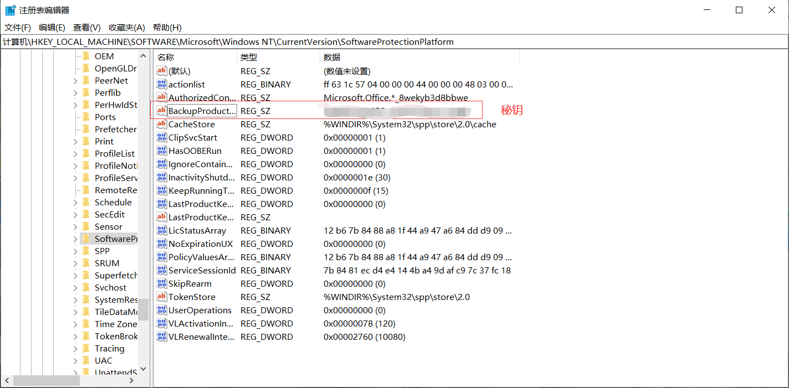
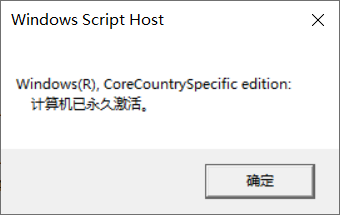
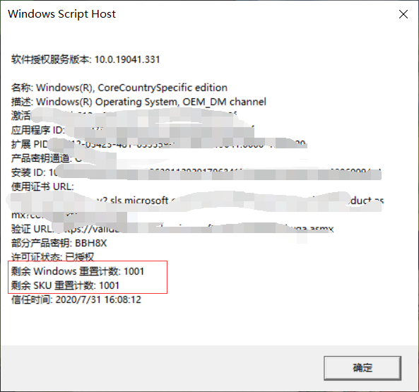

# win+r

###  1cmd

#### 1.1 磁盘切换

```
切换到D盘根目录——   cd /d D:
切换到D:\dev目录—— cd /d D:\dev
```

####  1.2 dir 显示目录下的文件即文件夹


###  2 查看电脑型号

* win+r   输入：`dxdiag` 回车  即可查看到

###  3  查看注册表

* win+r   输入：`regedit` 回车  即可查看到

####  3.1 查看windows秘钥

* 打开注册表后按如下路径查找：

  ```js
  计算机\HKEY_LOCAL_MACHINE\SOFTWARE\Microsoft\Windows NT\CurrentVersion\SoftwareProtectionPlatform
  ```

  

###  4 查看电脑激活状态

* win+R 输入： `slmgr.vbs -xpr`

  


###  5 查看windows可激活次数



###  6 生成密钥链接服务器

> https://blog.csdn.net/BGD2020/article/details/122294088