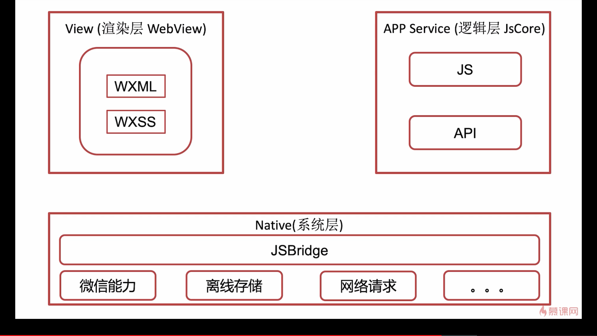
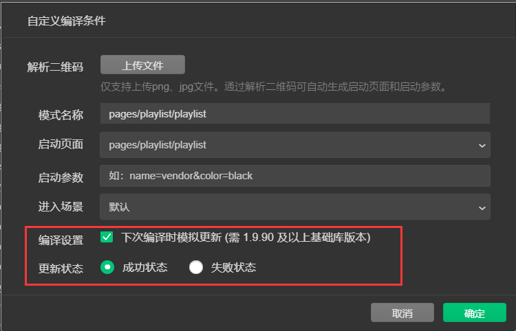

#  细节

##  1` ['`属性1.属性11`']`的方式拿属性

* 用法：`['属性.属性.属性']`-------即用`[]`和`''`包裹属性
* 需要此方式拿上属性的情况
  * 1 给data/properties属性的属性赋值  ----  案例1
  * 2 在observe中获取属性   ----- 案例2

* 案例

```js
//案例1
Page({
  data: {
    goods: {
      'pop': {
        page: 0,
        list: []
      },
      'new': {
        page: 0,
        list: []
      },
      'sell': {
        page: 0,
        list: []
      },
    }
  },
  _getGoodsData(type) {
      const typeKey = `goods.${type}.list`;
      const pageKey = `goods.${type}.page`;
      this.setData({
        [typeKey]: oldList,
        [pageKey]: page
      })
  }
}）
     
//案例2
Component({
  properties: {
    playlist:{       //playlist类下有playCount属性
      type: Object
    }
  },
  observers:{
    ['playlist.playCount'](count){
      this.setData({
        _count: this._tranNumber(count, 2)
      })
    }
  },
}）
```

##  2 调用API用this. OR wx.

* 组件内调用系统函数用  this.     //this.createSelectorQuery()
* 页面内调用系统函数用  wx.       //wx.createSelectorQuery()

##  3 wx:if  VS  hidden

* 微信官方文档： [wx:if  VS  hidden]( [https://developers.weixin.qq.com/miniprogram/dev/reference/wxml/conditional.html#wx:if%20vs%20hidden](https://developers.weixin.qq.com/miniprogram/dev/reference/wxml/conditional.html#wx:if vs hidden) )

1.  wx:if       //适用于不频繁的隐藏切换-----消耗大      wx:if = "  标志位"
2.  hidden    //适用于频繁的隐藏切换                            hidden   =  "  标志位"

##  4 typeof判断类型

```js
typeof
示例代码：

var number = 10;
var boolean = true;
var object = {};
var func = function(){};
var array = [];
var date = getDate();
var regexp = getRegExp();

console.log( 'number' === typeof number );
console.log( 'boolean' === typeof boolean );
console.log( 'object' === typeof object );
console.log( 'function' === typeof func );
console.log( 'object' === typeof array );
console.log( 'object' === typeof date );
console.log( 'object' === typeof regexp );

console.log( 'undefined' === typeof undefined );
console.log( 'object' === typeof null );
```

##  5 setData的回调函数使用

```
//modelShow、 commShow为data属性  
//回调函数 类似异步  确保先执行modelShow: false  再执行commShow: true
      this.setData({
        modelShow: false
      }, () => {
        this.setData({
          commShow: true
        })
      })
```

##  6 JSON文件注意事项

1. JSON文件中不能写注释
2. 引号都必须用：双引号　　＂＂
3. 最后一行结尾没有“,”

## 7 wx:key

* 遍历的数组为对象时  使用对象下的属性

```
数组：books[{id:1},{id:2},{id:3},{id:4}]

使用
wx:for="{{books}}"  wx:key="id"-----------注意wx:key没有{{}}、也不是item.id这种写法
```

* 遍历的数组为数字或字符串时  使用“*this”

```
数组：books[1,2,3,4]

使用
wx:for="{{books}}"  wx:key="*this"-----------注意wx:key没有{{}}、也不是item.id这种写法
```


#  小程序中使用npm

> [小程序使用npm官方文档](https://developers.weixin.qq.com/miniprogram/dev/devtools/npm.html)

**使用步骤：**

1. 编辑器右上角：详情-->本地设置-->勾选使用npm模块

2. 任选一个文件夹右击选择在`终端打开`
   * cd到项目根目录下
   * 根目录下输入命令：`npm init`
     * 操作成功后会在项目根目录下生成：`package.json`文件
   
3. 使用npm安装需要的库
   
   * 在终端根目录下输入安装命令即可：`npm install ....`
   
4. 点击开发者工具中的菜单栏：工具 --> 构建 npm
   
   * 注意：每次安装依赖后都要点击构建npm
   
   * [构建npm的意义](https://developers.weixin.qq.com/community/develop/doc/000aeaf6b949887b353a1b38657000)


#  自定义组件

##  1 observers

* `components`中用于监听`properties`中属性的变化
* 每次`properties`中属性的变化都会触发`observers`中对应的函数

* **注意BUG**   不能在observers中修改properties的值  否则会引起内存泄漏

```js
 //例一
 properties: {
    playlist:{
      type: Object
    }
  },

  observers:{   //监听的数据发生变化时就会触发这个监听函数
    ['playlist.playCount'](count){
      //console.log(count)
      this.setData({
        _count: this._tranNumber(count, 2)
      })
    }
  },
  
   data: {
    _count: 0
  },
   
  
 //例二 
  properties: {
    lyric : String
  },

  observers:{
    lyric(lrc){
      console.log(lrc)     //打印出的lrc就是lyric
    },
  },
```

##  2 behavior

* Behavior内部与Component内部结构一样
* Behavior编写并导出

```
let classicBeh = Behavior({    //---------------------------设置行为名称
  //外部传入属性
  properties: {
    img: String,
    content: String
  },

  //周期函数
 
  //内部属性
  data: {

  },

  //方法
  methods: {

  }
})

export {classicBeh}          //---------------------------导出名称
```

* Behavior导入

```
import {classicBeh} from '~xxxx.js'
Component({
  behaviors:[classicBeh],   //------------------可以导入多个行为，在数组中添加即可
)}
```

* 多继承-属性覆盖问题

```
behaviors:[beh1,beh2,beh3,beh4],   //------------------可以导入多个行为，在数组中添加即可
因为可以继承多个行为就倒是用名属性的覆盖问题

若beh1,beh2,beh3,beh4和compontent中的data、properties、 methods下有同名属性则以compontent中的为准

若beh1,beh2,beh3,beh4中的data、properties、 methods下有同名属性则以behaviors数组最后一个行为即beh4中的为准

-----注意-----
周期函数不存在覆盖问题
若存在同名周期函数
组件会依次调用behaviors数组中的行为的周期函数和组件中的周期函数
```


# 小程序端使用云开发

##  1 调用云函数

* [微信官方文档]( https://developers.weixin.qq.com/miniprogram/dev/wxcloud/guide/functions/getting-started.html )
* **`wx.cloud.callFunction()`**

```js
wx.cloud.callFunction({
  // 云函数名称
  name: 'add',
  // 传给云函数的参数
  data: {
    a: 1,
    b: 2,
  },
})
.then(res => {
  console.log(res.result) 
})
.catch(console.error)
```

##  2 调用云数据库

* **`wx.cloud.database()`**
* 简便写法：`const db = wx.cloud.database()`


#  API

* 组件内调用系统函数用  this.     //this.createSelectorQuery()
* 页面内调用系统函数用  wx.       //wx.createSelectorQuery()

##  1 本地存储

* 本地存储可以减少数据的请求次数，减少请求量，降低服务端的压力
* 同时用户体验也更好，看以避免数据加载的等待
* 微信开发工具终端`Storage`可以查看存储本地的数据

###  1.1 数据存储本地

* key: 存储数据的键
* data: 存到本地的数据

```js
setMusiclist(){
	// wx.setStorageSync(key, data)
    wx.setStorageSync('musiclist', this.data.musiclist)
  }
  
同步
wx.setStorageSync(key,data)
异步
wx.setStorage(key,data)
```

###  1.2 获取本地数据

```
同步
wx.getStorageSync(key)
异步
wx.getStorage(key)
```


##  2 界面

###  2.1 导航栏

####  2.1.1 设置界面标题

```js
wx.setNavigateBarTitle({
     title: ' ' 
    })
```

##  3 WXML

###  3.1 取组件

```
const query = this.createSelectorQuery()            //返回对象
query.select('.movable').boundingClientRect()  //选要获取信息的组件 用class名称
query.exec((rect) => {                               //在此回调以上获取信息的请求            
   console.log(rect)                                 //回调为一个数组
})
```

###  3.2 获取组件信息

- [NodesRef.boundingClientRect](https://developers.weixin.qq.com/miniprogram/dev/api/wxml/NodesRef.boundingClientRect.html)
- [NodesRef.context](https://developers.weixin.qq.com/miniprogram/dev/api/wxml/NodesRef.context.html)
- [NodesRef.fields](https://developers.weixin.qq.com/miniprogram/dev/api/wxml/NodesRef.fields.html)
- [NodesRef.node](https://developers.weixin.qq.com/miniprogram/dev/api/wxml/NodesRef.node.html)
- [NodesRef.scrollOffset](https://developers.weixin.qq.com/miniprogram/dev/api/wxml/NodesRef.scrollOffset.html)

##  4 基础

###  4.1 系统

####  4.1.1 wx.getSystemInfo()

```js
//获取系统相关信息----获取主机的信息
wx.getSystemInfo({
        success(res) {
          console.log(res)
          res.screenWidth     //主机的宽度  单位px
        },
      })
```


##  5 媒体

###  5.1 图片

###  5.1.1  wx.chooseImage()

* 上传图片

###  5.1.2  wx.previewImage()

* 预览图片

## 6 设备

### 6.1 扫码wx.scanCode

* 一维条形码
* 二维码

# 生命周期

##  1 组件生命周期

* 微信官方文档： [Component生命周期]( [https://developers.weixin.qq.com/miniprogram/dev/framework/custom-component/lifetimes.html#%E5%AE%9A%E4%B9%89%E7%94%9F%E5%91%BD%E5%91%A8%E6%9C%9F%E6%96%B9%E6%B3%95](https://developers.weixin.qq.com/miniprogram/dev/framework/custom-component/lifetimes.html#定义生命周期方法) )

###  1.1 自定义生命周期

| 生命周期 | 描述                                     |
| :------- | :--------------------------------------- |
| created  | 在组件实例刚刚被创建时执行               |
| attached | 在组件实例进入页面节点树时执行           |
| ready    | 在组件在视图层布局完成后执行             |
| moved    | 在组件实例被移动到节点树另一个位置时执行 |
| detached | 在组件实例被从页面节点树移除时执行       |
| error    | 每当组件方法抛出错误时执行               |

###  1.2组件所在页面的生命周期

| 生命周期 | 描述                         |
| :------- | :--------------------------- |
| show     | 组件所在的页面被展示时执行   |
| hide     | 组件所在的页面被隐藏时执行   |
| resize   | 组件所在的页面尺寸变化时执行 |


#  全局变量---app.js

**建议设置全局变量的get函数和set函数，不建议直接获取或修改**

* 定义全局变量

```js
//app.js
App({
  onLaunch: function () {
    this.globalData = {
      playingMusicId : -1,
      openId : -1,
    }
  },
  //---------------------全局变量处理函数----------------------
  setPlayMusicId(playingMusicId){
    this.globalData.playingMusicId = playingMusicId
  },
  getPlayMusicId(){
    return this.globalData.playingMusicId
  },
})

```

* 使用全局变量

```js
//在组件或页面引入对全局变量的操作
const app = getApp()  //操作全局变量
```


#  WXS

##  1 wxml中实现对数据的处理

**问题：**在wxml中计算价格*数量小数出现问题。

需要新建一个wxs文件

```
var filters = {
  toFix: function (value) {
    return value.toFixed(2)//此处2为保留两位小数
  }
}
module.exports = {
  toFix: filters.toFix
}
```

 在wxml文件中引入 

```
<wxs module="filters" src="addmul.wxs"></wxs>
```

 修改 

```
<view class="price"  wx:if="{{item.num > 0}}">
      <span>￥{{item.price*item.num}}</span> 
</view>
```

为

```
<view class="price"  wx:if="{{item.num > 0}}">
 <span>￥{{filters.toFix(item.price*item.num)}}</span> 
</view>
```

##  2 正则表达式regexp

* 官方文档[框架-wxs-数据类型]( https://developers.weixin.qq.com/miniprogram/dev/reference/wxs/06datatype.html )

```
getRegExp(pattern, flags)
参数：
pattern: 正则表达式的内容。
flags：修饰符。该字段只能包含以下字符:
g: global
i: ignoreCase
m: multiline。
```

例子

```
var reg = getRegExp('\\\\n','g')
text.replace(reg,'\n')--------将text文本按reg的方式替换成'\n'    replace()是字符串处理函数
```

# WXSS

## 1 页面向组件传递外部样式类

* 组件内部设置

1. js中设置传入外部样式类的类名  可以传入多个类名  在数组中配置

```
Component({
   externalClasses:['tag-class'],
})
```

2. wxml中使用外部样式类

```
<view class="tag-class"></view>
```

* 页面向组件传入外部样式

1. 在调用组件的wxml中传入  类似数据的传入

```
<w-tag tag-class="ex-tag"/>
```

2. 样式写在页面的wxss中

```
.ex-tag{
  background-color:#fff  !important;
}
```

* 注意：外部样式不能覆盖组件内部原有的样式  所以传入时要用“!important”提高样式级别 确保覆盖 

## 2  阿里`iconfont `字体图标

* [阿里iconfont官网]( https://www.iconfont.cn/ )

*  页面内使用`iconfont`

```html
//1 在app.wxss中引入iconfont.wxss
@import "iconfont.wxss";

//2 使用1
 //<text class="iconfont 阿里上的代码"></text>
 <text class="iconfont icon-shangyishou-yuanshijituantubiao"></text>
    使用2 
   <i class="iconfont icon-fabu"></i>
```

* 组件内使用`iconfont`

  * 方法1

    ```html
    1 将 iconfont.wxss 直接复制到组件文件里 
    2 组件wxss引入   @import "iconfont.wxss";
    ```

  * 方法2 

    ```html
    //1 页面组件将样式传递给组件
    <w-search iconfont="iconfont" icon-sousuo="icon-sousuo"/>
    //2 组件接收
    externalClasses: [
        'iconfont',
        'icon-sousuo',
      ],
    // 3 组件wxml使用
    <i class="iconfont icon-sousuo  find"/>
    
    
    //注意事项
    在组件内不能修改iconfont的样式
    必须再定义class  例如：find
    .find {
      position: absolute;
    }
    ```

  * 方法3

    消除样式隔离 

    指南---自定义组件---组件模板和样式

    ```js
    Component({
      options: {
        styleIsolation: 'apply-shared'
      }
    })
    ```
##  3 组件样式特征
#####  1 view
```js
view
宽带占满父元素（不变）
高度自适应（变）
```

#####  2 image

```js
image组件默认宽度300px、高度240px
```

# 组件

##  复杂组件

###  `movable-area   moveble-view `组件

组件------视图容器

```html
<movable-view class="movable-view" 
direction="horizontal"    //滑动方向水平
damping="1000"            //阻尼系数  值越大滑动阻力越小 滑动越快  否则反之              
x="{{movableDis}}"        //设置滑动的距离
bindchange="onChange"	  //获取滑动的实时状态
bindtouchend="onTouchEnd" //滑动结束时触发的事件
      />
      
//获取滑动的实时状态     
onChange(event){
      console.log(event)
    }, 
//打印结果
detail:
source: ""    //多种值  表示不同的拖动原因
x: 3.4
y: 0
```

###  progress进度条组件 

```html
<progress 
stroke-width="4"                     //进度条宽度
backgroundColor="#969696"            //进度条背景颜色
activeColor="#fff" 					 //进度条划过的颜色
percent="{{progress}}"></progress>   //已滑动的进度
```

##  WXML

### 1 插槽 slot

```html
//使用多个插槽  配置设置
options: {
    multipleSlots: true
  },
  
//页面传入插件
<w-bottommodel >
    <view slot="slot1">hhhhhhhh</view>   //在对应名字的地方显示slot1
    <view slot="slot2">wwwwwwww</view>
</w-bottommodel>

//插槽使用
<!-- 插槽 --具名插槽-->
    <slot name="slot1"></slot>
    <slot name="slot2"></slot>
```

### 2 `textarea  `

* 获取键盘高度

```html
<textarea   bindfocus="onFocus" ></textarea>
            
            
//获取焦点
  onFocus(event){
    //console.log(event)
    this.setData({
      footerBottom: event.detail.height,
    })
  },
  
 
```

### 3 小程序原生组件绑定事件不能用":"

```html
<textarea   bindinput="onInput"     //bind:input 不能使用
            bindfocus="onFocus"
            bindblur="onBlur"></textarea>
```

###  4 取消事件冒泡

```js
用bind:  绑定事件会事件冒泡
用catch: 绑定事件不会事件冒泡 
```

###  5 跳转到其他小程序

* 一个小程序跳转到另一个小程序

* 两个小程序必须都关联于同一个公众号（订阅号 、服务号）

```html
<navigator  target="miniProgram" app-id="wx8ffc97ad5bcccc89" open-type="navigate">
 </navigator> 
 
 appp-id:跳转目标小程序的appId
```

###  6 解析`nbsp`等

```html
<text decode="{{true}} ">  </text>

//decode可以解析的有 &nbsp; &lt; &gt; &amp; &apos; &ensp; &emsp;
```


##  开放能力

###  1 分享小程序

指南----开放能力-----转发---button

框架----框架接口-----页面----Page------onShareAppMessage(Object object)

* 通过给 `button` 组件设置属性 `open-type="share"`，可以在用户点击按钮后触发 [`Page.onShareAppMessage`](https://developers.weixin.qq.com/miniprogram/dev/reference/api/Page.html#onshareappmessageobject-object) 事件， 

* Page.onShareAppMessage

  ```js
  <button  open-type="share" />
  
  //evenet中的数据由点击button时传入
  onShareAppMessage: function (event) {
      console.log(event)
      const blog = event.target.dataset.blog
      return {
        title: blog.content,
        path: `/pages/blog-comment/blog-comment?blogId=${blog._id}`
        //imageUrl: ''
      }
    },
  ```


# 数据通信

##  1 点击事件传递数据

```js
//wxml传递数据
bind:tap="onSelect" data-musicid="{{item.id}}" data-index="{{index}}"

传递的数据用： data-数据名

比如以上的“onSelect”事件点击会给js文件传递musicid   index

//js接受数据
onSelect(events){
      //console.log(events.currentTarget.dataset.musicid)
      const musicid = events.currentTarget.dataset.musicid
      const index = events.currentTarget.dataset.index
      
接受的数据用： 点击事件的events中有传递的数据
```

##  2 页面跳转携带数据

```js
//传递数据----发出数据页面
//wx.navigateTo({
//  url: 'test?id=1',
//  })

 wx.navigateTo({
        url: `../../pages/player/player?musicid=${musicid}&index=${index}`,
      })
      
//接受数据-----接受数据页面
onLoad: function (options) {
    console.log(options)
  }
  //数据在options中
  //{musicid: "433018115", index: "0"}
```

##  3 组件与页面之间通信

###  3.1  组件向页面通信

* 组件向页面传递数据

```
//组件发出数据  ----  通过事件携带数据
this.triggerEvent('事件名', {数据} )
this.triggerEvent('timeUpdate', {currentTime} )

//页面接受数据
//wxml中接受事件
w-progressbar  bind:musicEnd = "onNext"  
               bind:timeUpdate="timeUpdate"/>
//js中处理事件  接受数据
timeUpdate(event){
    console.log(event.detail.currentTime)//数据在event中
  },
```

* 组件向页面发出事件

```
//组件向父页面发出事件
this.triggerEvent("musicEnd")    //事件名称为：‘musicEnd’

//父页面处理组件发出的事件
<w-progressbar  bind:musicEnd = "onNext"/>

//单纯发出事件  表示组件内的变化通知页面  页面再做响应
```

###  3.2 页面向组件传递数据

* js传递

```
//页面发出数据
this.selectComponent()//选择组件
this.selectComponent('组件的class').组件内定义的事件名称(数据)
this.selectComponent('.lyric').update(event.detail.currentTime)

//组件接受数据
 methods: {
    update(currentTime){
      console.log(currentTime)
    },
    }
```

*  wxml传递

```
//页面传出数据
<w-lyric  isLyricShow = "{{!isLyricShow}}" />

//组件接受数据
isLyricShow : {
      type: Boolean,
      value: false
    }
```

## 4 页面之间调用函数

```js
//获取pages
const pages = getCurrentPages()
console.log(pages)
//取到上一页
const prevPage = pages[pages.length - 2]
//调用上一页的下拉刷新函数
prevPage.onPullDownRefresh()  //prevPage为上一页   onPullDownRefresh为上一页的函数
```


#  获取用户授权及用户信息

* 获取用户公开信息 用open-data组件
* js中获取用户信息流程：button让用户授权----->js中再用wx.getUserInfo（）API获取用户信息

## 1 open-data

* 微信官方文档：[组件->开放能力->open-data]( https://developers.weixin.qq.com/miniprogram/dev/component/open-data.html )

* 只能直接展示在界面上  　　　因为是在WXML中获取的  JS中没有获取信息
* 只能展示用户自己的相关信息

## 2 wx.getUserInfo()

* 获取用户授权信息API： wx.getSetting()

* 获取用户信息API： wx.getUserInfo()

  ```
  getSetting()与getUserInfo() 配合使用
  1 用getSetting() 获取用户是否授权的信息 
  2 若已经授权 则用getUserInfo()获取用户信息
  3 若未授权  则用下方的button 弹出获取用户的权限的弹出框
  ```


* 使用前提: 必须是用户已经授权之后才可以调用这个接口  所以先用wx.getSetting获取用户授权情况 判断之后再使用wx.getUserInfo()

## 3 button

点击button 弹出获取用户权限的弹出框

```
<button class="login"
        open-type="getUserInfo"          //固定写法 获取开放能力  包括"getUserInfo"也是固定
        bindgetuserinfo="onGotUserInfo"> //bindgetuserinfo事件 会调用授权弹框  
        获取微信授权信息</button>
        
   //点击button 弹出获取用户权限的弹出框  选择“拒绝”或“允许”  选择后返回event      
  onGotUserInfo(event){
      console.log(event)     //授权与否  若授权等信息都在event中
    }
```

## 4 login云函数获取openId

* Cloud.getWXContext() 

* 通过小程序自带的login云函数获取openID 

* 返回值只有openId  和appId


#  音乐播放开发

* 官方文档：
  *  [backgroundAudioManger]( https://developers.weixin.qq.com/miniprogram/dev/api/media/background-audio/BackgroundAudioManager.html )
  * [requiredBackgroundModes配置]( https://developers.weixin.qq.com/miniprogram/dev/reference/configuration/app.html#requiredBackgroundModes )

```js
//1 获取全局唯一背景音频管理器
const backgroundAudioManger = wx.getBackgroundAudioManager()

//2 使用   以下2个属性必须设置
backgroundAudioManger.src = result.data[0].url    //设置播放地址
backgroundAudioManger.title = music.name          //设置播放名称

//3 在app.json中设置  使得可以在背景播放
"requiredBackgroundModes": ["audio", "location"]

backgroundAudioManger.src也可以取到当前正在播放的音乐的地址
backgroundAudioManger.pause()  //暂停
backgroundAudioManger.play()   //播放
backgroundAudioManager.seek(sec)   //设置播放的秒数  sec单位为秒


backgroundAudioManager.duration   //获取播放时间  返回值为秒（单位）
//duration的返回值不稳定  有时候是‘undefined’ 所以需要判断
    if(typeof backgroundAudioManager.duration != 'undefined'){
      this.setTime() //this.setTime（）中有执行backgroundAudioManager.duration及其他操作
    }else{
      setTimeout(() =>{
        this.setTime()   
      },1000)//设置定时器过一秒再获取
    }

backgroundAudioManager.currentTime  //获取当前播放时间   返回值为秒（单位）
//可在backgroundAudioManager.onTimeUpdate(() => {   })函数中实现持续调用


backgroundAudioManager.onPlay(() => {
console.log('onPlay')
})

backgroundAudioManager.onStop(() => {
console.log('onStop')
})

backgroundAudioManager.onPause(() => {
console.log('Pause')
})

backgroundAudioManager.onWaiting(() => {
console.log('onWaiting')
})

//监听背景音频进入可播放状态事件。 但不保证后面可以流畅播放
backgroundAudioManager.onCanplay(() => { 
console.log('onCanplay')
})

//持续获取音乐正在播放的时间
backgroundAudioManager.onTimeUpdate(() => {
console.log('onTimeUpdate')
})

backgroundAudioManager.onEnded(() => {
console.log("onEnded")
})

backgroundAudioManager.onError((res) => {
console.error(res.errMsg)
console.error(res.errCode)
wx.showToast({
  title: '错误:' + res.errCode,
})
})
```


#  订阅消息

微信官方文档：[指南->开放能力->消息->订阅消息]( https://developers.weixin.qq.com/miniprogram/dev/framework/open-ability/subscribe-message.html )

1. 订阅消息API： wx.requestSubscribeMessage()
2. 云函数调用API： subscribeMessage.send
3. subscribeMessage.send 开发文档中 有关于传入数据的数据类型的要

```js
1 wx.getSetting() 获取获取用户对相关订阅消息的订阅状态。
	//注意  用户订阅消息设置，接口参数withSubscriptions值为true时才会返回
	//withSubscriptions: true,
	成功回调 res.subscriptionsSetting 中有订阅消息的状态
	若未授权 则调用下发接口获取授权
2 wx.requestSubscribeMessage() 获取订阅授权
   //注意  该API 只能在用户发生点击行为或者发起支付回调后，才可以调起订阅消息界面。
3 subscribeMessage.send 云调用  发送订阅消息
   //注意 config.json 中配置subscribeMessage.send
```


#  小程序码

1. 建立云函数、生成二维码（但是是二进制格式）
2. 在云函数中将二进制格式的二维码上传到云存储，上传成功返回结果即是图片格式二维码
3. 云函数中将图图片格式return出去
4. 小程序端调用云函数获取二维码

* 生成二维码API：`cloud.openapi.wxacode.getUnlimited`
* 官方文档：[getUnlimited]( https://developers.weixin.qq.com/miniprogram/dev/api-backend/open-api/qr-code/wxacode.getUnlimited.html )

* 云函数部分

```js
//getQrCode/index.js
// 云函数入口文件
const cloud = require('wx-server-sdk')
cloud.init()
// 云函数入口函数
exports.main = async (event, context) => {
  // 1. 生成二维码
  const wxContext = cloud.getWXContext()
  const result = await cloud.openapi.wxacode.getUnlimited({
    scene: wxContext.OPENID,
    //pages:"pages/blog/blog",
    // lineColor: {
    //   'r': 211,
    //   'g': 60,
    //   'b': 57
    // },
    // isHyaline: true
  })
  //返回值(result.buffer)是二进制----表示二维码
  //console.log(result.buffer)

  // 2.将二维码上传到云存储    二进制=====》图片
  //上传云存储  将二进制数转化为图片
  const upload = await cloud.uploadFile({
    cloudPath: 'qrcode/' + Date.now() + '-' + Math.random() * 1000000 +'.png',
    fileContent: result.buffer,
  })
  //返回小程序端小程序码的云存储地址
  return upload.fileID
}
```

* 小程序端部分

```js
wx.cloud.callFunction({
  name: 'getQrCode',
}).then((res) =>{
  const qrCode = res.result  //qrCode即是小程序二维码
})
```


#  小程序进阶

##  1 渲染页面的技术选项

1. 纯客户端原生技术（ios, java）

2. 纯web技术（html, css. js）

   渲染层与逻辑层同一个线程--低效

3. 用客户端原生技术与web技术结合的混合技术（Hybird）

   渲染层与逻辑层不同线程-----高效

##  2 小程序渲染层与逻辑层交互原理

* 不能频繁使用setData():  避免多次逻辑层<---->系统层<---->渲染层   占用资源   出现卡顿
* 不需要展示在界面的数据定义在data外



##  3 小程序版本更新管理

API-------基础-------更新

//模拟器测试



//app.js-------onLaunch函数中调用

```
  //检查版本更新情况并更新
  checkUpdate(){
    //全局版本管理器
    const updateManager = wx.getUpdateManager()
    //检测版本更新
    updateManager.onCheckForUpdate((res) => {
      //res.hasUpdate 表示有新版本
      if(res.hasUpdate){
        //下载新版本
        updateManager.onUpdateReady((res) => {
          wx.showModal({
            title: '更新提示',
            content: '新版本已经准备好，是否重启应用',
            success: (res) => {
              //提示选择“确定”
              if(res.confirm){
                //重启并应用新版本
                updateManager.applyUpdate()
              }
            }
          })
        })
      }
    })
  },
```

## 4 小程序性能与体验优化

### 4.1 体验评分

* 调试器-------Audits(手动测试每个功能)
* 详情-----本地设置-----自动运行体验评分（调试过程中就已经进行了评测）

### 4.2 注意事项

1. 所有资源请求建议使用HTTPS （HTTP是明文的  可能出现数据被篡改）
2. 及时回收定时器  
3. 避免使用：active伪类来实现点击态（小程序中  滑动过程中点击态不会消失  小程序中建议使用hover）
4. 滑动区域开启惯性效果  （安卓自带惯性效果  苹果上要有一下设置：-webkit-overflow-scrolling:touch）
5. 避免出现JavaScript异常
6. 避免短时间内发起太多的图片请求（使用iconfont字体图标）
7. 避免短时间内发起太多请求

###  4.3 setData注意事项

1. 避免setData的数据过大（1M以内）
2. 避免setData调用过于频繁
3. 不需要展示在界面的数据定义在data外  以减少setData的使用

##  5 小程序上线审核流程

微信公众平台------管理-----版本管理

开发版本------>审核版本-------->线上版本

### 5.1 上传成体验版（开发版本）

微信开发工具-------右上方“上传”

* 版本号含义

  ```
  0.0.0
  //第一位  大功能修改
  //第二位  小功能修改
  //第三位  Bug修改
  ```

* 查看代码量的大小

  微信开发工具--------右上方“详情”------基本信息------本地代码

* 小程序上传代码包要求小于2M

##  6 关于服务类目

微信开发文档----上方“介绍”-------产品定位及功能介绍------小程序信息完善及开发前准备-----小程序开放的服务类


#  小程序端HTTP请求封装

###  1 封装HTTP请求(callback)

对比1封装HTTP请求（callback）与 2封装HTTP请求（promise）  体会promsie的优势

* 1 根目录下-config.js-------封装基础网络请求信息

  ```
  const config = {
    api_base_url: 'http://hhhhhhh.pro/v1/',
    appkey: "K57S1kGd4CLBz2dw",
  }
  
  export {config}
  ```

* 2 utils/http.js----------封装wx.request()

  ```
  import {config} from '../config.js'
  
  const tips = {
      1: '抱歉，出现了一个错误',
      1005:'appkey无效，请前往www.7yue.pro申请',
      3000:'期刊不存在'
  }
  
  class HTTP{
      request(params){
          // 参数params{url, data, method,}
          if(!params.method){
              params.method="GET"
          }
          wx.request({
              url:config.api_base_url + params.url,
              method:params.method,
              data:params.data,
              header:{
                  'content-type':'application/json',
                  'appkey':config.appkey
              },
              success:(res)=>{
                  let code = res.statusCode.toString()
                  if (code.startsWith('2')){
                  //--------------------将数据返回给调用方的回调函数----------------------
                  //---- params.success--->判断是否传入了回调函数  若未传入则不返回数据------
                       params.success && params.success(res.data)
                  }
                  else{
                      let error_code = res.data.error_code
                      this._show_error(error_code)
                  }
              },
              fail:(err)=>{
                  this._show_error(1)
              }
          })
  
      }
  
      //服务器异常处理函数 传入参数为错误码-----这部分处理根据具体情况确定
       _show_error(error_code){
          if(!error_code){
              error_code = 1
          }
          const tip = tips[error_code]
          wx.showToast({
              title: tip?tip:tips[1], 
              icon:'none',
              duration:2000
          }) 
      }
  }
  
  export {HTTP}
  
  ```

* 3 models/xxxxx.js----------------继承封装的HTPP继续封装具体方法

  *  一般一个页面再封装一个类 --->类下封装获取不同数据的方法

  ```
  import {HTTP} from '../utils/http.js'
  
  class ClassicModel extends HTTP {  --------classic 为一个页面名
    getLatest(sCallback){  ------------------getLatest()为定义的具体方法
      this.request({
        url: 'classic/latest',
        success:(res)=>{ ---------通过utils/http.js中params.success(res.data)传回的数据
          sCallback(res) --------------------将数据返回给调用方的回调函数
        }
      })
  }
  }
  
  export {ClassicModel}
  
  
  
  
  import {HTTP} from '../../utils/http.js'
  let http = new HTTP()-----------------注意实例化
  
  http.request({
        url: 'classic/latest',
        success:(res)=>{
          console.log(res)-----------通过utils/http.js中params.success(res.data)传回的数据
        }
      })
  ```

* 4 页面中调用models/xxx.js 中的类下的方法 -----实例化类

  ```
  import {ClassicModel} from '../../models/classic.js'
  let classic = new ClassicModel()-----------------注意实例化
  
  
  classic.getLatest((res)=>{
        console.log(res)-----------通过models/xxx.js中sCallback(res)传回的数据
      })
  ```


###  2 封装HTTP请求(promise)

对比1封装HTTP请求（callback）与 2封装HTTP请求（promise）  体会promsie的优势

* 1 根目录下-config.js-------封装基础网络请求信息

  ```
  const config = {
    api_base_url: 'http://bl.7yue.pro/v1/',
    appkey: "K57S1kGd4CLBz2dw",
  }
  
  export {config}
  ```

* 2 utils/http.js----------封装wx.request()

  ```
  import {config} from '../config.js'
  
  const tips = {
      1: '抱歉，出现了一个错误',
      1005:'appkey无效，请前往www.7yue.pro申请',
      3000:'期刊不存在'
  }
  
  class HTTP{
      //提供给外部
      request({url,data={},method='GET'}){   //注意传参用{}、并且写出每个参数
        return new Promise((resolve,reject)=>{------------//通过return一直将promise对象返回
          this._request(url,resolve,reject,data,method)
        })
      }
      //提供给内部
      _request(url,resolve,reject,data={},method='GET'){
          wx.request({
              method,
              data,
              url:config.api_base_url + url,
              header:{
                  'content-type':'application/json',
                  'appkey':config.appkey
              },
              success:(res)=>{
                  let code = res.statusCode.toString()
                  if (code.startsWith('2')){
                    resolve(res)-------------1
                  }
                  else{
                      reject()---------------1
                      let error_code = res.data.error_code
                      this._show_error(error_code)
                  }
              },
              fail:(err)=>{
                  reject()------------------1
                  this._show_error(1)
              }
          })
  
      }
  
      //服务器异常处理
       _show_error(error_code){
          if(!error_code){
              error_code = 1
          }
          const tip = tips[error_code]
          wx.showToast({
              title: tip?tip:tips[1], 
              icon:'none',
              duration:2000
          }) 
      }
  
  
  }
  
  export {HTTP}
  
  ```

* 3 models/xxxxx.js----------------继承封装的HTPP继续封装具体方法

  *  一般一个页面再封装一个类 --->类下封装获取不同数据的方法

  ```
  import {
    HTTP
  } from '../utils/http-p.js'
  
  
  class bookModel extends HTTP{
      getHotList(){
        return this.request({---------------------//通过return一直将promise对象返回
          url:'book/hot_list'
        })
      }
  }
  
  export {BookModel}
  ```

* 4 页面中调用models/xxx.js 中的类下的方法 -----实例化类

  ```
  import {BookModel} from '../../models/classic.js'
  let bookModel = new BookModel()-----------------注意实例化
  
  const hotList = bookModel.getHotList() ---hotList即返回的promise对象（resturn回来的）
  hotList.then(
    (res)=>{---------------------------------------res即resolve()的回调函数
    console.log('book-hotlist',res)
    },
    (error)=>{------------------------------------error即reject()的回调函数
    console.log(error)
    })
  ```

#  上拉触底加载封装

* 封装的`behavior`相当于对**列表数据**的一个管理

* 注意事项
  * 上锁  避免用户操作过快导致发送重复的网络请求  当发送网络请求时上锁  请求结束后解锁
  * 列表数据全部加载完成判断  若列表数据全部加载完成 则不再发送获取更多数据的网络请求 避免消耗过多资源
* 不使用behavior

```
data: {
        isSearching:false,//锁  用于控制网络请求不重复  发送网络请求是上锁  请求结束后解锁--------1
        isEnd:false,//记录是否加载完列表所有数据 若全部加载完则不再发送网络请求 避免发送多次无用的请求消耗资源----------------------------------------------------------------------------------2
    },
    
//向服务器请求搜索的数据及相关业务
_getSearch(keyword){
    //判断是否上锁 若上锁则直接退出网络请求---------------1
    if(this.data.isSearching){
        return
    }
    // 判断是否加载完所有数据 若加载完所有数据则不再发送网路请求  ---------------------------2
    if(!this.data.isEnd){
        //上锁
        this.data.isSearching = true---------------1
        //向服务器请求数据
        bookModel.getSearch(this.properties.searchBooks.length,keyword).then((res)=>{
            const books = res.data.books
            const nowBooks = this.data.searchBooks.concat(books)
            //记录列表数据全部加载完成 若返回的数据数组长度为零则说明数据全部加载完-------------2
            if(books.length == 0){
                this.setData({
                    isEnd:true
                })
            }
            this.setData({
                searchBooks:nowBooks
            })
            //解锁
            this.data.isSearching = false ----------1
        },()=>{
            //解锁
            this.data.isSearching = false-----------1  (避免死锁 即使请求失败也要解锁)
            })
    }
 }

```

* 使用behavior

```
const paginationBev = Behavior({
    data:{
        dataArray:[],
        isGetMore:true,//列表数据全部加载完成时设置为false
        isLocked:false,//锁 用于控制上锁、解锁  确保网络请求不重复  发送网络请求时上锁  请求结束后解锁
    },

    methods:{
        setNewData(dataArray){
            if(dataArray.length == 0){
                this.data.isGetMore = false
            }

            const tempArray = this.data.dataArray.concat(dataArray)
            this.setData({
                dataArray:tempArray
            })
        },

        //获取加载更多时的起始页码
        getStart(){
            return this.data.dataArray.length
        },

        //是否还加载更多数据 若列表数据已全部加载完则返回false  --- 避免无用加载
        isGetMore(){
            return this.data.isGetMore
        },

        //是否服务器没有数据
        isNoData(){
            if(this.getStart() == 0 & !this.isGetMore()){
                return true
            }else{
                return false
            }
        },

        //恢复初始状态
        recovery(){
            this.setData({
                dataArray:[],
                isGetMore:true
            })
        },

        //获取锁的状态
        isLocked(){
            return this.data.isLocked
        },

        //上锁
        locked(){
            this.data.isLocked = true
        },

        //解锁
        unLocked(){
            this.data.isLocked =false
        } 
    }  
})

export {paginationBev}
```

