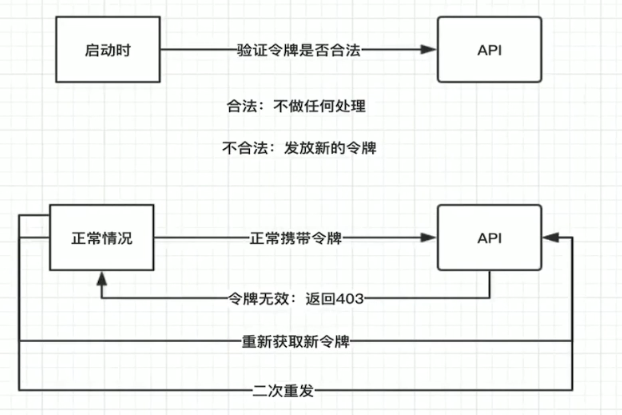

#  一、面向微信登录

> 面向微信登录是指：小程序端获得用户授权后从微信获取用户信息，因为小程序是微信生态的，用户信息微信本身就有，只要用户授权即可从微信获取。

* 获取用户公开信息 用open-data组件
* js中获取用户信息流程：button让用户授权----->js中再用wx.getUserInfo（）API获取用户信息

## 1 open-data

* 微信官方文档：[组件->开放能力->open-data]( https://developers.weixin.qq.com/miniprogram/dev/component/open-data.html )

* 只能直接展示在界面上  　　　因为是在WXML中获取的  JS中没有获取信息
* 只能展示用户自己的相关信息

## 2 wx.getUserInfo()

* 获取用户授权信息API： wx.getSetting()

* 获取用户信息API： wx.getUserInfo()

  ```
  getSetting()与getUserInfo() 配合使用
  1 用getSetting() 获取用户是否授权的信息 
  2 若已经授权 则用getUserInfo()获取用户信息
  3 若未授权  则用下方的button 弹出获取用户的权限的弹出框
  ```


* 使用前提: 必须是用户已经授权之后才可以调用这个接口  所以先用wx.getSetting获取用户授权情况 判断之后再使用wx.getUserInfo()

## 3 button

点击button 弹出获取用户权限的弹出框

```
<button class="login"
        open-type="getUserInfo"          //固定写法 获取开放能力  包括"getUserInfo"也是固定
        bindgetuserinfo="onGotUserInfo"> //bindgetuserinfo事件 会调用授权弹框  
        获取微信授权信息</button>
        
   //点击button 弹出获取用户权限的弹出框  选择“拒绝”或“允许”  选择后返回event      
  onGotUserInfo(event){
      console.log(event)     //授权与否  若授权等信息都在event中
    }
```

## 4 login云函数获取openId

* Cloud.getWXContext() 

* 通过小程序自带的login云函数获取openID 

* 返回值只有openId  和appId


#  二、面向服务端登录

> * 面向服务端登录是指：后端为自定义的服务端，向后端发送请求获取token，并在每次请求中携带token作为身份验证。
>
> * 该方式登录常见问题：token会过期，对于过期的处理引出了**无感知登录**的需求，即不影响用户的情况下在token过期后自动向服务端获取新的token

##  2.1 登录流程

> [微信官方文档-开发能力-小程序登录](https://developers.weixin.qq.com/miniprogram/dev/framework/open-ability/login.html)

* 该方式登录本质还是微信帮助进行了用户合法性的验证，只是验证合法后，将用户信息存储到了自建数据库中

##  2.2 无感知登录



###  2.2.1 实现流程

* 每次向服务端发送业务请求时，从本地缓存中取出token，发送给服务端
  * 若token存在（本地缓存中存在）且没有过期，则请求正常执行，从服务端获取需要的资源
  * 若token不存在或过期，服务端会返回403错误码，则执行下面两步操作
    * 1 重新获取新令牌：执行获取token的请求，从服务端获取新的token
    * 2 二次重发：再次发送业务请求（相当于第一次业务请求失败没有从服务端拿到数据，触发了重新获取token，再次发送业务请求获取需要的数据）

###  2.2.2 源码

* 封装Token类，提供getTokenFromServer()函数获取新的token

```js
class Token {
  getTokenFromServer() {
    return new Promise((resolve, reject) => {
      this._getToken(resolve,reject)
    })
  }

  _getToken(resolve,reject){
    wx.login({// 1 从微信获取登录凭证code
      success: (res) => {
        if (res.code) {
          //发起网络请求
          wx.request({
            url: 'http://localhost:3000/v1/token/', // 2 向服务端发送请求获取新token
            method: "POST",
            data: {
              account: res.code,
              type: 100 //小程序登录方式
            },
            success: (res) => {
              console.log(res.data)
              const status = res.statusCode.toString()
              //状态码以2开头，表示请求成功
              if (status.startsWith('2')) {
                wx.setStorageSync('token', res.data.token)// 3 将token存入本地缓存
                resolve()
              }
            },
            fail: (err)=> {
              reject()
            }
          })
        } else {
          reject()
          console.log('登录失败！' + res.errMsg)
        }
      }
    })
  }
}

export { Token }
```

* 在每次发送网络请求时，做token验证并执行重新获取token和二次重发的操作

```js
import {Base64} from 'js-base64'
import {config} from '../config.js'
import {Token} from './token.js'


class HTTP{
    request({url,data={},method='GET'}){
      return new Promise((resolve,reject)=>{
        this._request(url,resolve,reject,data,method)
      })
    }
    _request(url,resolve,reject,data={},method='GET', noRefetch=false){
        wx.request({
            method,
            data,
            url:config.api_base_url + url,
            header:{
                Authorization: this._encode() //将token传给服务端
            },
            success:(res)=>{
                let code = res.statusCode.toString()
                if (code.startsWith('2')){
                    //返回token验证成功
                  resolve(res)
                }
                else{
                    if(code == '403'){
                        //token过期
                        if(!noRefetch){
                            //重新获取token
                            this._refetch(
                                url,
                                resolve,
                                reject,
                                data,
                                method
                            )
                        }
                    }else{
                        //返回token验证失败
                        reject()
                    }
                }
            },
            fail:(err)=>{
                reject()
            }
        })

    }

    //刷新token，并二次重发
    _refetch(...param){
        let token = new Token()
        //刷新token
        token.getTokenFromServer().then((token) => {
            //二次重发
            this._request(...param, true)
        })
    }

    //给token进行base64加密
     _encode() {
        const token = wx.getStorageSync('token')
        const base64 = Base64.encode(token + ":")
        return 'Basic ' + base64
    }


}

export {HTTP}

```


#  三、强登录下的无感知登录解决方案

> 强登录即需要用户输入账户和密码才可登录，不同于微信小程序登录在不需要用户授权的情况下只需要调用微信API:wx.login()即可获取权限。强登陆情况下，当token过期后就需要用户输入账号和密码才能再次获取新的token,这会严重影响用户体验，所以需要无感知登录来实时刷新token

##  方案1： 保存用户账户和密码

> 该方式简单但是不推荐

* 在用户第一次登录时保存用户的账户和密码
* 当token过期时，直接从缓存拿到用户的账户和密码发送请求获取新的token,这样就避免了用户输入

##  方案2： 双令牌

* 1 用户登录时从服务端获取两个token
  * access_token: 即普通的token，用于验证用户合法性，假设设置过期时间为2小时
  * refresh_token: 用于验证是否可刷新获取新的access_token, 假设设置过期时间为30天

* 2 当access_token过期时（超过两小时）

  * 发送请求验证refresh_token是否过期（是否是30天内），若没有过期，则返回新的access_token, **同时返回更新过期时间的refresh_token**(保持每次获取新的access_token后refresh_token过期时间仍为30天),然后重新发送业务请求
* 发送请求验证refresh_token是否过期（是否是30天内），若过期，则需要用户输入账户和密码才可以登录，登录时获取新的access_token和refresh_token


